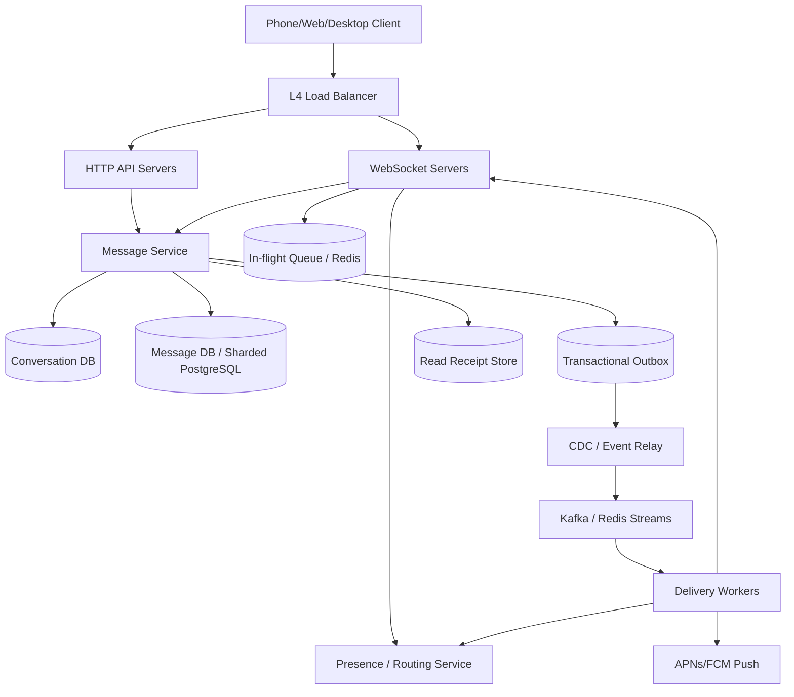

# 设计 1-to-1 Chat System（完整版）

## Phase 1: Define the Goals

### 功能需求

- 用户可以给另一个用户发送文本消息。
- 在线用户可以几乎实时收到消息，目标 `< 500ms`。
- 用户可以查看 1-to-1 conversation 的历史消息。
- 支持 read receipts 和 offline delivery：对方离线时消息不会丢，上线后补齐。

不做：群聊、频道、管理员、复杂权限、消息搜索、媒体附件。它们会显著改变 fanout、权限和存储模型。

### 关键澄清问题

- 可用性 vs 一致性：单个 conversation 内消息顺序更重要。可以接受小延迟，但不能把 `"hello"` 和 `"how are you"` 显示反。
- 消息保留多久：默认永久保存，除非产品要求隐私删除或 retention policy。
- 是否多设备：是。一个用户可能同时有手机、桌面端、Web。
- read receipt 粒度：read 按 user 级别；delivered 可以按 device 级别。

### 非功能需求

| Requirement | Target | Reason |
| --- | --- | --- |
| Scale | 100M DAU, 1B messages/day | 中等规模 chat 系统 |
| Latency | `< 500ms` online delivery | 需要像实时聊天 |
| Availability | 99.9%+ | 用户期待聊天可用 |
| Ordering | conversation 内严格有序 | 同一会话不能乱序 |
| Durability | no data loss after send ack | 发送成功后不能丢 |

### 粗略估算

- DAU：100M。
- 每人每天消息数：10。
- 总消息数：1B/day。
- 平均写 QPS：`1B / 86,400 ~= 11.5K msg/s`。
- 峰值写 QPS：按 3x 估算，约 `35K msg/s`；更保守可按 10x 到 `100K+ msg/s`。
- 同时在线用户：10% DAU，约 `10M WebSocket connections`。
- 单条消息大小：约 200B 文本 + metadata。只按 200B 算，`200GB/day`，一年约 `73TB`；加索引、副本、metadata 后可能是数百 TB/年。

结论：单机不够。需要分布式 WebSocket Gateway、分片消息存储、异步投递链路和补拉机制。

## Phase 2: Data Model & Database Schema

### 核心实体

```text
User
- user_id
- username
- email
- last_seen_at
- created_at

Device
- device_id
- user_id
- device_type
- push_token
- last_active_at

Conversation
- conversation_id
- participant_1
- participant_2
- created_at
- updated_at

Message
- message_id
- conversation_id
- sender_id
- client_message_id
- content
- sequence_number
- created_at

MessageStatus
- message_id
- device_id
- status(sent, delivered)
- updated_at

ReadReceipt
- user_id
- conversation_id
- last_read_sequence
- last_read_at
```

### Canonical Conversation

1-to-1 chat 可以用 canonical ordering 避免重复 conversation：

```text
participant_1 = min(user_a, user_b)
participant_2 = max(user_a, user_b)
UNIQUE(participant_1, participant_2)
```

这样 A 和 B 的聊天，无论从 A 发起还是 B 发起，都能查到同一行。

### 详细 SQL Schema（面试可写简化版）

```sql
CREATE TABLE users (
    user_id UUID PRIMARY KEY,
    username VARCHAR(50) UNIQUE NOT NULL,
    email VARCHAR(255) UNIQUE NOT NULL,
    last_seen_at TIMESTAMP,
    created_at TIMESTAMP DEFAULT NOW()
);

CREATE TABLE devices (
    device_id UUID PRIMARY KEY,
    user_id UUID NOT NULL REFERENCES users(user_id),
    device_type VARCHAR(20) NOT NULL,
    push_token VARCHAR(255),
    last_active_at TIMESTAMP DEFAULT NOW()
);

CREATE TABLE conversations (
    conversation_id UUID PRIMARY KEY,
    participant_1 UUID NOT NULL REFERENCES users(user_id),
    participant_2 UUID NOT NULL REFERENCES users(user_id),
    created_at TIMESTAMP DEFAULT NOW(),
    updated_at TIMESTAMP DEFAULT NOW(),
    CONSTRAINT participant_order CHECK (participant_1 < participant_2),
    UNIQUE (participant_1, participant_2)
);

CREATE TABLE messages (
    message_id UUID PRIMARY KEY,
    conversation_id UUID NOT NULL REFERENCES conversations(conversation_id),
    sender_id UUID NOT NULL REFERENCES users(user_id),
    client_message_id VARCHAR(64) NOT NULL,
    content TEXT NOT NULL,
    sequence_number BIGINT NOT NULL,
    created_at TIMESTAMP DEFAULT NOW(),
    UNIQUE (conversation_id, sequence_number),
    UNIQUE (conversation_id, sender_id, client_message_id)
);

CREATE TABLE message_status (
    message_id UUID NOT NULL REFERENCES messages(message_id),
    device_id UUID NOT NULL REFERENCES devices(device_id),
    status VARCHAR(20) NOT NULL DEFAULT 'sent',
    updated_at TIMESTAMP DEFAULT NOW(),
    PRIMARY KEY (message_id, device_id)
);

CREATE TABLE read_receipts (
    user_id UUID NOT NULL REFERENCES users(user_id),
    conversation_id UUID NOT NULL REFERENCES conversations(conversation_id),
    last_read_sequence BIGINT NOT NULL DEFAULT 0,
    last_read_at TIMESTAMP DEFAULT NOW(),
    PRIMARY KEY (user_id, conversation_id)
);
```

### 数据建模决策

- **Sequence number**
  - 不用 timestamp 排序。分布式机器有 clock skew，并发消息也可能同时间戳。
  - 每个 conversation 分配递增 `sequence_number`，用于排序、分页、补拉、去重。
- **Delivered vs Read**
  - Delivered：可以按 device 追踪，因为手机和 laptop 可能一个收到了，另一个没收到。
  - Read：按 user 追踪 high-water mark。用户读到 message #50，就等价于读到 #1-#49。
- **Sharding**
  - 消息表按 `conversation_id` shard。
  - 同一个 conversation 的消息在同一个 shard，历史读取和 seq 分配更容易。

## Phase 3: Client and Server Protocol

### 为什么用 WebSocket

| Protocol | How it works | Best for |
| --- | --- | --- |
| HTTP | Client request, server response | 历史消息、会话列表、发送消息也可以 |
| WebSocket | HTTP Upgrade 后保持长 TCP 连接 | 双向实时通信 |
| SSE | Server 单向推 client | 新闻流、ticker |

Chat 需要 server 主动推消息，也需要 client 发 ACK、read receipt。WebSocket 最自然。

WebSocket 连接如何保持：

- Client 先发 HTTP Upgrade。
- 建立后底层是一条长 TCP connection。
- Gateway 和 client 定期 ping/pong heartbeat。
- 如果心跳超时，Gateway 清理连接和 presence；Client reconnect 后用 cursor sync。

### WebSocket JSON Commands

Client -> Server:

```json
{
  "action": "send_message",
  "conversation_id": "conv_123",
  "content": "Hello!",
  "client_message_id": "local_456"
}
```

```json
{
  "action": "ack_message",
  "message_id": "msg_789",
  "device_id": "device_phone_1"
}
```

```json
{
  "action": "read_receipt",
  "conversation_id": "conv_123",
  "last_read_sequence": 42
}
```

```json
{ "action": "ping" }
```

Server -> Client:

```json
{
  "event": "new_message",
  "message_id": "msg_789",
  "conversation_id": "conv_123",
  "sender_id": "user_456",
  "content": "Hello!",
  "sequence_number": 42,
  "timestamp": "2024-01-15T10:30:00Z"
}
```

```json
{
  "event": "delivered",
  "message_id": "msg_789",
  "conversation_id": "conv_123",
  "device_id": "device_phone_1",
  "timestamp": "2024-01-15T10:30:01Z"
}
```

```json
{
  "event": "read",
  "conversation_id": "conv_123",
  "reader_id": "user_456",
  "last_read_sequence": 42
}
```

### HTTP API

```text
POST /conversations
- recipient_user_id
- 返回 conversation_id

GET /conversations?cursor=&limit=20
- 返回 conversation list, last_message, unread_count

GET /conversations/{id}/messages?before_sequence=&limit=50
- 向上滚动加载历史消息

GET /sync?cursor=
- reconnect 或多设备启动后补齐 missed updates
```

### Idempotency

`client_message_id` 是客户端生成的本地唯一 ID。网络抖动时，client 可能重复发送同一条消息。服务端用：

```text
UNIQUE(conversation_id, sender_id, client_message_id)
```

如果重复请求到来，直接返回已有 `message_id` 和 `sequence_number`，不创建第二条消息。

## Phase 4: System Architecture



### 组件职责

#### Load Balancer

- L4 LB 分发大量长连接到 WebSocket Servers。
- HTTP API 可以走 L7 LB。
- 注意 long-lived connection，不能用过短 idle timeout。

#### WebSocket Servers

- 维护客户端长连接。
- 保存本地连接表：

```text
connection_id -> user_id, device_id
user_id -> connection_ids
```

- 向 Presence/Routing Service 注册：

```text
user_id + device_id -> gateway_id + connection_id, ttl
```

- 接收 client ACK、read receipt、ping。
- 不作为 source of truth，重启后靠 client reconnect + sync 恢复。

#### Message Service

- 核心写路径。
- 负责 get-or-create conversation。
- 负责幂等检查。
- 分配 `sequence_number`。
- 写 messages、message_status/read models、outbox。
- 成功写入后才 ack sender。

#### Message DB

- source of truth。
- 可以从 Sharded PostgreSQL 开始，后续演进到 Cassandra/ScyllaDB/DynamoDB。
- shard key: `conversation_id`。
- query: `conversation_id + sequence_number range`。

#### Redis Cluster

- Presence / routing：谁在线、在哪台 WebSocket Server。
- In-flight queue：推送给设备后等待 ACK 的临时状态。
- 可选：Redis INCR 做 conversation sequence 生成。
- 注意：Redis Pub/Sub 是 at-most-once，不能作为消息可靠性的唯一保障。

#### Event Stream

- Kafka / Redis Streams。
- 用于异步 delivery、push、analytics。
- 推荐 Outbox/CDC 保证 DB write 和 event publish 不丢事件。

## Life of a Message

假设 User A 给 User B 发消息：

1. User A 的 client 通过 WebSocket 或 HTTP 发 `send_message`，带 `client_message_id`。
2. WebSocket Server / API Server 把请求交给 Message Service。
3. Message Service 找到或创建 A-B conversation。
4. Message Service 分配下一个 `sequence_number`。
5. Message Service 写入 Message DB。
6. Message Service 写 Outbox event。
7. Message Service 返回 sender：`message_id`, `sequence_number`, `sent`。
8. Event Relay 把 outbox event 发到 Kafka/Redis Streams。
9. Delivery Worker 查 User B 的在线 devices。
10. 如果 B 在线，Worker 通过对应 WebSocket Server push。
11. WebSocket Server 把 message 放入 in-flight queue。
12. B 的设备收到后发 ACK。
13. WebSocket Server / Message Service 更新 `message_status = delivered`，从 in-flight queue 移除。
14. 如果 B 离线，消息仍在 Message DB；Push Service 发移动端通知；B 上线后按 last_seen_seq 补拉。

## Routing Problem

问题：User A 在 WebSocket Server 1，User B 在 WebSocket Server 2。系统如何找到 B？

### 方案 1：Redis Pub/Sub per-user channel

- B 连接到 Server 2 时，Server 2 subscribe `user:B`。
- 发送给 B 时 publish 到 `user:B`。
- Redis 把消息交给 Server 2。

优点：简单，延迟低。

缺点：Redis Pub/Sub 是 at-most-once；server crash 或短暂断开会丢事件。适合在线 hint，不适合 delivery guarantee。

### 方案 2：Presence/Routing Store

- B 连接时写：

```text
user:B -> server_2, connection_ids, ttl
```

- Delivery Worker 查 routing store，直接 RPC/gRPC 到 Server 2 或通过 gateway internal bus 推送。

优点：更可控，可结合重试、超时、fallback。

缺点：需要维护 routing state 和 TTL。

推荐：面试基础版可以讲 Redis Pub/Sub；Staff+ 版要说明它不可靠。真正的可靠性来自 Message DB + cursor/inbox。

## Handling Offline Users

- 如果 User B 离线，消息仍然写入 Message DB。
- B 的每个 device 有自己的 `last_seen_sequence` 或 sync cursor。
- B 上线后调用：

```text
GET /conversations/{id}/messages?after_sequence=last_seen
```

- 服务端返回所有 `sequence_number > last_seen` 的消息。
- 如果需要更精确的 delivered 状态，可以维护 per-device inbox / message_status。

## Storage & Sharding

### Shard by Conversation

- 所有 Chat 123 的消息在同一 shard。
- 所有 Chat 456 的消息在另一 shard。
- 这样历史读取很快，也容易保证 conversation 内顺序。

### PostgreSQL 到 NoSQL 的演进

- 初期：Sharded PostgreSQL。
  - 优点：事务、唯一约束、SQL schema 清晰。
  - 缺点：1B/day 长期增长下，分片和归档压力大。
- 大规模：Cassandra/ScyllaDB/DynamoDB。
  - 优点：append-heavy timeline、水平扩展强。
  - 缺点：事务和唯一约束弱，需要应用层幂等。

## 系统深挖与 Trade-off

### 1. Message Ordering：Redis INCR vs DB sequence vs Sequencer Actor

- 问题：
  - 同一个 conversation 内，消息必须严格有序。
  - 不能只用 timestamp，因为机器时钟可能不同步。
- 方案 A：Redis INCR
  - 适用场景：
    - 需要快速生成 per-conversation sequence。
  - ✅ 优点：
    - Redis 单线程命令原子，`INCR seq:{conversation_id}` 很快。
  - ❌ 缺点：
    - 如果 Redis INCR 成功但 DB insert 失败，会出现 sequence gap，例如 1, 2, 4。
    - Redis 持久化和故障恢复也要设计清楚。
- 方案 B：DB conditional update
  - 适用场景：
    - 中等规模，优先简单正确。
  - ✅ 优点：
    - 可以和 message insert 放在同一个事务里，语义清楚。
  - ❌ 缺点：
    - 热门 conversation 会打爆 `last_seq` 单行。
- 方案 C：Sequencer Actor / shard-local writer
  - 适用场景：
    - 高规模，需要按 conversation 串行化写入。
  - ✅ 优点：
    - 同一 conversation 天然有序，吞吐好。
  - ❌ 缺点：
    - actor failover、rebalance、状态恢复复杂。
- 推荐：
  - 面试基础版可以说 Redis INCR，并承认 gap 问题。
  - 更稳的 Staff+ 推荐：初期 DB transaction，规模上来后迁移到 conversation-sharded sequencer。
  - 客户端要能处理 seq gap：发现缺口后主动补拉，而不是永远等待。

### 2. Latency vs Durability：先 ack 还是先落库

- 问题：
  - 要不要先告诉 sender “发送成功”，再异步写 DB？
- 方案 A：先 ack，再异步落库
  - ✅ 优点：
    - 延迟最低，用户感觉快。
  - ❌ 缺点：
    - 服务崩溃可能丢消息；产品语义危险。
- 方案 B：DB commit 后 ack
  - ✅ 优点：
    - sender 看到 sent 代表消息已经 durable。
  - ❌ 缺点：
    - DB 写延迟进入用户感知路径。
- 方案 C：两级 ACK
  - ✅ 优点：
    - `accepted` 和 `persisted` 分开，体验和正确性都可表达。
  - ❌ 缺点：
    - 客户端状态机复杂。
- 推荐：
  - 默认 DB commit 后 ack。
  - 保护的 invariant 是：发送成功后不丢消息。
  - 如果需要极致体验，客户端可以 optimistic render，但 server ack 仍代表 durable。

### 3. Delivery Guarantee：WebSocket push vs In-flight Queue vs Cursor Sync

- 问题：
  - 在线 push 失败或客户端没 ACK 时怎么办？
- 方案 A：只 WebSocket push
  - ✅ 优点：
    - 简单、延迟低。
  - ❌ 缺点：
    - 断线、server crash、网络切换都会丢实时事件。
- 方案 B：In-flight queue + device ACK
  - ✅ 优点：
    - 能知道某个 device 是否收到。
    - 未 ACK 可以重试。
  - ❌ 缺点：
    - 需要清理、重试、去重、过期策略。
- 方案 C：Message Store + cursor sync
  - ✅ 优点：
    - 最可靠，状态简单。
  - ❌ 缺点：
    - 不提供精确 per-device delivered 状态。
- 推荐：
  - Message Store + cursor sync 是可靠性底座。
  - 如果题目要求 delivered receipt，则加 per-device message_status 或 in-flight queue。
  - WebSocket push 只负责低延迟，不负责最终正确性。

### 4. Routing：Redis Pub/Sub vs Routing Store

- 问题：
  - 多台 WebSocket Server 中，怎么找到目标用户连接？
- 方案 A：Redis Pub/Sub user channel
  - ✅ 优点：
    - 简单，server 订阅 `user:{id}` 即可。
  - ❌ 缺点：
    - at-most-once，不适合可靠消息。
    - 大量在线用户意味着大量 subscription，运维复杂。
- 方案 B：Redis Routing Store
  - ✅ 优点：
    - `user_id -> gateway_id` 查询明确。
    - 可以配合 RPC retry。
  - ❌ 缺点：
    - 需要 TTL、心跳、server crash 清理。
- 方案 C：Consistent hashing / sticky routing
  - ✅ 优点：
    - 可以减少跨 server 查找。
  - ❌ 缺点：
    - rebalance 和故障处理复杂。
- 推荐：
  - 用 Redis/Routing Store 管在线连接位置。
  - Redis Pub/Sub 可作为轻量通知，但不能作为唯一 delivery guarantee。

### 5. Read Receipts：高频写入与 Debounce

- 问题：
  - 用户快速滚动可能 1 秒内读过 100 条消息，不能每条都写 DB。
- 方案 A：每条消息读到都写一次
  - ✅ 优点：
    - 状态精确。
  - ❌ 缺点：
    - 写放大严重。
- 方案 B：High-water mark
  - ✅ 优点：
    - 只存 `last_read_sequence`，读到 #50 等价于读到 #1-#49。
  - ❌ 缺点：
    - 不适合非线性阅读模型，但聊天通常线性。
- 方案 C：Client-side debounce
  - ✅ 优点：
    - 减少写入，把几秒内多次阅读合并。
  - ❌ 缺点：
    - read receipt 有轻微延迟。
- 推荐：
  - 使用 high-water mark + debounce。
  - Server 只接受更大的 `last_read_sequence`，用 `max(old, new)` 更新。

### 6. Multi-device Sync：per-device delivered vs user-level read

- 问题：
  - 一个用户有手机和 laptop，消息和已读状态如何同步？
- 方案 A：只按 user 追踪
  - ✅ 优点：
    - 简单。
  - ❌ 缺点：
    - 不知道哪个设备真正收到。
- 方案 B：Delivered 按 device，Read 按 user
  - ✅ 优点：
    - delivery 精确，read 语义符合用户心智。
  - ❌ 缺点：
    - 多一张 `message_status` 表，写入更多。
- 方案 C：每个设备维护独立 cursor
  - ✅ 优点：
    - sync 精细。
  - ❌ 缺点：
    - read receipt 聚合复杂。
- 推荐：
  - Delivered per-device，Read per-user high-water mark。
  - 手机读到 #50 后 laptop 下次 sync 看到 user-level `last_read_sequence=50`，UI 自动更新。

### 7. DB and Event Consistency：direct publish vs Outbox/CDC

- 问题：
  - Message DB 写成功但 Pub/Sub publish 失败怎么办？
- 方案 A：写 DB 后直接 publish
  - ✅ 优点：
    - 简单。
  - ❌ 缺点：
    - DB 和 event stream 之间有一致性缺口。
- 方案 B：2PC
  - ✅ 优点：
    - 强一致。
  - ❌ 缺点：
    - 慢、复杂、可用性差。
- 方案 C：Transactional Outbox + CDC
  - ✅ 优点：
    - message 和 outbox 同事务写入。
    - relay 可以重试、replay。
  - ❌ 缺点：
    - 增加组件，事件有轻微延迟。
- 推荐：
  - 用 Outbox/CDC。
  - Source-of-truth write 和 derived event pipeline 解耦。

### 8. Storage：PostgreSQL Sharding vs Wide-column Store

- 问题：
  - 1B messages/day，长期保存时数据量很大。
- 方案 A：Sharded PostgreSQL
  - ✅ 优点：
    - SQL、事务、唯一约束、schema 清楚。
  - ❌ 缺点：
    - 水平扩展和超大 append workload 更难。
- 方案 B：Cassandra/ScyllaDB/DynamoDB
  - ✅ 优点：
    - 适合按 partition append 和 range read。
  - ❌ 缺点：
    - 事务和唯一约束较弱。
- 方案 C：冷热分层
  - ✅ 优点：
    - 近期消息放高性能 store，旧消息归档 object storage。
  - ❌ 缺点：
    - 查询路径更复杂。
- 推荐：
  - 面试基础版用 Sharded PostgreSQL 好解释。
  - 大规模生产可用 wide-column store，按 `conversation_id + sequence_number` 建模。
  - 如果保留永久消息，必须设计归档、压缩、TTL/隐私删除策略。

## 扩展方案

- 单 region 多 AZ 起步，保证 Message DB 高可用。
- WebSocket Server 水平扩展，按连接数和网络带宽扩容。
- Message DB 按 `conversation_id` shard。
- Redis Cluster 管 presence/routing/in-flight 临时状态。
- Kafka/Redis Streams 管异步 delivery events。
- 多 region 时 conversation 固定 home region，写入回 home region；其他 region 做异步复制和就近 WebSocket 接入。

## Final Review Checklist

### Basics

- 是否确认只做 1-to-1？
- 是否列出 send、receive、history、read receipt、offline delivery？
- 是否做了 QPS、connection、storage 估算？

### Data & API

- 是否解释 User、Device、Conversation、Message、MessageStatus、ReadReceipt？
- 是否解释 canonical participant ordering？
- 是否解释为什么用 sequence number 而不是 timestamp？
- 是否解释 `client_message_id` 幂等？

### Architecture

- 是否画出 WebSocket Server、Message Service、DB、Redis、Event Stream？
- 是否解释 routing problem？
- 是否解释 offline delivery 和 reconnect sync？

### Deep Dives

- 是否讲清 message ordering？
- 是否讲清 latency vs durability？
- 是否讲清 read receipt debounce？
- 是否讲清 multi-device support？
- 是否讲清 Redis Pub/Sub / Redis INCR 的 trade-off？

## Quick Summary Table

| Feature | Solution | Why |
| --- | --- | --- |
| Connection | WebSocket | 实时、双向、低延迟 |
| Message creation | HTTP POST 或 WebSocket command + idempotency | 发送语义清晰 |
| Routing | Redis routing store / PubSub optional | 找到用户所在 WebSocket Server |
| Storage | Sharded PostgreSQL -> Wide-column store | 可靠保存和按会话读取 |
| Ordering | conversation-local sequence number | 避免 clock skew |
| Offline | Message Store + cursor sync | 不依赖实时 push |
| Delivery status | per-device message_status / in-flight queue | 多设备准确 delivered |
| Read status | user-level high-water mark | 高效，减少写入 |
| Presence | Redis heartbeat / TTL | 快速、弱一致即可 |

## 面试亮点

- 关键 invariant：发送成功代表消息已持久化；WebSocket push 成功不是持久化成功。
- 关键 ordering 判断：只做 per-conversation ordering，不做 global ordering。
- 关键可靠性判断：WebSocket、Redis Pub/Sub、presence 都不是 source of truth。
- 关键幂等判断：client retry 和 worker retry 都靠 idempotency/dedup，而不是 exactly-once。
- 关键扩展判断：1-to-1 没有群聊 fanout 爆炸，但有 10M 长连接和 1B/day append storage。
- 关键 Staff+ 表达：先定义 correctness boundary，再把实时推送、read receipt、presence 都放到 derived/async path。

## 一句话总结

1-to-1 chat 的核心是把可靠消息持久化、conversation 内顺序、实时 WebSocket 投递和断线补齐拆开：DB/Message Store 是 source of truth，WebSocket 负责低延迟体验，Redis/stream 负责路由和异步投递，客户端靠 sequence cursor 保证最终不漏不乱。
