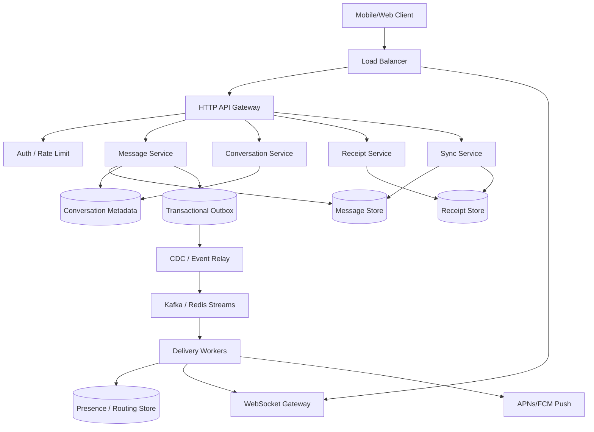

# 设计 1-to-1 Chat System

[https://www.1point3acres.com/interview/problems/post/7100098](https://www.1point3acres.com/interview/problems/post/7100098)

## 功能需求

- 用户可以发送和接收 1-to-1 文本消息。
- 在线用户实时收到消息；离线用户上线后补齐。
- 支持会话历史分页读取。
- 支持多设备同步和 read receipt。

## 非功能需求

- 规模：100M DAU，1B messages/day，峰值按 100K msg/s 级别设计。
- 延迟：在线投递 P99 `< 500ms`。
- 可靠性：发送成功后消息不能丢。
- 顺序：只保证单个 conversation 内严格有序，不做全局有序。
- 可用性：实时推送可降级，但消息持久化链路必须可靠。

## API 设计

```text
POST /messages
- conversation_id, sender_id, client_msg_id, content
- 返回 message_id, conversation_seq, server_ts, status

GET /conversations/{conversation_id}/messages?after_seq=&limit=
- 拉历史或断线补齐

POST /conversations/{conversation_id}/read
- user_id, device_id, read_seq
- 更新该用户在该会话里的最大已读位置

GET /sync?cursor=
- 多设备/重连后同步 missed messages、read receipts、conversation updates

GET /conversations
- 返回用户会话列表、last_message、unread_count
```

## 高层架构




## 重要讨论点


| 深挖点       | 方案 A                             | 方案 B                          | 方案 C                      | 推荐表达                                        |
| --------- | -------------------------------- | ----------------------------- | ------------------------- | ------------------------------------------- |
| 发消息协议     | WebSocket send：低延迟但 retry/ack 复杂 | HTTP POST send：幂等、限流、观测成熟     | 双协议 fallback：体验好但复杂       | 用 HTTP POST 发消息，WebSocket 收消息；发送成功语义必须清楚    |
| 消息顺序      | timestamp 排序：简单但不可靠              | conversation-local seq：严格且可分页 | 全局 sequencer：语义统一但瓶颈      | 只做 per-conversation ordering                |
| 实时投递      | 只 push：低延迟但会丢                    | push + cursor 补拉：可靠且简单        | durable inbox：送达状态更精确但写放大 | 1-to-1 可用 cursor 补拉，若要 delivered 状态再加 inbox |
| DB 与事件一致性 | 先 DB 再 publish：可能 publish 失败     | 2PC：强一致但重                     | Outbox/CDC：可靠、可重放         | 用 transactional outbox                      |
| Presence  | 强一致 DB 心跳：太重                     | Redis TTL：简单但弱一致              | gateway local + Redis 汇总  | Presence 是 hint，用弱一致                        |


## 关键组件

### HTTP API Gateway

- 负责认证、限流、请求路由。
- 发消息走 HTTP POST，便于使用 `client_msg_id` 做幂等。
- 不维护长连接，不做消息持久化。

### WebSocket Gateway

- 负责维护客户端长连接和在线消息下发。
- WebSocket 通过 HTTP Upgrade 建立，底层保持 TCP 长连接。
- 用 heartbeat / ping-pong 检测断线。
- Gateway 是易失状态；重启、断网后客户端必须 reconnect + sync。
- 注意：WebSocket 不是可靠存储，只是低延迟通道。

### Message Service

- 发消息主链路核心。
- 校验 sender 是否属于 conversation。
- 用 `(sender_id, client_msg_id)` 保证发送幂等。
- 分配 conversation 内单调递增 `seq`。
- 写 Message Store 和 Outbox。
- 成功 ack 的语义：消息已经持久化。

### Conversation Service

- 管理 1-to-1 conversation metadata。
- 对两个用户生成唯一 conversation，可用 `min(userA,userB)#max(userA,userB)` 或单独 conversation id。
- 维护 last message、last seq、updated_at。
- 会话列表可作为 read model，允许最终一致。

### Delivery Workers

- 消费 message event。
- 查询 receiver 在线设备。
- 在线则通过 WebSocket Gateway 推送。
- 离线则触发 push notification。
- Worker 是 at-least-once，所以客户端必须按 `(conversation_id, seq)` 去重。

### Receipt Service

- 存 `conversation_id + user_id -> read_seq`。
- 多设备取 max。
- Read receipt 可以最终一致，不阻塞发消息。

## 核心流程

### 发送消息

- Client 调 `POST /messages`，带 `client_msg_id`。
- API 做 auth、rate limit。
- Message Service 校验 conversation membership。
- 为 conversation 分配下一个 `seq`。
- 原子写入 Message Store 和 Outbox。
- 返回 `message_id + seq`。
- CDC/Event Relay 把 outbox 事件发到 stream。
- Delivery Worker 异步推送给 receiver 在线设备。

### 在线收消息

- Receiver 的设备保持 WebSocket 连接。
- Delivery Worker 查 `user_id -> gateway connection_ids`。
- Gateway push message。
- Client 按 `seq` 插入本地会话。
- 如果发现 seq gap，例如本地 100，收到 103，则调用历史 API 补 101/102。

### 离线补齐

- 用户重新上线，建立 WebSocket。
- Client 调 `GET /sync?cursor=` 或按 conversation 带 last_seen_seq。
- Sync Service 从 Message Store / Receipt Store 返回 missed updates。
- Client 去重合并后继续接收实时推送。

### Read receipt

- Receiver 打开会话后上报 `read_seq`。
- Receipt Service 更新 `max(read_seq)`。
- 异步通知 sender 的在线设备。
- Sender 离线则下次 sync 获取 receipt update。

## 存储选择

### Message Store：Cassandra / ScyllaDB / DynamoDB

- Source of truth。
- Key: `conversation_id`
- Sort key: `seq`
- 查询模式：按会话分页读最近 N 条消息。

```text
messages(
  conversation_id,
  seq,
  message_id,
  sender_id,
  content,
  server_ts,
  client_msg_id
)
```

### Conversation Metadata：MySQL/Postgres/KV

- 存 participants、last_seq、last_message、updated_at。
- 也可以存 user conversation index。

```text
conversations(conversation_id, user_a, user_b, last_seq, updated_at)
user_conversations(user_id, conversation_id, last_read_seq, unread_count)
```

### Receipt Store：KV / Wide-column

- `conversation_id + user_id -> read_seq`
- Read receipt 是派生状态，可最终一致。

### Presence / Routing Store：Redis

- `user_id -> device_id -> gateway_id/connection_id`
- TTL 心跳，弱一致。

### Event Stream：Kafka / Redis Streams

- 承载 `MessageCreated`、`ReceiptUpdated` 等事件。
- 可重放，用于 delivery、push、analytics。

## 扩展方案

- 初期：单 region，多 AZ；HTTP API、Message Service、WebSocket Gateway 水平扩展。
- 中期：Message Store 按 `conversation_id` 分片，Kafka 按 `conversation_id` partition。
- 高峰：引入 shard-local sequencer 或 conversation actor，解决热门 conversation seq 分配热点。
- 多 region：conversation 固定 home region；写入路由到 home region，跨 region 异步复制。
- 全球低延迟：用户就近接入 WebSocket，但消息写入仍回 conversation home region，避免跨 region 顺序冲突。

## 系统深挖与 Trade-off

### 1. 发消息协议：WebSocket send vs HTTP POST

- 问题：
  - 消息发送到底走 WebSocket 还是 HTTP？这影响 retry、ack、限流和观测。
- 方案 A：WebSocket 发送和接收都走同一条连接
  - 适用场景：极低延迟互动。
  - ✅ 优点：少一次 HTTP 请求，双向通信自然。
  - ❌ 缺点：连接断开时发送语义复杂；需要自定义 retry、ack、backpressure。
- 方案 B：HTTP POST 发送，WebSocket 接收
  - 适用场景：大规模生产 chat。
  - ✅ 优点：HTTP retry、LB、auth、observability 成熟；幂等容易做。
  - ❌ 缺点：比纯 WebSocket 多一点请求开销。
- 方案 C：WebSocket send + HTTP fallback
  - 适用场景：强实时且移动网络复杂。
  - ✅ 优点：体验最好。
  - ❌ 缺点：客户端状态机复杂。
- 推荐：
  - 当前设计用 HTTP POST 发消息，WebSocket 收消息。
  - 保护的 invariant 是：`send success == durable write success`。
  - 如果追求极致延迟，可以增加 WebSocket send，但必须保留同样的幂等和 ack 语义。

### 2. 消息顺序：timestamp vs conversation-local seq vs global sequencer

- 问题：
  - 同一会话里消息不能乱序，但分布式机器时间不可靠。
- 方案 A：server timestamp 排序
  - ✅ 优点：简单。
  - ❌ 缺点：时钟漂移、同毫秒冲突、跨机并发都会导致顺序不稳定。
- 方案 B：每个 conversation 一个递增 `seq`
  - ✅ 优点：满足用户视角；分页、补拉、去重都简单。
  - ❌ 缺点：并发写同一 conversation 时需要 seq 分配机制。
- 方案 C：全局 sequencer
  - ✅ 优点：所有消息统一排序。
  - ❌ 缺点：巨大瓶颈；业务也不需要全局顺序。
- 推荐：
  - 使用 conversation-local `seq`。
  - 不做全局顺序，这是关键范围收缩。
  - Correctness boundary 是 per-conversation ordering。

### 3. `seq` 如何生成：DB conditional update vs sequencer actor

- 问题：
  - 两个用户可能同时给同一个 conversation 发消息，seq 必须唯一递增。
- 方案 A：Conversation metadata 里 conditional update `last_seq`
  - ✅ 优点：简单，容易实现。
  - ❌ 缺点：热门 conversation 会形成单行热点。
- 方案 B：按 `conversation_id` 路由到 shard-local sequencer / actor
  - ✅ 优点：同一 conversation 串行化，吞吐更高。
  - ❌ 缺点：actor failover、rebalance、状态恢复更复杂。
- 方案 C：Kafka partition 内顺序作为 seq 来源
  - ✅ 优点：复用日志顺序。
  - ❌ 缺点：Kafka ack 和 DB commit 语义要小心，不能混淆。
- 推荐：
  - 初期用 DB conditional update。
  - 大规模后演进到 conversation-sharded sequencer。
  - 面试表达：先选简单正确方案，再针对真实热点演进。

### 4. Delivery guarantee：只 WebSocket push vs cursor 补拉 vs durable inbox

- 问题：
  - Receiver 在线时希望实时收到；断线时不能丢。
- 方案 A：只依赖 WebSocket push
  - ✅ 优点：低延迟，简单。
  - ❌ 缺点：Gateway crash、网络断开、客户端休眠都会丢。
- 方案 B：WebSocket push + Message Store cursor 补拉
  - ✅ 优点：实时性和可靠性解耦；写路径轻。
  - ❌ 缺点：无法精确知道每条消息是否送达到每个设备。
- 方案 C：维护 per-user durable inbox
  - ✅ 优点：可以精确跟踪 pending/delivered。
  - ❌ 缺点：写放大和状态清理复杂。
- 推荐：
  - 对 1-to-1 chat，用 Message Store + cursor 补拉作为可靠基础。
  - 如果产品强要求 delivered 状态，再加 inbox。
  - WebSocket 是 visibility optimization，不是 source of truth。

### 5. DB write 和事件发布一致性：direct publish vs 2PC vs Outbox/CDC

- 问题：
  - DB 写成功但 event publish 失败，会导致消息持久化了但没人推送。
- 方案 A：写 DB 后直接 publish
  - ✅ 优点：实现简单。
  - ❌ 缺点：DB 和 MQ 之间有一致性缺口。
- 方案 B：2PC
  - ✅ 优点：强一致。
  - ❌ 缺点：慢、复杂、影响可用性，不适合高吞吐聊天。
- 方案 C：Transactional Outbox + CDC
  - ✅ 优点：message 和 outbox 同事务写入；event 可重放。
  - ❌ 缺点：事件有轻微延迟，需要 relay 组件。
- 推荐：
  - 使用 Outbox/CDC。
  - Source-of-truth write 是 correctness boundary；delivery/search/push 都是 derived path。

### 6. Exactly-once：是否需要

- 问题：
  - 客户端会重试，MQ 会重复投递，WebSocket 也可能重发。
- 方案 A：承诺 exactly-once
  - ✅ 优点：产品语义听起来简单。
  - ❌ 缺点：分布式系统中成本极高，通常不可真正保证。
- 方案 B：at-least-once + 幂等
  - ✅ 优点：工程可行。
  - ❌ 缺点：每层都要设计 dedup key。
- 方案 C：客户端本地 optimistic message + server reconcile
  - ✅ 优点：体验好。
  - ❌ 缺点：客户端状态机更复杂。
- 推荐：
  - 服务端用 `(sender_id, client_msg_id)` 防重复创建。
  - 客户端用 `(conversation_id, seq)` 防重复展示。
  - 明确说：系统是 at-least-once delivery + idempotency，不是 exactly-once。

### 7. Presence：强一致 DB vs Redis TTL

- 问题：
  - Delivery Worker 怎么知道用户在哪个 Gateway 上在线？
- 方案 A：每次 heartbeat 写 DB
  - ✅ 优点：数据持久。
  - ❌ 缺点：心跳写入量巨大，DB 被无意义流量打爆。
- 方案 B：Redis TTL presence
  - ✅ 优点：简单，自动过期。
  - ❌ 缺点：弱一致，可能有短暂误判。
- 方案 C：Gateway local state + Redis 汇总
  - ✅ 优点：本地快，全局可查。
  - ❌ 缺点：Gateway crash 后靠 TTL 收敛。
- 推荐：
  - Presence 是 hint，不是 durable fact。
  - 用 Redis TTL 或 Gateway local + Redis。
  - 推送失败后客户端仍可 sync，因此弱一致可接受。

### 8. Read receipt：强一致 vs 最终一致

- 问题：
  - Sender 想知道对方是否已读，但 read receipt 不应影响发消息主链路。
- 方案 A：同步强一致更新
  - ✅ 优点：状态最准确。
  - ❌ 缺点：读消息路径变重，跨设备/跨 region 延迟更高。
- 方案 B：最终一致 read_seq
  - ✅ 优点：轻量，足够满足体验。
  - ❌ 缺点：短时间可能显示滞后。
- 方案 C：每设备 read state
  - ✅ 优点：多设备精细。
  - ❌ 缺点：产品语义复杂，sender 不一定需要知道哪个设备读了。
- 推荐：
  - 存 user-level `read_seq = max(device_read_seq)`。
  - 异步通知 sender。
  - Read receipt 是 derived state，不阻塞消息持久化。

## 面试亮点

- 可以深挖：消息顺序只需要 per-conversation，不要引入 global ordering。
- 可以深挖：WebSocket 是低延迟通道，不是可靠消息存储。
- 可以深挖：发送成功、持久化成功、投递成功、已读是不同状态，ack 语义要讲清楚。
- Staff+ 判断点：Message Store 是 source of truth；presence、push、receipt、conversation list 都是 derived state。
- Staff+ 判断点：不要承诺 exactly-once，用 at-least-once + idempotency 才是现实工程方案。
- Staff+ 判断点：Outbox/CDC 解决 DB write 和 event publish 的一致性缺口。

## 一句话总结

- 1-to-1 chat 的核心是：消息先以 conversation-local seq 持久化到 source of truth，再通过异步事件推 WebSocket；实时链路失败不影响正确性，客户端用 cursor/sync 补齐所有缺口。

