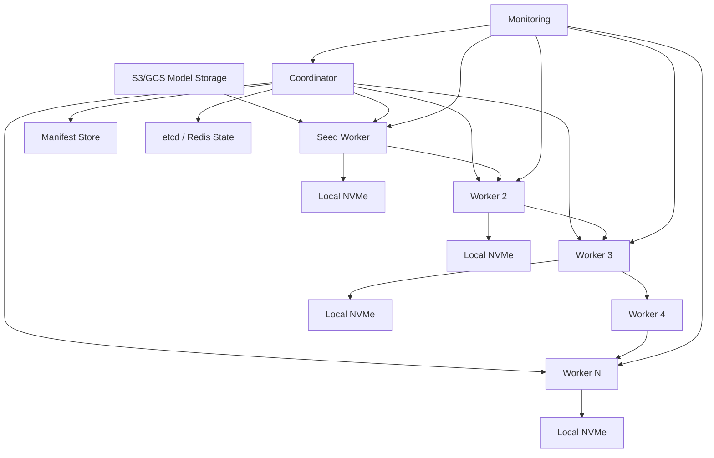

# Distributed Model Deployment System Design

https://chatgpt.com/g/g-67a038d447348191aeb993eba9dd9c4c-deep-research/c/69e68631-e7c8-83e8-8f42-eb2c794bd0da

## 1. 需求澄清

### 功能需求

1. 将一个 500GB 的大模型部署到 100-1000 台 GPU worker。
2. 支持模型版本化、完整性校验、原子切换和快速回滚。
3. 支持 worker crash、网络中断、chunk 损坏后的自动恢复。
4. 尽可能缩短整体部署时间，而不是只优化单台机器下载速度。

### 非功能需求

| 需求 | 目标 |
|---|---|
| 模型大小 | 500GB |
| Worker 数量 | 100-1000 台，进一步讨论 10000 台 |
| 外部带宽 | 10Gbps |
| 内部带宽 | 每台 worker 10Gbps download + 10Gbps upload，full-duplex |
| 可靠性 | 单个 worker crash 不影响整体部署 |
| 正确性 | 每个 chunk 校验，最终模型全局校验 |
| 可观测性 | 可查看进度、吞吐、失败节点、ETA |

核心假设：

- 目标是把模型文件分发到所有 GPU worker 的本地磁盘。
- 模型加载到 GPU memory 可以作为部署完成后的下一阶段，不放在主链路里。
- 模型源文件在 S3/GCS 等外部对象存储中。

## 2. 核心结论

不要让每台 worker 都直接从 S3/GCS 下载，也不要简单用二叉树分发。

推荐方案是：

> Chunked Pipeline Distribution  
> 把 500GB 模型切成很多 chunk，例如 1GB/chunk。W1 从外部存储下载 chunk 0 后立刻转发给 W2，同时 W1 继续下载 chunk 1。W2 收到 chunk 0 后立刻转发给 W3。这样每台机器同时 download + upload，充分利用 full-duplex 内网。

整体结构：

```text
S3/GCS
  |
  v
Seed Worker W1
  |
  v
W2 -> W3 -> W4 -> ... -> W100
```

## 3. 容量估算

500GB 模型，10Gbps = 1.25GB/s。

外部下载下限：

```text
500GB / 1.25GB/s = 400s ≈ 6.7min
```

这是理论下限：只要外部总带宽只有 10Gbps，至少要 400 秒才能把模型拉进数据中心。

如果 chunk size = 1GB：

```text
每个 chunk 传一跳时间 = 1GB / 1.25GB/s = 0.8s
```

100 台 worker pipeline：

```text
总时间 ≈ 外部下载时间 + 最后一个 chunk 传播到最后一台的时间
     ≈ 400s + 99 * 0.8s
     ≈ 479s
     ≈ 8min
```

1000 台 worker 单链 pipeline：

```text
400s + 999 * 0.8s ≈ 1199s ≈ 20min
```

对比：

```text
每台机器直接下载：
100 台共享 10Gbps，每台 0.1Gbps
500GB / 0.0125GB/s ≈ 11h

二叉树：
root 下载 400s
每一层 parent 要把带宽分给两个 child，每个 child 约 5Gbps
传完整模型给下一层约 800s
100 台约 7 层，接近 400 + 7 * 800 = 100min
```

所以 pipeline 的优势是：不是每层都重新传完整模型，而是边下载边转发，每条链路持续满载。

## 4. API 设计

### Coordinator API

```text
POST /deployments
{
  "model_id": "llama-70b",
  "version": "2026-05-23-001",
  "source_url": "s3://bucket/model",
  "target_workers": ["w1", "w2", "..."]
}

GET /deployments/{deployment_id}
```

### Worker API

```text
POST /workers/register

POST /workers/heartbeat
{
  "worker_id": "w12",
  "deployment_id": "dep_123",
  "status": "downloading",
  "chunks_received": [0, 1, 2, 3],
  "upstream": "w11",
  "downstream": "w13"
}

GET /chunks/{deployment_id}/{chunk_id}
```

### Manifest

```text
Manifest
- model_id
- version
- total_size
- chunk_size
- num_chunks
- chunks: [{chunk_id, offset, size, sha256}]
- global_sha256
```

## 5. 高层架构



## 6. 关键组件

### Coordinator

职责：

- 生成或读取 manifest。
- 选择 worker topology。
- 分发部署计划。
- 监控 worker heartbeat。
- 记录每个 worker 拥有哪些 chunks。
- 失败时重连链路。
- 最后触发模型激活。

Coordinator 只走控制面，不走 500GB 数据面。真正的数据传输是 worker-to-worker。

### Worker

职责：

- 从 upstream 接收 chunk。
- 校验 chunk SHA256。
- 写入本地 NVMe。
- 一旦 chunk 可用，马上转发给 downstream。
- 完成后做 global checksum。
- 原子切换模型版本。

本地目录可以这样设计：

```text
/models/llama-70b/
  versions/
    2026-05-23-001.tmp/
    2026-05-23-001/
  current -> versions/2026-05-23-001
```

只有完整校验成功后，才把 `.tmp` rename 成正式目录，然后切换 `current` symlink。

## 7. 数据流

### 部署开始

```text
1. Coordinator 创建 deployment。
2. Coordinator 下载或生成 manifest。
3. Coordinator 选择 worker 顺序，例如 W1 -> W2 -> W3。
4. 所有 worker 收到 manifest 和上下游信息。
```

### 数据分发

```text
1. W1 从 S3 下载 chunk 0。
2. W1 校验 chunk 0，写入本地。
3. W1 立刻把 chunk 0 发送给 W2。
4. W1 同时继续下载 chunk 1。
5. W2 收到 chunk 0 后，校验、保存、继续转发给 W3。
6. pipeline 逐渐填满，所有链路持续传输。
```

### 完成激活

```text
1. 每台 worker 校验所有 chunk。
2. 拼接或按 manifest 映射为完整模型文件。
3. 校验 global checksum。
4. worker 上报 ready。
5. Coordinator 确认全部或目标 quorum ready。
6. 原子切换 current symlink。
```

## 8. 存储选择

| 存储 | 用途 | 原因 |
|---|---|---|
| S3/GCS | 模型源文件 | 便宜、可靠、适合大文件 |
| Manifest Store | model version、chunk metadata | 需要可追溯、可重放 |
| etcd | leader election、worker lease、部署状态 | 适合强一致控制面 |
| Redis | 实时进度、chunk bitmap cache | 快速读写，适合临时状态 |
| Worker local NVMe | 保存 chunk 和最终模型 | 高吞吐本地读写 |

## 9. 系统深挖与 Trade-off

### Deep Dive 1：为什么 pipeline 比 tree 更好？

问题：二叉树看起来传播快，为什么不选？

方案 A：所有 worker 直接从外部下载。  
优点是简单。缺点是外部 10Gbps 被所有 worker 共享，100 台要约 11 小时。

方案 B：二叉树。  
优点是传播层数少。缺点是 parent 上传带宽被多个 child 分走，每一层都要传完整模型，100 台约 100 分钟。

方案 C：pipeline。  
优点是每个 worker 同时 10Gbps 下载和 10Gbps 上传，链路持续满载，100 台约 8 分钟。缺点是单链对中间节点 failure 比较敏感，需要重连机制。

推荐：100-1000 台用 rack-aware pipeline。核心原因是它最充分利用 full-duplex 带宽。

### Deep Dive 2：chunk size 怎么选？

问题：chunk 太大 pipeline 启动慢，太小 metadata 和请求 overhead 高。

方案 A：10MB chunk。  
优点是失败重试成本小。缺点是 500GB 会有 50000 个 chunk，metadata 和请求数太多。

方案 B：50GB chunk。  
优点是 metadata 少。缺点是第一个 chunk 需要 40 秒才传完，下游启动太慢，pipeline 不够平滑。

方案 C：512MB-1GB chunk。  
优点是单 chunk 传输 0.4-0.8 秒，pipeline 很快填满，失败重试成本也可控。

推荐：默认 1GB，网络抖动大时降到 256MB-512MB。

### Deep Dive 3：中间 worker crash 怎么办？

例子：

```text
Before: W1 -> W2 -> W3 -> W4 -> W5
W3 crash
After:  W1 -> W2 -> W4 -> W5
```

处理方案：

1. Coordinator 通过 heartbeat 发现 W3 失联。
2. Coordinator 更新 topology，让 W2 的 downstream 改为 W4。
3. W4 上报自己已有 chunk bitmap。
4. W4 从 W2 请求缺失 chunk。
5. W3 如果恢复，作为补充节点重新加入，而不是阻塞主链。

注意：worker 本地必须持久化 chunk bitmap，否则重启后不知道自己已有多少数据。

### Deep Dive 4：如何支持 10000 workers？

单链 10000 台：

```text
400s + 9999 * 0.8s ≈ 8400s ≈ 2.3h
```

这就不够好。

方案 A：继续单链。  
简单，但 tail latency 太高。

方案 B：多条 pipeline。  
例如分成 100 条 chain，每条 100 台。问题是外部带宽只有 10Gbps，不能让 100 个 seed worker 同时从 S3 拉完整模型。

方案 C：hybrid P2P / BitTorrent-like。  
先把不同 chunk 分散到多个 seed worker，然后 worker 之间按 rarest-first 交换 chunk。这样每台机器既下载又上传，而且不是单链尾部等待。

推荐路径：

- 100-1000 台：pipeline 足够简单可靠。
- 10000 台：升级成 rack-level pipeline + P2P chunk exchange。
- 每个 rack 选 seed worker，rack 内 pipeline，rack 间交换 chunk。

### Deep Dive 5：如何保证模型不损坏？

方案 A：只校验最终文件。  
缺点是 500GB 最后才发现坏了，重传成本巨大。

方案 B：每个 chunk 校验。  
收到 chunk 后马上 SHA256，失败只重传这个 chunk。

方案 C：chunk checksum + global checksum。  
chunk 保证局部正确，global checksum 保证最终拼装正确。

推荐：chunk SHA256 必须有，global SHA256 也要有。激活模型前必须全部通过。

### Deep Dive 6：如何做版本切换和回滚？

问题：不能边下载边覆盖当前线上模型。

方案：

```text
/models/modelA/v2.tmp  下载中
/models/modelA/v2      校验完成
/models/modelA/current -> v1
```

等 v2 在目标 worker 上全部 ready 后：

```text
current -> v2
```

回滚只需要把 symlink 切回 v1。

Trade-off：

- 保留多个版本占磁盘。
- 但回滚速度非常快，适合生产系统。
- 可以设置策略：保留最近 2-3 个版本，旧版本异步清理。

### Deep Dive 7：Coordinator 会不会成为瓶颈？

Coordinator 不走 500GB 数据流，只负责控制面。

它存：

- worker status
- chunk bitmap
- topology
- deployment progress

数据平面是 worker-to-worker，所以 Coordinator 压力不大。

但 10000 workers 时 heartbeat 会变多。优化：

- heartbeat 每 5-10 秒一次。
- chunk bitmap 做压缩，例如 bitset。
- progress 每 N 个 chunk 汇报一次。
- Coordinator HA，用 etcd leader election。

### Deep Dive 8：怎么用满网络？

关键点：

1. worker receive 和 send 必须并发。
2. 不能先完整下载再转发。
3. chunk 到达后立即 forward。
4. 使用 TCP/gRPC streaming，减少请求开销。
5. 本地磁盘必须够快，最好 NVMe。
6. topology 要 rack-aware，避免跨 rack 来回跳。

如果发现吞吐没到 10Gbps，优先检查：

- 磁盘写入速度。
- 单连接 TCP 是否打满，需要多 stream。
- chunk 校验是否 CPU 瓶颈。
- rack uplink 是否拥塞。
- 是否有 straggler worker。

## 10. 扩展路线

第一版：

```text
单 Coordinator + 单 pipeline + chunk checksum + failure rewiring
```

第二版：

```text
rack-aware pipeline + 多 seed + 分 rack 进度追踪
```

第三版：

```text
P2P chunk exchange + rarest-first + topology-aware scheduling
```

第四版：

```text
跨数据中心部署，先 region-level replication，再 region 内 pipeline/P2P
```

## 11. 面试亮点

可以重点讲这些：

- 外部 10Gbps 决定了理论下限是 400 秒。
- pipeline 的价值来自 full-duplex：每台 worker 同时下载和上传。
- tree 的问题不是层数，而是 parent 带宽被 child 分摊。
- chunking 是为了让传输、校验、重试、流水线并行化。
- Coordinator 只做控制面，数据面走 worker-to-worker。
- 生产部署必须有 atomic activation，不允许覆盖当前线上模型。
- 10000 workers 时单链不够，需要 rack-aware + P2P hybrid。

## 12. 一句话总结

用 manifest + chunk checksum + rack-aware pipeline，把 500GB 模型以接近外部带宽下限的速度拉进集群，再利用 worker full-duplex 内网边收边发；失败时由 Coordinator 重连链路并断点续传，最终通过全量校验和原子版本切换完成部署。
