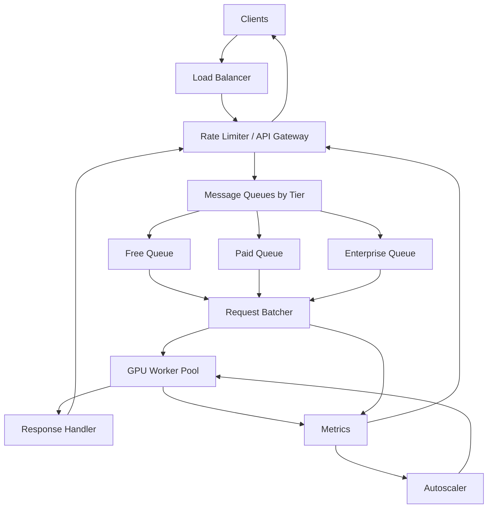

# 设计 Inference API System（完整版）

## Step 1: Before Designing, Ask Questions

### Basic Features

- 这是哪类 inference？文本、图片、embedding，还是多模态？
- 是否需要同时运行不同 model version？
- 结果是一次性返回，还是 streaming token/chunk？
- 是否需要保存所有 request/response 历史？

### Scope

- 只设计 batching service，还是整个 API system？
- 是否负责 model update、canary、rollback？
- 是否要做 response cache？
- 是否直接管理 GPU servers，还是只调度已有 GPU worker？

### Performance Goals

- 目标 RPS 是多少？先按 1,000 RPS，未来按 10,000+ RPS 设计。
- SLA 是什么？例如 P95 `< 1s`。
- 请求最多能在 queue 里等多久？
- 单个 request 大小如何？输入长度和输出长度差异很大吗？

### Security / Tenant

- 用户是否通过 API key 鉴权？
- 是否有 free、paid、enterprise tiers？
- 是否要保存 logs 用于审计、安全检查和 billing？
- 请求数据是否隐私敏感？是否允许缓存 prompt 和 response？

## Step 2: Requirements

### 功能需求

- **Group Requests**：把小请求组合成 batch，提高 GPU 利用率。
- **User Tiers**：区分 free、paid、enterprise，付费用户优先。
- **Auto-scaling**：根据 GPU utilization、queue depth、latency 增减 GPU workers。
- **Rate Limiting & Monitoring**：过载时限流，持续监控系统健康。

### 非功能需求

- Speed：P95 `< 1s`。
- Growth：先支持 1,000 RPS，架构上支持 10,000+ RPS。
- Reliability：99.9% uptime，单个 GPU worker crash 不影响整体。
- Cost：GPU 昂贵，目标 70-80% utilization，而不是长期低利用率。
- Backpressure：队列不能无限增长，必须可拒绝、可降级。

## Step 3: Estimating Scale and Capacity

### Basic Assumptions

Traffic:

- 目标峰值：1,000 RPS。
- 未来增长：10x，10,000 RPS。
- 100,000 DAU。
- 每人每天 10 次请求。
- 70% free，25% paid，5% enterprise。

GPU:

- Batch size：32。
- GPU 处理一个 batch：50ms。
- 等待组 batch：约 20ms。
- 数据搬运/序列化：约 5ms。
- 单个 batch 总耗时：75ms。
- GPU memory：40GB。
- Model size：10GB，剩余约 30GB 给 activation/cache/batch。

### Request Volume

```text
Daily requests = 100K users * 10 = 1M requests/day
Average RPS = 1M / 86,400 ~= 11.6 RPS
Peak traffic = 3x ~= 35 RPS
Target build capacity = 1,000 RPS
Future capacity = 10,000 RPS
```

### GPU Needs

```text
Batch total time = 50ms compute + 20ms wait + 5ms transfer = 75ms
Batches per GPU per second = 1000ms / 75ms = 13.3
Requests per GPU per second = 13.3 * 32 = 426 RPS
```

For 1,000 RPS:

```text
Raw GPUs = 1000 / 426 = 2.35
Safe GPUs at 70% utilization = 2.35 / 0.7 ~= 4 GPUs
```

For 10,000 RPS:

```text
Raw GPUs = 10000 / 426 = 23.5
Safe GPUs at 70% utilization = 23.5 / 0.7 ~= 34 GPUs
```

实际生产还要加：

- N+1 capacity。
- worker crash headroom。
- batch 不总是满。
- tenant priority reserve。

所以 10K RPS 可能需要 `40-50 GPUs`。

### Storage

```text
Request metadata: ~100B
Result metadata/output: ~2KB
Daily storage: 1M * 2KB = 2GB/day
Yearly storage: ~700GB/year
```

结论：存储不是主要成本，GPU 才是。

### Cost

假设 A100 `~$3/hour`：

```text
4 GPUs * $3 * 24 * 30 ~= $8,640/month
```

其他 API/DB/LB 成本远小于 GPU。主要优化目标是 GPU utilization 和 SLA 的平衡。

## Step 4: API Design

### Client-facing REST API

```text
POST /api/v1/inference
```

Request:

```json
{
  "model": "gpt-4",
  "input": "What is the capital of France?",
  "parameters": {
    "temperature": 0.7,
    "max_tokens": 100
  }
}
```

Response:

```json
{
  "request_id": "req_abc123",
  "output": "The capital of France is Paris.",
  "metadata": {
    "tokens_used": 15,
    "latency_ms": 523,
    "model_version": "gpt-4-2024"
  }
}
```

Status API for background or debug:

```text
GET /api/v1/inference/{request_id}
```

Response:

```json
{
  "status": "completed",
  "output": "...",
  "metadata": {
    "tokens_used": 15,
    "latency_ms": 523
  }
}
```

### Internal APIs: Batcher to GPU

```text
POST /internal/batch-inference
```

Request:

```json
{
  "batch_id": "batch_xyz789",
  "requests": [
    {"request_id": "req_1", "input": "...", "parameters": {}},
    {"request_id": "req_2", "input": "...", "parameters": {}}
  ]
}
```

Response:

```json
{
  "batch_id": "batch_xyz789",
  "results": [
    {"request_id": "req_1", "output": "...", "status": "success"},
    {"request_id": "req_2", "output": "...", "status": "success"}
  ]
}
```

GPU health:

```text
GET /internal/health
```

Response:

```json
{
  "status": "healthy",
  "gpu_utilization": 0.75,
  "queue_depth": 12,
  "requests_per_second": 450
}
```

Monitoring:

```text
GET /api/v1/metrics
```

Response:

```json
{
  "gpu_utilization": 0.75,
  "queue_depth": 12,
  "p95_latency_ms": 450,
  "requests_per_second": 850,
  "error_rate": 0.001
}
```

### Security

- 使用 API key：`Authorization: Bearer <key>`。
- 按 API key / tenant / user tier 限流。
- 对 enterprise 请求保存审计 logs。
- 对隐私数据，默认不缓存完整 input/output，或只保存 hash/metadata。

## Step 5: Database and Data Structures

### Request Queue Object

Queue 可以用 Redis Streams/List 或 Kafka topic。对象示例：

```json
{
  "request_id": "req_abc123",
  "user_id": "user_456",
  "tier": "paid",
  "model": "gpt-4",
  "input": "...",
  "parameters": {},
  "timestamp": "2024-01-15T10:30:00Z",
  "timeout": "2024-01-15T10:30:05Z"
}
```

### Batch Info

Batcher 内部状态：

```json
{
  "batch_id": "batch_xyz789",
  "requests": ["req_1", "req_2", "req_32"],
  "created_at": "2024-01-15T10:30:00.100Z",
  "sent_to_gpu": "2024-01-15T10:30:00.150Z",
  "gpu_worker_id": "gpu-worker-3"
}
```

### Request DB

PostgreSQL 保存历史、审计、billing metadata：

```sql
CREATE TABLE requests (
  request_id VARCHAR(50) PRIMARY KEY,
  user_id VARCHAR(50),
  model VARCHAR(50),
  status VARCHAR(20), -- queued, processing, completed, failed
  created_at TIMESTAMP,
  completed_at TIMESTAMP,
  latency_ms INTEGER,
  tokens_used INTEGER
);

CREATE INDEX idx_requests_user_id ON requests(user_id, created_at DESC);
CREATE INDEX idx_requests_status ON requests(status) WHERE status IN ('queued', 'processing');
CREATE INDEX idx_requests_created_at ON requests(created_at DESC);
```

Redis 保存 active request lookup：

```json
{
  "req_abc123": {
    "status": "processing",
    "batch_id": "batch_xyz789",
    "client_connection_id": "conn_123"
  }
}
```

### GPU List

Redis / service registry 保存 GPU worker 状态：

```json
{
  "gpu-worker-1": {
    "status": "healthy",
    "current_utilization": 0.78,
    "requests_processed": 15234,
    "last_heartbeat": "2024-01-15T10:30:05Z"
  }
}
```

### Choosing the Database

- **Redis**
  - 用于 queues、live tracking、rate limits、GPU worker heartbeat。
  - 优点：极快，通常 `<1ms`。
  - 缺点：持久性和 replay 能力不如 Kafka。
- **PostgreSQL**
  - 用于 request history、user info、billing、audit logs。
  - 优点：ACID、查询灵活。
  - 缺点：不适合作为高频低延迟 queue。
- **Kafka**
  - 用于不能丢的 durable queue。
  - 优点：持久化、可回放。
  - 缺点：延迟和运维复杂度高于 Redis。

推荐：

- 在线同步 inference：Redis queue / in-memory queue 更低延迟。
- 关键任务、财务级任务、必须可回放：Kafka。
- 历史和 billing：PostgreSQL。

## Step 6: System Overview



### Components

#### 1. Load Balancer

- 分发请求到 API Gateways。
- 处理 TLS。
- 多 LB active-active 或 active-passive，避免单点。

#### 2. Rate Limiter / API Gateway

- 校验 API key。
- 根据 free、paid、enterprise tier 限流。
- 把请求放入正确队列。
- 用 async request handler 保持 client HTTP connection，不阻塞线程。
- 从 capacity feedback 获知系统是否过载。

#### 3. Message Queues

- 按 tier 分队列：

```text
enterprise queue
paid queue
free queue
```

- 可进一步按 model 分：

```text
queue[model][tier]
```

- 作为 GPU 忙时的 buffer。
- 队列必须 bounded，不能无限增长。

#### 4. Request Batcher

- 从多队列拉请求。
- 按 priority 和 fairness 选择请求。
- 满足以下条件就 flush batch：
  - 到达 batch size 32。
  - 等待超过 40ms。
  - 最早 request 快 timeout。
  - GPU 空闲且队列非空。

#### 5. GPU Worker Pool

- 真正执行模型推理。
- 每个 worker 加载模型，处理 batch。
- 暴露 utilization、queue depth、error rate、heartbeat。

#### 6. Response Handler

- 接收 batch result。
- 按 `request_id` 拆回单个 response。
- 完成 API Gateway 上等待的 Future。

## How a Request Moves Through the System

1. Client 发同步 HTTP request。
2. API Gateway 校验 API key 和 tier。
3. Rate limiter 判断当前系统容量是否允许。
4. Gateway 把 request 放入对应 queue，并保持 HTTP connection。
5. Queue 等待，平均约 20ms。
6. Batcher 拉取请求，最多等 40ms 或凑满 32。
7. Batcher 把 batch 发给 GPU worker。
8. GPU 处理 batch，约 50ms。
9. Response Handler 拆分 batch result。
10. Gateway 返回单个用户的 response。

典型耗时：

```text
gateway/auth:      5-15ms
queue wait:       ~20ms
batch wait:       0-40ms
GPU compute:      ~50ms
data transfer:    ~5ms
response mapping: 1-5ms
total:            ~91-131ms
```

## Step 7: Deep Dive into Key Components

### 1. Grouping Requests: Batching

- 问题：
  - 什么时候把 batch 发给 GPU？
- 方案 A：Fixed Batch Size
  - 等到正好 32 个请求。
  - ✅ 优点：GPU utilization 最高。
  - ❌ 缺点：低流量时第一个用户等很久。
- 方案 B：Timeout-Based
  - 32 个请求或 40ms timeout，任一满足就发送。
  - ✅ 优点：低流量也能保持低延迟。
  - ❌ 缺点：有时 batch 不满，GPU 利用率下降。
- 方案 C：Adaptive
  - 根据流量、latency、GPU utilization 动态调 batch size 和 timeout。
  - ✅ 优点：吞吐和延迟平衡最好。
  - ❌ 缺点：复杂，容易调参出错。
- 推荐：
  - 初期用 timeout-based：`max_batch_size=32, max_wait=40ms`。
  - 规模上来后加 adaptive batching。

### 2. Scaling Up and Down

- 问题：
  - 流量变化时如何调整 GPU？
- 事实：
  - GPU cold start 可能 1-5 分钟。
  - 不能等系统爆了再扩容。
- Scale up signals：
  - GPU utilization > 80% 持续 2 分钟。
  - queue depth > 100。
  - P95 latency 接近 SLA。
  - rejection rate / timeout rate 上升。
- Scale down signals：
  - GPU utilization < 50% 持续 10 分钟。
  - queue 长期接近 0。
  - latency 稳定低于 SLA。
- 推荐：
  - 目标 utilization 70-80%，保留 headroom。
  - 使用 warm pool + predictive autoscaling。
  - Scale down 慢一点，避免抖动。

### 3. Tracking System Health

- GPU:
  - utilization
  - memory usage
  - batch compute latency
  - worker heartbeat
  - OOM / crash count
- Queue:
  - queue depth by tier/model
  - oldest request age
  - batch wait P95/P99
  - dropped/canceled requests
- API:
  - RPS
  - P95/P99 latency
  - 429 / 503 rate
  - timeout rate
  - error rate
- Business:
  - per tenant usage
  - paid tier SLA
  - cache hit rate

### 4. Calculating GPU Needs

Given 1,000 RPS:

```text
Inference time: 50ms per batch
Batch size: 32
Overhead: 20ms grouping + 5ms data movement
Total batch time: 75ms
Batches per GPU per second: 1000 / 75 = 13.3
Requests per GPU per second: 13.3 * 32 = 426
Raw GPUs: 1000 / 426 = 2.35
Safe GPUs at 70% utilization: 2.35 / 0.7 ~= 4
```

For 10,000 RPS:

```text
Raw GPUs: 10000 / 426 = 23.5
Safe GPUs at 70% utilization: 23.5 / 0.7 ~= 34
With failure/headroom: 40-50 GPUs
```

### 5. Controlling Traffic Flow

- 问题：
  - GPU crash 或流量突增时如何保护系统？
- Green zone:
  - queue depth < 100。
  - 正常接受所有 tier。
- Yellow zone:
  - queue depth 100-500。
  - 降低 free tier rate，保留 paid/enterprise。
- Red zone:
  - queue depth > 500。
  - 拒绝低优先级请求，返回 `429` 或 `503`。
- Capacity-aware rate limit：

```text
healthy_capacity = healthy_gpu_count * rps_per_gpu
allowed_rps = healthy_capacity * target_utilization
```

如果 10 个 GPU，每个 100 RPS，总容量 1,000 RPS。坏掉 5 个后容量变 500 RPS，rate limit 必须立刻下降。

### 6. Caching Answers

- 方案 A：Exact match cache
  - Key:

```text
hash(model_version + normalized_input + parameters + safety_policy_version)
```

  - ✅ 优点：安全，适合 deterministic 请求。
  - ❌ 缺点：命中率可能低。
- 方案 B：Similarity / semantic cache
  - 用 Vector DB 找相似 prompt。
  - ✅ 优点：命中率高。
  - ❌ 缺点：可能返回不适合的答案，风险高。
- 推荐：
  - 先做 exact cache。
  - semantic cache 只用于低风险、用户 opt-in、置信度高的场景。

### 7. Handling Timeouts and Retries

- Client timeout：例如 5s。
- Server timeout：例如 4s，提前给出干净错误。
- GPU crash：
  - 如果 deadline 还够，换 worker 重试一次。
  - 如果快超时，直接失败。
- 避免 retry storm：
  - 每个 request 最多 retry 1 次。
  - Worker 故障时摘除，不要继续发新 batch。
  - 如果系统整体过载，重试只会雪上加霜，应该 load shed。

## Step 8: Finding and Fixing Weak Spots

### Potential Bottlenecks

- Load Balancer failure
  - Fix：至少两个 LB，active-active 或 active-passive。
- GPU overload
  - Fix：保持 70-80% utilization，动态限流，提前扩容。
- Queue full
  - Fix：bounded queue，例如每个 queue 最多 1000；满了直接拒绝。
- Database slow
  - Fix：连接池、PgBouncer；热路径尽量用 Redis；Postgres 主要做 history/billing。
- Network lag
  - Fix：GPU worker、batcher、queue 放同 region / same AZ；减少 payload。
- Batcher crash
  - Fix：如果 queue 在 Redis/Kafka，batcher 可重启后继续消费；in-memory batch 里的请求可能需要 timeout/retry。

### Disaster Recovery

- Region outage：
  - DNS / traffic manager 切到 backup region。
  - 模型和配置提前复制。
  - active request 通常失败，让客户端重试。
- Bad model update：
  - Model version canary。
  - 监控 error/latency/quality regression。
  - 一键 rollback 到旧版本。

## Extra Discussion Points

### Queue Before Batcher vs In-memory Batching

- Option A：Queue before Batcher
  - ✅ 优点：
    - Batcher crash 时请求还在 queue。
    - 容易分 free/paid/enterprise。
    - 支持 backpressure。
  - ❌ 缺点：
    - 多一次 queue hop。
- Option B：API Gateway in-memory batching
  - ✅ 优点：
    - 延迟最低。
  - ❌ 缺点：
    - Gateway crash 丢请求。
    - 多 gateway 之间 batch 效率差。
- 推荐：
  - 默认 queue before batcher。
  - 极低延迟、可重试、低风险请求可以用 in-memory fast path。

### Disk vs Memory Queue

- Kafka / disk queue：
  - ✅ 安全，可 replay。
  - ❌ 较慢，运维复杂。
- Redis / memory queue：
  - ✅ 快，适合低延迟。
  - ❌ crash 时可能丢或需要配置持久化。
- 推荐：
  - 在线 inference 默认 Redis。
  - 关键任务或异步 batch job 用 Kafka。

### Queue Length Targets

- Normal：0-30。
- Warning：100+。
- Critical：500+。
- Hard cap：例如 1000，满了 reject。

### GPU Utilization Target

- 目标：70-80%。
- 不建议长期 100%。
- 原因：没有 headroom，任何小 spike 都会制造巨大 queue 和 P99 latency。

## Mistakes to Avoid

- Unlimited queues：队列无限增长会导致 OOM 和超长 tail latency。
- One queue for everyone：free 用户可能阻塞 paid 用户。
- Ignoring cold start：新 GPU 需要 1-5 分钟，必须提前扩容。
- Too many retries：系统故障时重试风暴会加速崩溃。
- No backpressure：满了必须能返回 `429/503`。
- Only optimize average latency：P95/P99 才决定用户体验。
- Round-robin GPU routing：不看 queue、memory、batch 状态会导致慢节点更慢。

## Practice Questions

- Estimation：如果有 10,000 RPS，每个 batch 100ms，batch size 是多少？需要多少 GPU？
- Scaling：新 GPU 要 5 分钟启动，高峰突然到来时怎么办？
- Monitoring：latency 翻倍，第一时间看什么？
- Rate Limiting：设计一个队列过长时自动降低 free tier 速率的规则。
- Cost：如何在少用 GPU 和低延迟之间做权衡？

## Quick Summary Table

| Feature | Solution | Why |
| --- | --- | --- |
| Connection | HTTP sync API | 不能改外部 API |
| Internal execution | Future + async batch | 同步等待，内部异步 |
| Batching | batch size 32 or timeout 40ms | 平衡 GPU 利用率和延迟 |
| Queue | per model + per tier queues | 支持优先级和 batch locality |
| Rate limit | dynamic capacity-aware limit | GPU 少了自动少接请求 |
| Autoscaling | warm pool + predictive scaling | GPU cold start 慢 |
| Storage | Redis + PostgreSQL | Redis 快，Postgres 存历史 |
| GPU target | 70-80% utilization | 留 headroom |
| Cache | exact cache first | 安全，避免错误复用 |
| Retry | deadline-aware one retry | 提高成功率但避免风暴 |

## 面试亮点

- 外部同步 API 不代表内部同步执行；用 Future/Promise 桥接异步 batch。
- Batch 策略必须有 size 和 timeout 两个触发条件。
- Queue 必须 bounded，并且按 tier/model 拆分。
- Rate limit 应该和 healthy GPU capacity 联动。
- GPU autoscaling 要看 leading indicators，因为 cold start 需要 1-5 分钟。
- Cost 优化不是跑满 100%，而是在 70-80% utilization 和 P95/P99 SLA 之间平衡。
- Redis 快但不等于可靠；Kafka 可靠但延迟高，要按请求重要性选择。

## 一句话总结

这个系统的核心是：在不改变同步 inference API 的前提下，用 Redis/Kafka queues、priority-aware batcher、GPU worker pool、dynamic rate limiting 和 warm-pool autoscaling，把高并发请求转化成高效 GPU batch，同时用 bounded queue、timeout、retry 和监控保护 P95 延迟与系统稳定性。
