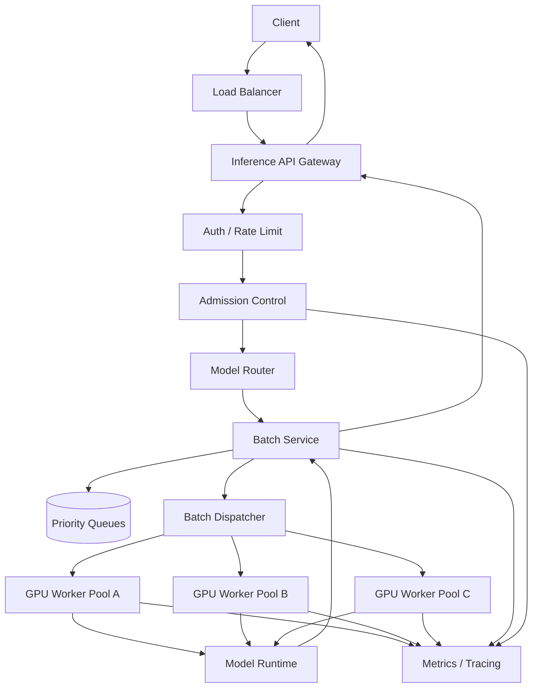

# 设计 Inference API System

## 功能需求

- 用户调用既有 inference API，同步等待结果。
- 系统内部可以异步排队、batch、调度 GPU，但不能改变外部 API contract。
- 支持高并发请求，尽量把多个请求合成 batch，提高 GPU 利用率。
- 支持优先级、限流、失败重试和监控。

## 非功能需求

- 延迟：多数请求 `< 500ms - 1s` 返回。
- 吞吐：支持高并发，例如 `10K RPS`。
- GPU 利用率：尽量提高 batch size 和 GPU occupancy。
- 可用性：单个 GPU worker 挂掉不能拖垮整体。
- 成本：GPU 昂贵，不能无限扩容，必须 admission control + autoscaling。

## API 约束

外部 API 不能改，例如：

```text
POST /infer
Request:
- model_id
- input
- parameters

Response:
- output
- latency_ms
- request_id
```

客户端仍然是同步 HTTP：

```text
client -> POST /infer -> wait -> response
```

但系统内部可以变成：

```text
HTTP request -> create Future/Promise -> enqueue -> batch -> GPU -> complete Future -> HTTP response
```

核心点：**外部同步，内部异步。**

## 高层架构



## 关键组件

### API Gateway

- 接收既有 `/infer` 请求。
- 创建 `request_id` 和 per-request `Future`。
- 等待 Future 完成，返回 HTTP response。
- 如果超过 client deadline，返回 timeout，并通知 batcher cancel。
- 注意：不能让 HTTP worker thread 阻塞太多，应该用 async servlet / Netty / event loop。

### Admission Control

- 在请求进入 batch queue 前决定是否接收。
- 依据：
  - 当前 queue wait estimate
  - GPU capacity
  - tenant quota
  - priority tier
  - request deadline
- 过载时快速返回 `429` 或 `503`，不要无限排队。

### Model Router

- 根据 `model_id`、tenant、priority、GPU load 选择 batcher / GPU pool。
- 不只看 request count，要看 estimated compute cost。
- 对 LLM 类请求，要考虑 input length、max output tokens、KV cache pressure。

### Batch Service

- 本题重点。
- 负责把多个 pending requests 聚合成 batch。
- 对每个请求保存：
  - `request_id`
  - arrival time
  - deadline
  - priority
  - model_id
  - input tensor / tokenized input
  - callback / future
- Batch 触发条件：
  - 达到 `max_batch_size`
  - 等待超过 `max_wait_ms`
  - GPU 空闲且队列里有请求
  - 最早 deadline 快到了
- Batch 完成后，把 GPU 返回的每个 result 拆回对应 request future。

### GPU Worker

- 加载模型，执行 batch inference。
- 对外暴露：
  - queue depth
  - in-flight batch
  - GPU utilization
  - memory usage
  - batch latency
  - error rate
- Worker crash 时，batcher 需要把 in-flight batch 标记失败或重试。

### Metrics / Autoscaler

- 监控 GPU 和 batch queue。
- 根据 queue wait、GPU utilization、P95/P99 latency、rejection rate 决定扩容。
- 如果 GPU 启动要 5 分钟，必须提前扩容或保留 warm pool。

## Batch Service 设计

核心数据结构：

```text
RequestContext
- request_id
- tenant_id
- model_id
- priority
- arrival_time
- deadline_time
- input
- future
- retry_count
```

```text
Batch
- batch_id
- model_id
- requests[]
- created_at
- target_gpu_worker
```

队列设计：

```text
queues[model_id][priority]
```

不要只用一个全局队列。原因：

- 不同模型不能随便放进同一个 batch。
- 付费用户要优先。
- 长请求和短请求混在一起会增加 tail latency。
- 某个 tenant 突增不能饿死其他 tenant。

Batch loop 伪代码：

```text
while true:
    q = pick_queue_by_priority_and_fairness()

    batch = []
    start = now()

    while batch.size < max_batch_size:
        req = q.peek()

        if req == null:
            break

        if req.deadline_too_close():
            break

        batch.add(q.pop())

        if now() - start >= max_wait_ms:
            break

    if batch not empty:
        gpu = pick_gpu_worker(batch)
        dispatch(batch, gpu)
```

更实际的策略：

```text
send batch when:
- batch_size >= max_batch_size
OR
- oldest_request_wait_ms >= max_wait_ms
OR
- estimated_finish_time would miss deadline if we wait longer
OR
- GPU is idle and queue is non-empty
```

## 核心流程

### 同步请求，异步执行

1. Client 调 `POST /infer`。
2. API Gateway 校验参数和权限。
3. Admission Control 判断是否接收。
4. 创建 `Future`，把 request 放入 Batch Service queue。
5. HTTP handler async wait future。
6. Batch Service 聚合多个请求。
7. Dispatch batch 到 GPU Worker。
8. GPU Worker 返回 batch outputs。
9. Batch Service 拆分结果，complete 每个 Future。
10. API Gateway 返回 HTTP response。

### GPU worker crash

1. Worker heartbeat 失败。
2. Router 摘除 worker。
3. Batcher 找到该 worker 的 in-flight batch。
4. 如果请求还没超过 deadline，重试到其他 GPU。
5. 如果 deadline 不够，返回 `503/timeout`。
6. retry 必须有上限，避免失败风暴。

### 客户端 timeout / disconnect

1. Gateway 发现 HTTP connection closed。
2. 标记 request canceled。
3. 如果 request 还在 queue，直接移除。
4. 如果已经在 GPU batch 里，无法单独取消时，结果回来后丢弃。
5. 对 LLM token generation，如果 runtime 支持 cancel，要释放 KV cache。

## 容量估算

假设一个 GPU worker：

- `max_batch_size = 32`
- 一个 batch GPU compute time = `80ms`
- 每秒 batch 数 = `1000 / 80 = 12.5`
- 每秒请求数 = `12.5 * 32 = 400 RPS/GPU`

如果目标是 `10,000 RPS`：

```text
required_gpus = 10,000 / 400 = 25 GPUs
```

加上 headroom：

- N+1 容错
- batch 不总是满
- 流量波动
- GPU failure
- P99 latency

实际建议：

```text
25 * 1.3 ~= 33 GPUs
```

所以可以准备 `35-40 GPUs`。

更通用公式：

```text
GPU_RPS = batch_size / batch_latency_seconds
required_gpus = target_RPS / GPU_RPS
```

如果 batch size 降到 16，batch latency 60ms：

```text
GPU_RPS = 16 / 0.06 ~= 267 RPS
10K RPS 需要 ~= 38 GPUs
加 headroom 后 50 GPUs 左右
```

## Latency Budget

目标 `< 500ms`，可以拆成：

```text
API Gateway + auth:       10-30ms
Admission + routing:       5-10ms
Queue wait / batching:    10-50ms
GPU compute:              50-300ms
Result split + network:   10-30ms
Buffer / tail:            50-100ms
```

关键是 batch wait 不能无限等。

一个常见策略：

```text
max_wait_ms = 10-20ms for low latency tier
max_wait_ms = 50-100ms for batch/cost optimized tier
```

## 系统深挖与 Trade-off

### 1. Batching：等满 batch vs timeout flush

- 问题：
  - GPU 喜欢大 batch，但用户要求低延迟。
- 方案 A：等到 batch 满再发送
  - ✅ 优点：GPU 利用率最高，吞吐最好。
  - ❌ 缺点：低流量或抖动时请求等待太久，P99 latency 差。
- 方案 B：固定 `max_wait_ms`
  - ✅ 优点：延迟可控。
  - ❌ 缺点：batch 可能不满，GPU 利用率下降。
- 方案 C：deadline-aware batching
  - ✅ 优点：根据最早 deadline 决定是否继续等。
  - ❌ 缺点：实现复杂，需要估算执行时间。
- 推荐：
  - 使用 `max_batch_size + max_wait_ms + deadline-aware flush`。
  - 低延迟 tier 用小 `max_wait_ms`，批处理 tier 用大 `max_wait_ms`。
  - 保护的 invariant 是：不能为了 GPU utilization 牺牲用户 SLA。

### 2. Queue：单队列 vs 多队列

- 问题：
  - 所有请求放一个 queue 会导致 paid users、短请求、低优先级请求互相影响。
- 方案 A：单全局 FIFO queue
  - ✅ 优点：简单。
  - ❌ 缺点：head-of-line blocking；无法优先付费用户；不同模型无法 batch。
- 方案 B：按 model 分队列
  - ✅ 优点：同模型请求容易 batch。
  - ❌ 缺点：无法处理 tenant priority。
- 方案 C：按 `model + priority + tenant class` 多队列
  - ✅ 优点：支持优先级、公平性和 batch locality。
  - ❌ 缺点：调度复杂。
- 推荐：
  - 用多队列：
    ```text
    queue[model_id][priority_tier]
    ```
  - 调度用 weighted fair queuing，paid tier 有更高权重，但不能完全饿死 free tier。

### 3. Admission Control：排队 vs 快速拒绝

- 问题：
  - 高流量时是否继续接收请求？
- 方案 A：无限排队
  - ✅ 优点：少返回错误。
  - ❌ 缺点：用户最终还是 timeout；系统内存和 tail latency 爆炸。
- 方案 B：bounded queue
  - ✅ 优点：保护系统，延迟可预测。
  - ❌ 缺点：高峰期会拒绝请求。
- 方案 C：priority + load shedding
  - ✅ 优点：保护高价值用户和核心 SLA。
  - ❌ 缺点：公平性和产品策略更复杂。
- 推荐：
  - 使用 bounded queue + deadline budget + priority load shedding。
  - 如果预计排队后无法在 1s 内完成，直接返回 `429/503`。
  - 这比让用户卡住 5 秒后 timeout 更可运营。

### 4. GPU 扩容：10K RPS 和 5 分钟冷启动

- 问题：
  - GPU 启动慢，等 queue 堆起来再扩容已经晚了。
- 方案 A：reactive autoscaling
  - ✅ 优点：省钱。
  - ❌ 缺点：GPU 5 分钟后才可用，峰值时已经超时。
- 方案 B：warm pool
  - ✅ 优点：快速接管流量。
  - ❌ 缺点：空闲 GPU 成本高。
- 方案 C：predictive autoscaling
  - ✅ 优点：根据历史流量提前扩。
  - ❌ 缺点：预测错误会浪费成本或容量不足。
- 推荐：
  - 用 warm pool + predictive autoscaling。
  - 监控 queue wait 和 utilization 的趋势，而不是只看当前 RPS。
  - 例如 GPU 利用率持续 >70%、queue wait P95 上升、rejection rate 上升时提前扩容。
  - 如果 GPU 要 5 分钟启动，扩容指标必须是 leading indicator。

### 5. Rate Limiting：半数 GPU 故障怎么办

- 问题：
  - 如果一半 GPU 坏了，继续接收原流量会导致全系统排队爆炸。
- 方案 A：固定限流
  - ✅ 优点：简单。
  - ❌ 缺点：容量变化时不准确。
- 方案 B：动态 capacity-aware limit
  - ✅ 优点：根据当前 healthy GPU capacity 调整限额。
  - ❌ 缺点：需要实时容量估算。
- 方案 C：per-tenant quota + emergency shedding
  - ✅ 优点：保护付费用户和系统整体。
  - ❌ 缺点：策略复杂。
- 推荐：
  - Rate limiter 的 token refill rate 来自当前 healthy GPU capacity。
  - 半数 GPU 故障时，自动降低全局 refill rate。
  - paid tier 保留 reserved capacity，free tier 优先降级或拒绝。
  - 限流维度不仅是 RPS，还要包括 estimated compute cost。

### 6. Load Balancing：75% full 时怎么分配

- 问题：
  - GPU worker 都有不同 queue、batch、memory 状态，不能只 round-robin。
- 方案 A：round robin
  - ✅ 优点：简单。
  - ❌ 缺点：不看 GPU 当前负载，容易把请求打到慢节点。
- 方案 B：least queue length
  - ✅ 优点：比 round robin 好。
  - ❌ 缺点：不同请求 cost 不同，queue length 不等于 workload。
- 方案 C：least estimated finish time
  - ✅ 优点：考虑 batch、tokens、GPU utilization、queue wait。
  - ❌ 缺点：需要更复杂的指标。
- 推荐：
  - 使用 estimated finish time：
    ```text
    score = queue_wait_estimate + batch_compute_estimate + memory_pressure_penalty
    ```
  - 当系统 75% full 时，新请求优先路由到预计完成时间最低的 worker。
  - 同时保留一些 headroom，避免所有 GPU 都跑到 95% 后 P99 爆炸。

### 7. Caching：缓存重复问题还是近似问题

- 问题：
  - 是否保存答案以节省 GPU？
- 方案 A：exact cache
  - ✅ 优点：安全，key = normalized input + model_version + params。
  - ❌ 缺点：命中率可能低。
- 方案 B：semantic cache
  - ✅ 优点：相似问题也能命中，节省更多 GPU。
  - ❌ 缺点：可能返回不合适答案，正确性和安全风险高。
- 方案 C：prefix / embedding cache
  - ✅ 优点：对 LLM prefill 或 embedding inference 很有价值。
  - ❌ 缺点：实现依赖 runtime 和模型类型。
- 推荐：
  - 先做 exact cache，适合 deterministic 或 temperature=0 请求。
  - Semantic cache 只用于低风险场景，并带置信度阈值和 tenant opt-in。
  - 缓存 key 必须包含 model version、参数、安全策略版本。

### 8. Error Handling：GPU crash 是否重试

- 问题：
  - GPU batch 执行中 worker crash，batch 里的多个请求怎么办？
- 方案 A：不重试，全部失败
  - ✅ 优点：简单。
  - ❌ 缺点：可用性差。
- 方案 B：自动重试到其他 worker
  - ✅ 优点：提高成功率。
  - ❌ 缺点：可能超过用户 deadline；非幂等副作用要小心。
- 方案 C：部分重试 + deadline-aware
  - ✅ 优点：避免无意义重试。
  - ❌ 缺点：实现复杂。
- 推荐：
  - Inference 通常是无副作用的，可以重试。
  - 但只在 remaining deadline 足够时重试。
  - 每个 request 限制 retry 次数，例如 1 次。
  - 如果 client 已断开，取消重试释放 GPU。

### 9. Cost：省 GPU 但不牺牲 SLA

- 问题：
  - GPU 成本高，不能为了低延迟一直保留大量空闲容量。
- 方案 A：高 headroom
  - ✅ 优点：延迟稳定。
  - ❌ 缺点：成本高。
- 方案 B：高 utilization
  - ✅ 优点：成本低。
  - ❌ 缺点：tail latency 差。
- 方案 C：按 tier 分池
  - ✅ 优点：paid tier 低延迟，free/batch tier 高利用率。
  - ❌ 缺点：资源池管理复杂。
- 推荐：
  - 分 latency tier：
    - premium：低 batch wait，reserved capacity
    - standard：普通 batch
    - batch/free：更大 batch wait，可被抢占
  - 用 autoscaling + warm pool + load shedding 控制成本和 SLA。

## 监控指标

### Batch Service

- queue length by model/priority
- oldest request age
- batch size distribution
- batch wait time P50/P95/P99
- dispatch rate
- dropped/canceled requests

### GPU Worker

- GPU utilization
- GPU memory usage
- batch compute latency
- tokens/sec 或 items/sec
- OOM count
- worker crash rate

### API

- RPS
- P50/P95/P99 latency
- 429/503 rate
- timeout rate
- client disconnect rate

### Capacity

- healthy GPU count
- warm GPU count
- autoscaling pending count
- estimated capacity RPS

### Business / Tenant

- per-tenant usage
- quota exceeded rate
- paid tier SLA compliance

## 面试亮点

- 外部 API 同步不代表内部必须同步；用 Future/Promise 桥接 batch async execution。
- Batch 策略不能只等满，要用 `max_batch_size + max_wait_ms + deadline`。
- GPU 稀缺时，admission control 要在入队前做，不能无限排队。
- Rate limit 应该 capacity-aware；GPU 故障时自动降低放行速率。
- Load balancing 不能 round-robin，要按 estimated finish time 和 GPU memory pressure。
- Exactly-once 不是重点；inference 请求通常无副作用，重点是 deadline-aware retry 和 cancellation。
- 成本优化不是单纯提高 utilization，而是在 SLA、batch wait、warm pool 成本之间做权衡。

## 一句话总结

这个系统的核心是：外部保持同步 inference API，内部用 admission control、priority queues、deadline-aware batch service 和 GPU-aware routing，把高并发请求转成高 GPU 利用率的 batch，同时用 bounded queue、动态限流、重试和监控控制延迟与成本。
