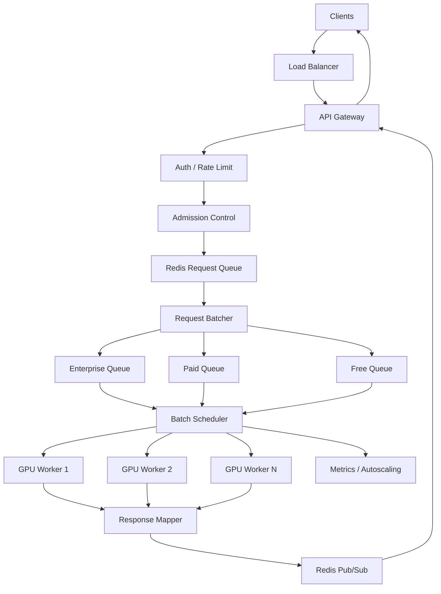

# LLM Request Batching API System Design

https://www.1point3acres.com/interview/problems/post/7100012
## 功能需求

- 提供同步 HTTP API：用户发一个 string，等待一个 string 返回。
- 系统内部把多个单请求聚合成 `batchstring(inputs: list[str])`，batch size 必须是 1-100。
- 正确把 batch 输出按请求映射回原用户。
- 支持高并发、优先级、失败重试和过载保护。

## 非功能需求

- P95 latency < 500ms。
- GPU utilization 目标 70-80%。
- 单 GPU 一次只能处理一个 batch，batch 耗时固定约 100ms。
- 99.9% availability。
- 不能无限排队；请求超过 deadline 要快速失败。

## 容量估算

假设目标 1000 RPS，batch 目标大小 32，最大等待窗口 50ms。

单 GPU：

```text
1 batch = 100ms
1 GPU = 10 batches/s
batch size = 32

单 GPU throughput = 10 * 32 = 320 RPS
```

1000 RPS 需要：

```text
1000 / 320 = 3.125 GPUs
```

加 70% 利用率 buffer：

```text
3.125 / 0.7 ≈ 4.5
```

实际准备 5-6 张 GPU。

如果 batch 能稳定打满 100：

```text
单 GPU = 10 * 100 = 1000 RPS
```

但在线请求不能为了打满 batch 等太久，所以实际设计会用 max batch size + max wait time，而不是只追求 100。

## API 设计

```text
POST /v1/infer
也可以命名为 POST /api/inference，语义相同。
Headers:
- Authorization: Bearer <api_key>
- Idempotency-Key: optional

Request:
{
  "input": "hello",
  "priority": "standard"
}

Response:
{
  "request_id": "req_123",
  "output": "world",
  "latency_ms": 138
}
```

内部 API：

```text
POST /internal/gpu-workers/{worker_id}/batch
{
  "batch_id": "batch_456",
  "inputs": ["a", "b"],
  "request_ids": ["req_1", "req_2"],
  "return_to": "api-instance-1"
}
```

监控 API：

```text
GET /internal/gpu-workers/status

Response:
{
  "gpu_id": "gpu_1",
  "state": "busy",
  "queue_depth": 128,
  "avg_batch_size": 31.2,
  "p95_latency_ms": 420
}
```

## 高层架构



## 关键组件

### API Gateway

- 负责 HTTP 请求、鉴权、参数校验、同步等待 response。
- 为每个请求生成 `request_id`、`deadline`、`idempotency_key`。
- 不直接调用 GPU，避免每个请求单独占用 GPU。
- 在内存里维护等待中的 HTTP connection / Future：

```python
pending_requests = {
    "req_abc123": http_response_future,
    "req_def456": http_response_future,
}
```

- 注意事项：
  - HTTP 连接不能无限等，服务端 deadline 例如 450ms。
  - client 断开后，要取消或标记请求，避免 GPU 做无用功。
  - 需要限制 input size，避免单请求拖垮 batch。

### Admission Control

- 入队前判断系统是否还能在 deadline 内处理。
- 依据：
  - 当前 queue depth。
  - GPU 数量。
  - 最近 avg batch size。
  - P95 latency。
  - 用户 tier。
- 如果预计无法在 SLA 内完成，直接返回 `429` 或 `503`，带 `Retry-After`。
- 重点：在线 inference 不能无限排队。

### Request Batcher

- 维护多个队列，例如 enterprise、paid、free。
- 聚合条件：

```text
batch 满 100 个
或者等待时间达到 20-50ms
或者最早请求快到 deadline
```

- 每个 batch item 保存：

```text
request_id
input
deadline
priority
response_handle
```

- 注意事项：
  - batchstring 返回结果顺序和输入顺序一致。
  - 所以用 index 映射：`outputs[i] -> batch.items[i].request_id`。
  - 消费前检查 request 是否已经超时或 client disconnected。

### GPU Scheduler

- 维护 GPU worker 状态：idle / busy / unhealthy。
- 单个 GPU 一次只派一个 batch。
- 路由策略：
  - 优先派给 idle GPU。
  - 如果所有 GPU busy，batch 留在队列。
  - GPU failure 时把 batch 标记 retryable。
- 注意事项：
  - 不要让多个 scheduler 同时把 batch 派给同一张 GPU。
  - 可以用 per-GPU lease 或 actor model 保证单 GPU single-flight。

### GPU Worker

- 包装固定函数：

```python
outputs = batchstring(inputs)
```

- 不负责排队和优先级。
- 只负责执行一个 batch 并返回结果。
- 注意事项：
  - batch 执行超时要 kill / reset worker。
  - 如果 worker crash，scheduler 决定是否 retry。
  - batchstring 是黑盒，不能修改。

### Response Mapper

- 根据 `batch_id` 和 item index，把结果还给等待中的 HTTP request。
- 如果 API server 和 batcher 在同一进程，可以用 `Future/Promise`。
- 如果是分布式，可以用 Redis Pub/Sub、gRPC stream 或 internal callback。
- Redis Pub/Sub 方式：
  - 请求入队时带上 `return_to: api-instance-1`。
  - Batcher/GPU 完成后 publish 到 `responses:api-instance-1`。
  - API instance 收到消息后，用 `request_id` 找到本机 `pending_requests`。
- 注意事项：
  - request_id 是正确性边界。
  - batch 内任何一个输出都不能串给错误用户。

## 具体实现补充：Redis Queue + Pub/Sub

当 API server 和 Batcher 不在同一台机器上时，需要明确回答：“结果怎么回到发起请求的 API server？”

### Redis Request Queue

API server 接到用户请求后，把请求写入 Redis queue：

```text
Key: batch_queue
Value:
{
  "request_id": "req_1",
  "input": "E equals ",
  "priority": "paid",
  "deadline_ms": 450,
  "return_to": "api-instance-1"
}
```

如果有优先级，可以拆成多个 queue：

```text
batch_queue:enterprise
batch_queue:paid
batch_queue:free
```

### Redis Response Channels

每个 API instance 订阅自己的 response channel：

```text
responses:api-instance-1
responses:api-instance-2
```

Batcher 拿到 GPU 结果后发布：

```text
Channel: responses:api-instance-1
Message:
{
  "request_id": "req_1",
  "output": "E equals mc^2",
  "status": "ok",
  "latency_ms": 145
}
```

API instance 收到消息后：

```text
1. 用 request_id 查 pending_requests。
2. 找到等待中的 HTTP Future/connection。
3. 写回 HTTP response。
4. 从 pending_requests 删除 request_id。
```

### Batching Pseudo Code

```python
current_batch = []
batch_start = now()

while True:
    timeout = max(0, 50_ms - (now() - batch_start))
    req = redis.blpop("batch_queue:paid", timeout=timeout)

    if req is not None and req.deadline > now():
        current_batch.append(req)

    is_full = len(current_batch) >= 32
    is_timeout = now() - batch_start >= 50_ms
    has_items = len(current_batch) > 0

    if has_items and (is_full or is_timeout):
        inputs = [r.input for r in current_batch]
        request_ids = [r.request_id for r in current_batch]
        outputs = batchstring(inputs)

        for i, output in enumerate(outputs):
            publish(
                channel=f"responses:{current_batch[i].return_to}",
                message={
                    "request_id": request_ids[i],
                    "output": output,
                    "status": "ok",
                },
            )

        current_batch = []
        batch_start = now()

## 核心流程

### 正常请求

```text
1. Client POST /v1/infer。
2. API Gateway 鉴权、限流、生成 request_id 和 deadline。
3. Admission Control 判断是否还能按 SLA 完成。
4. 请求进入对应 priority queue。
5. Batcher 等到 batch 满，或等待窗口超时。
6. Scheduler 找 idle GPU，发送 batch。
7. GPU Worker 调用 batchstring(inputs)。
8. Response Mapper 按 index 映射 outputs。
9. API Gateway 返回对应用户的 HTTP response。
```

### GPU crash

```text
1. Scheduler 发现 GPU batch 超时或连接断开。
2. 标记 GPU unhealthy。
3. 如果请求 deadline 还有时间，batch retry 到其他 GPU。
4. 如果 deadline 不够，直接返回 503/timeout。
5. unhealthy GPU 通过 health check 恢复后再加入池子。
```

### 过载

```text
1. queue depth 上升，P95 latency 接近 500ms。
2. Admission Control 先限制 free tier。
3. 继续恶化时限制 paid tier 的低优先级请求。
4. 返回 429 + Retry-After。
5. Autoscaler 根据 queue depth 和 GPU utilization 扩容。
```

## 存储选择

这题的在线路径不一定需要 durable DB。

| 数据 | 存储 | 原因 |
|---|---|---|
| Waiting requests | In-memory queue | 低延迟，HTTP 请求本来是同步等待 |
| API pending map | API server memory | request_id 到 HTTP Future/connection 的映射 |
| Request queue | Redis List / Stream | API server 到 Batcher 的跨进程请求传递 |
| Response routing | Redis Pub/Sub | Batcher 把结果发回指定 API instance |
| Active batch state | Batcher memory / Redis | 用于故障恢复和 debug |
| Idempotency key | Redis TTL | 防止 client retry 造成重复计算 |
| Metrics | Prometheus / TSDB | 监控 batch size、latency、GPU utilization |
| Audit / billing logs | Kafka + OLAP | 异步写，不阻塞用户请求 |

关键判断：

> 对同步低延迟 API，Kafka 不适合放在核心请求路径里。Kafka 更适合日志、billing、异步任务。在线请求应该用 bounded in-memory queue + deadline。

## 扩展方案

第一阶段：单机 batcher + 多 GPU worker。

```text
API + Batcher 在同一服务里
用内存 Future 映射 response
适合低到中等流量
```

第二阶段：多 API server + 独立 Batcher service。

```text
API servers 只负责接请求
Batcher service 统一聚合
Response 通过 callback / stream 返回
```

第三阶段：多 Batcher 分片。

```text
按 model_id / tenant / priority 分片
每个 shard 管一组 GPU
避免单 batcher 成为瓶颈
```

第四阶段：多 region。

```text
请求路由到最近 region
每个 region 独立 batch 和 GPU pool
不做跨 region 同步等待
```

低流量阶段：

```text
夜间只有 1 RPS 时，batch 经常只有 1 个请求。
这时 GPU utilization 很低，可以自动缩容 GPU worker。
保留最小 warm pool，例如 1-2 张 GPU，避免冷启动影响线上请求。
```

## 监控与告警

关键指标：

- `queue_depth`：所有 priority queue 的长度。
- `oldest_request_age_ms`：队列里最老请求等了多久。
- `batch_size_avg / p50 / p95`：batch 是否打得起来。
- `batch_wait_ms`：请求在 Batcher 里等了多久。
- `gpu_utilization`：GPU 是否过载或浪费。
- `gpu_batch_latency_ms`：batchstring 是否仍然约 100ms。
- `request_latency_p95 / p99`：用户端体验。
- `timeout_count / retry_count / 429_count / 5xx_count`。
- `pubsub_delivery_lag_ms`：结果回传到 API server 是否慢。

示例告警：

```text
Critical: queue_depth > 1000 持续 1 分钟
Critical: request_latency_p95 > 500ms 持续 5 分钟
Warning: gpu_utilization > 85% 持续 3 分钟，需要扩容
Warning: gpu_utilization < 20% 持续 30 分钟，可以缩容
Critical: oldest_request_age_ms > 400ms
Critical: Redis Pub/Sub delivery lag > 100ms
```

## 系统深挖与 Trade-off

### Deep Dive 1：什么时候发 batch？

- 问题：
  - 等 batch 变大可以提高 GPU throughput，但等待太久会伤害 latency。
- 方案 A：等满 100 再发。
  - 适用场景：离线 batch job。
  - ✅ 优点：GPU 利用率最高。
  - ❌ 缺点：低流量时第一个请求可能等很久，P95 不稳定。
- 方案 B：固定等待窗口，例如 50ms。
  - 适用场景：在线同步 API。
  - ✅ 优点：latency 可控。
  - ❌ 缺点：低流量时 batch 可能很小，GPU 利用率下降。
- 方案 C：max size + max wait + deadline-aware。
  - 适用场景：本题。
  - ✅ 优点：兼顾 latency 和 throughput。
  - ❌ 缺点：实现稍复杂，需要跟踪每个请求 deadline。
- 推荐：
  - 用 `min(batch_size == 100, wait_time >= 20-50ms, earliest_deadline approaching)`。
  - 当前题目 P95 < 500ms，GPU 固定 100ms，所以 batching wait 控制在 50ms 以内比较安全。

### Deep Dive 2：Batcher 放哪里？

- 问题：
  - 是每个 API server 自己 batch，还是集中 batch？
- 方案 A：API server 本地 batch。
  - 适用场景：小规模，几台 server。
  - ✅ 优点：实现简单，response mapping 容易。
  - ❌ 缺点：流量被分散，每个 server batch 不容易打满。
- 方案 B：集中式 Batcher service。
  - 适用场景：中高流量。
  - ✅ 优点：更容易形成大 batch，GPU utilization 更好。
  - ❌ 缺点：Batcher 可能成为瓶颈或单点。
- 方案 C：分片 Batcher。
  - 适用场景：大规模、多租户、多模型。
  - ✅ 优点：可水平扩展，隔离不同模型和 tenant。
  - ❌ 缺点：路由和运维复杂。
- 推荐：
  - 面试里可以从集中式 Batcher 开始。
  - 到 10k RPS 后演进成按 `model_id + priority tier` 分片的 Batcher pool。

### Deep Dive 3：如何保证结果返回给正确用户？

- 问题：
  - batchstring 只返回 `list[str]`，没有 request_id，如何不串结果？
- 方案 A：依赖输入内容匹配输出。
  - ✅ 优点：看似简单。
  - ❌ 缺点：完全不可靠，两个用户输入可能一样。
- 方案 B：batch 内保存 index mapping。
  - ✅ 优点：简单可靠。
  - ❌ 缺点：要求 batchstring 保持输出顺序和输入顺序一致。
- 方案 C：包装内部 item metadata。
  - 如果后端函数支持结构化输入会更好，但题目说不能改 `batchstring`，所以不能用。
- 推荐：
  - batcher 内部维护：

```text
batch.inputs = [input_0, input_1, input_2]
batch.items = [req_0, req_1, req_2]

outputs = batchstring(batch.inputs)

outputs[0] -> req_0
outputs[1] -> req_1
outputs[2] -> req_2
```

  - `request_id + index` 是这里的 correctness boundary。

### Deep Dive 4：过载时排队还是拒绝？

- 问题：
  - GPU 是固定稀缺资源，queue 堆积会导致 tail latency 爆炸。
- 方案 A：无限排队。
  - ✅ 优点：表面上不拒绝请求。
  - ❌ 缺点：很多请求处理完客户端已经超时，浪费 GPU。
- 方案 B：bounded queue + deadline。
  - ✅ 优点：保护系统，latency 可控。
  - ❌ 缺点：高峰期会返回 429/503。
- 方案 C：priority queue + load shedding。
  - ✅ 优点：付费用户和核心流量有保障。
  - ❌ 缺点：公平性和策略复杂。
- 推荐：
  - 用 bounded queue。
  - 每个请求带 `deadline = now + 450ms`。
  - batcher 取请求前检查 deadline，过期直接 drop。
  - 过载时返回 `429 + Retry-After`，客户端 exponential backoff + jitter。

### Deep Dive 5：GPU failure 怎么处理？

- 问题：
  - 一个 GPU 正在跑 batch 时 crash，batch 里的用户还在 HTTP 等待。
- 方案 A：不 retry，直接失败。
  - ✅ 优点：简单，避免重复计算。
  - ❌ 缺点：可用性差。
- 方案 B：整个 batch retry 到另一张 GPU。
  - ✅ 优点：实现简单。
  - ❌ 缺点：如果 deadline 快到了，retry 也没意义。
- 方案 C：deadline-aware retry。
  - ✅ 优点：只在还有时间时 retry，避免浪费 GPU。
  - ❌ 缺点：需要更精细的状态管理。
- 推荐：
  - batch 失败后最多 retry 一次。
  - retry 前检查：

```text
remaining_time >= estimated_batch_time + network_buffer
```

  - 如果剩余时间不足，直接返回 503。
  - GPU 标记 unhealthy，health check 成功后再接流量。

### Deep Dive 6：优先级怎么做？

- 问题：
  - paid 用户是否应该被 free 用户堵住？
- 方案 A：单队列 FIFO。
  - ✅ 优点：简单。
  - ❌ 缺点：free 流量高峰会影响 paid SLA。
- 方案 B：多队列 strict priority。
  - ✅ 优点：高优先级延迟最低。
  - ❌ 缺点：free 可能饿死。
- 方案 C：weighted fair queue。
  - ✅ 优点：兼顾 SLA 和公平性。
  - ❌ 缺点：实现复杂。
- 推荐：
  - 用多队列 + weighted scheduling，例如：

```text
enterprise: 50%
paid: 35%
free: 15%
```

  - 高压时先 shed free tier。
  - 不要让某个 tier 完全饿死，除非明确是 overload policy。

### Deep Dive 7：如何负载均衡 GPU？

- 问题：
  - 每个 GPU 一次只能跑一个 batch，如何避免某些 GPU 忙、某些空？
- 方案 A：round-robin。
  - ✅ 优点：简单。
  - ❌ 缺点：不考虑 GPU 当前状态。
- 方案 B：least-busy。
  - ✅ 优点：适合同构 GPU。
  - ❌ 缺点：如果状态更新延迟，可能重复派给同一 GPU。
- 方案 C：per-GPU actor / lease。
  - ✅ 优点：天然保证单 GPU single-flight。
  - ❌ 缺点：实现多一个调度层。
- 推荐：
  - 每个 GPU worker 维护一个 actor 或 lease。
  - Scheduler 只向 idle GPU 派 batch。
  - 状态变化由 GPU worker 主动上报。

### Deep Dive 8：要不要用 Kafka / durable queue？

- 问题：
  - 请求是同步 HTTP，用户在等。是否需要 durable queue 防丢？
- 方案 A：Kafka 放核心路径。
  - ✅ 优点：请求不容易丢。
  - ❌ 缺点：latency 增加，处理完用户可能已经断开；还要处理 response callback。
- 方案 B：in-memory bounded queue。
  - ✅ 优点：低延迟，适合同步 API。
  - ❌ 缺点：server crash 时队列内请求失败。
- 方案 C：in-memory queue + async durable logs。
  - ✅ 优点：在线路径快，同时保留审计和 billing。
  - ❌ 缺点：不能把在线请求完全恢复。
- 推荐：
  - 当前题目选方案 C。
  - 同步 API 的正确语义是：server crash 后请求失败，client retry。
  - 用 idempotency key 避免 retry 导致重复计费或重复日志。

### Deep Dive 9：C10K / 同步 HTTP 等待会不会压垮 API Server？

- 问题：
  - 用户请求是同步 HTTP，API server 必须保持连接直到 GPU 返回结果。高 RPS 下会有很多 open connections。
- 方案 A：一个 API server 扛所有连接。
  - 适用场景：demo 或低流量。
  - ✅ 优点：简单。
  - ❌ 缺点：容易碰到 file descriptor limit、thread limit、内存上限。
- 方案 B：多 API server + event loop / async IO。
  - 适用场景：本题。
  - ✅ 优点：单连接成本低，水平扩展容易。
  - ❌ 缺点：需要正确管理 timeout、client disconnect 和 pending map 清理。
- 方案 C：改成异步 API，先返回 request_id，用户轮询结果。
  - 适用场景：延迟秒级到分钟级的后台任务。
  - ✅ 优点：连接压力小。
  - ❌ 缺点：不满足本题“用户同步等待”的要求，体验变差。
- 推荐：
  - 当前题目选方案 B。
  - 连接数估算：

```text
concurrent_connections = RPS * avg_latency
10,000 RPS * 0.15s = 1,500 connections
```

  - 1500 并发连接本身不大，但默认 OS file descriptor limit 可能只有 1024。
  - 生产上把 `ulimit -n` 提高到 65k+，API server 用 async IO，并用多实例分摊连接。

### Deep Dive 10：Redis Queue / PubSub 是不是单点？

- 问题：
  - 如果 Redis 挂了，API server 无法入队，Batcher 也无法把结果发回 API server。
- 方案 A：单 Redis 实例。
  - 适用场景：本地开发或面试简化版。
  - ✅ 优点：实现最简单。
  - ❌ 缺点：Redis 是单点，挂掉后系统不可用。
- 方案 B：Redis Cluster / Sentinel。
  - 适用场景：中等规模在线系统。
  - ✅ 优点：主从切换，降低单点风险。
  - ❌ 缺点：failover 期间可能有短暂不可用；Pub/Sub 消息可能丢。
- 方案 C：Redis Streams 或 Kafka。
  - 适用场景：需要更强可恢复性。
  - ✅ 优点：消息可重放，consumer group 更清晰。
  - ❌ 缺点：延迟和复杂度更高；Kafka 不适合极低延迟同步主路径。
- 推荐：
  - 低延迟版本用 Redis Cluster/Sentinel。
  - 如果担心 Pub/Sub 丢消息，可以让 response 同时写入短 TTL Redis key：

```text
response:req_123 -> {output, status}, TTL = 60s
```

  - API server 收不到 Pub/Sub 时，可以按 request_id 查一次 response key。
  - 更高可靠性要求下，把 request queue 从 Redis List 升级成 Redis Streams，但仍然设置 deadline，过期请求不消费。

## 面试亮点

- 不要为了打满 batch 无限等待；在线系统要用 `max batch size + max wait + deadline`。
- `batchstring` 输出没有 request_id，所以必须依赖 batch 内 index mapping。
- GPU queue 不能无限排，过期请求处理完也没意义。
- Batcher 的核心不是“收集 100 个请求”，而是 latency、throughput、priority、deadline 的平衡。
- 单 GPU single-flight 是 correctness constraint，需要 scheduler/lease/actor 保证。
- Kafka 更适合 audit/billing，不适合放在这个低延迟同步 API 的主路径。

## 一句话总结

LLM Request Batching API 的核心是：HTTP 层同步等待，内部用 deadline-aware batcher 把单请求按优先级聚合成 1-100 的 batch，GPU scheduler 保证每张 GPU 同时只跑一个 batch，再用 request index mapping 把结果准确返回给用户，并通过 bounded queue、限流和 retry 控制尾延迟与故障。
