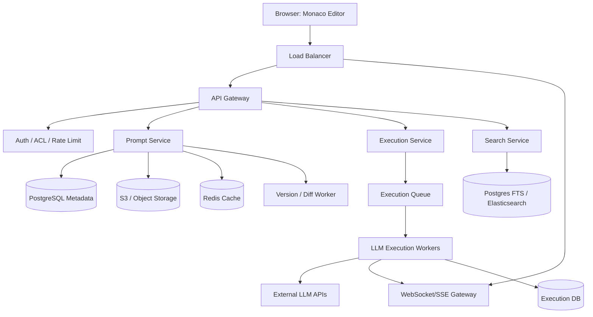

# 设计 Prompt Playground System

## 功能需求

- Prompt 编辑器：用户能创建、编辑、保存 prompt，支持最大 10MB 文本编辑。
- Prompt 执行：点击 Run 后调用 LLM API，支持流式返回结果；每次 Run 独立，不带历史上下文。
- 版本历史：自动保存版本，可查看、对比、回滚。
- Library：支持 tags、搜索、分享链接、组织 prompt。

## 非功能需求

- 编辑 10MB prompt 时不能明显卡顿。
- 浏览器崩溃或断网不能丢草稿。
- 支持 thousands concurrent users。
- LLM API 成本可控，要限流、配额、缓存。
- 搜索和版本历史可以最终一致，但 prompt 保存不能丢。

## 关键澄清

- 这是 Prompt Playground，不是 ChatGPT：每次 Run 都 fresh，不自动带 conversation history。
- 10MB 是编辑和保存上限，不代表一定能送进模型 context。
- 是否支持多模型、多版本：支持。
- 是否保存 response history：建议保存 execution record，方便复现实验。
- 是否支持共享：支持只读 share link，写权限另算。

## 规模估算

- Total users：1M。
- DAU：10K。
- Prompt size：大多数 1KB，少数 10MB。
- 读写比例：80% read，20% write。
- Traffic：
  - Reads：很低，约 `< 1 QPS` 平均。
  - Writes：更低，约 `< 1 QPS` 平均。
- Storage：
  - Prompts：`1M users * 10 prompts * 1KB ~= 10GB`。
  - Versions：如果保存很多版本，可能到几百 GB。
  - 大 prompt 和 snapshot 放 S3，Postgres 存 metadata。
- 成本：
  - LLM API 是主要成本。
  - 必须做 quota、budget、cache、model selection guardrail。

## API 设计

```text
POST /prompts
- title, content, tags
- 返回 prompt_id, current_version

PATCH /prompts/{prompt_id}
- content?, tags?, expected_version
- 返回 new_version

GET /prompts/{prompt_id}
- 返回 metadata, content 或 content_url

GET /prompts/{prompt_id}/versions?cursor=&limit=50
- 返回 version list

POST /prompts/{prompt_id}/restore
- version_number
- 返回 new current_version

POST /prompts/{prompt_id}/execute
- model, params, version_number?
- 返回 execution_id

WS /executions/{execution_id}/stream
- server sends TOKEN / DONE / ERROR
```

也可以用 SSE 做输出流：

```text
GET /executions/{execution_id}/events
```

如果只需要 server -> client token stream，SSE 更简单；如果需要 stop generation、双向控制、协作状态，WebSocket 更合适。

## 高层架构



## 关键组件

### Frontend Editor

- 使用 Monaco Editor / CodeMirror。
- 10MB 文本不能一次性 DOM 渲染，必须 virtual scrolling。
- 本地草稿存 IndexedDB，定期 autosave。
- 支持 diff view、version list、model config panel、output panel。

### Prompt Service

- 管 prompt metadata、保存、版本、权限。
- 小 prompt 可直接存 DB，大 prompt 存 S3。
- 使用 optimistic locking：`expected_version` 不匹配时返回 conflict。
- 保存 path 必须 durable，不能只依赖 Redis。

### Version Worker

- 负责 snapshot + diff。
- 例如每 10 个版本保存一次 full snapshot，中间保存 diff。
- 后台做 compaction，避免版本链太长。

### Execution Service

- 校验 prompt 是否超过目标模型 context window。
- 做 budget check、quota check、cache lookup。
- 创建 execution record。
- 把任务放入 queue，由 worker 调 LLM API。
- 流式 token 通过 WebSocket/SSE 返回前端。

### Search Service

- 快速搜索：Postgres 存 `content_preview` 前 500 字符。
- 深度搜索：Elasticsearch/OpenSearch index 截断后的内容，例如前 100KB。
- 大 prompt 全文搜索成本高，必须限制 index size。

### Redis

- 缓存活跃 prompt metadata/content chunk。
- rate limit 和 budget counter。
- execution stream session mapping。
- 不是 source of truth。

## 数据模型

```text
prompts(
  id,
  owner_id,
  title,
  current_version,
  content_preview,
  content_size,
  tags,
  visibility,
  created_at,
  updated_at
)

prompt_versions(
  prompt_id,
  version_number,
  storage_type,      -- inline, s3
  is_snapshot,
  content_inline,
  content_uri,
  diff_uri,
  base_version,
  created_by,
  created_at
)

executions(
  id,
  prompt_id,
  version_number,
  user_id,
  model,
  params_hash,
  status,
  response_uri,
  cost_usd,
  latency_ms,
  token_usage,
  created_at
)

shares(
  prompt_id,
  share_token,
  permission,        -- read, fork
  expires_at
)
```

## 核心流程

### 编辑和保存

1. 用户在 Monaco Editor 编辑 prompt。
2. 前端每几秒把草稿存 IndexedDB。
3. Autosave 调 `PATCH /prompts/{id}`，带 `expected_version`。
4. Prompt Service 判断版本是否冲突。
5. 小内容存 DB；大内容存 S3。
6. 写 `prompt_versions`。
7. 异步更新 search index 和 preview。

### 执行 prompt

1. 用户点击 Run。
2. 前端发送 prompt_id、version、model、params。
3. Execution Service 读取 prompt 内容。
4. 用 tokenizer 估算 token 数。
5. 如果超过模型 context，直接报错：prompt too long。
6. 检查 quota / budget / cache。
7. 创建 execution job。
8. Worker 调 LLM API。
9. Token 通过 WebSocket/SSE stream 到前端。
10. 完成后保存 execution result 和 cost。

### 版本恢复

1. 用户选择 version 5。
2. 系统找到最近 snapshot，例如 version 1。
3. Replay diff：v2, v3, v4, v5。
4. 返回 reconstructed content。
5. 如果用户 restore，不覆盖历史，而是创建新版本。

## 系统深挖与 Trade-off

### 1. 10MB Prompt 编辑

- 问题：
  - 10MB 文本会让普通 textarea 卡顿，且模型通常无法完整执行。
- 方案 A：普通 textarea
  - ✅ 优点：简单。
  - ❌ 缺点：DOM 和 selection 操作会卡。
- 方案 B：Monaco / CodeMirror + virtual scrolling
  - ✅ 优点：只渲染可视区域，适合大文本。
  - ❌ 缺点：集成复杂。
- 方案 C：分块编辑
  - ✅ 优点：超大文件更稳。
  - ❌ 缺点：用户体验更像文件编辑器，不像 playground。
- 推荐：
  - 用 Monaco Editor + IndexedDB autosave。
  - 10MB 是 storage/editing limit，不是 model execution limit。
  - Run 前必须 tokenizer validation。

### 2. Version Control：全量保存 vs Snapshot + Diff

- 问题：
  - 用户保存 1000 次，每次 10MB，全量保存会爆炸。
- 方案 A：每版全量保存
  - ✅ 优点：读取任意版本快，实现简单。
  - ❌ 缺点：存储成本高。
- 方案 B：纯 diff
  - ✅ 优点：存储省。
  - ❌ 缺点：恢复旧版本要 replay 很长链路。
- 方案 C：Snapshot + Diff
  - ✅ 优点：存储和读取延迟平衡。
  - ❌ 缺点：需要 compaction 和重建逻辑。
- 推荐：
  - 每 N 版，比如 10 版，存 full snapshot。
  - 中间版本存 diff。
  - 后台 worker 做 compaction。

### 3. Streaming：SSE vs WebSocket

- 问题：
  - LLM 输出需要实时显示 token。
- 方案 A：SSE
  - ✅ 优点：HTTP 友好，浏览器支持好，自动重连。
  - ❌ 缺点：单向，只能 server -> client。
- 方案 B：WebSocket
  - ✅ 优点：双向，可支持 stop generation、实时 config、协作。
  - ❌ 缺点：连接管理复杂。
- 方案 C：HTTP polling
  - ✅ 优点：简单。
  - ❌ 缺点：实时体验差。
- 推荐：
  - 如果只 stream token，用 SSE。
  - 如果要 stop generation、execution control、多人协作，用 WebSocket。
  - Playground 通常 WebSocket 更灵活。

### 4. Cost Control：Cache vs Quota vs Budget

- 问题：
  - LLM API 是最大成本，用户重复 Run 会烧钱。
- 方案 A：Exact cache
  - key = prompt_hash + model + params + model_version。
  - ✅ 优点：安全。
  - ❌ 缺点：命中率有限。
- 方案 B：Semantic cache
  - ✅ 优点：相似 prompt 也能命中。
  - ❌ 缺点：可能返回错误答案，不适合严肃 playground 默认开启。
- 方案 C：Quota / budget
  - ✅ 优点：明确控制成本。
  - ❌ 缺点：用户可能被限制。
- 推荐：
  - 默认 exact cache + per-user budget。
  - semantic cache 仅 opt-in 或低风险场景。
  - UI 明确展示 estimated cost。

### 5. Search：Preview Search vs Full-text Index

- 问题：
  - 10MB prompt 全文搜索成本高。
- 方案 A：Postgres preview search
  - ✅ 优点：简单、便宜。
  - ❌ 缺点：搜不到深处内容。
- 方案 B：Elasticsearch full text
  - ✅ 优点：搜索能力强。
  - ❌ 缺点：成本高，index 10MB 文本很贵。
- 方案 C：截断索引 + metadata/tags
  - ✅ 优点：成本可控。
  - ❌ 缺点：深处内容可能搜不到。
- 推荐：
  - Postgres 存 `content_preview`。
  - Elasticsearch 只 index 前 100KB + title/tags。
  - 对真正大文档可提供 explicit deep search，但异步执行。

### 6. 多 Tab 同步和冲突

- 问题：
  - 同一用户多个 tab 打开同一 prompt，可能互相覆盖。
- 方案 A：最后写入 wins
  - ✅ 优点：简单。
  - ❌ 缺点：容易丢用户修改。
- 方案 B：Optimistic locking
  - ✅ 优点：防止静默覆盖。
  - ❌ 缺点：用户需要处理 conflict。
- 方案 C：实时协作 CRDT/OT
  - ✅ 优点：多人编辑体验最好。
  - ❌ 缺点：过重，Playground 不一定需要。
- 推荐：
  - 同设备用 BroadcastChannel 同步 tabs。
  - 服务端用 `expected_version` optimistic locking。
  - 冲突时提示用户 fork / overwrite / merge。

### 7. Prompt Execution 太长

- 问题：
  - 10MB prompt 可能有数百万 tokens，超过模型 context。
- 方案 A：直接调用模型，让 API 报错
  - ✅ 优点：简单。
  - ❌ 缺点：用户体验差，也可能浪费请求成本。
- 方案 B：Run 前 tokenizer validation
  - ✅ 优点：及时提示，避免成本。
  - ❌ 缺点：tokenizer 和模型版本要匹配。
- 方案 C：自动截断/摘要
  - ✅ 优点：用户可能能继续实验。
  - ❌ 缺点：改变 prompt 语义，容易误导。
- 推荐：
  - 默认 tokenizer validation，阻止超 context 请求。
  - UI 提供 “summarize/truncate/fork smaller prompt” 辅助，但不能静默修改。

### 8. 存储：DB inline vs S3

- 问题：
  - prompt 大小差异很大，小的 1KB，大的 10MB。
- 方案 A：全部存 Postgres
  - ✅ 优点：简单。
  - ❌ 缺点：大字段拖慢 DB、备份、缓存。
- 方案 B：全部存 S3
  - ✅ 优点：DB 压力小。
  - ❌ 缺点：小 prompt 读取多一次 object storage，延迟高。
- 方案 C：Hybrid
  - ✅ 优点：小 prompt 快，大 prompt 便宜。
  - ❌ 缺点：代码复杂一点。
- 推荐：
  - `<100KB` inline 或压缩存 DB。
  - `>=100KB` 存 S3，DB 存 URI/hash/size。
  - Source of truth 是 version metadata + content object。

## 面试亮点

- 10MB 是编辑和存储需求，不是模型 context 需求，Run 前必须 tokenizer validation。
- Prompt 保存和 LLM execution 要解耦：保存是 durable path，执行是 async/costly path。
- Version history 用 snapshot + diff，不要每次全量保存。
- 浏览器可靠性靠 IndexedDB autosave，服务端可靠性靠 versioned save。
- Search 不要盲目全文索引 10MB，先 preview/tags，再截断索引。
- Cost control 是核心：exact cache、quota、budget、estimated cost UI。
- WebSocket/SSE 只是流式体验，execution result 和 cost 要落库。

## 一句话总结

Prompt Playground 的核心是：前端用大文本编辑器和本地 autosave 保证 10MB prompt 可编辑不丢，后端用 versioned storage 管 prompt 历史，用 execution queue 调 LLM 并流式返回结果，同时通过 tokenizer validation、quota、cache 和搜索分层控制成本与性能。
