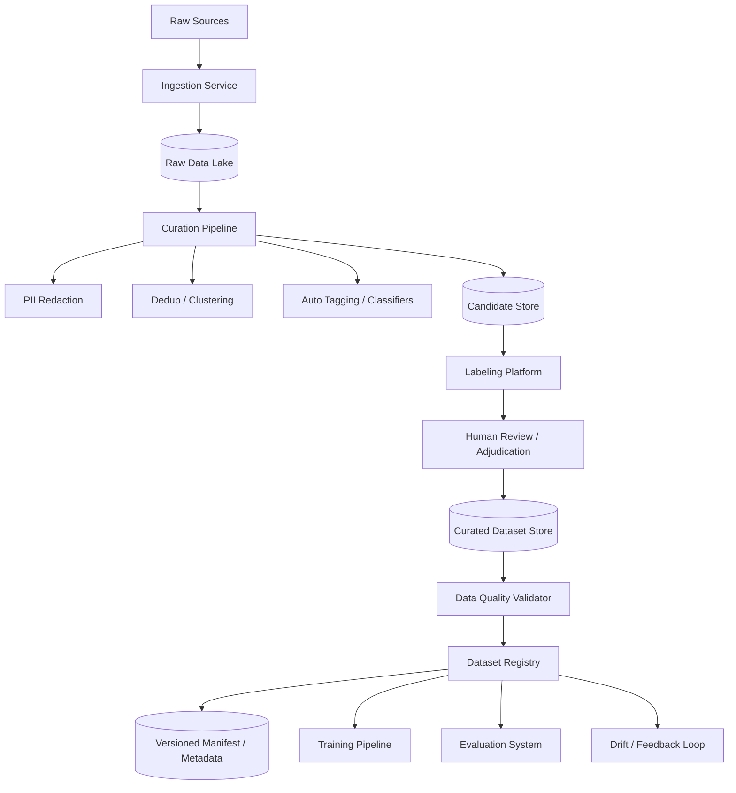

# 设计 Data Curation 系统

## 功能需求

- 支持多数据源 ingestion：production traces、人工上传、historical incidents、synthetic generation。
- 支持自动清洗和质量处理：PII redaction、dedup、filtering、clustering、tagging。
- 支持人审和标注：labeling、rubric 编写、review、adjudication。
- 支持 dataset 发布和版本管理：生成 train/eval/golden/regression datasets，并追踪 lineage。

## 非功能需求

- 可追溯：每条样本能追踪 source、处理步骤、标注人、版本。
- 高质量：防止脏数据、重复数据、PII、label inconsistency、train/eval leakage。
- 可扩展：支持百万到十亿级样本的 batch/stream processing。
- 可回滚：dataset 发布后 immutable，新版本通过 metadata/manifest 发布。

## API 设计

```text
POST /sources
- request: source_type, config, retention_policy
- response: source_id

POST /curation-jobs
- request: source_id, pipeline_config_id, target_dataset_type, filters, sampling_strategy
- response: job_id

GET /curation-jobs/{job_id}
- response: status, progress, quality_stats, error_count

POST /labeling-tasks
- request: candidate_dataset_id, guideline_id, rubric_id, reviewer_policy
- response: labeling_task_id

POST /datasets/{dataset_id}/versions
- request: candidate_set_id, validation_report_id, release_notes
- response: dataset_version

GET /datasets/{dataset_id}/versions/{version}
- response: manifest, stats, lineage, quality_report
```

## 高层架构



## 关键组件

### Ingestion Service

负责接入不同来源的数据。

常见来源：

```text
production traces
user feedback
support escalation
model failure logs
historical incidents
human-authored cases
synthetic generated cases
external benchmark datasets
```

注意事项：

- Production 数据必须有 access control 和 retention policy。
- Raw data 不直接进入 training/eval。
- 每条 raw sample 要有 `source_id`、`source_timestamp`、`trace_id`、`tenant_id`、`consent/privacy metadata`。
- Ingestion 要幂等，避免重复导入。

### Raw Data Lake

保存原始数据，通常在 S3/GCS/HDFS 上。

路径示例：

```text
s3://data-curation/raw/source=prod_trace/ds=2026-05-20/hour=10/
s3://data-curation/raw/source=incident/incident_id=abc123/
```

注意事项：

- Raw data 是 source of truth，但访问要严格控制。
- 建议使用 Iceberg/Delta/Hudi 管理大规模表，支持 schema evolution、snapshot、time travel。
- Raw data 可能包含 PII，不能给普通标注员直接看。

### Curation Pipeline

这是核心处理链路。

典型步骤：

```text
1. schema validation
2. language detection
3. PII redaction
4. spam / bot / test traffic filtering
5. invalid sample filtering
6. dedup / near-dedup
7. clustering
8. auto tagging
9. sampling
10. candidate set generation
```

注意事项：

- 每一步处理都要记录 transform version。
- 不要 overwrite 原始样本，产出新的 curated candidate。
- Pipeline 输出应该可重跑，避免手工不可复现处理。

### PII Redaction Service

负责脱敏。

处理对象：

```text
email
phone
address
name
account id
access token
API key
customer document content
payment info
```

常见方法：

- Regex / deterministic rule。
- NER model。
- Policy-specific detector。
- Human review for high-risk samples。

注意事项：

- 脱敏不能破坏任务语义。
- 例如邮箱可以替换成 `user@example.com`，但不能直接删掉导致任务不成立。
- 要保留 redaction audit log。

### Dedup / Clustering Service

生产数据里重复很多，必须去重和聚类。

方法：

```text
exact hash dedup
normalized text hash
MinHash / SimHash
embedding similarity
semantic clustering
```

作用：

- 避免高频简单样本淹没长尾。
- 找到代表性样本。
- 发现新 topic / failure mode。
- 降低标注成本。

注意事项：

- Dedup 不应该只做 exact match。
- 对 LLM query，语义重复很常见。
- 保留 cluster size，后面 sampling 可以按真实分布加权。

### Auto Tagging Service

给样本打标签，用于 slice analysis 和 sampling。

常见 tags：

```text
task_type: qa | summarization | extraction | tool_use | rag
domain: billing | refund | account | legal | healthcare
risk_level: low | medium | high
language: en | zh | es
difficulty: easy | medium | hard
behavior: requires_refusal | requires_tool_call | long_context
source: prod | synthetic | incident | human_authored
```

注意事项：

- Tag 是 eval 和 training 分析维度，不是装饰信息。
- Auto tag 要允许人工修正。
- Tagger model 也要版本化。

### Sampling Service

从 candidate pool 里选择进入标注或 dataset 的样本。

不要只随机采样。常见策略：

```text
stratified sampling
risk-weighted sampling
failure-biased sampling
freshness sampling
long-tail sampling
cluster representative sampling
```

例子：

```text
70% production representative
20% known failures / regression
10% adversarial / synthetic
```

注意事项：

- 训练集可能更关注覆盖和规模。
- Eval golden set 更关注稳定、高信号、可解释。
- Regression set 更关注历史失败和事故复现。

### Labeling Platform

支持人类标注。

任务类型：

```text
classification label
expected answer
expected facts
must_include / must_not_include
tool call expected args
RAG relevant docs
safety label
rubric score
preference pair label
```

需要记录：

```text
labeler_id
reviewer_id
guideline_version
rubric_version
timestamp
confidence
disagreement_reason
```

注意事项：

- 标注界面要展示足够上下文，但不能泄露敏感信息。
- 高风险样本需要 double review。
- 多人不一致时进入 adjudication。

### Guideline / Rubric Registry

保存标注准则和评测标准。

Rubric 例子：

```json
{
  "name": "customer_support_rag_rubric",
  "version": "v5",
  "criteria": [
    {
      "name": "correctness",
      "scale": "0-2",
      "score_2": "Fully answers according to policy.",
      "score_1": "Partially correct but misses an important detail.",
      "score_0": "Incorrect or misleading."
    },
    {
      "name": "groundedness",
      "scale": "0-2",
      "score_2": "All factual claims are supported by provided context.",
      "score_0": "Contains major unsupported claims."
    }
  ],
  "critical_failures": [
    "Invents policy exceptions.",
    "Leaks private data.",
    "Gives unsafe instructions."
  ]
}
```

注意事项：

- Guideline 改了，label 分布可能变。
- Guideline/rubric 也必须版本化。

### Data Quality Validator

发布 dataset 前做自动 QA。

检查项：

```text
schema valid
required fields present
no PII
dedup rate below threshold
label completeness
tag distribution
language distribution
class balance
source distribution
referenced docs exist
train/eval contamination check
```

还要生成 dataset-level report：

```text
total samples
samples by domain
samples by risk level
samples by source
label distribution
quality warnings
known limitations
```

### Dataset Registry / Manifest Publisher

负责发布版本化 dataset。

不要直接让训练任务读 mutable path。推荐用 manifest：

```json
{
  "dataset": "customer_support_eval",
  "version": "2026-05-20-v17",
  "files": [
    {
      "path": "s3://curated/customer_support_eval/v17/part-000.parquet",
      "sample_count": 50000,
      "checksum": "abc"
    }
  ],
  "schema_version": "v3",
  "lineage": {
    "source_jobs": ["job_123", "job_456"],
    "pipeline_config": "curation_pipeline_v8",
    "rubric_version": "v5"
  }
}
```

注意事项：

- Dataset version immutable。
- 新版本发布通过 manifest/catalog pointer。
- 旧版本保留，支持 rollback。
- Training/eval job 必须 pin dataset version。

## 核心流程

### 从线上日志生成 Eval Candidate Set

```text
1. Ingestion 从 production traces 拉取最近 7 天样本。
2. Redaction 去除 PII。
3. Filtering 去掉测试流量、空请求、spam。
4. Dedup/Clustering 合并语义重复样本。
5. Auto Tagging 标注 domain、language、risk、task_type。
6. Sampling 按分层策略抽样。
7. Candidate set 进入 labeling platform。
8. 人工标注 expected behavior 和 rubric。
9. QA 通过后发布为 eval dataset 新版本。
```

### 历史事故沉淀 Regression Set

```text
1. 线上事故关闭后，incident system 发送 failure traces。
2. Curator 选择能复现问题的样本。
3. Domain expert 标注正确行为。
4. Reviewer 审核 critical failure 定义。
5. 发布到 regression dataset。
6. 后续 release gate 必须跑这些 cases。
```

### Synthetic Data 补覆盖

```text
1. 系统发现某些 slice 覆盖不足，比如 Spanish legal query。
2. Synthetic generator 根据模板和 policy docs 生成候选样本。
3. 自动过滤低质量、重复、无意义样本。
4. Human review 审核 expected answer 和 risk tag。
5. 进入 adversarial 或 long-tail dataset。
```

## 存储选择

- Raw data lake：S3/GCS + Iceberg/Delta/Hudi，保存原始样本和处理后中间表。
- Metadata DB：Postgres/MySQL，保存 source、job、dataset、label task、review 状态。
- Object store：保存大 payload、manifest、quality report。
- Search/Vector index：支持样本搜索、近重复检测、语义聚类。
- Warehouse：Snowflake/BigQuery/ClickHouse，做分布统计和长期质量分析。
- Queue：Kafka/SQS/PubSub，驱动 ingestion、labeling、QA、publish 异步任务。

## 扩展方案

- 初期：batch job + Postgres + S3 manifest + 简单 labeling UI。
- 中期：加入 embedding clustering、自动 tagging、质量 report、dataset registry。
- 大规模：Iceberg/Delta 管理数据表，Spark/Ray 做处理，labeling workforce 分层审核。
- 企业级：RBAC、PII policy、audit log、dataset lineage、train/eval leakage detection、跨区域隔离。

## 系统深挖

### Data Versioning：覆盖还是新版本发布

- 问题：数据修复、backfill 后如何避免训练读到半新半旧数据。
- 方案 A：直接覆盖 S3 分区。简单，但没有多文件原子性。
- 方案 B：写新路径，通过 manifest 切换版本。适合 ML dataset。
- 方案 C：Iceberg/Delta snapshot commit。适合大规模表和并发读写。
- 推荐：dataset immutable，backfill 生成新版本，通过 manifest/table snapshot 发布。

### Dedup 和数据多样性

- 问题：生产数据有大量重复，高频简单问题会主导 dataset。
- 方案 A：exact hash dedup，便宜但只能处理完全重复。
- 方案 B：embedding clustering，能识别语义重复但成本更高。
- 方案 C：cluster-aware sampling，保留真实分布和长尾代表性。
- 推荐：exact dedup + semantic clustering + 分层采样。

### PII Redaction 和语义保真

- 问题：脱敏太弱会泄露隐私，脱敏太强会破坏任务。
- 方案 A：regex rules，快但召回有限。
- 方案 B：NER/PII model，覆盖更广但有误判。
- 方案 C：规则 + model + 高风险人审。
- 推荐：按数据敏感级别分层处理，并保留 redaction audit。

### Label Quality 和 Reviewer 一致性

- 问题：标注员标准不一致会污染 dataset。
- 方案 A：单人标注，成本低但质量不稳。
- 方案 B：double review，提高一致性但成本高。
- 方案 C：高风险样本 double review，低风险抽检。
- 推荐：guideline/rubric 版本化，监控 inter-annotator agreement，争议样本仲裁。

### Train/Eval Leakage

- 问题：eval data 被用于训练，会导致指标虚高。
- 方案 A：靠流程约束，简单但不可靠。
- 方案 B：dataset ACL 和 usage tracking，限制 golden set 进入 training。
- 方案 C：hash/embedding contamination check，检测相同或近似样本。
- 推荐：强制记录 dataset usage，golden eval set 禁止进入训练链路。

### Sampling Trade-off：代表性 vs 高风险

- 问题：随机采样代表真实流量，但容易漏掉低频高风险场景。
- 方案 A：production random sampling，估计真实体验好。
- 方案 B：risk/failure-biased sampling，发现问题能力强。
- 方案 C：分 dataset 分层：representative、golden、adversarial、regression。
- 推荐：不要混成一个大集合，按用途拆 dataset。

### Continuous Refresh

- 问题：用户行为、产品、policy 会变，老 dataset 会过期。
- 方案 A：固定 golden set，趋势稳定但容易陈旧。
- 方案 B：rolling production set，贴近线上但历史不可比。
- 方案 C：stable golden + rolling candidate + incident regression。
- 推荐：golden 少改，rolling 常更新，每次事故沉淀 regression cases。

## 面试亮点

- Data curation 的核心产物不是文件，而是带 lineage、quality report 和版本语义的数据资产。
- Raw data、candidate data、curated data、released dataset 要分层管理。
- Dataset 发布不要直接覆盖 S3 文件，要用 immutable data + manifest/snapshot。
- Tag 是后续 eval slice、release gate、drift analysis 的基础。
- Label guideline/rubric 本身也要版本化，否则 label 和指标会漂。
- Eval set 是测量仪器，不能被训练污染。
- Production feedback、data drift 和 incident cases 要持续回流，保证 dataset 不脱离真实世界。

## 一句话总结

Data curation 系统本质上是一个把 raw data 通过脱敏、清洗、去重、聚类、采样、标注、审核、质量校验和版本发布，转化成可追溯、可复现、可用于 training/eval 的高质量数据资产的系统。
