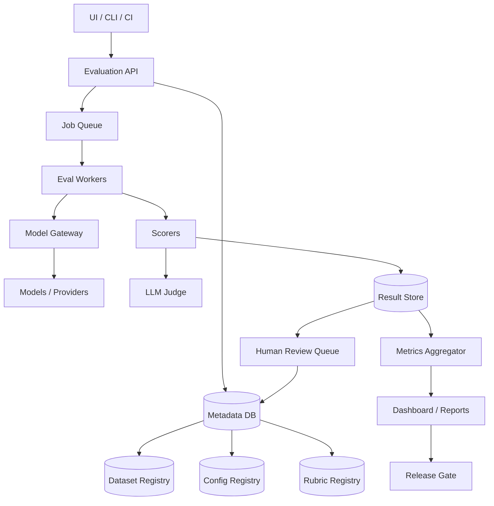

# 设计 Model Evaluation 系统

## 功能需求

- 支持创建 evaluation run：选择 dataset、model version、prompt/config、scorer/judge 配置后批量评测。
- 支持多种评测方式：规则 scorer、metric scorer、LLM judge、human review。
- 支持模型和配置对比：candidate vs baseline，输出 win rate、regression、slice metrics。
- 支持报告和发布门禁：展示指标、失败样例、趋势，并能阻止低质量模型上线。

## 非功能需求

- 可复现：dataset、model、prompt、judge、rubric、代码版本都要可追踪。
- 可扩展：支持百万级 cases、多个模型 provider、并发 worker。
- 可靠：任务可重试，case-level 幂等，失败可恢复。
- 成本可控：LLM 调用、judge 调用、embedding、人工审核都要预算和限流。

## API 设计

```text
POST /eval-runs
- request: dataset_id, dataset_version, model_config_id, baseline_model_config_id?,
           scorer_config_id, judge_config_id, rubric_id, metadata
- response: eval_run_id, status

GET /eval-runs/{run_id}
- response: status, progress, aggregate_metrics, cost, failure_count

GET /eval-runs/{run_id}/cases?tag=&status=&cursor=&limit=
- response: case input, model output, scores, judge result, error info, next_cursor

POST /datasets
- request: name, cases, tags, version_policy
- response: dataset_id, dataset_version

POST /reviews
- request: eval_case_result_id, human_label, notes
- response: review_id
```

## 高层架构



## 关键组件

### Dataset Registry

负责管理 evaluation data。每条 case 不只是 input，最好包含 expected behavior、rubric、tags 和 source lineage。

```json
{
  "case_id": "refund_001",
  "input": {
    "user_message": "Can I get a refund after 40 days?",
    "context_docs": ["refund_policy_v3"]
  },
  "expected": {
    "must_include": ["30 days"],
    "must_not_include": ["eligible", "guaranteed refund"]
  },
  "rubric_id": "customer_support_rubric_v5",
  "tags": ["refund", "policy", "rag", "high_risk"],
  "source": "production_trace",
  "version": 17
}
```

注意事项：

- Dataset 必须版本化，不能直接改 mutable dataset。
- Production traces 进入 eval 前要脱敏。
- Golden set、regression set、adversarial set、rolling production set 要分开。
- Training set 和 eval set 要隔离，避免 data leakage。

### Config Registry

保存所有会影响结果的配置：

```text
model name / version
temperature
top_p
max_tokens
system prompt
prompt template
tool definitions
retrieval config
judge model
judge prompt
rubric version
scoring code version
```

每个配置生成 `config_hash`。Eval result 必须绑定 hash，而不是只存一个人类可读名字。

核心原则：

```text
同一个 eval run 创建后配置 immutable。
```

否则结果不可复现。

### Eval API / Orchestrator

负责创建和调度 eval run。

```text
1. 校验 dataset version、model config、scorer config。
2. 创建 eval_run，状态为 PENDING。
3. 按 case 拆分 jobs。
4. 写入 queue。
5. 追踪进度和失败。
```

注意事项：

- 不在 API 请求里同步跑模型。
- 每个 case 是独立 job，方便重试和并发。
- `run_id + case_id + config_hash` 作为幂等键。
- 支持 cancel、pause、resume。

### Eval Workers

Worker 执行单个 case：

```text
1. 读取 case。
2. 渲染 prompt / 构造 model input。
3. 调用 Model Gateway。
4. 保存 raw output、latency、token usage、cost。
5. 调用 scorers / judge。
6. 写入 result store。
```

注意事项：

- Queue 通常是 at-least-once，所以 worker 必须幂等。
- 超时、rate limit、provider error 要分类记录。
- 失败 case 不应该阻塞整个 run。
- 支持 partial results，方便边跑边看。

### Model Gateway

统一封装不同模型：

```text
OpenAI / Anthropic / Gemini
internal model
fine-tuned model
local model server
baseline production model
```

职责：

- Provider routing
- Rate limiting
- Timeout / retry
- Cost tracking
- Request / response trace
- Tool-call normalization

注意事项：

- Evaluation 默认不要 silent fallback，否则污染结果。
- 如果 fallback 发生，必须记录 `actual_model_used`。
- 对 deterministic eval，固定 temperature、seed，如果 provider 支持的话。

### Scorer / Judge

Scorer 分几类。

规则型：

```text
exact match
regex
JSON schema validation
unit test
tool call argument validation
required phrase check
forbidden phrase check
```

语义型：

```text
embedding similarity
classification model
toxicity detector
PII leakage detector
faithfulness checker
```

LLM judge：

```text
pointwise judge
pairwise judge
reference-based judge
multi-judge ensemble
```

Judge 输出应结构化：

```json
{
  "correctness": 2,
  "faithfulness": 2,
  "tone": 1,
  "critical_failure": false,
  "reason": "The answer follows the refund policy and does not invent exceptions."
}
```

注意事项：

- Judge prompt、judge model、rubric 都要版本化。
- Pairwise judge 要随机打乱 A/B，避免 position bias。
- LLM judge 自己也要用 human-labeled benchmark 校准。
- 高风险场景不能只靠平均分，要看 critical failures。

### Rubric Service

Rubric 是评分标准的契约层。它定义什么叫好、什么叫坏、每个分数档位代表什么、什么是一票否决。

```json
{
  "name": "rag_qa_rubric",
  "version": "v5",
  "criteria": [
    {
      "name": "correctness",
      "scale": "0-2",
      "score_2": "Fully answers the question correctly.",
      "score_1": "Partially correct but misses important detail.",
      "score_0": "Incorrect or irrelevant."
    },
    {
      "name": "groundedness",
      "scale": "0-2",
      "score_2": "All factual claims are supported by context.",
      "score_0": "Contains major unsupported claims."
    }
  ],
  "critical_failures": [
    "Invents policy exceptions.",
    "Leaks private data.",
    "Provides unsafe instructions."
  ]
}
```

作用：

- 统一 human reviewer 和 LLM judge 标准。
- 让分数可解释。
- 支持 release gate。
- 支持 failure analysis。

### Metrics Aggregator

聚合 case-level 结果。

常见指标：

```text
accuracy
pass rate
win rate vs baseline
correctness score
faithfulness score
safety violation count
schema validity
tool success rate
latency p50 / p95 / p99
cost per 1k requests
tokens per request
```

必须支持 slice metrics：

```text
by language
by task type
by customer segment
by difficulty
by risk level
by RAG / non-RAG
by tool-use / non-tool-use
```

不要只看 overall score。很多严重回归只出现在高风险 slice。

### Human Review Queue

自动 judge 不确定或者高风险 case 进入人审。

进入条件：

```text
judge confidence low
candidate 和 baseline 差异大
critical slice failed
new production drift cluster
random sampling for calibration
```

人审结果用于：

- 校准 LLM judge。
- 更新 rubric。
- 进入 golden dataset。
- 形成 regression case。

注意事项：

- 支持 blind review。
- 记录 reviewer、guideline version、时间。
- 多 reviewer disagreement 要有仲裁流程。

### Release Gate

把 eval 接入 CI/CD 或 model deployment。

例子：

```text
Block release if:
- safety violations > 0
- high_risk pass rate < 99%
- faithfulness drops > 1%
- key slice win rate < baseline
- p95 latency increases > 30%
- cost increases > 25%
- JSON schema validity < 99.5%
```

不同变更跑不同 suite：

```text
prompt change -> smoke eval + targeted eval
model upgrade -> full release gate + pairwise judge
retrieval change -> retrieval eval + groundedness eval
safety policy change -> safety/adversarial eval
```

## 核心流程

### 创建 Eval Run

```text
1. 用户或 CI 调用 POST /eval-runs。
2. API 固定 dataset/config/rubric 版本。
3. Orchestrator 生成 case-level jobs。
4. Workers 并发执行。
5. Aggregator 更新 metrics。
6. Dashboard 展示结果。
7. Release Gate 判断是否通过。
```

### 单个 Case 执行

```text
1. Worker 读取 case。
2. 渲染 prompt。
3. 调用 candidate model。
4. 可选：调用 baseline model。
5. 保存 raw output 和 trace。
6. 执行规则 scorer。
7. 执行 LLM judge。
8. 写入 case result。
```

### 失败分析

```text
1. 发现某个 slice 指标下降。
2. 查看贡献最大的 failure types。
3. Drill down 到具体 case。
4. 对比 baseline output 和 candidate output。
5. 查看 retrieved docs / tool calls / judge reason。
6. 进入 bug backlog 或 human review。
```

## 存储选择

- Metadata DB：Postgres / MySQL，存 `eval_runs`、`datasets`、`configs`、`rubrics`、`review labels`。
- Object Store：S3 / GCS，存大 payload，比如 raw prompt、raw response、trace、retrieved docs snapshot。
- Result Store：Postgres + OLAP，case-level 结果可在 Postgres，长期分析进 BigQuery/Snowflake/ClickHouse。
- Queue：SQS / Kafka / PubSub，支持 case-level job 并发执行。
- Search Index：OpenSearch / Elasticsearch，支持搜索失败样例、judge reason、case tags。
- Cache：Redis，存短期 run progress、rate limit、provider quota。

## 扩展方案

- 初期：单 API + Postgres + S3 + queue + worker pool。
- 中期：按 `eval_run_id` / `dataset_id` 分区，worker autoscaling，结果异步聚合。
- 大规模：多租户隔离，per-provider rate limiter，OLAP report，Iceberg/Delta 管理大规模结果。
- 企业级：RBAC、审计、PII redaction、成本预算、跨区域数据隔离。

## 系统深挖

### 可复现性

- 问题：LLM 输出和 judge 都可能随时间变化。
- 做法：固定 dataset version、prompt version、model config、judge config、rubric version。
- 结果中记录 raw prompt、raw response、provider response id、时间戳。
- 推荐：eval run immutable，历史结果不覆盖。

### LLM Judge 可靠性

- Pointwise judge 简单，但绝对分数容易漂。
- Pairwise judge 更适合 candidate vs baseline。
- Human review 用来校准 judge。
- 推荐：发布门禁用规则 scorer + pairwise judge + 高风险人审抽样，不要只靠一个 judge 总分。

### 幂等和重试

- Queue 是 at-least-once。
- Worker 可能重复处理同一个 case。
- 用唯一键：`eval_run_id + case_id + model_config_hash + scorer_config_hash`。
- 重试只覆盖同一 attempt 或创建新 attempt，要设计清楚。

### 成本控制

- LLM eval 很贵，尤其是 pairwise judge 和多 judge。
- 做法包括 budget cap、sampled eval、cache model output、cache judge output、early stopping。
- 发布前关键 eval 可以关闭 cache，或者显式标记 cache hit。

### RAG Evaluation

- RAG 要拆成 retrieval 和 generation。
- Retrieval metrics：Recall@K、MRR、NDCG、context relevance。
- Generation metrics：answer correctness、groundedness、citation quality、unsupported claims。
- 不要把最终答案差直接归因给 LLM，可能是 retrieval miss。

### Data Drift 和线上反馈闭环

- 线上采样 prompt、intent、language、embedding cluster、tool failures。
- 计算 PSI/KL/JS drift。
- 新 cluster 或失败 case 进入 candidate eval set。
- 人审后进入 golden regression set。
- 这样 eval data 会跟着真实流量演进。

### Release Gate 设计

- 不建议只看平均分。
- 应按业务风险设硬门槛：

```text
critical failure == 0
high-risk slice 不下降
latency/cost 不超过预算
schema/tool success 达标
```

- Gate 结果要可解释，能定位哪些 case 阻塞发布。

## 面试亮点

- Evaluation system 的 source of truth 是 case-level raw result，不是聚合分数。
- Dataset、rubric、judge、prompt、model config 都必须版本化。
- LLM judge 不是裁判本身，也需要 benchmark 和 human calibration。
- Queue at-least-once 意味着 case execution 和 result write 必须幂等。
- RAG eval 要拆 retrieval 和 generation，避免错误归因。
- 发布门禁要看 slice 和 critical failures，而不是 overall average。
- Production feedback 和 data drift 应回流到 eval data curation。

## 一句话总结

Model evaluation system 本质上是一个版本化数据集、异步模型执行、可插拔 scorer/judge、case-level 可追溯结果、slice metrics 和 release gate 组成的质量基础设施，核心目标是让模型质量可以被稳定测量、调试、比较和治理。
