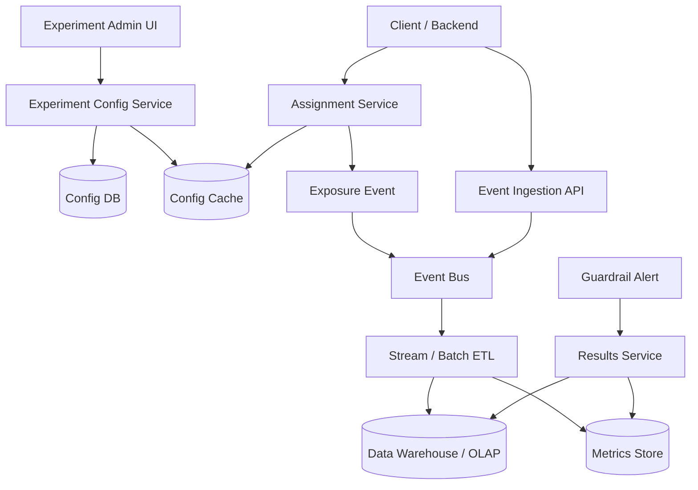

# 设计 A/B Test 系统

## 功能需求

- 支持创建实验，配置目标人群、流量比例、variants、开始/结束时间。
- 客户端/服务端可以请求实验分流结果，并稳定获得同一用户的 variant。
- 收集 exposure、click、conversion、revenue 等事件，用于实验指标分析。
- 支持实验结果 dashboard、guardrail metrics、自动/手动停止实验。

## 非功能需求

- 分流服务低延迟、高可用，不能拖慢业务请求。
- 同一用户在同一实验中分配结果稳定，除非实验版本或分流策略明确变化。
- 埋点和指标计算允许延迟，但不能丢关键 exposure/conversion 事件。
- 实验之间要避免冲突，尤其同一页面或同一用户同时进入互相影响的实验。

## API 设计

```text
POST /experiments
- request: name, owner, targeting_rules, variants[], traffic_allocation, metrics, guardrails
- response: experiment_id, status=draft

PATCH /experiments/{experiment_id}
- request: expected_version, config_changes
- response: experiment_id, version

GET /assignments?user_id=&experiment_keys=&context=
- response: assignments[{experiment_id, variant, config, assignment_id}]

POST /events
- request: events[{user_id, event_type, experiment_id?, variant?, timestamp, properties}]
- response: accepted_count

GET /experiments/{experiment_id}/results?from=&to=
- response: metrics, lift, confidence_interval, guardrails, status
```

## 高层架构



## 关键组件

- Experiment Config Service
  - 实验配置的 source of truth。
  - 管理 experiment lifecycle：draft、running、paused、stopped、launched。
  - 配置包括 targeting rules、variants、traffic allocation、互斥层、指标定义。
  - 使用 `version` 做 optimistic concurrency，避免两个 PM/工程师同时改配置覆盖。

- Config DB / Config Cache
  - Config DB 存实验配置和审计记录。
  - Config Cache 被 Assignment Service 热路径读取。
  - 配置发布要带 version，Assignment Service 根据 version 计算分流。
  - 注意：热路径不能每次查 Config DB。

- Assignment Service
  - 负责给用户稳定分配 variant。
  - 核心是 deterministic hashing：

```text
bucket = hash(user_id + experiment_id + salt) % 10000
```

  - bucket 落在哪个 traffic range，就返回对应 variant。
  - 对匿名用户可用 device_id/session_id，但登录后要考虑 identity stitching。
  - Assignment Service 返回 `assignment_id`，并产生 exposure event。

- Targeting / Eligibility Engine
  - 判断用户是否符合实验条件：
    - country、language、platform、app_version、user_segment、subscription_plan。
  - 复杂 user segment 可以离线计算好，不要在 assignment 热路径做重查询。
  - 注意：targeting 条件变化会改变实验样本，需要记录 config version。

- Event Ingestion API
  - 收集 exposure、click、conversion、purchase、latency、error 等事件。
  - 写入 Event Bus，异步处理。
  - 使用 `event_id` 或 `user_id + event_type + timestamp + request_id` 去重。
  - PII 要在 ingestion 早期脱敏或只存 hashed user id。

- Metrics Pipeline
  - Stream job 做近实时聚合，Batch job 做最终准确结果。
  - Join exposure 和 conversion，按 experiment/variant/time 分组。
  - 计算 primary metrics、secondary metrics、guardrail metrics。
  - 需要处理 late events、重复事件、bot/internal traffic。

- Results Service
  - 提供实验结果 dashboard。
  - 展示 sample size、conversion rate、lift、confidence interval、p-value 或 Bayesian probability。
  - 标记 SRM、guardrail regression、数据延迟。
  - 注意：结果展示要防止用户过早 peek 导致误判。

- Guardrail Alert
  - 监控错误率、latency、crash rate、revenue drop 等。
  - 如果明显劣化，自动暂停实验或通知 owner。
  - Alert 状态要持久化，避免重复通知。

## 核心流程

- 创建并发布实验
  - Owner 在 Admin UI 创建实验。
  - 配置目标人群、variants、流量比例、核心指标和 guardrails。
  - Config Service 校验实验互斥层和配置合法性。
  - 写 Config DB，发布到 Config Cache。
  - 实验状态变为 running。

- 用户分流
  - Client/Backend 请求 `/assignments`，带 user context。
  - Assignment Service 读取实验配置 cache。
  - Targeting Engine 判断用户是否 eligible。
  - 使用 deterministic hash 计算 bucket。
  - 返回 variant 和配置 payload。
  - 异步或同步轻量写 exposure event。

- 事件采集和指标计算
  - Client/Backend 上报 click/conversion/revenue 等事件。
  - Event API 写 Event Bus。
  - ETL 清洗、去重、join exposure。
  - Stream pipeline 产出近实时 dashboard。
  - Batch pipeline 产出每日或小时级最终结果。

- 实验停止或扩流
  - Owner 修改 traffic allocation 或停止实验。
  - Config version 更新。
  - Assignment Service 使用新配置。
  - 如果扩流，不应改变已有用户的 variant；只把新 bucket 纳入实验。

- Guardrail 自动暂停
  - Guardrail Alert 定期查询 Results Service。
  - 如果 treatment variant 错误率或延迟超阈值，写 incident。
  - 调 Config Service 暂停实验或把 traffic allocation 置 0。
  - 通知 experiment owner。

## 存储选择

- Config DB
  - PostgreSQL / MySQL / DynamoDB。
  - 存实验配置、版本、审计、权限、互斥层。
  - 需要事务和版本控制。

- Config Cache
  - Redis / Memcached / local in-memory cache。
  - 热路径读取。
  - 配置更新通过 pub/sub 或 watch 机制刷新。

- Event Bus
  - Kafka / PubSub / Kinesis。
  - 承接高吞吐事件流。
  - 按 experiment_id、event_type 或 user_id 分区。

- Data Warehouse / OLAP
  - BigQuery / Snowflake / Hive / ClickHouse / Druid。
  - 存 raw events、clean events、aggregated metrics。
  - 支持 ad-hoc analysis 和 dashboard。

- Metrics Store
  - 存预聚合实验结果，服务 Results API。
  - 可以是 ClickHouse/Druid/Pinot，也可以是 warehouse materialized table。

## 扩展方案

- Assignment Service stateless scale，配置本地缓存。
- 分流算法 deterministic，不需要每次写 assignment DB。
- Event ingestion 独立扩展，使用 Kafka 吸收峰值。
- Stream + batch 双路径：实时看趋势，batch 产出最终可信指标。
- 高流量实验的 exposure event 可以采样，但核心 conversion/revenue 不采样。
- 多 region 场景中 assignment 使用相同 hash/salt/config version，保证跨 region 一致。

## 系统深挖

### 1. 分流：Deterministic Hash vs Assignment Table

- 方案 A：每次请求写 assignment table
  - 适用场景：小规模或需要强审计每个用户分配。
  - ✅ 优点：可以直接查用户分到哪个 variant。
  - ❌ 缺点：写 QPS 高；assignment 热路径依赖 DB；扩展性差。

- 方案 B：deterministic hash
  - 适用场景：大规模 A/B 平台。
  - ✅ 优点：无状态、低延迟、稳定分流；服务可水平扩展。
  - ❌ 缺点：需要严格管理 salt、experiment_id、traffic range，否则改配置会导致用户换组。

- 方案 C：hybrid
  - 适用场景：大规模 + 审计需求。
  - ✅ 优点：热路径 hash，异步记录 exposure/assignment。
  - ❌ 缺点：debug 时要同时看配置版本和曝光事件。

- 推荐：
  - Assignment 用 deterministic hash。
  - Exposure event 记录用户实际看到 variant 的事实。
  - 不把 assignment DB 放进请求热路径。

### 2. Traffic Allocation：扩流如何不打乱已有用户

- 方案 A：重新随机分配所有用户
  - 适用场景：不适合线上实验。
  - ✅ 优点：实现简单。
  - ❌ 缺点：用户会换组，污染实验结果。

- 方案 B：固定 bucket range
  - 适用场景：生产实验。
  - ✅ 优点：已有 bucket 不变；扩流只纳入新 bucket。
  - ❌ 缺点：配置系统要维护 bucket ranges。

- 方案 C：预留实验层 / namespace
  - 适用场景：复杂实验平台。
  - ✅ 优点：可管理多个实验共享流量池，避免冲突。
  - ❌ 缺点：实验治理复杂。

- 推荐：
  - 使用 0-9999 或 0-999999 bucket space。
  - Control/Treatment 都是稳定区间。
  - 扩流只扩大区间，不重排已有用户。

### 3. 实验冲突：独立实验 vs Mutually Exclusive Layers

- 方案 A：所有实验独立分流
  - 适用场景：实验互不影响。
  - ✅ 优点：实现简单，流量利用高。
  - ❌ 缺点：同一用户可能同时进入多个互相影响的实验，结果难解释。

- 方案 B：互斥层
  - 适用场景：同一页面、同一产品面、同一核心指标的实验。
  - ✅ 优点：避免 interference，实验结果更可信。
  - ❌ 缺点：流量被切分，实验速度变慢。

- 方案 C：Factorial design
  - 适用场景：想测多个因素和交互作用。
  - ✅ 优点：可以估计 interaction effect。
  - ❌ 缺点：样本量需求大，分析复杂。

- 推荐：
  - 默认支持 mutually exclusive layers。
  - 同页面/同 funnel 的实验放同一层。
  - 独立系统层实验可以并行，但要在分析中记录 co-exposure。

### 4. Exposure Logging：Assignment 时记还是用户真正看到时记

- 方案 A：assignment 时记录 exposure
  - 适用场景：服务端 feature flag 立即影响响应。
  - ✅ 优点：实现简单，assignment 和 exposure 一致。
  - ❌ 缺点：用户可能没有真正看到组件，导致曝光膨胀。

- 方案 B：真正 render/visible 时记录 exposure
  - 适用场景：前端 UI 实验。
  - ✅ 优点：更符合 “用户实际看到 treatment”。
  - ❌ 缺点：依赖客户端上报，可能丢事件或受 adblock/网络影响。

- 方案 C：两者都记录
  - 适用场景：严肃实验平台。
  - ✅ 优点：可区分 assigned、served、viewed。
  - ❌ 缺点：事件模型更复杂。

- 推荐：
  - 后端逻辑实验：assignment/served 可作为 exposure。
  - UI 实验：记录 visible exposure。
  - 指标计算要明确 denominator 使用哪种 exposure。

### 5. Metrics Pipeline：实时 vs 离线

- 方案 A：只用实时 stream
  - 适用场景：实时监控和 guardrail。
  - ✅ 优点：延迟低，可以快速发现问题。
  - ❌ 缺点：late events、重复事件、join 错误会影响准确性。

- 方案 B：只用离线 batch
  - 适用场景：最终统计分析。
  - ✅ 优点：准确、可重算、方便复杂 SQL。
  - ❌ 缺点：延迟高，不能快速发现坏实验。

- 方案 C：Lambda-style 双路径
  - 适用场景：生产实验平台。
  - ✅ 优点：stream 提供实时趋势，batch 提供最终可信结果。
  - ❌ 缺点：两套结果可能短暂不一致，需要解释。

- 推荐：
  - Guardrail 用 stream。
  - 最终实验结论用 batch/warehouse。
  - Dashboard 标注数据 freshness 和是否 final。

### 6. 统计显著性和 Peeking

- 方案 A：每天看 p-value，显著就停
  - 适用场景：不推荐。
  - ✅ 优点：决策快。
  - ❌ 缺点：continuous peeking 会增加 false positive。

- 方案 B：固定样本量 / 固定实验周期
  - 适用场景：经典 A/B test。
  - ✅ 优点：统计解释清楚。
  - ❌ 缺点：不够灵活，坏实验可能跑太久。

- 方案 C：Sequential testing / Bayesian
  - 适用场景：成熟实验平台。
  - ✅ 优点：允许更灵活地早停。
  - ❌ 缺点：实现和解释复杂。

- 推荐：
  - 面试里不用推公式，但要说明不能随便 peeking。
  - 设置最小样本量、最短运行时间、guardrail 早停。
  - 对业务结论使用预定义 primary metric。

### 7. Guardrail Metrics 和自动停止

- 方案 A：只看 primary metric
  - 适用场景：小实验或离线分析。
  - ✅ 优点：简单。
  - ❌ 缺点：可能提升点击率但损害延迟、crash、revenue、retention。

- 方案 B：配置 guardrail metrics
  - 适用场景：生产实验。
  - ✅ 优点：保护用户体验和系统稳定性。
  - ❌ 缺点：指标多了会增加误报和决策复杂度。

- 方案 C：自动暂停
  - 适用场景：高风险实验。
  - ✅ 优点：快速止损。
  - ❌ 缺点：规则配置错误会误停实验。

- 推荐：
  - 每个实验必须有 primary metric + guardrails。
  - Guardrails 包括 error rate、latency、crash、revenue drop。
  - 高严重度 guardrail 可自动暂停，普通 guardrail 通知 owner。

### 8. Identity：匿名用户、登录用户和跨设备

- 方案 A：只按 user_id 分流
  - 适用场景：必须登录的产品。
  - ✅ 优点：稳定、简单。
  - ❌ 缺点：匿名流量无法实验。

- 方案 B：按 device_id/session_id 分流
  - 适用场景：匿名用户和前置登录页实验。
  - ✅ 优点：覆盖匿名流量。
  - ❌ 缺点：同一用户跨设备可能进入不同 variant。

- 方案 C：Identity stitching
  - 适用场景：既有匿名又有登录。
  - ✅ 优点：登录后尽量保持同一用户体验。
  - ❌ 缺点：合并规则复杂，可能影响实验样本。

- 推荐：
  - 实验配置明确 unit of randomization：user、device、session、org。
  - 登录产品优先 user_id。
  - 匿名到登录的迁移要记录 identity change，分析时可过滤或单独处理。

### 9. 配置发布和故障降级

- 方案 A：Assignment Service 每次查 DB
  - 适用场景：小规模。
  - ✅ 优点：配置最新。
  - ❌ 缺点：DB 抖动会拖慢业务请求。

- 方案 B：本地配置缓存
  - 适用场景：高 QPS 服务。
  - ✅ 优点：低延迟，高可用。
  - ❌ 缺点：配置更新有传播延迟。

- 方案 C：SDK 本地评估
  - 适用场景：移动端/前端/边缘服务。
  - ✅ 优点：无需每次请求远程 assignment。
  - ❌ 缺点：配置泄露风险、更新延迟、客户端环境不可信。

- 推荐：
  - 服务端 Assignment Service + 本地 cache 是默认方案。
  - 高性能后端可用 SDK 本地评估，但规则和 payload 要控制。
  - 配置 cache 不可用时使用 last known good config，避免业务全挂。

## 面试亮点

- A/B Test 的核心 correctness 是稳定分流：同一 user + experiment + config version 应得到稳定 variant。
- Assignment Service 不应该依赖写 DB；deterministic hash 才能支撑大规模低延迟分流。
- Exposure 事件是实验分析的事实来源，assignment 结果本身不等于用户真的看到了 treatment。
- 扩流时不能重排已有用户 bucket，否则实验会被污染。
- 实验冲突需要 mutually exclusive layers，否则多个实验互相影响导致结论不可解释。
- Metrics 要分 stream 和 batch：实时用于 guardrail，最终结论用可重算 batch。
- 高级面试点是统计治理：最小样本量、peeking 问题、guardrails、SRM 检测和 anomaly。
- 配置是 control plane，热路径只能读缓存或本地 SDK，不能每次查配置 DB。

## 一句话总结

A/B Test 系统的核心是：用版本化实验配置和 deterministic hashing 做稳定分流，用 exposure/conversion 事件流构建可重算指标体系，用互斥层、guardrails、统计治理和 batch/stream 双路径保证实验结果可信且线上风险可控。
