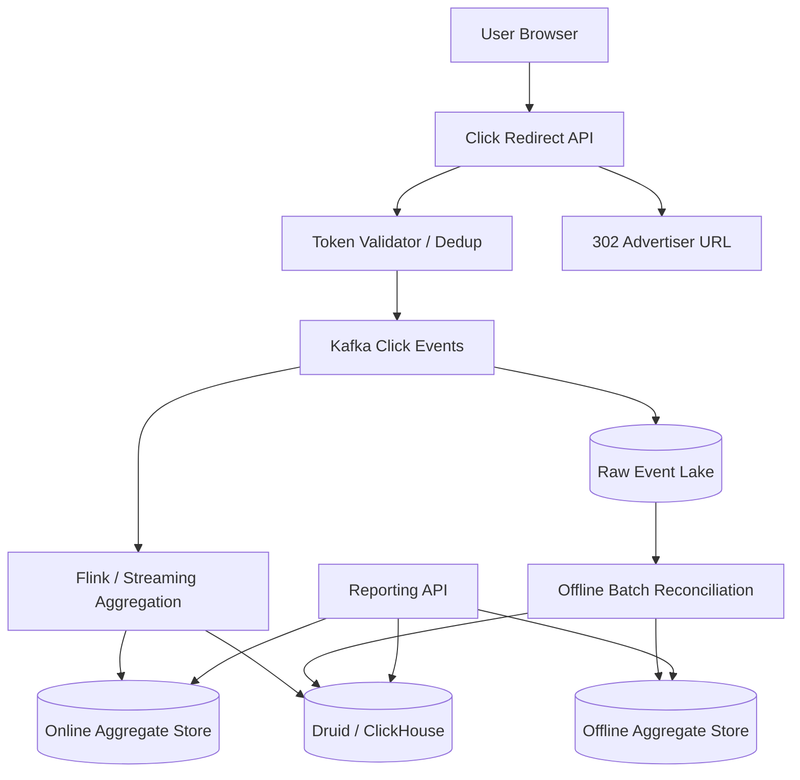

# 设计 Ads Click Aggregation 系统

## 功能需求

- 用户点击广告后，系统记录 click event，并 server-side redirect 到 advertiser landing page。
- 支持按 `ad_id / campaign_id / advertiser_id / time_bucket / geo / device` 等维度聚合点击数。
- 支持实时 dashboard 和离线高精度 reconciliation。
- 防止重复点击、伪造点击、绕过 click tracking。

## 非功能需求

- 点击路径低延迟，redirect 不应明显影响用户体验。
- 点击事件不能轻易丢失，聚合结果允许短暂延迟。
- 支持 delayed event / replay / backfill。
- 聚合结果需要可解释，方便账单、反作弊和审计。

## API 设计

```text
GET /click/{signed_click_token}
- tracking endpoint
- validate token, record click, 302 redirect to landing_url

POST /internal/click-events
- server / SDK 上报 click event
- fields: impression_id, ad_id, user_id_hash, ts, ip, user_agent

GET /ads/{ad_id}/clicks?from=&to=&granularity=minute
- 查询实时或历史聚合

POST /aggregation/replay
- replay 某个时间窗口，用于 reconciliation / backfill
```

## 高层架构



## 关键组件

- Click Redirect API
  - 广告展示时不要直接暴露 advertiser URL，而是生成 tracking URL。
  - 用户点击后先打到 `/click/{signed_click_token}`。
  - 服务端记录 click event，然后返回 `302` 到 advertiser landing page。
  - 注意：
    - 不能信任 client 上报的 `ad_id / price / campaign_id`。
    - landing URL 必须来自服务端配置，避免 open redirect。
    - redirect API 要非常轻，不能同步做复杂聚合。

- Signed Click Token / Impression ID
  - impression 生成时创建：

```text
impression_id = uuid
signature = HMAC(secret, impression_id + ad_id + campaign_id + user_id_hash + ts)
click_token = base64(payload + signature)
```

  - 点击时服务端验证 signature，防止用户伪造 `ad_id` 或 `campaign_id`。
  - token 可以带过期时间，避免旧 impression 被无限 replay。
  - secret key 定期轮换，支持多版本 key。

- Dedup / Anti Double Click
  - 对同一个 `impression_id`，短时间内只计一次有效 click。
  - 可以用 Redis：

```text
SETNX click:{impression_id} 1 EX 1d
```

  - 如果 `SETNX` 成功，写入 click event。
  - 如果失败，说明重复点击，可以记录 raw event，但不进入 billable click。
  - 注意：反作弊系统可以保留全部 raw clicks，billing aggregation 只用 dedup 后 clicks。

- Kafka
  - click event 的 durable log。
  - partition key 通常选 `ad_id` 或 `campaign_id`，保证同一广告局部有序。
  - Kafka leader-follower 复制：
    - follower 从 leader fetch。
    - ISR 同步后 ack 给 leader。
    - high watermark 之前的消息才对 consumer 可见。
  - producer 使用 idempotent producer + `acks=all`，减少重复和丢失。

- Streaming Aggregation
  - Flink 消费 Kafka，按时间窗口聚合：

```text
ad_id, campaign_id, minute_bucket -> clicks
```

  - 支持 watermark 和 allowed lateness，处理 delayed event。
  - checkpoint 保存 Kafka offset 和 aggregation state。
  - sink 要幂等或事务化，否则 checkpoint restore 后可能重复写。

- Online Aggregate Store
  - 存当天或最近几小时的实时结果。
  - 可以是 Redis / Cassandra / Pinot / Druid real-time segment。
  - 用于 dashboard 低延迟查询。
  - 注意：online store 是实时视图，不一定是最终账单结果。

- Offline Reconciliation
  - raw event 全量落到 S3/HDFS。
  - Batch job 定期重算高精度结果。
  - 修正 streaming 中因为 late event、重复、sink failure 造成的误差。
  - offline result 通常作为 billing / official reporting 的最终结果。

## 核心流程

- 广告曝光
  - Ad Server 选择广告。
  - 生成 `impression_id` 和 signed click token。
  - 返回给 client 的广告链接是 tracking URL，不是 advertiser URL。

- 用户点击
  - Client 访问 `/click/{signed_click_token}`。
  - Click API 验证 HMAC、过期时间、campaign 状态。
  - 用 `impression_id` 做 dedup。
  - 写 click event 到 Kafka。
  - 立即 `302` redirect 到 advertiser URL。

- 实时聚合
  - Flink 消费 Kafka click events。
  - 按 `ad_id + minute_bucket` 聚合。
  - 写 OnlineDB / Druid real-time ingestion。
  - Query API 查询最近数据时读实时 store。

- 离线 reconciliation
  - Kafka raw event 同时落 S3/HDFS。
  - Batch job 按天或小时重算。
  - 生成 corrected aggregate。
  - 覆盖或合并实时结果，作为最终账单数据。

## 存储选择

- Raw Event Lake
  - S3/HDFS。
  - 存所有原始 click event。
  - 用于 replay、审计、反作弊、reconciliation。

- Online Store
  - Redis：适合极低延迟 counter，但维度多会爆内存。
  - Cassandra：适合固定查询模式，比如 `ad_id + day/hour` range query。
  - Druid / Pinot：适合多维 OLAP 聚合。
  - ClickHouse：适合高吞吐列式分析和复杂 SQL。

- Offline Store
  - S3 + Parquet + Hive/Spark。
  - 或 ClickHouse / Druid batch segments。
  - 用于历史查询和最终报表。

## 扩展方案

- 点击路径只做 token validation、dedup、append log、redirect。
- 实时聚合和反作弊放异步 pipeline。
- 最近数据走 streaming result，历史数据走 batch result。
- Druid / ClickHouse 查询前面加 cache，避免 dashboard 高频 query 直接打 OLAP engine。
- 所有 derived result 都可以从 raw event replay 重建。

## 系统深挖

### 1. Server-side Redirect vs Client-side Tracking

- 方案 A：Client-side tracking pixel / JS 上报
  - 适用场景：曝光 tracking、非关键行为采集。
  - ✅ 优点：实现简单，对用户跳转路径影响小。
  - ❌ 缺点：用户或浏览器可以绕过；ad blocker 容易拦截；不能保证 click 一定被记录。

- 方案 B：Server-side redirect
  - 适用场景：广告点击、billing click、关键转化入口。
  - ✅ 优点：用户必须先经过 tracking endpoint，才能跳到 advertiser URL。
  - ❌ 缺点：增加一次网络跳转；Click API 延迟会影响用户体验。

- 推荐：
  - click billing 用 server-side redirect。
  - impression 可以用 client-side pixel + server log 结合。
  - Click API 只做轻量逻辑，避免 redirect 路径变慢。

### 2. 去重：Redis SETNX vs DB Unique Key vs Stream Dedup

- 方案 A：Redis `SETNX impression_id`
  - 适用场景：低延迟点击路径去重。
  - ✅ 优点：快；实现简单；TTL 自然清理。
  - ❌ 缺点：Redis 丢数据或 failover 可能导致少量重复；不是长期审计来源。

- 方案 B：DB unique constraint
  - 适用场景：强一致去重、小规模或账单关键写入。
  - ✅ 优点：正确性强。
  - ❌ 缺点：写入延迟高；高 QPS 下容易成为瓶颈。

- 方案 C：Streaming dedup
  - 适用场景：允许 click path 先 append raw event，后面聚合时去重。
  - ✅ 优点：点击路径最快；保留全部 raw signal。
  - ❌ 缺点：实时 dashboard 可能短暂显示重复，需要后续修正。

- 推荐：
  - click path 用 Redis `SETNX` 做快速 billable dedup。
  - raw event 仍然保留所有点击。
  - offline reconciliation 再用 `impression_id` 做最终去重。

### 3. Cassandra vs Druid vs ClickHouse

- 方案 A：Cassandra
  - 适用场景：查询模式固定，比如：

```text
ad_id + day -> minute buckets
campaign_id + day -> hourly aggregates
```

  - ✅ 优点：写入吞吐高；按 partition key range query 很稳；1 万条级别 range result 可以接受。
  - ❌ 缺点：不适合任意维度 group by；新增查询维度通常要新表或预聚合。

- 方案 B：Druid
  - 适用场景：实时 + 历史 OLAP，多维 group by，roll-up。
  - ✅ 优点：天然按时间分区；支持 roll-up；能同时 query real-time segments 和 batch segments。
  - ❌ 缺点：不适合非常高 QPS 的点查服务；数据修正、segment version、compaction 要理解清楚。

- 方案 C：ClickHouse
  - 适用场景：复杂 SQL 分析、高吞吐列式查询、报表系统。
  - ✅ 优点：查询能力强；压缩和列式扫描效率高。
  - ❌ 缺点：实时 upsert / 去重语义需要小心；运维和 schema 设计要求高。

- 推荐：
  - 固定 dashboard + 简单 range query：Cassandra 可以。
  - 多维广告分析：Druid / ClickHouse 更合适。
  - 面试里可以说：Cassandra 是 serving KV/range store，不是 ad-hoc aggregation engine。

### 4. 实时数据和离线数据如何合并

- 方案 A：一个 DB 存所有数据
  - 适用场景：规模小、查询维度简单。
  - ✅ 优点：架构简单，没有 merge 问题。
  - ❌ 缺点：实时写、历史分析、replay、修正都压在一个系统上。

- 方案 B：Online DB 存实时，Offline DB 存历史
  - 适用场景：广告系统常见模式。
  - ✅ 优点：实时路径快；离线结果更准确；历史数据成本低。
  - ❌ 缺点：Query API 需要合并 recent + historical；边界时间容易重复或漏算。

- 方案 C：Druid real-time + batch segments
  - 适用场景：希望一个 OLAP 系统 query 实时和历史。
  - ✅ 优点：Druid query engine 可以同时查 real-time data 和 historical segments。
  - ❌ 缺点：实时 segment 和 batch segment 时间区间重叠时，要靠 version / overshadow 处理冲突。

- 推荐：
  - 最近当天用实时结果，1 天前用 batch corrected result。
  - reconciliation 完成后，用 batch result 替换对应 interval 的 real-time result。
  - Druid 里通过 segment interval + version 让新 batch segment overshadow 老 segment。

### 5. Exactly-once：能做到什么，不能承诺什么

- 方案 A：At-least-once + 幂等 sink
  - 适用场景：大多数生产系统。
  - ✅ 优点：简单可靠；失败后 replay 不丢数据。
  - ❌ 缺点：sink 不幂等就会重复计数。

- 方案 B：Kafka transactional producer
  - 适用场景：一个 Kafka pipeline 中同时写多个 topic，需要原子 commit/abort。
  - ✅ 优点：支持 transaction abort rollback；减少 Kafka 内部重复。
  - ❌ 缺点：只能解决 Kafka 内部事务，不自动解决外部 DB 写入 exactly-once。

- 方案 C：Flink checkpoint + transactional / idempotent sink
  - 适用场景：stream processing aggregation。
  - ✅ 优点：checkpoint 可以保存 offset 和 state；恢复时从一致位置继续。
  - ❌ 缺点：外部 sink 必须支持 2PC、事务、幂等 key 或 overwrite。

- 推荐：
  - 面试里不要轻易说端到端 exactly-once。
  - 更好的说法是：Kafka/Flink 内部可做到 exactly-once processing，但外部效果依赖幂等写入或事务 sink。
  - 对 Druid 可以用 deterministic sequence / window key / Kafka offset tracking 降低重复 ingestion。

### 6. Delayed Event / Late Arrival

- 方案 A：严格按 event time window 关闭
  - 适用场景：实时 dashboard，延迟容忍低。
  - ✅ 优点：结果产出快。
  - ❌ 缺点：迟到事件会被丢弃或进入 correction path。

- 方案 B：Watermark + allowed lateness
  - 适用场景：允许窗口晚几分钟完成。
  - ✅ 优点：能吸收常见网络延迟和客户端延迟。
  - ❌ 缺点：dashboard 会有一段时间不断修正。

- 方案 C：离线 reconciliation 修正
  - 适用场景：账单和最终报表。
  - ✅ 优点：准确性最高；可以处理长延迟和 replay。
  - ❌ 缺点：不是实时结果。

- 推荐：
  - 实时层用 watermark + allowed lateness。
  - 超过 lateness 的事件进入 correction topic。
  - billing 以 offline reconciliation 为准。

### 7. Druid Roll-up 和 Reindex/Compaction

- 方案 A：Kafka indexing task 实时 ingestion
  - 适用场景：实时 OLAP。
  - ✅ 优点：从 Kafka 消费，生成 real-time segments，能快速查询。
  - ❌ 缺点：实时 segment 小且多，需要后续 compaction。

- 方案 B：Batch ingestion
  - 适用场景：离线修正、历史回填。
  - ✅ 优点：数据更完整，segment 更规整。
  - ❌ 缺点：有延迟，不能替代实时 dashboard。

- 方案 C：Compaction + version overwrite
  - 适用场景：实时和离线 interval 重叠。
  - ✅ 优点：把小 segment 合并，降低 query overhead；新版本 segment 可以覆盖旧版本。
  - ❌ 缺点：要管理 interval、version、roll-up 粒度，避免重复计数。

- 推荐：
  - Druid roll-up key 可以是 `ad_id + campaign_id + time_bucket + dimension set`。
  - 实时 ingestion 服务当天 dashboard。
  - batch ingestion 生成更高质量 segment，完成后 overshadow 对应实时 segment。

### 8. 查询服务：实时高 QPS vs 分析型查询

- 方案 A：直接查 Druid / ClickHouse
  - 适用场景：内部 dashboard，QPS 中等，查询复杂。
  - ✅ 优点：灵活，维度丰富。
  - ❌ 缺点：高 QPS 下成本高，容易影响集群稳定性。

- 方案 B：预聚合结果存 Online DB
  - 适用场景：广告主频繁看固定报表。
  - ✅ 优点：低延迟，高 QPS 友好。
  - ❌ 缺点：查询维度固定，灵活性差。

- 方案 C：Cache + OLAP fallback
  - 适用场景：热门广告、热门 dashboard。
  - ✅ 优点：保护 OLAP engine，降低延迟。
  - ❌ 缺点：cache invalidation 和 freshness 需要控制。

- 推荐：
  - 固定报表读预聚合 store。
  - ad-hoc 分析查 Druid / ClickHouse。
  - 热门 query 加 cache，避免 OLAP 被 dashboard 打爆。

## 面试亮点

- Click billing 不应依赖 client-side tracking，server-side redirect 才能减少 bypass。
- `impression_id + HMAC(secret)` 是防伪造的核心，`SETNX impression_id` 是防重复点击的低延迟做法。
- Raw events 必须保留，实时聚合只是 derived result，最终账单靠 offline reconciliation。
- Cassandra 适合固定 key/range 查询，不适合多维 ad-hoc 聚合；Druid/ClickHouse 更适合广告分析。
- Exactly-once 要讲清楚边界：Kafka/Flink 内部语义不等于外部 DB 端到端 exactly-once。
- Druid real-time 和 batch segment 冲突时，要用 interval + version / compaction / overshadow 来避免重复计数。
- 实时 dashboard 和 billing correctness 是两套目标：前者要快，后者要准。

## 一句话总结

Ads Click Aggregation 的核心是：点击路径用 server-side redirect 保证可追踪，用 signed impression 防伪造，用 dedup 控制重复点击，所有 raw events 进入 Kafka 和 data lake，实时层服务 dashboard，离线 reconciliation 产出最终可信结果。
