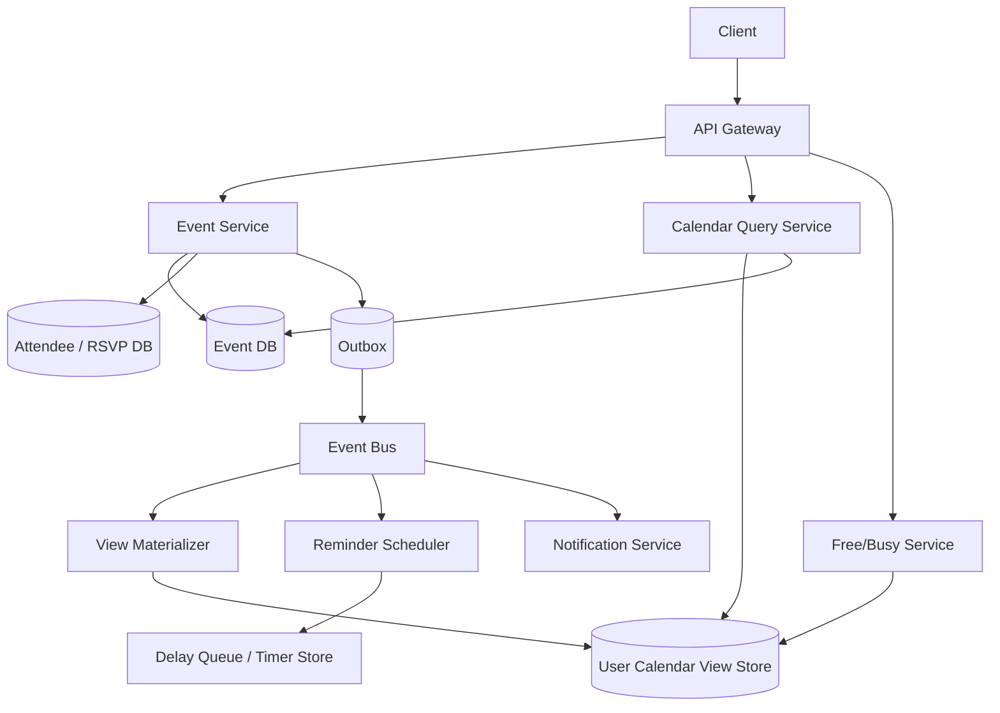

# 设计 Calendar System

## 功能需求

- 用户可以创建、更新、删除 calendar event，支持邀请参与者。
- 支持查看日/周/月视图，以及查询 free/busy availability。
- 支持 recurring event，例如每天、每周、每月重复和例外修改。
- 支持 reminder/notification，以及跨设备同步。

## 非功能需求

- 读日历视图低延迟，尤其是移动端打开日/周视图。
- 事件创建和邀请状态需要正确，不能因为并发更新覆盖用户 RSVP。
- 支持高 fanout 邀请和大规模 reminder 调度。
- 权限和隐私要严格，private event 只能暴露 busy block，不暴露详情。

## API 设计

```text
POST /calendars/{calendar_id}/events
- request: title, start_time, end_time, timezone, attendees[], recurrence_rule?, idempotency_key
- response: event_id, version, status

PATCH /events/{event_id}
- request: expected_version, fields_to_update
- response: event_id, new_version

POST /events/{event_id}/rsvp
- request: user_id, response=accepted|declined|tentative, expected_version?
- response: attendee_status

GET /calendars/{calendar_id}/events?start=&end=&cursor=
- response: events[], next_cursor

POST /freebusy/query
- request: user_ids[], start_time, end_time
- response: busy_blocks_by_user

DELETE /events/{event_id}
- request: expected_version, scope=this_event|all_following|entire_series
```

## 高层架构



## 关键组件

- Event Service
  - 负责事件 source of truth：创建、修改、删除 event。
  - 使用 `event_id` 和 `version` 做 optimistic concurrency control。
  - 创建 event 时用 `idempotency_key` 防止客户端重试创建重复事件。
  - 不同步发送所有通知；写成功后通过 outbox/event bus 异步 fanout。

- Event DB
  - 存 event master record。
  - 示例：

```text
events(
  event_id,
  organizer_id,
  calendar_id,
  title,
  description,
  start_time_utc,
  end_time_utc,
  timezone,
  recurrence_rule,
  visibility,
  status,
  version,
  created_at,
  updated_at
)
```

  - `version` 用来避免并发 update lost update。
  - recurring event 存 rule，不一定预生成所有未来 occurrence。

- Attendee / RSVP Store
  - 存每个参与者的状态。

```text
event_attendees(
  event_id,
  user_id,
  response,
  response_updated_at,
  notification_status
)
```

  - RSVP 是参与者自己的状态，不应被 organizer 修改 event 时覆盖。
  - 大会议的 attendee list 需要分页和异步 fanout。

- User Calendar View Store
  - 面向读优化的 derived store。
  - 每个用户一份 calendar view，存未来一段时间内的 event references / expanded occurrences。
  - 示例：

```text
user_calendar_view(
  user_id,
  date_bucket,
  start_time,
  event_id,
  occurrence_id,
  visibility_snapshot
)
```

  - 读日/周/月视图优先查这个 view store。
  - 它不是 source of truth，出错可从 Event DB + Attendee DB 重建。

- Recurrence Engine
  - 解析 `RRULE`，生成指定时间窗口内的 occurrence。
  - 支持 exception：修改某一次、删除某一次、修改之后所有。
  - 注意 timezone 和 DST，例如每周 9 点应按本地时间重复，而不是简单加 7*24 小时。

- Free/Busy Service
  - 查询用户忙闲状态。
  - 对 private event，只返回 busy block，不返回 title/description。
  - 对大量用户 availability 查询，要从预聚合 busy index 或 view store 读。
  - 注意权限：你能看某人的 free/busy，不代表能看事件详情。

- Reminder Scheduler
  - 处理 event reminder，比如提前 10 分钟通知。
  - 不能把所有未来 reminder 都放进内存。
  - 用 timer table / delay queue / periodic scanner 找到即将触发的 reminder。
  - 发送通知要幂等，避免重复提醒。

- Notification Service
  - 负责 email/push/in-app notification。
  - 从 event bus 消费事件变更：invite、update、cancel、reminder。
  - 失败重试进入 DLQ。
  - 通知不是 source of truth，失败不应回滚 event 创建。

## 核心流程

- 创建事件并邀请参与者
  - Client 调 `POST /calendars/{id}/events`，带 `idempotency_key`。
  - Event Service 校验 calendar 权限、时间范围和 attendees。
  - 写 Event DB 和 Attendee Store，初始 attendee 状态为 `needs_action`。
  - 通过 outbox 写 event-created 消息。
  - Materializer 为 organizer 和 attendees 更新 user calendar view。
  - Notification Service 异步发送邀请。

- 用户 RSVP
  - Attendee 调 `POST /events/{event_id}/rsvp`。
  - 服务检查该用户确实是 attendee。
  - 只更新该用户的 RSVP row，不修改 event master record。
  - 写 outbox，让 organizer 和相关客户端看到状态变化。

- 查询日历视图
  - Client 请求 `GET /calendars/{id}/events?start=&end=`。
  - Query Service 读取 User Calendar View Store。
  - 如果 view 缺失或版本过旧，从 Event DB + Attendee DB 重建该时间窗口。
  - 返回前做 final permission filtering。

- 更新 recurring event
  - Client 指定 scope：`this_event`、`all_following`、`entire_series`。
  - Recurrence Engine 写 exception 或拆分 series。
  - Materializer 重新生成受影响时间窗口的 occurrences。
  - Notification Service 只通知受影响参与者。

- Reminder 触发
  - Reminder Scheduler 扫描未来 N 分钟 reminder。
  - 到点写 notification task。
  - 发送前检查 event 仍然存在、用户未 decline、reminder 未取消。
  - 发送记录使用 idempotency key：`event_id + occurrence_id + user_id + reminder_offset`。

## 存储选择

- PostgreSQL / MySQL
  - 适合 event、attendee、calendar ACL 这种关系清晰的数据。
  - 支持事务、唯一约束、版本更新。
  - 缺点是超大规模需要按 `user_id/calendar_id` shard。

- DynamoDB / Cassandra
  - 适合 user calendar view、busy index、提醒 timer table。
  - 查询模式明确：`user_id + date_bucket`、`time_bucket + shard_id`。
  - 不适合 ad-hoc join，通常作为 derived serving store。

- Redis / Memcached
  - 缓存 hot user 的近期 calendar view 和 free/busy result。
  - 不是 source of truth。

- Event Bus
  - Kafka / SQS / PubSub。
  - 用于 view materialization、notification、reminder scheduling。
  - 消费端必须幂等，因为消息通常是 at-least-once。

## 扩展方案

- 写路径以 Event DB 为 source of truth，异步构建 user calendar view。
- 读路径按 `user_id + date_bucket` 查询 view store，避免每次 join events/attendees。
- 大会议邀请用异步 fanout，不阻塞创建 event。
- Reminder 使用 `time_bucket + shard_id` 扫描，避免单分区热点。
- 按 `user_id` 或 `calendar_id` shard view，按 `event_id` shard event master。
- 对企业租户加 tenant quota 和 isolation，避免大客户 fanout 影响全局系统。

## 系统深挖

### 1. Source of Truth：Event-Centric vs User-Centric

- 方案 A：只存 event-centric record
  - 适用场景：小规模，读频率低。
  - ✅ 优点：数据模型简单，一份 event source of truth。
  - ❌ 缺点：读用户日历时需要 join attendees 和 events，延迟高。

- 方案 B：每个用户存一份 calendar view
  - 适用场景：读多写少的日历系统。
  - ✅ 优点：用户打开日/周视图很快。
  - ❌ 缺点：写事件时要 fanout 更新多个用户 view，存在最终一致。

- 方案 C：Hybrid
  - 适用场景：生产系统。
  - ✅ 优点：Event DB 保持正确性，User View 提供低延迟读取。
  - ❌ 缺点：需要 outbox、materializer、rebuild 机制。

- 推荐：
  - Event DB + Attendee DB 是 source of truth。
  - User Calendar View 是 derived read model。
  - 读路径快，修复路径清晰。

### 2. 并发更新：Last Write Wins vs Optimistic Lock

- 方案 A：Last Write Wins
  - 适用场景：低价值字段，比如草稿备注。
  - ✅ 优点：实现简单。
  - ❌ 缺点：两个客户端同时改 event，后写会覆盖先写，用户难以理解。

- 方案 B：Optimistic Lock with version
  - 适用场景：event update 主路径。
  - ✅ 优点：避免 lost update；无锁等待。
  - ❌ 缺点：冲突时客户端需要重新拉取并 merge。

- 方案 C：字段级 merge
  - 适用场景：多人协作编辑复杂 event。
  - ✅ 优点：减少冲突，例如一个人改 title，另一个人改 reminder。
  - ❌ 缺点：merge 规则复杂，部分字段不能安全 merge。

- 推荐：
  - Event master 用 `expected_version` optimistic lock。
  - RSVP 状态拆成 attendee row，避免 organizer 更新 event 时覆盖 RSVP。
  - 冲突返回 409，让客户端刷新后重试。

### 3. Recurring Event：预展开 vs 按需展开

- 方案 A：预生成所有 future occurrences
  - 适用场景：重复范围短，比如 30 天内。
  - ✅ 优点：查询快，实现直观。
  - ❌ 缺点：无限重复无法预生成；修改规则时需要大量更新。

- 方案 B：按查询窗口动态展开
  - 适用场景：长期 recurring event。
  - ✅ 优点：存储少；修改 rule 简单。
  - ❌ 缺点：每次查询都要计算，复杂 recurrence 可能慢。

- 方案 C：滚动窗口 materialization
  - 适用场景：生产系统。
  - ✅ 优点：未来几个月查询快；远期按需展开。
  - ❌ 缺点：需要后台 job 持续补窗口和处理 exceptions。

- 推荐：
  - 存 `RRULE + exceptions` 作为 source of truth。
  - 对未来 3-12 个月生成 user view。
  - 远期查询按需展开并写回 cache/view。

### 4. Free/Busy 查询：实时扫描 vs Busy Index

- 方案 A：实时扫描 calendar events
  - 适用场景：少量用户、低 QPS。
  - ✅ 优点：结果最新，不需要额外索引。
  - ❌ 缺点：多人 meeting availability 查询会很慢。

- 方案 B：维护 busy index
  - 适用场景：企业日历，高频查多人 availability。
  - ✅ 优点：查询快，适合批量用户。
  - ❌ 缺点：event update 后 busy index 有延迟，需处理 stale。

- 方案 C：cache popular free/busy windows
  - 适用场景：近期工作时间查询非常频繁。
  - ✅ 优点：降低 DB 压力。
  - ❌ 缺点：cache invalidation 复杂，不能作为权限最终判断。

- 推荐：
  - Free/Busy 用 derived busy index。
  - 返回前根据 ACL 做过滤：private event 只显示 busy。
  - 对刚更新的 event，可读 source of truth 做短期兜底。

### 5. Reminder 调度：DB Polling vs Delay Queue vs Timer Wheel

- 方案 A：DB polling
  - 适用场景：实现简单、提醒量中等。
  - ✅ 优点：durable，容易重建。
  - ❌ 缺点：poll interval 影响准确性，扫描压力要控制。

- 方案 B：Delay queue
  - 适用场景：短期提醒，比如未来几分钟到几小时。
  - ✅ 优点：到点投递，调度逻辑简单。
  - ❌ 缺点：长时间 future reminders、取消修改较难管理。

- 方案 C：Hybrid timer table + short delay queue
  - 适用场景：大规模提醒系统。
  - ✅ 优点：timer table 存长期提醒，短期进入 delay queue 精准触发。
  - ❌ 缺点：两层状态，需要去重和版本校验。

- 推荐：
  - Reminder source of truth 存 timer table。
  - Scheduler 提前扫描未来 N 分钟，把任务放入 delay queue。
  - 发送前校验 event version/status，防止取消后仍提醒。

### 6. 邀请 Fanout：同步写所有人 vs 异步 Materialization

- 方案 A：同步写所有 attendee view
  - 适用场景：小会议，参与者少。
  - ✅ 优点：创建后所有人立即可见。
  - ❌ 缺点：大会议邀请会拖慢创建请求，甚至超时。

- 方案 B：异步 fanout
  - 适用场景：大多数生产系统。
  - ✅ 优点：创建 event 快；fanout worker 可水平扩展。
  - ❌ 缺点：attendee view 最终一致，短时间内可能未显示。

- 方案 C：按需补齐
  - 适用场景：fanout backlog 或不活跃用户。
  - ✅ 优点：不为不活跃用户浪费写入。
  - ❌ 缺点：用户打开日历时首次加载可能变慢。

- 推荐：
  - Event 创建同步写 source of truth 和 outbox。
  - Attendee view 异步 materialize。
  - 用户查询时如果 view lag，按需从 source of truth 补齐。

### 7. Privacy / Security：详情权限 vs Busy 权限

- 方案 A：缓存里存完整 event 并直接返回
  - 适用场景：不适合敏感日历。
  - ✅ 优点：读路径简单。
  - ❌ 缺点：权限变化后容易泄露 private event 详情。

- 方案 B：读时做 final ACL check
  - 适用场景：生产日历。
  - ✅ 优点：权限变更能立即生效；安全边界清晰。
  - ❌ 缺点：读路径增加 policy check。

- 方案 C：不同视图存不同 visibility snapshot
  - 适用场景：外部共享日历、企业权限复杂。
  - ✅ 优点：读路径快。
  - ❌ 缺点：权限变更时要重建视图。

- 推荐：
  - Cache/View 只是候选结果。
  - 返回前必须做 final ACL/visibility check。
  - Private event 对非授权用户只暴露 busy time，不暴露 title/location/attendees。

### 8. Offline Sync：全量拉取 vs 增量 sync token

- 方案 A：每次全量拉取时间窗口
  - 适用场景：小用户、简单客户端。
  - ✅ 优点：实现简单。
  - ❌ 缺点：移动端流量和延迟差，无法高效跨设备同步。

- 方案 B：增量 sync token
  - 适用场景：多设备日历客户端。
  - ✅ 优点：只拉变更，低流量，适合离线恢复。
  - ❌ 缺点：需要维护 change log 和 token 过期策略。

- 方案 C：Push notification + incremental sync
  - 适用场景：移动端和桌面端实时同步。
  - ✅ 优点：体验好，延迟低。
  - ❌ 缺点：push 丢失时仍需要 sync token 兜底。

- 推荐：
  - 提供 `sync_token` API。
  - Change log 保留一段时间，token 太旧则要求客户端重建窗口。
  - Push 只是提示客户端 sync，不承载完整正确性。

## 面试亮点

- Calendar 的 source of truth 应该是 Event + Attendee 状态，用户日历视图只是 derived read model。
- RSVP 不能和 event master 混在一起，否则 organizer 更新 event 可能覆盖 attendee 的响应。
- Recurring event 要存 rule 和 exceptions，不能简单预生成无限未来事件。
- Free/Busy 权限和 event detail 权限不同，private event 只能返回 busy block。
- Reminder 调度不能全放内存，应该用 durable timer table + short delay queue。
- 大会议邀请是 fanout 问题，创建 event 不应同步写所有人的 view。
- Push notification/SSE 只是同步提示，不是 source of truth；客户端要靠 sync token 补齐。

## 一句话总结

Calendar System 的核心是：用 Event DB 和 Attendee Store 保持正确性，用异步 materialized user view 支撑低延迟读取，用 recurrence engine、free/busy index、reminder scheduler 和严格 ACL 处理日历系统真正复杂的边界。
