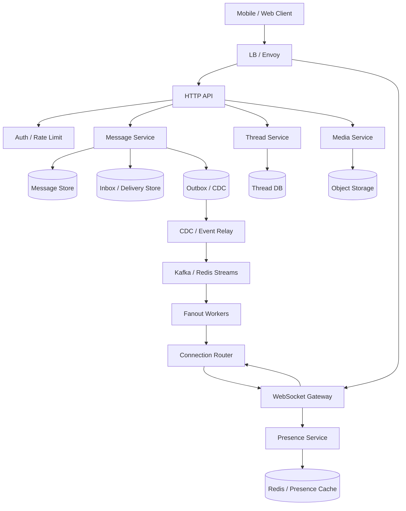

# 设计 Chat App 系统

## 功能需求

- 用户可以发送/接收 1:1 或群聊消息，在线时实时送达，离线后可补齐。
- 支持消息状态：sent、delivered、read，以及 unread count。
- 支持 presence，知道用户是否在线以及连接在哪个 region / chat server。
- 支持媒体附件：图片、视频、文件上传和消息引用。

## 非功能需求

- 在线消息低延迟，目标 `< 200ms`。
- 消息不能丢；WebSocket 推送可以失败，但消息必须能从存储补齐。
- 支持十亿级用户，需要按 user/thread/region 分片。
- 多 region 下允许异步复制，但单个 conversation 内要有可解释的顺序。

## API 设计

```text
POST /messages
- sender_id, thread_id, client_msg_id, content, attachments

GET /threads/{thread_id}/messages?before=cursor&limit=50
- 拉历史消息

POST /threads/{thread_id}/read
- user_id, last_read_message_id 或 last_read_seq

GET /users/{user_id}/presence
- online, region, device_count

POST /attachments/upload-url
- file_name, content_type, size
- 返回 pre-signed URL
```

## 高层架构



## 关键组件

### WebSocket Gateway

- 维护客户端长连接，负责实时下发 message、typing、presence、read receipt。
- 注意事项：
  - Gateway 本地保存 `connection_id -> user_id`。
  - 全局连接路由存在 Redis / routing store：

```text
user_id -> region, chat_server_id, connection_ids
```

  - WebSocket 只负责低延迟推送，不是可靠消息来源。
  - Client disconnected 后，重连用 cursor / inbox 拉取缺失消息。

### HTTP API

- 处理发消息、拉历史、上传附件、更新 read state。
- 注意事项：
  - 发消息用 HTTP 更容易复用成熟 retry、LB、auth、idempotency。
  - 如果用 WebSocket 发消息，延迟低，但要自己做 send retry、ack、backpressure。
  - 大规模系统通常可以：发送走 HTTP，实时接收走 WebSocket。

### Message Service

- 消息写入核心服务。
- 职责：
  - 校验用户是否属于 thread。
  - 用 `client_msg_id` 做幂等。
  - 写 Message Store。
  - 写 Inbox / Delivery Store。
  - 通过 outbox/CDC 触发 fanout。
- 注意事项：
  - 推荐先写 DB，再通过 CDC/outbox 触发推送，避免 DB 和 pub/sub 不一致。
  - 不要先 pub/sub 再写 DB，否则推送出去了但落库失败会很难处理。

### Message Store

- 保存可靠消息历史。
- 可用 NoSQL / 分片 MySQL / Cassandra / DynamoDB。
- 表设计示例：

```text
messages(
  thread_id,
  message_seq,
  message_id,
  sender_id,
  content,
  attachment_ids,
  created_at,
  state
)
```

- 注意事项：
  - 核心查询是按 `thread_id` 分页读取。
  - `message_id` 可以是 `user_id + timestamp + sequence` 或 Snowflake/UUIDv7。
  - 对大型群聊可按 `thread_id + time_bucket` 分区。

### Inbox / Delivery Store

- 维护每个接收者的待送达消息。
- 示例：

```text
inbox(user_id, message_id, thread_id, delivery_state, created_at)
```

- 注意事项：
  - Fanout 时给目标用户写 inbox entry。
  - 客户端收到并 ack 后，可以删除 inbox entry 或标记 delivered。
  - 离线用户上线后读取 inbox 补齐。
  - 这是 delivery guarantee 的关键，不依赖 pub/sub 是否可靠。

### Thread Service

- 管理 conversation/thread metadata。
- 表设计示例：

```text
threads(
  thread_id,
  participant_hash,
  participant_ids,
  created_at,
  updated_at
)

user_threads(
  user_id,
  thread_id,
  last_read_seq,
  unread_count,
  updated_at
)
```

- 注意事项：
  - `user_threads` 以 `user_id` 做 shard key，方便查某个用户的会话列表。
  - 1:1 chat 可以给双方各存一份 thread index。

### Presence Service

- 维护用户在线状态、所在 region、chat server。
- 注意事项：
  - Presence 用 TTL，弱一致即可。
  - Global Presence Service 用于跨 region 查询用户在线位置。
  - 查询 global presence 时，可以顺便把用户状态同步到本 DC cache。

### Media Service

- 管理附件上传。
- 注意事项：
  - 大文件不要经过 chat server。
  - 用 pre-signed URL 直传 object storage。
  - 消息只保存 `attachment_id` 和 metadata。
  - 图片/视频可异步生成 thumbnail、transcode、virus scan。

## 核心流程

### 发送消息

- Client 调 `POST /messages`，带 `client_msg_id`。
- Message Service 校验 thread membership。
- 写 `messages` 表，分配 `message_seq`。
- 给每个接收者写 inbox entry。
- 写 outbox event，或由 CDC 捕获 message insert。
- Event Relay 把事件写入 Kafka / Redis Streams。
- Fanout Worker 查询接收者 presence 和 connection route。
- 如果接收者在线，推给对应 WebSocket Gateway。
- 如果离线，保留 inbox，后续上线拉取。

### 客户端确认 delivery

- Client 收到消息后，发送 ack。
- 服务端把 inbox entry 标记 delivered 或删除。
- 如果用户打开 thread 并读到消息，更新 `last_read_seq`。
- Read receipt 可异步推给发送方。
- 未 ack 的 inbox entry 会在重连时再次下发。

### 客户端断线重连

- Client 重新建立 WebSocket。
- Gateway 更新 presence 和 connection routing。
- Client 带上 `last_seen_message_id/seq`。
- 服务端从 Message Store 或 Inbox 拉取缺失消息。
- 推送期间如果有新消息，按 seq 去重合并。

### 跨 region 发消息

- 发送方写入 home region 或 thread owner region。
- Message event 异步复制到目标 region。
- 目标 region 根据 global presence 找在线接收者。
- 如果目标用户在线，目标 region 推送。
- 如果不在线，依靠 inbox / message store 补齐。
- Kafka MirrorMaker 可用于跨 DC 同步 Kafka topic，但语义是异步复制。

## 存储选择

- **Message Store**
  - NoSQL / DynamoDB / Cassandra / 分片 MySQL。
  - Source of truth for message history。
- **Inbox / Delivery Store**
  - 可用 DynamoDB / Cassandra / Redis Streams + durable store。
  - 保存 pending delivery。
- **Thread DB**
  - SQL 或 KV。
  - 保存 thread 和 user thread index。
- **Redis**
  - Presence、connection routing、短 TTL lock、rate limit。
- **Kafka / Redis Streams**
  - Fanout event stream。
  - Kafka 高吞吐、可 replay。
  - Redis Streams 比 Redis Pub/Sub 更可靠，支持持久化和 consumer group。
- **Object Storage**
  - 附件、图片、视频。
- **ZooKeeper / Consul / Service Registry**
  - 服务注册、chat server membership、consistent hashing ring metadata。

## 扩展方案

- 按 `user_id` 分片 inbox 和 user thread index。
- 按 `thread_id` 分片 message history。
- Chat servers 用 consistent hashing 分配用户连接，减少 routing metadata 变化。
- ZooKeeper 存 chat server membership / consistent hash ring；不要用 ZooKeeper 高频写负载指标。
- 负载监控用 Prometheus / Consul / Eureka，流量入口用 Envoy/Nginx 做 LB。
- 跨 region 用异步复制：Kafka MirrorMaker、DB async replication、region-local inbox。
- 超大群聊使用 fanout-on-read 或分层 fanout，普通 1:1 和小群用 inbox fanout。

## 系统深挖

### 1. 发消息协议：WebSocket send vs HTTP POST

- 问题：
  - 消息发送应该走 WebSocket 还是 HTTP？
- 方案 A：WebSocket 发送和接收都走同一条连接
  - 适用场景：
    - 极低延迟、强实时互动。
  - ✅ 优点：
    - 延迟低。
    - 双向通信自然。
  - ❌ 缺点：
    - 横向扩展和 retry 语义更复杂。
    - 连接断开时发送失败，需要自定义重试和幂等。
- 方案 B：HTTP POST 发送，WebSocket 接收
  - 适用场景：
    - 大规模生产 chat app。
  - ✅ 优点：
    - HTTP retry、LB、auth、observability 成熟。
    - 写路径更容易做幂等和限流。
    - WebSocket 专注实时下发。
  - ❌ 缺点：
    - 比纯 WebSocket 多一点请求开销。
- 方案 C：客户端同时支持两者
  - 适用场景：
    - 移动端复杂网络环境。
  - ✅ 优点：
    - WebSocket 可用时低延迟，不可用时 HTTP fallback。
  - ❌ 缺点：
    - 客户端和服务端逻辑复杂。
- 推荐：
  - 用 HTTP POST 发消息，WebSocket 收消息。
  - 如果面试官强调 `<200ms` 极致低延迟，可以补充 WebSocket send + HTTP fallback。

### 2. Pub/Sub：Redis PubSub vs Redis Streams vs Kafka

- 问题：
  - 消息写入后，如何通知在线用户？
- 方案 A：Redis Pub/Sub
  - 适用场景：
    - 轻量实时通知、允许丢事件。
  - ✅ 优点：
    - 非常轻量，延迟低。
    - 实现简单。
  - ❌ 缺点：
    - At-most-once。
    - 没有订阅者时消息丢失。
    - 不适合 delivery guarantee。
- 方案 B：Redis Streams
  - 适用场景：
    - 需要比 Pub/Sub 更可靠，但规模不一定到 Kafka。
  - ✅ 优点：
    - 支持持久化、consumer group、ack。
    - 类似轻量 Kafka。
  - ❌ 缺点：
    - 大规模跨 region replay、生态和吞吐不如 Kafka。
- 方案 C：Kafka
  - 适用场景：
    - 高吞吐、可 replay、多 consumer。
  - ✅ 优点：
    - 持久化、高吞吐、可回放。
    - 适合 CDC/outbox 后的 fanout pipeline。
  - ❌ 缺点：
    - 订阅每个用户一个 topic 不现实。
    - Kafka subscription 不适合作为在线连接路由。
- 推荐：
  - 不要用 Kafka 做 per-user subscription。
  - Message event 用 Kafka/Redis Streams。
  - 在线 connection routing 用 Redis/routing service。
  - 可靠性靠 DB + inbox，不靠 Pub/Sub 本身。

### 3. Delivery guarantee：只 push vs inbox

- 问题：
  - 怎么知道哪些 message 用户收到了，哪些没收到？
- 方案 A：只通过 WebSocket push
  - 适用场景：
    - Typing、presence 这类临时事件。
  - ✅ 优点：
    - 延迟低，系统简单。
  - ❌ 缺点：
    - Client disconnected 或 server failure 时会丢。
- 方案 B：维护 inbox / delivery store
  - 适用场景：
    - 需要保证消息送达。
  - ✅ 优点：
    - 每个接收者有 pending message entry。
    - Client ack 后删除或标记 delivered。
    - 离线用户上线后可补齐。
  - ❌ 缺点：
    - 写放大，尤其群聊成员多时。
    - Inbox 清理和状态维护更复杂。
- 方案 C：只用 message store + client cursor
  - 适用场景：
    - 不需要 per-message delivered 状态，只要求最终可拉取。
  - ✅ 优点：
    - 写路径轻。
    - 通过 `last_seen_seq` 补齐。
  - ❌ 缺点：
    - 很难精确知道每条消息是否送达设备。
- 推荐：
  - 1:1 / 小群用 inbox 保证 delivery。
  - 大群可用 message store + cursor，避免巨大写放大。
  - Client ack 是删除 inbox entry 或更新 delivery state 的关键。

### 4. DB write 和 Pub/Sub 一致性：2PC vs Saga vs Outbox/CDC

- 问题：
  - 写 DB 成功但 pub/sub 失败怎么办？先 pub/sub 后 DB 失败怎么办？
- 方案 A：Two-phase commit
  - 适用场景：
    - 少数强一致跨资源事务。
  - ✅ 优点：
    - 强一致语义。
  - ❌ 缺点：
    - 复杂、慢、可用性差。
    - 不适合高吞吐聊天主链路。
- 方案 B：Saga
  - 适用场景：
    - 多服务业务流程，有补偿动作。
  - ✅ 优点：
    - 适合长事务。
  - ❌ 缺点：
    - 对“DB 写 + 发事件”这个场景有点重。
- 方案 C：Transactional outbox / CDC
  - 适用场景：
    - 消息写入后触发 fanout、notification、push。
  - ✅ 优点：
    - DB 写 message 和 outbox 在同一事务。
    - CDC/Event Relay 异步发布事件。
    - 避免 DB 成功但事件丢失。
  - ❌ 缺点：
    - 事件有延迟。
    - 需要 outbox relay、幂等 consumer。
- 推荐：
  - 用 DB-first + outbox/CDC。
  - Fanout、notification、push 都从 CDC event 触发。
  - 这是保证消息可靠和系统可扩展的关键。

### 5. Message ordering：全局顺序 vs thread 顺序 vs sender/receiver counter

- 问题：
  - 聊天消息怎么排序？
- 方案 A：全局顺序
  - 适用场景：
    - 全局审计日志。
  - ✅ 优点：
    - 顺序模型统一。
  - ❌ 缺点：
    - 全局 sequencer 是瓶颈。
    - 对 chat 没必要。
- 方案 B：每个 thread 一个递增 sequence
  - 适用场景：
    - 大多数 chat conversation。
  - ✅ 优点：
    - 用户看到的对话内顺序稳定。
    - 可按 `thread_id` 分区。
  - ❌ 缺点：
    - 跨 thread 没顺序。
    - 热门大群 thread 会成为热点。
- 方案 C：发送方/接收方各维护 counter
  - 适用场景：
    - 需要本地设备同步、发送/接收视角分别排序。
  - ✅ 优点：
    - 可帮助解决多设备同步和去重。
    - 对每个用户 inbox 排序友好。
  - ❌ 缺点：
    - 与 thread global order 合并时复杂。
- 推荐：
  - 对话内用 `thread_id + message_seq`。
  - 用户 inbox / device sync 可维护 per-user receive cursor。
  - 不做全局顺序。

### 6. Service discovery：ZooKeeper consistent hashing vs LB

- 问题：
  - 十亿用户下，如何找到用户连接在哪台 chat server？
- 方案 A：ZooKeeper 管 chat server membership + consistent hash ring
  - 适用场景：
    - 需要稳定地把 user_id 映射到 chat server pool。
  - ✅ 优点：
    - Membership 一致。
    - Server 增减时迁移范围可控。
  - ❌ 缺点：
    - ZooKeeper 不适合高频负载更新。
    - 不应把每个用户连接状态都频繁写 ZK。
- 方案 B：Redis / KV 存 connection routing
  - 适用场景：
    - 高频连接状态更新。
  - ✅ 优点：
    - 查询快，写入简单。
    - TTL 可清理断开连接。
  - ❌ 缺点：
    - 需要处理 KV 故障和过期误差。
- 方案 C：Envoy/Nginx LB + routing service
  - 适用场景：
    - 入口负载均衡和服务发现。
  - ✅ 优点：
    - LB 处理连接分发。
    - Routing service 处理 user -> connection。
  - ❌ 缺点：
    - 需要额外 routing lookup。
- 推荐：
  - ZooKeeper 只管理服务 membership / consistent hash ring。
  - Redis/KV 管高频 connection routing。
  - 负载监控用 Prometheus/Consul/Eureka，不要用 ZooKeeper 高频写负载指标。

### 7. Multi-region：同步复制 vs 异步复制

- 问题：
  - 用户在不同地区通信，消息和 presence 怎么处理？
- 方案 A：全球同步写
  - 适用场景：
    - 极少数强一致要求。
  - ✅ 优点：
    - 跨 region 数据一致性强。
  - ❌ 缺点：
    - 延迟高，影响 `<200ms`。
    - 可用性和复杂度差。
- 方案 B：Home region + 异步复制
  - 适用场景：
    - 大规模 chat app。
  - ✅ 优点：
    - 写入延迟低。
    - 架构可扩展。
    - Kafka MirrorMaker 可异步同步 topic。
  - ❌ 缺点：
    - 跨 region 消息和 presence 有延迟。
    - 冲突处理和顺序要定义清楚。
- 方案 C：Thread region / conversation owner region
  - 适用场景：
    - 跨地区对话很多，希望对话内顺序稳定。
  - ✅ 优点：
    - 一个 thread 固定写入一个 region，顺序清晰。
  - ❌ 缺点：
    - 远端用户发消息要跨 region。
- 推荐：
  - 用 home region 或 thread owner region。
  - 跨 DC 数据异步复制。
  - Global Presence Service 告诉本 region 用户在哪，查询时顺便同步 presence cache。

### 8. Unread count：存 counter vs 实时计算

- 问题：
  - 未读数要不要实时维护？
- 方案 A：每个 user_thread 存 unread_count
  - 适用场景：
    - 1:1、小群、会话列表高频读取。
  - ✅ 优点：
    - 读快。
    - 展示会话列表简单。
  - ❌ 缺点：
    - 每条消息都要更新接收者 counter。
    - 群聊写放大明显。
- 方案 B：用 latest_seq - last_read_seq 实时计算
  - 适用场景：
    - 大群或弱一致 unread。
  - ✅ 优点：
    - 写路径轻。
  - ❌ 缺点：
    - 删除、mute、mention-only 会让逻辑变复杂。
- 方案 C：混合
  - 适用场景：
    - 真实 chat app。
  - ✅ 优点：
    - 小会话精确，大群可扩展。
  - ❌ 缺点：
    - 实现复杂，产品语义要清晰。
- 推荐：
  - 1:1、小群存 unread counter。
  - 大群用 last_read_seq 或只维护 mention count。
  - Unread 不阻塞消息主链路。

### 9. Media attachment：经过 chat server vs direct upload

- 问题：
  - 图片/视频/文件附件怎么上传？
- 方案 A：通过 chat server 上传
  - 适用场景：
    - 小文件、内部系统。
  - ✅ 优点：
    - 权限校验直接。
  - ❌ 缺点：
    - Chat server 带宽压力大。
    - 大文件会影响消息服务。
- 方案 B：Object storage pre-signed URL
  - 适用场景：
    - 大多数生产系统。
  - ✅ 优点：
    - Client 直传 S3/Object Store。
    - App server 不承载大流量。
  - ❌ 缺点：
    - 需要 upload session、扫描、状态回调。
- 方案 C：异步处理 media
  - 适用场景：
    - 图片压缩、视频转码、病毒扫描。
  - ✅ 优点：
    - 发送消息不等待重处理。
  - ❌ 缺点：
    - 用户可能先看到 processing 状态。
- 推荐：
  - 附件用 pre-signed URL 直传。
  - 消息里引用 `attachment_id`。
  - Media scan/thumbnail/transcode 异步完成。

## 面试亮点

- 可以深挖：Redis Pub/Sub 是 at-most-once，不适合 delivery guarantee；可靠性要靠 DB + inbox。
- Staff+ 判断点：先写 DB，再通过 outbox/CDC 触发 fanout，解决 DB 和 pub/sub 一致性。
- 可以深挖：Kafka 不适合 per-user subscription，适合做 message event log；在线路由要靠 presence/routing service。
- Staff+ 判断点：ZooKeeper 管 membership，不适合高频负载和连接状态更新。
- 可以深挖：跨 region 用异步复制和 global presence，不要为了聊天消息做全球同步写。
- Staff+ 判断点：WebSocket 负责低延迟，delivery guarantee 由 inbox/cursor/ack 负责。

## 一句话总结

- Chat app 的核心是把低延迟实时推送和可靠消息交付拆开：消息先写入 DB 和 inbox，再通过 CDC/outbox 触发 Kafka/Streams fanout 到 WebSocket；WebSocket 只做在线推送，离线/断线靠 inbox 和 cursor 补齐；多 region 下用异步复制、global presence 和 per-thread ordering 保持可扩展性。
