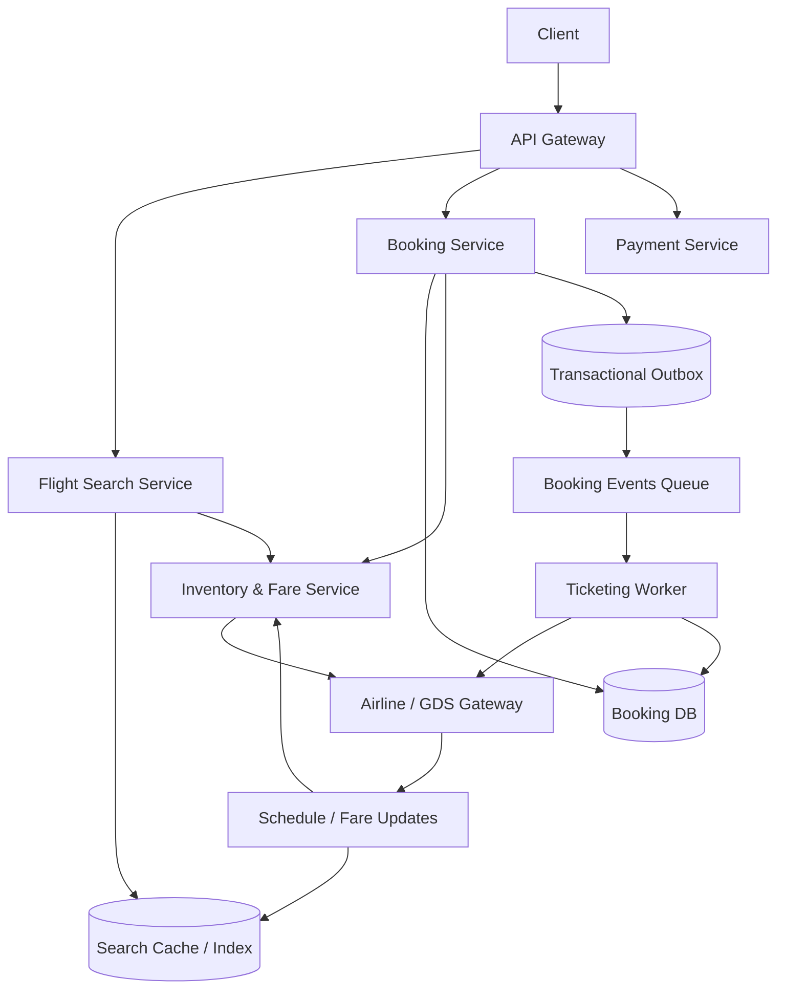

# 设计 Flight System

## 功能需求

- 用户可以搜索航班，按出发地、目的地、日期、乘客数、舱位筛选。
- 用户可以选择航班并创建 booking hold，在限定时间内完成支付出票。
- 支持取消、改签、查询订单状态。
- 支持实时或准实时同步航班库存、价格、延误/取消等状态。

## 非功能需求

- 搜索低延迟，但搜索结果允许短暂 stale；下单前必须重新验证价格和库存。
- 库存正确性优先，不能因为并发导致不可控超卖。
- booking/payment/ticketing 需要可审计、可恢复、幂等。
- 系统要能对接外部 airline/GDS/NDC provider，处理慢响应、失败和状态不确定。

## API 设计

```text
GET /flights/search?from=&to=&depart_date=&return_date=&passengers=&cabin=
- response: itineraries[], search_token

POST /bookings/hold
- request: itinerary_id, fare_id, passengers[], idempotency_key, search_token
- response: booking_id, status=held, expires_at, price_quote

POST /bookings/{booking_id}/pay
- request: payment_id
- response: status=paid|ticketing|failed

GET /bookings/{booking_id}
- response: booking_status, payment_status, ticket_status, itinerary, price

POST /bookings/{booking_id}/cancel
- request: reason
- response: status=cancel_pending|cancelled|not_cancellable

POST /bookings/{booking_id}/change
- request: new_itinerary_id, fare_id
- response: change_quote, status
```

## 高层架构



## 关键组件

- Flight Search Service
  - 负责低延迟搜索和排序。
  - 主要读 Search Cache / Index，不直接在每个搜索请求中打 airline/GDS。
  - 返回 `search_token`，记录搜索时间、fare snapshot、查询条件。
  - 注意：搜索结果只是 quote，不是库存承诺；下单前必须 reprice/revalidate。

- Inventory & Fare Service
  - 管理本地缓存的 seat availability、fare class、price rules。
  - 对接 airline/GDS/NDC provider 做实时 revalidate。
  - 处理 cabin、fare bucket、fare rules、tax/fee。
  - 注意：同一航班不是简单一个库存数，而是多个 fare class 和舱位库存。

- Booking Service
  - booking 的 source of truth。
  - 创建 hold、确认支付、取消、改签、状态查询。
  - 下单 API 必须使用 `idempotency_key`，防止重复点击生成多个 booking。
  - 不在 DB lock 中等待支付或外部出票；使用状态机。

- Booking DB
  - 存 booking、passenger、payment、ticket 状态。

```text
bookings(
  booking_id,
  user_id,
  itinerary_id,
  fare_id,
  status: held|paid|ticketing|ticketed|cancelled|expired|failed
  hold_expires_at,
  price_amount,
  price_version,
  supplier_pnr,
  idempotency_key,
  version,
  created_at,
  updated_at
)

booking_segments(
  booking_id,
  flight_id,
  fare_class,
  seat_count,
  segment_status
)
```

  - 使用 `version/CAS` 防止 payment callback、expiration、ticketing callback 竞态。
  - `supplier_pnr` 是外部 airline/GDS booking reference。

- Supplier Gateway
  - 封装 airline/GDS/NDC API。
  - 负责 reprice、hold inventory、ticket issue、cancel/refund、schedule change webhook。
  - 必须支持 timeout、retry、circuit breaker 和 idempotency key。
  - 外部系统可能返回慢、重复回调、未知状态。

- Ticketing Worker
  - 支付成功后异步出票。
  - 从 outbox/MQ 消费 ticketing task。
  - 调 Supplier Gateway issue ticket。
  - 更新 Booking DB：`paid -> ticketing -> ticketed/failed`。
  - 如果出票状态 unknown，进入 reconciliation，不要盲目重复出票。

- Expiration Worker
  - 扫描 `held AND hold_expires_at < now`。
  - 将 booking 置为 expired，并释放本地/外部 hold。
  - 与支付成功通过 CAS 竞争，只有一个状态转换成功。

- Schedule/Fare Update Pipeline
  - 接收航空公司 schedule changes、fare updates、availability updates。
  - 更新 Search Cache 和 Inventory Cache。
  - 对已出票/已预订订单发通知或触发改签/退款流程。

## 核心流程

- 搜索航班
  - 用户调用 `/flights/search`。
  - Search Service 查 Search Cache / Index。
  - 聚合直飞/中转 itinerary、价格、舱位、剩余座位粗略信息。
  - 返回候选 itinerary 和 `search_token`。
  - 搜索结果设置短 TTL，例如 1-5 分钟。

- 创建 booking hold
  - 用户选择 itinerary 后调用 `/bookings/hold`。
  - Booking Service 检查 idempotency。
  - Inventory & Fare Service 调 supplier 做 reprice/revalidate。
  - 如果价格或库存变化，返回新 quote 或失败。
  - 成功后创建 `held` booking，设置 `hold_expires_at`。
  - 写 Booking DB 和 outbox event。

- 支付和出票
  - 用户在 hold 过期前支付。
  - Payment Service payment callback 到 Booking Service。
  - Booking 状态从 `held -> paid`。
  - Ticketing Worker 异步调用 supplier issue ticket。
  - 出票成功后状态变为 `ticketed`，保存 ticket number / PNR。
  - 出票失败进入 `ticketing_failed` 或人工/自动补偿。

- 取消订单
  - 如果 still held，直接取消并释放 hold。
  - 如果已 paid 但未 ticketed，根据 supplier 能力取消或退款。
  - 如果已 ticketed，需要按 fare rule 判断是否可退/改。
  - 取消请求和出票完成可能竞态，使用状态机和 version 控制。

- 航班变更
  - Supplier Gateway 收到 schedule change / cancellation。
  - 更新 flight status。
  - 找到受影响 bookings。
  - 通知用户，触发 refund/rebooking workflow。

## 存储选择

- Search Cache / Index
  - Elasticsearch/OpenSearch、Redis、ClickHouse、custom index。
  - 面向读优化，允许短暂 stale。
  - 存 itinerary、flight segment、fare snapshot、availability summary。

- Booking DB
  - PostgreSQL/MySQL 更适合 booking 状态机、事务、唯一约束、审计。
  - 大规模可按 `user_id` 或 `booking_id` shard。
  - `unique(user_id, idempotency_key)` 防止重复 booking。

- Inventory / Fare Store
  - 缓存 airline/GDS availability 和 fare data。
  - 可以用 Redis/DynamoDB/Cassandra 做低延迟查询。
  - 不是最终事实，supplier revalidate 才是下单前最终确认。

- Event Bus / Queue
  - Kafka/SQS/PubSub。
  - 用于 ticketing、notifications、schedule change、reconciliation。
  - 至少一次投递，消费者必须幂等。

## 扩展方案

- 搜索和 booking 分离：搜索走 cache/index，booking 走 revalidate + 状态机。
- 热门航线和日期预计算 itinerary/fare cache。
- Supplier Gateway 按 airline/provider 分 worker pool，避免一个 provider 慢拖垮全局。
- Booking DB 按 `booking_id/user_id` 分片；Inventory cache 按 route/date/flight 分片。
- 对 supplier 调用加 circuit breaker、bulkhead、retry budget。
- 对外部状态 unknown 的 booking 做 reconciliation worker 定期查询修复。

## 系统深挖

### 1. 搜索结果一致性：Cache Quote vs Revalidate

- 方案 A：搜索时直接打 airline/GDS
  - 适用场景：低 QPS、小平台。
  - ✅ 优点：结果新鲜。
  - ❌ 缺点：外部 API 慢且贵，高峰下无法承受。

- 方案 B：搜索读本地 cache/index
  - 适用场景：高 QPS 航班搜索。
  - ✅ 优点：低延迟、高吞吐、可排序和聚合。
  - ❌ 缺点：价格和库存可能 stale。

- 方案 C：搜索 cache + 下单前 revalidate
  - 适用场景：生产系统。
  - ✅ 优点：搜索快，同时 booking 前保证价格/库存正确。
  - ❌ 缺点：用户可能看到价格变化，需要产品处理。

- 推荐：
  - Search 只返回 quote。
  - Booking hold 前必须 reprice/revalidate。
  - 面试要明确：搜索一致性和下单一致性是两条不同路径。

### 2. 库存模型：Seat Count vs Fare Class

- 方案 A：只按 flight_id 维护总座位数
  - 适用场景：demo 或简单票务。
  - ✅ 优点：简单。
  - ❌ 缺点：真实航空价格按 cabin/fare class 管理，总座位数不足以判断可卖票。

- 方案 B：按 `flight_id + fare_class` 维护 availability
  - 适用场景：真实 flight booking。
  - ✅ 优点：符合航空库存和价格体系。
  - ❌ 缺点：fare class 之间可能有关联，低价舱售罄后可卖高价舱。

- 方案 C：Supplier authoritative inventory
  - 适用场景：OTA/Robinhood-like 不拥有库存的平台。
  - ✅ 优点：最终以 airline/GDS 为准。
  - ❌ 缺点：外部依赖慢、贵、可能状态不确定。

- 推荐：
  - 本地缓存 `flight_id + fare_class` 做搜索和预过滤。
  - hold 前调用 supplier revalidate/hold。
  - 不把本地 cache 当最终库存 source of truth。

### 3. 并发预订：Pessimistic Lock vs Optimistic Lock vs Supplier Hold

- 方案 A：本地 pessimistic lock
  - 适用场景：平台自营库存。
  - ✅ 优点：库存扣减直观。
  - ❌ 缺点：航班热门时锁竞争高；对外部库存没有最终控制力。

- 方案 B：本地 optimistic lock / conditional update
  - 适用场景：冲突相对低或本地库存有权威性。
  - ✅ 优点：吞吐高，无长锁。
  - ❌ 缺点：冲突时重试，热门航班失败率高。

- 方案 C：Supplier hold / PNR hold
  - 适用场景：OTA 或接入 airline/GDS。
  - ✅ 优点：真正锁住外部库存。
  - ❌ 缺点：外部接口慢，hold 有过期时间和规则。

- 推荐：
  - 如果平台不拥有库存，supplier hold 是 correctness boundary。
  - 本地 Booking DB 记录 hold 状态和过期时间。
  - 支付和出票不能持有本地 DB lock。

### 4. 支付和出票状态机

- 方案 A：支付时同步出票
  - 适用场景：低流量、外部系统稳定。
  - ✅ 优点：用户立即知道最终结果。
  - ❌ 缺点：外部出票慢会拖慢 payment callback；失败恢复复杂。

- 方案 B：支付成功后异步出票
  - 适用场景：生产系统。
  - ✅ 优点：支付状态和出票解耦；worker 可重试和恢复。
  - ❌ 缺点：用户会看到 `ticketing` 中间状态。

- 方案 C：先出票后支付
  - 适用场景：通常不适合。
  - ✅ 优点：保证有票再收钱。
  - ❌ 缺点：占用票源且可能无法收款，风险高。

- 推荐：
  - `held -> paid -> ticketing -> ticketed`。
  - 出票失败时要退款或人工处理。
  - 状态机必须能表达 unknown，而不是只有 success/fail。

### 5. 外部系统失败：Retry vs Unknown vs Reconciliation

- 方案 A：网络超时直接重试
  - 适用场景：幂等外部 API。
  - ✅ 优点：简单。
  - ❌ 缺点：如果外部已经成功但响应丢失，重试可能重复 hold/出票。

- 方案 B：使用 external request id 幂等
  - 适用场景：supplier 支持 idempotency。
  - ✅ 优点：超时后可安全重试或查询。
  - ❌ 缺点：并非所有 provider 支持一致的幂等语义。

- 方案 C：Unknown 状态 + reconciliation
  - 适用场景：真实外部系统集成。
  - ✅ 优点：不会把未知误判为失败；可定期查 supplier 修复。
  - ❌ 缺点：用户体验复杂，系统要维护修复流程。

- 推荐：
  - 对 hold/ticket/cancel 都生成 `external_request_id`。
  - 网络超时进入 `unknown` 或 `pending_confirmation`。
  - Reconciliation worker 查询 supplier PNR/ticket status 后更新本地。

### 6. Hold Expiration：锁到支付完成 vs 状态机过期

- 方案 A：一直锁库存直到支付完成
  - 适用场景：不适合真实系统。
  - ✅ 优点：看似简单。
  - ❌ 缺点：支付可能持续很久，库存利用率低，外部 hold 也会过期。

- 方案 B：带过期时间的 hold
  - 适用场景：flight/hotel/ticketing 常见模式。
  - ✅ 优点：用户有支付时间；未支付自动释放。
  - ❌ 缺点：支付成功和过期释放有竞态。

- 方案 C：不 hold，支付后再确认
  - 适用场景：允许支付失败退款。
  - ✅ 优点：不占库存。
  - ❌ 缺点：用户支付后可能无票，体验差。

- 推荐：
  - 创建 booking hold，设置短 TTL。
  - Expiration Worker 只允许 `held -> expired`。
  - Payment callback 只允许 `held -> paid`。
  - 用 CAS/version 保证只有一个转换成功。

### 7. Overbooking

- 方案 A：严格不超卖
  - 适用场景：平台无补偿能力，用户体验优先。
  - ✅ 优点：正确性清晰。
  - ❌ 缺点：可能降低销售效率，尤其取消率高时。

- 方案 B：航空公司层面 overbooking
  - 适用场景：航空公司自营库存。
  - ✅ 优点：提高上座率，是业务策略。
  - ❌ 缺点：需要补偿、改签、升舱、赔付流程。

- 方案 C：OTA 不主动 overbook
  - 适用场景：平台不拥有库存。
  - ✅ 优点：避免承担库存风险。
  - ❌ 缺点：依赖 supplier 返回的可售性。

- 推荐：
  - 如果是 OTA/Robinhood-like 交易平台，不主动 overbook。
  - 如果是航空公司自营系统，overbooking 是显式配置的 yield management 策略。
  - 面试里要区分业务策略 overbook 和并发 bug 导致超卖。

### 8. Search Cache 更新和失效

- 方案 A：定时全量刷新
  - 适用场景：航线少、数据量小。
  - ✅ 优点：实现简单。
  - ❌ 缺点：更新滞后，外部 API 成本高。

- 方案 B：增量更新
  - 适用场景：供应商提供 fare/availability/schedule feed。
  - ✅ 优点：更实时，成本低。
  - ❌ 缺点：feed 丢失或乱序会导致 cache 错。

- 方案 C：增量 + 定期 reconciliation
  - 适用场景：生产系统。
  - ✅ 优点：正常走增量，定期校准修复 drift。
  - ❌ 缺点：需要 feed offset、版本和回放机制。

- 推荐：
  - Search Cache 通过 supplier feed 增量更新。
  - 热门 route/date 高频刷新。
  - 下单前 revalidate 兜底搜索 stale。

## 面试亮点

- Flight System 要区分搜索 quote 和 booking correctness；搜索可 stale，下单前必须 revalidate。
- Matching/库存最终确认通常在 airline/GDS，平台本地 cache 不是最终事实源。
- 航班库存不是简单 seat count，而是 cabin/fare class/fare rule 的组合。
- 支付不能持有库存锁，应该用 `held -> paid -> ticketing -> ticketed` 状态机。
- 外部系统超时时要建模 `unknown`，靠 external request id 和 reconciliation 修复，不能盲目重试出票。
- Cancel/change 不是本地状态修改，必须遵守 fare rule 和 supplier 状态。
- Overbooking 如果存在，是航空公司业务策略，不应该是并发控制失败。
- Search、booking、ticketing、notification 要解耦，避免外部 supplier 慢响应拖垮用户请求。

## 一句话总结

Flight System 的核心是：搜索层用缓存和索引提供低延迟 quote，booking 层在创建 hold 前向 airline/GDS 做 reprice/revalidate，支付后通过状态机和异步 ticketing 完成出票，并用幂等 external request id、outbox 和 reconciliation 处理外部系统失败和未知状态。
