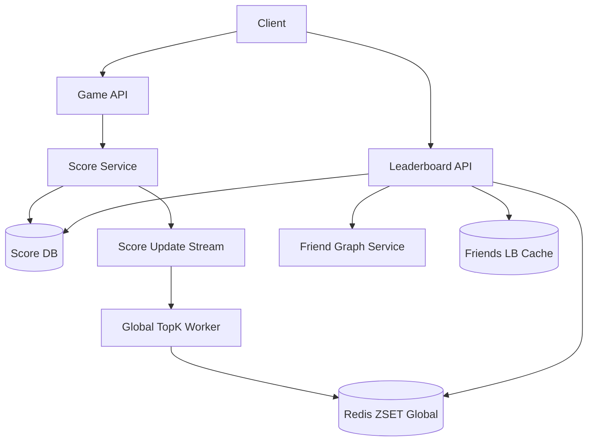

# 设计 Game Leaderboard 系统

## 功能需求

- 玩家提交游戏分数，系统更新该玩家最高分或最新分数。
- 展示 global top 10 players。
- 展示当前用户 friends top 10。
- 支持查看自己的 rank / percentile。

## 非功能需求

- 分数更新低延迟，读 leaderboard 低延迟。
- Global top10 要尽量实时。
- Friends leaderboard 要支持大量用户和不同好友集合。
- 排名允许短暂最终一致，但不能长期错乱。

## API 设计

```text
POST /scores
- request: user_id, game_id, score, idempotency_key
- response: best_score, updated

GET /leaderboards/{game_id}/global?limit=10
- response: players[], scores[], ranks[]

GET /leaderboards/{game_id}/friends?user_id=&limit=10
- response: friends[], scores[]

GET /leaderboards/{game_id}/users/{user_id}/rank
- response: rank, percentile, score
```

## 高层架构



## 关键组件

- Score Service
  - 接收用户分数。
  - 做幂等和反作弊基础校验。
  - 如果规则是“保留历史最高分”，只有新分数大于旧 `best_score` 才更新。
  - 写 Score DB 后发布 score update event。

- Score DB
  - source of truth。
  - 存每个 user 在每个 game 的 best score。
  - 示例：

```text
scores(
  game_id,
  user_id,
  best_score,
  updated_at,
  version
)
```

  - 可以用 DynamoDB：
    - PK: `game_id#user_id`
    - GSI: `game_id`, sort by `best_score`
  - 但 GSI 上全局 top 排序在高写入下有写放大和热点问题。

- Redis Global ZSET
  - 存 global leaderboard。
  - key:

```text
leaderboard:{game_id}:global
score -> user_id
```

  - `ZREVRANGE key 0 9 WITHSCORES` 返回 top10。
  - Redis 是 serving view，不是 source of truth。
  - 可从 Score DB / event stream 重建。

- Friend Graph Service
  - 返回用户好友列表。
  - Friends leaderboard 一般不为每个用户预计算。
  - 查询时拿好友 ids，再批量查 Score DB 或 Redis score。

- Friends Leaderboard Cache
  - 缓存某个用户的 friends top10，短 TTL。
  - 好友分数变化后可异步 invalidation。
  - 活跃用户可以预计算，普通用户 request-time 计算。

## 核心流程

- 提交分数
  - Client 调 `POST /scores`。
  - Score Service 校验 `idempotency_key`。
  - 读取旧 best_score。
  - 如果新分数更高，用 conditional update 写 Score DB。
  - 写 score update event。
  - GlobalWorker 更新 Redis ZSET。
  - Friends cache 可异步失效。

- 查询 global top10
  - Leaderboard API 直接读 Redis ZSET。
  - 返回 top10 user ids 和 scores。
  - 批量查 User Profile 补头像、昵称。
  - 如果 Redis miss，从 Score DB 或 snapshot 重建。

- 查询 friends top10
  - Leaderboard API 调 Friend Graph Service 获取 friend_ids。
  - 批量查这些 friend 的 scores。
  - 在内存排序取 top10。
  - 写短 TTL cache。
  - 如果好友数很多，分批或使用预计算。

- 查询用户 rank
  - 如果 Redis ZSET 存全量用户，可用 `ZREVRANK`。
  - 如果用户规模巨大，不存全量 ZSET，则用 percentile/分桶近似。
  - 精确 rank 可离线 batch 计算。

## 存储选择

- Redis ZSET
  - 适合 global top10、topN、rank 查询。
  - 更新 `O(logN)`，查询 top10 很快。
  - 缺点是全量玩家放 Redis 成本高，超大规模要分片或只存 top candidates。

- DynamoDB + GSI
  - 适合 source of truth 和按用户查分。
  - GSI sort by score 可以支持查询，但高频 score update 排序成本大。
  - 更适合作为持久层，不一定适合作为实时 top10 serving。

- Cassandra / MySQL Sharding
  - 按 `user_id` 或 `game_id` 分区存 score。
  - 需要额外 read model 支撑 topN。

## 扩展方案

- Score DB 按 `user_id/game_id` 分片，写入均匀。
- Global top10 用 Redis ZSET serving view。
- 大规模下每个 shard 维护 local topN，GlobalWorker merge 成 global top10。
- Friends leaderboard 默认 request-time 计算，活跃用户短 TTL cache。
- 反作弊确认前，可疑高分不进入 global leaderboard。

## 系统深挖

### 1. Global Top10：Redis ZSET vs DB GSI

- 方案 A：Redis ZSET 全量存所有玩家
  - ✅ 优点：top10、rank 查询非常快。
  - ❌ 缺点：玩家量巨大时内存贵；Redis 故障要重建。

- 方案 B：DynamoDB GSI 按 score 排序
  - ✅ 优点：持久化，少一套 serving cache。
  - ❌ 缺点：高频 score update 写放大；global score index 可能热点；rank 查询不方便。

- 方案 C：只维护 top candidates
  - ✅ 优点：内存省，只存前 N 万或达到阈值的玩家。
  - ❌ 缺点：普通玩家 rank 只能近似；阈值附近要小心漏掉。

- 推荐：
  - Source of truth 放 Score DB。
  - Global top10 用 Redis ZSET。
  - 如果规模很大，只把高分玩家放 ZSET，普通玩家用 percentile。

### 2. Friends Top10：预计算 vs 查询时计算

- 方案 A：为每个用户预计算 friends leaderboard
  - ✅ 优点：读非常快。
  - ❌ 缺点：写放大巨大；一个玩家分数更新要影响所有朋友的榜。

- 方案 B：查询时拉好友分数并排序
  - ✅ 优点：写路径轻，简单可靠。
  - ❌ 缺点：好友很多时读会慢。

- 方案 C：活跃用户预计算 + 普通用户实时计算
  - ✅ 优点：成本和延迟平衡。
  - ❌ 缺点：系统复杂。

- 推荐：
  - 默认 request-time 计算 friends top10。
  - 好友数少于几千时批量查分排序即可。
  - 活跃用户或大好友用户使用缓存/预计算。

### 3. 按 Score Shard vs 按 User Shard

- 方案 A：按 score range shard
  - ✅ 优点：top score 查询直观。
  - ❌ 缺点：玩家分数频繁变化，需要跨 shard 移动；高分 shard 热点明显。

- 方案 B：按 user_id shard
  - ✅ 优点：写入均匀，用户查分简单。
  - ❌ 缺点：global top10 要跨 shard 聚合。

- 方案 C：user shard + 每 shard topN 上报
  - ✅ 优点：写均匀，同时支持全局 topN。
  - ❌ 缺点：需要定期/实时 merge shard topN。

- 推荐：
  - Score DB 按 user_id/game_id 分片。
  - 每个 shard 维护 local topN。
  - GlobalWorker merge local topN 到 global top10。

### 4. 是否存 Rank

- 方案 A：每次写分数都更新所有 rank
  - ✅ 优点：读 rank 快。
  - ❌ 缺点：不可行；一个分数变化可能影响大量玩家。

- 方案 B：读时实时算 rank
  - ✅ 优点：写路径简单。
  - ❌ 缺点：全量 rank 查询成本高，除非 Redis ZSET 存全量。

- 方案 C：离线 batch 存 rank/percentile
  - ✅ 优点：适合展示 percentile、赛季结算。
  - ❌ 缺点：不是实时。

- 推荐：
  - Top10 不需要存 rank，按 ZSET 顺序返回。
  - 用户 rank 如果 Redis 全量可 `ZREVRANK`。
  - 大规模下 rank 离线算，线上显示 percentile 或 approximate rank。

### 5. Score Update 语义

- 方案 A：最新分数覆盖
  - ✅ 优点：简单。
  - ❌ 缺点：不适合大多数游戏排行榜。

- 方案 B：历史最高分
  - ✅ 优点：符合 leaderboard 直觉。
  - ❌ 缺点：需要 conditional update：新分数必须大于旧分数。

- 方案 C：赛季/时间窗口分数
  - ✅ 优点：支持每日榜、赛季榜。
  - ❌ 缺点：需要按 season/window 维护多套榜。

- 推荐：
  - 默认 best_score。
  - key 中加入 `season_id` 支持赛季榜。
  - Score DB conditional update 防低分覆盖高分。

### 6. Redis Scale

- 方案 A：单 Redis ZSET 存全局榜
  - ✅ 优点：简单。
  - ❌ 缺点：内存和写 QPS 有上限。

- 方案 B：Redis Cluster 分片
  - ✅ 优点：容量更大。
  - ❌ 缺点：全局 top10 需要跨 shard merge，不能直接一个 ZSET 解决。

- 方案 C：Local topN + global merge
  - ✅ 优点：适合超大规模。
  - ❌ 缺点：global top10 有轻微延迟。

- 推荐：
  - 中小规模单 ZSET。
  - 大规模按 shard 存 local topN，merge 成 global top10 ZSET。
  - Redis serving view 可由 DB/event stream 重建。

### 7. 反作弊和可信分数

- 方案 A：客户端直接提交分数
  - ✅ 优点：简单。
  - ❌ 缺点：极易作弊。

- 方案 B：服务端校验
  - ✅ 优点：更可信。
  - ❌ 缺点：游戏类型不同，校验复杂。

- 方案 C：异步风控
  - ✅ 优点：不阻塞写路径。
  - ❌ 缺点：可疑高分可能短暂上榜。

- 推荐：
  - 基础校验同步做：分数范围、时间、关卡、签名。
  - 可疑分数先 pending，不进 global top10。
  - 异步风控确认后再 publish。

### 8. Fault Tolerance

- 方案 A：只写 Redis
  - ✅ 优点：快。
  - ❌ 缺点：Redis 丢失后排行榜不可恢复。

- 方案 B：先写 DB，再异步更新 Redis
  - ✅ 优点：DB 是 source of truth，可恢复。
  - ❌ 缺点：Redis leaderboard 有短暂延迟。

- 方案 C：写 event log，再 worker 更新 DB/Redis
  - ✅ 优点：可 replay。
  - ❌ 缺点：用户提交后看到结果有延迟。

- 推荐：
  - Score Service 同步写 Score DB。
  - 发布 score update event。
  - Worker 更新 Redis ZSET。
  - Redis 异常时从 Score DB/local topN 重建。

## 面试亮点

- Global top10 和 friends top10 是两种不同读模式，不能用一个设计硬套。
- Friends leaderboard 通常不预计算，否则写放大会很大。
- 按 score shard 不适合频繁变化的分数；Score DB 按 user_id/game_id 更稳。
- Redis ZSET 是 serving view，不是 source of truth。
- 大规模 global top10 用 local topN + global merge，而不是全量一个 Redis ZSET。
- Rank 是否存取决于读写优化；top10 不需要存，percentile 可以离线算。
- 游戏排行榜一定要讲反作弊，否则客户端高分直接上榜很危险。
- Score update 要用 conditional update，避免低分覆盖历史最高分。

## 一句话总结

游戏 leaderboard 的核心是：Score DB 存每个玩家的可信 best_score，Redis ZSET 或 local topN/global merge 服务 global top10；friends top10 通过好友列表批量查分并排序，活跃用户可缓存；rank/percentile 根据规模选择实时 ZSET 或离线近似，所有 Redis 榜单都可从 source of truth 重建。
