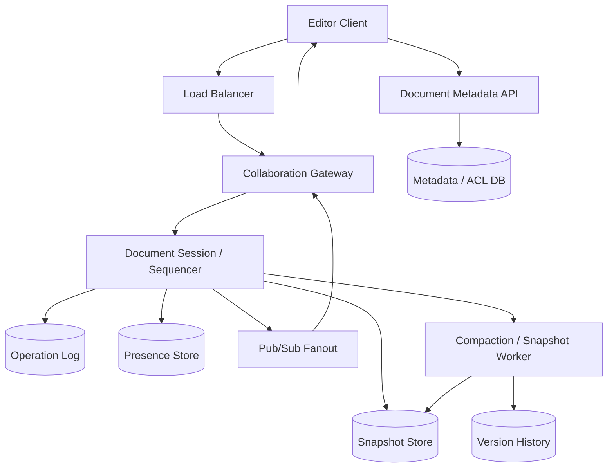

# 设计 Google Docs 系统

## 功能需求

- 多个用户可以同时编辑同一文档，并实时看到对方的修改和光标。
- 支持离线编辑，恢复网络后同步本地操作并解决冲突。
- 支持文档权限、分享、评论、presence 和协作者列表。
- 支持 document version history，可回滚到历史版本。

## 非功能需求

- 实时编辑低延迟，用户本地输入应立即 optimistic update。
- 所有客户端最终收敛到同一文档状态。
- 文档数据不能丢，操作日志和快照需要持久化。
- 高频编辑不能压垮 server，需要 batching、rate limiting 和 backpressure。

## API 设计

```text
GET /documents/{doc_id}
- response: snapshot, version, permissions, metadata

POST /documents
- request: owner_id, title
- response: doc_id

PATCH /documents/{doc_id}/metadata
- request: title?, permissions?, expected_version?
- response: metadata_version

GET /documents/{doc_id}/versions?cursor=&limit=50
- response: versions[], next_cursor

POST /documents/{doc_id}/restore
- request: version_id
- response: new_version

WS /documents/{doc_id}/collaborate
- client sends: ops, cursor, presence, ack
- server sends: transformed_ops, remote_cursor, presence, checkpoint
```

## 高层架构



## 关键组件

- Editor Client
  - 本地维护 document model 和 pending ops。
  - 用户输入后立即 optimistic apply，提升 typing 体验。
  - 将多个小编辑 batching 后发送到 server。
  - 离线时把 ops 存 local queue，恢复网络后带 base version 同步。
  - 注意：客户端不能作为最终事实源，server ack 后才算 committed。

- Collaboration Gateway
  - 维护 WebSocket 长连接。
  - 做鉴权、权限检查、连接管理、backpressure。
  - 接收 client ops，转发到对应 Document Session。
  - 广播 remote ops、cursor、presence。
  - 注意：presence/cursor 可丢，document ops 不能静默丢。

- Document Session / Sequencer
  - 每个活跃文档有一个逻辑 sequencer。
  - 对 OT 方案：sequencer 是该文档的 leader，给 ops 分配全局顺序并做 transformation。
  - 对 CRDT 方案：server 可以不做中心 transformation，但仍可做 validation、persistence、fanout。
  - 维护 current version、pending ops、connected clients。
  - 注意：同一文档热点会集中在该 document session，需要迁移和限流。

- Operation Log
  - 持久化所有 committed ops。
  - 示例：

```text
doc_ops(
  doc_id,
  seq_no,
  op_id,
  user_id,
  base_version,
  op_payload,
  client_ts,
  server_ts
)
```

  - `seq_no` 是 server committed order。
  - op log 用于重放、恢复、构建快照、历史版本。

- Snapshot Store
  - 存文档在某个 version 的完整内容。
  - 新用户打开文档时先读最近 snapshot，再 replay 后续 ops。
  - 快照可以存在 object storage 或 document store。
  - 注意：没有 snapshot，只靠 op replay 会越来越慢。

- Version History
  - 面向用户展示历史版本。
  - 可以是自动 checkpoint，也可以是用户命名版本。
  - 用 hybrid：snapshot + delta ops。
  - 历史版本不能每个 keystroke 都展示，通常按时间/语义聚合。

- Presence Store
  - 存在线用户、光标、selection、最后心跳。
  - Redis TTL 很适合 presence。
  - Presence 是 ephemeral state，丢了可以从客户端重新上报。

- Metadata / ACL DB
  - 存文档 owner、权限、分享链接、title、folder 关系。
  - 权限检查要在打开 WebSocket 和每次关键操作时执行。
  - 对文档内容更新和 metadata 更新要分开建模。

- Compaction / Snapshot Worker
  - 后台把 op log compact 成 snapshot。
  - 删除或归档旧 ops。
  - 生成 version history index。
  - 对未打开文档也可以异步 compact，不需要在线 session。

## 核心流程

- 打开文档
  - Client 调 `GET /documents/{doc_id}`。
  - Metadata API 校验 ACL。
  - 读取最近 snapshot 和 snapshot_version。
  - 从 OpLog replay `snapshot_version` 之后的 ops。
  - 建立 WebSocket 到 Collaboration Gateway。
  - Gateway 将连接注册到 Document Session，并开始接收 presence/ops。

- 实时编辑
  - 用户本地输入，client optimistic apply。
  - Client batching 多个小 edits，发送 `{base_version, op_id, op}`。
  - Document Session 检查权限和 base version。
  - OT：server transform op against concurrent committed ops，分配 seq_no。
  - CRDT：server validate CRDT op 并持久化。
  - 写 OpLog 成功后，广播给其他 clients。
  - Client 收到 ack 后清除 pending op。

- 离线编辑
  - 网络断开后，client 继续本地编辑并记录 ops。
  - 重连后发送本地 queued ops 和 last synced version。
  - Server 返回 missed remote ops。
  - Client 使用 OT transform 或 CRDT merge 解决冲突。
  - 成功后收敛到 server committed state。

- 文档未打开时如何更新
  - 未打开文档没有 active Document Session。
  - 后台 worker 仍可处理：
    - compaction。
    - snapshot 生成。
    - 权限/metadata 变更。
    - 外部导入或 API 修改产生的 ops。
  - 下次用户打开时，从 Snapshot + OpLog 恢复最新内容。
  - 如果有异步任务写文档，也必须走同一套 OpLog/version path，不能直接改 snapshot。

- Version history
  - Worker 定期生成 checkpoint。
  - 历史版本记录 `{version_id, doc_id, base_snapshot_id, op_range, created_at}`。
  - 用户查看历史版本时，读取最近 snapshot 并 replay 到目标 version。
  - 用户 restore 时，不覆盖旧历史，而是创建新的 op 或新 snapshot version。

## 存储选择

- Metadata DB
  - PostgreSQL/MySQL：权限、分享、文件夹、审计。
  - 文档 metadata 关系较强，SQL 很合适。

- Operation Log
  - DynamoDB/Cassandra/Spanner/Kafka + durable store。
  - 访问模式：`doc_id + seq_no` 顺序读取。
  - 对强一致协作，单 doc 的 seq_no 分配需要线性化。

- Snapshot Store
  - Object storage / document store。
  - 大文档 snapshot 压缩存储。
  - 可按 doc_id/version_id 读取。

- Redis
  - Presence、session routing、短期 document cache。
  - 不作为文档 source of truth。

- Pub/Sub
  - Redis Pub/Sub、Kafka、NATS。
  - 用于 gateway fanout。
  - 文档 ops 的可靠性依赖 OpLog，不依赖 pub/sub。

## 扩展方案

- Collaboration Gateway stateless scale，连接路由到对应 Document Session。
- 活跃 document 的 session 可按 doc_id shard 到不同 worker。
- 热门文档可以单独扩容 gateway fanout，但同一文档的编辑 sequencing 仍需有明确 owner。
- Snapshot + delta 减少打开文档时 replay 成本。
- 高频编辑在 client-side batching，server-side rate limit 和 op coalescing。
- 冷文档只保留 snapshot/op log，不占用 session memory。

## 系统深挖

### 1. OT vs CRDT

- 方案 A：Operational Transformation
  - 适用场景：中心化实时协作，server 可以协调操作顺序。
  - ✅ 优点：Google Docs 早期常用；可以保留用户意图；server 统一排序后结果可控。
  - ❌ 缺点：transformation 逻辑复杂；通常需要 central server/leader 协调；多 master 跨 DC 难做。

- 方案 B：CRDT
  - 适用场景：离线编辑、多端并发、弱中心协调、多 master。
  - ✅ 优点：数学上保证最终收敛；操作可交换；不需要中心 server transformation。
  - ❌ 缺点：metadata 开销大；实现复杂；文本 CRDT 的性能和 compaction 要小心。

- 方案 C：Hybrid
  - 适用场景：现代协作系统。
  - ✅ 优点：在线时走中心 session 保低延迟和顺序；离线/跨 DC 用 CRDT-like merge 或明确冲突策略。
  - ❌ 缺点：工程复杂度最高。

- 推荐：
  - 面试基础版选 OT，因为 Google Docs 经典答案清楚。
  - Staff+ 可以补充：CRDT 更适合离线和 multi-master，Redis CRDT 用来解决跨 DC 并发写和网络分区下自动合并。
  - 如果系统要求强实时、中心化编辑，OT + per-doc leader 更直观；如果强调离线和多主，CRDT 更自然。

### 2. Leader/Follower DB 和 Multi-DC

- 方案 A：OT + leader/follower
  - 适用场景：单 region 或每个 doc 有 home region。
  - ✅ 优点：每个 doc 的 op 顺序明确；冲突处理在 leader 完成。
  - ❌ 缺点：跨 region 用户可能延迟高；leader failover 要处理未确认 ops。

- 方案 B：CRDT + multi-master
  - 适用场景：多 region 同时可写、离线优先。
  - ✅ 优点：多个 DC 并发写可以 merge；网络分区后最终收敛。
  - ❌ 缺点：存储和协议复杂，用户意图冲突可能仍需要产品层解释。

- 方案 C：Doc home region
  - 适用场景：大多数文档有主要用户区域。
  - ✅ 优点：减少跨 DC 协调；每个 doc 的 leader 清晰。
  - ❌ 缺点：远端协作者写入延迟较高。

- 推荐：
  - 默认 doc home region + leader/follower。
  - 全球协作热点文档可迁移 home region 或使用更强 CRDT/multi-master 方案。
  - 不要让每个 op 都跨全球共识。

### 3. Version History：Snapshot vs Delta vs Hybrid

- 方案 A：Snapshot-based versioning
  - 适用场景：小文档、版本点少。
  - ✅ 优点：读取历史版本快；恢复简单。
  - ❌ 缺点：存储成本高，每次版本都存全文。

- 方案 B：Delta-based versioning
  - 适用场景：编辑频繁、文档大。
  - ✅ 优点：存储省；自然基于 op log。
  - ❌ 缺点：恢复历史版本要 replay 很多 ops，时间长。

- 方案 C：Hybrid
  - 适用场景：生产 Google Docs 类系统。
  - ✅ 优点：定期 snapshot + 中间 delta，平衡存储和读取延迟。
  - ❌ 缺点：compaction、snapshot consistency、restore 逻辑更复杂。

- 推荐：
  - 使用 hybrid。
  - 每 N ops 或 N 分钟生成 snapshot。
  - 用户 restore 历史版本时创建新版本，不破坏历史链。

### 4. Prevent Server Overload from Frequent Edits

- 方案 A：每个 keystroke 立即发 server
  - 适用场景：demo 或低频协作。
  - ✅ 优点：实现简单，延迟最低。
  - ❌ 缺点：高 QPS，server 和网络压力大。

- 方案 B：Client-side batching
  - 适用场景：生产系统。
  - ✅ 优点：把多个小 edits 合并，显著降低 op 数。
  - ❌ 缺点：远端看到更新有几十到几百毫秒延迟。

- 方案 C：Server-side coalescing + rate limiting
  - 适用场景：热门文档或异常客户端。
  - ✅ 优点：保护 server；对 cursor/presence 可降频。
  - ❌ 缺点：过度合并可能影响实时体验。

- 推荐：
  - Client 端 50-200ms batching。
  - Cursor/presence 限频。
  - Server 对单用户、单文档、单连接做 rate limit/backpressure。

### 5. Offline Edit Conflict Resolution

- 方案 A：Pessimistic lock，离线不允许编辑
  - 适用场景：强控制企业文档或简单系统。
  - ✅ 优点：冲突少，实现简单。
  - ❌ 缺点：用户体验差，Google Docs 类产品不可接受。

- 方案 B：Optimistic offline queue + sync
  - 适用场景：Google Docs。
  - ✅ 优点：离线可继续编辑；在线后同步。
  - ❌ 缺点：冲突解决复杂，需要 OT transform 或 CRDT merge。

- 方案 C：Fork + manual merge
  - 适用场景：无法自动合并的复杂结构文档。
  - ✅ 优点：不会误合并破坏内容。
  - ❌ 缺点：用户体验差，适合少数冲突场景。

- 推荐：
  - 默认 optimistic offline edits。
  - 文本内容用 OT/CRDT 自动 merge。
  - 无法合并的对象，如图片位置、表格结构冲突，可用 last-writer-wins 或提示用户解决。

### 6. 打开的文档 vs 未打开的文档

- 方案 A：只维护打开文档的内存 session
  - 适用场景：实时协作层。
  - ✅ 优点：活跃文档低延迟。
  - ❌ 缺点：冷文档不能依赖 session 更新。

- 方案 B：所有修改都走持久化 OpLog
  - 适用场景：正确性边界。
  - ✅ 优点：未打开文档也能被后台任务、安全扫描、导入 API 更新。
  - ❌ 缺点：所有 writer 必须遵循统一 op/version 协议。

- 方案 C：后台 materialization
  - 适用场景：冷文档 snapshot/索引更新。
  - ✅ 优点：不占用在线 session，仍能保持可打开性。
  - ❌ 缺点：索引和快照可能短暂落后。

- 推荐：
  - 打开文档：Document Session 提供实时协作。
  - 未打开文档：OpLog + Snapshot Worker 负责持久化和更新。
  - 任何写入都不能绕过 OpLog 直接改最终 snapshot。

### 7. Pub/Sub Fanout 和可靠性

- 方案 A：直接用 Redis Pub/Sub 作为唯一通道
  - 适用场景：presence/cursor。
  - ✅ 优点：低延迟，简单。
  - ❌ 缺点：不持久，断线会丢消息。

- 方案 B：OpLog + Pub/Sub
  - 适用场景：生产实时编辑。
  - ✅ 优点：OpLog 保证文档 ops 可恢复，Pub/Sub 只负责实时 fanout。
  - ❌ 缺点：两套路径，client 需要处理 missed ops。

- 方案 C：Kafka fanout
  - 适用场景：大规模异步订阅和 replay。
  - ✅ 优点：持久化，可 replay。
  - ❌ 缺点：端到端延迟和连接 fanout 复杂。

- 推荐：
  - 文档修改：先 commit OpLog，再 fanout。
  - Presence/cursor：Redis Pub/Sub + TTL 即可。
  - Client 重连后用 last_seen_version 拉 missed ops。

### 8. Cache Strategy

- 方案 A：缓存完整文档
  - 适用场景：热文档、只读打开。
  - ✅ 优点：打开快。
  - ❌ 缺点：实时编辑频繁 invalidation，容易 stale。

- 方案 B：缓存 snapshot + recent ops
  - 适用场景：协作文档。
  - ✅ 优点：读打开快，近期编辑可 replay。
  - ❌ 缺点：cache 和 OpLog version 要一致。

- 方案 C：只缓存 metadata/presence
  - 适用场景：保守正确性。
  - ✅ 优点：一致性简单。
  - ❌ 缺点：冷启动打开大文档慢。

- 推荐：
  - 缓存 snapshot by `doc_id + snapshot_version`，不可变缓存。
  - recent ops 从 OpLog 拉。
  - 不缓存可变 “current doc” 而不带 version，否则容易读到混合状态。

## 面试亮点

- Google Docs 的核心不是 WebSocket，而是并发编辑的收敛模型：OT 或 CRDT。
- OT 通常需要 per-document leader/sequencer 做操作排序和 transformation；CRDT 更适合离线和 multi-master。
- 文档内容的 source of truth 应该是 committed OpLog + Snapshot，而不是内存 session 或 Pub/Sub。
- Version history 最好用 hybrid：定期 snapshot + delta ops，兼顾恢复速度和存储成本。
- Offline edit 用 optimistic queue，重连后 transform/merge；pessimistic lock 会牺牲核心体验。
- 高频编辑要 client-side batching、presence 限频、server backpressure，不能每个 keystroke 都全量广播。
- 未打开文档不需要 active session；后台任务通过 OpLog/Snapshot 更新，用户打开时恢复最新状态。
- Pub/Sub 只负责实时 fanout，断线恢复靠 last_seen_version 从 OpLog 补齐 missed ops。

## 一句话总结

Google Docs 的核心是：客户端本地 optimistic editing 并通过 WebSocket 发送 batched ops，服务端用 per-document sequencer 执行 OT 或用 CRDT 合并操作，把 committed ops 写入 OpLog 并实时 fanout；持久化层用 Snapshot + Delta 支撑快速打开和版本历史，离线编辑、重连补齐、未打开文档更新都围绕同一条 OpLog/version 事实链路完成。

## 参考

- System Design School: https://systemdesignschool.io/problems/google-doc/solution
- 用户提供的 YouTube 图参考和补充要点：OT/CRDT、version history、offline edit、client batching、未打开文档更新。
