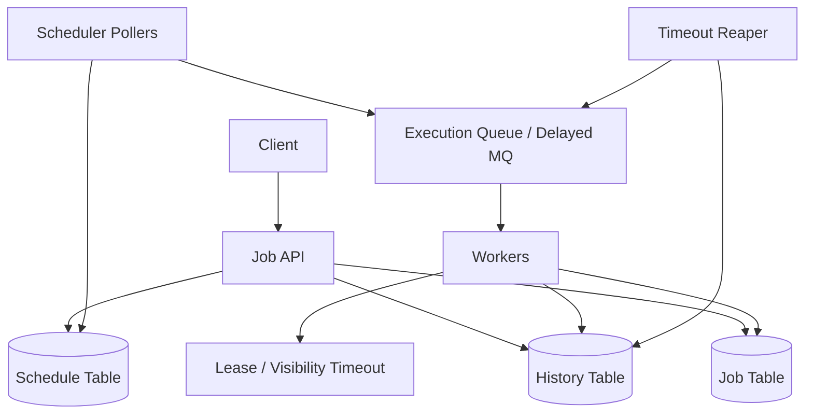

# 设计 Job Scheduler 系统

## 功能需求

- 用户可以创建一次性或周期性 job，指定 `run_at` 或 `interval`。
- 系统在接近指定时间时触发 job execution，并分发给 worker 执行。
- 支持 retry、execution history、状态查询。
- 支持 worker failure 后重新调度，避免任务永久卡住。

## 非功能需求

- 调度时间尽量准确，但不是 hard real-time。
- 执行语义默认 at-least-once，需要 job 幂等。
- 调度查询和任务执行解耦，避免 worker 影响 scheduler。
- 可水平扩展，支持大量 future jobs 和短时间内的高峰执行。

## API 设计

```text
POST /jobs
- request: user_id, payload, run_at | interval, retry_policy, idempotency_key
- response: job_id, next_execution

GET /jobs/{job_id}
- response: job metadata, next_execution, status

GET /jobs/{job_id}/executions?limit=50&cursor=
- response: execution history

POST /jobs/{job_id}/pause
POST /jobs/{job_id}/resume
POST /jobs/{job_id}/cancel

POST /executions/{execution_id}/heartbeat
- worker extend lease / visibility timeout

POST /executions/{execution_id}/complete
POST /executions/{execution_id}/fail
```

## 高层架构



## 关键组件

- Job API
  - 负责创建、暂停、恢复、取消 job。
  - 写 `job table` 和 `schedule table`。
  - 创建 job 时用 `idempotency_key` 防止客户端重试创建重复任务。
  - 不直接执行任务，只负责 durable metadata。

- Job Table
  - 存 job 的定义和当前状态。
  - 示例：

```text
job_table
PK: user_id
SK: job_id
fields:
  payload
  schedule_type: once | interval | cron
  interval
  retry_policy
  retry_times
  status: active | paused | cancelled
  created_at
  updated_at
```

  - 如果经常通过 `job_id` 查询，需要额外 GSI：

```text
GSI: job_id -> user_id
```

- Schedule Table
  - 存下一次要执行的时间。
  - 更推荐按时间分区，而不是只用 `job_id` 做主键。
  - 示例：

```text
schedule_table
PK: time_bucket        # e.g. 2026-04-30T10:05
SK: next_execution#job_id
fields:
  job_id
  user_id
  next_execution
  schedule_version
```

  - 如果需要按用户查询 job schedule，可加：

```text
GSI: user_id, next_execution
```

  - 注意：`GSI on next_execution` 如果所有 due jobs 都扫同一个时间范围，容易形成热点；通常要加 `time_bucket + shard_id`。

- History Table
  - 每次执行生成一条 execution record。
  - 示例：

```text
history_table
PK: job_id
SK: execution_id
fields:
  status: pending | running | success | failed | timeout
  worker_id
  retry_count
  lease_until
  started_at
  finished_at
  error
```

  - 用来做审计、retry、debug 和 timeout recovery。
  - 如果要按状态查 running executions，需要额外 index：

```text
GSI: status, lease_until
```

- Scheduler Pollers
  - 只负责找出 due jobs，并把 execution 放进 queue。
  - 不执行 job payload。
  - 可以多个 poller 并发扫不同 `time_bucket + shard_id`。
  - 成功 dispatch 后更新下一次 `next_execution`，周期任务写入新的 schedule row。

- Execution Queue
  - 解耦 scheduler 和 worker。
  - 选项：
    - Kafka：高吞吐、可 replay，但不原生支持 delayed delivery。
    - SQS：原生 visibility timeout、retry、DLQ，但吞吐和顺序能力有限。
    - RabbitMQ delayed plugin：支持 delayed message，但运维复杂度更高。
  - 对即将执行的任务，可以提前 N 秒放入 queue，worker 到点再执行或 delay queue 到点释放。

- Worker
  - 从 queue 拉 execution。
  - 获取 lease 后执行。
  - 定期 heartbeat 延长 lease。
  - 完成后写 history success，并计算下次 schedule。
  - 失败后根据 retry policy 重新入队或标记 failed。

## 核心流程

- 创建一次性 job
  - Client 调 `POST /jobs`。
  - API 写 `job_table`。
  - API 写 `schedule_table`，`next_execution = run_at`。
  - 返回 `job_id`。

- 创建周期 job
  - API 写 job definition，包括 `interval / cron`。
  - 计算第一次 `next_execution`。
  - 写 schedule row。
  - 每次成功 dispatch 后计算下一次时间并写回 schedule table。

- 调度 due job
  - Scheduler poller 扫描当前时间窗口内的 `time_bucket + shard_id`。
  - 找到 `next_execution <= now + lookahead` 的 job。
  - 创建 `execution_id`，写 history pending。
  - 把 execution 放入 execution queue。
  - 删除旧 schedule row 或写入新的 schedule version。
  - 对周期任务计算下一次 `next_execution` 并插入新 schedule row。

- 执行 job
  - Worker 从 queue 获取 execution。
  - 设置 `running`，写 `worker_id` 和 `lease_until`。
  - 执行业务 payload。
  - 成功后写 `success`。
  - 失败后写 `failed`，如果 retry 未超限，则重新入队。

- worker invisible failure
  - Worker crash 后不会主动写失败。
  - Reaper 定期扫描 `status=running AND lease_until < now`。
  - 将 execution 标记 timeout。
  - 如果 retry 未超限，重新放回 execution queue。

## 存储选择

- Job / Schedule / History DB
  - DynamoDB / Cassandra：适合高写入、按 key 查询、时间 bucket 扫描。
  - PostgreSQL：适合中小规模、事务和复杂查询更方便。
  - MySQL + sharding：适合明确分片规则和强事务需求。
  - 核心是：schedule 查询要按时间范围，不要每次全表扫描。

- Execution Queue
  - SQS：visibility timeout、DLQ、retry support 原生，适合通用 job execution。
  - Kafka：适合超高吞吐和 replay，但需要自己实现 delay、lease、retry。
  - RabbitMQ：routing 灵活，delayed plugin 可用，但大规模持久化队列运维要谨慎。

- Worker Runtime
  - EC2 / Kubernetes：适合稳定 workload，成本可控，适合长任务。
  - Lambda：适合短任务、波峰波谷明显、低运维，但有 runtime limit、cold start 和并发限制。

## 扩展方案

- Schedule table 按 `time_bucket + shard_id` 分区，避免所有 scheduler 扫同一分区。
- Scheduler pollers 做 leaderless horizontal scaling，每个 poller 负责一组 shard。
- Execution queue 根据 `task_id / job_id` partition，支持 worker group 横向扩展。
- 对高峰时间段提前 lookahead，把未来几十秒或几分钟任务预取到 queue。
- Worker 使用 lease / visibility timeout 做 failure recovery。
- 所有 execution 都要幂等，因为 at-least-once delivery 下重复执行不可完全避免。

## 系统深挖

### 1. Due Job 发现：DB Polling vs Delayed Message Queue

- 方案 A：Scheduler poll DB
  - 适用场景：大量 future jobs，需要准确查询某个时间窗口内到期任务。
  - ✅ 优点：job schedule durable；容易查询、取消、修改；对很远未来的任务友好。
  - ❌ 缺点：poll interval 会影响调度精度；需要设计 time bucket/shard 避免热点扫描。

- 方案 B：创建 job 时直接放 delayed message
  - 适用场景：短延迟任务，`run_at` 离当前不远。
  - ✅ 优点：到点自动投递，scheduler 逻辑简单。
  - ❌ 缺点：很多 MQ 对超长 delay 支持不好；修改/取消 delayed message 困难；消息堆积难管理。

- 方案 C：Hybrid
  - 适用场景：既有大量远期任务，也要求近期任务准确触发。
  - ✅ 优点：DB 存完整 schedule；scheduler 提前 lookahead，把即将执行任务放进 queue/delay queue。
  - ❌ 缺点：两层状态，需要处理 DB 和 queue 的一致性。

- 推荐：
  - 用 DB 作为 schedule source of truth。
  - Scheduler 提前扫描未来 N 秒，把 execution 放入 queue。
  - 如果 MQ 支持 delay，可以把 “即将执行” 的任务用 delayed message 精准释放。

### 2. Schedule Table 设计：job_id 分区 vs time_bucket 分区

- 方案 A：`PK=job_id, SK=next_execution`
  - 适用场景：按 job 查询下一次执行。
  - ✅ 优点：查询单个 job 简单。
  - ❌ 缺点：找 due jobs 很难，需要 GSI 或全局扫描。

- 方案 B：`PK=time_bucket, SK=next_execution#job_id`
  - 适用场景：scheduler 按时间找 due jobs。
  - ✅ 优点：天然支持扫描当前时间窗口。
  - ❌ 缺点：热门时间 bucket 会成为热点，比如整点大量任务。

- 方案 C：`PK=time_bucket#shard_id, SK=next_execution#job_id`
  - 适用场景：大规模 job scheduler。
  - ✅ 优点：scheduler 可以并发扫多个 shard；降低热点。
  - ❌ 缺点：查询某个用户或 job 的 schedule 需要额外 GSI。

- 推荐：
  - schedule 表主查询是 “哪些 job 到点了”，所以主键应围绕 time bucket 设计。
  - 用 `shard_id = hash(job_id) % N` 打散同一时间 bucket。
  - 用户查询用 GSI：`user_id, next_execution`。

### 3. 调度准确性：Poll Interval vs Lookahead vs Delay Queue

- 方案 A：短 poll interval
  - 适用场景：简单系统，秒级准确性。
  - ✅ 优点：容易实现。
  - ❌ 缺点：DB 扫描压力大；poller 数量多时容易重复抢任务。

- 方案 B：lookahead window
  - 适用场景：需要降低 DB 查询频率。
  - ✅ 优点：提前把未来任务拿出来，减少临界时间扫描压力。
  - ❌ 缺点：提前 dispatch 后，如果 job 被取消或修改，需要 queue 侧再校验 schedule version。

- 方案 C：delay queue 精准释放
  - 适用场景：MQ 支持 delayed delivery，任务 delay 不太长。
  - ✅ 优点：触发时间更准确；worker 不需要忙等。
  - ❌ 缺点：取消/修改复杂；不同 MQ delay 能力差异大。

- 推荐：
  - DB poller 每几秒扫一个 lookahead window。
  - execution message 带 `scheduled_at` 和 `schedule_version`。
  - Worker 执行前重新检查 job 状态和 version，防止取消后的任务仍被执行。

### 4. Scheduler 和 Worker 是否分离

- 方案 A：Scheduler 直接执行任务
  - 适用场景：小系统、任务很轻。
  - ✅ 优点：架构简单。
  - ❌ 缺点：慢任务会阻塞调度；失败恢复复杂；扩展维度混在一起。

- 方案 B：Scheduler 只 dispatch，Worker 执行
  - 适用场景：大部分生产级 job scheduler。
  - ✅ 优点：调度和执行独立扩展；worker failure 不影响 schedule scanning。
  - ❌ 缺点：需要 queue、execution state、幂等和 retry。

- 方案 C：多级 scheduler
  - 适用场景：超大规模，多 region 或多租户隔离。
  - ✅ 优点：全局 scheduler 只分发 shard，本地 scheduler 管细粒度执行。
  - ❌ 缺点：架构复杂，debug 成本高。

- 推荐：
  - 面试里明确说 separating query and task execution。
  - Scheduler 是控制面，Worker 是执行面。
  - 这能避免调度准确性被任务执行时间拖垮。

### 5. Worker Failure：Health Check Pull vs Job Leasing vs Visibility Timeout

- 方案 A：health check pull
  - 适用场景：检测 worker 是否存活。
  - ✅ 优点：实现直观。
  - ❌ 缺点：worker 活着不代表 job 还在正常执行；网络抖动会误判；无法精确恢复单个 execution。

- 方案 B：job leasing
  - 适用场景：自建 queue 或 DB-backed execution。
  - ✅ 优点：每个 execution 有 `lease_until`，过期即可重试。
  - ❌ 缺点：需要实现 lease CAS、heartbeat、reaper，相当于分布式锁。

- 方案 C：SQS visibility timeout
  - 适用场景：使用 SQS 作为 execution queue。
  - ✅ 优点：native 支持；worker 未 delete message 时，timeout 后自动重新可见。
  - ❌ 缺点：长任务需要 heartbeat extend visibility；SQS 语义是 at-least-once。

- 推荐：
  - 如果用 SQS，优先使用 visibility timeout + heartbeat。
  - 如果自建执行状态，用 job lease，但要用 CAS 防止两个 worker 同时拿到同一个 execution。
  - 不要只靠 worker health check 判断 job 是否失败。

### 6. Retry：Visible Failure vs Invisible Failure

- 方案 A：visible failure
  - 适用场景：worker 明确捕获异常。
  - ✅ 优点：可以立即按照 retry policy 处理。
  - ❌ 缺点：只能覆盖主动失败，不能覆盖 crash、OOM、网络隔离。

- 方案 B：invisible failure
  - 适用场景：worker crash、机器挂掉、进程卡死。
  - ✅ 优点：通过 lease timeout / visibility timeout 可以恢复。
  - ❌ 缺点：恢复有延迟；可能导致重复执行。

- 方案 C：DLQ
  - 适用场景：超过最大 retry 次数或不可恢复错误。
  - ✅ 优点：隔离坏任务，避免无限重试拖垮系统。
  - ❌ 缺点：需要人工或自动修复流程，否则 DLQ 会变成垃圾堆。

- 推荐：
  - visible failure 立即 retry with exponential backoff。
  - invisible failure 等 lease timeout 后 retry。
  - 超过 retry 上限进 DLQ，并在 history 里保留错误原因。

### 7. At-least-once 和幂等

- 方案 A：假设 worker 只执行一次
  - 适用场景：几乎不适合分布式 job scheduler。
  - ✅ 优点：业务代码简单。
  - ❌ 缺点：queue redelivery、worker timeout、scheduler retry 都会导致重复执行。

- 方案 B：deduplication table
  - 适用场景：任务有外部副作用，比如发邮件、扣款、调用第三方。
  - ✅ 优点：通过 `job_id + execution_id` 或业务 idempotency key 防重复。
  - ❌ 缺点：需要业务方配合定义幂等键。

- 方案 C：job 本身设计成幂等
  - 适用场景：可重试任务、数据同步任务。
  - ✅ 优点：最稳健，系统层重复投递不会破坏业务。
  - ❌ 缺点：不是所有业务天然幂等，需要额外状态。

- 推荐：
  - Scheduler 承诺 at-least-once，不承诺 exactly-once。
  - Worker 执行前写 execution state，业务侧使用 idempotency key。
  - 对外部副作用，用 dedup table 或 transactional outbox。

### 8. Worker Runtime：Kubernetes/EC2 vs Lambda

- 方案 A：EC2 / Kubernetes workers
  - 适用场景：稳定 workload、长任务、需要自定义运行环境。
  - ✅ 优点：成本可控；适合长连接、长任务、大内存任务。
  - ❌ 缺点：需要容量规划和运维。

- 方案 B：Lambda
  - 适用场景：短任务、波动大、低运维。
  - ✅ 优点：自动扩缩容；空闲成本低。
  - ❌ 缺点：有执行时间限制、cold start、并发限制；不适合长任务。

- 方案 C：Hybrid
  - 适用场景：任务类型差异大。
  - ✅ 优点：长任务走 K8s，短突发任务走 Lambda。
  - ❌ 缺点：执行环境和 observability 更复杂。

- 推荐：
  - 默认 K8s/EC2 worker pool。
  - 短小、突发、无状态任务可以支持 Lambda executor。
  - Worker runtime 是 executor plugin，不要和 scheduler core 强绑定。

## 面试亮点

- Job Scheduler 要分清 control plane 和 execution plane：schedule 查询与任务执行必须分离。
- Schedule table 的主查询是 “哪些任务到点了”，所以主键应该围绕 `time_bucket + shard_id`，不是 `job_id`。
- 调度准确性可以用 DB lookahead + delayed queue 改善，但 source of truth 仍应在 DB。
- Worker failure 不能只靠 health check，正确做法是 lease / visibility timeout。
- 系统语义应明确为 at-least-once，业务通过 idempotency key、dedup table 或幂等设计保证正确性。
- Online execution history 和 offline audit/history 可以分层，避免热路径被历史查询拖慢。
- MQ delay 很方便，但取消、修改、长时间 future jobs 都更适合 DB schedule source of truth。

## 一句话总结

Job Scheduler 的核心是：用 DB 可靠保存 job 和 schedule，用 scheduler poller 找到 due jobs 并投递 execution queue，用 worker lease / visibility timeout 处理失败恢复，最终通过 at-least-once + 幂等保证任务不会永久丢失且重复执行可控。
