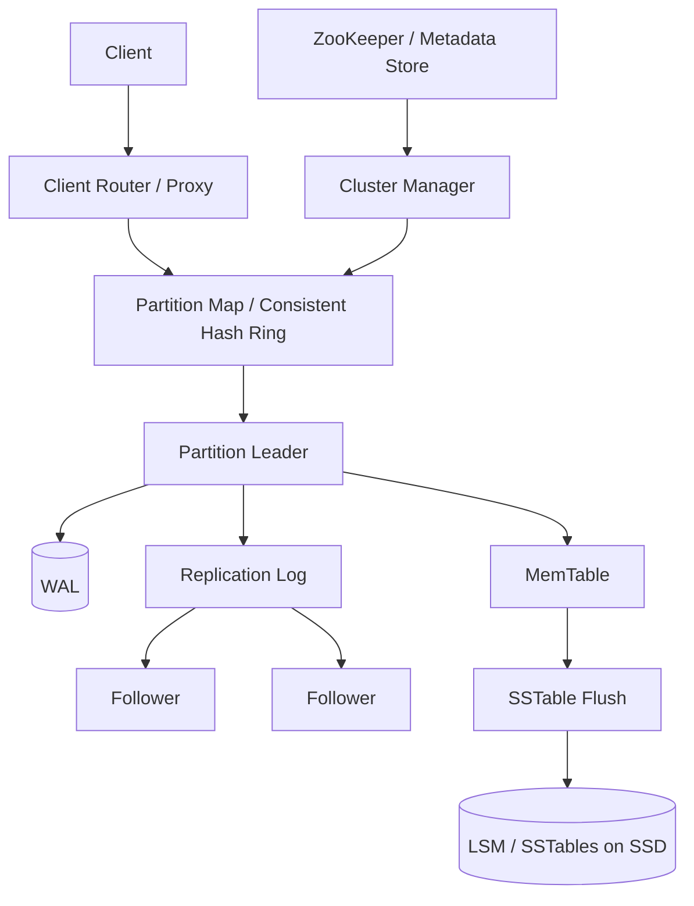

# 设计 Key-Value Store 系统

## 功能需求

- 支持 `put/get/delete` 基本 key-value 操作。
- 支持数据按 key 分区，集群可水平扩容。
- 支持 replication，节点故障时数据仍可读写。
- 支持临时离线节点恢复后补数据。

## 非功能需求

- 低延迟读写，尤其是 point lookup。
- 高可用优先，允许异步复制带来的短暂 eventual consistency。
- 数据持久化，节点重启后可从 WAL / SSTable 恢复。
- 扩容、节点替换、故障恢复对业务尽量透明。

## API 设计

```text
PUT /kv/{key}
- request: value, ttl?, version?
- response: success, version

GET /kv/{key}
- response: value, version, found

DELETE /kv/{key}
- response: success, tombstone_version

GET /kv/{key}?consistency=one|quorum
PUT /kv/{key}?consistency=one|quorum
```

## 高层架构



## 关键组件

- Client Router / Proxy
  - 根据 key hash 找到 partition owner。
  - 可以在 client SDK 内做 routing，也可以用 proxy 层。
  - 缓存 consistent hash ring / partition map。
  - 注意：ring 变更时要支持 version，避免 client 用旧路由写错节点。

- Partition / Consistent Hash Ring
  - key 通过 hash 映射到 virtual node / partition。
  - 每个 partition 有一个 leader 和多个 followers。
  - 使用 virtual nodes 可以让负载更均衡，也让扩容迁移更细粒度。
  - 注意：consistent hash 解决的是数据分布，不自动解决 replication 和 failover。

- Storage Engine
  - 写路径：append WAL -> update MemTable -> ack。
  - MemTable 满后 flush 成 immutable SSTable。
  - 读路径：先查 MemTable，再查 immutable MemTables/SSTables。
  - 用 Bloom filter 快速判断某个 SSTable 里是否可能有 key。
  - SSTable 有 sparse index：先找到 data block offset，再在 block 内二分或顺序查找。
  - SSD + compression 降低成本和提升顺序 IO 效率。

- Replication Manager
  - leader 接收写入，异步复制到 followers。
  - followers 从 leader 拉 replication log 或接收 leader push。
  - 默认 async replication 获得低延迟。
  - 如果要求更强一致，可以配置 quorum write/read。

- WAL / Recovery
  - WAL 是节点本地持久化日志，用于 crash recovery。
  - 节点重启后 replay WAL，恢复 MemTable 中未 flush 的数据。
  - follower election 后，新 leader 需要基于 replication log / term / offset 确认自己拥有最新数据。
  - 注意：WAL 不是跨节点共识；跨节点一致性仍依赖 replication protocol。

- Cluster Manager / Controller
  - 负责 membership、partition assignment、节点替换、rebalance。
  - ZooKeeper/etcd 更适合做健康检查、租约、metadata 存储。
  - 真正的 node replacement / shard movement 通常由 controller 决策和执行。
  - 注意：不要让 ZK 直接搬数据；它不是 data movement engine。

- Hinted Handoff / Repair
  - 临时 offline follower 无法接收写入时，其他节点保存 hint。
  - follower 恢复后 replay hints 补齐数据。
  - 对长期离线节点，hint 不够，需要 full repair / snapshot transfer。

## 核心流程

- 写入 `PUT(key, value)`
  - Router 根据 hash ring 找到 key 所属 partition leader。
  - Leader append WAL。
  - Leader 写 MemTable。
  - Leader 异步复制 log 到 followers。
  - 如果 `consistency=one`，leader 本地写成功即可返回。
  - 如果 `consistency=quorum`，等多数副本确认后返回。

- 读取 `GET(key)`
  - Router 找到 partition leader 或 nearest replica。
  - 如果读 leader，可以获得较新数据。
  - 如果读 follower，延迟低但可能读到旧值。
  - Storage engine 先查 MemTable，再查 SSTables。
  - Bloom filter 过滤不含 key 的 SSTable。
  - SSTable index 定位 data block offset，在 block 内查找 key。

- 节点 crash recovery
  - 节点重启。
  - 读取本地 WAL。
  - replay WAL 恢复 MemTable。
  - 重新加入集群，向 leader / peers 拉取缺失 replication log。
  - 恢复完成后再承担读写流量。

- follower 临时离线
  - Leader 写入成功但 follower 不可达。
  - Leader 或 coordinator 记录 hint。
  - Follower 恢复后接收 hinted handoff。
  - 如果离线太久，触发 anti-entropy repair 或 snapshot rebuild。

- 节点替换
  - Cluster Manager 检测节点长期 unhealthy。
  - Controller 选择新节点接管对应 partitions。
  - 从副本复制 SSTables / snapshot。
  - 增量 replay replication log。
  - 更新 partition map version，让客户端路由到新节点。

## 存储选择

- LSM Tree + SSTable
  - 适合 write-heavy key-value store。
  - 顺序写 WAL 和 SSTable，SSD 上性能好。
  - Bloom filter + sparse index 优化 point lookup。
  - compaction 会带来 write amplification，需要限速。

- B+ Tree
  - 适合 read-heavy、range query 多、更新较均匀的系统。
  - point lookup 稳定，但随机写比 LSM 更贵。

- Columnar Storage
  - 更适合 OLAP，只读少量列、大批量扫描和聚合。
  - 对普通 KV point lookup 不合适。
  - 如果 value 是宽行，可以做 column-family / partial value fetch，但不是传统 OLAP 列式存储。

## 扩展方案

- 用 consistent hashing + virtual nodes 分散 key。
- 每个 partition 配置 `N` 个副本，例如 replication factor = 3。
- 热点 key 用 cache、request coalescing、split large value 或特殊热点分片处理。
- 新节点加入时只迁移部分 virtual nodes，不全量 reshuffle。
- Controller 管理 rebalance，客户端通过 versioned partition map 平滑切换。
- 多 AZ 部署副本，避免单机或单 AZ 故障导致数据不可用。

## 系统深挖

### 1. 数据分区：Range Partition vs Consistent Hash

- 方案 A：Range partition
  - 适用场景：需要按 key range scan，比如时间序列、字典序扫描。
  - ✅ 优点：range query 友好；分区边界直观。
  - ❌ 缺点：顺序写容易打到同一个 partition；split/merge 复杂。

- 方案 B：Consistent hash
  - 适用场景：通用 KV point lookup。
  - ✅ 优点：扩容缩容时只迁移少量 key；负载分布更均匀。
  - ❌ 缺点：range query 很差；热点 key 仍然会形成单点压力。

- 方案 C：Virtual nodes
  - 适用场景：需要更均衡地分配节点负载。
  - ✅ 优点：rebalance 粒度小；节点异构时可以分配不同 vnode 数量。
  - ❌ 缺点：metadata 更多；迁移调度更复杂。

- 推荐：
  - 通用 KV 选 consistent hash + virtual nodes。
  - 如果业务明确需要 range scan，再考虑 range partition 或单独索引。

### 2. 复制策略：Leader-Follower Async vs Quorum

- 方案 A：leader + followers async replication
  - 适用场景：低延迟、高可用优先。
  - ✅ 优点：写延迟低；实现比多主简单。
  - ❌ 缺点：leader ack 后宕机但还没复制，可能丢最新写；follower 读可能 stale。

- 方案 B：quorum write/read
  - 适用场景：需要更强读写一致性。
  - ✅ 优点：`W + R > N` 时可读到较新版本。
  - ❌ 缺点：写延迟更高；尾延迟受慢副本影响；冲突处理更复杂。

- 方案 C：sync replication to all
  - 适用场景：强一致、小规模、低写入吞吐。
  - ✅ 优点：一致性最强。
  - ❌ 缺点：可用性和延迟差，一个慢副本拖慢整体。

- 推荐：
  - 默认 leader-follower async，提供 consistency option。
  - 对普通 cache-like KV，用 `ONE`。
  - 对配置/元数据类 KV，用 `QUORUM` 或走强一致存储。

### 3. Leader Election 和 WAL Recovery

- 方案 A：简单 follower election
  - 适用场景：每个 partition 有 leader，leader 挂了需要恢复服务。
  - ✅ 优点：读写路径清晰。
  - ❌ 缺点：必须保证新 leader 拥有足够新的 log，否则会丢写或回滚。

- 方案 B：基于 consensus 的 election
  - 适用场景：强一致 KV，比如 etcd/Consul 这类 metadata store。
  - ✅ 优点：leader 选举和 log commit 有严格一致性。
  - ❌ 缺点：吞吐和延迟成本高，不适合所有数据都走共识。

- 方案 C：Dynamo-style 无 leader
  - 适用场景：高可用、eventual consistency。
  - ✅ 优点：任意 coordinator 可写，可用性高。
  - ❌ 缺点：冲突解决、read repair、vector clock 等复杂。

- 推荐：
  - 如果题目强调 low latency 和高可用 KV，可选 leader-follower + async/quorum。
  - 面试时要讲清楚：WAL 解决本机 crash recovery，不能替代跨节点 consensus。
  - election 时要比较 term/log offset，避免落后 follower 被选成 leader。

### 4. 临时离线：Hinted Handoff vs Full Repair

- 方案 A：hinted handoff
  - 适用场景：节点短暂离线。
  - ✅ 优点：恢复快；不用立即做全量数据拷贝。
  - ❌ 缺点：hint 存储有限；长期离线后 hint 可能过期或太大。

- 方案 B：read repair
  - 适用场景：读请求发现副本版本不一致。
  - ✅ 优点：按需修复，成本分散。
  - ❌ 缺点：冷数据长期不被读就长期不修复。

- 方案 C：anti-entropy repair / snapshot rebuild
  - 适用场景：节点长期离线或节点替换。
  - ✅ 优点：能系统性修复副本差异。
  - ❌ 缺点：IO 和网络成本高，需要限速，避免影响线上读写。

- 推荐：
  - 短暂离线用 hinted handoff。
  - 长期离线用 snapshot + incremental log catch-up。
  - 后台定期 anti-entropy repair，保证副本最终收敛。

### 5. 存储引擎：LSM vs B+Tree vs Columnar

- 方案 A：LSM Tree
  - 适用场景：写多读多的 KV，尤其是大量 small writes。
  - ✅ 优点：顺序写，适合 SSD；写吞吐高；SSTable immutable 便于压缩和传输。
  - ❌ 缺点：compaction 带来 write amplification；读可能查多个 SSTable。

- 方案 B：B+Tree
  - 适用场景：读多、range scan 多、更新不极端的系统。
  - ✅ 优点：查询路径稳定；range scan 友好。
  - ❌ 缺点：随机写多；page split 和 in-place update 对 SSD 不如顺序写友好。

- 方案 C：Columnar storage
  - 适用场景：OLAP，扫描大量行但只读少量列。
  - ✅ 优点：压缩率高，聚合快。
  - ❌ 缺点：point lookup KV 不合适；单 key 更新和整 value 读取不是强项。

- 推荐：
  - 通用 KV 选 LSM + SSD + compression。
  - 如果 value 很宽，可以支持 column-family 或 partial field fetch。
  - 不要把 OLAP columnar storage 和 KV storage 混为一谈。

### 6. 读路径优化：Bloom Filter / SSTable Index / Cache

- 方案 A：只扫 SSTables
  - 适用场景：数据量很小。
  - ✅ 优点：实现简单。
  - ❌ 缺点：SSTable 多了以后读放大严重。

- 方案 B：Bloom filter + sparse index
  - 适用场景：LSM KV 标准读路径。
  - ✅ 优点：Bloom filter 快速排除不含 key 的 SSTable；index 快速定位 block offset。
  - ❌ 缺点：Bloom filter 有 false positive；需要额外内存。

- 方案 C：Block cache / Row cache
  - 适用场景：热点 key 明显。
  - ✅ 优点：显著降低 SSD IO。
  - ❌ 缺点：cache invalidation 和内存管理复杂；热点变动会导致命中率波动。

- 推荐：
  - MemTable -> Bloom filter -> SSTable index -> data block。
  - 找到 data block offset 后，读取 block，在 block 内二分或顺序查找。
  - 对热点 key 加 block cache 或 row cache。

### 7. 节点替换：ZK 健康检查 vs Controller 接管

- 方案 A：ZooKeeper 直接管理所有逻辑
  - 适用场景：很小集群。
  - ✅ 优点：看起来简单。
  - ❌ 缺点：ZK 不适合做复杂 orchestration 和数据迁移；容易把 metadata store 用成控制系统。

- 方案 B：ZK/etcd 做 membership，Controller 做决策
  - 适用场景：生产集群。
  - ✅ 优点：职责清晰；ZK 负责 lease/health/metadata，controller 负责 replacement/rebalance。
  - ❌ 缺点：需要实现 controller 状态机和任务调度。

- 方案 C：手动替换
  - 适用场景：小规模、低自动化要求。
  - ✅ 优点：实现成本低。
  - ❌ 缺点：恢复慢，容易人为操作错误。

- 推荐：
  - ZK/etcd 只做健康检查、membership、partition map metadata。
  - Cluster Manager / Controller 负责选新节点、复制 snapshot、更新 ring version。
  - 节点替换完成后再逐步把流量切过去。

## 面试亮点

- Consistent hashing 只解决 partitioning，不解决 replication、failover 和 consistency。
- WAL 解决单机 crash recovery，不等于跨节点 consensus。
- LSM 读路径要讲清楚：MemTable、Bloom filter、SSTable index、data block offset、block 内查找。
- Hinted handoff 只适合短暂离线；长期离线需要 snapshot rebuild / anti-entropy repair。
- ZooKeeper/etcd 通常做 metadata 和健康检查，真正的数据迁移和 node replacement 由 controller 负责。
- Columnar storage 适合 OLAP，不适合普通 KV point lookup；宽 value 可以考虑 column-family，不是全量列式化。
- 一致性可以作为可配置选项：低延迟用 async/ONE，关键数据用 quorum。

## 一句话总结

Key-Value Store 的核心是：用 consistent hash + virtual nodes 做水平分区，用 leader-follower replication 提供可用性，用 WAL + LSM/SSTable 保证低延迟持久化读写，再通过 hinted handoff、repair 和 controller-driven node replacement 处理故障恢复与扩容。
