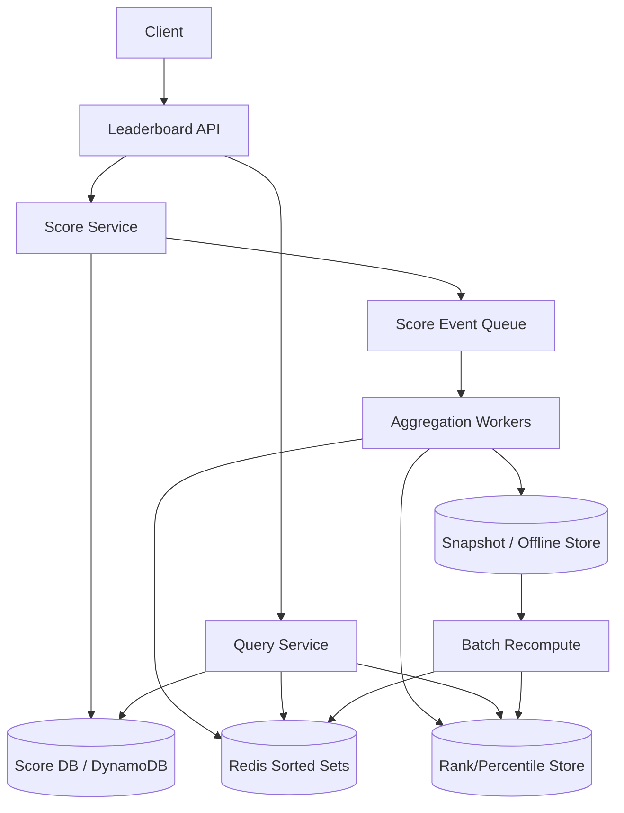

# 设计 Leaderboard 系统

## 功能需求

- 用户提交分数，系统更新 leaderboard。
- 查询 Top K，例如全局 Top 100、日榜、周榜、区域榜。
- 查询某个用户的 rank、score、percentile。
- 支持不同榜单维度和周期，例如 all-time、daily、region、game mode。

## 非功能需求

- Top K 查询低延迟。
- 分数更新高吞吐，并且支持幂等和去重。
- 排名允许短暂最终一致，但用户分数 source of truth 要可靠。
- 支持热点榜单和大规模用户数。

## API 设计

```text
POST /scores
- user_id, board_id, score_delta 或 score_value, activity_id, idempotency_key

GET /leaderboards/{board_id}/top?k=100
- 返回 top users, score, rank

GET /leaderboards/{board_id}/users/{user_id}
- 返回 user score, rank, percentile

GET /leaderboards/{board_id}/around/{user_id}?window=20
- 返回用户附近排名

POST /internal/leaderboards/{board_id}/rebuild
- 内部重建榜单
```

## 高层架构



## 关键组件

### Leaderboard API

- 处理分数写入和 leaderboard 查询。
- 注意事项：
  - `POST /scores` 必须带 `idempotency_key` 或 `activity_id`。
  - 查询 Top K 和用户 rank 是不同访问模式，不一定用同一个存储回答。
  - 不能把 Redis 的结果当作唯一 source of truth。

### Score Service

- 处理分数更新、幂等、分数聚合。
- 注意事项：
  - 明确分数语义：`score_delta` 累加，还是 `score_value` 取最大值/覆盖。
  - 写入 source of truth 后再异步更新 leaderboard read model。
  - 给下游事件最好带 absolute score，避免重复消费导致重复加分。

### Score DB / DynamoDB

- 保存用户在某个 board 的可靠分数。
- 可能 schema：

```text
PK = board_id
SK = user_id
score
updated_at
version
```

- 或按 user shard：

```text
PK = board_id#user_shard
SK = user_id
```

- 注意事项：
  - DynamoDB + GSI 可以支持按 score 排序，但热点、更新成本和跨 shard 聚合要仔细设计。
  - GSI 不是免费的 sorted leaderboard；score 更新会导致索引频繁更新。

### Redis Sorted Set

- 服务低延迟 Top K、rank、around-me 查询。
- 使用：

```text
ZADD leaderboard:{board_id} score user_id
ZREVRANGE leaderboard:{board_id} 0 K-1 WITHSCORES
ZREVRANK leaderboard:{board_id} user_id
```

- 注意事项：
  - 单个大 ZSET 有内存和热点问题。
  - 只存 Top K 或高分用户，可以降低内存。
  - 如果只存高分用户，普通用户 rank 需要另一个近似/批处理路径。

### Aggregation Worker

- 消费 score event，更新 Redis 和 rank/percentile store。
- 注意事项：
  - 消费要幂等。
  - 使用 absolute score 更新 Redis。
  - 对 sharded leaderboard，需要周期性上报每个 shard 的前 N，再合并全局 Top N。

### Rank / Percentile Store

- 可选，用于读优化。
- 存用户 rank、percentile、rank bucket。
- 注意事项：
  - Rank 变化频繁，是否存 DB 取决于是读优化还是写优化。
  - 批量更新 percentile 比实时更新每个用户 rank 更可行。
  - 排名前列用户可以更新得更频繁，长尾用户可以延迟或近似。

## 核心流程

### 提交分数

- Client 调 `POST /scores`。
- Score Service 校验幂等。
- 写 Score DB，更新用户 absolute score。
- 发布 `ScoreUpdated(board_id, user_id, absolute_score)`。
- Aggregation Worker 消费事件。
- 如果用户达到一定分数阈值，写入 Redis Sorted Set；否则只保留在 Score DB。
- 对 top users 或热点用户，更新 rank/percentile store。

### 查询 Top K

- Query Service 优先读 Redis Sorted Set。
- 如果是单 ZSET：
  - 直接 `ZREVRANGE 0 K-1`。
- 如果是 sharded ZSET：
  - 读取每个 shard 的 Top N。
  - 进行 k-way merge，得到 global Top K。
- 返回 user profile、score、rank。

### 查询用户 rank / percentile

- 如果 Redis 保存所有用户：
  - 直接 `ZREVRANK`。
- 如果 Redis 只保存高分用户：
  - 高分用户读 Redis。
  - 长尾用户读 RankDB 的批量 percentile，或用 score distribution 估算。
- 如果 rank 没落库：
  - 查询时实时计算，成本可能很高。
- 如果 rank 落库：
  - 读很快，但写入/批量更新成本高。

### 周期榜单

- Daily/weekly board 使用不同 key。
- 周期结束后冻结榜单。
- 新周期创建新 board。
- 历史榜单可以落到 offline store 或冷存储。

## 存储选择

- **Score DB / DynamoDB**
  - Source of truth：用户分数、幂等记录、score events。
  - DynamoDB 支持高写入和条件更新。
- **Redis Sorted Set**
  - Serving path：Top K、rank、around-me。
  - 可以只存 all users，也可以只存 top candidates。
- **RankDB**
  - 可选，用于存 rank、percentile、rank bucket。
  - 更适合批量更新，而不是每次 score update 都更新所有人 rank。
- **Queue/Kafka**
  - 解耦分数写入和 leaderboard 更新。
- **Offline Store / Batch**
  - 定期重算全量 rank、percentile、历史榜单、校准 Redis。

## 扩展方案

- 小规模：单 Redis ZSET per board，DynamoDB/DB 做 source of truth。
- 中规模：Redis cluster 按 board 分片，热门 board 单独资源池。
- 大规模：
  - 按 `user_id` consistent hash 分 shard。
  - 每个 shard 维护 local Top N。
  - 定期或实时上报 local Top N 到 aggregator。
  - Aggregator merge 出 global Top K。
- 如果只关心头部：
  - 到达一定 score threshold 才写 Redis。
  - 长尾用户只写 Score DB，rank/percentile 用批处理估算。
- 如果需要任意用户精确 rank：
  - 维护所有用户排序结构成本会很高，需要明确是否值得。

## 系统深挖

### 1. Redis Sorted Set vs DynamoDB + GSI

- 问题：
  - Leaderboard serving 应该用 Redis ZSET，还是 DynamoDB + GSI sorted key？
- 方案 A：Redis Sorted Set
  - 适用场景：
    - 需要低延迟 Top K、rank、around-me。
  - ✅ 优点：
    - 原生支持 `ZADD/ZREVRANGE/ZREVRANK`。
    - 查询简单、延迟低。
  - ❌ 缺点：
    - 内存成本高。
    - 单个大榜单会有热点和 shard 问题。
    - Redis 不是理想 source of truth。
- 方案 B：DynamoDB + GSI(score as sort key)
  - 适用场景：
    - 分数是可靠存储的一部分，写吞吐高，查询模式较固定。
  - ✅ 优点：
    - 持久化强，扩展性好。
    - 条件写、幂等、source of truth 语义更好。
  - ❌ 缺点：
    - GSI 按 score 排序会受到 partition key 设计限制。
    - 分数频繁变化会导致索引频繁更新。
    - 全局 Top K 仍然需要跨 partition merge。
- 方案 C：DynamoDB 做 source of truth + Redis 做 leaderboard read model
  - 适用场景：
    - 生产系统常见设计。
  - ✅ 优点：
    - DynamoDB 保可靠分数。
    - Redis 提供低延迟查询。
    - Redis 可从 DB/event log 重建。
  - ❌ 缺点：
    - 双写/异步更新带来最终一致。
- 推荐：
  - 选方案 C。
  - Staff+ 点：Redis 是 read model，DynamoDB/ScoreDB 是 source of truth。

### 2. Redis scale：单 ZSET vs sharded ZSET vs threshold TopK

- 问题：
  - Redis Sorted Set 怎么支持千万/上亿用户？
- 方案 A：单 board 单 ZSET
  - 适用场景：
    - 用户量中小、榜单数量有限。
  - ✅ 优点：
    - 实现最简单。
    - `ZREVRANK` 和 around-me 很方便。
  - ❌ 缺点：
    - 单 key 过大，内存和 CPU 热点明显。
    - Redis cluster 对单 key 不能自动拆分。
- 方案 B：按 user_id consistent hash 分多个 ZSET shard
  - 适用场景：
    - 用户量很大，需要分散写入。
  - ✅ 优点：
    - 写入分散。
    - 每个 shard 可独立维护 local Top N。
  - ❌ 缺点：
    - 全局 Top K 需要 merge 多个 shard。
    - 精确 global rank 很难实时计算。
- 方案 C：只把达到一定分数阈值的用户写入 Redis
  - 适用场景：
    - 产品主要关心头部榜单。
  - ✅ 优点：
    - 大幅降低 Redis 内存。
    - Top K 查询快。
  - ❌ 缺点：
    - 长尾用户无法直接查精确 rank。
    - 阈值选择和新用户突然冲榜要处理。
- 推荐：
  - 如果只查 Top K，用 threshold TopK 或 sharded local TopN。
  - 如果要 around-me 和精确 rank，单 Redis ZSET 简单但规模有限，要明确成本。

### 3. Sharding：按 score range vs consistent hash by user_id

- 问题：
  - 分片应该按分数范围，还是按 user_id hash？
- 方案 A：按 score range shard
  - 适用场景：
    - 分数基本不变或更新少的排序数据。
  - ✅ 优点：
    - 查询 Top K 直观，从最高 score range 开始查。
    - Percentile/rank bucket 容易理解。
  - ❌ 缺点：
    - Leaderboard 分数频繁变化，用户会跨 shard 移动。
    - 高分区容易成为热点。
    - Rebalancing 很麻烦。
- 方案 B：按 user_id consistent hash shard
  - 适用场景：
    - 高频分数更新。
  - ✅ 优点：
    - 写入分散稳定。
    - 用户不会因为 score 变化频繁迁移 shard。
  - ❌ 缺点：
    - 全局 Top K 需要各 shard 上报 local Top N 后 merge。
    - 精确 global rank/percentile 需要额外结构。
- 方案 C：混合：user_id shard + score histogram/rank bucket
  - 适用场景：
    - 既要写扩展，又要 percentile/rank 近似。
  - ✅ 优点：
    - 写入稳定。
    - Percentile 可用批量 histogram 近似。
  - ❌ 缺点：
    - 实现更复杂。
    - Rank 精度取决于 bucket 粒度。
- 推荐：
  - 高频更新的 leaderboard 不建议按 score range shard。
  - 按 user_id consistent hash 做写扩展，定期汇总 local Top N 和 score histogram。

### 4. Global Top K：每个 shard 上报 Top N vs 全量聚合

- 问题：
  - 分片后如何得到全局 Top K？
- 方案 A：每次查询 scatter-gather 所有 shard
  - 适用场景：
    - Shard 数少、QPS 低。
  - ✅ 优点：
    - 简单，实时性好。
  - ❌ 缺点：
    - 查询 fanout 大。
    - Shard 多时延迟和失败率上升。
- 方案 B：每个 shard 定期上报 local Top N，Aggregator merge
  - 适用场景：
    - 高 QPS Top K 查询。
  - ✅ 优点：
    - 查询快，直接读 global Top K。
    - 写入和查询解耦。
  - ❌ 缺点：
    - 全局榜单有延迟。
    - 如果 local N 太小，可能漏掉全局 Top K 边缘用户。
- 方案 C：流式二阶段聚合
  - 适用场景：
    - 对全局 Top K 新鲜度要求高。
  - ✅ 优点：
    - 比定期 batch 更新更实时。
    - 可以持续维护 global heap。
  - ❌ 缺点：
    - Aggregator 复杂，且可能成为热点。
- 推荐：
  - 高 QPS 查询用 local Top N 上报 + global merge。
  - N 应该大于 K，例如每 shard 上报 `K * safety_factor`。
  - 对极高实时性再做流式二阶段聚合。

### 5. Rank 是否存 DB：读优化 vs 写优化

- 问题：
  - 用户 rank 到底要不要落库？
- 方案 A：不存 rank，读时实时计算
  - 适用场景：
    - Redis 保存所有用户，或者 rank 查询不多。
  - ✅ 优点：
    - 写路径简单。
    - 不需要维护大量 rank 更新。
  - ❌ 缺点：
    - 分片后实时 global rank 难算。
    - 大规模时读延迟高。
- 方案 B：存 rank / percentile 到 RankDB
  - 适用场景：
    - Rank 查询很高频，允许 rank 有延迟。
  - ✅ 优点：
    - 读很快。
    - Percentile 可以批量更新，适合 dashboard/profile 展示。
  - ❌ 缺点：
    - 每次分数变化都可能影响很多人的 rank。
    - 实时维护精确 rank 写放大巨大。
- 方案 C：只存头部用户精确 rank，长尾存 percentile/bucket
  - 适用场景：
    - 产品关心 top users，长尾用户只需要大概位置。
  - ✅ 优点：
    - 成本可控。
    - 头部体验准确，长尾也能显示进度感。
  - ❌ 缺点：
    - 语义不完全统一。
    - 边界用户可能需要特殊处理。
- 推荐：
  - 不要实时存所有用户精确 rank。
  - Top users 更新完 Redis 后可以写精确 rank。
  - 长尾用户用批处理 percentile/rank bucket。

### 6. Percentile：score range histogram vs batch recompute

- 问题：
  - 用户不在 Top K 时，怎么告诉他大概超过了多少人？
- 方案 A：score range histogram
  - 适用场景：
    - 需要快速 percentile，允许近似。
  - ✅ 优点：
    - 读快，存储小。
    - 可以按 score bucket 聚合。
  - ❌ 缺点：
    - 精度取决于 bucket 设计。
    - 分数分布变化时 bucket 可能不均匀。
- 方案 B：定期 batch recompute percentile
  - 适用场景：
    - 日榜、周榜、允许分钟级/小时级延迟。
  - ✅ 优点：
    - 结果更稳定。
    - 可以扫全量数据生成 rank bucket。
  - ❌ 缺点：
    - 不实时。
    - 大榜单成本高。
- 方案 C：Redis rank 实时计算 percentile
  - 适用场景：
    - Redis 保存所有用户且规模可控。
  - ✅ 优点：
    - 实时准确。
  - ❌ 缺点：
    - 规模受限。
    - Sharding 后不再简单。
- 推荐：
  - 大规模下用 histogram + batch 校准。
  - 头部用户给精确 rank，长尾用户给 percentile。

### 7. 分数更新语义：delta vs absolute score

- 问题：
  - 重试或重复消费会不会重复加分？
- 方案 A：事件里传 `score_delta`
  - 适用场景：
    - 原始业务事件，例如完成一局游戏加 10 分。
  - ✅ 优点：
    - 语义自然。
    - 便于审计分数来源。
  - ❌ 缺点：
    - 重复消费会重复加分。
    - 幂等处理更复杂。
- 方案 B：下游 leaderboard 只接收 `absolute_score`
  - 适用场景：
    - Redis/DynamoDB GSI read model 更新。
  - ✅ 优点：
    - `ZADD absolute_score user_id` 幂等。
    - 重复消费不会重复加分。
  - ❌ 缺点：
    - Score Service 必须先聚合出权威分数。
- 方案 C：delta + event_id dedup
  - 适用场景：
    - 必须用增量更新的系统。
  - ✅ 优点：
    - 可以保留 delta 流。
  - ❌ 缺点：
    - Dedup state 成本高。
    - 过期和重放逻辑复杂。
- 推荐：
  - Source of truth 记录 delta event。
  - Leaderboard read model 使用 absolute score 更新。

## 面试亮点

- 可以深挖：Redis Sorted Set 很适合 serving，但不是 source of truth；DynamoDB/DB 保存权威分数。
- 可以深挖：DynamoDB GSI 不是免费全局 leaderboard，score 高频更新和跨 partition merge 都是问题。
- Staff+ 判断点：按 score range shard 对频繁变化的 leaderboard 不友好，按 user_id consistent hash 更稳定。
- 可以深挖：全局 Top K 可以由每个 shard 上报 local Top N 后 merge，不必每次查询 scatter-gather。
- Staff+ 判断点：rank 是否落库取决于是读优化还是写优化；不要实时维护所有用户精确 rank。
- 可以深挖：头部用户精确 rank + 长尾用户 percentile/bucket 是更现实的大规模设计。

## 一句话总结

- Leaderboard 的核心是把权威分数和排名 read model 分开：DynamoDB/ScoreDB 保存可靠分数，Redis Sorted Set 服务低延迟 Top K；规模上来后按 user_id consistent hash 分片，每个 shard 上报 local Top N 合并全局榜，rank/percentile 根据读写取舍选择实时计算、批量落库或近似 bucket。
