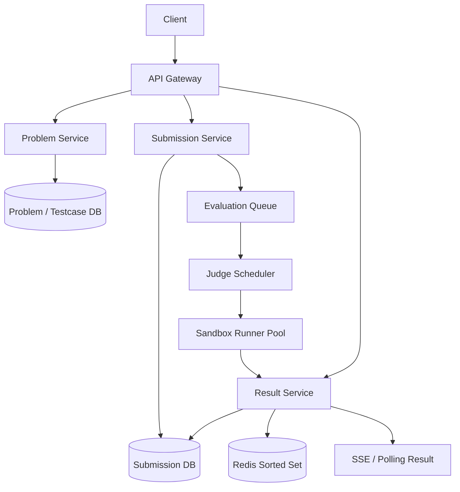

# 设计 LeetCode 系统

## 功能需求

- 用户可以查看题目、提交代码，并获得 compile/run/test 结果。
- 系统支持多语言代码执行和隐藏测试用例。
- 支持实时或准实时展示 evaluation result。
- 支持 contest leaderboard。

## 非功能需求

- 执行用户代码必须强隔离，防止越权访问 host、网络、文件系统和其他用户数据。
- 评测系统可水平扩展，能应对 contest 高峰提交。
- 每次提交结果可审计、可复现。
- 执行延迟可控，超时或超资源必须终止。

## API 设计

```text
GET /problems/{problem_id}
- response: title, description, constraints, examples, allowed_languages

POST /submissions
- request: user_id, problem_id, language, code, contest_id?, idempotency_key
- response: submission_id, status=queued

GET /submissions/{submission_id}
- response: status, compile_error?, runtime_ms, memory_mb, test_summary

GET /submissions/{submission_id}/events
- SSE stream for status updates

GET /contests/{contest_id}/leaderboard?cursor=&limit=100
- response: rank_entries[], next_cursor
```

## 高层架构



## 关键组件

- Problem Service
  - 存题目 metadata、语言限制、时间/内存限制、测试用例引用。
  - public examples 可以直接返回给用户。
  - hidden tests 不直接暴露，只能被 judge runner 读取。
  - test case 可以和 problem metadata 放一起；如果测试文件大，放 S3/Object Store。

- Submission Service
  - 接收代码提交，创建 submission record。
  - 小代码片段可以直接存在 DB submission object 里。
  - 如果支持完整项目、多文件、大附件，则代码放 S3，DB 只存 object key。
  - 提交后只入队，不同步执行，避免 API 被慢评测拖垮。

- Evaluation Queue
  - 按语言、题目、contest 分区或设置优先级。
  - contest submission 可以有更高优先级。
  - 至少一次投递，所以 runner/result update 需要幂等。
  - 可以有 DLQ 存持续失败的评测任务。

- Judge Scheduler
  - 从 queue 拉 submission。
  - 根据语言、资源需求、runner pool 状态调度到 sandbox。
  - 不执行用户代码本身，只负责分配任务、超时控制、重试策略。
  - 可以按语言维护 runner pools，避免 Python/Java/C++ 编译环境互相影响。

- Sandbox Runner Pool
  - 真正执行用户代码。
  - 每次执行使用独立 container / microVM / serverless function。
  - 设置 CPU、memory、pids、disk、timeout 限制。
  - 禁止网络访问，挂载只读测试文件，输出目录临时可写。
  - 执行完成后销毁环境，不复用用户写入状态。

- Result Service
  - 收集 compile result、test result、runtime、memory。
  - 更新 submission status。
  - 推送状态到 client，或供 client polling。
  - contest 模式下更新 leaderboard。

- Leaderboard
  - Redis Sorted Set 存 contest 排名。
  - score 可以编码为 solved count、penalty time、last accepted time。
  - 周期性从 SubmissionDB reconciliation，防止 Redis 临时不一致。
  - 前端每几秒 polling leaderboard 即可，不需要每次排名变化实时推送。

## 核心流程

- 用户提交代码
  - Client 调 `POST /submissions`。
  - Submission Service 写 submission，状态为 `queued`。
  - 代码较小则存在 DB；代码较大则上传 S3，DB 存 pointer。
  - 发送 evaluation task 到 queue。
  - 返回 `submission_id`。

- 评测执行
  - Judge Scheduler 拉取 task。
  - 获取 problem test cases 和 language runtime image。
  - 创建 sandbox execution。
  - 编译代码，运行 public/hidden tests。
  - 超过 CPU/memory/time limit 直接 kill。
  - 写回 compile error / wrong answer / accepted / runtime error。

- 用户获取结果
  - 方式 A：Client polling `GET /submissions/{id}`。
  - 方式 B：Client 打开 SSE 连接接收状态变化。
  - 对 LeetCode 这种状态变化少的场景，polling 更简单；SSE 适合想展示流式日志或长运行进度。

- 更新 leaderboard
  - Result Service 发现 contest accepted submission。
  - 更新 Redis Sorted Set。
  - 定期 job 从 SubmissionDB 重算 leaderboard，修正 Redis 漏写或重复写。
  - Client 每几秒拉取 leaderboard。

## 存储选择

- Problem DB
  - SQL / DynamoDB 都可以。
  - 题目 metadata 小且关系明确，SQL 很方便。
  - test case 大文件放 S3/Object Store，DB 存引用。

- Submission DB
  - DynamoDB / Cassandra / sharded MySQL。
  - 查询模式主要是 `user_id + created_at`、`problem_id + user_id`、`submission_id`。
  - 小代码直接存 DB；大代码放 S3。

- Object Store
  - 存大代码包、test case 文件、judge artifacts、编译日志。
  - 隐藏测试用例要严格权限控制，只允许 judge role 读。

- Redis
  - 存 contest leaderboard sorted set。
  - 存短期 submission status cache。
  - 不是 source of truth，需要 periodic reconciliation。

## 扩展方案

- API 层 stateless scale。
- Evaluation Queue 吸收 contest burst。
- Judge Runner Pool 按语言横向扩展。
- ECS/Kubernetes 适合稳定评测负载；serverless 适合短小、波动型提交。
- 热门 contest 使用独立 queue 和 runner pool，避免影响普通练习。
- Leaderboard 用 Redis ZSET + periodic DB reconciliation。

## 系统深挖

### 1. 执行隔离：VM vs Container vs Serverless

- 方案 A：VM
  - 适用场景：强隔离、安全优先、执行环境不可信程度高。
  - ✅ 优点：完整 OS 隔离，攻击逃逸难度更高。
  - ❌ 缺点：资源开销大，启动慢，弹性扩缩容成本高。

- 方案 B：Docker Container
  - 适用场景：大多数在线 judge，高吞吐、低启动延迟。
  - ✅ 优点：轻量、启动快、资源利用率高，便于按语言打 image。
  - ❌ 缺点：共享 host kernel，隔离弱于 VM；必须防 container escape。

- 方案 C：Serverless Function
  - 适用场景：短小、无状态、事件驱动的评测任务。
  - ✅ 优点：自动扩缩容，运维低，空闲成本低。
  - ❌ 缺点：资源和运行时限制强；自定义系统调用、编译器、长任务支持受限。

- 推荐：
  - 普通 LeetCode 使用 container runner。
  - 高安全场景可用 microVM，比如 Firecracker 类方案。
  - Serverless 可作为短任务 executor，但不要强绑定核心架构。

### 2. Container 安全限制

- 方案 A：只用普通 Docker
  - 适用场景：内部可信代码，不适合用户提交代码。
  - ✅ 优点：实现简单。
  - ❌ 缺点：用户代码可能访问网络、fork bomb、读 host mount、打 kernel syscall。

- 方案 B：Hardened Container
  - 适用场景：在线 judge 主流方案。
  - ✅ 优点：成本低、启动快、安全性足够可控。
  - ❌ 缺点：仍然共享 kernel，需要持续 patch 和 defense-in-depth。

- 方案 C：Container + MicroVM
  - 适用场景：安全要求高、允许更高成本。
  - ✅ 优点：既有 container 镜像生态，又有 VM 级隔离。
  - ❌ 缺点：启动和运维复杂度上升。

- 推荐限制：
  - read-only root filesystem。
  - test files read-only mount。
  - no network access。
  - CPU / memory / pids / disk quota。
  - seccomp 禁止危险 syscall。
  - AppArmor/SELinux profile。
  - timeout 过期 kill。
  - 每次执行独立临时目录，结束销毁。

### 3. Client 获取结果：Polling vs SSE

- 方案 A：Polling
  - 适用场景：提交状态变化少，结果通常几秒内出来。
  - ✅ 优点：实现简单；兼容性好；无长连接资源压力。
  - ❌ 缺点：有几秒延迟；大量用户频繁 polling 会增加 QPS。

- 方案 B：SSE
  - 适用场景：需要流式输出 compile/run progress。
  - ✅ 优点：server-to-client 单向推送简单；适合流式状态。
  - ❌ 缺点：兼容性差于普通 HTTP，不支持 IE；长连接占资源；浏览器单域名连接数通常有限。

- 方案 C：WebSocket
  - 适用场景：需要双向交互，比如在线 IDE、协作编辑。
  - ✅ 优点：双向低延迟。
  - ❌ 缺点：连接管理和扩展复杂。

- 推荐：
  - LeetCode submission result 默认 polling。
  - 如果要展示逐 test case 进度或编译日志，可以加 SSE。
  - Leaderboard 每几秒 polling，允许轻微延迟。

### 4. Code/Test Storage：DB vs S3

- 方案 A：代码直接存在 DB
  - 适用场景：LeetCode-style 小函数提交。
  - ✅ 优点：读取简单；submission record 自包含；审计方便。
  - ❌ 缺点：大文件、多文件项目会让 DB 膨胀。

- 方案 B：代码放 S3，DB 存 pointer
  - 适用场景：多文件项目、大型作业、支持附件。
  - ✅ 优点：成本低，适合大对象；DB 压力小。
  - ❌ 缺点：多一次读取；权限和生命周期管理更复杂。

- 方案 C：Hybrid
  - 适用场景：同时支持普通题和项目题。
  - ✅ 优点：小提交快，大提交省成本。
  - ❌ 缺点：两条读取路径。

- 推荐：
  - 小函数代码直接存在 Submission DB。
  - 大文件/多文件代码和 judge artifact 放 S3。
  - test case 可跟 problem metadata 存引用，大 test file 放 S3。

### 5. Queue 和 Runner 扩展

- 方案 A：单全局 queue
  - 适用场景：早期系统。
  - ✅ 优点：简单。
  - ❌ 缺点：contest burst 可能饿死普通提交；某语言积压影响所有语言。

- 方案 B：按语言/优先级分 queue
  - 适用场景：多语言在线 judge。
  - ✅ 优点：不同 runtime 独立扩展；contest 可加优先级。
  - ❌ 缺点：调度器要处理公平性和容量分配。

- 方案 C：独立 contest pool
  - 适用场景：大型比赛。
  - ✅ 优点：隔离峰值，避免影响普通用户。
  - ❌ 缺点：资源利用率可能降低。

- 推荐：
  - queue 按语言和优先级拆分。
  - ECS/K8s autoscaling 根据 queue lag、CPU、memory 扩 runner。
  - contest 单独配置 quota 或 dedicated runner pool。

### 6. At-least-once 和结果幂等

- 方案 A：假设 evaluation 只执行一次
  - 适用场景：不适合分布式 judge。
  - ✅ 优点：实现简单。
  - ❌ 缺点：queue retry、runner crash 都会导致重复执行。

- 方案 B：幂等更新 submission result
  - 适用场景：生产系统。
  - ✅ 优点：重复评测不会破坏最终状态。
  - ❌ 缺点：需要状态机和 version/CAS。

- 方案 C：dedup execution
  - 适用场景：昂贵评测任务。
  - ✅ 优点：减少重复执行浪费。
  - ❌ 缺点：需要 execution lease，runner failure 后要恢复。

- 推荐：
  - Queue 默认 at-least-once。
  - 每个 submission 有状态机：`queued -> running -> success/failed`。
  - Result update 使用 `submission_id + attempt_id` 和 CAS，避免旧 attempt 覆盖新结果。

### 7. Leaderboard：Redis ZSET vs DB

- 方案 A：DB 实时算排名
  - 适用场景：用户少、contest 小。
  - ✅ 优点：source of truth 简单。
  - ❌ 缺点：排名查询和排序成本高，高峰扛不住。

- 方案 B：Redis Sorted Set
  - 适用场景：contest leaderboard。
  - ✅ 优点：更新和 top-N 查询快。
  - ❌ 缺点：Redis 不是最终事实源；需要处理漏写、重复写和重算。

- 方案 C：Redis + periodic reconciliation
  - 适用场景：生产 contest。
  - ✅ 优点：实时体验好，同时能修正错误。
  - ❌ 缺点：实现多一层 batch/rebuild。

- 推荐：
  - Redis ZSET 服务实时 leaderboard。
  - SubmissionDB 是 source of truth。
  - 每隔几秒或几十秒从 DB 校验/重算，接受小延迟。

### 8. Monitoring / Alert

- 方案 A：只看 API latency/error
  - 适用场景：基础监控。
  - ✅ 优点：容易实现。
  - ❌ 缺点：看不到 judge pipeline 是否堆积。

- 方案 B：queue + runner 指标
  - 适用场景：在线 judge 必须有。
  - ✅ 优点：能及时发现 contest backlog、某语言 runner 挂掉。
  - ❌ 缺点：需要按语言、题目、contest 维度拆指标。

- 方案 C：sandbox 安全审计
  - 适用场景：不可信代码执行平台。
  - ✅ 优点：能发现越权尝试、异常 syscall、资源攻击。
  - ❌ 缺点：日志量大，需要采样和规则。

- 推荐监控：
  - submission queued/running/success/fail count。
  - queue lag by language / contest。
  - runner startup time、execution time、timeout rate。
  - compile error/runtime error 分布。
  - OOM/killed/container escape attempt/seccomp denied count。
  - leaderboard update lag。
  - Alert：queue lag 暴涨、某语言 runner success rate 异常、sandbox security violation。

## 面试亮点

- LeetCode 的核心不是 CRUD，而是不可信代码执行隔离。
- Container 高效但共享 host kernel，需要 seccomp、no network、read-only FS、resource limit、timeout 多层防御。
- VM 隔离更强但启动慢、成本高；microVM 是安全和效率之间的高级折中。
- SubmissionDB 是结果 source of truth；Redis leaderboard 是 derived view，要 periodic reconciliation。
- Polling 对 submission result 已经足够，SSE 适合流式日志，不必过度设计长连接。
- Queue + runner pool 把 API 和评测解耦，contest 高峰靠 autoscaling 和优先级隔离。
- At-least-once 下评测结果更新必须幂等，旧 attempt 不能覆盖新 attempt。

## 一句话总结

LeetCode 系统的核心是：API 只负责提交和查询，评测通过 queue 解耦到可扩展 runner pool，用户代码在强限制 sandbox 中执行，结果幂等写回 SubmissionDB，排行榜用 Redis ZSET 提供低延迟读并通过 DB 周期性校准。
