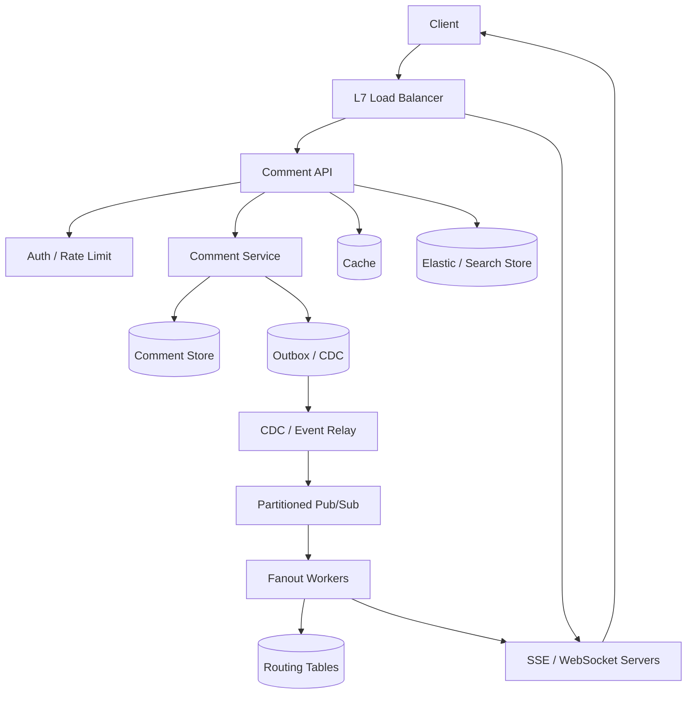

# 设计 Live Comment 系统

## 功能需求

- 用户观看直播/视频时可以发送 live comment，并实时看到其他用户评论。
- 支持查看历史评论，按时间或 `comment_id` 做 cursor pagination。
- 支持热门视频高并发评论分发和冷门视频低成本服务。
- 支持多 region / 多 DC，同一视频的评论可跨地区同步。

## 非功能需求

- 实时评论低延迟，目标数百毫秒内可见。
- 评论不能丢，实时推送失败后可通过历史接口补齐。
- 系统要处理热点视频带来的 fanout 和连接不均衡。
- 跨 DC 同步允许短暂延迟，但要避免重复和乱序体验太差。

## API 设计

```text
POST /videos/{video_id}/comments
- request: user_id, content, client_comment_id, timestamp
- response: comment_id, comment_seq, created_at

GET /videos/{video_id}/comments?after=cursor&limit=50
- 历史评论 / 补齐评论
- response: comments[], next_cursor

GET /videos/{video_id}/comments?before=cursor&limit=50
- 向上翻历史
- response: comments[], prev_cursor

GET /videos/{video_id}/comments/stream
- SSE / WebSocket subscribe live comments

POST /comments/{comment_id}/moderate
- request: action=delete|hide|flag
- response: status
```

## 高层架构



## 关键组件

- Comment API
  - 负责发评论、查历史、moderation 入口。
  - 同步路径只做鉴权、限流、spam 初筛、幂等检查和写入 source of truth。
  - 用 `client_comment_id` 做幂等，避免客户端重试导致重复评论。
  - 注意不要把搜索索引、跨 DC 同步、实时 fanout 放成强同步依赖。

- Comment Store
  - 评论的 source of truth。
  - 典型分区键是 `video_id + time_bucket` 或 `video_id + comment_seq`。
  - 表结构示例：

```text
comments(
  video_id,
  comment_seq,
  comment_id,
  user_id,
  content,
  created_at,
  status
)
```

  - 历史读取通过 `video_id` 范围扫描，cursor 用 `comment_seq` 或 `(created_at, comment_id)`。
  - moderation 建议 soft delete / hide，不要物理删除后破坏 cursor。

- Stream Gateway
  - 维护客户端 SSE / WebSocket 长连接。
  - 记录每个连接订阅的 `video_id`，并定期 heartbeat。
  - SSE 适合 server-to-client comment stream；WebSocket 适合更多双向互动。
  - 客户端断线重连时带 last cursor，通过历史接口补齐漏掉的评论。

- Routing Tables
  - 用 Redis 或内存 + TTL 保存实时订阅关系：

```text
video_id -> list(node_id)
user_id  -> node_id
user_id  -> video_id
```

  - `video_id -> node_id` 用于 fanout，避免把评论发给所有 stream server。
  - `user_id -> video_id` 更新频繁，需要 TTL 和 heartbeat 清理。
  - 注意 node failure 后的路由清理，否则 fanout 会持续打到死节点。

- Partitioned Pub/Sub
  - 用 Kafka / Redis Streams / Pulsar 承载评论事件分发。
  - 按 `video_id` 分区可以保留单视频内顺序。
  - 不建议每个 video 一个 topic，topic 数量会爆炸。
  - Pub/Sub 不是 source of truth，丢实时事件后靠 Comment Store + cursor 补齐。

- Fanout Workers
  - 消费评论事件，查 `video_id -> node_id`，把评论推到对应 Stream Gateway。
  - 热门视频需要 layered fanout / batching / sampling / rate limit。
  - 推送失败不做无限重试，靠客户端 reconnect + cursor recovery。

- History Query / Cache
  - 普通历史评论走 DB cursor：

```sql
WHERE video_id = ?
  AND comment_seq > ?
ORDER BY comment_seq
LIMIT 50
```

  - 搜索场景可以用 Elasticsearch `search_after`。
  - 热门视频最近评论可以放 Redis cache，减少 DB 压力。

## 核心流程

- 发送 live comment
  - Client 调 `POST /videos/{video_id}/comments`，带 `client_comment_id`。
  - API 做鉴权、限流、spam 初筛、幂等检查。
  - Comment Service 生成 `comment_id` 和 per-video `comment_seq`，写 Comment Store。
  - 写入 outbox 或通过 CDC 产生 comment event。
  - Event Relay 发布到 partitioned pub/sub。
  - Fanout Worker 查 `video_id -> node_id`，推给相关 Stream Gateway。
  - Stream Gateway 通过 SSE / WebSocket 发给正在观看该视频的用户。

- 实时接收评论
  - Client 打开 SSE / WebSocket 连接，订阅 `video_id`。
  - L7 Load Balancer 可以按 `video_id` sticky 到某个 server group。
  - Stream Gateway 更新 routing table 和 heartbeat。
  - 客户端收到 comment 后更新本地 cursor。
  - 断线重连时用 last cursor 调历史接口补齐。

- 查看历史评论
  - Client 使用 `after` 或 `before` cursor 请求。
  - API 查 Comment Store 或 recent cache。
  - 返回 comments 和 next cursor。
  - 客户端可以预取下一页，提升滚动体验。

- 多 DC 同步
  - 本地 DC 先写本地 Comment Store，保证低延迟。
  - CDC 写入 Kafka / replication pipeline，异步同步到其他 DC。
  - 目标 DC 幂等写入，按 `comment_id` 去重。
  - 热门视频可以优先跨 DC 同步；冷门视频可延迟或按需拉取。

## 存储选择

- Comment Store
  - Cassandra / ScyllaDB / DynamoDB / sharded MySQL。
  - 核心是按 `video_id` 支持有序范围读，并能承受热门视频写入。

- Redis
  - 存 routing table、订阅关系、recent comments cache。
  - 所有 routing entry 必须有 TTL，避免连接断开后脏数据堆积。

- Kafka / Redis Streams / Pulsar
  - 用于 comment event 分发。
  - Kafka 更适合高吞吐、跨 DC mirror、可 replay。
  - Redis Streams 更轻量，但跨 DC 和长期 replay 能力弱一些。

- Elasticsearch
  - 可选，用于评论搜索、审核后台、复杂过滤。
  - 不是强一致 source of truth。

- Object Store / Cold Store
  - 长期归档、离线分析、风控训练。

## 扩展方案

- 单 region 内先按 `video_id` partition comment data 和 event stream。
- Stream Gateway 不按用户平均分，而是按 `video_id -> server group` 聚合观看同一视频的人。
- 热门视频动态扩容 server group，冷门视频共享普通 gateway pool。
- Fanout 对热门视频做 batching，极端情况下做 sampling 或 rate limiting。
- 跨 DC 使用异步 CDC / Kafka replication，避免所有发评论请求都走同步跨区域写。

## 系统深挖

### 1. 实时协议：Polling vs SSE vs WebSocket

- 方案 A：Polling
  - 适用场景：实时性要求低，或者客户端/网络环境非常简单。
  - ✅ 优点：实现简单，纯 HTTP，负载均衡和重试都容易。
  - ❌ 缺点：延迟取决于轮询间隔；大量空请求浪费 QPS；热门视频成本高。

- 方案 B：SSE
  - 适用场景：评论主要是 server-to-client 单向推送。
  - ✅ 优点：基于 HTTP，浏览器原生支持自动重连；比 WebSocket 运维简单。
  - ❌ 缺点：单向通道；长连接仍然需要专门的 gateway、heartbeat 和 backpressure。

- 方案 C：WebSocket
  - 适用场景：评论、reaction、互动状态都需要双向低延迟。
  - ✅ 优点：双向、低延迟、协议灵活。
  - ❌ 缺点：连接管理复杂；水平扩展、连接迁移、服务发现和重试都更难。

- 推荐
  - 如果只是 live comment，优先 SSE。
  - 如果还有实时互动、presence、游戏化玩法，可以选 WebSocket。
  - 不管选哪种，可靠性都不要靠连接本身，而靠 Comment Store + cursor 补齐。

### 2. Pub/Sub 分发：pull-based partition vs push-based routing

- 方案 A：partitioned pub/sub pull
  - 适用场景：消费者稳定，按 `video_id` 分区消费。
  - ✅ 优点：天然有 backpressure；单视频顺序容易保证；worker 扩缩容清晰。
  - ❌ 缺点：订阅关系变化频繁时，很多 worker 可能拉到没有本地观众的消息。

- 方案 B：直接 push 到 SSE / WebSocket server
  - 适用场景：有准确的 `video_id -> node_id` 路由表。
  - ✅ 优点：只发给有观众的节点，延迟低，内网无效流量少。
  - ❌ 缺点：路由表更新频繁；节点失败、扩缩容、连接迁移会让元数据管理复杂。

- 方案 C：Hybrid
  - 适用场景：同时有热门和大量冷门视频。
  - ✅ 优点：热门视频走 push routing，冷门视频走共享消费池，成本和延迟平衡。
  - ❌ 缺点：系统路径更多，调试和容量规划更复杂。

- 推荐
  - 面试里可以说：fanout worker 从 pub/sub 消费，然后按 `video_id -> node_id` push 到相关 stream nodes。
  - 对冷门视频可以让多个 video 共享普通 stream pool；对热门视频单独建立 server group。

### 3. 让看相同视频的人到哪里：单节点 vs server group vs 完全随机

- 方案 A：同一视频 sticky 到单个 server
  - 适用场景：小规模直播或低并发视频。
  - ✅ 优点：本地 broadcast 最简单；不需要跨节点 fanout。
  - ❌ 缺点：热门视频会把单节点打爆。

- 方案 B：同一视频 sticky 到 server group
  - 适用场景：热门视频需要多节点承载，但又希望减少 fanout 范围。
  - ✅ 优点：fanout 只打到这个 video 的 server group；可动态扩容。
  - ❌ 缺点：需要管理 group membership、连接迁移、负载不均。

- 方案 C：完全随机分配连接
  - 适用场景：流量非常平均，或者实现简单优先。
  - ✅ 优点：LB 简单，连接分布均匀。
  - ❌ 缺点：一个热门视频的评论可能要 fanout 到几乎所有 stream servers。

- 推荐
  - 使用 `video_id -> server group`。
  - 冷门视频共享 group，热门视频独立 group 并可动态扩容。
  - 这个点能体现 Staff+ 判断：热点不是平均 QPS，而是单个 video 的 fanout 半径。

### 4. Routing metadata 如何维护

- 方案 A：只维护 `user_id -> node_id`
  - 适用场景：私信/单用户通知。
  - ✅ 优点：简单，按用户推送直接。
  - ❌ 缺点：live comment 是按 video fanout，仅有 user routing 会导致要遍历用户。

- 方案 B：维护 `video_id -> list(node_id)`
  - 适用场景：按 video 广播评论。
  - ✅ 优点：fanout 范围明确，不需要遍历所有用户。
  - ❌ 缺点：用户进出视频频繁，列表更新和过期清理压力大。

- 方案 C：三张 routing 表组合
  - 适用场景：既要 video fanout，又要用户维度排查、迁移和清理。
  - ✅ 优点：支持不同查询方向；节点失败后可以更快清理相关订阅。
  - ❌ 缺点：元数据一致性复杂，需要 TTL、heartbeat 和幂等更新。

- 推荐
  - Redis / in-memory store 存三类 routing，但每条 entry 都有 TTL。
  - Stream Gateway 定期 heartbeat，上报 subscription count。
  - routing table 是 best-effort derived state，真实恢复靠 reconnect + history cursor。

### 5. 历史评论分页：DB cursor vs Elasticsearch search_after vs cache

- 方案 A：DB cursor
  - 适用场景：按视频时间顺序读评论。
  - ✅ 优点：稳定、正确、容易和 source of truth 对齐。
  - ❌ 缺点：复杂搜索、过滤、审核条件不灵活。

- 方案 B：Elasticsearch `search_after`
  - 适用场景：评论搜索、审核后台、关键词过滤。
  - ✅ 优点：复杂查询能力强，深分页比 offset 更稳定。
  - ❌ 缺点：索引最终一致，不适合作为评论正确性的唯一来源。

- 方案 C：recent comments cache
  - 适用场景：热门视频大量用户反复读最近评论。
  - ✅ 优点：延迟低，能明显减轻 DB 压力。
  - ❌ 缺点：cache 可能过期或缺失，需要 DB fallback。

- 推荐
  - 用户正常看历史走 DB cursor。
  - 热门最近评论加 Redis cache。
  - 搜索和 moderation 用 Elasticsearch，但明确它是 derived index。

### 6. 多 DC 同步：同步写 vs CDC 异步 vs video home region

- 方案 A：同步跨 DC 写
  - 适用场景：极少数强一致、跨区域必须同时可见的业务。
  - ✅ 优点：一致性强，读任何 DC 都更接近最新。
  - ❌ 缺点：写延迟高；跨区故障会影响核心发评论链路。

- 方案 B：CDC / Kafka 异步复制
  - 适用场景：大部分评论系统，允许秒级最终一致。
  - ✅ 优点：本地写低延迟；跨 DC 解耦；可以只同步热门视频。
  - ❌ 缺点：会有延迟、重复、乱序，需要幂等和排序策略。

- 方案 C：video home region
  - 适用场景：希望单视频有明确 owner，减少多主冲突。
  - ✅ 优点：per-video ordering 更清晰。
  - ❌ 缺点：远端用户发评论可能跨区写，延迟上升。

- 推荐
  - 默认本地写 + CDC 异步同步。
  - 对全球热门直播可指定 home region，或者多 region 本地接入后统一事件排序。
  - 用 `comment_id` 去重，用 `comment_seq` 或 server timestamp 控制展示顺序。

### 7. 热点与不均衡：固定容量 vs 动态扩容 vs 降级

- 方案 A：固定 server group
  - 适用场景：流量可预测的视频或小规模系统。
  - ✅ 优点：实现简单，容量规划直观。
  - ❌ 缺点：热点突发时容易过载；冷门时浪费。

- 方案 B：动态扩容 server group
  - 适用场景：热点视频随时间快速变化。
  - ✅ 优点：可以把资源集中给热门视频。
  - ❌ 缺点：扩容时需要更新 routing、迁移新连接、处理旧连接。

- 方案 C：服务降级
  - 适用场景：峰值超过系统实时展示能力。
  - ✅ 优点：保护核心写入和观看体验。
  - ❌ 缺点：用户看到的评论可能不是全量实时评论。

- 推荐
  - 热门视频优先动态扩容 server group。
  - 极端热点时做 batching、sampling、rate limiting。
  - 关键是保证评论写入不丢，实时展示可以有策略地降级。

### 8. 推送可靠性：实时推送 vs cursor 补齐 vs per-user inbox

- 方案 A：只靠实时推送
  - 适用场景：允许丢评论的低价值场景。
  - ✅ 优点：实现简单，延迟最低。
  - ❌ 缺点：连接断开或 server failure 会丢事件。

- 方案 B：实时推送 + cursor 补齐
  - 适用场景：live comment 的主流选择。
  - ✅ 优点：在线低延迟，断线后可恢复；写放大较低。
  - ❌ 缺点：客户端需要 merge、dedup 和维护 cursor。

- 方案 C：per-user inbox
  - 适用场景：私信、通知、必须逐用户确认送达。
  - ✅ 优点：delivery tracking 精确。
  - ❌ 缺点：公开 live comment 会产生巨大写放大，不适合大规模观看场景。

- 推荐
  - live comment 用实时推送 + cursor 补齐。
  - 不为每个 viewer 写 inbox。
  - 这能展示一个很重要的判断：不是所有实时系统都需要 per-user delivery state。

## 面试亮点

- Live comment 的可靠性边界不是 SSE / WebSocket，而是 Comment Store + cursor recovery。
- Pub/Sub 只是分发层，不是 source of truth；丢实时事件后要能从历史补齐。
- 热点视频的核心问题是 fanout 半径和连接聚集，不是平均 QPS。
- `video_id -> server group` 比单节点 sticky 和随机分配更适合高并发视频。
- Push-based routing 和 pull-based pub/sub 的权衡是：少内网无效流量 vs 多维护实时 routing metadata。
- 多 DC 同步本质是异步复制和多主冲突问题，需要明确 per-video ordering、dedup 和延迟接受范围。
- 极端热点下实时展示可以 sampling / batching / rate limit，但评论写入和历史补齐要保持正确。

## 一句话总结

Live Comment 的核心是把可靠写入和实时分发解耦：评论先写 source of truth，再通过 pub/sub fanout 到 SSE / WebSocket server group，客户端用 cursor 在断线或漏推时补齐，热点通过 server group、动态扩容和降级策略控制。
