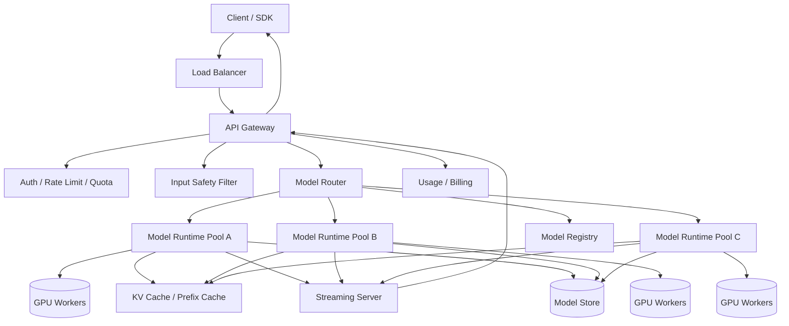

# 设计大模型 Inference System

## 功能需求

- 用户通过 API 发起 LLM inference 请求，支持 chat/completions 和 streaming 输出。
- 支持多模型、多版本、多租户，包括不同 context length、LoRA/adapter、priority tier。
- 支持请求路由、限流、配额、用量统计。
- 支持安全过滤、日志追踪、失败重试和模型灰度发布。

## 非功能需求

- 低延迟：尤其是 TTFT，Time To First Token。
- 高吞吐：最大化 GPU utilization 和 tokens/sec。
- 高可用：单个 model replica 或 GPU node 故障不影响整体服务。
- 成本可控：batching、KV cache、模型加载和路由都要围绕 GPU 资源优化。

## API 设计

```text
POST /v1/chat/completions
- model, messages, max_tokens, temperature, stream, user, idempotency_key

POST /v1/completions
- model, prompt, max_tokens, temperature, stream

GET /v1/models
- list available models and versions

GET /v1/requests/{request_id}
- request status, token usage, error

POST /internal/models/{model_id}/rollout
- canary / promote / rollback model version
```

## 高层架构



## 关键组件

### API Gateway

- 负责外部 API、鉴权、参数校验、streaming connection 管理。
- 不直接做 GPU 调度。
- 注意事项：
  - 对 `max_tokens`、context length、concurrent requests 做限制。
  - 对 streaming 请求要处理 client disconnect，及时取消后端 generation。
  - 记录 request_id，方便 trace 和 billing。

### Auth / Rate Limit / Quota

- 按 tenant/user/API key 控制请求量。
- 限流维度：

```text
requests/min
tokens/min
concurrent requests
max context length
model-specific quota
```

- 注意事项：
  - LLM 成本主要和 token 相关，所以 token quota 比 QPS 更关键。
  - 请求入队前要做 admission control，避免把 GPU queue 塞爆。

### Model Router

- 决定请求发到哪个 model pool / replica。
- 考虑因素：

```text
model_id / version
tenant priority
context length
LoRA adapter
current queue length
estimated TTFT
GPU memory pressure
```

- 注意事项：
  - Router 只做跨实例/跨模型路由。
  - 单个 runtime 内部 batching/scheduling 通常交给 vLLM/TensorRT-LLM/TGI。
  - 要有健康检查和 load shedding。

### Model Runtime

- 实际执行 inference。
- 可以基于 vLLM、TensorRT-LLM、TGI 或自研 runtime。
- 负责：
  - tokenizer
  - prefill
  - decode
  - continuous batching
  - KV cache management
  - streaming token output
- 注意事项：
  - 如果用 vLLM，不需要自己重复实现 token-level batch scheduler。
  - Runtime 需要暴露 queue length、KV cache usage、GPU memory、tokens/sec 给 Router。

### GPU Workers

- 承载模型权重和推理计算。
- 注意事项：
  - 热门模型常驻 GPU。
  - 冷门模型可以按需加载，但 cold start 很慢。
  - 大模型可能需要 tensor parallel / pipeline parallel。

### Model Registry / Model Store

- Registry 保存模型 metadata：

```text
model_id, version, max_context, precision, weight_uri, tokenizer_uri, status
```

- Model Store 保存权重文件。
- 注意事项：
  - 支持 canary、rollback、A/B。
  - request log 必须记录 model version，便于 debug 和回放。

### Usage / Billing

- 记录 prompt tokens、completion tokens、model、tenant、latency、status。
- 注意事项：
  - streaming 结束或中断时都要记录实际生成 token 数。
  - Billing 不应该阻塞 token streaming 主链路。

### Safety Filter

- 输入/输出安全检查。
- 注意事项：
  - 输入过滤可以同步。
  - 输出过滤如果逐 token 做会增加延迟；可以按 chunk 或完成后做，取决于安全要求。

## 核心流程

### 普通 inference

- Client 调 `POST /v1/chat/completions`。
- Gateway 做鉴权、参数校验、quota 检查。
- Safety Filter 检查输入。
- Router 根据 model、tenant priority、context length、runtime load 选择 model replica。
- Runtime 做 prefill，生成 KV cache。
- Runtime decode token，并把 token stream 返回 Gateway。
- Gateway 通过 SSE/gRPC/WebSocket streaming 返回给 Client。
- 请求结束后写 usage/billing/log。

### Streaming 输出

- Client 设置 `stream=true`。
- Gateway 保持 HTTP/SSE connection。
- Runtime 每生成一批 token/chunk 就返回。
- Gateway 转发 token chunk。
- 如果 Client 断开，Gateway 通知 Runtime cancel request，释放 KV cache。
- 最后发送 finish reason 和 usage summary。

### 模型发布

- 新模型版本注册到 Model Registry。
- 部分 runtime pool 预加载新版本。
- Router 按小比例 traffic canary 到新版本。
- 观察错误、延迟、质量评估结果。
- 通过后扩大流量；失败则 rollback 到旧版本。

### 失败处理

- Runtime crash：Router 摘除 unhealthy replica，请求根据语义决定是否重试。
- Queue backlog 高：admission control 拒绝低优先级请求。
- GPU OOM：降低 batch size、拒绝过长 context、驱逐低优先级请求。
- Streaming 中断：记录 partial usage，释放资源。

## 存储选择

- **Model Registry DB**
  - PostgreSQL/MySQL。
  - 存模型版本、状态、部署策略、canary 比例。
- **Model Store**
  - Object storage / distributed filesystem。
  - 存权重、tokenizer、adapter。
- **Usage DB / Billing Store**
  - 存 request_id、tenant、model_version、prompt_tokens、completion_tokens、status。
  - 可写入 OLTP 后异步进 warehouse。
- **Log / Trace Store**
  - 保存 request metadata、错误、latency、runtime id。
  - Prompt/response 是否保存取决于隐私和合规。
- **Runtime Memory**
  - KV cache、prefix cache 主要在 GPU memory，也可能部分 CPU offload。
- **Queue**
  - 一般外层不需要所有请求先进全局 queue；runtime 内部已有 scheduler。
  - 可以为异步 batch/offline inference 或低优先级请求设置 queue。

## 扩展方案

- 按 model family 建 runtime pool：小模型、大模型、embedding、multimodal 分池。
- 热门模型常驻 GPU，冷门模型按需加载或放低优先级池。
- Router 使用 queue length、TTFT estimate、GPU memory pressure 做负载均衡。
- 使用 vLLM/TensorRT-LLM 的 continuous batching 提高 GPU utilization。
- 长上下文请求单独路由到高显存池，避免挤占短请求。
- 多租户通过 token quota、priority queue、reserved capacity 隔离。
- 多 region 部署时按用户位置就近路由，但模型版本发布和 billing metadata 要全局一致或可汇总。

## 系统深挖

### 1. Batching：自己做 scheduler vs 使用 vLLM runtime 内置 scheduler

- 问题：
  - LLM 推理吞吐依赖 batching，但系统层是否需要自己实现 batch scheduler？
- 方案 A：系统层自研 token-level scheduler
  - 适用场景：
    - 公司有强推理平台团队，需要极致定制。
  - ✅ 优点：
    - 可以完全控制 prefill/decode、priority、KV cache、fairness。
  - ❌ 缺点：
    - 工程复杂度极高。
    - 容易重复造 vLLM/TensorRT-LLM 已经解决的问题。
- 方案 B：使用 vLLM/TGI/TensorRT-LLM 内置 continuous batching
  - 适用场景：
    - 大多数生产 inference 平台。
  - ✅ 优点：
    - 快速获得 continuous batching、paged attention、KV cache 管理。
    - 运维和实现成本低很多。
  - ❌ 缺点：
    - 对 runtime 内部策略可控性有限。
    - 定制复杂优先级/隔离策略时可能受限。
- 方案 C：系统层做 admission/router，runtime 内做 token-level scheduling
  - 适用场景：
    - 多模型、多租户平台。
  - ✅ 优点：
    - 分工清晰：Router 管跨实例，runtime 管单实例 batch。
    - 易于扩展和替换 runtime。
  - ❌ 缺点：
    - 需要 runtime 暴露足够健康和负载指标。
- 推荐：
  - 当前题目约束下选方案 C。
  - Staff+ 表达：不要把 vLLM 内部 scheduler 画成自己要重新实现的服务；系统层重点是 routing、admission control、tenant isolation。

### 2. Prefill 和 Decode：一起调度 vs 分离部署

- 问题：
  - Prefill 计算密集，decode 更偏 memory bandwidth 和 KV cache；两者瓶颈不同。
- 方案 A：prefill/decode 在同一个 runtime
  - 适用场景：
    - 简单部署、中等流量。
  - ✅ 优点：
    - 架构简单。
    - KV cache 不需要跨节点传输。
  - ❌ 缺点：
    - 长 prompt prefill 会拖慢短请求 decode。
    - 资源利用可能不均衡。
- 方案 B：prefill/decode 分离
  - 适用场景：
    - 高流量、长上下文多、追求极致 TTFT/TPOT。
  - ✅ 优点：
    - 可以分别扩展 prefill 和 decode 资源。
    - 长 prompt 不容易阻塞 decode。
  - ❌ 缺点：
    - KV cache transfer 复杂。
    - 调度、网络、故障处理更难。
- 方案 C：按请求类型分池
  - 适用场景：
    - 长上下文和短对话混合流量。
  - ✅ 优点：
    - 比完全分离简单。
    - 能避免长请求影响短请求。
  - ❌ 缺点：
    - 资源池利用率可能下降。
- 推荐：
  - 先同 runtime。
  - 规模上来后按长短上下文分池。
  - 真正高规模再考虑 prefill/decode disaggregation。

### 3. KV Cache：只放 GPU vs CPU offload vs prefix cache

- 问题：
  - KV cache 是长上下文和高并发下的核心显存瓶颈。
- 方案 A：KV cache 全放 GPU
  - 适用场景：
    - 低延迟、上下文不太长。
  - ✅ 优点：
    - 访问最快，decode 延迟低。
  - ❌ 缺点：
    - 显存容易成为瓶颈。
    - 长 context 会显著降低并发。
- 方案 B：CPU offload / swap
  - 适用场景：
    - 长上下文、成本敏感、不要求极低延迟。
  - ✅ 优点：
    - 支持更长 context 或更多并发。
    - 降低 GPU memory 压力。
  - ❌ 缺点：
    - PCIe/NVLink 传输增加延迟。
    - 实现和调参复杂。
- 方案 C：prefix cache
  - 适用场景：
    - 很多请求共享相同 system prompt、tools、RAG prefix。
  - ✅ 优点：
    - 降低重复 prefill 成本。
    - 改善 TTFT。
  - ❌ 缺点：
    - cache hit 依赖请求相似度。
    - cache invalidation 和 memory 管理复杂。
- 推荐：
  - 默认 GPU KV cache + paged attention。
  - 对共享 prompt 开 prefix cache。
  - 长上下文池再考虑 CPU offload。

### 4. 路由策略：least-loaded vs model-locality vs SLA-aware

- 问题：
  - Router 如何选择模型副本？只看 queue length 够不够？
- 方案 A：least-loaded routing
  - 适用场景：
    - 同构模型副本，流量简单。
  - ✅ 优点：
    - 简单直观。
    - 容易实现。
  - ❌ 缺点：
    - 不考虑 context length、KV cache、adapter、tenant priority。
- 方案 B：model-locality / adapter-locality routing
  - 适用场景：
    - 多模型、多 LoRA adapter。
  - ✅ 优点：
    - 避免频繁加载模型或 adapter。
    - 降低冷启动和显存抖动。
  - ❌ 缺点：
    - 可能导致某些副本热点。
- 方案 C：SLA-aware routing
  - 适用场景：
    - 多租户，有 paid tier / enterprise tier。
  - ✅ 优点：
    - 可以按优先级、deadline、预计 TTFT 做调度。
    - 支持 reserved capacity。
  - ❌ 缺点：
    - 系统复杂，需要准确负载估计。
- 推荐：
  - 基础用 model-locality + load。
  - 多租户场景加入 SLA-aware admission control。
  - 关键是 Router 要理解 token cost，而不是只看 request count。

### 5. Admission Control：让请求排队 vs 快速拒绝

- 问题：
  - GPU queue 积压时，是继续排队还是拒绝？
- 方案 A：无限排队
  - 适用场景：
    - 几乎不适合在线 inference。
  - ✅ 优点：
    - 请求不容易被拒绝。
  - ❌ 缺点：
    - TTFT 不可控。
    - 用户等很久后超时，浪费资源。
- 方案 B：bounded queue + timeout
  - 适用场景：
    - 大多数在线 serving。
  - ✅ 优点：
    - 控制尾延迟。
    - 保护 GPU runtime。
  - ❌ 缺点：
    - 高峰期会拒绝部分请求。
- 方案 C：priority queue + load shedding
  - 适用场景：
    - 多租户、付费等级、企业 SLA。
  - ✅ 优点：
    - 高优先级请求有保障。
    - 低优先级请求可降级或延后。
  - ❌ 缺点：
    - 公平性和实现复杂。
- 推荐：
  - 用 bounded queue + tenant priority。
  - admission control 基于 estimated tokens，而不是单纯 QPS。

### 6. Streaming Protocol：SSE vs WebSocket vs gRPC streaming

- 问题：
  - token streaming 用什么协议？
- 方案 A：SSE
  - 适用场景：
    - 外部 HTTP API、ChatGPT-style token stream。
  - ✅ 优点：
    - 简单，浏览器和 HTTP infra 友好。
    - 自动重连语义清晰。
  - ❌ 缺点：
    - 单向 server-to-client。
    - 不适合复杂双向交互。
- 方案 B：WebSocket
  - 适用场景：
    - 需要双向实时交互、agent session、工具调用事件流。
  - ✅ 优点：
    - 双向通信灵活。
  - ❌ 缺点：
    - 连接管理复杂，LB/proxy 支持要更小心。
- 方案 C：gRPC streaming
  - 适用场景：
    - 内部服务间 streaming。
  - ✅ 优点：
    - 类型化、性能好、适合 service-to-service。
  - ❌ 缺点：
    - 浏览器外部 API 不如 SSE 直接。
- 推荐：
  - 外部 API 用 SSE。
  - 内部 Gateway 到 Runtime 用 gRPC streaming。
  - 需要双向 agent session 时再引入 WebSocket。

### 7. 模型发布：直接替换 vs canary/rollback

- 问题：
  - 新模型版本上线如何避免质量或性能回归？
- 方案 A：直接替换
  - 适用场景：
    - 内部测试或低风险模型。
  - ✅ 优点：
    - 简单。
  - ❌ 缺点：
    - 回归影响全量用户。
- 方案 B：canary rollout
  - 适用场景：
    - 生产模型版本升级。
  - ✅ 优点：
    - 小流量验证质量、延迟、错误率。
    - 可快速 rollback。
  - ❌ 缺点：
    - 需要 Router 支持版本流量切分。
- 方案 C：shadow traffic
  - 适用场景：
    - 想评估新模型但不影响用户。
  - ✅ 优点：
    - 用户无感。
    - 可以比较输出质量和性能。
  - ❌ 缺点：
    - 成本高，相当于多跑一份推理。
    - 隐私和数据使用要合规。
- 推荐：
  - 用 registry + canary + rollback。
  - 高风险模型可以先 shadow，再 canary。

## 面试亮点

- 可以深挖：vLLM 已经有 continuous batching，系统层重点不是重写 scheduler，而是 routing、admission control、tenant isolation。
- Staff+ 判断点：Router 应该按 estimated tokens、context length、KV cache pressure，而不是只按 request count。
- 可以深挖：TTFT 和 TPOT 的瓶颈不同，prefill/decode 是否分离是高级扩展点。
- Staff+ 判断点：KV cache 是长上下文 serving 的核心资源，不只是 GPU FLOPS。
- 可以深挖：Queue 不能无限排，bounded queue + load shedding 对在线 inference 很关键。
- 可以深挖：外部 SSE、内部 gRPC streaming 是合理协议分层。

## 一句话总结

- LLM inference system 的核心是围绕 GPU 和 KV cache 做资源管理：Gateway 处理 API 和 streaming，Router 做模型/租户/负载路由，Runtime 用 vLLM/TensorRT-LLM 做 batching 和 decoding，系统通过 admission control、优先级、模型版本管理和异步 usage/billing 保证低延迟、高吞吐和可运营性。
