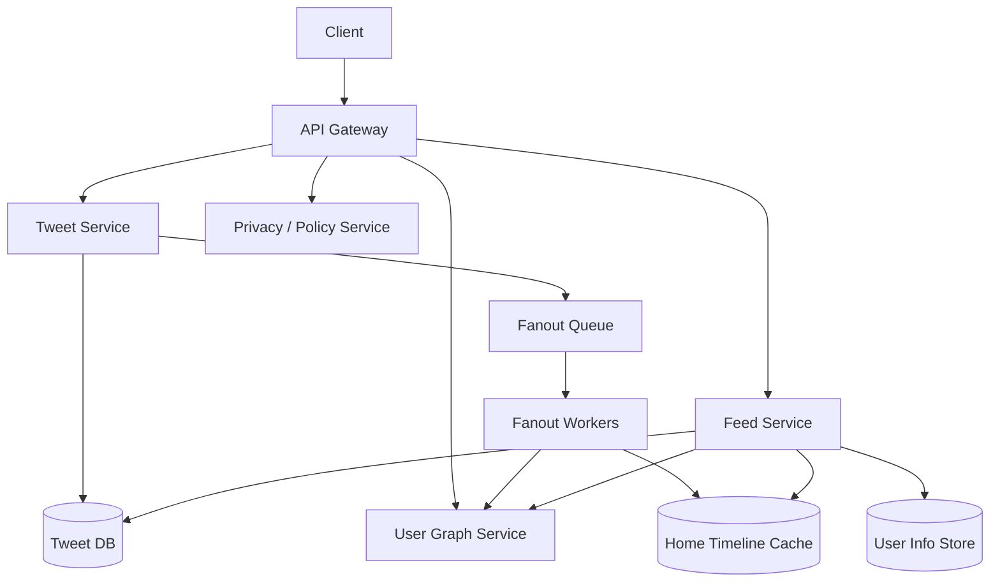

# 设计 News Feed 系统

## 功能需求

- 用户可以发布 tweet/post，并被 followers 在 home feed 里看到。
- 用户可以读取 home timeline，支持 cursor pagination。
- 支持关注/取关后 feed 变化。
- 支持 privacy/security，比如 private account、block、mute、deleted tweet 不应出现在 feed。

## 非功能需求

- 读 feed 低延迟，因为读远多于写。
- 写 tweet 后允许短暂最终一致，不要求所有 follower 立即看到。
- 支持明星用户高 fanout、普通用户低成本分发。
- Feed cache 可丢失，source of truth 必须可重建。

## API 设计

```text
POST /tweets
- request: user_id, content, media_ids, visibility
- response: tweet_id, created_at

GET /users/{user_id}/home_timeline?cursor=&limit=50
- response: tweets[], next_cursor

POST /users/{user_id}/follow
- request: target_user_id

DELETE /users/{user_id}/follow/{target_user_id}

DELETE /tweets/{tweet_id}
```

## 高层架构



## 关键组件

- Tweet Service
  - 负责创建 tweet，写 Tweet DB。
  - 只保证 tweet source of truth 写成功。
  - 写成功后发 fanout event 到 MQ。
  - 注意：不要同步 fanout 给所有 followers，否则明星用户发 tweet 会拖慢写路径。

- Tweet DB / Tweet Info Service
  - 存 tweet source of truth。
  - 可以只把最近一个月热数据存在在线 Tweet Info Service，老数据进 cold storage。
  - 常见 schema：

```text
tweets(
  tweet_id,
  author_id,
  content,
  media_ids,
  visibility,
  created_at,
  deleted_at
)
```

  - 分区可以按 `author_id` 或 `tweet_id`。
  - 如果按作者查最近 tweet 很频繁，`author_id + created_at` 很自然。

- User Graph Service
  - 存 follow graph：谁关注了谁。
  - 读 feed rebuild 时需要查询 user following list。
  - fanout-on-write 时需要查询 author 的 followers。
  - 注意明星用户 follower list 很大，需要分页 fanout。

- Home Timeline Cache
  - 存每个活跃用户的 home timeline。
  - 只保留几百条 tweet id，不存完整 tweet body。
  - 示例：

```text
home_timeline:{user_id} -> [tweet_id1, tweet_id2, ...]
```

  - 只缓存过去 30 天活跃用户。
  - 不活跃用户回归时，从 SQL/Tweet DB + Graph Service rebuild。

- Fanout Workers
  - 消费 tweet-created event。
  - 查询 author followers。
  - 对普通用户，push tweet_id 到 followers 的 timeline cache。
  - 对明星用户，可以不 push 给所有 followers，改成 read time pull。
  - 注意 at-least-once 下要幂等，比如 timeline 中 tweet_id 去重。

- Feed Service
  - 读取 home timeline。
  - 先查 timeline cache，拿 tweet ids。
  - 再批量查 Tweet Info Service 补 tweet body。
  - 读前或读后做 privacy filtering：deleted/private/block/mute。
  - 如果用户不活跃导致 cache miss，则 rebuild timeline。

## 核心流程

- 发 tweet
  - Client 调 `POST /tweets`。
  - Tweet Service 写 Tweet DB。
  - 发布 tweet-created event 到 MQ。
  - Fanout Worker 查询 followers。
  - 普通作者：把 `tweet_id` push 到活跃 followers 的 home timeline cache。
  - 大 V 作者：只写 author timeline，home feed 读取时 pull。

- 读 home feed
  - Feed Service 查 `home_timeline:{user_id}`。
  - 如果命中，取几百条 tweet ids 中的一页。
  - 批量查 Tweet Info Service 获取 tweet 内容。
  - 调 Privacy/Policy 过滤不可见内容。
  - 返回 tweets 和 cursor。

- 不活跃用户回归
  - 如果用户过去 30 天不活跃，不保留 timeline cache。
  - Feed Service 调 User Graph Service 获取 following list。
  - 从 Tweet DB 拉取这些 author 最近一个月 tweets。
  - merge by timestamp/ranking score。
  - 写回 timeline cache。

- 删除 / 隐私变化
  - Tweet DB 标记 deleted 或 visibility changed。
  - 不一定同步删除所有 timeline cache。
  - 读 feed 时做 final visibility check。
  - 异步 worker 可以清理热门缓存。

## 存储选择

- SQL
  - 适合 user metadata、follow relationship 小规模、事务强的场景。
  - ✅ JOIN/事务/一致性强。
  - ❌ 超大 follow graph 和 tweet timeline 扩展困难。

- NoSQL
  - 适合 tweet、timeline、follow edge 的高吞吐读写。
  - ✅ 易水平扩展，按 user_id / tweet_id 分区。
  - ❌ 跨维度查询弱，需要反范式和 derived tables。

- Redis / Memcached
  - 存活跃用户 home timeline。
  - 只存 tweet ids，几百条即可。
  - Cache miss 可以 rebuild。

- Object/Cold Storage
  - 存老 tweet、归档数据、离线 ranking training data。

## 扩展方案

- 小规模：pull model，读 feed 时查 following list，再拉 tweets merge。
- 中规模：push model，发 tweet 后 fanout 到活跃 followers timeline cache。
- 大规模：hybrid model，普通用户 push，大 V pull。
- Cache 只保存活跃用户和最近几百条 tweet ids。
- 老数据从 Tweet DB / cold storage rebuild，不让内存承担完整历史。

## 系统深挖

### 1. SQL vs NoSQL

- 方案 A：SQL
  - 适用场景：早期系统，关系复杂但规模不大。
  - ✅ 优点：事务强，查询灵活，数据一致性好。
  - ❌ 缺点：大规模 timeline、follow graph、fanout 写入很难水平扩展。

- 方案 B：NoSQL
  - 适用场景：高 QPS tweet/feed 系统。
  - ✅ 优点：按 `user_id / tweet_id` 分区，吞吐高，扩展简单。
  - ❌ 缺点：不能依赖复杂 JOIN，需要为查询模式设计表。

- 方案 C：Hybrid
  - 适用场景：生产级 feed。
  - ✅ 优点：User/account 配置可用 SQL，tweet/timeline 用 NoSQL/cache。
  - ❌ 缺点：多套存储带来一致性和运维复杂度。

- 推荐：
  - User metadata 可放 SQL。
  - Tweet、timeline、follow edge 放 NoSQL 或 specialized graph store。
  - 面试里强调：feed 是 read model，不是 source of truth。

### 2. Push vs Pull

- 方案 A：Pull / fanout-on-read
  - 适用场景：用户关注人数少、写多读少、不活跃用户多。
  - ✅ 优点：写 tweet 很便宜；不需要给不活跃用户维护 timeline。
  - ❌ 缺点：读 feed 时要查很多 followees 并 merge，延迟高。

- 方案 B：Push / fanout-on-write
  - 适用场景：普通用户，大部分 author follower 数不大。
  - ✅ 优点：读 feed 很快，直接读 home timeline cache。
  - ❌ 缺点：明星用户发 tweet 写放大巨大。

- 方案 C：Hybrid
  - 适用场景：Twitter/News Feed 这类系统。
  - ✅ 优点：普通用户 push，大 V pull，平衡读写成本。
  - ❌ 缺点：读路径要合并 pushed timeline 和 celebrity pull results。

- 推荐：
  - 默认 hybrid。
  - 普通作者 fanout 到活跃 followers。
  - 大 V 不 fanout，读 feed 时从 author timeline 拉最近 tweets merge。

### 3. Active User Cache 策略

- 方案 A：缓存所有用户 timeline
  - 适用场景：用户量小。
  - ✅ 优点：读路径简单。
  - ❌ 缺点：大量不活跃用户浪费内存。

- 方案 B：只缓存活跃用户
  - 适用场景：大规模系统。
  - ✅ 优点：内存成本可控；命中主要流量。
  - ❌ 缺点：不活跃用户回来时首次读取较慢。

- 方案 C：分层缓存
  - 适用场景：用户活跃度差异大。
  - ✅ 优点：hot users timeline 放内存，warm users 放 SSD/NoSQL。
  - ❌ 缺点：系统复杂，cache consistency 更难。

- 推荐：
  - 只保留过去 30 天活跃用户。
  - 每个 home timeline 只存几百个 tweet ids。
  - 不活跃用户回来时从 Graph Service + Tweet DB rebuild。

### 4. Partition / Replication

- 方案 A：按 `user_id` 分区 timeline
  - 适用场景：home timeline 读写。
  - ✅ 优点：读某个用户 feed 很快；cache/locality 好。
  - ❌ 缺点：超级活跃用户或热门用户可能产生热点。

- 方案 B：按 `tweet_id` / `author_id` 分区 tweets
  - 适用场景：tweet source of truth。
  - ✅ 优点：作者 timeline 查询自然；tweet 写入均匀。
  - ❌ 缺点：读 home feed 需要批量跨分区取 tweet body。

- 方案 C：多副本 + read replica
  - 适用场景：读多写少。
  - ✅ 优点：提升读吞吐和可用性。
  - ❌ 缺点：复制延迟导致读到旧数据。

- 推荐：
  - Home timeline 按 `user_id` 分区。
  - Tweet store 按 `author_id` 或 `tweet_id` 分区。
  - 多 AZ replication，读路径容忍短暂 eventual consistency。

### 5. Cache Invalidation 和 Privacy

- 方案 A：写时清理所有 cache
  - 适用场景：小规模、强隐私要求。
  - ✅ 优点：cache 更干净。
  - ❌ 缺点：删除 tweet、block、private change 可能需要清理海量 timelines。

- 方案 B：读时过滤
  - 适用场景：大规模 feed。
  - ✅ 优点：避免大规模 cache invalidation。
  - ❌ 缺点：读路径多一次 policy check；可能取到的候选 tweets 被过滤后不足一页。

- 方案 C：异步清理 + 读时兜底
  - 适用场景：生产系统。
  - ✅ 优点：最终清理缓存，同时保证读时不会泄露不可见内容。
  - ❌ 缺点：实现复杂，需要 policy version 或 visibility check。

- 推荐：
  - Privacy/security 必须在返回前做 final check。
  - Cache 里的 tweet_id 只是候选集合，不代表一定可见。
  - 删除、block、private change 走异步清理，但读时过滤兜底。

### 6. Follow/Unfollow 后 Timeline 如何处理

- 方案 A：follow 时立即 backfill
  - 适用场景：希望用户马上看到新 followee 的历史内容。
  - ✅ 优点：体验好。
  - ❌ 缺点：follow 大量用户时写放大明显。

- 方案 B：unfollow 时立即删除 timeline 里的历史 tweets
  - 适用场景：强一致体验。
  - ✅ 优点：用户不会再看到 unfollow 对象内容。
  - ❌ 缺点：需要扫描 timeline cache，成本高。

- 方案 C：lazy rebuild / read-time filter
  - 适用场景：大规模系统。
  - ✅ 优点：写路径轻。
  - ❌ 缺点：timeline 里可能有 stale candidate，需要读时过滤。

- 推荐：
  - follow 可异步 backfill 最近少量 tweets。
  - unfollow/block 必须读时过滤，异步清理 cache。
  - 关键安全边界在 Policy check，不在 cache 是否干净。

### 7. Monitoring / Alert

- 方案 A：只看服务 QPS/latency/error
  - 适用场景：基础服务监控。
  - ✅ 优点：容易落地。
  - ❌ 缺点：看不出 feed 质量问题，比如 timeline stale。

- 方案 B：加 pipeline freshness 指标
  - 适用场景：feed fanout 系统。
  - ✅ 优点：能发现 MQ lag、fanout delay、cache rebuild 慢。
  - ❌ 缺点：需要端到端 trace 和业务指标。

- 方案 C：synthetic users / canary feed
  - 适用场景：高可用 feed。
  - ✅ 优点：能检测“发 tweet 后 follower 是否看到”的真实体验。
  - ❌ 缺点：需要维护测试账号和预期结果。

- 推荐监控：
  - Feed read p50/p95/p99 latency。
  - Timeline cache hit rate。
  - Fanout queue lag。
  - Tweet publish to visible latency。
  - Rebuild timeline latency。
  - Privacy filter deny count。
  - Alert：queue lag 暴涨、cache hit rate 下降、feed empty rate 异常、policy service error。

## 面试亮点

- Home timeline cache 是 derived read model，不是 source of truth；丢了可以从 Graph + Tweet DB rebuild。
- Push vs Pull 不要二选一，真实答案通常是 hybrid：普通用户 push，大 V pull。
- 只缓存活跃用户和几百条 tweet ids，是成本和延迟之间的关键平衡。
- Privacy/security 不能依赖 cache invalidation，必须在 read path 做 final visibility check。
- Follow/unfollow、delete、block 都会制造 stale timeline，读时过滤 + 异步清理更可扩展。
- Partition 要围绕查询模式：timeline 按 `user_id`，tweet store 按 `author_id/tweet_id`。
- Monitoring 不能只看系统指标，也要看 feed freshness 和 fanout lag。

## 一句话总结

News Feed 的核心是把 tweet/source graph 和 home timeline read model 分开：普通用户写后 fanout 到活跃用户 timeline cache，大 V 读时 pull，cache 只保存近期候选 tweet ids，最终可见性由 read path policy check 保证。
