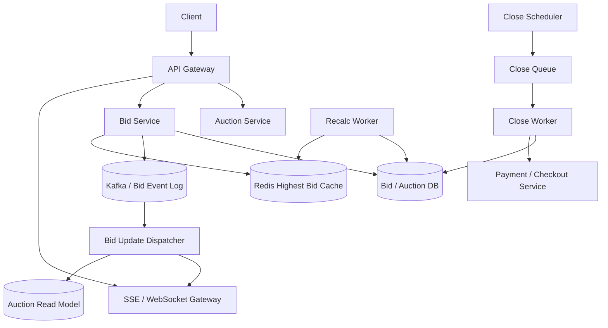

# 设计 Online Auction 系统

## 功能需求

- 用户可以创建 auction，设置起拍价、结束时间、商品信息和卖家信息。
- 用户可以实时出价，并看到当前最高价、剩余时间和竞价状态。
- Auction 结束后确定 winner，并触发 payment / checkout。
- 支持取消出价或最高价撤回后的重新计算最高有效出价。

## 非功能需求

- 出价链路正确性优先，同一 auction 的最高价更新必须有明确顺序。
- 实时更新低延迟，但推送失败后用户必须能通过查询补齐。
- 支持热门 auction 高并发出价和大量旁观用户订阅。
- DB/cache/实时推送允许短暂不一致，但最终 winner 必须来自 source of truth。

## API 设计

```text
POST /auctions
- request: seller_id, item_id, start_price, reserve_price?, start_at, end_at
- response: auction_id, status

POST /auctions/{auction_id}/bids
- request: user_id, amount, idempotency_key
- response: bid_id, status=accepted|rejected, current_highest_bid

DELETE /auctions/{auction_id}/bids/{bid_id}
- request: user_id, reason
- response: status=cancelled|not_allowed

GET /auctions/{auction_id}
- response: auction, current_highest_bid, status, winner?

GET /auctions/{auction_id}/stream
- SSE/WebSocket stream for bid updates

POST /auctions/{auction_id}/close
- internal/manual close, idempotent
```

## 高层架构



## 关键组件

- Auction Service
  - 管理 auction metadata 和状态：scheduled、active、closing、closed、cancelled。
  - 创建 auction 时写 Auction DB，并写 close schedule。
  - 不负责实时出价排序；出价正确性由 Bid Service 保证。

- Bid Service
  - 出价核心路径。
  - 校验 auction 是否 active、用户资格、金额是否高于当前最高价。
  - 对同一 auction 的出价需要串行化或原子条件更新。
  - 使用 `idempotency_key` 防止客户端重试重复出价。
  - 写 bid source of truth，并更新 highest bid cache/read model。

- Bid / Auction DB
  - source of truth。
  - 示例：

```text
auctions(
  auction_id,
  seller_id,
  item_id,
  start_price,
  end_at,
  status,
  current_highest_bid_id,
  current_highest_amount,
  version
)

bids(
  auction_id,
  bid_id,
  user_id,
  amount,
  status: active|cancelled|invalid|winning|lost
  created_at,
  idempotency_key
)
```

  - 同一 auction 的 current_highest 更新用 CAS/version。
  - `bids` 表保留所有出价历史，方便撤回后重算。

- Redis Highest Bid Cache
  - 服务读路径和实时展示的当前最高价。
  - 可以用普通 key 存 current highest，也可以用 sorted set 存 active bids：

```text
auction:{auction_id}:highest -> {bid_id, amount, user_id, version}
auction:{auction_id}:bids_zset -> score=amount, member=bid_id
```

  - Redis 不是最终 winner source；最终结算必须读 DB 或经过 DB reconciliation。
  - 如果最高价撤回，sorted set 可以快速取第二高，但仍需和 DB 状态校验。

- Bid Event Log / Kafka
  - 存 bid accepted/cancelled/highest changed/auction closed events。
  - 用于实时推送、read model、reconciliation。
  - 按 `auction_id` partition，可以保证单 auction 内事件顺序。
  - 事件至少一次投递，消费者必须幂等。

- Dispatcher / Realtime Gateway
  - Dispatcher 消费 bid events，推送到 SSE/WebSocket Gateway。
  - Gateway 维护用户订阅的 auction_id。
  - SSE 适合单向 bid updates；WebSocket 适合双向交互和心跳。
  - 推送不是 source of truth，断线后客户端调用 GET 补齐。

- Close Scheduler / Close Worker
  - 负责 auction 到期关闭。
  - 不能只依赖 TTL 事件做准时关闭。
  - 推荐维护 close task 小表：`PK=time_bucket#shard_id, SK=auction_id`。
  - Close Worker 幂等执行 `active -> closing -> closed`，确定 winner 后触发 payment。

- Payment / Checkout Service
  - Auction close 后向 winner 创建 payment intent / checkout session。
  - 支付成功后订单完成。
  - 支付失败或 winner 超时不付时，按业务规则给第二高价用户 second-chance offer，或标记交易失败。

## 核心流程

- 用户出价
  - Client 调 `POST /auctions/{id}/bids`。
  - Bid Service 校验 auction active 和 idempotency。
  - 读取当前最高价 cache，并用 DB 条件更新做最终判断。
  - 如果新价格有效，写 bids row，并更新 auction current_highest。
  - 写 Kafka bid accepted/highest changed event。
  - Dispatcher 推送给订阅用户。

- 实时更新
  - 用户打开 auction 页面后建立 SSE/WebSocket。
  - Stream Gateway 注册 `user_id -> connection` 和 `auction_id -> connections`。
  - Dispatcher 消费 Kafka events，推送给相关连接。
  - 客户端收到事件后更新 UI。
  - 断线重连时先 GET auction current state，再继续订阅 stream。

- 最高价撤回
  - 用户或风控取消当前最高 bid。
  - Bid Service 将 bid 状态改为 `cancelled`。
  - Recalc Worker 查询该 auction 的 active bids，找到第二高价。
  - 更新 auctions.current_highest 和 Redis cache。
  - 发布 highest changed event。
  - 如果 auction 已 close，需要根据规则重新处理 winner/payment。

- Auction 结束
  - Close Scheduler 将 due auction 放入 Close Queue。
  - Close Worker 用 CAS 将 auction 从 active 改为 closing。
  - 从 DB 读取最高 active bid，确认 winner。
  - 写 auction closed/winner。
  - 触发 Payment Service。
  - 发布 auction closed event 给客户端。

- Payment 触发
  - Close Worker 不直接扣款，调用 Payment Service 创建 payment intent。
  - Payment callback 更新 order/payment 状态。
  - 支付失败进入 retry、second chance 或 cancellation workflow。

## 存储选择

- DynamoDB
  - 适合 `auction_id` 分区下高吞吐写和 conditional update。
  - `PK=auction_id, SK=bid_id/created_at` 存 bids。
  - Auction current state 可作为单 item，用 conditional update 控制版本。
  - DynamoDB TTL 删除可以出现在 Streams 里，但 TTL 删除不保证准时，所以不能作为 auction close 的唯一 scheduler。

- PostgreSQL/MySQL
  - 适合强事务、复杂查询和审计。
  - 可以用 row lock/CAS 管同一 auction 的 current_highest。
  - 热门 auction 可能出现单行 write contention。

- Redis
  - 适合 highest bid cache、sorted set、实时读模型、连接状态。
  - 不作为最终事实源。
  - ZSET 可辅助撤回最高价后找第二高价，但需要 DB 校验。

- Kafka
  - bid events source for push/read model/reconciliation。
  - 按 `auction_id` partition 保证单 auction 顺序。

## 扩展方案

- 普通 auction：Bid Service 直接 DB conditional update + cache update。
- 热门 auction：按 `auction_id` partition 到单 writer actor/queue，串行处理该 auction 出价。
- Realtime fanout 和 bid write 分离，推送慢不影响出价写入。
- Auction close 使用 time bucket 小表/queue，不扫 auction 大表。
- Read model/cache 可从 Kafka 重建。
- 对超热门 auction 可限制出价频率、开启 waiting room 或只接收高于当前价一定幅度的 bid。

## 系统深挖

### 1. 实时更新：Polling vs SSE vs WebSocket

- 方案 A：Polling
  - 适用场景：低热度 auction，用户不多。
  - ✅ 优点：实现简单，HTTP 兼容好。
  - ❌ 缺点：延迟取决于轮询间隔；热门 auction 会产生大量无效读。

- 方案 B：SSE
  - 适用场景：服务端向客户端单向推送 bid updates。
  - ✅ 优点：比 WebSocket 简单；适合价格变化、auction closed 等状态流。
  - ❌ 缺点：单向；长连接占资源；浏览器连接数限制要考虑。

- 方案 C：WebSocket
  - 适用场景：需要双向互动、心跳、实时房间管理。
  - ✅ 优点：双向低延迟，适合高互动 auction 页面。
  - ❌ 缺点：连接管理、扩容和故障恢复更复杂。

- 推荐：
  - 实时价格更新优先 SSE。
  - 如果还要聊天室、实时出价确认、复杂互动，可用 WebSocket。
  - 无论哪种，最终状态都能通过 GET 查询补齐。

### 2. Redis Pub/Sub vs Dispatcher

- 方案 A：Redis Pub/Sub 直接广播
  - 适用场景：小规模实时推送。
  - ✅ 优点：轻量、低延迟、实现快。
  - ❌ 缺点：不持久；订阅者断开就丢消息；Redis pub/sub 本身容易成为单点或热点。

- 方案 B：Kafka + Dispatcher
  - 适用场景：生产级 bid updates。
  - ✅ 优点：事件持久化、可 replay、消费者可扩展；Dispatcher 故障后可从 offset 恢复。
  - ❌ 缺点：链路更长，延迟略高，运维复杂。

- 方案 C：Hybrid
  - 适用场景：低延迟推送 + 可靠恢复。
  - ✅ 优点：Kafka 做 durable log，Redis/pubsub 或内存 fanout 做低延迟 delivery。
  - ❌ 缺点：两套通道可能短暂不一致。

- 推荐：
  - Bid events 先写 Kafka。
  - Dispatcher 消费 Kafka 后推送 SSE/WebSocket。
  - Redis Pub/Sub 可作为 Gateway 内部 fanout 优化，但不是可靠事件源。

### 3. 出价正确性：DB CAS vs Redis ZSET vs 单 Auction Writer

- 方案 A：DB conditional update / CAS
  - 适用场景：大多数 auction。
  - ✅ 优点：source of truth 内保证最高价更新正确。
  - ❌ 缺点：热门 auction 会对同一 row/item 产生写竞争。

- 方案 B：Redis sorted set
  - 适用场景：快速读取 top bid、撤回后找第二高价。
  - ✅ 优点：`ZREVRANGE` 很快，适合读和候选计算。
  - ❌ 缺点：Redis 不是最终账本；和 DB 同步复杂。

- 方案 C：单 auction writer / actor
  - 适用场景：超级热门 auction。
  - ✅ 优点：同一 auction 的出价串行处理，避免 DB 冲突。
  - ❌ 缺点：单 auction 吞吐受单 worker 限制；worker failover 要处理。

- 推荐：
  - 普通 auction 用 DB CAS。
  - Redis ZSET 作为 read/cache 和撤回辅助。
  - 超热门 auction 用 `auction_id` 分区队列 + single writer。

### 4. 最高价撤回怎么处理

- 方案 A：每次撤回后扫描 DB 找第二高价
  - 适用场景：bid 数量不大。
  - ✅ 优点：结果可信，直接来自 source of truth。
  - ❌ 缺点：热门 auction bid 很多时查询成本高。

- 方案 B：Redis sorted set 找第二高价
  - 适用场景：需要快速恢复 current_highest。
  - ✅ 优点：撤回后 `ZREM`，再 `ZREVRANGE` 取 top。
  - ❌ 缺点：Redis 可能和 DB 不一致，取到的 bid 需要回 DB 校验 active。

- 方案 C：异步 Recalc Worker
  - 适用场景：允许短暂显示 recalculating。
  - ✅ 优点：不阻塞撤回请求；后台可分页扫描/校验。
  - ❌ 缺点：用户短时间看到状态滞后。

- 推荐：
  - 撤回 current highest 后进入 `highest_recalculating` 或直接异步更新。
  - Redis ZSET 快速给候选第二高。
  - Recalc Worker 以 DB active bids 为准更新 final highest。

### 5. DB 和 Cache Consistency

- 方案 A：Write-through cache
  - 适用场景：读多写少、写路径能承受 cache 写。
  - ✅ 优点：写 DB 时同步更新 cache，读路径简单。
  - ❌ 缺点：不能真正保证强一致；DB 写成功 cache 写失败、并发乱序都会导致 cache stale；写压力大。

- 方案 B：Write-behind cache
  - 适用场景：写多读少，允许短暂不一致。
  - ✅ 优点：写延迟低，吞吐高。
  - ❌ 缺点：cache 崩溃可能丢写；auction 这种正确性核心不适合只靠 write-behind。

- 方案 C：Cache-aside
  - 适用场景：读多写少，cache 可丢。
  - ✅ 优点：简单，cache miss 回源 DB。
  - ❌ 缺点：高并发下 cache invalidation 和 stale read 需要处理。

- 方案 D：先写 Kafka，再由 worker 更新 DB 和 cache
  - 适用场景：事件驱动、允许更新延迟。
  - ✅ 优点：Kafka 是统一顺序日志，DB/cache 都从日志派生。
  - ❌ 缺点：用户出价后看到结果有延迟；同步拒绝低价 bid 更难。

- 方案 E：本地写 log，然后 update cache 和 MQ
  - 适用场景：需要低延迟且可恢复的复杂系统。
  - ✅ 优点：本地日志可用于恢复 cache/MQ 更新失败。
  - ❌ 缺点：实现复杂，接近自建 WAL/outbox。

- 推荐：
  - Correctness：先写 DB source of truth，成功后写 Kafka/outbox。
  - Cache：由事件更新，带 version，旧事件不能覆盖新值。
  - Read：cache miss/stale 时回源 DB。
  - 热门 auction 若 cache 准确性极重要，可用 single writer 同时顺序更新 DB、cache、event log。

### 6. 触发 Payment：同步触发 vs Close Worker

- 方案 A：auction end 时同步触发 payment
  - 适用场景：小规模。
  - ✅ 优点：流程简单。
  - ❌ 缺点：payment 慢或失败会阻塞 auction close。

- 方案 B：Close Worker 异步触发 payment
  - 适用场景：生产系统。
  - ✅ 优点：auction close 和 payment 解耦；可重试、可恢复。
  - ❌ 缺点：需要状态机表达 payment_pending。

- 方案 C：用户主动 checkout
  - 适用场景：某些拍卖平台。
  - ✅ 优点：不会自动扣款，用户体验清晰。
  - ❌ 缺点：winner 不付款风险高，需要超时和 second chance。

- 推荐：
  - Auction close 后写 winner 和 payment task。
  - Payment Service 创建 payment intent 或 checkout session。
  - 失败/超时后按业务处理第二高价或取消交易。

### 7. Auction Close Scheduler 和 TTL

- 方案 A：依赖 DB TTL 触发 close
  - 适用场景：不适合准时关闭。
  - ✅ 优点：配置简单。
  - ❌ 缺点：TTL 删除不是准时调度，可能延迟；不应作为唯一 close 机制。

- 方案 B：定期扫大表
  - 适用场景：auction 很少。
  - ✅ 优点：实现简单。
  - ❌ 缺点：规模大时扫描成本高。

- 方案 C：time bucket 小表 + close queue
  - 适用场景：大规模 auction。
  - ✅ 优点：只扫即将结束的 auctions；可按 shard 并发。
  - ❌ 缺点：要维护 task table 和修复漏任务。

- 推荐：
  - `close_tasks(PK=end_time_bucket#shard_id, SK=auction_id)`。
  - Close Scheduler 每分钟扫描 due buckets 放入 queue。
  - DynamoDB TTL Streams 可用于清理/补偿，但不是精确 scheduler。

### 8. Fault Tolerance

- 方案 A：Pub/Sub 作为唯一事件源
  - 适用场景：不适合关键 bid updates。
  - ✅ 优点：低延迟。
  - ❌ 缺点：pub/sub 挂了或订阅断开会丢事件。

- 方案 B：Durable event log
  - 适用场景：auction bid/order 系统。
  - ✅ 优点：Kafka 可 replay，consumer failover 后从 offset 继续。
  - ❌ 缺点：运维成本更高。

- 方案 C：DB outbox
  - 适用场景：需要保证 DB 状态变更一定产生事件。
  - ✅ 优点：DB 写和 outbox 写在同一事务，避免漏事件。
  - ❌ 缺点：需要 outbox relay 和幂等 consumer。

- 推荐：
  - Bid DB 更新和 outbox 同事务。
  - Outbox relay 写 Kafka。
  - Dispatcher、read model、cache 都可以从 Kafka/outbox replay 恢复。

## 面试亮点

- Online Auction 的 correctness boundary 是 bid source of truth 和 auction 状态机，不是 Redis Pub/Sub 或推送层。
- 实时更新可以用 SSE/WebSocket，但推送只负责体验，断线后必须能 GET 补齐。
- Redis ZSET 很适合找最高价/第二高价候选，但撤回最高价后仍要用 DB active bids 校验。
- DB/cache consistency 不能只说 write-through；要说明失败、乱序、stale 的处理，以及 versioned cache update。
- 热门 auction 的瓶颈是单个 auction 的写竞争，不是平均 QPS；可用 `auction_id` partition single writer。
- Auction close 不能依赖 TTL 准时触发；要用 time bucket close task，小表扫描 + queue。
- Payment trigger 要和 auction close 解耦，winner 确定后异步创建 payment intent，并处理失败/second chance。
- Durable log/outbox 是恢复实时推送、cache、read model 的关键，Redis Pub/Sub 不能作为唯一事件源。

## 一句话总结

Online Auction 系统的核心是：用 DB/CAS 或单 auction writer 保证出价顺序和最高价正确，用 Redis cache/ZSET 加速读和撤回重算，用 Kafka/outbox 驱动实时推送、read model 和恢复，用 time bucket scheduler 准时关闭 auction 并异步触发 payment，最终 winner 始终以 source of truth 为准。
