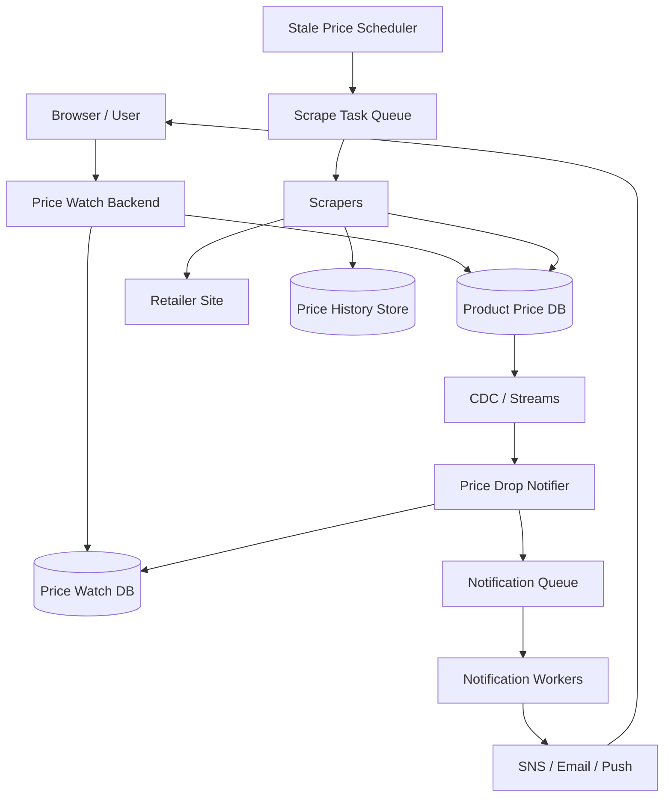

# 设计 Price Drop Tracker 系统

## 功能需求

- 用户可以订阅某个商品的降价提醒，并设置 price threshold。
- 系统定期抓取商品价格，检测 stale price 并更新当前价格。
- 当商品当前价格低于用户阈值时，发送浏览器、Email、SNS 等提醒。
- 支持价格历史查询、重复提醒控制和订阅管理。

## 非功能需求

- 抓价链路高吞吐、可重试、可限流，不能把目标网站打挂。
- 价格提醒允许分钟级延迟，但不能长期漏发。
- 通知链路需要幂等，避免同一次降价给同一用户重复通知。
- 系统要能支撑大量商品和订阅，避免全表扫描和大 query。

## API 设计

```text
POST /price-watches
- request: user_id, product_url | product_id, price_threshold, channels[], idempotency_key
- response: watch_id, product_id, status=active

GET /price-watches?user_id=&cursor=
- response: watches[], next_cursor

DELETE /price-watches/{watch_id}
- response: status=deleted

GET /products/{product_id}/price
- response: current_price, last_scraped_at, status

GET /products/{product_id}/price-history?from=&to=&granularity=
- response: points[]
```

## 高层架构



## 关键组件

- Price Watch Backend
  - 负责用户订阅、取消订阅、查询 watch list。
  - 如果用户提交的是 URL，先做 URL normalization 和 product matching。
  - 写 Price Watch DB，存 `product_id + user_id + threshold`。
  - 使用 `idempotency_key` 防止用户重复点击创建多个 watch。

- Product Price DB
  - 存商品当前价格、抓取状态、下次抓取时间。
  - 示例：

```text
product_price(
  product_id,
  retailer,
  normalized_url,
  current_price,
  previous_price,
  last_scraped_at,
  next_scrape_at,
  scrape_status: pending|scraped|failed|blocked,
  version,
  updated_at
)
```

  - `product_id` 可以由 URL canonicalization 后生成，也可以由 routing service 分配 UUID。
  - 当前价格是 serving state，不要把完整 price history 都塞在这一行。

- Price Watch DB
  - 存用户对商品的订阅和阈值。
  - 核心查询是：某个 `product_id` 当前价格变了，要找到 threshold 高于当前价格的 users。

```text
price_watch(
  product_id,
  price_threshold,
  user_id,
  watch_id,
  channels,
  status,
  last_notified_price,
  last_notified_at
)
```

  - DynamoDB 可以用 `PK=product_id, SK=price_threshold#user_id`。
  - 当价格为 $150 时，查 `product_id = X AND price_threshold >= 150`。
  - 如果还要按用户查 watch list，需要 GSI：`user_id, created_at/watch_id`。

- Stale Price Scheduler
  - 定期发现需要重新抓取的商品。
  - 避免全表大 query，推荐维护 due task 小表或按 `next_scrape_bucket + shard_id` 分区。
  - 只负责把 scrape task 放入 queue，不直接抓网页。
  - 注意目标网站 robots、rate limit 和失败 backoff。

- Scrapers
  - 消费 scrape task，抓取页面并解析价格。
  - 支持重试、代理池、限速、captcha/blocked 标记。
  - 抓取成功后更新 Product Price DB 和 Price History Store。
  - 更新价格时用 conditional update/version，避免旧抓取结果覆盖新价格。

- CDC / Streams
  - 当 Product Price DB 价格变化时触发 notifier。
  - MySQL/PostgreSQL 可以用 trigger 或 Debezium 监听 WAL/binlog。
  - DynamoDB 可以用 DynamoDB Streams。
  - 注意：CDC 通常至少一次投递，Notifier 必须幂等。

- Price Drop Notifier
  - 收到 product price changed event。
  - 查询 Price Watch DB：找 threshold >= current_price 的 active watches。
  - 做去重和 cooldown，比如同一用户同一商品同一价格只通知一次。
  - 把通知任务写入 Notification Queue。

- Notification Workers
  - 发送浏览器 push、Email、SNS、短信。
  - 失败重试，超过次数进 DLQ。
  - 发送记录写 notification log，避免重复发送。

- Price History Store
  - 存每次有效价格变化或每次抓取 snapshot。
  - 可以用于价格趋势图、最低价、历史高低点、debug。
  - 历史数据和当前价格分开，避免当前价格读写路径变重。

## 核心流程

- 用户订阅降价提醒
  - Browser 调 `POST /price-watches`，带 URL/product_id 和 threshold。
  - Backend canonicalize URL，得到 `product_id`。
  - 写 Price Watch DB：`product_id + threshold + user_id`。
  - 如果 Product Price DB 没有该商品，创建 product record，设置 `next_scrape_at=now`。
  - 返回 watch_id。

- 定期抓取价格
  - Scheduler 扫描 due task 表或 `next_scrape_bucket`。
  - 把 product_id 放入 Scrape Task Queue。
  - Scraper 抓取页面，解析价格。
  - 更新 Product Price DB：`previous_price = old current_price, current_price = new_price`。
  - 写 Price History Store。
  - 重新计算 `next_scrape_at`，热门商品更频繁，冷门商品更低频。

- 触发降价通知
  - Product Price DB 价格变化产生 CDC event。
  - Notifier 消费 event，判断 `new_price < old_price`。
  - 查询 Price Watch DB，找到 `price_threshold >= new_price` 的 watches。
  - 过滤已通知过相同价格/相同版本的 watch。
  - 写 Notification Queue。
  - Workers 发送 SNS/Email/Push。

- 失败和补偿
  - Scraper 失败时增加 retry_count 和 backoff。
  - Notifier 失败可从 CDC/Kafka replay。
  - 周期性 reconciliation job 扫描最近价格变化，确认是否有漏通知。
  - Notification log 去重，避免 replay 造成重复通知。

## 存储选择

- Product Price DB
  - DynamoDB/Cassandra：适合大规模 product_id point lookup 和 TTL/status 字段。
  - PostgreSQL/MySQL：适合中小规模、事务和 trigger 简单。
  - 关键是避免按 `next_scrape_at` 全局扫描热点。

- Price Watch DB
  - DynamoDB/Cassandra 适合 `product_id + price_threshold` 查询。
  - 需要同时支持用户维度查询，所以要 GSI 或反向表。
  - 注意 threshold range query 的分区热点：热门商品可能有大量 watchers。

- Price History Store
  - Time-series/OLAP：ClickHouse、Druid、Timestream。
  - 或 DynamoDB/Cassandra：`PK=product_id, SK=timestamp`。
  - 历史数据可 downsample，比如保留每日最低价。

- Queue / Stream
  - SQS/Kafka 用于 scrape task、notification task。
  - DynamoDB Streams / Debezium 用于价格变化 CDC。
  - DLQ 存持续失败任务。

## 扩展方案

- Scheduler 不扫大表，维护 due task 小表或 time bucket 分片。
- Scraper worker pool 按 retailer/domain 限流，避免打爆目标网站。
- Product Price DB 按 `product_id` hash 分片。
- Price Watch DB 对热门商品可按 threshold bucket 或 user hash 做 sub-shard。
- 通知链路异步化，SNS/Email/Push worker 可独立扩展。
- 价格历史和当前价格分离，历史查询不影响当前价格更新。

## 系统深挖

### 1. Scheduler：扫大表 vs due task 小表 vs 直接入队

- 方案 A：定期扫 Product Price DB 大表
  - 适用场景：商品量小。
  - ✅ 优点：实现简单。
  - ❌ 缺点：商品量大时非常贵；按 GSI shard 扫描也容易产生热点。

- 方案 B：维护 due task 小表
  - 适用场景：生产系统。
  - ✅ 优点：只扫描即将执行的任务；可按 `time_bucket + shard_id` 分片。
  - ❌ 缺点：Product Price DB 和 task table 有一致性问题，需要重建/修复任务。

- 方案 C：生成任务后直接放 queue
  - 适用场景：短期内要执行的 scrape task。
  - ✅ 优点：worker 直接消费，延迟低。
  - ❌ 缺点：如果不落表，queue 消息丢失或过期后任务难以恢复。

- 推荐：
  - Product Price DB 存 `next_scrape_at`。
  - 另有 due task table：`PK=time_bucket#shard_id, SK=product_id`。
  - Scheduler 扫 due task 小表后放 queue；reconciliation job 从 Product Price DB 修复漏任务。

### 2. Stale Price Scanner 的职责

- 方案 A：Scanner 直接抓网页
  - 适用场景：小规模。
  - ✅ 优点：少一个组件。
  - ❌ 缺点：调度和抓取耦合，慢网站会拖慢扫描。

- 方案 B：Scanner 只产生 scrape task
  - 适用场景：高规模。
  - ✅ 优点：调度和执行分离；scraper worker 可独立扩展。
  - ❌ 缺点：需要任务状态和重试。

- 方案 C：优先级调度
  - 适用场景：热门商品、临近用户阈值的商品需要更频繁抓取。
  - ✅ 优点：资源用在更有价值的商品上。
  - ❌ 缺点：调度策略复杂。

- 推荐：
  - Stale Price Scanner 只决定哪些 product 需要重新抓取。
  - Scraper 执行抓取。
  - next_scrape_at 可根据 watchers 数量、价格波动、失败率动态调整。

### 3. 价格变化触发：DB Trigger vs CDC vs Application Event

- 方案 A：DB trigger
  - 适用场景：MySQL/PostgreSQL，中小规模，逻辑简单。
  - ✅ 优点：价格更新和触发逻辑靠近 DB。
  - ❌ 缺点：复杂逻辑放 DB 里难维护；NoSQL 通常不支持传统 trigger。

- 方案 B：Debezium / CDC
  - 适用场景：MySQL/PostgreSQL 等 WAL/binlog 可订阅的数据库。
  - ✅ 优点：无需侵入业务代码；可过滤关心的 price update 事件并发到 Kafka。
  - ❌ 缺点：CDC 有延迟；schema 变化和 connector 运维要处理。

- 方案 C：Application writes event
  - 适用场景：Scraper 由应用统一写价格。
  - ✅ 优点：逻辑清晰，事件 payload 可控。
  - ❌ 缺点：DB 更新成功但事件发送失败会漏，需要 outbox。

- 推荐：
  - 如果 SQL DB，用 outbox 或 Debezium。
  - 如果 DynamoDB，用 DynamoDB Streams。
  - 不要依赖“消费者自己比较新旧值”作为唯一触发，最好价格更新事件带 old/new price 和 version。

### 4. DynamoDB LSI / GSI 怎么理解

- 方案 A：Local Secondary Index
  - 适用场景：同一个 partition key 下，用不同 sort key 查询。
  - ✅ 优点：和主表共享 partition key；适合 `PK=product_id`，在同 product 内按 threshold/timestamp 排序。
  - ❌ 缺点：LSI 必须建表时创建；不能换 partition key；单 partition 仍可能热点。

- 方案 B：Global Secondary Index
  - 适用场景：需要不同 partition key 的查询。
  - ✅ 优点：例如主表按 `product_id`，GSI 按 `user_id` 查询用户 watch list。
  - ❌ 缺点：GSI 异步更新，可能短暂 eventual consistency；额外写放大和成本。

- 方案 C：反向表
  - 适用场景：查询模式非常重要，需要更可控。
  - ✅ 优点：可以分别优化 product->watchers 和 user->watches。
  - ❌ 缺点：双写一致性和修复更复杂。

- 推荐：
  - Price Watch 主表：`PK=product_id, SK=price_threshold#user_id`。
  - 用户查询用 GSI 或单独 `user_watch` 表：`PK=user_id, SK=watch_id`。
  - 热门 product partition 要考虑 threshold bucket / sub-shard。

### 5. Price History Table 怎么存

- 方案 A：只存当前价格
  - 适用场景：只做提醒，不展示历史。
  - ✅ 优点：简单，存储小。
  - ❌ 缺点：无法展示趋势，也无法 debug 某次通知为什么触发。

- 方案 B：每次 scrape 都存一条 history
  - 适用场景：需要完整审计。
  - ✅ 优点：可复盘所有抓取结果。
  - ❌ 缺点：数据量大，重复价格多。

- 方案 C：只存价格变化 + 定期 snapshot
  - 适用场景：多数 price tracker。
  - ✅ 优点：存储成本低，仍能画趋势和 debug。
  - ❌ 缺点：无法知道每次抓取是否都成功看到相同价格。

- 推荐：
  - `price_history(PK=product_id, SK=timestamp)`。
  - 存 price change event + 每日/每小时 snapshot。
  - 长期历史可 downsample 为 daily min/avg/max。

### 6. 查询 watchers：product_id + threshold 的热点问题

- 方案 A：按 product_id 查询所有 watchers，在应用层过滤 threshold
  - 适用场景：watcher 很少的商品。
  - ✅ 优点：实现简单。
  - ❌ 缺点：热门商品 watcher 可能非常多，扫描浪费。

- 方案 B：Sort key 用 price_threshold 做 range query
  - 适用场景：需要快速找到 threshold >= current_price 的用户。
  - ✅ 优点：只读可能触发通知的 watchers。
  - ❌ 缺点：热门商品仍可能单 partition 热点。

- 方案 C：Threshold bucket + sub-shard
  - 适用场景：超级热门商品。
  - ✅ 优点：分散热门 product 的读写压力。
  - ❌ 缺点：查询要 fanout 多个 bucket/shard，合并结果。

- 推荐：
  - 默认 `product_id + price_threshold` range query。
  - 热门商品按 `product_id#bucket#shard` 拆分。
  - Notifier 分页查询，避免一次拉出百万用户。

### 7. 通知幂等和重复提醒

- 方案 A：每次价格低于 threshold 都发通知
  - 适用场景：不推荐。
  - ✅ 优点：逻辑简单。
  - ❌ 缺点：同一价格多次 scrape 会重复骚扰用户。

- 方案 B：记录 last_notified_price/version
  - 适用场景：常规通知。
  - ✅ 优点：同一 price/version 不重复通知。
  - ❌ 缺点：价格降到同一价格但隔很久，是否再提醒要产品定义。

- 方案 C：Notification dedup table
  - 适用场景：CDC 至少一次、worker 重试。
  - ✅ 优点：强幂等，避免 replay 重复发送。
  - ❌ 缺点：多一张表和 TTL 清理。

- 推荐：
  - dedup key：`watch_id + product_price_version`。
  - `last_notified_price/at` 做 cooldown。
  - Notification log 设置 TTL，保留近期去重记录。

### 8. TTL 和过期事件

- 方案 A：DynamoDB TTL + Streams
  - 适用场景：DynamoDB 存任务或通知去重记录。
  - ✅ 优点：TTL 自动过期；Streams 可以捕获过期删除事件做后续处理。
  - ❌ 缺点：TTL 删除不是准实时，延迟可能到小时级，不能做精确 scheduler。

- 方案 B：Cassandra TTL
  - 适用场景：自动清理过期记录。
  - ✅ 优点：写入时设置 TTL 简单。
  - ❌ 缺点：通常不能可靠捕获“过期事件”；tombstone 多了会影响性能。

- 方案 C：显式 expiration table
  - 适用场景：需要准时执行任务。
  - ✅ 优点：可控，可扫描 due tasks。
  - ❌ 缺点：需要自己管理状态和清理。

- 推荐：
  - TTL 用于清理 notification dedup、过期临时记录。
  - Scheduler 不依赖 TTL 事件触发。
  - 需要准时抓取时用 due task table / queue。

## 面试亮点

- Product Price DB 存当前价格和抓取状态，Price History 单独存，不要把历史塞进当前价格行。
- Stale Price Scanner 只负责发现该抓的 product，不负责真正抓取；抓取由 scraper worker pool 执行。
- Scheduler 不应该扫大表，应该维护 `time_bucket + shard_id` 的 due task 小表，并用 reconciliation 修复漏任务。
- Price drop notification 最好由 price changed event 触发，SQL 可用 outbox/Debezium，DynamoDB 可用 Streams。
- DynamoDB LSI 是同 partition key 下换 sort key；GSI 是换 partition key，比如按 user_id 查 watch list。
- 查询订阅者要围绕 `product_id + price_threshold` 建模，但热门 product 要 sub-shard。
- CDC/queue 都是至少一次，通知必须用 `watch_id + price_version` 做幂等去重。
- TTL 适合清理，不适合精确调度；DynamoDB TTL Streams 能捕获过期删除，但延迟不可控。

## 一句话总结

Price Drop Tracker 的核心是：用 scheduler 找出 stale products 并投递抓取任务，scraper 更新 Product Price DB 和 Price History，价格变化通过 CDC/Streams 触发 Notifier，Notifier 按 `product_id + threshold` 找到订阅用户并通过幂等通知链路发送降价提醒；当前价格、订阅索引、历史数据和通知去重要分层设计。
