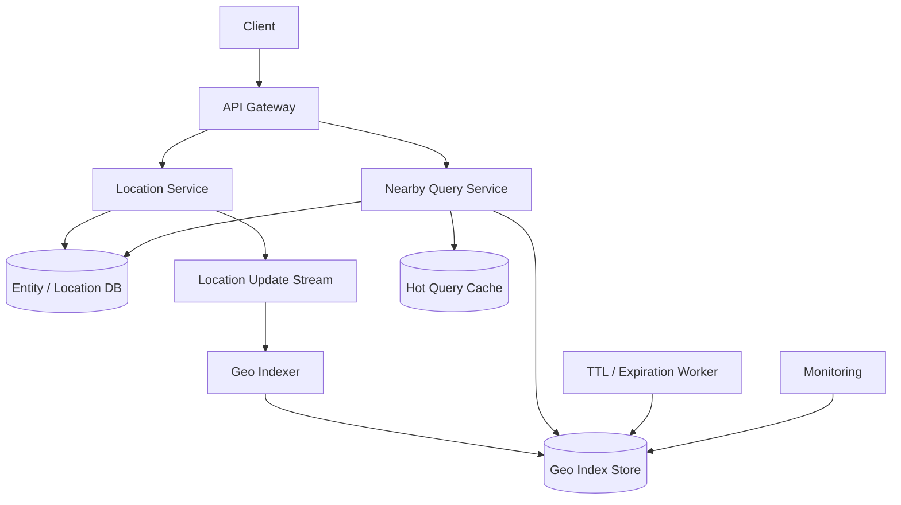

# 设计 Proximity / Nearby Search 系统

## 功能需求

- 用户给定当前位置，查询附近 POI / 店铺 / 司机 / 资源。
- 支持按半径、类别、营业状态、评分等条件过滤。
- 支持动态位置更新，例如移动中的司机或配送员。
- 支持不足结果时扩大搜索范围，并按距离排序返回。

## 非功能需求

- nearby query 低延迟，通常目标是几十毫秒到一两百毫秒。
- 支持高频位置更新，写入不能拖垮地理索引。
- 查询结果允许短暂 stale，但不能返回明显过期或不可用的资源。
- 系统要能处理城市中心热点和郊区稀疏区域的密度差异。

## API 设计

```text
POST /locations/{entity_id}
- request: lat, lng, entity_type, status, updated_at
- response: success

GET /nearby?lat=&lng=&radius_m=&type=&limit=50
- response: entities[], next_radius?, next_cursor?

GET /entities/{entity_id}
- response: profile, latest_location, status

DELETE /locations/{entity_id}
- response: success

POST /nearby/batch
- request: queries[{lat,lng,radius_m,type}]
- response: results[]
```

## 高层架构



## 关键组件

- Location Service
  - 接收实体位置更新，例如司机、店铺、设备。
  - 对每个 `entity_id` 只保留最新位置和状态。
  - 写入 source DB 后异步更新 geo index。
  - 对高频移动实体，需要忽略太频繁或变化太小的更新。

- Nearby Query Service
  - 根据用户位置计算候选 geo cells。
  - 查询当前 cell + neighbor cells。
  - 如果结果不足，扩大 radius 或降低 geohash precision。
  - 对候选结果做精确距离计算和业务过滤。
  - 注意：geo index 只负责找候选，最终距离和可用性要二次校验。

- Geo Index Store
  - 存地理索引到实体 ID 的映射。
  - 可以用 GeoHash、Quadtree、H3/S2 cell id。
  - 示例：

```text
geo_index(
  cell_id,
  entity_type,
  entity_id,
  lat,
  lng,
  status,
  updated_at,
  ttl
)
```

  - 对移动实体要支持 update/delete old cell。
  - 对静态 POI 可以离线构建索引。

- Entity / Location DB
  - source of truth。
  - 存 entity profile、最新 lat/lng、状态、版本号。
  - Geo index 是 derived store，丢了可以重建。
  - 查询结果返回前应从 source DB 或 cache 批量补详情。

- Location Update Stream / Indexer
  - 对高频位置更新做异步处理。
  - Indexer 负责从旧 cell 移除实体并写入新 cell。
  - 使用版本号或 timestamp，避免旧位置覆盖新位置。
  - 对移动实体可以加 TTL，过期自动不再返回。

- TTL / Expiration Worker
  - 清理长时间未更新的位置。
  - 对司机这类实时实体，超过例如 30-60 秒未更新就不应进入 nearby result。
  - 可以写入时带 TTL，也可以定期扫描过期数据。

- Hot Query Cache
  - 对热门区域、热门类别的查询缓存短时间结果。
  - 适合静态店铺/POI，不适合高频移动司机。
  - Cache 中的结果仍需做 availability/TTL 过滤。

## 核心流程

- 位置更新
  - Client / driver app 上报 `lat/lng/status/updated_at`。
  - Location Service 校验 entity 权限和 timestamp。
  - 写 source DB 的 latest location。
  - 写 location update stream。
  - Indexer 计算新 cell，删除旧 cell entry，写入新 cell entry。
  - 如果位置变化很小，可以只更新 timestamp，不移动 cell。

- Nearby 查询
  - Query Service 根据 lat/lng 和 radius 计算当前 cell。
  - 查询当前 cell 和邻居 cells。
  - 对候选实体做 haversine / spherical distance 精确计算。
  - 按距离、状态、业务规则过滤和排序。
  - 如果结果不足，增加 search radius 或降低 geohash precision。
  - 返回 top N 和可选 next radius / cursor。

- 边界处理
  - 用户可能靠近 cell 边界，最近实体在隔壁 cell。
  - Query Service 必须查 current cell + neighboring cells。
  - GeoHash 会有 “很近但 prefix 不同” 的情况，不能只查 shared prefix。
  - 如果相邻 cells 仍不足，逐步扩大 radius。

- 移动实体过期
  - Query 时过滤 `updated_at < now - ttl` 的实体。
  - Cleaner 定期清理 geo index 中过期 entry。
  - 如果旧位置更新晚到，用版本号/timestamp 丢弃。

## 存储选择

- Redis GEO
  - 本质是 sorted set 操作，支持 `GEOADD` / `GEOSEARCH`。
  - 适合中小规模、读多写少或简单 nearby。
  - 对高频位置更新和复杂分片不够理想。

- GeoHash + KV/NoSQL
  - 实现简单，易于更新和 shard。
  - 按 geohash prefix 查候选。
  - 边界问题和固定 cell size 需要额外处理。

- Quadtree
  - 可以按人口/实体密度动态拆分 cell。
  - 适合静态或低频更新 POI。
  - 对高频移动实体，index update 更复杂。

- H3 / S2
  - 生产级地理网格索引。
  - H3 是 Uber 常用，S2 是 Google 常用。
  - 支持多 resolution、neighbor/k-ring 查询，更适合大规模 proximity。

- ClickHouse + H3 / GeoMesa / PostGIS
  - ClickHouse + H3 适合大规模分析和准实时 OLAP geo query。
  - GeoMesa 适合时空数据和大规模 geospatial indexing。
  - PostGIS 适合中等规模、复杂地理关系查询，但高频移动写入要谨慎。

## 扩展方案

- 静态 POI 和动态实体分开存储：静态店铺可以离线索引，动态司机走实时 location index。
- 用 H3/S2 cell id 做 shard key，按照 region/cell 分片。
- 热点城市中心使用更细 resolution 或更多 shard。
- 稀疏区域查询不足时扩大 radius 或降低 resolution。
- 高频位置更新做 client-side throttling：移动距离或方向变化超过阈值才上报。
- Geo index 是可重建派生数据，source DB 保留 latest location 和 profile。

## 系统深挖

### 1. GeoHash vs Quadtree

- 方案 A：GeoHash
  - 适用场景：快速实现、简单 nearby、实体密度相对均匀。
  - ✅ 优点：实现简单；字符串 prefix 可用于范围查询；位置更新容易，只需重新计算 geohash。
  - ❌ 缺点：cell size 固定，不能按人口密度动态调整；边界问题明显，很近的位置可能没有 shared prefix。

- 方案 B：Quadtree
  - 适用场景：实体密度差异大，城市中心和郊区差别明显。
  - ✅ 优点：可以按 density 动态拆分，热点区域 cell 更小，稀疏区域 cell 更大。
  - ❌ 缺点：实现复杂；移动实体更新 index 更难；树结构分裂/合并要维护一致性。

- 方案 C：H3 / S2
  - 适用场景：生产级地理索引。
  - ✅ 优点：成熟库支持多 resolution 和邻居查询；比手写 geohash/quadtree 更可运维。
  - ❌ 缺点：需要理解 cell resolution、边界覆盖和索引建模。

- 推荐：
  - 面试基础版可以讲 GeoHash。
  - Staff+ 版本建议指出 H3/S2 更适合生产系统。
  - 高频移动实体优先选 fixed grid/H3/S2，而不是复杂动态 quadtree。

### 2. 边界问题：只查当前 cell vs current + neighbours

- 方案 A：只查当前 GeoHash prefix
  - 适用场景：粗略查询，结果不要求完整。
  - ✅ 优点：查询简单、低延迟。
  - ❌ 缺点：用户在 cell 边缘时会漏掉隔壁 cell 的近邻。

- 方案 B：查 current cell + neighboring cells
  - 适用场景：常规 nearby query。
  - ✅ 优点：解决大部分边界漏召回问题。
  - ❌ 缺点：查询 cell 数增加，候选集变大。

- 方案 C：按圆形范围覆盖 cells
  - 适用场景：需要更准确覆盖指定 radius。
  - ✅ 优点：召回更稳定，适合 H3/S2 k-ring 或 covering API。
  - ❌ 缺点：实现比固定 8 邻居复杂。

- 推荐：
  - GeoHash 至少查 current + 8 neighbours。
  - H3/S2 用 k-ring 或 region covering。
  - 最后必须精确距离过滤，因为 cell 覆盖只是候选召回。

### 3. 不够结果时怎么办：扩大半径 vs 降低 precision

- 方案 A：固定半径返回不足结果
  - 适用场景：产品要求严格半径。
  - ✅ 优点：语义清晰。
  - ❌ 缺点：稀疏区域体验差，可能返回很少甚至空。

- 方案 B：逐步扩大 search radius
  - 适用场景：需要尽量返回 N 个结果。
  - ✅ 优点：用户体验好。
  - ❌ 缺点：查询成本可能逐步升高，远距离结果相关性下降。

- 方案 C：GeoHash remove last digit / lower precision
  - 适用场景：GeoHash 实现中扩大 cell 范围。
  - ✅ 优点：实现简单，prefix 更短覆盖更大区域。
  - ❌ 缺点：候选集可能突然变很大，尤其城市中心。

- 推荐：
  - 查询先按目标 radius 找 cells。
  - 结果不足时逐步扩大 radius 或降低 resolution。
  - 设置最大 radius，避免稀疏区域查询无限放大。

### 4. Redis GEO 是否适合

- 方案 A：Redis GEO
  - 适用场景：简单 proximity、数据量中等、写频率不极端。
  - ✅ 优点：API 简单，`GEOADD` / `GEOSEARCH` 上手快；延迟低。
  - ❌ 缺点：本质是 sorted set，频繁更新写会有压力；复杂 sharding 和多维过滤要自己做。

- 方案 B：Redis GEO per region shard
  - 适用场景：单 Redis GEO key 太热。
  - ✅ 优点：可以按 city/geohash prefix 分散写入。
  - ❌ 缺点：跨边界查询要 scatter-gather 多个 shard；rebalance 复杂。

- 方案 C：H3/S2 + NoSQL/KV
  - 适用场景：大规模、高频更新、需要可控分片。
  - ✅ 优点：cell id 天然作为 shard key；邻居查询明确；写更新路径更可控。
  - ❌ 缺点：需要自己实现距离过滤、候选聚合和 TTL。

- 推荐：
  - Redis GEO 适合原型或中小规模。
  - 高频移动位置更新更推荐 H3/S2 + KV/NoSQL + TTL。
  - 生产系统常把 Redis 用作 cache，而不是唯一 geo index source。

### 5. 高频位置更新：同步写索引 vs 异步索引

- 方案 A：每次位置更新同步更新所有索引
  - 适用场景：低频静态实体。
  - ✅ 优点：查询最新。
  - ❌ 缺点：司机/设备高频更新会导致写放大和尾延迟。

- 方案 B：异步 location update stream
  - 适用场景：高频移动实体。
  - ✅ 优点：写入解耦；Indexer 可以 batch、去重、丢弃旧版本。
  - ❌ 缺点：nearby query 可能短暂读到旧位置。

- 方案 C：客户端 adaptive update interval
  - 适用场景：移动端位置上报。
  - ✅ 优点：静止或慢速时降低更新频率，高速/转向时提高频率。
  - ❌ 缺点：客户端逻辑更复杂，可能被恶意或异常客户端绕过。

- 推荐：
  - Source DB 保存 latest location。
  - Geo index 异步更新，并用 timestamp/version 防旧位置覆盖新位置。
  - 客户端用 adaptive interval，服务端加最小上报间隔和位置变化阈值。

### 6. 静态 POI vs 动态实体

- 方案 A：统一索引
  - 适用场景：系统小、实体类型少。
  - ✅ 优点：实现简单。
  - ❌ 缺点：静态店铺和动态司机的更新频率完全不同，混在一起影响性能。

- 方案 B：静态/动态分离
  - 适用场景：生产 proximity 系统。
  - ✅ 优点：静态 POI 可离线构建和缓存；动态实体支持 TTL 和高频更新。
  - ❌ 缺点：查询时需要合并两个来源。

- 方案 C：多层索引
  - 适用场景：复杂业务，比如搜索店铺 + 实时骑手。
  - ✅ 优点：不同实体使用不同存储和 freshness 策略。
  - ❌ 缺点：Query Service 需要做结果融合和排序。

- 推荐：
  - 静态 POI 用离线/低频索引，可缓存。
  - 动态实体用实时 geo index + TTL。
  - Query Service 统一做距离排序和业务过滤。

### 7. Sharding：按 entity_id vs 按 geo cell

- 方案 A：按 `entity_id` shard
  - 适用场景：查询单个实体位置。
  - ✅ 优点：更新某个实体容易；负载相对均匀。
  - ❌ 缺点：nearby query 需要跨很多 shard 扫描，不适合范围查找。

- 方案 B：按 geo cell shard
  - 适用场景：nearby query 主路径。
  - ✅ 优点：查询附近只访问相关 cells；空间局部性好。
  - ❌ 缺点：城市中心 cell 热点明显；实体跨 cell 移动需要删除旧 entry。

- 方案 C：双写 latest store + geo index
  - 适用场景：生产系统。
  - ✅ 优点：entity lookup 和 nearby query 各自优化。
  - ❌ 缺点：两份数据要处理一致性和重建。

- 推荐：
  - Source DB 按 `entity_id`。
  - Geo Index 按 cell id / region。
  - 热点 cell 可加 sub-shard，例如 `cell_id + hash(entity_id) % N`。

### 8. H3/S2 高阶方案

- 方案 A：H3
  - 适用场景：城市网格、出行、配送、供需匹配。
  - ✅ 优点：多 resolution；k-ring 查询方便；Uber 生态经验多。
  - ❌ 缺点：hexagon 边界仍需距离过滤；resolution 选择影响召回和成本。

- 方案 B：S2
  - 适用场景：全球覆盖、层级 cell、region covering。
  - ✅ 优点：Google 常用；层级结构强；覆盖任意区域能力好。
  - ❌ 缺点：实现和调参比 GeoHash 更复杂。

- 方案 C：时空数据库 / OLAP
  - 适用场景：历史轨迹、时空分析、复杂过滤。
  - ✅ 优点：GeoMesa、ClickHouse+H3 适合大规模 geo/time query。
  - ❌ 缺点：不一定适合毫秒级在线 dispatch 主路径。

- 推荐：
  - 在线 nearby 主路径使用 H3/S2 + KV/NoSQL。
  - 历史分析、热区统计、运营报表使用 ClickHouse + H3 或 GeoMesa。
  - 不要用一个数据库同时承担高频在线匹配和复杂历史分析。

## 面试亮点

- GeoHash 简单但有两个核心问题：固定 cell size 和边界漏召回。
- “两个点很近但没有 shared prefix” 是 GeoHash 面试必讲边界，必须查 current + neighbours。
- 结果不足时可以扩大 radius 或降低 precision，但要设置最大半径和候选集上限。
- Redis GEO API 好用，但本质是 sorted set，不适合无限高频移动更新和复杂 sharding。
- Quadtree 可以按密度动态调整，但移动实体 index update 难，适合静态/低频 POI 多一些。
- 生产级方案通常会提 H3/S2，把 cell id 作为 shard key，并用 k-ring/covering 找候选。
- Geo index 只是候选召回，最终还要做精确距离计算、TTL 过滤和业务可用性过滤。

## 一句话总结

Proximity 系统的核心是：用地理 cell 索引快速召回候选，查询 current cell 加邻居并在不足时扩大范围，最终做精确距离和状态过滤；基础实现可用 GeoHash，生产大规模高频更新更推荐 H3/S2 + KV/NoSQL + TTL，而 Redis GEO 更适合中小规模或缓存层。
