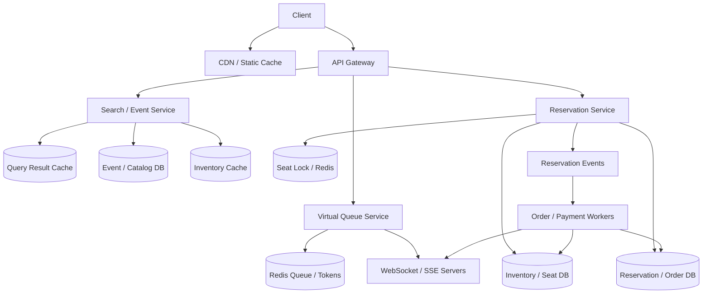

# 设计 Ticketmaster 系统

## 功能需求

- 用户可以搜索活动、查看票区/座位/价格，并进入抢票或购票流程。
- 支持高峰抢票：虚拟队列、排队进度、放行购买、异步结果通知。
- 支持座位/库存 reserve、支付、确认出票、取消和超时释放。
- 防止 double booking，同一座位或库存单位只能被一个成功订单占用。

## 非功能需求

- 搜索和活动页要高吞吐、低延迟，可接受短暂 stale。
- 座位 reserve 和订单确认必须强一致，不能不可控超卖。
- 热门活动要削峰，保护库存 DB 和订单服务。
- 用户状态更新要及时，但推送失败后必须可查询补齐。

## API 设计

```text
GET /events/search?query=&city=&date=&cursor=
- response: events[], next_cursor

GET /events/{event_id}/inventory
- response: sections[], price_levels[], availability_summary

POST /events/{event_id}/queue/join
- request: user_id, device_id
- response: queue_id, position, websocket_url

POST /events/{event_id}/reserve
- request: user_id, seat_ids[] | ticket_count, idempotency_key, queue_token
- response: reservation_id, status=held|queued|failed, expires_at

POST /reservations/{reservation_id}/pay
- request: payment_id
- response: order_id, status=confirmed|failed

GET /reservations/{reservation_id}
- response: status, order_id?, expires_at, failure_reason?
```

## 高层架构



## 关键组件

- Search / Event Service
  - 负责活动搜索、详情页、票区和可用性摘要。
  - 读 Query Cache、CDN、Inventory Cache。
  - 不负责最终库存正确性。
  - 注意：用户看到 “还有票” 不代表下单一定成功，reserve 前必须查强一致库存。

- Virtual Queue Service
  - 热门活动开启 waiting room。
  - 用户访问 booking page 时先进入虚拟队列。
  - Redis queue / sorted set 保存排队顺序和 position。
  - WebSocket/SSE 推送排队位置、预计时间、放行 token。
  - 同时在 DB 或 Redis 中记录用户获得 purchase access 的状态。

- Reservation Service
  - 负责 reserve seat/ticket、创建 reservation hold。
  - 使用 `idempotency_key` 防止同一用户重复点击。
  - 座位锁定和 reservation 状态写入必须在 correctness boundary 内。
  - 不应该只依赖 cache 或异步 worker 防 double booking。

- Inventory / Seat DB
  - 座位和库存的 source of truth。
  - 示例：

```text
seats(
  event_id,
  seat_id,
  section,
  row,
  status: available|held|sold|blocked
  hold_id,
  version,
  updated_at
)

inventory_buckets(
  event_id,
  section_id,
  price_level,
  available_count,
  held_count,
  sold_count,
  version
)
```

  - 指定座位用 `event_id + seat_id` 条件更新。
  - General admission 用 bucket count 条件更新。

- Seat Lock / Distributed Lock
  - 可用 Redis lock + TTL 做短期防并发辅助。
  - lock key 示例：`lock:event_id:seat_id`。
  - TTL 避免客户端或服务崩溃后永久锁死。
  - 注意：distributed lock 不是最终正确性机制，最终必须靠 DB conditional update / transaction。

- Reservation / Order DB
  - 存 reservation、payment、order 状态。

```text
reservations(
  reservation_id,
  user_id,
  event_id,
  seat_ids,
  status: held|payment_pending|confirmed|expired|cancelled|failed
  expires_at,
  idempotency_key,
  version
)
```

  - `unique(user_id, event_id, idempotency_key)` 防重复请求。
  - `expires_at` 支持超时释放。

- WebSocket / SSE Servers
  - 给排队用户实时推送 position 和 purchase access。
  - 给已提交 reserve 的用户推送抢票结果。
  - WebSocket 适合双向连接和排队状态，SSE 适合单向状态流。
  - 推送只是体验优化；客户端必须能用 GET 查询最终状态。

- Kafka / Async Workers
  - 用于异步处理支付、通知、订单确认、cache invalidation。
  - 如果采用 “所有用户都能看到票，下单进入队列” 模式，Kafka 承接 reserve requests。
  - Worker 消费时必须幂等，且最终仍要执行 DB 条件扣减。

## 核心流程

- 热门活动进入虚拟队列
  - 用户打开购票页。
  - Gateway 判断活动是否处于高峰模式。
  - 用户被加入 Redis queue，建立 WebSocket/SSE。
  - Queue Service 定期根据库存、订单处理能力、系统负载放行一批用户。
  - 被放行用户收到 `queue_token`，可在短时间内调用 reserve API。

- 搜索和查看票
  - 用户搜索活动，CDN/Query Cache 返回非个性化结果。
  - 活动详情页读取缓存的票区 availability summary。
  - 对热门 query 使用短 TTL，对冷门 query 使用较长 TTL。
  - 页面展示库存只做参考，reserve 时重新验证。

- 指定座位 reserve
  - 用户选择 seat_ids 调 `/reserve`。
  - Reservation Service 校验 queue token 和 idempotency key。
  - 尝试获取 seat lock with TTL。
  - 在 DB 中执行条件更新：`status=available -> held`。
  - 创建 reservation，状态为 `held`，设置 `expires_at`。
  - 返回 reservation_id。

- 异步抢票模式
  - 所有用户都能看到库存摘要。
  - 用户点击下单后请求进入 Kafka。
  - Worker 按 event/section/seat 分区消费。
  - Worker 执行强一致库存扣减，成功则创建 held reservation。
  - 客户端 polling 或 WebSocket/SSE 获取结果。

- 支付和超时释放
  - 用户在 hold TTL 内支付。
  - 支付成功后 reservation `held -> confirmed`，seat `held -> sold`。
  - Expiration Worker 扫描 `held AND expires_at < now`。
  - 超时则 reservation `held -> expired`，seat `held -> available`。
  - 支付和过期使用 CAS/version，只有一个状态转换成功。

## 存储选择

- Event / Catalog DB
  - 存活动、场馆、票区、演出时间、价格层。
  - 读多写少，可以配合 CDN/cache。

- Inventory / Seat DB
  - PostgreSQL/MySQL：适合指定座位事务和条件更新。
  - DynamoDB：适合 key-value 条件写和高扩展。
  - 关键是支持 atomic conditional update。

- Redis
  - Virtual queue、短期 purchase token、distributed lock、hot inventory cache。
  - 不作为最终库存事实源。

- Kafka / Queue
  - 承接异步 reserve/order/payment events。
  - 削峰，支持 replay 和 worker scale。

- Query Cache / CDN
  - 活动搜索结果、详情页、非个性化 availability summary。
  - TTL + invalidation + incremental update 混合。

## 扩展方案

- 搜索和抢票核心路径分离：搜索走 CDN/cache，reserve 走强一致 DB。
- 热门活动开启 virtual queue，限制同时进入 purchase flow 的用户数量。
- 按 `event_id` shard inventory 和 reservation，热门 event 可按 section/seat range 进一步拆分。
- WebSocket/SSE 只推送状态，不承载库存正确性。
- Cache 使用分层策略：热门 query 短 TTL，冷门 query 长 TTL。
- 库存变更通过 event bus 做 incremental cache update，cache miss 或 stale 时回源。

## 系统深挖

### 1. 防 Double Booking：Distributed Lock vs DB Conditional Update

- 方案 A：Distributed lock with TTL
  - 适用场景：降低并发打到同一个 seat 的冲突。
  - ✅ 优点：快速拦截竞争；TTL 可避免死锁。
  - ❌ 缺点：网络分区、锁过期、client pause 都可能导致边界问题；不能单独保证不超卖。

- 方案 B：DB conditional update / row lock
  - 适用场景：最终库存正确性。
  - ✅ 优点：状态和更新在同一个系统内，正确性清楚。
  - ❌ 缺点：热门座位/票区会有 write contention。

- 方案 C：Queue serialization per seat/section
  - 适用场景：异步抢票模式。
  - ✅ 优点：同一分区串行处理，减少 DB 冲突。
  - ❌ 缺点：增加排队延迟；分区热点仍然存在。

- 推荐：
  - Redis lock with TTL 可以作为优化。
  - 最终必须用 DB 条件更新：`available -> held -> sold`。
  - 面试里要明确 lock 不是 source of truth。

### 2. 两种抢票模式：先排队再看票 vs 都能看票再异步下单

- 方案 A：先进入虚拟队列，然后才能看票/买票
  - 适用场景：超热门演唱会、活动开始瞬间流量极高。
  - ✅ 优点：保护搜索、库存、订单系统；用户不会反复刷新。
  - ❌ 缺点：用户体验有等待；队列公平性和断线恢复复杂。

- 方案 B：所有人都能看票，下单后进入 Kafka 异步处理
  - 适用场景：读压力可扛，但写库存压力高。
  - ✅ 优点：用户能浏览票况；下单写入通过 MQ 削峰。
  - ❌ 缺点：很多用户看到票但最终失败，心理落差大；库存展示可能 stale。

- 方案 C：Hybrid
  - 适用场景：生产系统。
  - ✅ 优点：普通活动直接看票；热点活动进入 waiting room；放行后可看实时票况。
  - ❌ 缺点：活动模式切换和容量估算更复杂。

- 推荐：
  - 默认 hybrid。
  - 超热门 event 使用 virtual queue gating。
  - 普通 event 允许浏览，reserve 时强一致验证。

### 3. Virtual Queue + WebSocket/SSE

- 方案 A：Polling 排队状态
  - 适用场景：简单系统。
  - ✅ 优点：实现简单，HTTP 兼容好。
  - ❌ 缺点：用户频繁刷新造成重复请求；位置更新延迟大。

- 方案 B：WebSocket
  - 适用场景：排队进度、双向心跳、长时间等待。
  - ✅ 优点：实时推送位置和抢票状态；减少用户刷新；可感知连接状态。
  - ❌ 缺点：连接管理复杂，占用服务资源。

- 方案 C：SSE
  - 适用场景：只需要服务端单向推送。
  - ✅ 优点：比 WebSocket 简单；适合 status stream。
  - ❌ 缺点：断线重连、浏览器连接数限制、兼容性需要考虑。

- 推荐：
  - Waiting room 可用 WebSocket 或 SSE。
  - WebSocket/SSE 负责体验和减少重复请求，不负责库存正确性。
  - 客户端断线后用 queue_id 查询当前位置。

### 4. DB 和 Cache 一致性

- 方案 A：Write-through cache
  - 适用场景：简单读缓存。
  - ✅ 优点：写 DB 同时更新 cache，看起来一致。
  - ❌ 缺点：并发写、失败重试、跨服务更新仍会导致 cache 不一致；不能保证强一致。

- 方案 B：Cache-aside + TTL
  - 适用场景：搜索/详情页 availability summary。
  - ✅ 优点：简单，cache 失效可回源。
  - ❌ 缺点：短时间 stale；热门 key 失效可能打爆 DB。

- 方案 C：Event-driven invalidation / incremental update
  - 适用场景：库存变化频繁但需要较新展示。
  - ✅ 优点：库存变化后推送 cache 更新或失效。
  - ❌ 缺点：事件丢失/乱序会导致 cache drift，需要 TTL/rebuild 兜底。

- 推荐：
  - 搜索和票区展示可用 cache-aside + TTL + incremental updates。
  - Reserve 前必须查 DB source of truth。
  - Cache 只优化读体验，不参与 correctness。

### 5. 搜索加速：CDN / Query Cache / Adaptive Cache

- 方案 A：CDN 缓存活动页和静态资源
  - 适用场景：活动详情、图片、座位图静态部分。
  - ✅ 优点：极大减轻 origin 压力。
  - ❌ 缺点：个性化和实时库存不适合 CDN 长缓存。

- 方案 B：Query Result Cache
  - 适用场景：城市、日期、艺人、场馆等热门搜索。
  - ✅ 优点：直接复用非个性化查询结果。
  - ❌ 缺点：缓存结果不能包含用户专属价格/权限。

- 方案 C：Adaptive / Tiered Cache
  - 适用场景：冷热 query 差异大。
  - ✅ 优点：热门 query 短 TTL 保新鲜，冷门 query 长 TTL 省成本。
  - ❌ 缺点：TTL 策略和 invalidation 更复杂。

- 推荐：
  - CDN 缓静态内容。
  - Search query cache 缓非个性化结果。
  - 热门 query 短 TTL，冷门 query 长 TTL，库存变化用 incremental update。

### 6. 异步处理和客户端结果通知

- 方案 A：同步 reserve 后直接返回结果
  - 适用场景：普通活动、并发较低。
  - ✅ 优点：用户体验直接，状态简单。
  - ❌ 缺点：高峰时 API tail latency 高，库存 DB 压力大。

- 方案 B：请求入 Kafka，异步处理
  - 适用场景：抢票高峰。
  - ✅ 优点：MQ 削峰，worker 可水平扩展。
  - ❌ 缺点：用户需要等待结果；accepted 不代表抢到票。

- 方案 C：同步轻量预检 + 异步最终确认
  - 适用场景：高峰但希望快速拒绝明显无效请求。
  - ✅ 优点：无 queue token、重复请求、售罄可快速失败。
  - ❌ 缺点：状态机更复杂。

- 推荐：
  - 热门抢票用异步处理。
  - 客户端通过 polling 或 WebSocket/SSE 获取结果。
  - 最终状态以 Reservation DB 为准。

### 7. 支付 Hold 和超时释放

- 方案 A：reserve 后永久占票直到支付
  - 适用场景：不适合 Ticketmaster。
  - ✅ 优点：实现简单。
  - ❌ 缺点：恶意或犹豫用户会占住票。

- 方案 B：短 TTL hold
  - 适用场景：票务系统主流。
  - ✅ 优点：用户有支付时间，未支付自动释放。
  - ❌ 缺点：支付成功和过期释放存在竞态。

- 方案 C：支付成功后再抢票
  - 适用场景：几乎不适合用户体验。
  - ✅ 优点：不占库存。
  - ❌ 缺点：付款后没票会导致退款和投诉。

- 推荐：
  - `available -> held -> sold/available`。
  - Reservation 有 `expires_at`。
  - 支付和 expiration 都使用 CAS/version，保证只有一个成功。

### 8. 热点 Sharding 和容量保护

- 方案 A：按 event_id shard
  - 适用场景：大多数活动。
  - ✅ 优点：同一个活动数据 locality 好。
  - ❌ 缺点：超级热门 event 会形成单 shard 热点。

- 方案 B：按 event_id + section/seat range shard
  - 适用场景：热门大场馆。
  - ✅ 优点：把热门活动拆到多个 shard。
  - ❌ 缺点：跨 section 查询和统计复杂。

- 方案 C：Virtual queue admission control
  - 适用场景：极端高峰。
  - ✅ 优点：从入口把并发限制在系统可承受范围内。
  - ❌ 缺点：用户等待，队列系统本身要高可用。

- 推荐：
  - 默认 event_id shard。
  - 热门 event 进一步按 section/seat range 拆。
  - 更重要的是 virtual queue 控制进入 reserve 的并发。

## 面试亮点

- Ticketmaster 的核心是库存 correctness 和入口削峰，不是普通订单 CRUD。
- Distributed lock with TTL 只能辅助降低冲突，最终防 double booking 要靠 DB 条件更新/事务。
- 搜索和库存展示可以 stale，但 reserve 前必须查 source of truth。
- Write-through cache 不能保证 DB/cache 强一致；cache 只是读优化，需要 TTL、invalidation、增量更新和回源。
- 虚拟队列是 admission control，可以减少重复刷新、削峰和改善用户感知，但不是库存正确性机制。
- WebSocket/SSE 适合排队进度和抢票结果推送；推送失败后要能用 reservation_id 查询最终状态。
- 高峰抢票可采用异步 Kafka 处理，但 `accepted` 不等于抢到票，客户端状态机要清楚。
- 热点不是平均 QPS，而是单个 event、section、seat 或 inventory bucket 的竞争。

## 一句话总结

Ticketmaster 系统的核心是：搜索和活动展示走 CDN/query cache 提供高吞吐读，热门活动用 virtual queue 控制进入购票链路，reserve 时用短 TTL lock 辅助并最终通过 DB 条件更新防 double booking，订单和支付状态通过 Kafka/worker 异步处理，并用 WebSocket/SSE 或 polling 把排队和抢票结果反馈给用户。
