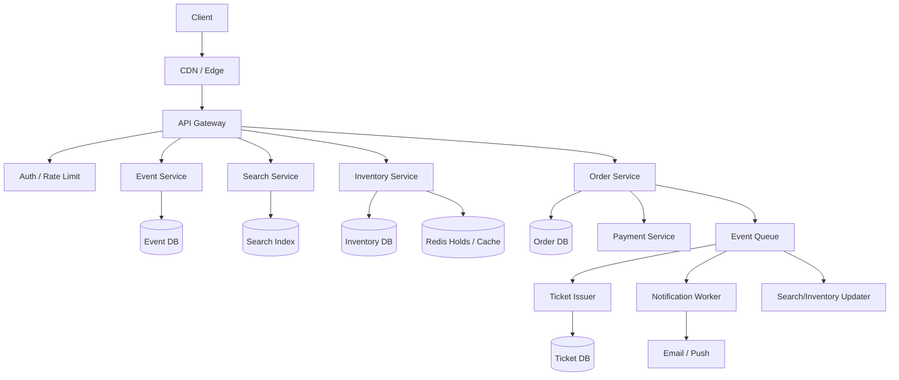

# 设计 Ticketmaster 系统

## 功能需求

- 用户可以浏览 event、venue、showtime 和 seat map。
- 用户可以搜索票、选择座位/票种，并创建订单。
- 系统需要在支付前临时 hold 票，支付成功后出票。
- 支持高流量开售场景：排队、限流、防黄牛、订单超时释放。

## 非功能需求

- 不能 oversell，同一张票只能卖给一个用户。
- 开售瞬间要抗高并发和热点 event。
- 下单链路要低延迟，但搜索/推荐可以最终一致。
- 支付、出票、通知要可重试、可审计、可恢复。

## API 设计

```text
GET /events?query=&city=&date=
- 搜索 event

GET /events/{event_id}
- event detail, venue, showtimes

GET /events/{event_id}/inventory
- seat map / sections / price levels / availability

POST /holds
- event_id, user_id, seat_ids 或 ticket_type, quantity, idempotency_key

POST /orders
- hold_id, payment_method_id, idempotency_key

GET /orders/{order_id}
- order status, tickets
```

## 高层架构



## 关键组件

### API Gateway

- 负责 auth、rate limit、bot detection、幂等 key 校验入口。
- 对开售 event 可以接入 waiting room / queue。
- 注意事项：
  - 热门 event 的读写流量要单独限流。
  - `POST /holds` 和 `POST /orders` 必须支持 `idempotency_key`。
  - 不在 API 层做最终库存判断，库存正确性由 Inventory Service 保证。

### Event Service

- 管理 event、venue、showtime、artist/team、price level。
- 读多写少，适合 cache/CDN。
- 注意事项：
  - event metadata 和库存分开，不要让库存热点影响 event detail。
  - venue seat map 可以预计算并缓存。
  - event 更新后异步刷新搜索索引。

### Search Service

- 提供 event 搜索、城市/日期/类型过滤。
- SearchDB 是 derived index。
- 注意事项：
  - 搜索结果里的 availability 可以是近似值。
  - 真正能否购买必须到 Inventory Service 校验。
  - 不要让搜索新鲜度阻塞下单链路。

### Inventory Service

- 核心组件，负责票/座位状态转换：

```text
AVAILABLE -> HELD -> SOLD
          -> RELEASED
```

- 管理 hold TTL，例如 2-10 分钟。
- 注意事项：
  - 不能 oversell。
  - seat-level ticket 和 general admission ticket 的库存模型不同。
  - 热门 event 必须按 `event_id` 或 `section_id` 做分区和热点保护。

### Order Service

- 创建订单、调用支付、处理订单状态机。
- 状态示例：

```text
CREATED -> PAYMENT_PENDING -> PAID -> TICKET_ISSUED
                              -> FAILED / EXPIRED
```

- 注意事项：
  - 支付不能放在库存锁内等待太久。
  - 支付 callback 可能重复，必须幂等。
  - 支付成功但出票失败时，需要后台补偿。

### Ticket Issuer

- 支付成功后生成电子票、barcode/QR code。
- 注意事项：
  - 出票要幂等，同一个 order 不能生成重复有效票。
  - barcode/token 要防伪、防重放。
  - 可以异步出票，但用户最终必须能查到票。

### Redis / Cache

- 缓存 event detail、seat map、availability summary、hold TTL。
- 注意事项：
  - Redis 可以辅助 hold，但不能作为唯一 source of truth，除非配合持久化和恢复策略。
  - 对热门 seat map，缓存要避免 stampede。

## 核心流程

### 浏览和搜索

- 用户搜索 event，Search Service 查询 SearchDB。
- 返回 event 列表和近似 availability。
- 用户打开 event detail，Event Service 返回 event metadata 和 venue seat map。
- Inventory Service 返回 section/seat availability。
- availability 可以缓存，但下单时必须重新校验。

### Hold 座位

- 用户选择 seat 或 ticket type，调用 `POST /holds`。
- Inventory Service 检查票是否可售。
- 如果可售，把票状态改为 `HELD`，写入 `hold_id` 和 `expires_at`。
- 返回 hold 给用户，用户进入支付页。
- hold 超时后后台释放，状态回到 `AVAILABLE`。

### 支付和出票

- 用户用 `hold_id` 创建 order。
- Order Service 校验 hold 未过期且属于该用户。
- 调用 Payment Service。
- 支付成功后，把库存从 `HELD` 改为 `SOLD`。
- 发布 `OrderPaid` event。
- Ticket Issuer 生成电子票，Notification Worker 发邮件/推送。

### Hold 过期释放

- 后台 worker 扫描 expired holds，或使用 delayed queue。
- 对仍处于 `HELD` 且未支付的库存执行 release。
- 更新 availability cache/search summary。
- 如果用户之后支付回调才到，需要按订单状态拒绝或退款处理。

## 存储选择

- **Event DB：PostgreSQL/MySQL**
  - event、venue、showtime、price level、artist/team。
  - 关系型数据，读多写少。
- **Inventory DB：PostgreSQL/MySQL / DynamoDB / Spanner-like DB**
  - seat inventory、hold、sold 状态。
  - 是库存 source of truth。
  - 核心约束：同一 `ticket_id/seat_id` 只能被一个有效 order sold。
- **Order DB**
  - order、payment status、order state machine。
  - 支持幂等和审计。
- **Ticket DB**
  - issued ticket、barcode/token、ticket status。
- **Redis**
  - availability cache、hold TTL 辅助、rate limit、waiting room token。
- **SearchDB**
  - event 搜索索引，是 derived state。
- **Queue**
  - 出票、通知、索引更新、hold 释放、补偿任务。

## 扩展方案

- Event detail、venue map、static assets 上 CDN。
- Search 和 Event read path 独立扩展，不影响库存写路径。
- 热门 event 按 `event_id`、`section_id` 或 `seat_block` 分区。
- 对开售 event 使用 waiting room，把请求平滑送入 Inventory Service。
- 库存写路径尽量短：hold 只做库存状态转换，不同步支付。
- 支付、出票、通知全部异步和幂等。
- 对 general admission 使用计数库存；对 assigned seats 使用 seat-level 状态机。

## 系统深挖

### 1. 库存模型：assigned seat vs general admission

- 问题：
  - 不同票种的库存正确性模型不同，不能一套逻辑硬套所有 event。
- 方案 A：Assigned seat，每个 seat 一条库存记录
  - 适用场景：
    - 剧院、体育馆、演唱会座位图选座。
  - ✅ 优点：
    - 精确控制每个座位。
    - 用户体验好，可以展示 seat map。
  - ❌ 缺点：
    - 热门 event 下 seat-level contention 高。
    - seat map 更新和缓存更复杂。
- 方案 B：General admission，按 ticket type 维护计数
  - 适用场景：
    - 站票、普通入场券、不选座活动。
  - ✅ 优点：
    - 写入简单，只需要扣减 counter。
    - 容易分片和扩展。
  - ❌ 缺点：
    - 无法支持精确选座。
    - 需要防止 counter oversell。
- 方案 C：Section-level inventory
  - 适用场景：
    - 用户选区域，不选具体座位。
  - ✅ 优点：
    - 比 seat-level 更容易扩展。
    - 比 GA 更有价格/区域控制。
  - ❌ 缺点：
    - 最终座位分配可能带来用户体验问题。
- 推荐：
  - 选座 event 用 assigned seat。
  - GA event 用 counter。
  - 系统抽象成 inventory item，不同 event 选择不同 inventory strategy。

### 2. 防 oversell：DB lock vs conditional write vs single-writer

- 问题：
  - 开售瞬间大量用户抢同一座位，如何保证一张票只卖一次？
- 方案 A：DB transaction + row lock
  - 适用场景：
    - 单 region、关系型 DB、规模中等。
  - ✅ 优点：
    - 语义清晰，正确性强。
    - 容易处理 `AVAILABLE -> HELD -> SOLD`。
  - ❌ 缺点：
    - 热点 seat/section 下锁竞争高。
    - DB 压力大。
- 方案 B：Conditional write / compare-and-set
  - 适用场景：
    - DynamoDB/Cassandra/Spanner-like KV store。
  - ✅ 优点：
    - 只有状态仍是 `AVAILABLE` 才能更新成功。
    - 易于水平扩展。
  - ❌ 缺点：
    - 复杂事务和跨多座位 hold 更难。
    - 失败重试逻辑更复杂。
- 方案 C：按 event/section 单 writer actor
  - 适用场景：
    - 超热门 event，需要顺序处理库存变更。
  - ✅ 优点：
    - 避免并发写冲突。
    - 容易保证同一 partition 内顺序。
  - ❌ 缺点：
    - 单 partition 吞吐有限。
    - 需要处理 actor failover 和 backlog。
- 推荐：
  - 基础设计用 DB row lock 或 conditional write。
  - 热门 event 演进到按 `event_id/section_id` partition 的 single-writer 或 queue-based processor。

### 3. Hold 票策略：短 TTL hold vs 直接支付扣库存

- 问题：
  - 用户选择票后，需要给他多长时间支付？库存什么时候锁住？
- 方案 A：短 TTL hold
  - 适用场景：
    - 大多数 Ticketmaster 类系统。
  - ✅ 优点：
    - 用户有时间支付。
    - 避免支付过程中座位被别人买走。
  - ❌ 缺点：
    - 恶意用户可能大量 hold 不支付。
    - 需要超时释放和清理机制。
- 方案 B：不 hold，支付成功后再抢库存
  - 适用场景：
    - 低竞争、库存充足场景。
  - ✅ 优点：
    - 库存不被无效占用。
    - 系统状态更少。
  - ❌ 缺点：
    - 用户支付后可能发现没票，体验很差。
    - 退款/补偿复杂。
- 方案 C：排队后限时 hold + 用户风控
  - 适用场景：
    - 热门开售、防黄牛。
  - ✅ 优点：
    - 控制并发和恶意占票。
    - 可以按用户/设备/payment method 限制 hold。
  - ❌ 缺点：
    - 产品和风控复杂度更高。
- 推荐：
  - 用短 TTL hold。
  - 热门 event 加 waiting room、per-user hold limit、风控校验。

### 4. 开售高峰：直接放流量 vs waiting room

- 问题：
  - 热门 event 开售瞬间，大量请求会打爆搜索、库存和支付。
- 方案 A：直接让所有用户进购买页
  - 适用场景：
    - 普通 event，流量可控。
  - ✅ 优点：
    - 实现简单，用户路径短。
  - ❌ 缺点：
    - 热门 event 会造成库存服务雪崩。
    - 用户体验不稳定。
- 方案 B：Waiting room / virtual queue
  - 适用场景：
    - 热门演唱会、体育赛事开售。
  - ✅ 优点：
    - 平滑流量，保护库存服务。
    - 可以做 bot filtering 和公平排序。
  - ❌ 缺点：
    - 用户等待体验复杂。
    - 排队公平性和作弊防护难。
- 方案 C：Lottery / invite-based sale
  - 适用场景：
    - 极高需求、供给远小于需求。
  - ✅ 优点：
    - 极大降低瞬时峰值。
    - 更容易做公平性和风控。
  - ❌ 缺点：
    - 不是所有业务都能接受。
    - 产品形态变化较大。
- 推荐：
  - 普通 event 直接购买。
  - 热门 event 使用 waiting room。
  - 极端热门活动可以用 lottery 或 verified fan 模式。

### 5. Seat map availability：强实时 vs 缓存近似

- 问题：
  - 座位图要不要实时显示每个 seat 的准确状态？
- 方案 A：强实时读 Inventory DB
  - 适用场景：
    - 小 event、低流量。
  - ✅ 优点：
    - 展示准确。
  - ❌ 缺点：
    - 热门 event 下读压力巨大。
    - 用户看到时准确，点选时仍可能被别人 hold。
- 方案 B：缓存 availability summary
  - 适用场景：
    - 大多数大流量 event。
  - ✅ 优点：
    - 读路径快，保护 Inventory DB。
    - section-level availability 足够用于浏览。
  - ❌ 缺点：
    - 显示可能短暂过期。
    - 用户点 seat 时还要重新校验。
- 方案 C：实时推送 seat changes
  - 适用场景：
    - 选座体验要求高、活跃用户不太多。
  - ✅ 优点：
    - 用户看到的 seat map 更接近实时。
  - ❌ 缺点：
    - 对热门 event 推送量大。
    - 仍不能替代最终 hold 校验。
- 推荐：
  - 浏览层用缓存/近似 availability。
  - `POST /holds` 时做强校验。
  - 面试里要主动说：展示可近似，购买必须强一致。

### 6. 支付和出票：同步链路 vs 异步补偿

- 问题：
  - 支付成功后，出票、通知、订单状态更新如何保证最终完成？
- 方案 A：支付成功后同步出票和发通知
  - 适用场景：
    - 小系统，依赖少。
  - ✅ 优点：
    - 用户路径直观。
  - ❌ 缺点：
    - 出票/通知失败会拖慢甚至破坏支付链路。
- 方案 B：支付成功后发布事件，异步出票和通知
  - 适用场景：
    - 生产系统。
  - ✅ 优点：
    - 支付主链路短。
    - 出票和通知可重试、可补偿。
  - ❌ 缺点：
    - 用户可能短暂看到 `payment succeeded, ticket pending`。
- 方案 C：Outbox + worker
  - 适用场景：
    - 需要确保 order 状态更新和出票事件不丢。
  - ✅ 优点：
    - 避免 DB 成功但 event 丢失。
    - 适合支付/出票这种关键链路。
  - ❌ 缺点：
    - 实现更复杂。
- 推荐：
  - 用 payment callback 幂等更新 order。
  - 用 outbox/event 异步出票。
  - 用户允许短暂 pending，但系统必须最终补偿到一致状态。

### 7. 反黄牛和公平性：限流 vs 身份校验 vs 队列策略

- 问题：
  - 热门票务系统最大风险之一是 bot 和 scalper 抢票。
- 方案 A：基础 rate limit
  - 适用场景：
    - 普通流量、防简单 abuse。
  - ✅ 优点：
    - 实现简单，成本低。
  - ❌ 缺点：
    - 对分布式 bot 效果有限。
- 方案 B：Verified account / payment method / phone
  - 适用场景：
    - 热门 event 或高价值票。
  - ✅ 优点：
    - 提高作弊成本。
    - 可以限制每人购买数量。
  - ❌ 缺点：
    - 增加用户摩擦。
    - 误伤真实用户。
- 方案 C：Waiting room + bot scoring + per-user quota
  - 适用场景：
    - 顶级热门 event。
  - ✅ 优点：
    - 同时保护系统和公平性。
    - 可以把可疑用户降权或拦截。
  - ❌ 缺点：
    - 风控系统复杂。
    - 排队策略需要解释公平性。
- 推荐：
  - 普通 event 用 rate limit。
  - 热门 event 用 waiting room + verified user + quota。
  - 防黄牛是产品/风控/系统共同问题，不只是限流。

## 面试亮点

- 可以深挖：展示 availability 可以最终一致，但 hold/checkout 必须强一致，这是 correctness boundary。
- 可以深挖：assigned seat 和 general admission 是两种不同库存模型，不要混成一个 counter。
- Staff+ 判断点：支付不应该持有库存锁；库存 hold、支付、出票要用状态机和异步补偿串起来。
- 可以深挖：热门开售不是简单扩 API，而是需要 waiting room 平滑流量并做反 bot。
- Staff+ 判断点：不要让搜索/seat map 缓存决定能否买票，最终购买必须回到 Inventory Service 校验。
- 可以深挖：outbox + idempotent workers 解决支付成功后出票事件不丢的问题。

## 一句话总结

- Ticketmaster 的核心是库存正确性和高峰流量控制：浏览和搜索可以缓存/最终一致，但 hold 和 sold 状态必须由 Inventory Service 强校验；支付、出票、通知用状态机、幂等和异步补偿保证最终完成。
