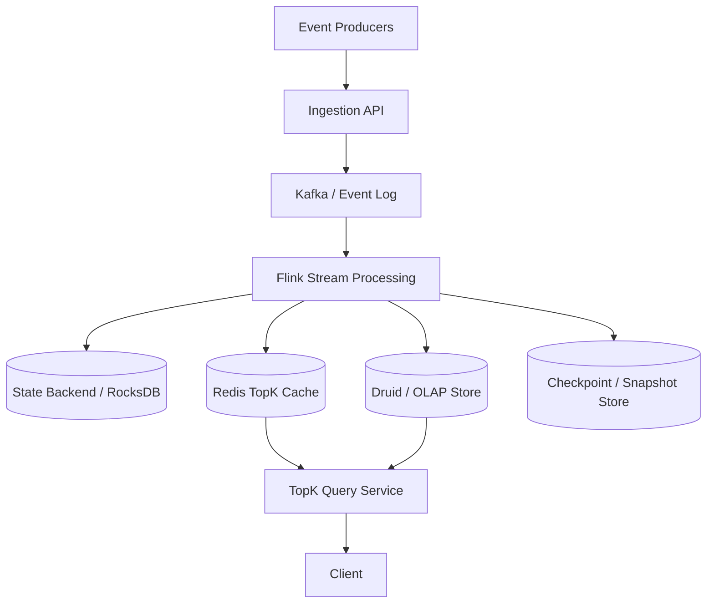

# 设计 Top K 系统

## 功能需求

- 实时统计事件流中的 Top K，例如 top searched queries、top videos、top products。
- 支持按时间窗口查询 Top K，例如最近 1 分钟、1 小时、1 天。
- 支持固定窗口或滑动窗口；是否支持任意 lookup window 需要提前明确。
- 支持去重、迟到事件处理，以及离线 reconciliation。

## 非功能需求

- 低延迟查询：固定窗口 Top K 通常希望秒级或亚秒级返回。
- 高吞吐写入：事件流可能非常大，需要分区聚合。
- 可恢复：worker 挂掉后能从 checkpoint 恢复 state。
- 可按精度要求取舍：精确 Top K 成本高，近似 Top K 可显著降成本。

## 先问清楚的问题

- 是否需要查询任意时间点？
  - 如果是任意时间点，预计算只能覆盖固定时间点；更适合 Druid/ClickHouse 这类 OLAP。
- 是否需要任意 lookup window？
  - 例如任意 `[start_time, end_time]`。
  - 如果需要，固定窗口预聚合不够，通常需要 Druid rollup 或 OLAP scan/merge。
- Window 是固定的还是滑动的？
  - 例如固定支持 `1min / 1hour / 1day`，会比任意 window 简单很多。
- K 是固定值还是任意值？
  - K 小且固定，比如 Top 100，内存维护 heap 可行。
  - K 很大或任意 K，在线维护很难，通常需要 OLAP/offline job。
- 精度要求高不高？
  - 精确 Top K 需要维护准确 count 和过期数据。
  - 近似 Top K 可以用 Count-Min Sketch、decayed count 等。

## API 设计

```text
POST /events
- key, user_id, event_id, event_time, metadata

GET /topk?window=1h&k=100
- 返回最近 1 小时 top 100

GET /topk?window=1d&k=100&dimension=region
- 返回按 region 过滤后的 top k

GET /topk?start_time=&end_time=&k=100
- 任意 lookup window，通常走 OLAP/Druid

GET /topk/{key}/count?window=1h
- 查询某个 key 在窗口内的 count
```

## 高层架构



## 关键组件

### Ingestion API

- 接收事件，做基础校验、限流、schema validation。
- 注意事项：
  - 事件必须带 `event_id` 和 `event_time`。
  - `event_id` 用于去重。
  - `event_time` 用于 window aggregation，不应只用 processing time。

### Kafka / Event Log

- 作为 durable event stream。
- 按 key 或 hash(key) partition。
- 注意事项：
  - 分区策略影响 Flink state locality。
  - 热点 key 可能导致单 partition 热点，需要动态分区或 key salting。
  - Kafka 保留原始事件，方便 replay/reconciliation。

### Flink / Stream Processor

- 做实时 window aggregation 和 Top K 维护。
- 关键能力：
  - event-time window
  - watermark
  - keyed state
  - state backend
  - checkpoint
  - window aggregation
- 注意事项：
  - Flink 没有传统 replica 概念，容错依赖 checkpoint + replay。
  - State 可以放 RocksDB state backend，checkpoint 到 durable storage。
  - Duplicate events 要在 state 中做 dedup，或依赖上游 exactly-once source/sink 语义。

### State Backend

- 存 window 内 key count、bucket count、heap、dedup state。
- 注意事项：
  - 精确统计的核心难点是如何淘汰旧窗口数据。
  - 如果窗口很长、key 很多，state 会非常大。
  - 需要 TTL、compaction、snapshot 和 backpressure 控制。

### Redis TopK Cache

- 服务固定窗口低延迟查询。
- 可存：
  - 每个固定窗口最终 Top K。
  - 或每分钟 bucket 的 key count / sorted set。
- 注意事项：
  - Redis sorted set 更新是 `O(logN)`。
  - 存所有 key 很耗内存。
  - 只存 Top K 查询快，但无法回答任意 K 或任意 window。

### Druid / OLAP Store

- 服务任意时间点、任意 lookup window、复杂维度过滤。
- 注意事项：
  - Druid 支持 rollup、time partition、segment scan。
  - 查询比 Redis 慢，但灵活。
  - 适合补充精确或准实时分析查询。

### TopK Query Service

- 根据查询类型路由：
  - 固定窗口、小 K：读 Redis。
  - 任意 window、复杂 filter、大 K：读 Druid。
- 注意事项：
  - 不要用一套存储强行支持所有查询。
  - 查询层要明确返回结果的新鲜度和精度。

## 核心流程

### 实时固定窗口 Top K

- Producer 写事件到 Kafka。
- Flink 按 event time 和 window 聚合 key count。
- 对固定窗口，例如 1min/1h/1d，Flink 更新窗口 state。
- Flink 维护 heap 或定期刷新 Top K。
- 输出 Top K 到 Redis。
- Query Service 读 Redis 返回结果。

### 任意窗口查询

- 事件流同时写入 Druid。
- Druid 做 rollup，比如按 minute、key、dimension 聚合 count。
- 查询 `[start_time, end_time]` 时扫描相关 segments。
- Druid 聚合 count 后排序取 Top K。
- 延迟比 Redis 高，但支持任意时间范围和维度过滤。

### 窗口过期淘汰

- Flink 按 event time + watermark 判断窗口是否结束。
- 固定窗口结束后输出结果，并清理对应 window state。
- Sliding window 如果维护 minute bucket，则周期性删除过期 bucket。
- 如果用 heap，要处理 heap 中旧 count 或 stale entry。
- Late event 根据 allowed lateness 更新旧窗口，超过阈值进入 side output 或丢弃。

### 故障恢复

- Flink 定期 checkpoint operator state 和 Kafka offset。
- Worker 失败后从 checkpoint 恢复 state。
- Kafka 从 checkpointed offset 继续 replay。
- Redis 输出需要幂等，例如按 `window_id` 覆盖写。
- 离线 reconciliation job 可从 Kafka/Druid 重新计算关键窗口，修复错误。

## 存储选择

- **Kafka**
  - 原始事件流，支持 replay。
- **Flink State Backend**
  - RocksDB state backend + checkpoint 到 S3/HDFS。
  - 存 window count、dedup state、heap metadata。
- **Redis**
  - 固定窗口 Top K serving cache。
  - 可以用 sorted set 或直接存 Top K list。
- **Druid**
  - 任意 window、复杂维度过滤、历史查询。
  - rollup：按时间 bucket + key + dimension 聚合 count。
- **Offline Warehouse / Object Store**
  - 长期历史、离线重算、reconciliation。

## 扩展方案

- 按 key 做 Kafka partition 和 Flink keyed state。
- 用 consistent hashing 动态分配 key 到 worker。
- 热点 key 用 salting 拆分，再二阶段聚合。
- 固定窗口预聚合，查询直接读 Redis。
- 任意窗口/任意时间点走 Druid，不强行用 Redis 回答。
- Flink state 用 RocksDB，checkpoint 到 durable storage。
- 离线 MapReduce/Spark 用于大 K、长窗口、历史回填和 reconciliation。

## 系统深挖

### 1. 查询能力：固定窗口 vs 任意 lookup window

- 问题：
  - 系统到底要支持固定窗口 Top K，还是任意 `[start, end]` 查询？
- 方案 A：固定窗口预聚合
  - 适用场景：
    - 只需要 `1min / 1h / 1d` 这类固定窗口。
  - ✅ 优点：
    - 查询极快，可直接读 Redis。
    - 成本低，架构简单。
  - ❌ 缺点：
    - 不支持任意时间范围。
    - 只能覆盖预定义窗口。
- 方案 B：Druid/OLAP 任意窗口查询
  - 适用场景：
    - 用户可以任意选 start/end time，或需要复杂维度 filter。
  - ✅ 优点：
    - 灵活，支持任意 window 和历史查询。
    - Rollup 后查询成本可控。
  - ❌ 缺点：
    - 查询延迟比 Redis 高。
    - 系统复杂度和存储成本更高。
- 方案 C：固定窗口 + Druid hybrid
  - 适用场景：
    - 既要低延迟 dashboard，也要 ad-hoc 分析。
  - ✅ 优点：
    - 固定热点查询快。
    - 任意查询有 OLAP 兜底。
  - ❌ 缺点：
    - 两套 serving path，一致性和新鲜度要解释清楚。
- 推荐：
  - 如果面试题没要求任意 window，先支持固定窗口。
  - 明确说任意 lookup window 走 Druid/OLAP，不用 Redis 硬做。

### 2. Sliding window：two-pointer vs bucket + heap refresh

- 问题：
  - 最近 1 小时这种滑动窗口，如何淘汰旧数据？
- 方案 A：two-pointer / 两个 consumer
  - 适用场景：
    - 固定 lookup window，例如“过去 1 小时 Top K”。
    - 同一 instance 上可以有一个 consumer 加新事件，一个 consumer 处理过期事件。
  - ✅ 优点：
    - 精确维护窗口内 count。
    - Stride 可调，比如每 1 秒/10 秒滑动一次。
  - ❌ 缺点：
    - 只适合固定窗口。
    - 对乱序事件、late event、consumer 对齐要求高。
- 方案 B：time bucket + heap refresh
  - 适用场景：
    - 固定几个窗口，比如 1min/1h/1d。
  - ✅ 优点：
    - 逻辑清晰：每分钟一个 bucket，查询时合并最近 N 个 bucket。
    - 容易淘汰旧 bucket。
  - ❌ 缺点：
    - 合并多个 bucket 有开销。
    - 如果 key 很多，bucket count 很大。
- 方案 C：Flink event-time window
  - 适用场景：
    - 需要 watermark、late event、checkpoint 容错。
  - ✅ 优点：
    - 内置 window aggregation、watermark、state cleanup。
    - 容错成熟。
  - ❌ 缺点：
    - 需要理解 Flink state 和 checkpoint。
    - 大窗口高基数 key 会导致 state 膨胀。
- 推荐：
  - 面试里推荐 Flink window + bucketed state。
  - Two-pointer 可以作为固定窗口优化，但不适合任意 window。

### 3. 旧窗口淘汰：lazy update vs 热点 key + lazy vs sketch

- 问题：
  - Top K 的难点不是加新 count，而是旧数据过期后如何更新排名。
- 方案 A：Lazy update
  - 适用场景：
    - 查询频率不极高，允许查询时修正 stale heap。
  - ✅ 优点：
    - 写路径简单。
    - 不需要每次过期都全量重算 heap。
  - ❌ 缺点：
    - 查询时可能多次 pop stale entries。
    - 延迟不稳定。
- 方案 B：只维护热点 key + lazy update
  - 适用场景：
    - Key space 巨大，但真正可能进 Top K 的 key 很少。
  - ✅ 优点：
    - 大幅降低 state 和 heap 大小。
    - 适合 trending/top queries。
  - ❌ 缺点：
    - 可能漏掉突然变热的新 key。
    - 需要定义 hot threshold。
- 方案 C：Count-Min Sketch + 定期合并 bucket sketch
  - 适用场景：
    - 不要求精确 Top K，只需要近似统计。
  - ✅ 优点：
    - 内存更低。
    - 适合超高基数、超大流量。
  - ❌ 缺点：
    - 只能估计频率，存在 over-estimation。
    - 过期数据需要按时间 bucket 维护多个 sketch，然后删除旧 sketch；合并 60 个 sketch 也有开销。
- 推荐：
  - 精确 Top K：bucket + exact count + lazy heap correction。
  - 近似 Top K：bucketed Count-Min Sketch 或 heavy hitter algorithm。
  - 不要假设一个 global heap 能自动处理过期窗口。

### 4. K 的大小和是否可变

- 问题：
  - K 是固定 Top 100，还是用户可以随便查 Top 10k？
- 方案 A：K 小且固定
  - 适用场景：
    - Dashboard Top 100、Top 500。
  - ✅ 优点：
    - Heap 内存小。
    - Redis 直接存 Top K list，查询快。
  - ❌ 缺点：
    - 无法回答更大的 K。
- 方案 B：K 较大但窗口固定
  - 适用场景：
    - 过去 7 天 Top 100k。
  - ✅ 优点：
    - 可以通过离线 MapReduce/Spark 批处理。
    - 成本可控。
  - ❌ 缺点：
    - 延迟高，不适合实时。
- 方案 C：K 任意
  - 适用场景：
    - 更像 OLAP 排序查询。
  - ✅ 优点：
    - 查询灵活。
  - ❌ 缺点：
    - 在线系统很难低延迟支持任意 K。
    - 需要 Druid/ClickHouse 或离线计算。
- 推荐：
  - 在线实时系统只承诺固定小 K。
  - 大 K 或任意 K 走 OLAP/offline。
  - 面试里要主动问 K 是否固定。

### 5. Redis 存储：sorted set 所有 key vs 只存 Top K vs key count

- 问题：
  - Redis 怎么服务查询，内存和更新成本如何控制？
- 方案 A：每个窗口一个 sorted set，存所有 key
  - 适用场景：
    - Key 数可控。
  - ✅ 优点：
    - 查询 Top K 简单。
    - 支持不同 K。
  - ❌ 缺点：
    - 内存大。
    - 每次更新 `O(logN)`。
- 方案 B：Redis 只存 Top K list/sorted set
  - 适用场景：
    - 只需要固定 Top K。
  - ✅ 优点：
    - 内存小，查询快。
    - Serving path 简单。
  - ❌ 缺点：
    - 不能回答任意 K。
    - 需要 Flink 负责正确维护 Top K。
- 方案 C：Redis 存每分钟 key count，cron 聚合 Top K
  - 适用场景：
    - 准实时即可，例如分钟级 dashboard。
  - ✅ 优点：
    - 实现简单。
    - 可以按 bucket 删除旧数据。
  - ❌ 缺点：
    - Cron 聚合会有延迟。
    - Key 太多时 Redis hash/sorted set 仍然很大。
- 推荐：
  - 固定 Top K：Redis 只存结果。
  - 如果要支持灵活 K/window：不要靠 Redis，走 Druid/OLAP。

### 6. 精确统计 vs 近似统计

- 问题：
  - 是否必须精确？如果不要求精度很高，可以大幅降低成本。
- 方案 A：Exact count + heap
  - 适用场景：
    - 计费、排行榜、强准确需求。
  - ✅ 优点：
    - 结果精确，可解释。
  - ❌ 缺点：
    - 高基数和长窗口下 state 很大。
    - 旧数据淘汰复杂。
- 方案 B：Count-Min Sketch
  - 适用场景：
    - 高频趋势、近似 analytics。
  - ✅ 优点：
    - 内存低。
    - 写入快。
  - ❌ 缺点：
    - 有误差，通常 over-estimate。
    - 需要 bucketed sketch 才能淘汰过期窗口。
- 方案 C：Decayed count
  - 适用场景：
    - Trending，不需要严格窗口，只希望近期权重更高。
  - ✅ 优点：
    - 不需要精确删除旧事件。
    - 趋势排序更平滑。
  - ❌ 缺点：
    - 不回答“过去 1 小时精确 Top K”。
    - 参数选择影响结果。
- 推荐：
  - 如果是产品榜单或精确 reporting，用 exact。
  - 如果是 trending/推荐候选，用 sketch 或 decayed count。

### 7. Flink 容错：replica vs checkpoint

- 问题：
  - Flink worker 挂了，内存 state 和窗口计算怎么恢复？
- 方案 A：每个 worker 做 active replica
  - 适用场景：
    - 一般不是 Flink 的标准方式。
  - ✅ 优点：
    - 理论上恢复快。
  - ❌ 缺点：
    - 资源翻倍。
    - 状态同步复杂。
- 方案 B：Flink checkpoint + replay
  - 适用场景：
    - Flink 标准容错模型。
  - ✅ 优点：
    - Checkpoint state + Kafka offset，恢复语义清晰。
    - RocksDB state backend 可支持大 state。
  - ❌ 缺点：
    - 恢复需要时间。
    - Checkpoint 太大时会影响性能。
- 方案 C：输出端 snapshot + offline rebuild
  - 适用场景：
    - Redis serving state 可重建。
  - ✅ 优点：
    - Redis 丢了可从 Flink/Druid/warehouse 恢复。
    - Serving cache 不做 source of truth。
  - ❌ 缺点：
    - Rebuild 期间结果可能 stale 或不可用。
- 推荐：
  - Flink 用 checkpoint，不强调 replica。
  - Redis/Druid 输出要幂等。
  - 关键窗口用 offline reconciliation 修复。

### 8. Late event 和 duplicate event

- 问题：
  - 事件可能乱序、延迟、重复，Top K 如何正确？
- 方案 A：processing time window
  - 适用场景：
    - 对 event time 准确性要求低。
  - ✅ 优点：
    - 简单，延迟低。
  - ❌ 缺点：
    - 乱序事件会落到错误窗口。
- 方案 B：event time + watermark + allowed lateness
  - 适用场景：
    - 大多数严肃统计系统。
  - ✅ 优点：
    - 能处理乱序和迟到事件。
    - Flink 原生支持。
  - ❌ 缺点：
    - Watermark 选择影响延迟和准确性。
    - Late update 会导致已输出 Top K 被修正。
- 方案 C：离线 reconciliation
  - 适用场景：
    - 需要最终准确报表。
  - ✅ 优点：
    - 可用完整数据修复实时误差。
  - ❌ 缺点：
    - 不实时。
- 推荐：
  - 实时用 event time + watermark。
  - 超过 allowed lateness 的事件进入 side output。
  - 定期 offline reconciliation 修正重要窗口。

## 面试亮点

- 可以先问清楚：是否任意时间点、任意 lookup window、K 是否固定、是否要求精确。这几个问题决定架构。
- 固定窗口 Top K 可以预聚合，任意 window 基本要 Druid/OLAP，不要用 Redis 硬撑。
- Top K 真正难点是窗口过期时如何淘汰旧数据，而不是怎么加新事件。
- Flink 容错靠 checkpoint + Kafka replay，不是靠给每个 operator 做 replica。
- Redis 适合 serving 固定窗口结果，不适合回答任意 window / 任意 K。
- 精确统计和近似统计是重要 trade-off：exact count 成本高，sketch/decay 更适合 trending。

## 一句话总结

- Top K 系统的核心是先限定查询语义：固定窗口、小 K、精确结果可以用 Flink window aggregation + bucketed state + Redis serving；任意时间窗口、大 K、复杂过滤应该交给 Druid/OLAP；窗口过期淘汰、late event、duplicate event 和 checkpoint 恢复是这题最值得深挖的部分。
