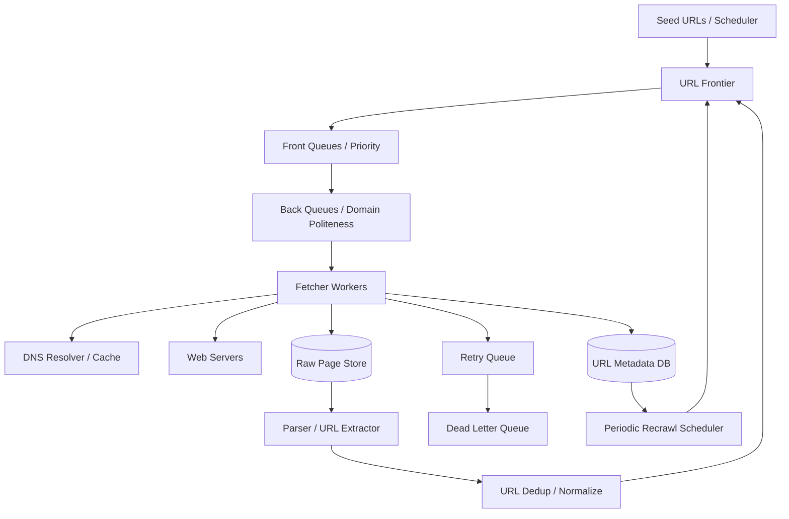

# 设计 Web Crawler 系统

## 功能需求

- 从 seed URL 开始持续发现、调度、下载网页，并抽取新的 URL。
- 支持增量/周期性重爬，避免重复抓取同一 URL 或相同内容。
- 遵守 robots.txt、crawl-delay、domain rate limit 和 politeness。
- 对失败、redirect、动态页面、crawl trap 做处理，并保证不丢进度。

## 非功能需求

- 高吞吐：支持大量 URL 调度和下载。
- 高可靠：worker 失败、DNS 失败、HTTP 失败时不丢任务。
- Politeness：同一 domain 不能被过度并发请求。
- 可扩展：后续可扩展到图片、PDF、网页监控、版权/商标监测等。

## API / 内部接口设计

```text
POST /crawl-jobs
- seeds, scope, max_depth, recrawl_policy, priority

GET /crawl-jobs/{job_id}
- status, discovered_count, fetched_count, failed_count

POST /internal/frontier/enqueue
- url, depth, priority, discovered_from

GET /internal/pages/{url_hash}
- crawl status, content_hash, last_crawled_at

POST /internal/recrawl/schedule
- domain, url_pattern, interval
```

## 高层架构



## 关键组件

### URL Frontier

- 管理待抓取 URL，是 crawler 的调度核心。
- 拆成两个逻辑：
  - Front queues：根据 priority、freshness、job、robots 信息做优先级。
  - Back queues：按 domain/host 管 politeness。
- 注意事项：
  - 不要让 worker 随机从全局队列拿 URL，否则很容易打爆同一 domain。
  - Frontier 要保存 URL 状态，避免重复抓取和进度丢失。

### Front Queues

- 负责 prioritization。
- 可以按 priority/job/domain 分多个队列。
- 注意事项：
  - robots.txt 禁止的 URL 不进入 back queue。
  - 高优先级任务、周期性重爬、重要 domain 可以排前面。
  - 但最终发给 worker 仍要经过 back queue 的 politeness 控制。

### Back Queues

- 负责 politeness。
- 每个 domain/host 一个 back queue 或 token bucket。
- 保存 domain metadata：

```text
domain, crawl_delay, last_crawl_ts, robots_rules, error_rate
```

- 注意事项：
  - 发请求前检查 `now - last_crawl_ts > crawl_delay`。
  - 对慢站点、错误率高站点动态降低频率。
  - 同一 domain 不允许过高并发。

### Fetcher Workers

- 执行 DNS lookup、HTTP fetch、redirect handling、timeout、content download。
- 注意事项：
  - 短 timeout，防止 tarpit 拖死 worker。
  - 本地 DNS cache，减少 DNS 压力。
  - 多 DNS provider fallback。
  - 根据 content-type 决定是否下载 HTML、PDF、图片等。

### Parser / URL Extractor

- 解析 HTML，提取 links、canonical URL、meta refresh redirect、JS 中可能构造的 URL。
- 注意事项：
  - 普通 HTML 用轻量 parser。
  - 动态内容需要 headless browser，如 Puppeteer，但很慢，应只对少量页面使用。
  - 提取的 URL 要 normalize、去重、检查 scope 和 depth。

### URL Metadata DB

- 保存 URL 状态和 crawl metadata：

```text
url_hash, canonical_url, status, depth,
last_crawled_at, last_fetch_status,
content_hash, retry_count, next_crawl_at
```

- 注意事项：
  - URL hash 上建索引。
  - Redirect A -> B 时，A 要标记为 fetched/redirected，避免反复抓 A。
  - 同一内容 hash 可以用于 content dedup。

### Raw Page Store

- 存 raw HTML、headers、fetch metadata。
- 用 object storage。
- 注意事项：
  - 保留 raw content 方便后续 parser 升级后重跑。
  - 存储 key 可以按 domain/url_hash/timestamp 分层。

### Retry / DLQ

- 处理 DNS failure、HTTP timeout、5xx、worker crash。
- 注意事项：
  - 重试要 exponential backoff。
  - 超过最大次数进入 DLQ。
  - DLQ 用于人工分析、规则修复或低频重试。

## 核心流程

### URL 调度

- Scheduler 把 seed URL 放进 Frontier。
- Frontier normalize URL，计算 hash，查 metadata 判断是否已抓过。
- 未抓过或需要重爬的 URL 进入 front queue。
- Front queue 根据 priority 选择 URL。
- URL 进入对应 domain 的 back queue。
- Back queue 检查 domain crawl delay 和 last crawl timestamp。
- 到时间后分配给 Fetcher Worker。

### 网页下载

- Fetcher 获取 URL。
- 查询 DNS cache，必要时访问 DNS provider。
- 发 HTTP 请求，设置 user-agent、timeout、redirect limit。
- 如果 200，写 raw page store，更新 metadata。
- 如果 301/302，记录 redirect 关系，normalize target URL，A 标记为 redirected/fetched，B 重新进入 frontier。
- 如果 timeout/5xx/DNS failure，进入 retry queue。
- 如果多次失败，进入 DLQ。

### 解析和发现新 URL

- Parser 从 raw page store 读取 HTML。
- 提取 anchor links、canonical link、meta refresh、必要时 JS-constructed URLs。
- 对每个 URL 做 normalization：
  - scheme/host lowercase。
  - 去 fragment。
  - query 参数排序。
  - 去默认端口。
  - 处理 trailing slash。
- 检查 depth，例如超过 20 不再加入。
- Bloom filter / metadata DB 判断是否已见过。
- 新 URL 回到 Frontier。

### 周期性重爬

- Recrawl Scheduler 根据 domain policy、页面重要性、历史变化频率计算 `next_crawl_at`。
- 到期后把 URL 放回 Frontier。
- 重爬后比较 content hash。
- 内容未变则只更新 metadata。
- 内容变了则保存新版本并触发 parser/indexer。

## 存储选择

- **Metadata DB：PostgreSQL/MySQL/DynamoDB**
  - 存 URL 状态、canonical URL、hash、retry count、content hash、crawl timestamps。
- **Object Store**
  - 存 raw HTML、headers、rendered content、截图等。
- **Kafka / SQS**
  - 承载 URL task、retry task、parse task。
- **Redis**
  - Bloom filter、domain rate limiter、短期 DNS cache、frontier hot state。
- **Search / Analytics Store**
  - 可选，用于已抓页面索引、监控和调试。

## 扩展方案

- 按 domain hash 或 host hash 分片 Frontier。
- Fetcher worker 水平扩展，但必须受 back queue politeness 限制。
- DNS cache 本地化，Fetcher 尽量按 domain locality 调度，提升连接复用。
- 大型 crawl 分成两个 job：
  - Fetch job：负责下载和存 raw page。
  - Parse/discovery job：负责解析、抽 link、入 frontier。
- 对动态页面单独建低 QPS 渲染池。
- 对失败率高/响应慢 domain 降低 priority 或进入 quarantine。

## 系统深挖

### 1. Queue 可靠性：Kafka vs SQS

- 问题：
  - 如何保证 crawler worker 失败时不丢 URL 进度？
- 方案 A：Kafka + manual retry topic
  - 适用场景：
    - 高吞吐 crawl、需要 replay、需要 consumer group 扩展。
  - ✅ 优点：
    - 吞吐高。
    - 可 replay，适合大规模日志式处理。
    - Consumer group 可自动 rebalance。
  - ❌ 缺点：
    - Kafka 本身没有 message visibility timeout。
    - Exponential backoff、retry count、DLQ 需要自己设计 retry topic。
- 方案 B：SQS
  - 适用场景：
    - 任务队列语义清晰，单条任务只被一个 worker 处理。
  - ✅ 优点：
    - Visibility timeout：worker 拉到消息后，消息暂时对其他 worker 不可见。
    - 处理成功后显式 delete。
    - 原生支持 DLQ，retry 超过次数自动进入 DLQ。
  - ❌ 缺点：
    - 吞吐通常低于 Kafka。
    - 消息模型更像任务队列，不适合大规模 replay 分析。
- 方案 C：Kafka for raw log + SQS for fetch task
  - 适用场景：
    - 既要高吞吐日志，又要可靠任务分发。
  - ✅ 优点：
    - Kafka 保存 crawl log/replay。
    - SQS 管具体 fetch task 的 visibility/retry。
  - ❌ 缺点：
    - 两套系统，运维和一致性更复杂。
- 推荐：
  - 如果强调高吞吐和 replay，用 Kafka + retry topics + DLQ。
  - 如果强调任务不丢和简单 failure handling，用 SQS 更直接。
  - 面试里要主动解释 visibility timeout 和 Kafka offset/retry 语义差异。

### 2. Frontier 设计：单全局队列 vs front/back queues

- 问题：
  - 怎么既支持优先级，又遵守 domain politeness？
- 方案 A：单全局 priority queue
  - 适用场景：
    - 小型 crawler。
  - ✅ 优点：
    - 实现简单。
  - ❌ 缺点：
    - 很难限制同一 domain 抓取频率。
    - 热门 domain 可能被集中请求打爆。
- 方案 B：Front queues + back queues
  - 适用场景：
    - 生产 crawler。
  - ✅ 优点：
    - Front queues 管优先级。
    - Back queues 按 domain 管 politeness。
    - 可以融合 robots.txt crawl-delay。
  - ❌ 缺点：
    - 调度器复杂。
    - 需要维护 domain metadata。
- 方案 C：每个 domain 独立 token bucket
  - 适用场景：
    - Domain 数很多，但 politeness 要严格。
  - ✅ 优点：
    - 速率控制清晰。
    - 可动态调整慢站点。
  - ❌ 缺点：
    - 海量 domain 的 metadata 和 timer 管理复杂。
- 推荐：
  - 用 front/back queue。
  - Back queue 以 domain/host 为粒度，用 domain metadata 控制 crawl delay。

### 3. URL 去重：直接比 URL vs hash index vs Bloom filter

- 问题：
  - 如何避免重复抓取同一个 URL？
- 方案 A：直接比较 URL string
  - 适用场景：
    - 小规模。
  - ✅ 优点：
    - 简单，可解释。
  - ❌ 缺点：
    - URL 很长，占存储。
    - Normalization 不做好会漏掉重复。
- 方案 B：URL normalize 后 hash，metadata DB 上建索引
  - 适用场景：
    - 大多数生产 crawler。
  - ✅ 优点：
    - 查询快，存储小。
    - 支持精确状态管理。
  - ❌ 缺点：
    - DB 写压力大。
    - Hash collision 虽小但要考虑。
- 方案 C：Bloom filter on URL hash
  - 适用场景：
    - 海量 URL，想先快速过滤。
  - ✅ 优点：
    - 内存低，查询快。
    - 可减少 DB lookup。
  - ❌ 缺点：
    - 有 false positive，可能错过少量新 URL。
    - 删除困难，适合 seen-set 而不是精确状态。
- 推荐：
  - Normalize + hash index 是主方案。
  - Bloom filter 做前置加速。
  - 关键 URL 仍回查 metadata DB。

### 4. URL normalization 和 redirect

- 问题：
  - `?a=1&b=2` 和 `?b=2&a=1` 是否同一个 URL？302 怎么处理？
- 方案 A：不 normalize
  - 适用场景：
    - 几乎不适合实际 crawler。
  - ✅ 优点：
    - 简单。
  - ❌ 缺点：
    - 重复抓取严重。
    - Crawl trap 更容易爆炸。
- 方案 B：规则化 normalization
  - 适用场景：
    - 大多数 crawler。
  - ✅ 优点：
    - 减少重复。
    - Query 参数排序、去 fragment、lowercase host 都可控。
  - ❌ 缺点：
    - 某些网站 query 参数顺序或大小写可能有语义。
    - 规则过强可能误合并不同 URL。
- 方案 C：Canonical URL + redirect alias graph
  - 适用场景：
    - 需要高质量索引和去重。
  - ✅ 优点：
    - 可以处理 301/302、canonical link、alias。
    - A redirect 到 B 时 A 标记为 fetched/redirected，避免重复抓 A。
  - ❌ 缺点：
    - 需要维护 alias/canonical mapping。
- 推荐：
  - 使用 conservative normalization。
  - 记录 redirect relation。
  - URL A 302 到 B 时，A 标记为 downloaded/redirected，B 进入 frontier。

### 5. 内容去重：URL dedup vs content hash

- 问题：
  - 不同 URL 可能返回同样内容，怎么去重？
- 方案 A：只做 URL dedup
  - 适用场景：
    - 小型 crawl。
  - ✅ 优点：
    - 简单。
  - ❌ 缺点：
    - Alias、mirror、tracking 参数会导致重复内容。
- 方案 B：content hash
  - 适用场景：
    - 网页内容去重。
  - ✅ 优点：
    - 相同内容可以识别。
    - Metadata table 里存 `url_hash + content_hash`，便于重爬比较。
  - ❌ 缺点：
    - 小改动会导致 hash 完全不同。
    - 需要先下载内容才能判断。
- 方案 C：near-duplicate fingerprint / SimHash
  - 适用场景：
    - 页面模板重复、只变少量文字。
  - ✅ 优点：
    - 能识别近重复页面。
  - ❌ 缺点：
    - 计算和调参复杂。
- 推荐：
  - URL dedup + content hash 是基本款。
  - 大规模搜索索引用 SimHash/MinHash 做近重复。
  - Redis Bloom filter 可做 content hash 前置过滤，但最终状态仍进 metadata DB。

### 6. Failure handling：立即重试 vs exponential backoff vs DLQ

- 问题：
  - DNS failure、timeout、5xx、worker crash 怎么处理？
- 方案 A：立即重试
  - 适用场景：
    - 短暂网络抖动，小规模。
  - ✅ 优点：
    - 实现简单。
  - ❌ 缺点：
    - 容易放大故障。
    - 对慢站点不 polite。
- 方案 B：Exponential backoff retry
  - 适用场景：
    - 绝大多数网络抓取失败。
  - ✅ 优点：
    - 减少对故障站点压力。
    - 给临时故障恢复时间。
  - ❌ 缺点：
    - 任务状态和 retry schedule 更复杂。
- 方案 C：DLQ after max retries
  - 适用场景：
    - 持续失败、解析异常、疑似 trap。
  - ✅ 优点：
    - 避免坏任务无限循环。
    - 便于人工分析和规则修复。
  - ❌ 缺点：
    - DLQ 需要运营和监控，否则会堆积。
- 推荐：
  - 用 exponential backoff + max retry + DLQ。
  - Kafka 需要手动 retry topic；SQS 可以利用 visibility timeout 和 DLQ。

### 7. Crawl trap：depth limit vs URL pattern detection vs tarpit timeout

- 问题：
  - 如何避免无限 URL、日历页、搜索结果页、超慢响应拖垮 crawler？
- 方案 A：depth limit
  - 适用场景：
    - 基础防护。
  - ✅ 优点：
    - 简单，例如 `depth <= 20`。
  - ❌ 缺点：
    - 不能识别同一层级的无限 URL。
- 方案 B：URL pattern / parameter explosion detection
  - 适用场景：
    - 日历、分页、搜索参数无限组合。
  - ✅ 优点：
    - 能过滤大量 spider traps。
  - ❌ 缺点：
    - 规则维护复杂。
    - 可能误杀合法页面。
- 方案 C：Tarpit detection
  - 适用场景：
    - 慢响应、无限 redirect、故意拖慢 crawler。
  - ✅ 优点：
    - 保护 worker 资源。
    - 可对慢站点降级或拉黑。
  - ❌ 缺点：
    - 需要统计和异常检测。
- 推荐：
  - Depth limit + URL pattern detection + short timeout。
  - 对异常 domain 降低 crawl rate 或 quarantine。

### 8. Dynamic content：普通 HTML fetch vs headless browser

- 问题：
  - JavaScript 构造的 URL 或动态内容怎么抓？
- 方案 A：只抓原始 HTML
  - 适用场景：
    - 大多数静态网站。
  - ✅ 优点：
    - 快、便宜、吞吐高。
  - ❌ 缺点：
    - 抓不到 JS 渲染内容和动态链接。
- 方案 B：Headless browser，如 Puppeteer
  - 适用场景：
    - 高价值、强 JS 依赖页面。
  - ✅ 优点：
    - 能看到渲染后的 DOM。
    - 能提取 JS 动态 URL。
  - ❌ 缺点：
    - 很慢，CPU/内存成本高。
    - 容易触发反爬。
- 方案 C：选择性渲染
  - 适用场景：
    - 大规模 crawler。
  - ✅ 优点：
    - 只对高价值或检测到 JS-heavy 页面使用 headless。
    - 成本可控。
  - ❌ 缺点：
    - 需要分类器或规则判断是否渲染。
- 推荐：
  - 默认普通 fetch。
  - 对高价值 JS-heavy 页面进入低 QPS render pool。

### 9. Politeness：固定 delay vs domain adaptive rate limiter

- 问题：
  - 如何限制 worker，避免对同一 domain 请求过多？
- 方案 A：固定 crawl delay
  - 适用场景：
    - 简单 crawler。
  - ✅ 优点：
    - 实现简单。
  - ❌ 缺点：
    - 不同 domain 能力差异大。
- 方案 B：robots.txt crawl-delay + domain metadata
  - 适用场景：
    - 标准 crawler。
  - ✅ 优点：
    - 遵守站点规则。
    - 可记录 `last_url_crawl_ts`。
  - ❌ 缺点：
    - 不是所有站点都设置 crawl-delay。
- 方案 C：adaptive domain rate limiter
  - 适用场景：
    - 大规模 crawler。
  - ✅ 优点：
    - 根据 error rate、latency、429/503 动态降速。
    - 对健康站点提高吞吐。
  - ❌ 缺点：
    - 调参复杂。
- 推荐：
  - Robots + domain metadata 是基础。
  - 生产系统加 adaptive rate limiter。
  - Politeness 应该由 back queues 控制，而不是 worker 自己随便抓。

## 面试亮点

- 可以深挖：Crawler 不应该是一个全局队列，front queues 管 priority，back queues 管 politeness。
- Staff+ 判断点：Kafka 和 SQS failure handling 语义不同，SQS visibility timeout 更像任务队列，Kafka 更像 replayable log。
- 可以深挖：Not losing progress 的核心是 URL metadata 状态机 + retry/DLQ + checkpoint/ack 语义。
- 可以深挖：URL 去重不只是 string compare，normalization、hash index、Bloom filter、redirect alias 都要考虑。
- Staff+ 判断点：动态内容用 headless browser 很贵，必须选择性渲染。
- 可以深挖：Crawl trap/tarpit 是生产 crawler 的核心风险，不只是下载失败重试。

## 一句话总结

- Web crawler 的核心是可靠 URL frontier 和 polite fetching：front queues 决定抓什么，back queues 决定什么时候抓；Fetcher 负责 DNS/HTTP/redirect/retry，Parser 发现新 URL，metadata DB 保障进度不丢，Bloom/hash/content hash 控制重复，DLQ/backoff/tarpit detection 保证系统在真实互联网环境下可持续运行。
