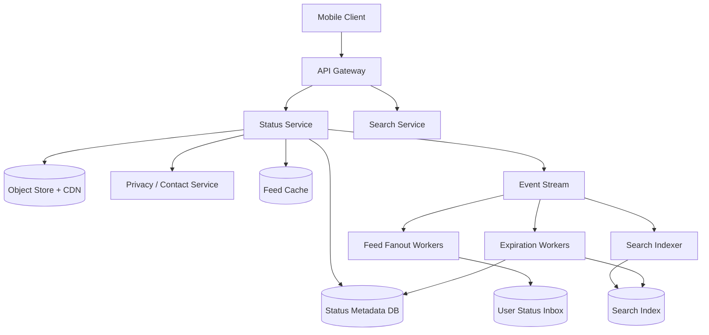

# 设计 WhatsApp Status Feature：包含 Status Search

## 功能需求

- 用户可以发布 24 小时过期的 Status：文本、图片、短视频、caption。
- 用户可以查看联系人/允许访问人群的 Status feed，并看到已读状态。
- 支持隐私控制：只给联系人、排除部分联系人、只给指定联系人。
- 支持搜索 Status：按联系人、caption/text、时间、未读/已读、最近活跃等条件搜索。

## 非功能需求

- 低延迟：Status feed p95 < 200ms，搜索 p95 < 300ms。
- 高写入和高读吞吐：Status 类似 stories，读多写多，且有明显热点用户。
- 隐私和安全优先：搜索不能绕过可见性权限；如果要求端到端加密，服务端不能索引明文。
- 数据生命周期清晰：24 小时自动过期，派生索引、缓存、CDN URL 都要同步失效。

## API 设计

```text
POST /statuses
- request: user_id, media_ids[], text/caption, visibility_policy, client_status_id
- response: status_id, expires_at
- 注意：client_status_id 做幂等，避免客户端重试产生重复 status

GET /statuses/feed?user_id=&cursor=&limit=50
- response: contact_status_groups[], next_cursor
- 返回按联系人聚合后的 status 列表，而不是全局平铺

GET /statuses/{status_id}
- response: media_url/token, text/caption, author_id, expires_at, viewer_state
- 服务端必须校验 viewer 是否有权限

POST /statuses/{status_id}/view
- request: viewer_id, viewed_at, client_event_id
- response: ok
- 幂等写 view receipt

GET /statuses/search?q=&user_id=&cursor=&limit=20&filter=unread|recent|contact
- response: matched_statuses[], matched_contacts[], next_cursor
- 搜索结果必须经过 visibility + expiration 二次校验
```

## 高层架构



## 关键组件

- Status Service
  - 负责发布 status、读取 status、校验权限、管理过期时间和状态机。
  - 不负责全文搜索 ranking，不直接做大规模 fanout。
  - 依赖 Status Metadata DB、Object Store/CDN、Privacy Service、Kafka。
  - 扩展方式：stateless scale，按 `author_id` 或 `status_id` 分片；热点作者通过 cache 和 read replica 承载。
  - 注意事项：发布接口必须幂等；所有读路径都要检查 `expires_at` 和 visibility，不能只相信缓存/索引。

- Media Service / Object Store / CDN
  - 负责图片、视频上传、转码、缩略图、signed URL、CDN 分发。
  - 不保存 status 可见性逻辑，只保存 media object。
  - 扩展方式：大文件走 multipart upload，热点媒体靠 CDN。
  - 注意事项：Status 过期后不一定马上物理删除 media，但 signed URL 必须短 TTL；清理任务异步删除对象。

- Privacy / Contact Service
  - 负责联系人关系、block list、status visibility policy。
  - Status 的可见性可以在发布时快照，也可以读取时动态判断。
  - 注意事项：如果用户发布后修改隐私设置，要定义语义：影响未来 status，还是也影响已发布 status。

- Feed Fanout Worker
  - 负责把新 status 写入允许观看用户的 `User Status Inbox`，优化 feed 读取延迟。
  - 不作为 source of truth；source of truth 仍然是 Status Metadata DB + Privacy。
  - 扩展方式：按 `viewer_id` 分片 worker；大联系人用户可以降级为 fanout-on-read。
  - 注意事项：queue 至少一次投递，写 inbox 必须幂等。

- User Status Inbox
  - 每个用户一份可看的 status read model，字段包含 `viewer_id, author_id, status_id, created_at, expires_at, read_state`。
  - 用于快速构建 Status tray/feed。
  - 注意事项：这是派生数据，可能延迟或漏写；读取时可 fallback 到按联系人拉取最近 status。

- Search Service / Search Indexer
  - 负责 Status search：联系人搜索、caption/text 搜索、未读/最近过滤。
  - Search Index 是派生索引，不是权限判断的最终依据。
  - 扩展方式：按 `viewer_id` 或 `tenant/region + shard` 分片；文本索引用 Elasticsearch/OpenSearch/Lucene，联系人前缀可走 Trie/Redis/DB prefix index。
  - 注意事项：搜索结果返回前必须二次校验 visibility 和 expiration，避免索引延迟导致隐私泄露。

- Expiration Worker
  - 负责扫描/订阅过期 status，删除或标记 expired，并清理 inbox、search index、cache。
  - 扩展方式：时间桶表、延迟队列、DB TTL、Kafka compacted topic 都可以。
  - 注意事项：不能依赖“精确到秒”的 TTL；读路径必须自己判断 `expires_at`。

## 核心流程

- 发布 Status
  - 客户端先上传 media 到 Object Store，拿到 `media_id`。
  - 调用 `POST /statuses`，Status Service 校验用户、幂等 key、隐私 policy。
  - 写 Status Metadata DB，状态为 active，设置 `expires_at = created_at + 24h`。
  - 发 `StatusCreated` event 到 Kafka。
  - Fanout Worker 异步写入 viewer inbox；Indexer 异步更新搜索索引；CDN/thumbnail 异步准备。

- 查看 Status feed
  - Client 调用 `GET /statuses/feed`。
  - Status Service 优先读 Feed Cache / User Status Inbox。
  - 对候选 status 做 expiration、privacy、block list 二次校验。
  - 按联系人聚合，排序：未读联系人优先、最近更新优先。
  - 缓存短 TTL，避免隐私和过期状态长期不一致。

- 搜索 Status
  - Client 调用 `GET /statuses/search?q=...`。
  - Search Service 先查联系人索引和 status text/caption index。
  - 对结果集按 `viewer_id` 权限、`expires_at`、block list 过滤。
  - 返回 matched contacts + matched statuses；如果索引延迟，可以补查最近 inbox 做 recall fallback。
  - 对端到端加密场景，服务端不能搜索 caption 明文，只能做联系人/metadata 搜索，或者改成 client-side local encrypted index。

- Status 过期
  - Expiration Worker 按时间桶/TTL stream/延迟队列发现过期 status。
  - 标记 Status Metadata DB 为 expired。
  - 异步删除 Search Index、User Inbox、Feed Cache、CDN token。
  - 读路径仍以 `expires_at` 判断，避免清理延迟导致过期内容可见。

## 存储选择

- Status Metadata DB
  - 推荐 DynamoDB/Cassandra/ScyllaDB。
  - 主键：`author_id`，排序键：`created_at/status_id`，适合查询某用户最近 status。
  - 字段：`status_id, author_id, media_ids, caption_hash/text?, visibility_policy_id, created_at, expires_at, state`。

- User Status Inbox
  - 推荐 DynamoDB/Cassandra/Redis + durable store。
  - 主键：`viewer_id`，排序键：`created_at/status_id`。
  - 保存 feed read model，支持按用户快速取最近可见 status。

- View Receipt Store
  - 主键：`status_id`，排序键：`viewer_id`，或按 `author_id/status_id` 分区。
  - 读回执量很大，可以先写 Kafka，再异步聚合计数和最近 viewer。

- Search Index
  - 方案一：OpenSearch/Elasticsearch，索引 caption/text、author display name、created_at、expires_at。
  - 方案二：Per-user inverted index / inbox search，按 `viewer_id` 构建可见索引，权限过滤更简单但写放大更高。
  - 方案三：Client-side local index，适合 E2EE caption 搜索。

- Media Store
  - Object Store 保存原图/视频/thumbnail，CDN 分发。
  - URL 使用短 TTL signed URL，不把长期权限交给 CDN。

## 扩展方案

- 小规模：Status Metadata DB + Object Store + 简单拉取联系人 status，搜索只支持联系人和最近 status。
- 中规模：增加 User Status Inbox，发布后异步 fanout，feed 读取稳定低延迟。
- 大规模：大 V / 大联系人用户采用 hybrid fanout，小用户 fanout-on-write，大用户 fanout-on-read。
- 搜索扩展：从联系人搜索开始，逐步加入 caption/text 搜索；E2EE 下使用 client-side encrypted/local index。
- 全球化：按用户 home region 存储 status metadata；跨 region 只复制必要 metadata 和 media manifest，搜索索引 region-local。

## 系统深挖

### 1. Status feed：fanout-on-write vs fanout-on-read vs hybrid

- 问题：
  - WhatsApp Status 读路径要求低延迟，但发布者联系人数量差异很大。

- 方案 A：fanout-on-write
  - 适用场景：普通用户联系人数量有限。
  - ✅ 优点：读 feed 很快，直接读 user inbox；排序和未读状态简单。
  - ❌ 缺点：写放大，发布瞬间要写很多 viewer inbox；大联系人用户容易造成热点。

- 方案 B：fanout-on-read
  - 适用场景：大 V、企业号、超大联系人用户。
  - ✅ 优点：发布成本低，不会因为一个作者写爆 inbox。
  - ❌ 缺点：读 feed 需要查联系人列表和多作者 status，延迟高，容易 scatter-gather。

- 方案 C：hybrid fanout
  - 适用场景：真实大规模社交系统。
  - ✅ 优点：普通用户读快，大联系人用户避免写放大。
  - ❌ 缺点：实现复杂，需要区分作者类型，并在读路径 merge 两类候选。

- 推荐：
  - 选择 hybrid。普通用户 fanout-on-write，大联系人用户 fanout-on-read，并用 cache 缓存大联系人用户最近 active status。

### 2. Search status：服务端索引 vs per-user 可见索引 vs client-side search

- 问题：
  - Status search 最大风险不是搜索本身，而是搜索结果不能泄露没有权限或已经过期的内容。

- 方案 A：全局服务端搜索索引
  - 适用场景：caption/text 不要求 E2EE，或者服务端允许看到明文。
  - ✅ 优点：搜索能力强，支持全文、prefix、ranking、拼写纠错。
  - ❌ 缺点：权限过滤复杂；索引延迟或删除延迟可能造成隐私风险。

- 方案 B：按 viewer 构建可见索引
  - 适用场景：搜索 QPS 高，权限过滤非常严格。
  - ✅ 优点：搜索天然只返回用户可见内容，读路径简单。
  - ❌ 缺点：写放大巨大，一个 status 要写入多个 viewer 的搜索索引。

- 方案 C：client-side local search
  - 适用场景：端到端加密，服务端不能读取 caption/text。
  - ✅ 优点：隐私最好，服务端只提供同步和权限过滤后的密文内容。
  - ❌ 缺点：跨设备同步复杂；只能搜索本地已下载或已同步的 status；新设备 recall 差。

- 推荐：
  - 如果面试强调 WhatsApp 隐私，推荐：服务端只搜索联系人、时间、未读等 metadata；caption/text 搜索放在客户端本地索引。若题目允许服务端明文，则用全局索引 + read-time permission check。

### 3. 权限一致性：发布时快照 vs 读取时动态计算

- 问题：
  - Status 隐私设置、联系人关系、block list 都会变化。搜索和 feed 必须尊重最新权限。

- 方案 A：发布时快照 viewer list
  - 适用场景：语义要求“发布时选择谁能看，之后不变”。
  - ✅ 优点：fanout 和搜索索引稳定，读路径简单。
  - ❌ 缺点：用户 block 某人后，历史 status 是否还能看会变得不符合直觉。

- 方案 B：读取时动态计算权限
  - 适用场景：语义要求 block/unblock 立刻生效。
  - ✅ 优点：隐私更安全，权限变更实时生效。
  - ❌ 缺点：读路径依赖 Privacy Service，延迟和可用性压力更大。

- 方案 C：快照 + deny list 动态覆盖
  - 适用场景：高性能和隐私都需要平衡。
  - ✅ 优点：大多数权限走快照，block/delete 这种强隐私事件动态覆盖。
  - ❌ 缺点：语义更复杂，需要清晰定义优先级。

- 推荐：
  - 使用快照 + 动态 deny 覆盖：发布时确定候选 viewer，读取和搜索返回前始终检查 block list、status state、expires_at。

### 4. 24 小时过期：DB TTL vs 延迟队列 vs 时间桶扫描

- 问题：
  - 过期内容必须不可见，但删除派生数据可以最终一致。

- 方案 A：DB TTL
  - 适用场景：DynamoDB/Cassandra 等支持 TTL 的存储。
  - ✅ 优点：实现简单，自动清理，成本低。
  - ❌ 缺点：TTL 删除不精确；不能作为“到点不可见”的唯一机制。

- 方案 B：延迟队列
  - 适用场景：需要接近实时触发过期事件。
  - ✅ 优点：到期处理及时，可以触发 index/cache/CDN 清理。
  - ❌ 缺点：队列规模巨大，重试和 worker failure 要处理。

- 方案 C：时间桶扫描
  - 适用场景：大规模、可控批处理。
  - ✅ 优点：稳定、可恢复、容易 backfill。
  - ❌ 缺点：分钟级延迟；扫描任务需要避免热点桶。

- 推荐：
  - 读路径强制判断 `expires_at`，清理路径用 TTL + 时间桶扫描。需要更快清理时，再加延迟队列作为优化。

### 5. View receipt：同步写 vs 异步写

- 问题：
  - 每次看 status 都会产生 view event，写量巨大，但它不应该拖慢观看体验。

- 方案 A：同步写 DB
  - 适用场景：低流量或强一致要求展示 view list。
  - ✅ 优点：数据立即可见，逻辑简单。
  - ❌ 缺点：观看路径延迟高，热点 status 可能把 DB 打爆。

- 方案 B：写 Kafka 异步聚合
  - 适用场景：大规模系统。
  - ✅ 优点：观看路径快，削峰填谷，可批量写入 receipt store。
  - ❌ 缺点：作者看到 view list 有延迟；需要幂等和去重。

- 方案 C：客户端批量上报
  - 适用场景：移动端弱网和省电场景。
  - ✅ 优点：减少网络请求，提高电池效率。
  - ❌ 缺点：客户端 crash 可能丢事件；需要本地队列和重试。

- 推荐：
  - Client batch + Event Stream + 异步聚合。View receipt 是最终一致，不应该影响 status 打开延迟。

### 6. Search index freshness 和一致性

- 问题：
  - 新 status 应尽快能搜索到，过期/权限变更后必须不能被搜出来。

- 方案 A：同步写搜索索引
  - 适用场景：低 QPS、强 freshness。
  - ✅ 优点：发布后立刻可搜。
  - ❌ 缺点：搜索索引故障会影响发布主链路。

- 方案 B：Kafka 异步索引
  - 适用场景：高吞吐、可接受秒级延迟。
  - ✅ 优点：解耦主链路；索引可重放、可重建。
  - ❌ 缺点：短暂不可搜索；需要处理乱序和重复事件。

- 方案 C：异步索引 + read-time fallback
  - 适用场景：既要低延迟发布，又希望最近 status 搜索 recall 更好。
  - ✅ 优点：新 status 未进索引时，可从 inbox/metadata 补查最近内容。
  - ❌ 缺点：Search Service 更复杂。

- 推荐：
  - 异步索引 + 返回前强校验。Freshness 用最近 inbox fallback 提升，correctness 由 read-time check 保证。

### 7. 多 Region：home region vs global active-active

- 问题：
  - 用户联系人可能跨国家/地区，Status feed 和搜索要低延迟，同时遵守数据边界。

- 方案 A：按用户 home region 存储
  - 适用场景：大多数用户主要和同区域联系人互动。
  - ✅ 优点：数据边界清晰，写入简单。
  - ❌ 缺点：跨 region 联系人查看可能有额外延迟。

- 方案 B：跨 region 复制 metadata
  - 适用场景：全球社交图很密集，需要本地读。
  - ✅ 优点：跨区域查看更快。
  - ❌ 缺点：复制延迟、删除/过期传播、隐私变更一致性更难。

- 方案 C：active-active 多主
  - 适用场景：极高可用和全球低延迟。
  - ✅ 优点：区域故障影响小。
  - ❌ 缺点：冲突处理、权限撤销、搜索索引一致性复杂度最高。

- 推荐：
  - Status 这种 24 小时短生命周期内容，优先 home region + CDN media + 必要 metadata 异步复制。隐私撤销和过期在读路径强校验。

## 面试亮点

- 先定义 correctness boundary：Status Metadata DB + Privacy 是 source of truth；Inbox、Search Index、Cache 都是派生数据。
- Search 不是简单上 Elasticsearch，核心是“搜索不能绕过 visibility 和 expiration”。
- WhatsApp 场景要主动讨论 E2EE：服务端不能索引明文 caption 时，搜索能力要转向 metadata/search-on-device。
- 过期不能依赖 TTL 的精确删除；读路径必须判断 `expires_at`。
- Feed fanout 要 hybrid：普通用户 fanout-on-write，大联系人/热点用户 fanout-on-read。
- View receipt、search indexing、cache invalidation 都是 at-least-once 异步链路，所以要幂等、可重放、可重建。
- Staff+ 答法重点是把隐私、派生索引一致性、移动端弱网、全球化和短生命周期数据放在同一个设计里权衡。

## 一句话总结

- WhatsApp Status 的核心设计是：Status Metadata + Privacy 做强正确性边界，Feed Inbox/Search Index/Cache 做低延迟派生读模型；搜索必须在 E2EE 和权限约束下设计，任何索引结果返回前都要二次校验可见性和过期时间。
