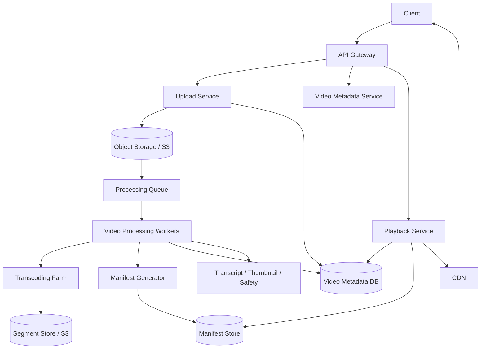

# 设计 YouTube 系统

## 功能需求

- 用户可以上传大视频文件，支持断点续传和大文件分片上传。
- 系统对视频做转码，生成多种 codec、resolution、bitrate 的版本。
- 用户可以流式播放视频，支持 adaptive bitrate streaming。
- 支持视频元数据、搜索/推荐基础信息、播放统计和权限控制。

## 非功能需求

- 上传和转码链路可靠：不能丢文件，失败可重试。
- 播放低延迟、高可用，热门视频能抗热点。
- 存储成本可控，不同清晰度/codec 要按收益取舍。
- 处理链路可扩展：视频大小、上传量、转码任务都可能很大。

## API 设计

```text
POST /videos/uploads
- user_id, file_name, file_size, content_type, checksum
- 返回 upload_id, multipart_upload_urls

PUT /videos/uploads/{upload_id}/parts/{part_number}
- upload chunk, checksum

POST /videos/uploads/{upload_id}/complete
- part_etags, final_checksum

GET /videos/{video_id}
- metadata, status, title, description, available_formats

GET /videos/{video_id}/manifest
- 返回 HLS/DASH primary manifest URL

POST /videos/{video_id}/playback-events
- watch_time, bitrate, rebuffer, client_context
```

## 高层架构



## 关键组件

### Upload Service

- 负责创建 upload session、生成 S3 multipart upload URL、记录分片状态。
- 支持 resumable upload。
- 注意事项：
  - 客户端分片要有 fingerprint/checksum。
  - 服务端记录每个 chunk/part 的上传状态。
  - `complete` 时校验所有 part 和 final checksum。
  - 原始文件写入 object storage 后再进入 processing queue。

### Video Metadata Service

- 管理视频元数据和 processing 状态：

```text
UPLOADING -> UPLOADED -> PROCESSING -> READY / FAILED
```

- 注意事项：
  - 播放前必须确认至少一个可播放版本 ready。
  - 不同 resolution/codec/bitrate 应存在 metadata 表。
  - 状态变化要幂等，处理 worker 可能重复回调。

### Video Processing Workers

- 处理视频 pipeline：
  - split original file into segments。
  - transcode segment。
  - generate thumbnails。
  - extract audio。
  - transcript generation。
  - content safety scan。
  - manifest generation。
- 注意事项：
  - 原始文件可能很大，处理要分 segment 并行化。
  - 每个 segment 任务可重试。
  - 输出需要 versioned path，避免半成品被播放。

### Transcoding Farm

- 使用 ffmpeg 或硬件加速编码。
- 输出多种 format：

```text
240p, 360p, 480p, 720p, 1080p, 4K
H.264, H.265, VP9, AV1
```

- 注意事项：
  - 不一定所有视频都生成所有 codec/resolution。
  - 热门/长生命周期视频值得生成更高压缩效率格式。
  - 冷门视频可能只生成 H.264 + 常见分辨率，节省成本。

### Manifest Generator

- 生成 HLS/DASH manifest。
- 两层 manifest：
  - Primary manifest：列出可用版本/variant streams。
  - Media manifest：列出某个版本对应的 segment URLs。
- 注意事项：
  - Manifest 应该只引用已完成上传的 segments。
  - Segment URL 指向 CDN/object storage。
  - Manifest 本身也适合 CDN cache。

### Playback Service

- 返回播放授权、manifest URL、DRM/signature、可用格式。
- 注意事项：
  - 真正 video segment 流量不走 app server，走 CDN。
  - Playback Service 只在开始播放和鉴权时参与。
  - 热门视频主要由 CDN 承载。

### CDN

- 缓存 manifest 和 video segments。
- 注意事项：
  - 热门视频/热门 segment 会形成 hotspot。
  - 首段 segment、manifest、低清/中清版本通常更热。
  - 可以 pre-warm CDN 或多 CDN fallback。

## 核心流程

### 大文件断点上传

- Client 调 `POST /videos/uploads` 创建 upload session。
- Upload Service 创建 S3 multipart upload，并返回 part upload URLs。
- Client 按 chunk 上传，每个 chunk 带 checksum。
- 服务端记录 chunk fingerprint、part number、etag、status。
- 上传中断后，Client 查询已上传 parts，只补传缺失部分。
- Client 调 complete，服务端校验 part 列表和 final checksum。
- 状态从 `UPLOADING` 转为 `UPLOADED`，发布 processing task。

### 视频处理

- Processing Worker 读取原始文件。
- 用 ffmpeg 把原始视频切成 segments。
- 对每个 segment 进行转码，生成不同 resolution、bitrate、codec 的输出。
- 同时处理 audio、thumbnail、transcript、安全扫描。
- 所有必要 segments 完成后生成 media manifest。
- 再生成 primary manifest，列出所有可用版本。
- Metadata Service 标记视频 `READY`。

### 播放

- Client 打开视频页，获取 metadata。
- Playback Service 返回 primary manifest URL。
- Player 下载 primary manifest，看到可用 resolution/bitrate/codec。
- Player 根据网络、buffer、设备 codec 支持，选择一个 media manifest。
- Player 按 segment 顺序从 CDN 拉取 chunk。
- 网络变差时切到低 bitrate，网络变好时切到高 bitrate。

### 热门视频分发

- 热门视频的 manifest 和前几个 segments 被 CDN 缓存。
- Origin 只在 CDN miss 时访问 object storage。
- 对极热视频可以提前 pre-warm CDN。
- 播放事件异步上报，用于推荐、质量监控和缓存策略。

## 存储选择

- **Object Storage / S3**
  - 存原始上传文件、转码后 segments、thumbnail、audio。
  - 使用 S3 Multipart Upload 支持大文件上传。
- **Video Metadata DB**
  - 存视频状态、owner、title、privacy、processing status。
- **Video Rendition Metadata DB**
  - 存不同版本：

```text
video_id, codec, container, resolution, bitrate,
segment_duration, manifest_url, status
```

- **Segment Metadata DB**
  - 可选，存 segment 到 object key/CDN URL 的映射：

```text
video_id, rendition_id, segment_index, s3_key, duration, size, checksum
```

  - Manifest 里会包含 segment 名称/路径，但 DB 里保留映射方便调试和重建。
- **Manifest Store**
  - 存 HLS/DASH manifest 文件。
- **Queue**
  - Processing task、transcoding segment task、thumbnail/transcript/safety task。
- **Analytics Store**
  - 存播放事件、rebuffer、bitrate、watch time。

## 扩展方案

- 上传路径直传 S3，不让 app server 承担大文件流量。
- Processing pipeline 拆成多个 stage，按 segment 并行处理。
- Transcoding workers 按 codec/resolution 分池，支持 GPU/ASIC/hardware acceleration。
- 热门视频优先生成更多 codec 和高分辨率版本。
- CDN 承载绝大部分播放流量，origin 做保护和限流。
- Manifest 和 segments versioned，避免用户读到半成品。
- 多 region 下，origin 存储跨区复制，CDN 就近分发。

## 系统深挖

### 1. Codec 选择：H.264 vs H.265/HEVC vs VP9 vs AV1

- 问题：
  - 同一个视频要转成哪些 codec？转码成本、兼容性、压缩效率怎么取舍？
- 方案 A：H.264
  - 适用场景：
    - 默认兼容方案，几乎所有设备支持。
  - ✅ 优点：
    - 平台支持最好。
    - 编码速度快。
    - 播放兼容性强。
  - ❌ 缺点：
    - 压缩效率不如 H.265/VP9/AV1。
    - 同等质量下带宽和存储成本更高。
- 方案 B：H.265/HEVC 或 VP9
  - 适用场景：
    - 现代设备、高清/4K 内容。
  - ✅ 优点：
    - 比 H.264 压缩效率更好。
    - 高分辨率下带宽收益明显。
  - ❌ 缺点：
    - HEVC 有授权/兼容性问题。
    - VP9 支持也不是所有平台一致。
    - 编码更慢。
- 方案 C：AV1
  - 适用场景：
    - 热门视频、长生命周期视频、带宽成本敏感。
  - ✅ 优点：
    - 压缩效率很好。
    - 适合大规模播放摊薄编码成本。
  - ❌ 缺点：
    - 编码时间长。
    - 旧设备支持不足。
- 推荐：
  - 默认生成 H.264 保兼容。
  - 热门/高清视频额外生成 VP9/HEVC/AV1。
  - 冷门视频不要一开始生成所有 codec，避免转码成本浪费。

### 2. Manifest：Primary manifest vs Media manifest

- 问题：
  - 播放器如何知道有哪些清晰度、codec、segment？
- 方案 A：单一 manifest 列所有 segment
  - 适用场景：
    - 简单系统或单清晰度视频。
  - ✅ 优点：
    - 简单。
  - ❌ 缺点：
    - 多 resolution/bitrate/codec 时文件大且不清晰。
- 方案 B：Primary manifest + media manifest
  - 适用场景：
    - HLS/DASH adaptive streaming。
  - ✅ 优点：
    - Primary manifest 列出所有 available versions。
    - Media manifest 列出某个 version 的 segment links。
    - 播放器可以动态切换 bitrate。
  - ❌ 缺点：
    - Manifest 生成和版本管理更复杂。
- 方案 C：Manifest metadata 完全放 DB，播放时动态生成
  - 适用场景：
    - 需要强动态授权或个性化 manifest。
  - ✅ 优点：
    - 灵活，可动态加签、过滤版本。
  - ❌ 缺点：
    - Playback Service 压力变大。
    - CDN cache 效果变差。
- 推荐：
  - 使用 HLS/DASH 两层 manifest。
  - DB 存 rendition/segment metadata，manifest 文件放 object storage/CDN。
  - 私有视频可以在 manifest/segment URL 上加签。

### 3. Video processing：整文件转码 vs segment 并行转码

- 问题：
  - 大视频如何快速处理？
- 方案 A：整文件转码
  - 适用场景：
    - 小视频、低吞吐系统。
  - ✅ 优点：
    - 实现简单。
    - 不需要处理 segment 拼接一致性。
  - ❌ 缺点：
    - 大文件处理慢。
    - 失败后重试成本高。
- 方案 B：Split into segments 后并行转码
  - 适用场景：
    - 大视频、高吞吐平台。
  - ✅ 优点：
    - 可以并行处理。
    - 单个 segment 失败可局部重试。
    - 更适合 HLS/DASH。
  - ❌ 缺点：
    - 需要处理 GOP/keyframe 边界。
    - Segment 输出一致性和 manifest 生成更复杂。
- 方案 C：分阶段 pipeline
  - 适用场景：
    - 生产系统。
  - ✅ 优点：
    - Split、transcode、thumbnail、audio、transcript、safety 可独立扩展。
    - 失败和重试更清晰。
  - ❌ 缺点：
    - 编排复杂，需要任务状态机。
- 推荐：
  - 用 segment 并行转码 + staged processing pipeline。
  - 每个 segment/rendition task 幂等，可重试。

### 4. Upload：普通上传 vs resumable multipart upload

- 问题：
  - 用户上传大文件，中途断网怎么办？
- 方案 A：单请求上传到 app server
  - 适用场景：
    - 小文件。
  - ✅ 优点：
    - 简单。
  - ❌ 缺点：
    - App server 带宽压力大。
    - 大文件失败后要重传。
- 方案 B：S3 Multipart Upload
  - 适用场景：
    - 大视频文件。
  - ✅ 优点：
    - Client 直传 object storage。
    - 支持分片并行和断点续传。
    - App server 不承载大流量。
  - ❌ 缺点：
    - 需要管理 upload session、part etag、complete。
- 方案 C：自研 resumable upload protocol
  - 适用场景：
    - 需要跨云或复杂客户端控制。
  - ✅ 优点：
    - 灵活。
  - ❌ 缺点：
    - 实现和兼容成本高。
- 推荐：
  - 用 S3 Multipart Upload。
  - 服务端记录 client chunks 的 fingerprint/status，支持 resume。
  - Complete 阶段校验 checksum 后进入 processing。

### 5. Adaptive bitrate streaming：固定码率 vs ABR

- 问题：
  - 不同网络和设备如何获得稳定播放体验？
- 方案 A：单一码率播放
  - 适用场景：
    - 简单系统或内部视频。
  - ✅ 优点：
    - 存储和处理简单。
  - ❌ 缺点：
    - 网络差时卡顿。
    - 网络好时画质不够。
- 方案 B：HLS/DASH adaptive bitrate streaming
  - 适用场景：
    - 生产视频平台。
  - ✅ 优点：
    - Player 根据带宽和 buffer 动态切换清晰度。
    - 降低 rebuffer，提高观看体验。
  - ❌ 缺点：
    - 需要生成多种 rendition 和 manifest。
    - 存储和转码成本更高。
- 方案 C：按设备/网络选择有限 rendition
  - 适用场景：
    - 成本敏感平台。
  - ✅ 优点：
    - 控制转码和存储成本。
  - ❌ 缺点：
    - 播放体验不如完整 ABR ladder。
- 推荐：
  - 使用 HLS/DASH ABR。
  - 冷门视频生成少量常用 rendition；热门视频补齐更完整 ladder。

### 6. CDN 和热点视频：Origin serving vs CDN cache

- 问题：
  - 热门视频播放量巨大，如何避免 origin 被打爆？
- 方案 A：App server/origin 直接 serve video
  - 适用场景：
    - 不适合大规模视频平台。
  - ✅ 优点：
    - 简单。
  - ❌ 缺点：
    - 带宽成本和延迟不可接受。
    - 热门视频会打爆 origin。
- 方案 B：CDN serve manifest 和 segments
  - 适用场景：
    - 生产视频平台。
  - ✅ 优点：
    - 就近分发，低延迟。
    - 热点由 CDN 吸收。
    - App server 不走视频流量。
  - ❌ 缺点：
    - CDN miss 会回源。
    - Cache invalidation 和签名 URL 需要设计。
- 方案 C：多 CDN + pre-warm
  - 适用场景：
    - 超热视频、全球业务。
  - ✅ 优点：
    - 降低单 CDN 风险。
    - 热门内容预热减少首波回源。
  - ❌ 缺点：
    - 多 CDN 调度复杂，成本更高。
- 推荐：
  - Manifest 和 segments 都走 CDN。
  - 热门视频 pre-warm CDN。
  - Origin object storage 做保护和限流。

### 7. Processing failure：同步处理 vs 队列化状态机

- 问题：
  - 转码、thumbnail、transcript、safety 任一失败怎么办？
- 方案 A：同步处理完整 pipeline
  - 适用场景：
    - 小系统或后台工具。
  - ✅ 优点：
    - 简单。
  - ❌ 缺点：
    - 大文件耗时长。
    - 失败重试困难。
- 方案 B：队列化任务 + 状态机
  - 适用场景：
    - 生产视频处理。
  - ✅ 优点：
    - 每个 stage 可重试。
    - 失败可定位到具体 rendition/segment。
    - Worker 可按 codec/resolution 水平扩展。
  - ❌ 缺点：
    - 状态管理复杂。
- 方案 C：Workflow engine
  - 适用场景：
    - 处理 DAG 很复杂，依赖多。
  - ✅ 优点：
    - 任务依赖、重试、超时、补偿更清晰。
  - ❌ 缺点：
    - 引入额外平台和成本。
- 推荐：
  - 用 queue + processing state machine。
  - 复杂 DAG 可用 workflow engine。
  - 上传 complete 不代表视频 ready，要等必要 rendition 和 manifest 完成。

## 面试亮点

- 可以深挖：Codec 选择不是越新越好，要平衡编码时间、平台支持、压缩效率、质量和成本。
- Staff+ 判断点：Manifest 分 primary 和 media，两层结构支撑 HLS/DASH adaptive streaming。
- 可以深挖：大文件上传要用 S3 Multipart Upload + client chunk fingerprint/status 支持断点续传。
- Staff+ 判断点：视频处理要 segment 并行化，每个 segment/rendition 幂等重试，而不是整文件失败重来。
- 可以深挖：冷门视频不一定生成所有 codec/resolution，热门视频才值得补齐 AV1/4K 等高成本版本。
- Staff+ 判断点：播放流量不应该经过 app server，manifest 和 segment 都应该走 CDN。

## 一句话总结

- YouTube 的核心是把上传、处理和播放解耦：大文件通过 multipart 直传 object storage，processing pipeline 分 segment 并行转码并生成 HLS/DASH manifest，播放端通过 CDN 拉 manifest 和 video segments，用 adaptive bitrate 根据网络和设备动态选择最佳版本。
