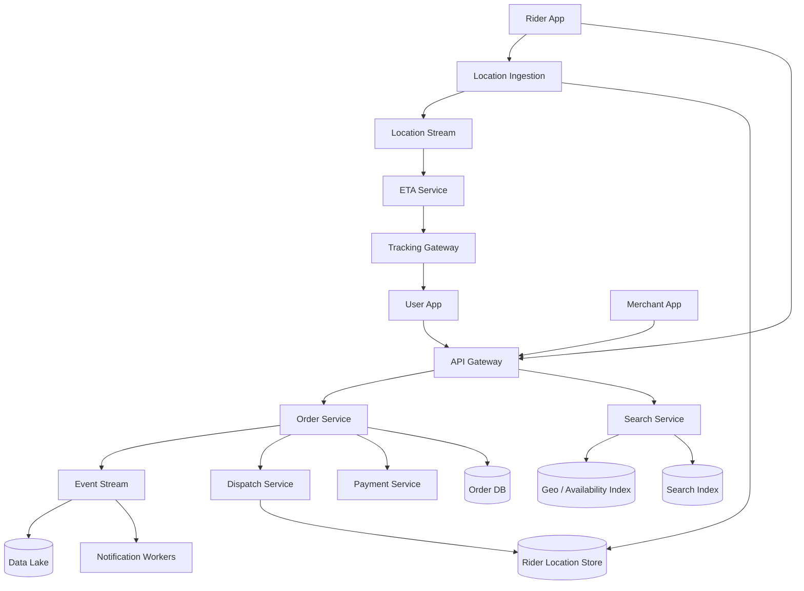

# 设计 Food Ordering + Delivery 系统

## 功能需求

- 用户可以搜索餐馆/菜品，按位置、菜系、价格、评分、预计送达时间过滤和排序。
- 用户可以创建订单、支付、取消订单，并看到订单状态变化。
- 商家可以接单、备餐、更新菜品可用性和营业状态。
- 下单后用户可以看到 rider 实时位置、配送状态和 ETA。

## 非功能需求

- 低延迟：搜索 p95 < 300ms，下单核心链路 p95 < 500ms，位置更新端到端延迟 < 2-5s。
- 正确性：不能重复扣款、不能重复创建订单、订单状态必须单调推进。
- 高可用：搜索/推荐可以降级，下单和支付链路要更强可靠。
- 实时性：rider 位置、ETA、餐馆营业状态、菜单库存要快速更新，但允许短暂最终一致。

## API 设计

```text
GET /restaurants/search?q=&lat=&lng=&filters=&cursor=&limit=20
- response: restaurants[], dishes[], next_cursor
- 搜索餐馆/菜品，返回可配送、营业中或可预订的结果

POST /orders
- request: user_id, restaurant_id, items[], address_id, payment_method_id, idempotency_key
- response: order_id, status, estimated_total, eta
- idempotency_key 防止重复点击下单

GET /orders/{order_id}
- response: order_status, restaurant_status, rider_status, eta, payment_status
- 订单详情和状态查询

POST /orders/{order_id}/events
- request: actor_type, actor_id, event_type, timestamp
- response: accepted
- 商家/rider/系统状态事件，如 accepted, prepared, picked_up, delivered

GET /orders/{order_id}/tracking/stream
- response: SSE/WebSocket stream of rider_location, eta, order_status
- 用户端实时看 rider 位置和 ETA

POST /riders/{rider_id}/locations
- request: lat, lng, heading, speed, timestamp, sequence_id
- response: accepted
- rider app 高频位置更新
```

## 高层架构



## 关键组件

- Search Service
  - 负责餐馆/菜品搜索、过滤和排序。
  - 不作为餐馆状态 source of truth；搜索索引只是派生数据。
  - 依赖 Search Index、Geo/Availability Index、Restaurant DB、Menu DB、Ranking Service。
  - 扩展方式：按 city/region 分片；热门 query 和附近热门餐馆做 cache。
  - 注意事项：搜索结果返回前要做实时可用性校验，例如是否营业、是否配送到用户地址、菜单是否售罄。

- Restaurant/Menu Service
  - 负责餐馆资料、营业时间、配送范围、菜单、价格、菜品库存。
  - 不负责订单状态机。
  - 依赖 Restaurant DB、Menu DB、CDC/事件流更新搜索索引。
  - 扩展方式：读多写少，cache + read replica；按 restaurant_id 分片。
  - 注意事项：菜单价格和库存变动要版本化，订单应保存下单时的 menu snapshot，避免后续价格变化影响历史订单。

- Order Service
  - 负责订单创建、状态机、幂等、取消、退款触发。
  - 是订单状态的 source of truth。
  - 依赖 Order DB、Payment Service、Restaurant/Menu Service、Dispatch Service、Event Bus。
  - 扩展方式：按 order_id 或 restaurant_id 分片；状态更新走乐观锁或条件写。
  - 注意事项：订单状态必须单调推进，例如 `created -> payment_authorized -> merchant_accepted -> preparing -> ready -> picked_up -> delivered`。

- Payment Service
  - 负责授权、扣款、退款和支付状态回调。
  - 不直接推进业务订单到 delivered，只提供支付结果事件。
  - 依赖外部 PSP、Payment DB、idempotency store。
  - 扩展方式：异步处理 PSP webhook；按 payment_id 分片。
  - 注意事项：支付和订单不是同一个事务，必须用 saga/状态机处理失败和补偿。

- Dispatch Service
  - 负责给订单分配 rider，处理 rider 接单、拒单、超时、重新派单。
  - 依赖 Rider Location Store、Rider Availability Store、ETA Service、Order Service。
  - 扩展方式：按 city/zone 分片；热点区域独立 worker pool。
  - 注意事项：同一个 rider 不能被同时分配给冲突订单，需要 rider lease/conditional update。

- Location Ingestion Service
  - 接收 rider app 高频位置更新。
  - 不负责长期历史分析，只更新当前 rider 位置并写入 stream。
  - 依赖 Rider Location Store、Location Stream。
  - 扩展方式：按 rider_id 或 geo cell 分片；批量写入；客户端 adaptive update interval。
  - 注意事项：位置更新要带 sequence_id/timestamp，服务端丢弃旧位置；store 设置 TTL 自动过期。

- ETA Service
  - 根据 restaurant、user、rider 实时位置、路况、备餐时间、历史配送时间计算 ETA。
  - 可以先规则模型，后续升级 ML model。
  - 依赖地图/路由服务、实时位置、订单状态、历史数据。
  - 扩展方式：缓存 route estimate；按 city 部署。
  - 注意事项：ETA 是估计值，要提供置信区间或平滑更新，避免用户端 ETA 抖动。

- Tracking Gateway
  - 向用户端推送 order status、rider location、ETA。
  - 支持 WebSocket 或 SSE；断线后客户端可通过 cursor/resume 拉取最新状态。
  - 扩展方式：stateless gateway + pub/sub；按 order_id/user_id 路由。
  - 注意事项：实时推送不是 source of truth；客户端重连后要从 Order DB/Rider Location Store 补最新状态。

- Event Bus / Notification Workers
  - 承载订单事件、支付事件、派单事件、位置事件的异步处理。
  - 不保证 exactly once，消费者必须幂等。
  - 扩展方式：Kafka/PubSub 按 order_id/restaurant_id/rider_id 分区。
  - 注意事项：订单状态相关事件最好按 order_id 保序，避免状态倒退。

## 核心流程

- 搜索餐馆/菜品
  - 用户输入 query 和当前位置。
  - Search Service 查询 Search Index 获取文本相关候选。
  - Geo/Availability 过滤不可配送、太远、关店、超负载餐馆。
  - Ranking 根据距离、评分、价格、预计 ETA、历史偏好、促销排序。
  - 返回前短 TTL 校验餐馆营业状态和菜单可用性。

- 下单
  - 用户提交购物车、地址、支付方式和 idempotency_key。
  - Order Service 校验餐馆营业、配送范围、菜品价格/库存、用户地址。
  - 创建 order，保存菜单快照和价格明细，状态为 `created`。
  - Payment Service 授权支付，成功后 Order Service 推进到 `payment_authorized`。
  - 通知 Merchant App 接单；商家确认后进入 `merchant_accepted/preparing`。
  - Dispatch Service 开始派 rider 或根据备餐时间延迟派单。

- 派单和配送
  - Dispatch Service 根据餐馆位置、rider 当前位置、可用状态、当前任务、ETA 选择候选 rider。
  - 对目标 rider 写入 lease，TTL 例如 10-30 秒，等待 rider 接单。
  - rider 接单后订单绑定 rider_id；拒绝/超时则释放 lease 并重新派单。
  - rider 到店取餐后状态变为 `picked_up`，送达后变为 `delivered`，Payment Service 捕获/结算支付。

- 实时位置和 ETA
  - Rider App 每隔几秒上传位置；如果静止或低速，可降低频率；转弯/高速/接近目的地提高频率。
  - Location Service 更新 Rider Location Store，并把事件写入 Location Stream。
  - ETA Service 消费位置和订单状态，重新计算 ETA。
  - Tracking Gateway 通过 WebSocket/SSE 推送 rider location、ETA、订单状态给用户。
  - 客户端断线后用 `GET /orders/{order_id}` 拉最新状态，再恢复 stream。

- 状态事件和通知
  - Order Service 每次状态变化写 Order DB，并发布 `OrderStatusChanged`。
  - Notification Worker 推送短信/app push/email 给用户、商家和 rider。
  - Analytics 消费事件做运营分析、ETA 训练、配送效率分析。

## 存储选择

- Order DB
  - PostgreSQL/MySQL 或 DynamoDB。
  - 保存订单状态机、金额、菜单快照、用户地址快照、restaurant_id、rider_id。
  - 如果用关系型 DB，按 order_id 主键，restaurant_id/user_id 建索引；如果用 DynamoDB，按 user_id/order_id 或 order_id 分区，并用 GSI 支持商家看订单。

- Restaurant/Menu DB
  - PostgreSQL/DynamoDB。
  - 保存餐馆、菜单、价格、营业时间、配送范围、库存状态。
  - CDC 更新 Search Index 和 Availability Cache。

- Search Index
  - Elasticsearch/OpenSearch。
  - 保存餐馆名、菜品名、标签、菜系、评分等可搜索字段。
  - 派生索引，不做最终库存/营业状态判断。

- Geo / Availability Index
  - H3/S2/Geohash + Redis/PostGIS。
  - 保存餐馆配送区域、rider 当前 geo cell、区域热度。
  - PostGIS 适合复杂配送 polygon，H3/S2 适合在线召回和分片。

- Rider Location Store
  - Redis/DynamoDB/Cassandra。
  - key: `rider_id -> lat/lng/speed/heading/timestamp/order_id`，TTL 例如 1-5 分钟。
  - 可按 geo cell 维护可用 rider set，用于派单 proximity search。

- Event Stream
  - Kafka/PubSub/Kinesis。
  - 订单事件按 order_id 分区，位置事件按 rider_id 或 city/geo cell 分区。

- Data Lake
  - S3/HDFS + Parquet/Iceberg。
  - 保存历史订单、位置轨迹、ETA 结果、搜索曝光/点击，用于模型训练和运营分析。

## 扩展方案

- 早期：单 region，多 AZ；Search Index + Order DB + Redis rider location；简单最近 rider 派单。
- 中期：按 city/zone 分片搜索、订单和派单；ETA 用实时路由 + 历史备餐时间。
- 大规模：geo-sharding，rider location 高频写入按 geo cell 分片；热门区域独立 dispatch workers。
- 实时链路：Tracking Gateway 横向扩展，WebSocket/SSE 只做推送，不保存最终状态。
- 全球化：每个国家/城市独立部署核心订单和配送系统，跨 region 只同步用户、支付、分析等必要数据。

## 系统深挖

### 1. 搜索：Search Index vs DB Query vs Cache

- 问题：
  - 用户要搜餐馆和菜品，还要按位置、营业状态、ETA、评分排序。

- 方案 A：直接查 DB
  - 适用场景：小规模、搜索功能简单。
  - ✅ 优点：source of truth，数据一致性强。
  - ❌ 缺点：全文搜索、模糊匹配、相关性排序弱；高 QPS 压力大。

- 方案 B：Elasticsearch/OpenSearch
  - 适用场景：需要文本搜索、菜品搜索、相关性排序。
  - ✅ 优点：搜索能力强，支持 inverted index、filter、ranking。
  - ❌ 缺点：索引是异步派生数据，可能和 DB 状态短暂不一致。

- 方案 C：热门 query/cache + 搜索索引
  - 适用场景：高 QPS 和重复 query 很多。
  - ✅ 优点：降低搜索成本，热门词延迟低。
  - ❌ 缺点：个性化、位置和实时营业状态会降低缓存命中率。

- 推荐：
  - 用 Search Index 做召回和文本相关性，返回前通过 Availability/Restaurant Service 做最终校验。热门 query 缓存候选，不缓存最终排序。

### 2. 下单一致性：同步事务 vs Saga

- 问题：
  - 下单涉及订单、支付、商家接单、库存、派单，不可能放进一个本地事务。

- 方案 A：单体事务
  - 适用场景：早期单 DB、小规模。
  - ✅ 优点：实现简单，一致性强。
  - ❌ 缺点：跨支付外部系统和派单系统不可行，扩展差。

- 方案 B：两阶段提交
  - 适用场景：内部多个强事务资源，且参与方支持 2PC。
  - ✅ 优点：理论一致性强。
  - ❌ 缺点：外部支付/商家/rider 不支持；阻塞和故障恢复复杂。

- 方案 C：Saga + 状态机
  - 适用场景：真实订单系统。
  - ✅ 优点：每步本地提交，通过事件推进；失败可补偿，例如退款、取消、重新派单。
  - ❌ 缺点：状态机和补偿逻辑复杂，最终一致。

- 推荐：
  - 用 Saga + order state machine。订单状态是 source of truth；支付授权失败取消订单，商家拒单触发退款，rider 超时触发重新派单。

### 3. 重复下单和重复扣款

- 问题：
  - 用户可能重复点击，客户端/网关/支付回调都可能重试。

- 方案 A：前端禁用按钮
  - 适用场景：改善 UX。
  - ✅ 优点：减少重复请求。
  - ❌ 缺点：不能作为正确性保障，网络重试仍会发生。

- 方案 B：订单 idempotency key
  - 适用场景：所有下单 API。
  - ✅ 优点：同一个用户同一个 key 只创建一次订单。
  - ❌ 缺点：需要保存 key 到结果的映射，并设置合理 TTL。

- 方案 C：支付幂等 + webhook 去重
  - 适用场景：支付系统必须具备。
  - ✅ 优点：避免重复扣款；PSP 回调重复也能安全处理。
  - ❌ 缺点：要管理 payment_id、external_payment_id、回调状态。

- 推荐：
  - 下单 API 使用 idempotency key，Payment Service 也使用独立 payment idempotency key。订单和支付都要幂等，不能只靠一个层面。

### 4. Rider 派单：最近 rider vs 优化匹配

- 问题：
  - 派单既要快，也要提高整体配送效率。

- 方案 A：选择最近空闲 rider
  - 适用场景：早期系统、订单密度低。
  - ✅ 优点：实现简单，响应快。
  - ❌ 缺点：不考虑备餐时间、rider 当前任务、未来需求，整体效率不一定最优。

- 方案 B：规则打分
  - 适用场景：中等规模。
  - ✅ 优点：可解释，能考虑距离、ETA、接单率、当前负载。
  - ❌ 缺点：规则调参复杂，区域差异大。

- 方案 C：批量匹配/优化算法
  - 适用场景：高密度城市和高峰期。
  - ✅ 优点：可以全局优化等待时间、空驶距离和准时率。
  - ❌ 缺点：计算复杂，等待 batching window 会增加单个订单延迟。

- 推荐：
  - 常规用规则打分；高峰和高密度区域用短窗口 batch matching。接单 lease 使用 TTL，避免同一 rider 被多个订单占用。

### 5. Rider 实时位置：Push vs Pull，WebSocket vs SSE

- 问题：
  - 用户希望看到 rider 位置实时移动，但位置是高频更新，不能每个用户疯狂轮询。

- 方案 A：Client polling
  - 适用场景：低频状态查询。
  - ✅ 优点：实现简单，连接成本低。
  - ❌ 缺点：实时性差，高频 polling 浪费资源。

- 方案 B：SSE
  - 适用场景：服务端单向推送位置和 ETA。
  - ✅ 优点：比 WebSocket 简单，天然适合 user 只接收更新。
  - ❌ 缺点：只支持服务端到客户端；移动端/代理兼容性要验证。

- 方案 C：WebSocket
  - 适用场景：订单 tracking、商家/rider 实时状态、双向通信。
  - ✅ 优点：实时性好，双向能力强。
  - ❌ 缺点：连接管理和扩容更复杂，gateway failure 要支持重连恢复。

- 推荐：
  - 用户看 rider 位置可以用 SSE 或 WebSocket；如果系统已有实时通信能力，选 WebSocket。无论哪种，推送只是派生状态，重连后要从 source of truth 补最新位置和订单状态。

### 6. Rider Location Store：按 rider_id vs geo cell

- 问题：
  - 同时要支持“查询某个 rider 当前在哪里”和“找附近可用 rider”。

- 方案 A：按 rider_id 存当前位置
  - 适用场景：订单 tracking。
  - ✅ 优点：查询单 rider 很快，更新简单。
  - ❌ 缺点：找附近 rider 需要额外索引。

- 方案 B：按 geo cell 维护 rider set
  - 适用场景：派单 proximity search。
  - ✅ 优点：查附近可用 rider 快，可按 city/zone 分片。
  - ❌ 缺点：rider 移动时需要从旧 cell 删除、加入新 cell，处理旧位置和 TTL 更复杂。

- 方案 C：双写 rider_id current + geo index
  - 适用场景：真实系统。
  - ✅ 优点：tracking 和 dispatch 都高效。
  - ❌ 缺点：双写一致性要处理，可能出现 geo index 残留旧 rider。

- 推荐：
  - 双写 current location 和 geo cell index。位置带 timestamp/sequence_id，geo index 用 TTL 和 periodic cleanup 处理残留。

### 7. ETA：规则估算 vs ML 估算

- 问题：
  - ETA 影响用户体验、搜索排序和派单决策。

- 方案 A：规则估算
  - 适用场景：早期系统。
  - ✅ 优点：简单可解释，冷启动快。
  - ❌ 缺点：无法捕捉餐馆备餐差异、天气、交通、高峰拥堵。

- 方案 B：地图路线时间 + 历史备餐时间
  - 适用场景：中期系统。
  - ✅ 优点：准确度显著提升，成本可控。
  - ❌ 缺点：地图 API 成本高；实时交通和餐馆状态仍有误差。

- 方案 C：ML ETA
  - 适用场景：大规模、有足够历史数据。
  - ✅ 优点：能利用餐馆、rider、天气、时间、区域、历史误差做校准。
  - ❌ 缺点：训练复杂，线上要监控 drift；解释性较弱。

- 推荐：
  - 先用 route estimate + 历史备餐分位数，后续升级 ML ETA。用户端展示做平滑，避免每次位置更新 ETA 大幅跳动。

### 8. Cache 和派生数据一致性

- 问题：
  - 搜索索引、菜单缓存、餐馆营业状态、位置缓存都可能和 DB 不一致。

- 方案 A：强同步更新所有派生数据
  - 适用场景：小规模。
  - ✅ 优点：读到旧数据概率低。
  - ❌ 缺点：写链路依赖太多，任何索引/cache 故障会影响主业务。

- 方案 B：CDC/Event async update
  - 适用场景：大规模读模型。
  - ✅ 优点：解耦主写入；索引可重放重建。
  - ❌ 缺点：短暂不一致，用户可能看到已售罄/关店餐馆。

- 方案 C：异步更新 + read-time validation
  - 适用场景：订单/搜索系统。
  - ✅ 优点：搜索快，同时下单前保证正确。
  - ❌ 缺点：需要额外校验和降级逻辑。

- 推荐：
  - Search/Menu/Availability 用异步派生数据，但下单前必须 read-time validate source of truth：餐馆营业、菜单价格、库存、配送范围。

### 9. 故障处理：支付、商家、rider、位置链路

- 问题：
  - 下单后可能支付失败、商家不接单、rider 不响应、位置更新中断。

- 方案 A：同步等待所有步骤完成
  - 适用场景：流程很短的小系统。
  - ✅ 优点：用户立刻知道最终结果。
  - ❌ 缺点：外部系统慢会拖垮下单体验。

- 方案 B：订单状态机 + 异步事件
  - 适用场景：真实外卖系统。
  - ✅ 优点：每步可重试、可超时、可补偿。
  - ❌ 缺点：状态和边界条件多，需要良好可观测性。

- 方案 C：Workflow engine
  - 适用场景：复杂流程和长时间订单。
  - ✅ 优点：超时、重试、补偿、人工介入更清晰。
  - ❌ 缺点：引入 Temporal/Step Functions 等复杂度。

- 推荐：
  - 订单核心用状态机；超时和补偿可用 workflow engine。rider 不响应触发重新派单，商家超时触发取消/退款，位置中断时 fallback 到最后位置 + ETA 降级提示。

## 面试亮点

- 搜索索引、Geo index、菜单 cache 都是派生数据；下单前必须校验 source of truth，避免用户买到不可用商品。
- 订单状态机是系统正确性的核心，状态必须单调推进，所有外部回调都要幂等。
- 支付和订单不能靠分布式事务硬凑，真实系统用 Saga/补偿：授权失败取消，商家拒单退款，rider 超时重新派单。
- Rider location 要同时支持 `rider_id -> location` 和 `geo cell -> rider set` 两种读模式。
- 实时位置推送不是 source of truth，WebSocket/SSE 断线后必须能从 Order DB 和 Location Store 恢复。
- ETA 不是单个地图 API 问题，它同时影响搜索排序、派单、用户体验和 SLA，需要持续校准。
- Staff+ 答法要把不同链路的 consistency 分级：下单/支付强正确，搜索/ETA/位置最终一致但要 read-time validation 和 graceful degradation。

## 一句话总结

- Food ordering + delivery 的核心是：搜索用派生索引快速召回，下单用订单状态机和 Saga 保证正确性，派单用 geo + rider lease 防止重复分配，配送中用高频位置流、ETA 服务和 WebSocket/SSE 推送给用户，同时所有实时读模型都不能替代订单和餐馆库存的 source of truth。
