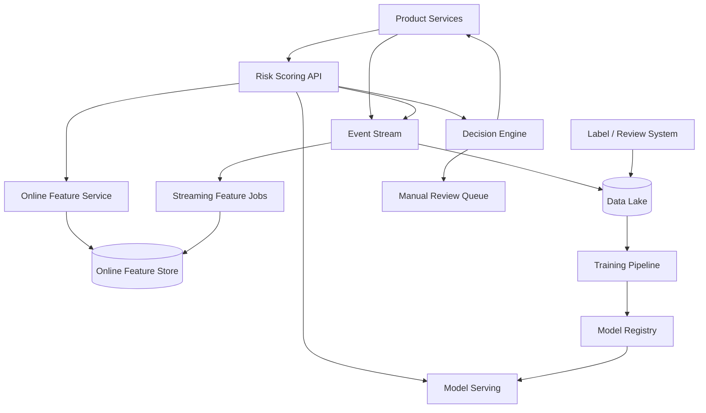

# 设计抓高风险账户的 ML Pipeline

## 功能需求

- 对账户进行风险识别：注册、登录、支付、发帖、加好友、提现等关键行为触发风险评分。
- 支持实时拦截和异步处置：allow、challenge、rate limit、manual review、suspend。
- 支持离线训练、模型发布、在线推理和 A/B 测试。
- 支持人工审核和用户申诉结果回流，持续改进 label 和模型。

## 非功能需求

- 低延迟：同步风控打分 p95 < 50-100ms，不能明显拖慢核心业务。
- 高可靠：风控服务不可用时要有 graceful degradation，不能让核心业务全挂。
- 高准确：高风险账户 recall 重要，但要控制 false positive，避免误杀正常用户。
- 可解释和可审计：每次风险决策要记录 model version、features、rule hit、decision reason。

## API 设计

```text
POST /risk/score
- request: account_id, action_type, request_context, idempotency_key
- response: risk_score, risk_level, decision, reasons[], model_version
- 同步链路，用于注册/登录/支付等关键动作

POST /risk/events
- request: account_id, event_type, event_time, attributes
- response: accepted
- 异步事件采集，用于训练和实时特征更新

POST /risk/review-tasks
- request: account_id, risk_case_id, priority, evidence
- response: review_task_id
- 创建人工审核任务

POST /risk/labels
- request: account_id, source, label, label_time, confidence
- response: accepted
- 接收人工审核、申诉、chargeback、abuse report 等 label

GET /risk/cases/{case_id}
- response: account_id, decision, score, features, reasons, reviewer_history
```

## 高层架构



## 关键组件

- Risk Scoring API
  - 负责在线风险评分入口，接收业务上下文，拉取特征，调用模型，执行决策。
  - 不负责训练模型，也不直接修改账户状态；账户状态变更通过 Decision Engine 或 Case Service 落库。
  - 依赖 Online Feature Store、Model Serving、Decision Engine、Experiment Service。
  - 扩展方式：stateless scale；按 action_type 配置超时和 fallback。
  - 注意事项：同步链路必须有严格 timeout；所有请求记录 `model_version + feature_version + decision_reason`。

- Event Collection / Event Stream
  - 收集注册、登录、设备、IP、支付、社交互动、举报、封禁、申诉等事件。
  - 不做复杂业务判断，只保证事件可靠进入 Kafka/PubSub。
  - 扩展方式：按 `account_id` partition，保证同账户事件相对有序。
  - 注意事项：事件必须带 event_time、ingest_time、schema_version；重复事件用 event_id 去重。

- Online Feature Service
  - 负责低延迟读取实时特征：过去 5 分钟登录失败次数、设备关联账户数、IP 风险分、支付失败率等。
  - 不负责复杂离线 join 和训练样本构造。
  - 依赖 Redis/DynamoDB/Cassandra 等 Online Feature Store。
  - 扩展方式：feature batch get，按 account_id/device_id/ip shard。
  - 注意事项：训练和在线特征必须一致，避免 training-serving skew。

- Streaming Feature Jobs
  - 用 Flink/Spark Streaming 从事件流中计算近实时窗口特征。
  - 例如：`account_login_fail_10m`、`ip_new_accounts_1h`、`device_accounts_7d`、`payment_decline_rate_1d`。
  - 扩展方式：按 feature key 分区，状态放 RocksDB/state backend，checkpoint 到 durable storage。
  - 注意事项：处理 late events、duplicate events、watermark；在线特征更新必须幂等。

- Offline Training Pipeline
  - 从 Data Lake 读取历史事件、labels、features，构造训练样本，训练模型，评估并注册模型。
  - 不直接发布到线上；必须通过 Model Registry 和审批/canary。
  - 扩展方式：Spark/Ray/Beam 批处理，按日期分区。
  - 注意事项：label delay、data leakage、正负样本极不平衡是本题核心风险。

- Model Serving
  - 在线推理服务，加载当前稳定模型和候选模型。
  - 支持 batch inference、shadow traffic、canary、A/B test、fallback model。
  - 扩展方式：CPU 模型通常足够；复杂 GNN/深度模型可独立 GPU serving。
  - 注意事项：模型必须版本化；输入 feature schema 不兼容时要拒绝发布。

- Decision Engine
  - 把模型分数、规则、业务策略合成最终动作：allow、challenge、limit、review、block。
  - 不把所有逻辑塞进模型；规则适合处理硬约束、合规、已知攻击模式。
  - 扩展方式：规则配置中心 + versioned policy；不同 action_type 使用不同阈值。
  - 注意事项：高风险动作可以同步拦截，低风险动作异步观察；阈值调整要走实验和审计。

- Label / Review System
  - 人工审核高风险 case，产出 label，并处理申诉结果。
  - 依赖 evidence store、case history、reviewer tools。
  - 扩展方式：priority queue，把高金额、高影响、高置信 case 优先审核。
  - 注意事项：reviewer bias 和 label noise 会污染模型；申诉成功是重要负反馈。

- Case / Audit Store
  - 保存每次决策的输入、输出、证据、版本、人工处理结果。
  - 这是合规和 debugging 的 source of truth。
  - 注意事项：包含 PII，需要权限控制、脱敏、数据保留策略。

## 核心流程

- 在线风险评分
  - Product Service 在关键动作前调用 `POST /risk/score`。
  - Risk API 拉取 account、device、IP、payment、social graph 等在线特征。
  - Model Serving 返回 risk score。
  - Decision Engine 结合规则和阈值输出动作：allow/challenge/review/block。
  - 决策结果写入 Case/Audit Store，并把事件发到 Kafka，用于后续训练和监控。

- 实时特征更新
  - 用户行为和风控决策持续写入 Event Stream。
  - Streaming Job 按 account/device/ip/payment instrument 维护窗口聚合。
  - 更新 Online Feature Store，供下一次在线评分读取。
  - 对 duplicate events 做幂等，对 late events 根据 watermark 决定修正或忽略。

- 离线训练
  - 每天/每小时从 Data Lake 拉取事件、历史决策、人工审核、申诉、chargeback、举报结果。
  - 构造 point-in-time correct 训练样本，避免使用决策之后才知道的特征。
  - 训练 candidate model，离线评估 recall、precision、PR-AUC、false positive cost。
  - 通过 Model Registry 发布到 shadow/canary，再逐步扩大流量。

- 人工审核闭环
  - Decision Engine 把中高风险但不确定的 case 放进 Review Queue。
  - Reviewer 查看 evidence 和历史行为，给出 bad/good/uncertain label。
  - Label 进入 Data Lake，参与后续训练。
  - 如果用户申诉成功，系统回写 false positive label，并分析对应规则/模型特征。

## 存储选择

- Event Stream
  - Kafka/PubSub/Kinesis。
  - 按 `account_id` 或 `entity_id` partition，支持 replay 和 exactly-once-like processing。

- Data Lake / Offline Store
  - S3/HDFS + Parquet/Iceberg/Delta。
  - 保存原始事件、清洗事件、训练样本、labels、模型输出。
  - 按 `event_date/action_type` 分区。

- Online Feature Store
  - Redis：低延迟，适合短窗口和热特征。
  - DynamoDB/Cassandra：更持久，适合大规模 key-value 特征。
  - 关键点：online/offline feature definition 要统一。

- Model Registry
  - 保存 model artifact、feature schema、training data version、metrics、approval status。
  - 支持 rollback 到上一个稳定模型。

- Case / Audit DB
  - PostgreSQL/DynamoDB/Elastic。
  - 写入每次决策和 evidence，用于审核、解释、debug。

- Graph Store
  - 用于设备、IP、支付工具、联系人之间的关联风险。
  - 可以是离线图计算 + 在线图特征缓存，或 Neo4j/JanusGraph/自研邻接表。

## 扩展方案

- 基础阶段：规则引擎 + batch 特征 + 每天训练一个模型。
- 中规模：加入实时特征流，在线推理，人工审核闭环。
- 大规模：多模型分层，轻量模型同步打分，复杂 GNN/序列模型异步补充。
- 全球化：按 region 部署 Risk API 和 Feature Store，本地低延迟决策，离线训练做跨区聚合或联邦隔离。
- 高风险活动峰值：Event Stream 缓冲，在线路径只读必要特征；低优先级 case 异步处理。

## 系统深挖

### 1. 在线同步拦截 vs 异步检测

- 问题：
  - 风险检测要不要阻塞用户请求？

- 方案 A：同步评分并立即决策
  - 适用场景：注册、登录、提现、支付、改密码等高风险动作。
  - ✅ 优点：可以实时阻止损失；用户路径中能做 challenge。
  - ❌ 缺点：增加主链路延迟；风控服务故障会影响业务可用性。

- 方案 B：异步检测和事后处置
  - 适用场景：发帖、加好友、浏览、低价值行为。
  - ✅ 优点：不拖慢主链路；可以用更复杂模型。
  - ❌ 缺点：可能放过短时间攻击；处置有延迟。

- 方案 C：同步轻模型 + 异步重模型
  - 适用场景：大规模互联网风控系统。
  - ✅ 优点：同步路径低延迟，异步路径提高 recall。
  - ❌ 缺点：策略复杂，需要合并多个模型/规则输出。

- 推荐：
  - 对资金、账号安全用同步轻模型；对内容/社交滥用用异步重模型补充。高风险但不确定的 case 进入人工审核。

### 2. Label 设计：人工审核、业务结果、用户申诉

- 问题：
  - 风控模型的上限通常由 label 质量决定，而不是模型结构决定。

- 方案 A：只用人工审核 label
  - 适用场景：审核团队成熟，case 数量可控。
  - ✅ 优点：label 可解释，质量相对高。
  - ❌ 缺点：覆盖不足；reviewer bias 明显；成本高。

- 方案 B：只用业务结果 label
  - 适用场景：支付欺诈、chargeback、被举报确认等有明确结果的场景。
  - ✅ 优点：客观，规模大。
  - ❌ 缺点：label delay 长；只能覆盖已暴露问题；容易漏掉未被发现的坏账户。

- 方案 C：多来源 label + confidence
  - 适用场景：真实风控系统。
  - ✅ 优点：覆盖广，可给不同 label source 加权。
  - ❌ 缺点：label 冲突和噪声处理复杂。

- 推荐：
  - 用多来源 label：人工审核、申诉结果、chargeback、abuse report、honeypot、规则高置信命中。训练时保留 `label_source/confidence/label_time`。

### 3. Feature freshness：离线特征 vs 实时特征

- 问题：
  - 风险账户常常短时间爆发，纯离线特征反应太慢。

- 方案 A：只用离线 batch features
  - 适用场景：风险变化慢，例如长期信用评分。
  - ✅ 优点：稳定，成本低，特征复杂度高。
  - ❌ 缺点：对突发攻击不敏感。

- 方案 B：只用实时 streaming features
  - 适用场景：登录爆破、设备异常、IP 突增等短窗口攻击。
  - ✅ 优点：反应快。
  - ❌ 缺点：窗口状态成本高；late event 和重复事件处理复杂。

- 方案 C：离线长期画像 + 实时短窗口
  - 适用场景：大多数高风险账户检测。
  - ✅ 优点：既有稳定画像，又能捕捉突发异常。
  - ❌ 缺点：训练-serving consistency 更难。

- 推荐：
  - 混合特征：长期账户画像、历史信誉、图关联风险来自离线；短时间失败率、IP/设备爆发、行为速度来自实时流。

### 4. 特征一致性：训练-serving skew

- 问题：
  - 离线训练看到的特征和在线推理使用的特征不一致，会导致线上效果崩。

- 方案 A：训练和在线各自写特征逻辑
  - 适用场景：早期快速实验。
  - ✅ 优点：实现快。
  - ❌ 缺点：容易 skew；线上指标不可预测。

- 方案 B：统一 Feature Store 和 feature definition
  - 适用场景：模型进入生产。
  - ✅ 优点：特征定义一致，复用高。
  - ❌ 缺点：平台建设成本高；feature lifecycle 需要治理。

- 方案 C：point-in-time join + 在线特征回放
  - 适用场景：严格时序正确的风控训练。
  - ✅ 优点：避免 data leakage，可以复现线上决策。
  - ❌ 缺点：数据工程复杂，存储成本高。

- 推荐：
  - 用 Feature Store + point-in-time correct training data。每次在线决策记录 feature vector，方便 debug 和 replay。

### 5. 模型选择：规则、GBDT、深度模型、图模型

- 问题：
  - 高风险账户识别不是越复杂越好，要考虑延迟、解释性、上线风险。

- 方案 A：规则引擎
  - 适用场景：已知攻击模式、合规硬规则。
  - ✅ 优点：可解释，发布快，适合紧急止血。
  - ❌ 缺点：泛化差，容易被攻击者绕过。

- 方案 B：GBDT/Logistic Regression
  - 适用场景：结构化特征为主，在线低延迟。
  - ✅ 优点：效果强、延迟低、可解释性较好。
  - ❌ 缺点：对序列行为和复杂图关系表达有限。

- 方案 C：Deep Learning / GNN
  - 适用场景：设备/IP/支付工具关联网络明显，或行为序列很重要。
  - ✅ 优点：能捕捉复杂模式和团伙风险。
  - ❌ 缺点：训练/ serving 成本高，可解释性差，上线风险更高。

- 推荐：
  - 面试推荐规则 + GBDT 作为同步主模型，GNN/序列模型作为异步信号或离线图风险分，再写入 Online Feature Store。

### 6. 阈值和动作策略：单阈值 vs 分层决策

- 问题：
  - 模型输出分数不等于业务动作，误杀成本和漏杀成本不同。

- 方案 A：单一 block threshold
  - 适用场景：简单系统。
  - ✅ 优点：实现简单。
  - ❌ 缺点：不能区分不同风险等级；误杀高。

- 方案 B：多档策略
  - 适用场景：实际风控系统。
  - ✅ 优点：低风险 allow，中风险 challenge/review，高风险 block；用户体验更好。
  - ❌ 缺点：阈值调参和监控更复杂。

- 方案 C：按 action_type 动态阈值
  - 适用场景：不同业务动作风险成本不同。
  - ✅ 优点：提现比浏览更严格，策略贴合业务。
  - ❌ 缺点：需要按场景维护模型校准和策略。

- 推荐：
  - 用分层决策：allow、step-up authentication、rate limit、manual review、temporary suspend、permanent ban。阈值按 action_type 和用户 segment 分开调。

### 7. 高风险团伙检测：单账户特征 vs 图关联

- 问题：
  - 风险账户经常成批注册，单账户看起来正常，但设备/IP/支付工具/行为模式有关联。

- 方案 A：只看单账户特征
  - 适用场景：早期系统或隐私限制强。
  - ✅ 优点：简单，在线低延迟。
  - ❌ 缺点：对团伙攻击 recall 差。

- 方案 B：离线图计算风险分
  - 适用场景：每天/每小时更新团伙风险。
  - ✅ 优点：能发现共享设备、IP、支付方式、邀请链路的团伙。
  - ❌ 缺点：实时性弱。

- 方案 C：在线邻居特征
  - 适用场景：登录/注册等需要即时团伙信号。
  - ✅ 优点：可以实时判断新账户是否连接到高风险子图。
  - ❌ 缺点：在线图查询成本高，热点实体容易放大延迟。

- 推荐：
  - 离线图风险分 + 在线轻量邻居计数。复杂图模型离线跑，在线只读取聚合后的风险特征。

### 8. Failover 和降级策略

- 问题：
  - 风控服务故障时，业务应该 fail open 还是 fail closed？

- 方案 A：fail open
  - 适用场景：低风险动作，不能影响用户体验。
  - ✅ 优点：业务可用性高。
  - ❌ 缺点：攻击窗口变大。

- 方案 B：fail closed
  - 适用场景：提现、敏感信息修改等高风险动作。
  - ✅ 优点：安全优先。
  - ❌ 缺点：可能导致大面积用户不可用。

- 方案 C：cached decision / fallback model
  - 适用场景：需要平衡安全和可用性。
  - ✅ 优点：Feature Store 或模型故障时仍可给出保守决策。
  - ❌ 缺点：缓存过期和策略一致性要管理。

- 推荐：
  - 按 action_type 分级：低风险 fail open，高风险 fail closed 或 require challenge；同时保留规则引擎和上一个稳定模型作为 fallback。

## 面试亮点

- 这题不是“训练一个分类器”，而是实时决策、离线训练、人工审核、申诉反馈组成的闭环系统。
- Label delay 和 label noise 是高风险账户检测的核心难点，要主动讲 label source、confidence 和 point-in-time correctness。
- 同步主链路要用轻模型和严格 timeout；复杂图模型/深度模型可以异步产出风险分。
- 模型分数不是最终动作，Decision Engine 要结合规则、阈值、action_type、用户影响和审核队列。
- 风控特征必须有实时短窗口，否则抓不住爆发式攻击；但也必须有长期画像，否则误杀高。
- 所有决策要可审计：model version、feature vector、policy version、reason codes 都要保存。
- Staff+ 的核心判断是：安全和业务可用性不是一刀切，fail open/fail closed 要按动作风险分级。

## 一句话总结

- 高风险账户 ML Pipeline 的核心是用事件流和 Feature Store 支撑实时风险评分，用离线训练和人工审核/申诉形成 label 闭环，再通过 Decision Engine 把模型分数转成分层处置动作，并在低延迟、低误杀、可审计和可降级之间做权衡。
