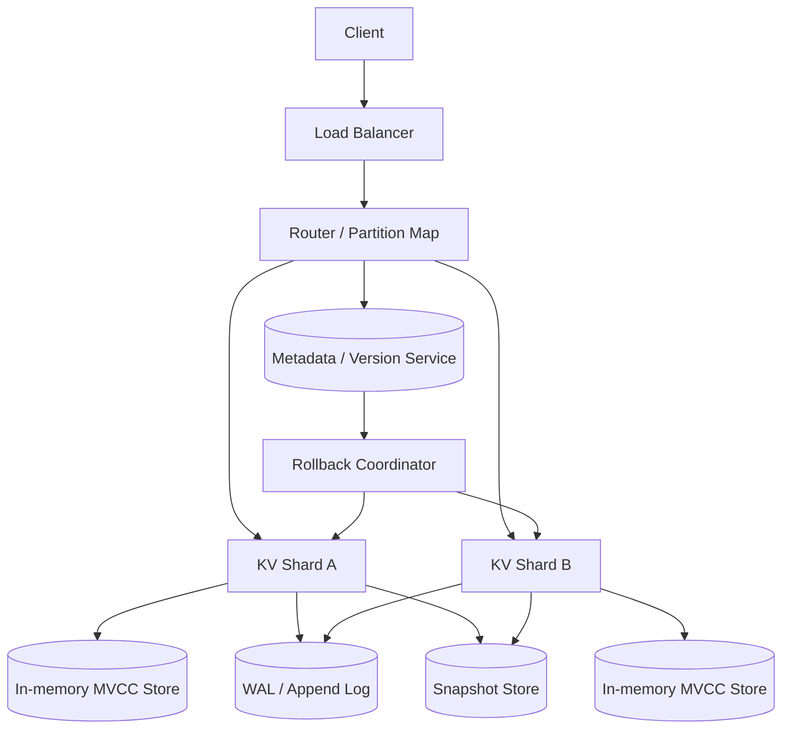

# 设计 In-memory Key-Value Store：支持回滚到历史版本

## 功能需求

- 支持基本 KV 操作：`put/get/delete`，低延迟读写。
- 支持历史版本读取：按 `version_id` 或 snapshot timestamp 读取旧值。
- 支持 rollback：把整个 namespace/table 回滚到某个历史版本。
- 支持持久化和恢复：进程重启后可从 snapshot + WAL 恢复内存状态。

## 非功能需求

- 低延迟：单 key 读写 p99 < 1-5ms，rollback 元数据操作尽量 O(1) 或秒级。
- 高吞吐：水平分片，读多写多都能扩展。
- 一致性：单 key linearizable；全局 rollback 有清晰语义，避免读到混合版本。
- 内存可控：历史版本不能无限保留，需要 TTL、版本数上限和 compaction。

## API 设计

```text
PUT /kv/{namespace}/{key}
- request: value, client_request_id, expected_version?
- response: key, commit_version
- expected_version 用于 CAS/optimistic concurrency

GET /kv/{namespace}/{key}?version_id=
- response: value, commit_version, deleted?
- version_id 为空则读当前版本

DELETE /kv/{namespace}/{key}
- request: client_request_id, expected_version?
- response: tombstone_version

POST /namespaces/{namespace}/snapshots
- response: snapshot_id, version_id, created_at
- 创建可 rollback 的一致性版本点

POST /namespaces/{namespace}/rollback
- request: target_version_id, idempotency_key
- response: current_version_id, rollback_epoch
- 把 namespace 当前可见版本切到 target_version_id

GET /namespaces/{namespace}/versions?limit=50
- response: snapshots[], latest_version_id, retention_policy
```

## 高层架构



## 关键组件

- Router / Partition Map
  - 负责把 key 根据 consistent hashing 或 range partition 路由到对应 shard。
  - 不保存数据本身，只保存分片映射和 shard 健康状态。
  - 依赖 Metadata Service 获取 partition map 和当前 namespace epoch。
  - 扩展方式：stateless scale；partition map 本地缓存，变更时 watch/refresh。
  - 注意事项：rollback 发生后，Router 要带上新的 `rollback_epoch/current_version`，避免请求打到旧 epoch。

- KV Shard
  - 负责单分片内的读写、版本链维护、WAL 写入、snapshot 生成和恢复。
  - 不负责跨 shard 全局一致性决策；全局 rollback 由 Coordinator 发起。
  - 每个 shard 内可以按 key 加锁或用 lock striping；单 key 写入要串行化。
  - 扩展方式：按 key 分片；热点 key 可以做 read replica，但写仍需单 leader。
  - 注意事项：写入顺序必须是先 WAL 后更新内存，避免 crash 后丢已确认写。

- In-memory MVCC Store
  - 核心数据结构：`key -> version chain`。
  - 每个版本包含：`commit_version, value_pointer, tombstone, prev_version_pointer, expire_at?`。
  - 当前读只读取 `commit_version <= namespace_current_version` 的最新版本。
  - 历史读按 `version_id` 在版本链中找小于等于该版本的最新值。
  - 注意事项：版本链太长会拖慢历史读，需要 skip pointer、分段索引或 compaction。

- Version / Metadata Service
  - 负责生成全局单调递增 `commit_version`，保存 namespace 当前可见版本、snapshot 列表、retention policy。
  - 不保存 value。
  - 依赖 Raft/ZooKeeper/etcd 类强一致存储，保证 rollback 元数据不 split-brain。
  - 扩展方式：metadata QPS 通常小于 data path，可独立集群部署；写入版本号可按 shard 分配区间减少瓶颈。
  - 注意事项：全局版本服务是正确性关键路径，需要高可用和 leader failover。

- Rollback Coordinator
  - 负责执行 namespace 级 rollback。
  - 简单做法：只更新 Metadata Service 中的 `current_visible_version = target_version_id`。
  - 不需要立即删除新版本数据，后续由 GC 清理。
  - 注意事项：rollback 必须幂等；如果正在有写入，要定义是阻塞写、切 epoch、还是允许 rollback 后继续写新版本。

- WAL / Append Log
  - 每次 put/delete 先追加 WAL，再更新内存。
  - WAL 记录：`namespace, key, commit_version, op_type, value/tombstone, client_request_id`。
  - 用于 crash recovery、replica catch-up、审计和 replay。
  - 注意事项：WAL 落盘可以 fsync 每条或 group commit；这是 latency 和 durability 的核心 trade-off。

- Snapshot Store
  - 周期性把 shard 内存状态或某个版本点写到本地 SSD / object store。
  - 恢复时先加载最近 snapshot，再 replay WAL。
  - 注意事项：snapshot 是恢复优化，不是 rollback 的唯一机制；rollback 更适合通过版本可见指针完成。

- GC / Compaction Worker
  - 删除 retention policy 外的旧版本、被 tombstone 覆盖的 value、过期 namespace snapshot。
  - 注意事项：不能删除仍被 snapshot 引用的版本；要有 reference counting 或 safe watermark。

## 核心流程

- 写入 `PUT`
  - Client 带 `client_request_id` 调用 Router。
  - Router 根据 key 路由到 shard leader。
  - Shard 校验 CAS 条件，向 Metadata Service 获取或分配 `commit_version`。
  - Shard 先追加 WAL，成功后把新版本挂到 key 的 version chain 头部。
  - 返回 `commit_version`；异步复制到 follower 和 snapshot pipeline。

- 当前读取 `GET`
  - Router 读取 Metadata Service 缓存的 `namespace_current_version`。
  - Shard 在 `key -> version chain` 中找到 `commit_version <= current_version` 的第一个非 tombstone 版本。
  - 返回 value；如果是 tombstone 或不存在，返回 not found。

- 历史读取 `GET version_id`
  - Client 指定 `version_id`。
  - Shard 找到 `commit_version <= version_id` 的最新版本。
  - 如果该版本之后发生 delete，但 delete version 大于查询版本，则旧值仍可读。
  - 如果查询版本早于 key 创建，返回 not found。

- 创建 snapshot
  - Metadata Service 记录一个 snapshot：`snapshot_id -> current_global_version`。
  - 不需要复制全量数据，只是保留一个可见版本点。
  - GC 不得删除小于等于该 snapshot 仍可达的版本。

- Rollback
  - Client 发起 `rollback(namespace, target_version_id)`。
  - Coordinator 校验 target version 是否仍在 retention 内。
  - Metadata Service 原子更新 `current_visible_version = target_version_id`，并递增 `rollback_epoch`。
  - Shard 不需要马上改内存；读路径自然按新的 visible version 读取旧值。
  - Rollback 之后的新写入使用新的 commit version，并挂在旧版本之后，形成新的历史分支语义，或者直接视为主线继续前进。

- Crash recovery
  - Shard 启动时加载最近 snapshot。
  - Replay snapshot 之后的 WAL，重建 version chain。
  - 从 Metadata Service 读取 namespace 当前 visible version 和 rollback epoch。
  - 对重复 `client_request_id` 做去重，避免 replay 重复写入。

## 存储选择

- In-memory Store
  - Hash table：`key -> head pointer`。
  - Version chain：linked list / skip list / small vector，保存每个 key 的历史版本。
  - Value arena：大 value 单独存在 arena/slab，version node 只存 pointer，减少拷贝。

- WAL
  - 本地 NVMe append log 或远端 replicated log。
  - 强 durability 场景：leader 写 WAL + quorum replica ack 后返回。
  - 低延迟场景：group commit 或 async replication，但要接受少量 acknowledged write 丢失风险。

- Snapshot
  - 本地 SSD 快照用于快速重启。
  - Object Store 快照用于灾备和迁移。

- Metadata Store
  - etcd/Raft/ZooKeeper 类强一致 store。
  - 保存 partition map、namespace visible version、snapshot list、rollback epoch、retention watermark。

## 扩展方案

- 单机版本：一个进程维护 hash map + version chain，WAL + periodic snapshot。
- 多 shard 单 region：consistent hashing 分片，Router 路由，Metadata Service 管理 partition map。
- 高可用：每个 shard leader-follower 复制，leader crash 后 follower replay WAL 接管。
- 大规模：range/consistent hash 动态迁移分片；热点 key 做 read replica 或 single-flight 合并读。
- 多租户：按 namespace 设置内存 quota、retention policy、最大 value size 和 QPS limit。

## 系统深挖

### 1. Rollback 语义：物理 undo vs 版本指针切换

- 问题：
  - rollback 到历史版本时，是把所有 key 逐个改回去，还是改变“当前可见版本”？

- 方案 A：物理 undo
  - 适用场景：数据量小、版本少、rollback 很少发生。
  - ✅ 优点：实现直观；rollback 后当前数据结构就是旧状态。
  - ❌ 缺点：需要扫描大量 key；rollback 慢；中途失败会出现半回滚状态；很难处理并发读写。

- 方案 B：MVCC + visible version 指针
  - 适用场景：需要快速 rollback 和历史读。
  - ✅ 优点：rollback 只更新 metadata，速度快；不会破坏历史数据；读路径天然支持 time travel。
  - ❌ 缺点：内存占用更高；读路径要找合适版本；GC 更复杂。

- 方案 C：Copy-on-write snapshot tree
  - 适用场景：需要大量 snapshot、版本间共享结构。
  - ✅ 优点：snapshot 成本低，结构共享好。
  - ❌ 缺点：实现复杂；随机写会产生碎片；GC 和引用计数成本高。

- 推荐：
  - 面试里推荐 MVCC + namespace visible version。它把 rollback 从数据面操作变成元数据切换，是这题最重要的 Staff+ 亮点。

### 2. 版本粒度：per-key version vs global version

- 问题：
  - 历史读取和 rollback 是按单个 key，还是整个系统的一致时间点？

- 方案 A：per-key version
  - 适用场景：只要求单 key 历史读，不要求全局一致 snapshot。
  - ✅ 优点：简单，写入不依赖全局版本服务。
  - ❌ 缺点：无法表达“整个 namespace 回到同一个时间点”；跨 key 读可能混合不同时间。

- 方案 B：global commit version
  - 适用场景：需要 namespace/table 级 rollback。
  - ✅ 优点：可以定义一致 snapshot；rollback 语义清晰。
  - ❌ 缺点：全局版本生成可能成为瓶颈；metadata 服务重要性更高。

- 方案 C：hybrid logical clock / per-shard version + vector watermark
  - 适用场景：极大规模，不想让所有写都经过全局版本服务。
  - ✅ 优点：扩展性更好，跨 shard 写入少协调。
  - ❌ 缺点：rollback 到全局一致点需要维护 vector clock/watermark，面试讲起来复杂。

- 推荐：
  - 如果题目强调“回滚整个 KV store”，用 global commit version。规模更大后可以优化成 per-shard version range + 全局 snapshot watermark。

### 3. 持久化：纯内存 vs WAL + snapshot vs replicated log

- 问题：
  - in-memory 不等于可以丢数据；系统重启后是否还要保留历史版本？

- 方案 A：纯内存
  - 适用场景：缓存系统，数据可从下游重建。
  - ✅ 优点：最低延迟，最低复杂度。
  - ❌ 缺点：节点 crash 后数据和历史版本全部丢失；rollback 能力不可靠。

- 方案 B：WAL + periodic snapshot
  - 适用场景：单 region 高性能 KV，要求 crash recovery。
  - ✅ 优点：写入 append-only，恢复路径清晰；snapshot 降低 replay 时间。
  - ❌ 缺点：WAL fsync 影响写延迟；snapshot 会带来 IO 和 CPU 抖动。

- 方案 C：quorum replicated log
  - 适用场景：高可用和强 durability。
  - ✅ 优点：leader crash 后 follower 可接管；已确认写更不容易丢。
  - ❌ 缺点：写延迟更高；实现复杂，需要 leader election 和 log consistency。

- 推荐：
  - 基础设计用 WAL + snapshot；高可用场景升级到 leader-follower replicated WAL。面试要明确 durability level 是产品选择，不是免费能力。

### 4. 内存控制：保留所有历史 vs retention + compaction

- 问题：
  - 支持 rollback 会导致每次写都保留旧值，内存可能无限增长。

- 方案 A：保留所有历史版本
  - 适用场景：小数据量、审计系统。
  - ✅ 优点：任何时间点都可恢复。
  - ❌ 缺点：内存不可控，不适合 in-memory KV。

- 方案 B：按时间/版本数 retention
  - 适用场景：大多数在线系统。
  - ✅ 优点：内存可预测；实现相对简单。
  - ❌ 缺点：超过 retention 的版本不能 rollback。

- 方案 C：冷热分层
  - 适用场景：近期版本低延迟，长期版本只做审计或低频恢复。
  - ✅ 优点：热数据在内存，冷历史在 SSD/Object Store，成本低。
  - ❌ 缺点：历史读和远距离 rollback 变慢；需要复杂的分层索引。

- 推荐：
  - in-memory 系统必须有 retention policy，例如保留最近 24 小时或最近 N 个版本。长期历史落到冷存储，不能把所有历史都放内存。

### 5. 读写一致性：linearizable read vs snapshot read

- 问题：
  - rollback 期间读写并发，客户端应该看到什么？

- 方案 A：eventual consistency
  - 适用场景：缓存型 KV，对短暂不一致容忍。
  - ✅ 优点：延迟最低，扩展简单。
  - ❌ 缺点：rollback 后不同客户端可能读到不同当前版本，语义混乱。

- 方案 B：单 key linearizable
  - 适用场景：多数 KV 需求。
  - ✅ 优点：同一个 key 的写入顺序明确；实现成本可控。
  - ❌ 缺点：跨 key 事务和全局快照仍不保证。

- 方案 C：namespace snapshot isolation
  - 适用场景：rollback/read snapshot 是核心能力。
  - ✅ 优点：读请求绑定一个 `visible_version/epoch`，不会读到混合 rollback 状态。
  - ❌ 缺点：Router、Shard、Metadata 都要传递 epoch；读路径复杂度上升。

- 推荐：
  - 提供单 key linearizable write/read；namespace 级 rollback 通过 epoch 切换保证新请求看到同一个 visible version。长请求可以继续使用请求开始时的 snapshot version。

### 6. Rollback 后继续写：线性历史 vs 分支历史

- 问题：
  - 如果回滚到 V10，而系统之前已经写到 V20，接下来新写入应该怎么编号和怎么理解？

- 方案 A：线性历史继续前进
  - 适用场景：在线 KV，rollback 是改变当前可见状态，不做 Git 式分支。
  - ✅ 优点：简单；新写入拿 V21，只是基于 V10 的可见状态写入。
  - ❌ 缺点：V11-V20 变成不可见但仍存在，语义需要解释清楚。

- 方案 B：显式分支
  - 适用场景：配置系统、实验系统，需要比较多个分支。
  - ✅ 优点：历史语义严谨，可以并行保留多条分支。
  - ❌ 缺点：API、GC、读路径都复杂很多。

- 方案 C：rollback 生成 compensating writes
  - 适用场景：审计要求所有变化都是 append-only 业务事件。
  - ✅ 优点：审计友好。
  - ❌ 缺点：需要为每个 key 写补偿事件，rollback 很慢。

- 推荐：
  - KV store 面试里选线性历史继续前进：rollback 更新 visible version，新写入继续使用更大的 commit version，并通过 epoch 表示当前主线。

### 7. 分片和全局 rollback

- 问题：
  - 多 shard 下 rollback 不能让 shard A 回到 V10，shard B 还在 V20。

- 方案 A：暂停全局写入后 rollback
  - 适用场景：低频管理操作，接受短暂写不可用。
  - ✅ 优点：实现简单，correctness 清晰。
  - ❌ 缺点：影响可用性；大规模时 pause window 会更明显。

- 方案 B：epoch 切换
  - 适用场景：在线系统，希望 rollback 快速生效。
  - ✅ 优点：Metadata 原子更新 epoch 和 visible version；新请求自动使用新 epoch。
  - ❌ 缺点：所有请求都要带 epoch；旧 epoch 请求要拒绝或按旧 snapshot 完成。

- 方案 C：两阶段 rollback
  - 适用场景：强一致、跨 shard 事务很多。
  - ✅ 优点：可以确保所有 shard 准备好再切换。
  - ❌ 缺点：协调成本高，失败恢复复杂。

- 推荐：
  - 用 epoch 切换。rollback 是 metadata 原子操作，data shard lazy 生效；旧 epoch 写请求拒绝并要求重试。

## 面试亮点

- 回滚不要做全量 undo，核心是 MVCC + `current_visible_version` 指针切换。
- Source of truth 不是内存 hash map，而是 WAL/replicated log + Metadata 中的 visible version。
- rollback 正确性关键是 epoch：避免并发请求读到或写到混合版本。
- in-memory 系统必须主动谈 retention 和 GC，否则版本链会无限吃内存。
- 历史版本读取和全局 rollback 是不同需求：per-key version 不等于 namespace consistent snapshot。
- WAL + snapshot 是恢复优化；snapshot 也可以只是 metadata 版本点，不一定每次复制全量数据。
- Staff+ 角度要明确 durability、latency、rollback speed、memory cost 之间的 trade-off，而不是只说“用 Redis”。

## 一句话总结

- 这个系统的核心是用 in-memory hash table 提供低延迟读写，用 MVCC version chain 保存历史，用 Metadata Service 的 `current_visible_version + epoch` 实现快速一致 rollback，并通过 WAL、snapshot、retention 和 GC 保证可恢复与内存可控。
