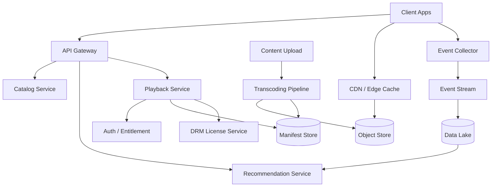

# 设计 Netflix 系统

## 功能需求

- 用户可以浏览、搜索、个性化推荐影视内容，并继续上次播放进度。
- 用户可以低延迟播放视频，支持多清晰度、自适应码率、字幕、多设备。
- 内容方可以上传视频，系统完成转码、切片、DRM、manifest 生成和发布。
- 支持观看事件采集，用于推荐、播放质量监控、计费/授权和内容分析。

## 非功能需求

- 播放高可用：视频播放链路要比后台管理链路更高优先级。
- 低启动延迟：首帧时间低，buffering ratio 低，支持弱网下自适应码率。
- 高吞吐：视频流量主要通过 CDN/边缘节点承载，源站不能成为瓶颈。
- 权限和版权：不同地区、订阅等级、设备能力、DRM policy 要严格控制。

## API 设计

```text
GET /home?user_id=&profile_id=&cursor=
- response: rows[], recommendations[], next_cursor
- 首页个性化推荐

GET /titles/{title_id}
- response: metadata, seasons, episodes, artwork, availability
- 内容详情页

POST /playback/session
- request: user_id, profile_id, title_id, device_info, region
- response: playback_session_id, manifest_url, drm_license_url, expires_at
- 播放前校验订阅、地区、设备、版权

POST /playback/events
- request: session_id, title_id, event_type, position_ms, bitrate, buffer_ms, timestamp
- response: accepted
- 记录 start/pause/resume/heartbeat/complete/buffering

POST /content/upload
- request: title_id, source_file_info, metadata, idempotency_key
- response: upload_id, upload_url
- 内容上传入口
```

## 高层架构



## 关键组件

- API Gateway
  - 负责认证、限流、路由、设备能力识别、region routing。
  - 不承载视频流量；视频文件由 CDN 直接服务。
  - 扩展方式：stateless scale，多 region 部署。
  - 注意事项：播放 API 和首页/搜索 API 的隔离很重要，推荐故障不能影响播放。

- Catalog Service
  - 负责影视元数据：title、episode、season、演员、类型、图片、地区可用性。
  - 不负责个性化排序，也不直接存视频文件。
  - 依赖 Catalog DB、Search Index、Artwork Store。
  - 扩展方式：读多写少，cache + read replica；按 title_id 分片。
  - 注意事项：版权地区和上下架状态是播放授权的输入，不能只在前端隐藏。

- Recommendation Service
  - 负责首页 rows、相似影片、继续观看、个性化排序。
  - 依赖用户画像、观看历史、内容 embedding、实时 session 事件。
  - 扩展方式：离线预计算候选 + 在线轻量重排；按 profile_id 做缓存。
  - 注意事项：首页推荐是派生结果，故障时可以 fallback 到 trending/popular，不能阻塞播放。

- Playback Service
  - 播放主链路入口，创建 playback session。
  - 校验用户订阅、profile、地区版权、设备能力、DRM policy。
  - 返回 manifest URL、DRM license URL、session token。
  - 扩展方式：stateless scale；manifest 和 entitlement cache 短 TTL。
  - 注意事项：不要让客户端直接拼视频 URL，所有播放都应经过授权 session。

- Transcoding Pipeline
  - 负责把原始视频转码成多 codec、多 bitrate、多 resolution、多音轨/字幕版本。
  - 生成 HLS/DASH manifest 和小段视频 chunks。
  - 依赖 task queue、transcode workers、object store、quality validation。
  - 扩展方式：按 title/segment 并行；worker pool 可弹性扩缩。
  - 注意事项：转码是离线重任务，不应影响播放路径；每个步骤要幂等，可重试。

- Object Store + CDN
  - Object Store 保存 encoded segments、manifest、字幕、图片。
  - CDN/边缘节点承载大部分视频流量，缓存热门 segments。
  - 扩展方式：多 CDN 或自建 Open Connect 类 edge cache；按 region 预热热门内容。
  - 注意事项：视频 segment URL 需要签名/短 TTL，避免盗链；manifest 可以因设备和权限不同而不同。

- DRM License Service
  - 给合法播放 session 发放 DRM license。
  - 不直接分发视频内容，只验证 session 和设备，返回 license。
  - 扩展方式：多 region 部署，license cache 谨慎使用。
  - 注意事项：DRM license 是强安全路径，必须审计、限流、防重放。

- Event Collector
  - 收集播放质量和用户行为：start、heartbeat、seek、pause、buffering、bitrate switch、complete。
  - 不在同步链路里做复杂分析。
  - 扩展方式：Kafka/PubSub 分区写入，批量上报，客户端本地缓冲。
  - 注意事项：播放 QoE 指标依赖事件完整性，但事件丢失不能影响播放。

## 核心流程

- 视频上传和处理
  - 内容方通过 upload API 获取上传 URL，把原始文件上传到 Object Store。
  - Upload Service 写入 content job，Transcoding Pipeline 拉取任务。
  - 系统把原始视频切成 segments，并转码成 H.264/H.265/VP9/AV1 等多种版本。
  - 生成 HLS/DASH manifest，记录每个 bitrate/resolution 对应的 segment 路径。
  - Quality validation 通过后，Catalog Service 将 title 标记为可发布。

- 播放启动
  - Client 请求 `POST /playback/session`。
  - Playback Service 校验登录、订阅、地区版权、设备 codec/DRM 能力。
  - 返回适合设备的 manifest URL 和 DRM license URL。
  - Client 拉 manifest，再从 CDN 拉前几个 video segments。
  - 播放期间根据网络状况选择不同 bitrate segment。

- 自适应码率播放
  - Client 持续监控带宽、buffer size、解码能力和丢包。
  - 网络好时切到更高 bitrate，网络差时切到低 bitrate。
  - 每次 bitrate switch、buffering、startup time 都上报到 Event Collector。
  - QoE pipeline 聚合指标，用于 CDN 调度、编码策略和播放问题定位。

- 首页推荐
  - Recommendation Service 从离线候选池拿到用户可能喜欢的 title。
  - 在线读取最近观看、当前时间、设备、地区、内容可用性。
  - Ranking/rerank 输出首页 rows，例如继续观看、热门、因为你看过、地区趋势。
  - 如果推荐服务失败，API fallback 到缓存首页或地区热门列表。

## 存储选择

- Catalog DB
  - PostgreSQL/DynamoDB/Cassandra。
  - 保存 title metadata、availability、license window、content status。
  - Source of truth，Search Index 和 Rec Index 都是派生数据。

- Object Store
  - 保存原始视频、转码后 segments、manifest、字幕、图片。
  - 适合大对象存储和生命周期管理。

- Manifest Store
  - 保存 HLS/DASH manifest，包含不同 codec、resolution、bitrate、segment 地址。
  - 可以放 Object Store + CDN，也可以有 metadata DB 记录版本。

- CDN / Edge Cache
  - 保存热门视频 segments 和 manifest。
  - 不是 source of truth；cache miss 回源 Object Store。

- User Activity Store
  - 保存观看历史、播放进度、continue watching、rating/like。
  - 播放进度需要低延迟写入和跨设备同步。

- Data Lake
  - 保存播放事件、推荐曝光/点击、QoE 指标、内容分析数据。
  - 用于推荐训练、AB test、编码策略分析。

- Search Index
  - Elasticsearch/OpenSearch。
  - 支持 title、actor、genre、keyword 搜索。

## 扩展方案

- 基础阶段：Object Store + CDN + 单一 codec/resolution，简单 catalog 和播放授权。
- 中期：加入多 bitrate、多 resolution、HLS/DASH、自适应码率和播放事件。
- 大规模：多 CDN/自建 edge cache、热门内容预热、按 region 缓存 manifest 和 entitlement。
- 推荐规模化：离线候选生成 + 在线重排 + fallback；推荐系统与播放系统解耦。
- 全球化：按 region 处理版权、catalog availability、CDN cache 和数据合规。

## 系统深挖

### 1. 视频分发：源站直出 vs CDN vs 自建 Edge Cache

- 问题：
  - 视频流量巨大，源站不能直接服务所有播放请求。

- 方案 A：源站/Object Store 直出
  - 适用场景：小规模或内部视频平台。
  - ✅ 优点：实现简单，内容一致性好。
  - ❌ 缺点：延迟高，带宽成本高，源站容易被打爆。

- 方案 B：第三方 CDN
  - 适用场景：快速全球分发。
  - ✅ 优点：上线快，覆盖广，弹性好。
  - ❌ 缺点：成本高；热门内容和 ISP peer 优化受限。

- 方案 C：自建 Edge Cache / Open Connect 类方案
  - 适用场景：Netflix 这种超大视频流量。
  - ✅ 优点：降低带宽成本，提升 ISP 侧播放质量，可预热热门内容。
  - ❌ 缺点：建设和运维成本高，需要容量预测和内容放置策略。

- 推荐：
  - 面试基础设计用 CDN；如果讨论 Netflix 规模，进一步讲自建 edge cache，按地区预热热门 titles 和前几个 segments。

### 2. 视频编码：单一版本 vs Adaptive Bitrate

- 问题：
  - 用户设备和网络差异大，同一个视频不能只提供一个版本。

- 方案 A：单一分辨率/码率
  - 适用场景：早期 MVP 或内网场景。
  - ✅ 优点：转码简单，存储成本低。
  - ❌ 缺点：弱网卡顿，高端设备画质差。

- 方案 B：多 bitrate ladder + HLS/DASH
  - 适用场景：公开视频播放平台。
  - ✅ 优点：客户端可根据网络选择合适 segment，降低 buffering。
  - ❌ 缺点：转码成本和存储成本增加。

- 方案 C：per-title encoding
  - 适用场景：Netflix 规模，追求质量和成本优化。
  - ✅ 优点：不同内容使用不同 bitrate ladder，动画/动作片分别优化。
  - ❌ 缺点：编码策略复杂，需要质量评估 pipeline。

- 推荐：
  - 用 HLS/DASH + adaptive bitrate；高阶讨论 per-title encoding 和 codec 选择，如 H.264 兼容性好，AV1 压缩率高但编码和设备支持成本更高。

### 3. Manifest 设计和授权

- 问题：
  - Manifest 决定客户端能看到哪些版本、segment 和字幕，也可能泄露内容地址。

- 方案 A：静态 public manifest
  - 适用场景：公开视频。
  - ✅ 优点：CDN 缓存友好，实现简单。
  - ❌ 缺点：无法按用户、地区、设备、订阅权限控制。

- 方案 B：动态 manifest
  - 适用场景：有版权和设备差异的平台。
  - ✅ 优点：可根据 region、device codec、DRM、订阅等级返回不同版本。
  - ❌ 缺点：缓存命中率低，Playback Service 压力更大。

- 方案 C：静态 manifest + signed token/filter
  - 适用场景：平衡性能和授权。
  - ✅ 优点：manifest 可缓存，segment URL 通过短 TTL token 控权。
  - ❌ 缺点：权限变化和 token 过期处理更复杂。

- 推荐：
  - 使用动态生成或模板化 manifest，结合短 TTL signed URL 和 DRM license。热门 manifest 可以按 device/region 维度缓存。

### 4. Playback session：强校验 vs 缓存授权

- 问题：
  - 播放前要校验订阅、地区版权和设备能力，但不能让授权服务成为延迟瓶颈。

- 方案 A：每次播放都强查所有依赖
  - 适用场景：安全要求最高，QPS 较低。
  - ✅ 优点：权限最新，逻辑直接。
  - ❌ 缺点：依赖多，延迟高；任一依赖故障会影响播放。

- 方案 B：Entitlement cache
  - 适用场景：大规模播放系统。
  - ✅ 优点：低延迟，依赖故障时可短时间继续播放。
  - ❌ 缺点：订阅取消、版权下架等变更有短暂不一致。

- 方案 C：session token + 短 TTL
  - 适用场景：播放链路常用方案。
  - ✅ 优点：播放期间减少重复校验，token 过期后重新校验。
  - ❌ 缺点：token 泄露和重放要防护。

- 推荐：
  - 创建 session 时强校验，播放过程中使用短 TTL session token + DRM license。高风险变更通过 token 失效列表或短 TTL 控制窗口。

### 5. 播放进度一致性：同步写 vs 异步事件

- 问题：
  - Continue watching 要跨设备准确，但播放心跳很频繁。

- 方案 A：每个 heartbeat 同步写 DB
  - 适用场景：低 QPS。
  - ✅ 优点：进度最新。
  - ❌ 缺点：写压力巨大，影响播放链路。

- 方案 B：客户端定期批量上报，服务端异步聚合
  - 适用场景：真实大规模播放。
  - ✅ 优点：降低写量，削峰填谷。
  - ❌ 缺点：进度可能滞后，客户端 crash 前最后几秒可能丢失。

- 方案 C：关键事件同步 + heartbeat 异步
  - 适用场景：平衡准确性和成本。
  - ✅ 优点：start/pause/stop/complete 更准确，普通 heartbeat 成本低。
  - ❌ 缺点：实现比单一路径复杂。

- 推荐：
  - 使用关键事件同步或准同步，heartbeat 异步聚合。Continue watching 允许几秒误差，不应影响播放质量。

### 6. 推荐系统与播放系统隔离

- 问题：
  - Netflix 首页依赖推荐，但用户点击播放后，播放链路必须更可靠。

- 方案 A：推荐和播放共享服务/数据库
  - 适用场景：早期简单系统。
  - ✅ 优点：实现快，数据复用简单。
  - ❌ 缺点：推荐流量或训练数据问题可能拖垮播放。

- 方案 B：服务隔离，播放链路只依赖必要 metadata
  - 适用场景：成熟系统。
  - ✅ 优点：推荐故障不影响播放；播放路径更短更稳定。
  - ❌ 缺点：需要同步 title availability 和 metadata 派生数据。

- 方案 C：播放路径专用缓存和降级
  - 适用场景：高可用要求。
  - ✅ 优点：Catalog/Entitlement 短暂故障时仍可播放已授权内容。
  - ❌ 缺点：缓存一致性和版权撤销更难。

- 推荐：
  - 播放系统和推荐系统强隔离。推荐可以失败降级，播放 session、manifest、DRM、CDN 是更高优先级。

### 7. QoE 监控和 CDN 调度

- 问题：
  - 用户体验不只看服务端可用性，还要看首帧时间、卡顿、码率切换和 CDN 质量。

- 方案 A：只监控服务端错误率
  - 适用场景：普通 API 系统。
  - ✅ 优点：简单。
  - ❌ 缺点：看不到客户端卡顿和 ISP/CDN 问题。

- 方案 B：客户端 QoE 事件
  - 适用场景：视频系统。
  - ✅ 优点：真实反映播放体验。
  - ❌ 缺点：事件量大，有采样、延迟和丢失问题。

- 方案 C：QoE 驱动 CDN steering
  - 适用场景：多 CDN/自建 edge。
  - ✅ 优点：根据地区、ISP、设备动态选择更好的边缘节点。
  - ❌ 缺点：调度系统复杂，错误调度会放大事故。

- 推荐：
  - 收集客户端 QoE：startup time、rebuffering ratio、average bitrate、error code、CDN node。成熟阶段用 QoE 做 CDN steering 和内容预热。

### 8. 转码 pipeline：大任务调度和幂等

- 问题：
  - 视频转码耗时长、成本高、步骤多，任一 worker 失败都不能导致内容状态混乱。

- 方案 A：单 worker 顺序处理整个视频
  - 适用场景：小视频或小规模平台。
  - ✅ 优点：简单。
  - ❌ 缺点：慢，失败重试成本高。

- 方案 B：按 segment 并行处理
  - 适用场景：长视频和大规模转码。
  - ✅ 优点：并行度高，失败只重试单个 segment。
  - ❌ 缺点：任务编排、合并、质量检查复杂。

- 方案 C：workflow engine 编排
  - 适用场景：生产系统。
  - ✅ 优点：每步状态清晰，可重试、可恢复、可观测。
  - ❌ 缺点：引入 Temporal/Step Functions/Airflow 等组件复杂度。

- 推荐：
  - 用 workflow engine 编排：upload -> split -> transcode segments -> QC -> manifest -> publish。每个任务幂等，输出用 content_version 管理。

## 面试亮点

- Netflix 设计要把 metadata/control plane 和 video data plane 分开；API 不承载视频流量，CDN/edge 才是主流量。
- 播放链路优先级高于推荐链路，推荐故障只能影响首页质量，不能影响已授权播放。
- Manifest 是关键边界：它连接 codec/resolution/segment/CDN/DRM/设备能力和地区版权。
- 自适应码率不是“多个视频文件”这么简单，还包括客户端 ABR、QoE 事件和编码策略。
- Source of truth 是 Catalog/Object Store/Entitlement；Search、Recommendation、CDN cache、Manifest cache 都是派生数据。
- 高阶点可以讲自建 edge cache、per-title encoding、QoE-driven CDN steering、workflow-based transcoding。
- Staff+ 答法要围绕 bottleneck：视频系统瓶颈不是 API QPS，而是带宽、边缘缓存命中率、转码成本和播放质量。

## 一句话总结

- Netflix 的核心设计是：内容处理链路离线完成转码、切片、manifest 和 DRM 准备；播放链路通过 Playback Session 授权后让客户端从 CDN 拉取自适应码率 segments；推荐、搜索和事件分析作为派生系统提升发现效率，但必须与高可用播放链路解耦。
