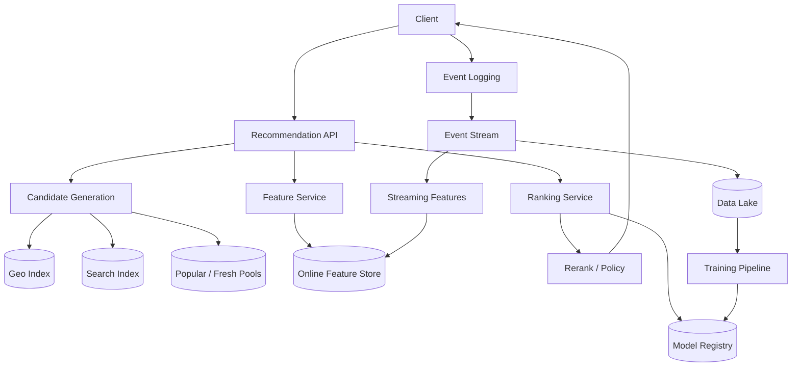

# 设计餐馆推荐系统

## 功能需求

- 给用户推荐附近可下单/可到店的餐馆，支持首页 feed、搜索结果重排、相似餐馆推荐。
- 支持个性化：结合用户口味、历史订单、收藏、价格偏好、距离、时间、上下文。
- 支持实时约束：餐馆营业状态、配送范围、等待时间、库存/菜品可用性、促销活动。
- 支持反馈闭环：曝光、点击、下单、收藏、跳过、差评等行为进入训练和在线特征。

## 非功能需求

- 低延迟：首页推荐 p95 < 200ms；搜索重排 p95 < 300ms。
- 高可用：推荐不可用时能 fallback 到热门/附近餐馆。
- 新鲜性：营业状态、配送时间、临时关店、爆单状态要分钟级甚至秒级生效。
- 公平和业务约束：不能只推头部餐馆，要兼顾多样性、新餐馆探索、广告/促销策略。

## API 设计

```text
GET /recommendations/restaurants?user_id=&lat=&lng=&context=&cursor=&limit=20
- response: restaurants[], ranking_reason?, next_cursor
- 首页推荐，context 包含 lunch/dinner、delivery/pickup、device、session 等

GET /search/restaurants?q=&user_id=&lat=&lng=&filters=&cursor=
- response: restaurants[], next_cursor
- 搜索召回后调用 ranking 做个性化重排

POST /events
- request: user_id, restaurant_id, event_type, request_id, position, timestamp, context
- response: accepted
- 记录 impression/click/order/favorite/skip/rating

GET /recommendations/debug?user_id=&lat=&lng=&request_id=
- response: candidates, features, scores, filters, model_version
- 面试可以提 debugging，对线上推荐系统很重要
```

## 高层架构



## 关键组件

- Recommendation API
  - 负责首页推荐入口，聚合召回、特征、排序、重排和 fallback。
  - 不直接训练模型，不直接做复杂搜索。
  - 依赖 Candidate Generation、Feature Service、Ranking Service、Policy/Rerank。
  - 扩展方式：stateless scale；按 region 部署；对热门城市做本地 cache。
  - 注意事项：要有严格 latency budget，例如 recall 50ms、feature 50ms、rank 50ms、rerank 20ms。

- Candidate Generation
  - 负责从海量餐馆中召回几百到几千个候选。
  - 常见召回：附近餐馆、历史复购相似、同 cuisine、热门、促销、新店、embedding ANN。
  - 不做最终排序，只保证 recall 高。
  - 扩展方式：按 city/geo shard；热门候选预计算。
  - 注意事项：必须先过滤明显不可用餐馆，例如太远、已关店、无配送范围。

- Geo / Availability Service
  - 负责地理位置过滤、配送范围判断、营业状态、预计送达时间、爆单状态。
  - 依赖餐馆 metadata、配送系统、实时运营状态。
  - 扩展方式：按城市/区域分片；Geo index 使用 H3/S2/Geohash/PostGIS/Redis GEO。
  - 注意事项：这是餐馆推荐和普通内容推荐最大的区别之一，可用性是 hard filter。

- Feature Service
  - 负责读取用户、餐馆、上下文、交叉特征。
  - 用户特征：偏好 cuisine、价格段、复购、距离敏感度、素食/清真/辣度偏好。
  - 餐馆特征：评分、转化率、取消率、平均等待时间、价格、菜系、图片质量。
  - 上下文特征：位置、时间、天气、节假日、午餐/晚餐、配送/自取。
  - 注意事项：训练和在线特征要一致；实时特征和离线特征需要 feature definition 管理。

- Ranking Service
  - 负责给候选餐馆打分，预测点击、下单、复购、GMV、用户满意度等。
  - 不直接决定所有业务规则；业务策略放在 Rerank/Policy。
  - 扩展方式：轻量 GBDT/NN 模型在线 serving；batch feature get；模型按 region 或场景分版本。
  - 注意事项：优化目标不能只看 CTR，否则容易推“看起来好点但不下单”的餐馆。

- Rerank / Policy Engine
  - 负责多样性、去重、广告位、商家公平、新店探索、频控、业务约束。
  - 对 Ranking 输出做最后调整，而不是替代模型。
  - 注意事项：政策规则要 versioned，避免线上改规则后无法解释指标变化。

- Event Logging
  - 记录曝光、点击、停留、下单、取消、评分、收藏、skip。
  - 曝光日志尤其关键，因为训练样本需要知道“用户看到了什么但没点/没下单”。
  - 注意事项：必须带 `request_id, position, model_version, candidate_set_id`，否则很难做离线评估。

- Training Pipeline
  - 用历史事件和特征构造训练样本，训练召回模型和排序模型。
  - 支持 offline eval、shadow、canary、A/B test。
  - 注意事项：位置、时间、营业状态会强烈影响 label，训练时要做 point-in-time feature join。

## 核心流程

- 首页推荐
  - Client 发送用户位置、场景和分页 cursor。
  - Recommendation API 查询 Geo/Availability，拿到附近可服务餐馆池。
  - Candidate Generation 通过多路召回得到候选：附近热门、个性化 cuisine、复购相似、新店探索、促销。
  - Feature Service 批量拉取用户、餐馆、上下文和交叉特征。
  - Ranking Service 预测点击/下单/满意度等多目标分数。
  - Rerank 应用多样性、营业状态、配送时间、广告/促销、新店探索。
  - 返回结果，并记录 impression 日志。

- 搜索结果重排
  - Search Service 先按 query 做文本召回，例如“sushi”“hot pot”。
  - Recommendation/Ranking 对搜索结果做个性化重排。
  - 过滤不营业、无法配送、等待过长的餐馆。
  - 搜索排序更强调 query relevance，首页推荐更强调个性化和探索。

- 实时特征更新
  - 用户曝光、点击、下单、取消等事件进入 Kafka。
  - Streaming Job 更新短窗口特征，例如过去 10 分钟点击率、餐馆当前转化率、区域需求热度。
  - Online Feature Store 被 Ranking Service 读取。
  - 离线 Data Lake 保存原始事件用于训练和回放。

- 模型训练和发布
  - 每天/每小时从 Data Lake 构造训练样本。
  - 离线评估 NDCG、Recall@K、订单转化、校准、分群指标。
  - 新模型进入 Model Registry，通过 shadow/canary/A/B test 后逐步放量。
  - 若 guardrail 变差，例如取消率上升、等待时间变长，自动回滚模型。

## 存储选择

- Restaurant Metadata Store
  - PostgreSQL/DynamoDB/Cassandra。
  - 保存餐馆基本信息、菜系、价格、评分、营业时间、配送范围、状态。
  - Source of truth，不应该依赖搜索索引作为最终状态。

- Geo Index
  - H3/S2/Geohash/PostGIS/Redis GEO。
  - 用于附近餐馆召回和配送范围过滤。
  - Redis GEO 适合低延迟，但频繁状态更新和复杂 polygon 范围不如 H3/S2/PostGIS 灵活。

- Search Index
  - Elasticsearch/OpenSearch。
  - 保存餐馆名、菜系、菜单关键词、标签，用于 query recall。
  - 这是派生索引，返回前仍要查 availability/metadata。

- Online Feature Store
  - Redis/DynamoDB/Cassandra。
  - 保存用户近期行为、餐馆实时指标、区域热度、短窗口统计。

- Offline Feature Store / Data Lake
  - S3/HDFS + Parquet/Iceberg/Delta。
  - 保存训练样本、历史事件、离线特征、模型输出。

- Model Registry
  - 保存模型 artifact、feature schema、训练数据版本、评估指标、发布状态。

## 扩展方案

- 早期：附近餐馆 + 热门排序 + 少量规则，先保证可用和低延迟。
- 中期：加入用户画像、菜系偏好、实时营业状态、GBDT 排序模型。
- 大规模：多路召回 + 粗排 + 精排 + rerank，城市级 geo shard 和热门候选预计算。
- 高峰时段：缓存城市/区域热门候选，在线只做轻量个性化 rerank。
- 全球化：按城市/region 部署推荐和特征服务，模型可以 global base + region fine-tune。

## 系统深挖

### 1. 召回策略：Geo-first vs Personalized-first

- 问题：
  - 餐馆推荐必须既相关又可达，和短视频推荐不同，地理位置是硬约束。

- 方案 A：Geo-first
  - 适用场景：外卖/到店场景，位置强约束。
  - ✅ 优点：候选一定可服务，召回规模小，延迟低。
  - ❌ 缺点：个性化弱，可能错过用户喜欢但稍远的餐馆。

- 方案 B：Personalized-first
  - 适用场景：预订、旅行规划、用户愿意跨区域。
  - ✅ 优点：个性化强，能推荐用户真正喜欢的类别。
  - ❌ 缺点：容易召回不可配送/太远/已关店的餐馆，浪费排序资源。

- 方案 C：Hybrid multi-recall
  - 适用场景：真实生产系统。
  - ✅ 优点：Geo、个性化、热门、新店、促销各自有 quota，覆盖更全面。
  - ❌ 缺点：候选去重、quota 调参和召回归因更复杂。

- 推荐：
  - 外卖场景使用 Geo-first + multi-recall。先做硬过滤，再按个性化、热门、探索等通道召回。

### 2. 排序目标：CTR vs CVR vs Long-term Satisfaction

- 问题：
  - 如果只优化点击，系统可能推图片好看但用户不下单或体验差的餐馆。

- 方案 A：优化 CTR
  - 适用场景：早期缺少订单数据，或者入口目标是探索。
  - ✅ 优点：样本多，反馈快，模型容易训练。
  - ❌ 缺点：容易标题党/图片党，和业务收入及满意度不完全一致。

- 方案 B：优化 CVR/Order
  - 适用场景：外卖/订餐业务核心目标是下单。
  - ✅ 优点：更接近业务收益。
  - ❌ 缺点：订单样本少，反馈慢；可能过度推荐老店和高转化店。

- 方案 C：多目标排序
  - 适用场景：成熟推荐系统。
  - ✅ 优点：同时考虑点击、下单、复购、取消率、等待时间、差评风险。
  - ❌ 缺点：目标权重和校准复杂。

- 推荐：
  - 使用多目标排序，例如：

```text
score =
  w1 * P(click)
+ w2 * P(order)
+ w3 * P(reorder)
- w4 * P(cancel/late_delivery/bad_rating)
+ business_boost
```

### 3. 实时可用性：强过滤 vs 排序特征

- 问题：
  - 餐馆可能临时关店、爆单、菜单售罄、配送时间突然变长。

- 方案 A：把可用性当 hard filter
  - 适用场景：不营业、不可配送、食品安全问题。
  - ✅ 优点：不会推荐用户无法下单的餐馆。
  - ❌ 缺点：如果状态延迟或误报，会直接损失曝光。

- 方案 B：把可用性当 ranking feature
  - 适用场景：等待时间、爆单程度、库存不足但仍可下单。
  - ✅ 优点：排序更平滑，不会因为短期波动完全消失。
  - ❌ 缺点：如果特征过期，用户体验会变差。

- 方案 C：hard filter + soft penalty
  - 适用场景：真实系统。
  - ✅ 优点：不可服务的过滤掉，可服务但体验差的降权。
  - ❌ 缺点：需要清晰定义哪些是硬约束、哪些是软约束。

- 推荐：
  - 不营业/不可配送/违规下架是 hard filter；等待时间、爆单、价格、取消率作为 soft ranking features。

### 4. 地理索引：PostGIS vs Geohash/H3/S2 vs Redis GEO

- 问题：
  - 如何高效找到附近餐馆，并处理边界和配送范围？

- 方案 A：PostGIS
  - 适用场景：复杂 polygon、配送范围、运营后台查询。
  - ✅ 优点：地理能力强，支持复杂空间查询。
  - ❌ 缺点：高 QPS 在线推荐压力大，需要 cache/read replica。

- 方案 B：Geohash/H3/S2
  - 适用场景：大规模在线召回。
  - ✅ 优点：易分片，可预计算 cell -> restaurants，查询快。
  - ❌ 缺点：边界问题，需要查邻居 cell；精度和 cell size 要调。

- 方案 C：Redis GEO
  - 适用场景：简单 nearby radius 查询，低延迟。
  - ✅ 优点：实现简单，速度快。
  - ❌ 缺点：本质是 sorted set，复杂 polygon 和频繁大规模更新会吃力；sharding 需要按 city/cell 管理。

- 推荐：
  - 在线推荐使用 H3/S2 cell index；复杂配送范围和运营查询用 PostGIS 做 source/校验；Redis GEO 可作为局部低延迟缓存。

### 5. 冷启动：新用户 vs 新餐馆

- 问题：
  - 新用户没有行为，新餐馆没有历史转化，模型容易不给机会。

- 方案 A：热门兜底
  - 适用场景：新用户首次进入。
  - ✅ 优点：稳定，转化不差。
  - ❌ 缺点：个性化弱，头部效应更严重。

- 方案 B：内容/属性召回
  - 适用场景：新餐馆或新用户有初始偏好。
  - ✅ 优点：可根据 cuisine、价格、位置、图片、菜单做匹配。
  - ❌ 缺点：内容质量不稳定，无法完全代表真实体验。

- 方案 C：受控探索
  - 适用场景：需要给新餐馆流量，持续学习。
  - ✅ 优点：可以收集反馈，避免系统只推老餐馆。
  - ❌ 缺点：探索过多会降低短期转化。

- 推荐：
  - 新用户用位置 + 时间 + 热门 + 显式偏好；新餐馆进入 exploration pool，设置小流量 quota 和质量 guardrail。

### 6. 探索利用：只推最高分 vs Bandit

- 问题：
  - 如果一直推模型最高分，系统会越来越偏向已有头部餐馆，新餐馆和长尾永远没有数据。

- 方案 A：纯 exploitation
  - 适用场景：短期转化最大化。
  - ✅ 优点：指标稳定，用户体验可控。
  - ❌ 缺点：反馈闭环偏置严重，长尾无法学习。

- 方案 B：固定比例探索
  - 适用场景：简单可控的探索。
  - ✅ 优点：实现简单，容易解释。
  - ❌ 缺点：探索效率低，可能浪费流量。

- 方案 C：Contextual bandit
  - 适用场景：成熟推荐系统。
  - ✅ 优点：根据不确定性和上下文分配探索流量。
  - ❌ 缺点：实现和评估复杂，需要严格 guardrail。

- 推荐：
  - 面试可以说先用固定 exploration slot，再演进到 contextual bandit；所有探索都受质量、距离、营业状态约束。

### 7. 训练数据偏差：position bias 和 selection bias

- 问题：
  - 用户只会点击看见的餐馆，排在前面的餐馆天然得到更多点击，训练数据有偏。

- 方案 A：直接用点击/订单训练
  - 适用场景：早期快速迭代。
  - ✅ 优点：简单，数据量大。
  - ❌ 缺点：模型会强化现有排序偏差。

- 方案 B：加入 position feature
  - 适用场景：大多数排序模型。
  - ✅ 优点：能部分校正位置影响。
  - ❌ 缺点：不能完全消除曝光选择偏差。

- 方案 C：随机探索 + debias 方法
  - 适用场景：成熟推荐系统。
  - ✅ 优点：可以估计 propensity，做 IPS/DR 等反事实评估。
  - ❌ 缺点：需要牺牲少量流量做探索，分析复杂。

- 推荐：
  - 记录完整 impression 和 position，保留 exploration traffic，用 debias/off-policy evaluation 支持模型迭代。

### 8. 缓存和一致性：推荐结果缓存 vs 实时重排

- 问题：
  - 推荐系统读 QPS 高，但用户位置、营业状态、库存、等待时间变化快。

- 方案 A：缓存完整推荐列表
  - 适用场景：匿名用户、城市热门榜。
  - ✅ 优点：延迟低，成本低。
  - ❌ 缺点：个性化弱，状态容易过期。

- 方案 B：完全实时计算
  - 适用场景：高价值请求、个性化要求强。
  - ✅ 优点：最新、最个性化。
  - ❌ 缺点：成本高，峰值压力大。

- 方案 C：缓存候选 + 实时 rerank
  - 适用场景：推荐首页。
  - ✅ 优点：召回成本低，最终排序仍能利用实时特征。
  - ❌ 缺点：工程复杂，需要候选 cache 失效和版本管理。

- 推荐：
  - 缓存 city/cell 级候选池和热门池，在线做实时过滤与个性化 rerank；最终返回前检查 availability。

## 面试亮点

- 餐馆推荐不是纯内容推荐，地理位置、营业状态、配送范围、等待时间是硬约束。
- 召回要 multi-channel：附近、个性化、热门、新店、促销、相似餐馆，各通道有 quota。
- Ranking 不能只优化 CTR，要多目标：下单、复购、取消率、差评、等待时间和用户满意度。
- Search 和 recommendation 要区分：搜索先保证 query relevance，再个性化重排。
- 训练样本必须记录 impression、position、model version，否则没法处理 bias 和做离线评估。
- 新餐馆冷启动需要受控探索，不然系统会不断强化头部餐馆。
- Staff+ 答法要强调 source of truth 和 derived data：Restaurant DB 是真状态，Geo/Search/Feature/Cache 都是派生读模型，返回前必须做实时可用性校验。

## 一句话总结

- 餐馆推荐系统的核心是先用地理和可用性约束构建可服务候选池，再用个性化特征做多目标排序，最后通过多样性、探索、业务规则和实时状态做 rerank，并用曝光/点击/订单反馈持续训练和校准模型。
