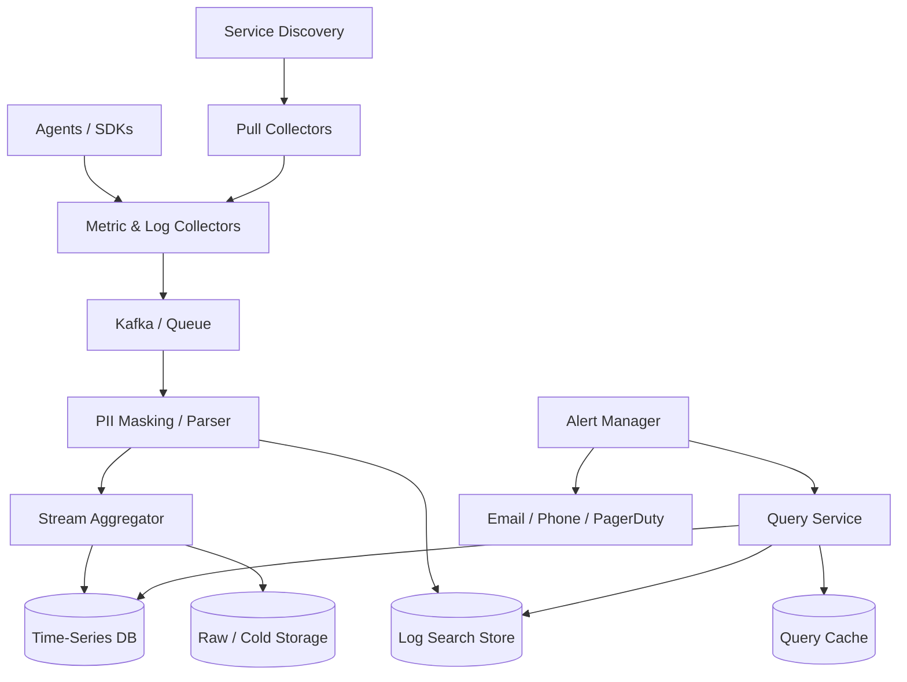

# 设计 Monitoring / Distributed Logs & Metrics 系统

## 功能需求

- 收集 infrastructure metrics、service metrics、logs 和 exceptions。
- 支持 dashboard 查询：按 service、host、region、status、api path 等维度聚合。
- 支持 alert rules，并通过 Email、Phone、PagerDuty 等渠道通知。
- 支持 PII masking、top K exceptions、长期 retention 和 downsampling。

## 非功能需求

- 写入极重，读取相对 spiky：dashboard、incident、alert evaluation 会形成查询峰值。
- Dashboard 和 alert 查询要低延迟，不能因为存储抖动漏掉关键告警。
- 数据管道高可靠，短暂 TSDB/日志存储不可用时不应直接丢数据。
- 标签维度要控制 cardinality，否则 time-series index 会爆炸。

## 规模估算

- 机器规模：
  - `1000 server pools * 100 machines = 100,000 machines`
  - 每台机器 `100 metrics`
  - 总 active time series 约 `10,000,000`

- 写入规模：
  - 如果每 5 秒上报一次：`10M samples / 5s = 2M samples/s`
  - 每个 sample 粗略 `timestamp + value + tags + overhead ~= 100B`
  - 原始写入约 `200MB/s = 12GB/min = 17TB/day`
  - 加上 replication、index、WAL、logs、overhead，按几十 TB/day 规划是合理的。

- Retention：
  - raw data：7 天。
  - 1 minute granularity：30 天。
  - 1 hour granularity：1 年。
  - 长期存储必须 downsample + compression，否则 PB 级成本很高。

## API 设计

```text
POST /metrics/ingest
- request: samples[{metric_name, value, timestamp, labels}]
- response: accepted_count, rejected_count

POST /logs/ingest
- request: logs[{timestamp, service, host, level, message, fields}]
- response: accepted_count

POST /query
- request: metric_name, filters, group_by, start, end, step, aggregation
- response: series[]

POST /logs/search
- request: filters, text_query, start, end, group_by?, top_k?
- response: logs[] | aggregations

POST /alerts/rules
- request: name, query, condition, duration, severity, channels
- response: rule_id

GET /alerts/incidents?status=open
- response: incidents[]
```

## 高层架构



## 关键组件

- Agents / SDKs
  - 运行在每台机器或服务进程中。
  - 收集 CPU、memory、disk、network、request rate、error rate、exceptions。
  - 可以做轻量本地聚合，比如每 10 秒/60 秒聚合 counter。
  - 注意：不要在 agent 端做复杂逻辑；agent 越复杂，部署和升级越难。

- Pull Collectors + Service Discovery
  - Pull model 中 collector 需要知道完整 endpoint 列表。
  - Service Discovery 存 endpoint、scrape interval、timeout、retry 参数。
  - Collector 可用 consistent hashing 分配 scrape targets，保证一个 target 只被一个 collector 采集。
  - 好处是天然能发现 “机器没上报”，因为 pull 失败就是 health signal。

- Push Collectors
  - Agent 主动 push metrics/logs 到 collector。
  - Collector 后面可以放 load balancer，水平扩展简单。
  - 如果 collector 拒绝请求，agent 可本地 buffer 后重试。
  - 注意：autoscaling 中机器被缩掉时，本地 buffer 可能丢，所以关键数据要尽快进 durable queue。

- Kafka / Message Queue
  - 解耦数据收集和存储写入。
  - TSDB 或 log store 短暂不可用时，Kafka 可以缓冲。
  - 按 metric name、service、tenant 或 log stream partition。
  - Consumers 可以在写 TSDB 前做 aggregation、PII masking、topK exception 计算。

- PII Masking / Parser
  - 日志写入前做字段解析和敏感信息脱敏。
  - 例如 email、phone、token、credit card、address。
  - 最好在 collector/ingestion pipeline 早期处理，避免 raw PII 落入可查询热存储。
  - 对确需审计的 raw logs，要加密、严格 RBAC、短 retention。

- Stream Aggregator
  - 对 metrics 做窗口聚合：sum、avg、p95/p99、rate、topK。
  - 对 exceptions 做 fingerprint，然后统计 top K。
  - 可以把高频 raw samples 聚合成 1min data point，减少写入。
  - 注意：聚合会损失 raw detail，所以 raw data 至少保留 7 天用于 incident debug。

- Time-Series DB
  - 存 metrics time series。
  - 支持 tags/labels、time range query、aggregation、downsampling。
  - 可选 OpenTSDB、InfluxDB、M3DB、Prometheus remote storage、Amazon Timestream。
  - 查询最好集中在低 cardinality labels 上，比如 service、region、status。

- Log Search Store
  - 存结构化日志和 exception events。
  - 可用 Elasticsearch/OpenSearch、ClickHouse、Loki。
  - 支持按 fields 查询、全文搜索、group by、topK exceptions。
  - PII masked fields 要和 raw fields 明确分层。

- Query Service
  - 统一接收 dashboard、alert、ad-hoc query。
  - 根据时间范围选择 raw / 1min / 1h resolution。
  - 做 query rewrite、fanout、merge、rate limit 和 cache。
  - 对高 cardinality query 要限流或异步执行。

- Alert Manager
  - 定期拉取 alert config，调用 Query Service 评估规则。
  - 支持 duration、for、cooldown、dedup、silence、routing。
  - 通知渠道：Email、phone call、SMS、PagerDuty。
  - Alert 状态本身要持久化，避免 manager restart 导致重复通知或漏通知。

## 核心流程

- Metrics push flow
  - Agent 每 5 秒采集 metrics。
  - Agent 可本地做简单 counter aggregation。
  - Push 到 Collector。
  - Collector 校验 labels、tenant、timestamp，写 Kafka。
  - Aggregator 消费 Kafka，做 downsampling/pre-aggregation。
  - 写 TSDB 和 cold object storage。

- Metrics pull flow
  - Service Discovery 提供 scrape target 列表。
  - Collectors 通过 consistent hashing 分配 targets。
  - Collector 定期访问 `/metrics` endpoint。
  - Scrape 失败记录为 target down，也可触发 health alert。
  - 成功数据进入 Kafka 和后续 pipeline。

- Logs / exceptions flow
  - Agent 收集 stdout/file/appender 日志。
  - Collector 接收后先 parse structured fields。
  - PII Masker 对 message 和字段脱敏。
  - Exception fingerprint 生成 `exception_hash`。
  - 写 Log Store，同时聚合 top K exception 到 TSDB/OLAP。

- Alert evaluation flow
  - Alert Manager 每隔 N 秒读取规则。
  - 调 Query Service 查询最近窗口数据。
  - 规则满足后持续 `duration` 才触发。
  - 触发后进入 incident state，按 routing 发 PagerDuty/Email/Phone。
  - 恢复条件满足后标记 resolved。

- Retention/downsampling flow
  - Raw 5s data 保留 7 天。
  - Downsampler 生成 1min granularity，保留 30 天。
  - 再生成 1h granularity，保留 1 年。
  - 历史 query 自动选择最合适 resolution。

## 存储选择

- General-purpose SQL
  - ✅ 适合 alert config、用户、权限、dashboard metadata。
  - ❌ 不适合 constant heavy write 的 metrics samples。
  - ❌ 对 time-series rolling avg、tag index、high write load 都不理想。

- NoSQL
  - ✅ 可以承受高写入。
  - ❌ 难设计通用 schema 支持各种 time range + tag aggregation。
  - ❌ 多维查询和 downsampling 通常要自己实现。

- Time-Series DB
  - ✅ 专门处理 timestamp + labels + value。
  - ✅ 支持压缩、downsampling、time range query、label aggregation。
  - ❌ 对 high cardinality labels 非常敏感。

- Log Search / OLAP Store
  - Elasticsearch/OpenSearch 适合全文搜索和字段过滤。
  - ClickHouse 适合结构化日志、聚合、topK、长时间范围分析。
  - Loki 适合低成本 log aggregation，但高 cardinality label 也要谨慎。

- Object Storage
  - 存 raw 压缩数据、归档日志、重放数据。
  - 成本低，查询慢。
  - 适合长期审计和离线 backfill。

## 扩展方案

- Collector stateless scale；push model 前面加 LB，pull model 用 consistent hashing 分 targets。
- Kafka 按 metric/log stream 分区，吸收写入峰值和存储故障。
- Aggregator worker 按 metric name/service partition 做预聚合。
- TSDB 按 time + metric + tenant shard，副本保证可用性。
- Query Service 做缓存、限流和 query planning，防止 ad-hoc query 打爆 TSDB。
- Logs 和 metrics 分开存储：metrics 走 TSDB，logs/exceptions 走 log store/OLAP。

## 系统深挖

### 1. 收集模型：Push vs Pull

- 方案 A：Pull model
  - 适用场景：基础设施服务、Kubernetes/Prometheus 风格监控。
  - ✅ 优点：Collector 能知道哪些 target 没响应，天然支持 health check。
  - ✅ 优点：采集频率由平台控制，避免 agent 乱打。
  - ❌ 缺点：需要 Service Discovery；collector 扩缩容时要重新分配 targets。

- 方案 B：Push model
  - 适用场景：短生命周期任务、移动端、serverless、跨网络边界。
  - ✅ 优点：agent 主动上报，collector 后面加 LB 即可扩展。
  - ✅ 优点：服务频繁扩缩容时不需要 collector 立刻发现 endpoint。
  - ❌ 缺点：collector 只收到 90 台机器上报时，不容易知道另外 10 台是挂了还是没有数据。

- 方案 C：Hybrid
  - 适用场景：生产监控平台。
  - ✅ 优点：infra/service metrics 用 pull；logs/custom metrics 用 push。
  - ❌ 缺点：两套采集模型，配置和排障更复杂。

- 推荐：
  - 服务和机器核心指标优先 pull，能发现 missing target。
  - 应用自定义指标和 logs 用 push。
  - Push 模型下要引入 heartbeat/expected target registry，否则无法判断缺失实例。

### 2. 为什么需要 Message Queue

- 方案 A：Collector 直接写 TSDB
  - 适用场景：小规模系统。
  - ✅ 优点：路径短，延迟低。
  - ❌ 缺点：TSDB 抖动时 collector 只能丢数据或阻塞；扩容不灵活。

- 方案 B：Collector -> Kafka -> Consumers -> TSDB
  - 适用场景：大规模监控系统。
  - ✅ 优点：解耦采集和存储；存储不可用时可缓冲；consumer 可水平扩展。
  - ❌ 缺点：增加端到端延迟和运维复杂度。

- 方案 C：Agent local buffer + queue
  - 适用场景：希望最大限度减少丢数据。
  - ✅ 优点：collector 短暂不可用时 agent 可暂存。
  - ❌ 缺点：autoscaling 机器被销毁时本地 buffer 可能丢。

- 推荐：
  - 大规模一定要 MQ。
  - Kafka partition 可按 metric name/service/tenant，让 aggregation 更有 locality。
  - Critical alerts 可使用更短链路或双写 fast path，避免队列长时间积压。

### 3. Aggregation 在哪里做

- 方案 A：Agent 端聚合
  - 适用场景：counter、histogram、简单 rate。
  - ✅ 优点：减少网络和 ingestion 压力。
  - ❌ 缺点：agent 聚合后 raw detail 丢失；agent 逻辑复杂。

- 方案 B：Ingestion pipeline 聚合
  - 适用场景：大规模 metrics 主路径。
  - ✅ 优点：集中控制聚合逻辑；可以 batch、dedup、处理 late events。
  - ❌ 缺点：pipeline 计算压力大，端到端延迟增加。

- 方案 C：Query-time aggregation
  - 适用场景：低 QPS、ad-hoc query。
  - ✅ 优点：保留 raw data，查询灵活。
  - ❌ 缺点：大量 dashboard/alert 会反复扫描，成本高。

- 推荐：
  - Agent 做轻量本地聚合。
  - Ingestion pipeline 做 1min/1h rollup。
  - Raw data 保留 7 天，长期数据只保留 downsampled。

### 4. Tagging 和 Cardinality

- 方案 A：只允许低 cardinality labels
  - 适用场景：核心 metrics。
  - ✅ 优点：TSDB index 可控，查询快。
  - ❌ 缺点：排障维度有限。

- 方案 B：允许任意 labels
  - 适用场景：不建议。
  - ✅ 优点：业务方灵活。
  - ❌ 缺点：`user_id/device_id/request_id` 会造成 cardinality disaster。

- 方案 C：分层存储
  - 适用场景：生产系统。
  - ✅ 优点：低 cardinality metrics 进 TSDB；高 cardinality events/logs 进 log/OLAP store。
  - ❌ 缺点：用户需要知道查 metrics 还是查 logs/events。

- 推荐：
  - TSDB labels 控制在 service、region、status、method、endpoint template 等。
  - 禁止 `user_id`、raw URL、request_id 作为 metric label。
  - 高 cardinality 调试信息放 logs/traces/OLAP。

### 5. Logs PII Masking 和字段查询

- 方案 A：应用侧自行 masking
  - 适用场景：团队成熟、数据规范强。
  - ✅ 优点：PII 在源头就不产生。
  - ❌ 缺点：依赖所有业务正确实现，容易漏。

- 方案 B：Ingestion pipeline masking
  - 适用场景：平台统一治理。
  - ✅ 优点：统一规则，所有日志进入热存储前脱敏。
  - ❌ 缺点：正则/解析可能误伤或漏掉复杂 PII。

- 方案 C：双层存储
  - 适用场景：合规要求强。
  - ✅ 优点：masked logs 给大多数查询；encrypted raw logs 严格 RBAC 短期保留。
  - ❌ 缺点：系统复杂，审计要求高。

- 推荐：
  - 应用侧规范 + ingestion 强制 masking。
  - 日志结构化，字段级 masking 比纯文本正则可靠。
  - Raw PII 只能短期加密保留，并且必须审计访问。

### 6. Top K Exceptions

- 方案 A：Query-time group by exception
  - 适用场景：数据量小或临时分析。
  - ✅ 优点：结果灵活。
  - ❌ 缺点：大规模日志扫描成本高，延迟高。

- 方案 B：Ingestion-time fingerprint + topK
  - 适用场景：持续 dashboard 和 alert。
  - ✅ 优点：查询快，能实时看到 top exceptions。
  - ❌ 缺点：fingerprint 规则要设计好，否则相同异常被拆散或不同异常被合并。

- 方案 C：Approximate topK
  - 适用场景：极大规模、允许近似。
  - ✅ 优点：内存低，吞吐高。
  - ❌ 缺点：不是精确结果，需要给用户解释误差。

- 推荐：
  - 日志进入 pipeline 时生成 `exception_hash`。
  - 按 `service + version + exception_hash + time_bucket` 聚合。
  - topK 结果写 TSDB/OLAP，原始样本日志保留用于 drill-down。

### 7. Alert Rule 设计

- 方案 A：简单 threshold
  - 适用场景：CPU、disk、error rate 这类稳定指标。
  - ✅ 优点：容易理解。
  - ❌ 缺点：对增长型指标如 DAU 不适合；边界抖动会误报。

- 方案 B：Window condition
  - 适用场景：减少抖动。
  - ✅ 优点：例如 “过去 15 分钟内多数点超过阈值” 更稳。
  - ❌ 缺点：规则表达比单点 threshold 复杂。

- 方案 C：Anomaly detection
  - 适用场景：DAU、QPS 等有趋势和季节性的指标。
  - ✅ 优点：能发现 “突然掉一半” 这类相对异常。
  - ❌ 缺点：模型需要训练和调参，解释性较差。

- 推荐：
  - CPU 这种：不要写 “连续 15 分钟每个点都 > 90%”，否则第 15 分钟低一点就不报警。
  - 更好写法：过去 15 分钟 60 个 datapoints 中至少 45 个超过 90%，或 avg/p95 超过阈值。
  - DAU 这种增长指标：用 week-over-week、same-hour-baseline、moving average deviation 检测突降。

### 8. Query Cache 和滑动窗口优化

- 方案 A：按完整 query string 缓存
  - 适用场景：dashboard 固定时间范围。
  - ✅ 优点：实现简单。
  - ❌ 缺点：`1 <= time <= 10` 和 `2 <= time <= 11` 是两个 key，命中率低。

- 方案 B：按 time bucket 缓存
  - 适用场景：滑动窗口查询。
  - ✅ 优点：第二次查询只需要复用 `2..10` 的 bucket，再补 `11`。
  - ❌ 缺点：需要 query planner merge buckets。

- 方案 C：Materialized dashboard panels
  - 适用场景：热门 dashboard 和 alert query。
  - ✅ 优点：延迟最低，保护 TSDB。
  - ❌ 缺点：灵活性低，预计算成本高。

- 推荐：
  - Cache key 不只用完整 time range，而是拆成：

```text
metric + filters + group_by + aggregation + resolution + time_bucket
```

  - Query Service 把时间范围切成 buckets，复用已缓存 bucket。
  - 最新未完成 bucket TTL 短，历史 bucket TTL 长。

### 9. 如果新增指标或新增维度怎么办

- 方案 A：固定 schema
  - 适用场景：指标集合很稳定。
  - ✅ 优点：查询和存储可控。
  - ❌ 缺点：新增 disk/memory 这类指标要改 schema 或 pipeline。

- 方案 B：metric name + labels 通用模型
  - 适用场景：监控系统主流。
  - ✅ 优点：新增指标不需要改表；同一时间 CPU/disk/memory 都是不同 metric name。
  - ❌ 缺点：必须控制 label cardinality 和命名规范。

- 方案 C：Schema registry / metric registry
  - 适用场景：大型组织。
  - ✅ 优点：可以治理 metric owner、type、unit、allowed labels。
  - ❌ 缺点：增加治理流程。

- 推荐：
  - 用通用 time-series 模型：

```text
metric_name, timestamp, value, labels{service, host, region, pool, status}
```

  - 新增 disk/memory 只是新增 metric_name 或 allowed label。
  - 用 metric registry 防止乱打高 cardinality 标签。

### 10. 可靠性和故障模式

- 方案 A：Best-effort metrics
  - 适用场景：低价值 debug metrics。
  - ✅ 优点：成本低。
  - ❌ 缺点：incident 时最需要数据，结果可能丢。

- 方案 B：Durable ingestion
  - 适用场景：核心 metrics 和 alerts。
  - ✅ 优点：Kafka/WAL 缓冲，TSDB 故障时可恢复写入。
  - ❌ 缺点：成本和延迟更高。

- 方案 C：Multi-region / replicated TSDB
  - 适用场景：平台级监控，监控系统自身也要高可用。
  - ✅ 优点：单 region 故障仍可报警。
  - ❌ 缺点：跨 region 成本、重复数据、查询一致性复杂。

- 推荐：
  - Collector、Kafka、TSDB 都要多副本。
  - Alert Manager active-passive 或 shard by rule，并持久化 alert state。
  - 监控系统需要自监控：ingestion lag、drop rate、query latency、alert evaluation delay。

## 面试亮点

- Monitoring 系统是 write-heavy，query spiky；要用 MQ 解耦采集和存储。
- Pull model 的优势是能发现 missing targets；Push model 扩展简单但需要 heartbeat/registry 才知道谁没上报。
- TSDB 适合低 cardinality labels；`user_id/request_id/raw path` 这类高 cardinality 不能进 metric labels。
- Logs 和 metrics 要分层：metrics 进 TSDB，logs/exceptions 进 Log Store/OLAP，topK exceptions 在 ingestion 聚合。
- PII masking 应尽早发生，最好应用侧规范 + ingestion pipeline 强制脱敏。
- Long retention 不能保留全量 raw，需要 raw 7 天、1min 30 天、1h 1 年这种 downsampling。
- Alert rule 要用 window semantics，例如 N 个 datapoint 中 M 个触发，而不是脆弱的连续阈值。
- Query cache 要按 bucket 缓存，滑动窗口复用旧 bucket，只补新增时间段。

## 一句话总结

Monitoring 系统的核心是：用 agent/pull collector 收集 metrics 和 logs，经 Kafka 解耦后做 PII masking、aggregation、downsampling，再分别写入 TSDB 和 log store；查询层按 resolution 和 bucket 缓存，alert 层用稳定的窗口规则和可靠通知渠道，保证高写入规模下仍能低延迟查询和不漏关键告警。
