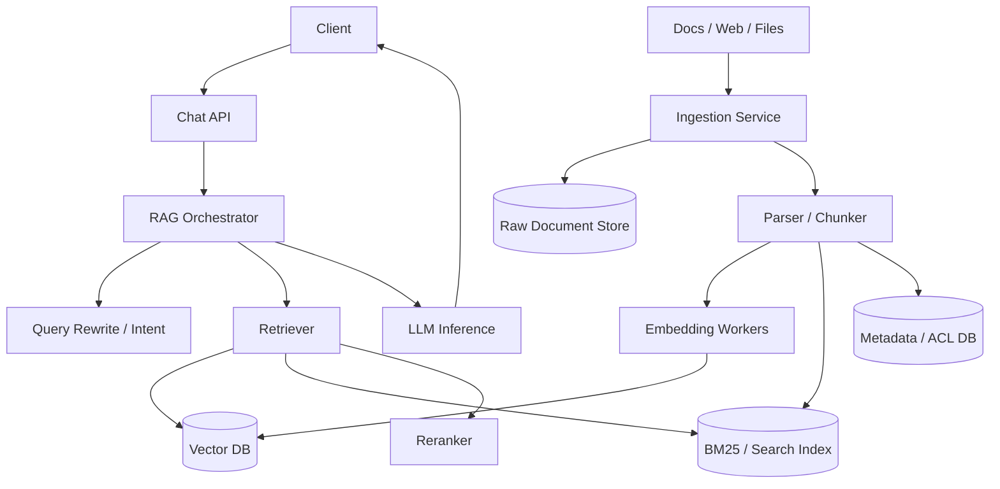

# 设计 RAG-based Chatbot 系统

## 功能需求

- 用户可以和 chatbot 对话，系统基于企业/网站/文档知识库回答问题。
- 支持文档 ingestion、解析、chunking、embedding、索引和增量更新。
- 回答需要带引用/citation，方便用户验证来源。
- 支持权限过滤，用户只能检索和看到自己有权限访问的文档内容。

## 非功能需求

- 在线问答低延迟，首 token 尽快返回，整体回答可流式输出。
- Retrieval 结果要相关、可解释，并能处理文档更新后的索引 freshness。
- Ingestion pipeline 可扩展、可重试，不能因为单个坏文档阻塞全局。
- 需要可观测和可评估：retrieval quality、answer quality、hallucination、latency、cost。

## API 设计

```text
POST /chat/sessions
- request: user_id, tenant_id
- response: session_id

POST /chat/sessions/{session_id}/messages
- request: user_id, message, retrieval_scope?, stream=true
- response: answer_stream, citations[], trace_id

POST /documents
- request: tenant_id, source_uri, metadata, acl
- response: document_id, ingestion_status

POST /documents/{document_id}/reindex
- response: job_id

GET /documents/{document_id}/status
- response: parsed|chunked|embedded|indexed|failed

GET /chat/sessions/{session_id}/messages?cursor=
- response: messages[], next_cursor
```

## 高层架构



## 关键组件

- Chat API
  - 管理 chat session、message history、streaming response。
  - 做 auth、rate limit、tenant isolation。
  - 把用户问题交给 RAG Orchestrator。
  - 不直接访问 vector DB，避免业务入口变复杂。

- RAG Orchestrator
  - 在线问答核心编排。
  - 步骤包括 query rewrite、retrieval、rerank、prompt assembly、LLM generation、citation。
  - 负责 latency budget，例如 retrieval 200ms、rerank 200ms、LLM first token 1s。
  - 注意：不要把所有历史消息都塞进 prompt，使用 conversation memory summary。

- Retriever
  - 支持 hybrid retrieval：
    - vector search 找语义相似 chunks。
    - BM25/keyword search 找精确词、代码、ID、专有名词。
  - 做 metadata/ACL filtering。
  - 返回候选 chunks 和 scores。
  - 注意：Vector DB 返回的是候选，不是最终事实；需要 rerank 和 citation。

- Reranker
  - Cross-encoder 或 LLM reranker 对候选 chunks 重新排序。
  - 提升 precision，降低无关 chunk 被塞进 prompt 的概率。
  - 可按 query 类型选择是否 rerank：简单 query 可跳过，复杂 query 必须 rerank。
  - 注意 rerank 很贵，要控制候选数量。

- Prompt Builder
  - 将 top chunks、用户问题、系统指令、引用 metadata 组装成 prompt。
  - 明确要求模型：
    - 只基于 context 回答。
    - 不确定时说明不知道。
    - 给出 citation。
  - 防 prompt injection：把 retrieved content 当作 untrusted data。

- LLM Inference
  - 调用托管 LLM 或自建 inference service。
  - 支持 streaming token 输出。
  - 输出后做 citation validation 和 safety filter。
  - 成本控制：按问题复杂度选择不同模型。

- Ingestion Service
  - 接入 PDF、HTML、Markdown、Google Drive、Confluence、网页等 source。
  - 保存 raw document 到 object store。
  - 创建 ingestion job，异步解析。
  - 支持 incremental crawl、delete、reindex。

- Parser / Chunker
  - 文档解析、正文抽取、表格/标题结构提取。
  - Chunking 可以按 section/heading/semantic boundary，而不是固定字符粗切。
  - 每个 chunk 带 metadata：

```text
chunk_id,
document_id,
tenant_id,
source_uri,
section_title,
chunk_text,
acl,
version,
created_at
```

- Embedding Workers
  - 批量调用 embedding model。
  - 写 Vector DB 和 Search Index。
  - 使用 `document_id + chunk_id + version` 做幂等。
  - 文档更新时新版本 chunks 写入，旧版本标记 inactive，后台清理。

- Metadata / ACL DB
  - 存 tenant、document、chunk、version、ACL、source freshness。
  - 在线 retrieval 必须按用户权限过滤。
  - ACL 变化需要触发 reindex 或更新 metadata filter。

## 核心流程

- 文档 ingestion
  - 用户上传或 connector 发现新文档。
  - Ingestion Service 写 raw document store。
  - Parser 抽取正文和结构。
  - Chunker 生成 chunks 和 metadata。
  - Embedding Workers 生成 vectors。
  - 写 Vector DB、Search Index、Metadata DB。
  - 标记 document indexed。

- 增量更新/删除
  - Connector 检测文档更新或删除。
  - 新版本文档走 parser/chunker/embed。
  - Metadata DB 将旧 chunk version 标记 inactive。
  - Vector/Search index 异步删除或过滤旧版本。
  - 在线 query 用 `active=true AND version=current` 过滤，避免读到旧内容。

- 用户提问
  - Chat API 收到 message。
  - Orchestrator 根据 session history 做 query rewrite。
  - Retriever 用 rewritten query 做 vector + keyword search。
  - 过滤 tenant、ACL、document status、metadata。
  - Reranker 选 top K chunks。
  - Prompt Builder 组装 context 和 citation ids。
  - LLM streaming 返回答案。
  - 保存 question、retrieved chunks、answer、feedback trace。

- 回答引用
  - 每个 chunk 带 `document_id/source_uri/section/page`。
  - LLM 输出 citation marker。
  - Post-processor 校验 citation 是否来自被检索 chunks。
  - 如果答案中有无 citation 的事实性声明，可降低 confidence 或提示无法确认。

## 存储选择

- Raw Document Store
  - S3/Object Storage。
  - 存原始 PDF/HTML/Markdown 和解析中间结果。

- Metadata / ACL DB
  - PostgreSQL/MySQL/DynamoDB。
  - 存 document、chunk version、ACL、tenant、connector state。
  - 是权限和索引状态 source of truth。

- Vector DB
  - Pinecone、Milvus、Weaviate、pgvector、OpenSearch vector、FAISS service。
  - 存 embedding + metadata。
  - 支持 ANN search 和 metadata filters。

- Search Index
  - Elasticsearch/OpenSearch。
  - BM25、exact keyword、title/heading boost。

- Chat Store
  - 存 session messages、summaries、feedback、retrieval trace。
  - 可用于 evaluation 和 debug。

## 扩展方案

- Ingestion pipeline 用 queue 解耦 parser、chunker、embedding、indexer。
- Embedding workers 批处理，按 tenant/source 限流。
- Vector DB 按 tenant 或 collection shard，避免 noisy neighbor。
- 热门问题和稳定文档可以缓存 retrieval results，但要绑定 index version。
- 在线 query path 做 timeout budget，retrieval/rerank 超时则降级。
- 多模型策略：简单 FAQ 用小模型，复杂多文档综合用强模型。

## 系统深挖

### 1. Chunking：固定长度 vs 结构化/语义切分

- 方案 A：固定 token 长度切分
  - 适用场景：快速 MVP。
  - ✅ 优点：实现简单，chunk 大小可控。
  - ❌ 缺点：可能切断表格、标题、步骤，导致 retrieval 上下文不完整。

- 方案 B：按 heading/section 结构切分
  - 适用场景：文档结构清晰，如 Markdown/HTML/Confluence。
  - ✅ 优点：chunk 语义完整，citation 更清楚。
  - ❌ 缺点：PDF/OCR/脏 HTML 解析难。

- 方案 C：Semantic chunking + overlap
  - 适用场景：高质量 RAG。
  - ✅ 优点：更符合语义边界；overlap 减少信息断裂。
  - ❌ 缺点：计算成本和实现复杂度更高。

- 推荐：
  - 先按结构切分，fallback 到 token chunking。
  - 对长 section 做二级切分和少量 overlap。
  - chunk metadata 保留 title/path/page，方便 citation。

### 2. Retrieval：Vector vs BM25 vs Hybrid

- 方案 A：纯 vector search
  - 适用场景：语义问答。
  - ✅ 优点：能找到同义表达和语义相关内容。
  - ❌ 缺点：对精确 ID、错误码、函数名、专有名词不稳定。

- 方案 B：BM25 / keyword search
  - 适用场景：精确词匹配、日志、代码、错误码。
  - ✅ 优点：可解释，精确匹配强。
  - ❌ 缺点：语义泛化弱。

- 方案 C：Hybrid retrieval
  - 适用场景：生产 RAG chatbot。
  - ✅ 优点：兼顾语义和精确匹配。
  - ❌ 缺点：score fusion、去重和 rerank 更复杂。

- 推荐：
  - 使用 vector + BM25 hybrid。
  - 先取较大候选集，再 rerank。
  - query type detection：ID/代码类提高 BM25 权重，概念类提高 vector 权重。

### 3. Metadata / ACL Filtering

- 方案 A：检索后在应用层过滤 ACL
  - 适用场景：小规模或低风险数据。
  - ✅ 优点：实现简单。
  - ❌ 缺点：如果过滤后结果不足，需要二次检索；也有误暴露风险。

- 方案 B：Vector DB metadata pre-filter
  - 适用场景：多租户和权限敏感 RAG。
  - ✅ 优点：只在 allowed corpus 内 ANN search，安全边界更清楚。
  - ❌ 缺点：allowed_ids 太多时 filter 成本高；索引分片复杂。

- 方案 C：按 tenant/permission group 分 collection/shard
  - 适用场景：企业知识库。
  - ✅ 优点：隔离强，filter 更简单。
  - ❌ 缺点：collection 多，管理和资源利用复杂。

- 推荐：
  - tenant 级强隔离，tenant 内用 permission group/document ACL metadata filter。
  - allowed_ids 太多时不要传巨大列表，改用 permission group id / ACL version。
  - 回答前 citation 再做一次权限校验。

### 4. Reranking 和 Context Assembly

- 方案 A：直接把 vector topK 塞进 prompt
  - 适用场景：MVP。
  - ✅ 优点：低延迟，实现简单。
  - ❌ 缺点：容易混入不相关 chunk，浪费 context window。

- 方案 B：Cross-encoder rerank
  - 适用场景：高质量问答。
  - ✅ 优点：precision 明显提升。
  - ❌ 缺点：延迟和成本增加。

- 方案 C：LLM rerank / answer-aware selection
  - 适用场景：复杂多跳问题。
  - ✅ 优点：能更智能地选上下文。
  - ❌ 缺点：成本高，且可能引入不稳定。

- 推荐：
  - 常规 query 用 lightweight reranker。
  - 高复杂度 query 用强 reranker。
  - Prompt context 按 relevance、diversity、source freshness 选择，不只看相似度。

### 5. Index Freshness：Streaming vs Batch Ingestion

- 方案 A：纯 batch reindex
  - 适用场景：文档变化少。
  - ✅ 优点：实现简单，索引一致性好。
  - ❌ 缺点：新内容延迟高。

- 方案 B：Streaming ingestion
  - 适用场景：文档经常更新，要求快速可查。
  - ✅ 优点：新文档/更新可分钟级进入索引。
  - ❌ 缺点：partial failure、重复消息、旧版本清理更复杂。

- 方案 C：Streaming + batch reconciliation
  - 适用场景：生产系统。
  - ✅ 优点：实时性和最终正确性兼顾。
  - ❌ 缺点：需要维护 reindex job 和差异修复。

- 推荐：
  - 新增/更新文档走 streaming pipeline。
  - 定期 batch reconciliation 检查 raw docs、metadata、vector index 是否一致。
  - Query 时用 active version filter，避免混用旧新版本。

### 6. Prompt Injection 和安全

- 方案 A：完全信任 retrieved context
  - 适用场景：不适合真实系统。
  - ✅ 优点：简单。
  - ❌ 缺点：文档里可能包含 “忽略之前指令” 等 prompt injection。

- 方案 B：把 context 当 untrusted data
  - 适用场景：生产 RAG。
  - ✅ 优点：系统指令明确模型不能执行文档中的指令。
  - ❌ 缺点：不能完全杜绝，需要模型和后处理配合。

- 方案 C：Content sanitization + policy layer
  - 适用场景：安全要求高。
  - ✅ 优点：可过滤明显恶意内容、敏感输出。
  - ❌ 缺点：误杀和漏检都存在。

- 推荐：
  - System prompt 明确 retrieved docs are untrusted.
  - Citation validation 和 output policy filter。
  - 工具调用/写操作必须额外授权，不能由 retrieved content 触发。

### 7. Evaluation Metrics

- 方案 A：只看用户点赞
  - 适用场景：早期产品反馈。
  - ✅ 优点：简单直接。
  - ❌ 缺点：稀疏、偏置大，无法定位 retrieval 还是 generation 问题。

- 方案 B：Retrieval metrics
  - 适用场景：检索质量评估。
  - ✅ 优点：Recall@K、MRR、nDCG 能定位是否找到了正确上下文。
  - ❌ 缺点：需要标注数据或 golden set。

- 方案 C：End-to-end answer metrics
  - 适用场景：整体质量评估。
  - ✅ 优点：Faithfulness、answer correctness、citation accuracy 更贴近用户体验。
  - ❌ 缺点：评估成本高，LLM-as-judge 有偏差。

- 推荐：
  - 同时看 retrieval 和 generation。
  - 线上看 answer rate、citation click、thumbs up/down、fallback rate。
  - 离线用 golden questions 做 regression test。

### 8. Latency 和 Cost Optimization

- 方案 A：每次都完整检索 + 强模型回答
  - 适用场景：低 QPS 高质量场景。
  - ✅ 优点：质量高。
  - ❌ 缺点：延迟和成本高。

- 方案 B：多级缓存
  - 适用场景：重复问题多。
  - ✅ 优点：低延迟低成本。
  - ❌ 缺点：文档更新后 cache invalidation 要绑定 index version。

- 方案 C：模型路由
  - 适用场景：生产系统。
  - ✅ 优点：简单问题用小模型，复杂问题用大模型。
  - ❌ 缺点：需要 query classifier 和 fallback。

- 推荐：
  - Cache query rewrite/retrieval result by `query + tenant + ACL version + index version`。
  - Prompt/answer cache 只用于稳定知识和低风险问题。
  - 设置 retrieval/rerank/LLM timeout，超时降级。

## 面试亮点

- RAG 的 source of truth 是 raw documents 和 metadata/ACL，vector index 是 derived store，必须可重建。
- 在线 query path 和 ingestion path 要分开：query 要低延迟，ingestion 要可重试、可回放、可修复。
- Retrieval 不能只讲 vector DB；生产系统通常 hybrid search + rerank + metadata filter。
- 权限过滤最好在 retrieval 前完成，allowed_ids 太多时要用 permission group/ACL version，而不是巨大 ID list。
- Chunking 质量决定 retrieval 上限，结构化 chunk + metadata 比固定字符切分更有面试说服力。
- 文档更新要用 versioned chunks 和 active filter，避免 prompt 混入旧版本内容。
- Prompt injection 要明确：retrieved context 是不可信数据，不能让文档内容覆盖系统指令。
- 评估要拆成 retrieval metrics 和 answer metrics，否则效果差时不知道该修索引、chunking、rerank 还是 prompt。

## 一句话总结

RAG-based Chatbot 的核心是：离线/流式 ingestion 把 raw documents 解析成 versioned chunks 并写入 vector/search derived indexes，在线 query path 做 query rewrite、hybrid retrieval、ACL filter、rerank、prompt assembly 和 streaming generation，并通过 citation、guardrails、evaluation 和 index reconciliation 保证答案可信、可解释、可持续改进。

## 参考

- 用户提供的 ChatGPT 链接：无法读取公开正文，本文按 RAG chatbot 系统设计常见面试要点和前序讨论整理。
