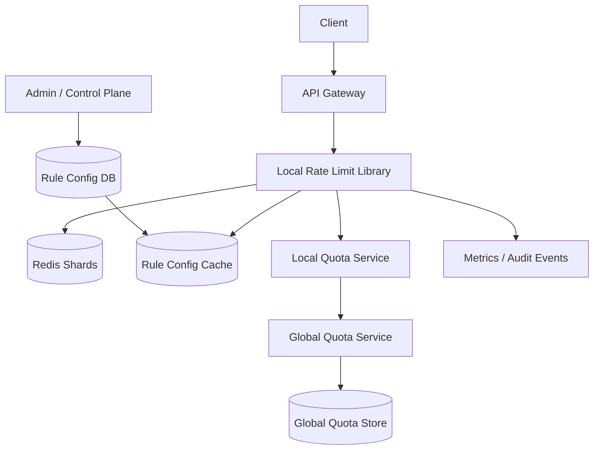

# 设计 Rate Limiter 系统

## 功能需求

- 对 user、IP、API key、tenant、endpoint 等维度做限流。
- 支持多种限流策略：Token Bucket、Leaky Bucket、Fixed Window、Sliding Window。
- 支持分布式限流，多个 API gateway / service instance 共享限流状态。
- 支持跨 DC global quota，同时保持本地请求低延迟。

## 非功能需求

- 限流判断必须低延迟，通常在 API gateway 热路径内完成。
- 系统要水平扩展，避免单个 Redis shard 或 quota service 成为瓶颈。
- 对跨 DC 全局限制允许短暂误差，但要避免长期超配。
- 限流配置需要动态更新，且要有可观测性和审计能力。

## API 设计

```text
POST /ratelimit/check
- request: key, dimension=user|ip|api_key|tenant, endpoint, cost=1
- response: allowed, remaining, retry_after_ms, rule_id

POST /ratelimit/rules
- request: scope, algorithm, limit, window, burst, priority
- response: rule_id

GET /ratelimit/rules?scope=
- response: rules[]

GET /ratelimit/usage?key=&start=&end=
- response: usage, throttled_count
```

## 高层架构



## 关键组件

- API Gateway / Local Rate Limit Library
  - 在请求进入业务服务前执行限流。
  - 根据请求提取 limit key：
    - authenticated users：`user_id`
    - anonymous users：`ip`
    - API key requests：`api_key`
    - tenant-level：`tenant_id`
  - 本地缓存 rule config，避免每次查 DB。
  - 对低风险规则可用本地 approximate counter，对严格规则查 Redis/quota service。

- Rule Config Service
  - 存限流规则和优先级。
  - 支持按 route、method、tenant、plan、user tier 配置。
  - 规则变更通过 pub/sub 推送到 gateway，本地 cache 带 version。
  - 注意：规则配置是 control plane，不应该在每个请求热路径查它。

- Redis Shards
  - 存分布式 counter/token state。
  - 用 consistent hashing 将 key 映射到 Redis shard：

```text
rate_key = hash(dimension + ":" + identifier + ":" + rule_id)
shard = consistent_hash(rate_key)
```

  - 对 authenticated user 按 user_id hash。
  - 对 anonymous 按 IP hash。
  - 对 API key 按 api_key hash。
  - 使用 Lua script 保证 check + update 原子。

- Local Quota Service
  - 每个 region/DC 内的本地 quota 分配器。
  - 客户端总是访问 local quota service，避免跨 DC 同步调用增加延迟。
  - Local service 从 global quota service 预取一段 quota。
  - 本地周期性和 global sync 使用量、剩余量和 drift。

- Global Quota Service
  - 管理跨 DC 总 quota，例如一个 API key 全球每分钟 10,000 次。
  - 给各 DC 分配 quota slice。
  - 根据各 DC 使用率动态调整分配。
  - 注意：强一致 global check 会增加尾延迟和降低可用性，通常不放在每次请求热路径。

- Metrics / Audit
  - 记录 allowed/throttled count、rule hit、retry_after、Redis latency。
  - 高价值客户被 throttle 要能 debug。
  - 需要 dashboard：top throttled users、top endpoints、Redis hot keys。

## 核心流程

- 单 region 限流
  - Gateway 收到请求。
  - 从请求中提取 `user_id/ip/api_key`。
  - 匹配 rule config。
  - 根据 rate key consistent hash 到 Redis shard。
  - Redis Lua 执行限流算法，返回 allowed/remaining/retry_after。
  - Gateway allowed 则转发，rejected 则返回 429。

- 跨 DC global quota
  - Global Quota Service 按 API key / tenant 维护总 quota。
  - 每个 DC 的 Local Quota Service 定期申请 quota slice。
  - Gateway 请求只查 local quota，低延迟响应。
  - Local service 周期性上报 usage 给 global。
  - Global 根据实际流量调整下一轮 quota 分配。

- 配置更新
  - Admin 更新 rule config。
  - Config DB 写入新 version。
  - Config Service 广播规则变更。
  - Gateways 更新本地 cache。
  - 请求判断时带 rule version，便于排查旧规则生效问题。

- Redis shard 扩容
  - 新 shard 加入 consistent hash ring。
  - 部分 rate keys 迁移到新 shard。
  - 短窗口限流状态可以接受自然过期；长窗口状态需要迁移或双读。
  - Gateway/Library 按 ring version 路由。

## 存储选择

- Redis
  - 最适合低延迟 counter/token state。
  - Lua script 原子执行 check/update。
  - TTL 自动清理窗口状态。
  - 缺点是 hot key 和跨 DC 强一致能力有限。

- Config DB
  - PostgreSQL / DynamoDB。
  - 存 rate limit rules、tenant plan、override、audit。
  - 读路径走 cache，不直接打 DB。

- Metrics Store
  - TSDB / ClickHouse。
  - 存 usage、throttle count、latency、hot key 统计。
  - 用于 dashboard、billing、debug。

- Global Quota Store
  - DynamoDB/Spanner/FoundationDB 等可选。
  - 如果全球强一致要求高，需要一致性更强的存储。
  - 普通 rate limit 通常用 local quota + periodic sync，避免强一致热路径。

## 扩展方案

- Rate limiter library 嵌入 gateway，减少网络 hop。
- Redis 按 rate key consistent hashing 分片。
- 对超热点 key 使用 local pre-consumption / batching，减少 Redis QPS。
- 不同 rule 分层：cheap local limit、Redis distributed limit、global quota limit。
- Global quota 不做每次同步检查，而是 local quota service 预分配额度。
- 监控 hot key、429 rate、Redis latency、quota drift，自动调配 shard 或规则。

## 系统深挖

### 1. Token Bucket vs Leaky Bucket vs Fixed Window vs Sliding Window

- 方案 A：Token Bucket
  - 适用场景：允许 burst，但长期速率受控。
  - ✅ 优点：用户体验好；可配置 refill rate 和 bucket capacity。
  - ❌ 缺点：实现比 fixed window 复杂；需要存 last_refill_time 和 tokens。

- 方案 B：Leaky Bucket
  - 适用场景：需要平滑出流，例如保护下游服务稳定速率。
  - ✅ 优点：请求处理速率稳定。
  - ❌ 缺点：burst 支持弱；队列满时直接拒绝或增加等待。

- 方案 C：Fixed Window
  - 适用场景：简单粗粒度限流。
  - ✅ 优点：实现简单，Redis `INCR + EXPIRE` 即可。
  - ❌ 缺点：窗口边界问题明显，两个窗口交界可能放过 2 倍请求。

- 方案 D：Sliding Window / Sliding Window Count
  - 适用场景：需要更精确控制窗口内请求量。
  - ✅ 优点：比 fixed window 平滑，边界误差小。
  - ❌ 缺点：精确 sliding log 存储成本高；sliding count 是近似。

- 推荐：
  - 通用 API limit 用 token bucket。
  - 保护下游稳定吞吐用 leaky bucket。
  - 简单 rule 或低价值 endpoint 用 fixed window。
  - 付费 API 配额或严格窗口用 sliding window count。

### 2. 分布式状态：本地计数 vs Redis 集中计数

- 方案 A：每个 gateway 本地计数
  - 适用场景：单实例或允许较大误差的限流。
  - ✅ 优点：极低延迟，不依赖外部 Redis。
  - ❌ 缺点：多个 gateway 会各自放量，总量可能超出限制。

- 方案 B：Redis 分布式计数
  - 适用场景：需要多个 gateway 共享 quota。
  - ✅ 优点：全局单 region 内较准确；Lua 原子操作。
  - ❌ 缺点：每个请求多一次 Redis 调用；Redis 热点和故障会影响请求路径。

- 方案 C：Local cache + Redis periodic sync
  - 适用场景：极高 QPS、允许轻微超限。
  - ✅ 优点：降低 Redis 压力。
  - ❌ 缺点：准确性下降，故障时可能 over-allow。

- 推荐：
  - 默认 Redis 分布式计数。
  - 极热 key 用本地小额度预取，周期性向 Redis 扣减。
  - 关键付费 quota 走更严格的 Redis/global quota。

### 3. Redis 分片：Consistent Hashing

- 方案 A：所有 key 进单 Redis
  - 适用场景：小规模。
  - ✅ 优点：简单。
  - ❌ 缺点：容量、QPS、hot key 很快成为瓶颈。

- 方案 B：按 key consistent hashing 到 Redis shards
  - 适用场景：大规模 rate limiter。
  - ✅ 优点：扩容迁移少量 key；不同 user/API key 分散到不同 shard。
  - ❌ 缺点：ring 变更期间短窗口状态可能迁移不一致。

- 方案 C：Redis Cluster
  - 适用场景：希望用现成分片能力。
  - ✅ 优点：运维成熟，自动分槽。
  - ❌ 缺点：multi-key 脚本受 hash slot 限制；复杂规则要设计 key tag。

- 推荐：
  - 只操作单个 rate key 的规则，consistent hashing 或 Redis Cluster 都可。
  - rate key 构造必须稳定：`rule_id + dimension + identifier`。
  - 匿名用户用 IP，登录用户用 user_id，API 请求用 API key。

### 4. 跨 DC Global Rate Limit

- 方案 A：每次请求同步调用 Global Quota Service
  - 适用场景：极严格全球配额，QPS 不高。
  - ✅ 优点：全局最准确。
  - ❌ 缺点：跨 DC 延迟高；global service 故障会影响所有地区。

- 方案 B：Local quota service + periodic sync
  - 适用场景：大规模全球 API。
  - ✅ 优点：请求只打本地，低延迟高可用。
  - ❌ 缺点：不同 DC 可能短暂超用，需要控制 quota drift。

- 方案 C：Static quota split
  - 适用场景：各地区流量稳定。
  - ✅ 优点：简单，无需频繁协调。
  - ❌ 缺点：某个 DC 流量突增时可能本地限流，但其他 DC 额度闲置。

- 推荐：
  - 使用 local quota service + global periodic sync。
  - Global 根据各 DC 近期使用率动态分配 quota slice。
  - 对金融/计费强一致 quota，可使用 global check 或保守预留。

### 5. Hot Key 和高 QPS API Key

- 方案 A：所有请求直接打同一个 Redis key
  - 适用场景：普通用户。
  - ✅ 优点：准确。
  - ❌ 缺点：大客户 API key 或热门 IP 会打爆单 Redis shard。

- 方案 B：本地 token lease
  - 适用场景：高 QPS key。
  - ✅ 优点：Gateway 从 Redis/Quota Service 预取一小批 token，本地消耗。
  - ❌ 缺点：gateway crash 可能丢未用 token；会产生轻微 underuse/overuse。

- 方案 C：分桶 counter
  - 适用场景：极高 QPS key，允许近似。
  - ✅ 优点：把一个 hot key 拆成多个 sub-key。
  - ❌ 缺点：读写多个 bucket 才能算总量，准确性/延迟 trade-off。

- 推荐：
  - 普通 key 直接 Redis Lua。
  - 高 QPS tenant/API key 使用 token lease。
  - Hot key 检测后自动切换策略。

### 6. Fail Open vs Fail Closed

- 方案 A：Redis/Quota service 故障时 fail open
  - 适用场景：用户体验优先，限流不是安全边界。
  - ✅ 优点：不因为限流系统故障阻断业务。
  - ❌ 缺点：下游可能被洪峰打垮。

- 方案 B：fail closed
  - 适用场景：安全、支付、写入成本极高接口。
  - ✅ 优点：保护核心系统。
  - ❌ 缺点：限流依赖故障会导致大量误拒。

- 方案 C：degraded local limit
  - 适用场景：生产系统。
  - ✅ 优点：Redis 故障时回退到本地保守限流。
  - ❌ 缺点：全局准确性下降。

- 推荐：
  - 默认 degraded local limit。
  - 低风险 GET 可 fail open。
  - 高风险写接口 fail closed 或 conservative local cap。

### 7. Sliding Window 实现

- 方案 A：Sliding log
  - 适用场景：严格精确、小 QPS key。
  - ✅ 优点：精确记录窗口内每个请求 timestamp。
  - ❌ 缺点：高 QPS 下内存巨大。

- 方案 B：Sliding window counter
  - 适用场景：大多数 API rate limit。
  - ✅ 优点：只存当前窗口和上一窗口 counter，成本低。
  - ❌ 缺点：是近似值。

- 方案 C：Bucketed counters
  - 适用场景：需要更平滑但不能存每次请求。
  - ✅ 优点：把窗口拆成多个小 bucket，例如 60 个 1s bucket。
  - ❌ 缺点：读时要聚合多个 bucket，写入和清理更复杂。

- 推荐：
  - 高 QPS 不用 sliding log。
  - 常规用 sliding window counter 或 bucketed counters。
  - Strict quota 用 token bucket + audit/reconciliation。

### 8. 配置和可观测性

- 方案 A：硬编码规则
  - 适用场景：小系统。
  - ✅ 优点：简单。
  - ❌ 缺点：无法动态调整，事故时反应慢。

- 方案 B：中心化配置 + 本地 cache
  - 适用场景：生产系统。
  - ✅ 优点：动态发布；请求热路径低延迟。
  - ❌ 缺点：配置版本、回滚、灰度要管理。

- 方案 C：策略引擎
  - 适用场景：复杂多租户、多 plan、多 endpoint。
  - ✅ 优点：表达能力强。
  - ❌ 缺点：策略评估成本和复杂度高。

- 推荐：
  - 规则存在 Config DB，gateway 本地 cache。
  - 支持灰度、版本、回滚。
  - 监控 allowed/throttled、rule hit、Redis latency、hot key、quota drift。

## 面试亮点

- Rate limiter 不是只有算法题，真正难点是分布式状态、hot key、跨 DC quota 和故障降级。
- Token bucket 适合 API burst，leaky bucket 适合平滑下游流量，fixed window 简单但有边界双倍问题。
- 分布式限流要用稳定 key：登录用户 hash user_id，匿名用户 hash IP，API key 请求 hash api_key。
- Redis Lua 可以保证单 key check/update 原子，但不能自动解决 hot key 和跨 DC 强一致。
- Global rate limit 通常不做每次跨 DC 同步检查，而是 local quota service 预取额度并周期性 sync global。
- Redis 故障时要明确 fail open/fail closed/degraded local limit，不同接口策略不同。
- 高 cardinality 不是问题，hot key 才是问题；大客户 API key 需要 token lease 或 sub-bucket。
- 限流配置是 control plane，请求热路径只能读本地 config cache。

## 一句话总结

Rate Limiter 的核心是：在 gateway 热路径用本地规则缓存快速确定限流 key，用 Redis/Lua 或本地 token lease 做低延迟分布式扣减，用 consistent hashing 扩展 Redis shard；跨 DC 场景下客户端只访问 local quota service，由 local 和 global 周期同步来平衡低延迟和全局配额准确性。
