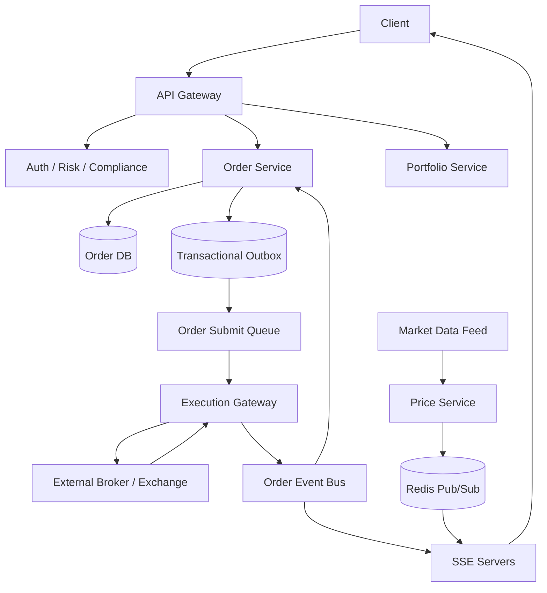

# 设计 Robinhood / Trading App

## 功能需求

- 用户可以查看账户资产、持仓、实时价格，并提交/取消买卖订单。
- 系统追踪订单状态：created、submitted、partial filled、filled、cancelled、rejected。
- 支持 live price update 和 order update 推送。
- 和外部 broker/exchange/market maker 对接；matching service 不属于本系统。

## 非功能需求

- 订单链路正确性优先，必须可审计、可恢复、可 reconciliation。
- 下单 API 必须幂等，防止客户端重试创建重复订单。
- 行情推送低延迟，但允许短暂丢 tick；订单状态不能丢。
- 系统需要处理外部 exchange 提交失败、未知状态和回调延迟。

## API 设计

```text
POST /orders
- request: user_id, symbol, side=buy|sell, type=market|limit, quantity, limit_price?, idempotency_key
- response: order_id, status=created|rejected

DELETE /orders/{order_id}
- request: user_id, idempotency_key
- response: order_id, status=cancel_pending|cancelled|filled|not_cancellable

GET /orders/{order_id}
- response: order_id, external_order_id?, status, filled_qty, avg_price, updated_at

GET /orders?user_id=&cursor=&limit=50
- response: orders[], next_cursor

GET /stream/prices?symbols=AAPL,TSLA
- SSE stream for price updates

GET /stream/orders
- SSE stream for user order updates
```

## 高层架构



## 关键组件

- Order Service
  - 负责订单 source of truth、状态机、幂等、取消、查询。
  - 下单时先写 Order DB，再通过 outbox 异步提交到外部 execution venue。
  - 不负责 matching；matching 在外部 broker/exchange/market maker。
  - 注意：不要先 submit exchange 再写 DB，否则 DB 写失败时本地无法追踪已提交订单。

- Order DB
  - 订单主表和状态变更流水。
  - 示例：

```text
orders(
  order_id,
  user_id,
  symbol,
  side,
  type,
  quantity,
  limit_price,
  status,
  filled_qty,
  avg_price,
  external_order_id,
  client_order_id,
  idempotency_key,
  version,
  created_at,
  updated_at
)

order_events(
  order_id,
  event_id,
  event_type,
  old_status,
  new_status,
  payload,
  created_at
)
```

  - `client_order_id` 是发给外部 broker 的幂等 key。
  - `external_order_id` 是外部系统返回的订单 ID。
  - 状态更新使用 CAS/version，避免乱序事件覆盖新状态。

- Transactional Outbox
  - 下单事务中同时写 Order DB 和 outbox row。
  - Outbox relay 将 submit task 发送到 Order Submit Queue。
  - 解决 “DB 写成功但消息没发出去” 的一致性问题。
  - Outbox 消费可能重复，Execution Gateway 必须幂等。

- Execution Gateway
  - 对接外部 broker/exchange API。
  - 把内部 order 转成外部协议。
  - 提交时带 `client_order_id`，用于外部幂等和故障恢复。
  - 接收外部 ack、reject、partial fill、fill、cancel ack。
  - 注意：外部系统可能回调乱序、延迟、重复。

- Risk / Compliance
  - 下单前检查 buying power、持仓、KYC、交易限制、market hours。
  - 可以同步做必要风控，避免非法订单进入外部市场。
  - 更重的审计、异常检测可以异步。

- Portfolio Service
  - 维护用户 cash balance、positions、buying power。
  - 订单 accepted 后可以预留资金/股份。
  - fill event 到达后更新实际持仓。
  - 需要 ledger 模型，避免只存一个可变余额导致审计困难。

- Price Service
  - 消费 market data feed，维护最新 quote/trade。
  - 发布 symbol price update 到 Redis Pub/Sub 或 Kafka。
  - SSE servers 订阅多个 symbol topic，并 fanout 给在线客户端。
  - 行情数据可以丢部分 tick，但要保持最新 price 可查询。

- SSE Servers
  - 维护 client 长连接。
  - 对行情：按 symbol subscription 订阅 Redis Pub/Sub topic。
  - 对订单：按 user subscription 推送 order status updates。
  - 注意 SSE 是 delivery channel，不是订单状态 source of truth；客户端断线后要 GET 补齐。

- Reconciliation Worker
  - 定期查询外部 broker/exchange 的 order status。
  - 修复本地 unknown / submitted 但长期无回调的订单。
  - 对账 fills、cash movement、positions。
  - 这是 trading 系统非常重要的安全网。

## 核心流程

- 创建订单
  - Client 调 `POST /orders`，带 `idempotency_key`。
  - Order Service 做 auth、risk、buying power 检查。
  - 生成 `order_id` 和 `client_order_id`。
  - 在同一 DB transaction 内写 `orders(status=created)` 和 outbox submit task。
  - 返回 `order_id` 给客户端。
  - Outbox relay 异步把 submit task 放入 Order Submit Queue。
  - Execution Gateway 提交到外部 venue。
  - 拿到 `external_order_id` 后更新订单为 `submitted`。

- 取消订单
  - Client 调 `DELETE /orders/{order_id}`。
  - 如果订单还未提交外部系统，状态可从 `created -> cancelled`。
  - 如果已 submitted，状态变为 `cancel_pending`，发送 cancel request 到外部 venue。
  - 如果已经 filled，则返回 `not_cancellable`。
  - 外部 cancel ack 到达后更新为 `cancelled`；如果 cancel 期间成交，按 fill 处理。

- Live price update
  - Market Data Feed 进入 Price Service。
  - Price Service 更新 latest quote cache。
  - 按 symbol 发布到 Redis Pub/Sub topic，例如 `price:AAPL`。
  - SSE server 根据客户端订阅的 symbols 订阅多个 topic。
  - 客户端断线重连后先拉 latest price，再恢复 stream。

- Track order updates
  - 外部 broker/exchange 发送 order ack/fill/cancel/reject callback。
  - Execution Gateway 标准化事件，写 Order Event Bus。
  - Order Service 幂等消费事件，更新 Order DB 状态。
  - SSE server 推送给对应 user。
  - Client 也可以定期 GET `/orders/{id}` 补齐。

- Failure recovery
  - 如果存订单失败，不 submit exchange，直接返回失败。
  - 如果提交 exchange 失败且确认未到达外部，订单标记 `submit_failed` 或可重试。
  - 如果提交后本地处理失败，依靠 `client_order_id/external_order_id` 和 reconciliation 恢复状态。

## 存储选择

- Order DB
  - PostgreSQL / MySQL 更适合订单状态机、事务、审计流水。
  - 订单写入量很大时按 `user_id` 或 `order_id` shard。
  - 需要唯一约束：

```text
unique(user_id, idempotency_key)
unique(client_order_id)
unique(external_order_id)
```

- Ledger / Portfolio DB
  - 建议用 append-only ledger。
  - 每次 cash hold、release、fill、fee 都是一条 ledger entry。
  - 当前余额/持仓是 derived view。

- Redis
  - 用于 latest price cache、market data pub/sub、短期 session/subscription。
  - 不存订单 source of truth。

- Event Bus
  - Kafka / Pulsar / SQS。
  - 用于 order events、fills、portfolio updates、notifications。
  - 事件至少一次投递，消费者必须幂等。

## 扩展方案

- 下单 API stateless scale，但 Order DB 按 user/order shard。
- 外部提交通过 queue 和 Execution Gateway worker pool 异步扩展。
- 行情推送和订单状态推送分开：price stream 可以 drop/coalesce，order stream 不丢。
- SSE server 订阅热点 symbol topic 时需要 fanout 分层，避免每台 server 订阅所有 symbol。
- Portfolio 更新从 fill event 异步消费，但 buying power hold 在下单前同步检查。
- Reconciliation worker 分 shard 扫描 open orders，持续修复未知状态。

## 系统深挖

### 1. 下单顺序：先写 DB vs 先提交 Exchange

- 方案 A：先提交外部 exchange，再写 DB
  - 适用场景：几乎不适合交易系统。
  - ✅ 优点：路径看起来短。
  - ❌ 缺点：如果 submit 成功但 DB 写失败，本地失去订单追踪，风险极高。

- 方案 B：先写 DB，再异步提交 exchange
  - 适用场景：Robinhood 类交易 app。
  - ✅ 优点：任何订单先有本地记录，可审计、可恢复。
  - ❌ 缺点：用户看到 created 后，外部提交可能失败，需要状态机表达。

- 方案 C：DB + outbox transaction
  - 适用场景：生产级订单系统。
  - ✅ 优点：保证本地订单和提交任务一起持久化。
  - ❌ 缺点：outbox relay、重复提交和幂等处理复杂。

- 推荐：
  - 先写 Order DB，再通过 transactional outbox 提交外部系统。
  - 订单状态从 `created -> submitting -> submitted/rejected/submit_failed`。
  - 不承诺创建成功等于交易所已接受。

### 2. 外部订单 ID：internal order_id vs client_order_id vs external_order_id

- 方案 A：只用 internal `order_id`
  - 适用场景：不对接外部系统的小系统。
  - ✅ 优点：简单。
  - ❌ 缺点：外部 broker 无法用本地 ID 做幂等或对账。

- 方案 B：使用 `external_order_id`
  - 适用场景：外部系统 ack 后追踪订单。
  - ✅ 优点：对账和查询外部状态方便。
  - ❌ 缺点：提交前没有 external id；提交成功但 ack 丢失时本地可能不知道。

- 方案 C：使用 `client_order_id`
  - 适用场景：提交外部订单的幂等键。
  - ✅ 优点：本地生成，提交前就存在；可以用于重试和 recovery。
  - ❌ 缺点：外部 venue 必须支持，且要保证全局唯一。

- 推荐：
  - 三个 ID 都保留：
    - `order_id`：内部 source of truth。
    - `client_order_id`：外部提交幂等和查找。
    - `external_order_id`：外部 ack 后对账。

### 3. 取消订单：本地取消 vs 外部取消

- 方案 A：只改本地状态为 cancelled
  - 适用场景：订单还没提交外部系统。
  - ✅ 优点：快，简单。
  - ❌ 缺点：如果订单已到 exchange，本地取消不代表市场取消。

- 方案 B：提交 cancel request 到 exchange
  - 适用场景：订单已 submitted。
  - ✅ 优点：符合真实交易语义。
  - ❌ 缺点：cancel request 和 fill 可能竞态；取消不一定成功。

- 方案 C：cancel pending 状态机
  - 适用场景：生产交易系统。
  - ✅ 优点：准确表达 “取消请求已发出但未确认”。
  - ❌ 缺点：客户端体验更复杂，需要解释 pending。

- 推荐：
  - 未提交外部：`created -> cancelled`。
  - 已提交外部：`submitted/partial_filled -> cancel_pending -> cancelled`。
  - 如果 cancel 期间 fill 到达，fill 优先，剩余数量可能 cancelled。

### 4. 失败场景：DB 写失败、提交失败、提交后处理失败

- 方案 A：Failure to store order
  - 适用场景：Order DB 写入失败。
  - ✅ 处理：不提交外部 exchange，直接返回失败。
  - ❌ 风险：如果代码路径绕过 DB 先提交，会产生幽灵订单，所以必须禁止。

- 方案 B：Failure submit order to exchange
  - 适用场景：网络超时、外部 5xx、broker reject。
  - ✅ 处理：使用 `client_order_id` 重试或查询；确认未提交后标记 `submit_failed`。
  - ❌ 风险：网络超时可能是未知结果，不能简单重试生成新订单。

- 方案 C：Failure processing after exchange submission
  - 适用场景：外部已接受，但本地更新 DB/SSE 失败。
  - ✅ 处理：通过 external callback、reconciliation query、`client_order_id` 恢复。
  - ❌ 风险：用户短时间看到 stale status，必须有 open order reconciliation。

- 推荐：
  - 交易系统里最重要的是区分 `failed` 和 `unknown`。
  - 对未知状态不要盲目重试新订单；先用 `client_order_id` 查询外部状态。
  - Reconciliation worker 是必需组件，不是锦上添花。

### 5. 订单状态一致性：同步更新 vs Event-driven

- 方案 A：Execution Gateway 直接写 Order DB
  - 适用场景：小系统。
  - ✅ 优点：路径短。
  - ❌ 缺点：外部接入逻辑和订单状态机耦合，难审计。

- 方案 B：Execution Gateway 发标准化 order events
  - 适用场景：生产系统。
  - ✅ 优点：Order Service 统一管理状态机；事件可 replay。
  - ❌ 缺点：event bus 至少一次投递，需要幂等和乱序处理。

- 方案 C：Event sourcing
  - 适用场景：强审计、复杂状态恢复。
  - ✅ 优点：所有状态由事件重放得到，审计清晰。
  - ❌ 缺点：实现复杂，查询需要 projection。

- 推荐：
  - 使用 order_events 作为审计流水，Order DB 存当前状态 projection。
  - 状态转移用 version/CAS。
  - 外部事件按 `event_id` 去重，按 external sequence 或 timestamp 处理乱序。

### 6. Live Price Update：Redis Pub/Sub vs Kafka vs WebSocket/SSE

- 方案 A：Redis Pub/Sub + SSE
  - 适用场景：低延迟行情 fanout，允许丢少量 tick。
  - ✅ 优点：轻量、延迟低；SSE 适合 server-to-client 单向推送。
  - ❌ 缺点：Redis Pub/Sub 不持久；SSE 断线期间会丢更新。

- 方案 B：Kafka market data stream
  - 适用场景：需要 replay、下游分析、风控消费。
  - ✅ 优点：持久化、可 replay、消费者扩展性好。
  - ❌ 缺点：端到端延迟和 fanout 复杂度高于 Redis。

- 方案 C：WebSocket
  - 适用场景：双向实时交互和高频订阅管理。
  - ✅ 优点：双向、低延迟。
  - ❌ 缺点：连接管理和扩展复杂。

- 推荐：
  - 行情内部可 Kafka 持久化，在线推送用 Redis Pub/Sub + SSE/WebSocket。
  - SSE server 可以订阅多个 symbol topic，但热点 symbol 要做 topic fanout 分层。
  - 客户端重连时 GET latest price，不依赖 stream 补历史 tick。

### 7. Order Updates：Polling vs SSE

- 方案 A：Client polling
  - 适用场景：低频订单状态查询。
  - ✅ 优点：简单、可靠、断线无状态。
  - ❌ 缺点：状态变化有延迟，QPS 高。

- 方案 B：SSE order stream
  - 适用场景：订单状态单向推送。
  - ✅ 优点：用户体验好，server-to-client 简单。
  - ❌ 缺点：长连接需要资源；推送失败不能代表订单失败。

- 方案 C：SSE + polling fallback
  - 适用场景：交易 App。
  - ✅ 优点：实时体验和可靠补齐兼顾。
  - ❌ 缺点：客户端要处理去重和状态 merge。

- 推荐：
  - Order updates 用 SSE 推送，同时保留 `GET /orders/{id}`。
  - SSE 只传状态变化通知，Order DB 是最终状态。
  - 客户端断线重连后用 cursor/last_seen_event_id 补齐或直接拉订单详情。

### 8. Portfolio / Buying Power：强同步扣减 vs Ledger

- 方案 A：只存当前 balance/position
  - 适用场景：小型 demo。
  - ✅ 优点：查询简单。
  - ❌ 缺点：审计困难，故障后很难解释余额变化。

- 方案 B：ledger + projection
  - 适用场景：金融系统。
  - ✅ 优点：每笔 hold、release、fill、fee 都可追溯。
  - ❌ 缺点：读当前余额需要 projection，设计更复杂。

- 方案 C：同步强一致 portfolio update
  - 适用场景：下单前 buying power 检查。
  - ✅ 优点：防止超额购买。
  - ❌ 缺点：会增加下单延迟和锁竞争。

- 推荐：
  - 下单前同步 reserve buying power。
  - fill 后通过 ledger entry 更新实际 cash/position。
  - Projection 可缓存，但 ledger 是 source of truth。

## 面试亮点

- Matching service 不属于 Robinhood，本系统边界是订单接入、风控、外部提交、状态追踪和用户体验。
- Order Service 必须先写本地 DB，再提交外部 venue；否则 DB 写失败会产生无法追踪的外部订单。
- `order_id / client_order_id / external_order_id` 三种 ID 要区分，尤其 `client_order_id` 是提交重试和 reconciliation 的关键。
- 交易系统中 `unknown` 状态必须显式建模，不能把网络超时简单当作失败或成功。
- 行情 stream 可以丢 tick，但订单状态不能丢；price update 和 order update 的可靠性要求不同。
- SSE/Redis PubSub 是推送通道，不是 source of truth；订单最终状态来自 Order DB 和外部 reconciliation。
- 取消订单不是本地删除，而是状态机：未提交可本地取消，已提交必须等待外部 cancel ack，且可能和 fill 竞态。
- Portfolio 应使用 ledger 思路，当前持仓/余额只是 projection，方便审计和故障恢复。

## 一句话总结

Robinhood 类系统的核心是：本地 Order DB 先记录订单并通过 outbox 提交外部 broker/exchange，用 `client_order_id/external_order_id` 处理幂等和未知状态，通过 event-driven 状态机、SSE 推送和 reconciliation worker 保证用户能实时看到状态且系统可审计可恢复。
