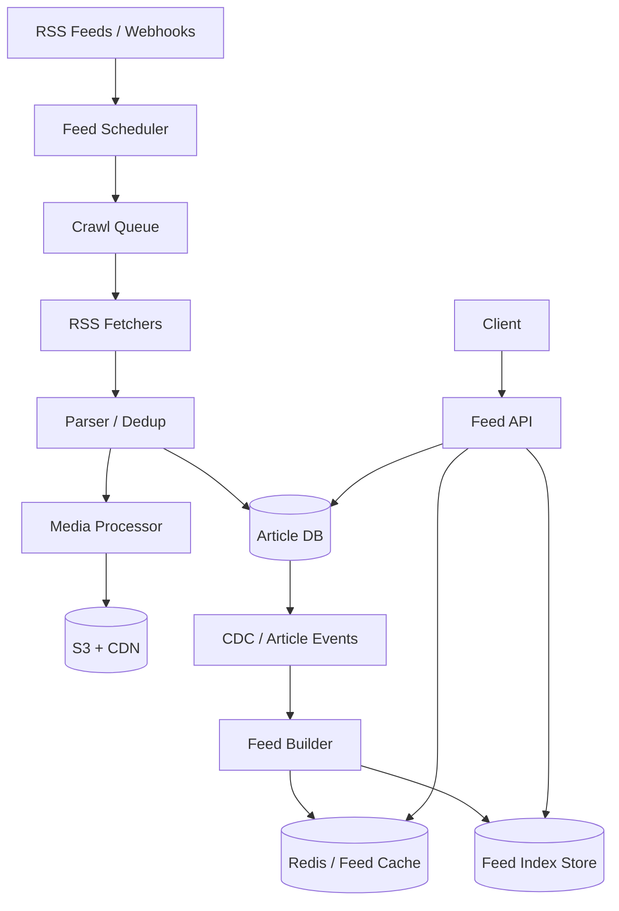

# 设计 RSS News Aggregator 系统

## 功能需求

- 系统定期从 RSS feeds、publisher webhook 抓取新闻文章，并去重入库。
- 用户可以按 topic/region/source 获取低延迟 news feed，支持稳定分页。
- 支持媒体内容处理，例如 thumbnail 抓取、转码、S3 存储和 CDN 分发。
- 支持个性化 feed mixing，例如 technology/business/trending 按用户偏好组合。

## 非功能需求

- 新文章应在 30 分钟内出现在相关 feed 中；breaking news 尽量更快。
- Feed 请求低延迟，首页和翻页要稳定，不因为新文章插入导致重复/漏读。
- 抓取系统要尊重 publisher rate limit，失败可重试，不能丢长期未更新 feed。
- Feed cache 可短暂 stale，但 article source of truth 和 dedup 必须可靠。

## API 设计

```text
GET /feeds/home?user_id=&cursor=&limit=30
- response: articles[], next_cursor

GET /feeds/topic/{topic}?region=&cursor=&limit=30
- response: articles[], next_cursor

POST /subscriptions
- request: user_id, topics[], sources[], regions[]
- response: subscription_id

POST /publisher/webhook
- request: source_id, article_url, title?, published_at?
- response: accepted

GET /articles/{article_id}
- response: article, media, source, canonical_url
```

## 高层架构



## 关键组件

- Feed Scheduler
  - 管理每个 RSS source 的抓取频率、next_fetch_at、失败 backoff。
  - 普通 feed 可 10-30 分钟抓一次，热门 source 更频繁。
  - Webhook 能减少延迟，但不能完全依赖 webhook，仍需要 polling 兜底。
  - 注意：不要全表扫描 sources；用 `next_fetch_bucket + shard_id` 小表调度。

- RSS Fetchers
  - 消费 Crawl Queue，抓取 RSS XML/Atom feed。
  - 支持 ETag、Last-Modified，减少无变化抓取。
  - 对 publisher 做 per-domain rate limiting。
  - 抓取失败进入 retry/backoff，持续失败进入 DLQ 或 degraded source 状态。

- Parser / Dedup
  - 解析 article URL、title、summary、published_at、author、media。
  - URL canonicalization：去 tracking params、normalize host/path。
  - Dedup key 可用 canonical_url hash，也可结合 source_guid。
  - 同一篇文章来自多个 source 时可以合并为 canonical article。

- Article DB
  - 文章 source of truth。
  - 使用单调递增 `article_id`，便于稳定分页和排序。

```text
articles(
  article_id,
  canonical_url_hash,
  canonical_url,
  source_id,
  title,
  summary,
  published_at,
  ingested_at,
  topics[],
  region,
  language,
  media_ids[],
  status
)
```

  - `article_id` 可以 Snowflake/ULID，保证大致按 ingestion time 单调。
  - Feed 分页 cursor 使用 `(rank_time/article_id)`，避免 offset pagination 不稳定。

- Media Processor
  - 抓取 thumbnail、封面图、publisher logo。
  - 图片写 S3，生成不同尺寸 thumbnail。
  - CDN 分发媒体内容。
  - 注意：媒体处理失败不应阻塞文章入 feed，可先用 placeholder 后补。

- Feed Builder
  - 从 Article CDC/Event Stream 消费新文章。
  - 根据 topic、region、source、language 写入对应 feed index。
  - 构建 `feed:technology:US`、`feed:business:US`、`feed:trending:US` 等。
  - 对热门 feed 写 Redis cache，低频 feed 写持久化 Feed Index。

- Feed API
  - 读取 topic feed 或 personalized home feed。
  - 低延迟路径优先读 Redis cache。
  - 如果 cache miss，从 Feed Index 读取 article_ids，再批量查 Article DB。
  - 做 final filtering：blocked source、language、region、user preferences。

- Personalization / Mixing Service
  - 保存用户 preference vector。
  - 按比例混合多个基础 feed。
  - 例如：

```text
60% feed:technology:US
30% feed:business:US
10% feed:trending:US
```

  - Breaking news 时临时提升 trending 权重，但保留用户偏好。
  - 混排后去重，并用 cursor 保证分页稳定。

## 核心流程

- RSS 抓取入库
  - Scheduler 找到 due sources。
  - 生成 crawl task 到 queue。
  - Fetcher 抓取 RSS feed。
  - Parser 解析 item，做 URL normalization 和 dedup。
  - 新文章写 Article DB。
  - Media Processor 异步处理 thumbnail。
  - Article DB CDC 触发 Feed Builder 更新 feed index/cache。

- Publisher webhook
  - Publisher 发新文章 webhook。
  - Webhook handler 做 auth/signature 校验。
  - 生成高优先级 crawl/parse task。
  - 如果 webhook payload 已足够，可直接入 Parser。
  - Polling 仍定期兜底，确保 webhook 漏发时 30 分钟内发现。

- 低延迟 feed 请求
  - Client 请求 `/feeds/home`。
  - Feed API 根据 user preference 选择基础 feeds 和权重。
  - 从 Redis/Feed Index 读取各 feed 的 article_ids。
  - 按 mixing ratio 合并，并用 cursor 截取下一页。
  - 批量查 Article DB 获取详情和 media URLs。
  - 返回 articles 和 next_cursor。

- 稳定分页
  - 第一页返回时记录 cursor，例如：

```text
cursor = {
  snapshot_watermark_article_id,
  per_feed_offsets,
  seen_article_ids_hash?,
  mixing_version
}
```

  - 后续分页只返回 `article_id <= snapshot_watermark_article_id` 的文章。
  - 新文章不会插入到用户当前翻页序列中，避免重复/漏读。
  - 用户 refresh 首页时再拿最新 snapshot。

## 存储选择

- Article DB
  - PostgreSQL/MySQL：适合中等规模和事务。
  - DynamoDB/Cassandra：适合大规模 article_id/canonical_url lookup。
  - ClickHouse/OpenSearch 可用于搜索和分析，但不是文章 source of truth。

- Feed Index Store
  - Redis Sorted Set：热门 feed 的 top N article_ids，score 是 rank_time 或 ranking score。
  - Cassandra/DynamoDB：持久化 feed index，`PK=feed_id, SK=rank_time#article_id`。
  - Feed cache 可以从 Article DB + CDC 重建。

- S3 + CDN
  - 存 thumbnail、图片、归档 HTML snapshot。
  - CDN 加速媒体访问。

- Kafka / Queue
  - Crawl tasks、article events、media tasks、feed update events。
  - 按 source_id/feed_id/article_id partition。

## 扩展方案

- 抓取层按 domain/source 分区限流，Fetcher worker pool 横向扩展。
- Feed Builder 异步更新缓存，确保文章 30 分钟内进入相关 feed。
- 热门 feed 常驻 Redis，冷门 feed 从持久化 index 读取。
- 个性化不是为每个用户预生成完整 feed，而是实时混合少量基础 feed。
- 对重度活跃用户可预计算 home feed cache，普通用户 request-time mixing。
- Breaking news 通过 trending feed 权重提升，而不是重写所有用户 feed。

## 系统深挖

### 1. Pagination Consistency：Offset vs Cursor vs Snapshot Cursor

- 方案 A：Offset pagination
  - 适用场景：数据几乎不变的列表。
  - ✅ 优点：实现简单。
  - ❌ 缺点：新闻 feed 持续插入新文章，翻页会重复或漏文章。

- 方案 B：基于 article_id / rank_time 的 cursor
  - 适用场景：按时间倒序 feed。
  - ✅ 优点：比 offset 稳定；`WHERE article_id < cursor` 查询高效。
  - ❌ 缺点：个性化混排多个 feed 时，一个 cursor 不够表达每个 feed 的进度。

- 方案 C：Snapshot cursor
  - 适用场景：个性化 mixed feed。
  - ✅ 优点：固定 `snapshot_watermark_article_id`，翻页期间新文章不会插队；per_feed_offsets 保证混排稳定。
  - ❌ 缺点：cursor 更大，服务端/客户端要处理版本和过期。

- 推荐：
  - Topic feed 用 monotonic article_id cursor。
  - Personalized feed 用 snapshot cursor + per feed offsets。
  - Refresh 首页才更新 snapshot，翻页沿用旧 snapshot。

### 2. Low Latency Feed：Redis TTL Cache vs Real-time Cached Feeds with CDC

- 方案 A：Redis cache with TTL
  - 适用场景：热门 topic/region feed。
  - ✅ 优点：实现简单，读取低延迟。
  - ❌ 缺点：TTL 内 stale；TTL 过期时可能 cache stampede。

- 方案 B：Real-time cached feeds with CDC
  - 适用场景：需要新文章快速进入 feed。
  - ✅ 优点：Article DB 变更后主动更新 feed cache，freshness 好。
  - ❌ 缺点：CDC/consumer 失败会导致 cache drift，需要 rebuild。

- 方案 C：Hybrid
  - 适用场景：生产系统。
  - ✅ 优点：CDC 增量更新，TTL/rebuild 兜底。
  - ❌ 缺点：多一层复杂度。

- 推荐：
  - 热门 feed 用 Redis ZSET + CDC 实时更新。
  - Redis key 设置 TTL 或定期 rebuild 防漂移。
  - Cache miss 从 Feed Index/Article DB 回源。

### 3. 30 分钟 Freshness：Webhook + Polling

- 方案 A：只靠 polling
  - 适用场景：没有 publisher webhook。
  - ✅ 优点：系统可控，不依赖 publisher 主动通知。
  - ❌ 缺点：延迟取决于轮询间隔；抓取成本高。

- 方案 B：只靠 webhook
  - 适用场景：强合作 publisher。
  - ✅ 优点：延迟低，抓取少。
  - ❌ 缺点：webhook 可能丢、延迟、签名错误，不能保证覆盖所有 source。

- 方案 C：Webhook + polling
  - 适用场景：新闻聚合生产系统。
  - ✅ 优点：webhook 加速，polling 兜底，满足 30 分钟 SLA。
  - ❌ 缺点：需要去重，避免 webhook 和 polling 重复入库。

- 推荐：
  - Webhook 进入高优先级 pipeline。
  - Polling 以 source priority 调整频率，确保大部分 source 30 分钟内发现新文章。
  - Dedup 用 canonical_url_hash/source_guid。

### 4. Media Content：Inline Proxy vs S3 + CDN

- 方案 A：直接引用 publisher image URL
  - 适用场景：小系统。
  - ✅ 优点：不用存储媒体。
  - ❌ 缺点：外链失效、慢、被防盗链，无法统一尺寸。

- 方案 B：后端 proxy 图片
  - 适用场景：需要隐藏源站或做简单处理。
  - ✅ 优点：控制访问。
  - ❌ 缺点：后端带宽压力大。

- 方案 C：S3 + CDN
  - 适用场景：生产系统。
  - ✅ 优点：低延迟、高可用、可生成 thumbnails、多尺寸。
  - ❌ 缺点：多了媒体处理 pipeline 和版权/过期策略。

- 推荐：
  - Media Processor 异步下载和生成 thumbnail。
  - S3 存 object，CDN 分发。
  - 文章先入 feed，thumbnail 可后补。

### 5. Personalization：预生成用户 feed vs Request-time Mixing

- 方案 A：为每个用户预生成完整 feed
  - 适用场景：用户少或重度活跃用户。
  - ✅ 优点：读请求非常快。
  - ❌ 缺点：用户多时写放大巨大；偏好变化要重建。

- 方案 B：请求时混合基础 feeds
  - 适用场景：大规模 news aggregator。
  - ✅ 优点：不为每个用户写 feed；偏好实时生效。
  - ❌ 缺点：读路径要 merge 多个 feeds，cursor 更复杂。

- 方案 C：Hybrid
  - 适用场景：生产系统。
  - ✅ 优点：活跃用户预计算，普通用户 request-time mixing。
  - ❌ 缺点：系统复杂。

- 推荐：
  - 基础 feeds：`feed:technology:US`、`feed:business:US`、`feed:trending:US`。
  - 大多数用户 request-time mixing。
  - 超活跃用户可预计算 home feed cache。

### 6. Breaking News Boost

- 方案 A：全局替换用户 feed 为 trending
  - 适用场景：重大灾害/公共安全通知。
  - ✅ 优点：最快让所有用户看到。
  - ❌ 缺点：破坏个性化体验，可能不相关。

- 方案 B：临时提升 trending 权重
  - 适用场景：普通 breaking news。
  - ✅ 优点：保留用户偏好，同时提高重大新闻曝光。
  - ❌ 缺点：ranking 规则更复杂，需要 decay。

- 方案 C：按 topic/region 相关性 boost
  - 适用场景：区域性或垂类 breaking news。
  - ✅ 优点：更精准。
  - ❌ 缺点：需要事件分类和地域识别。

- 推荐：
  - Trending feed 有时间衰减 score。
  - Breaking news 临时提高 trending 权重，例如 10% -> 25%，但不完全覆盖个人偏好。
  - 严重公共安全事件可走 emergency override。

### 7. Dedup 和 Canonicalization

- 方案 A：按 URL 完全匹配
  - 适用场景：简单系统。
  - ✅ 优点：实现简单。
  - ❌ 缺点：tracking params、http/https、移动端 URL 会导致重复。

- 方案 B：URL canonicalization + hash
  - 适用场景：常规新闻聚合。
  - ✅ 优点：去掉 utm、排序 query params、normalize host/path 后更准。
  - ❌ 缺点：不同文章可能 URL 相似，仍需 source_guid/title 辅助。

- 方案 C：内容相似度 dedup
  - 适用场景：多 source 转载同一新闻。
  - ✅ 优点：能合并不同 URL 的同源新闻。
  - ❌ 缺点：计算成本高，误合并风险。

- 推荐：
  - 先用 `source_guid` 和 canonical_url_hash。
  - 对高价值/热门新闻再做 title/content similarity 合并。
  - Dedup id 写唯一约束，确保 webhook+polling 重复不会双入库。

### 8. Feed Index 和 Cache Consistency

- 方案 A：写文章时同步更新所有 feed index/cache
  - 适用场景：feed 数少。
  - ✅ 优点：文章立即可见。
  - ❌ 缺点：写放大大，文章入库延迟高。

- 方案 B：CDC 异步更新 feed index
  - 适用场景：大规模。
  - ✅ 优点：Article DB 写路径轻；Feed Builder 可水平扩展。
  - ❌ 缺点：Feed cache 最终一致，短时间看不到新文章。

- 方案 C：Lazy update
  - 适用场景：冷门 feed。
  - ✅ 优点：不为没人看的 feed 维护缓存。
  - ❌ 缺点：首次请求慢。

- 推荐：
  - 热门 feed：CDC 增量维护 Redis/Feed Index。
  - 冷门 feed：lazy build + TTL。
  - Feed API 需要能从 durable Feed Index 回源，cache 不是 source of truth。

## 面试亮点

- RSS aggregator 要把 ingestion freshness 和 feed read latency 分开设计：抓取可异步，feed 读要缓存。
- 稳定分页不能用 offset；topic feed 用 monotonic article_id cursor，personalized feed 用 snapshot cursor + per-feed offsets。
- 新文章 30 分钟内出现不能只靠 webhook；webhook 加速，polling 兜底。
- Feed cache with TTL 简单但 stale；更好的方案是 Article CDC 驱动实时更新热门 feed cache。
- Media 不要 inline 存 DB，thumbnail 走 S3 + CDN，媒体处理失败不阻塞文章入 feed。
- 个性化不必为每个用户全量预生成，基础 feed + preference vector request-time mixing 更可扩展。
- Breaking news boost 是 ranking/mixing 问题，不是重写所有用户 feed。
- Dedup 要在入库前做 canonical URL/source GUID，避免 webhook 和 polling 重复产生两篇文章。

## 一句话总结

RSS News Aggregator 的核心是：用 webhook + polling 保证文章及时入库，用 canonical URL/source GUID 去重，用 CDC 构建 topic/region/trending feed cache 和持久化 feed index，读路径通过 monotonic cursor 或 snapshot cursor 稳定分页，再用用户 preference vector 做基础 feed 的低延迟混排。
