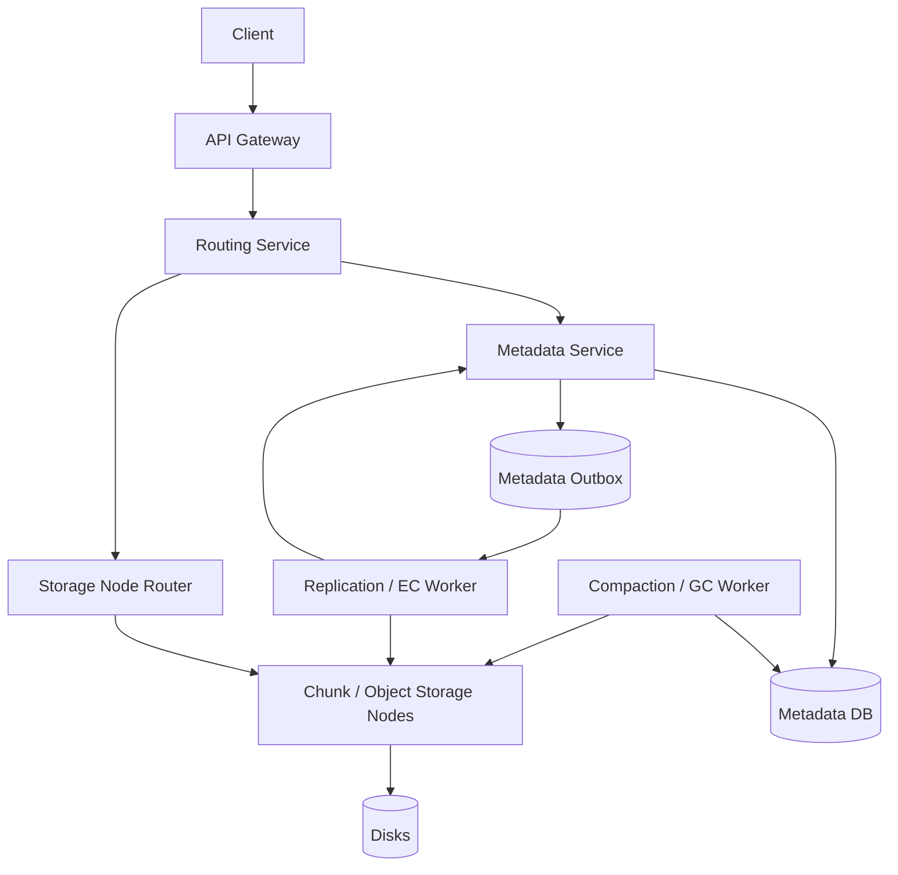

# 设计 S3 / Object Storage 系统

## 功能需求

- 用户可以按 `bucket + object_name` 上传、下载、删除 object。
- 支持 large file multipart upload。
- 支持 object versioning：同一个 object name 可以对应多个 object version。
- 支持 replication / erasure coding、soft delete 和后台 compaction。

## 非功能需求

- 高 durability，数据跨节点、机架或 AZ 冗余保存。
- 读写吞吐可水平扩展，尤其支持大对象和高并发下载。
- Metadata 操作需要低延迟且强一致，避免读到错误版本。
- Data plane 和 metadata plane 分离，避免大文件传输拖慢元数据服务。

## API 设计

```text
PUT /buckets/{bucket}/objects/{object_name}
- request: bytes | upload_id + parts, metadata?, if_match?
- response: object_id, version_id, etag

GET /buckets/{bucket}/objects/{object_name}?version_id=
- response: bytes, metadata, etag

DELETE /buckets/{bucket}/objects/{object_name}?version_id=
- response: delete_marker_version_id | deleted

POST /buckets/{bucket}/objects/{object_name}/multipart
- response: upload_id

PUT /multipart/{upload_id}/parts/{part_number}
- request: bytes
- response: part_etag

POST /multipart/{upload_id}/complete
- request: parts[{part_number, part_etag}]
- response: object_id, version_id, etag
```

## 高层架构



## 关键组件

- Routing Service
  - 接收 object request，并生成全局唯一 `object_id` / `upload_id`。
  - 对写入请求选择 storage nodes / placement group。
  - 对读请求先查 metadata：`bucket + object_name + version_id` 找到 `object_id` 和 chunk locations。
  - 注意：routing service 负责路由和 ID 生成，不应该成为 object data 的单点瓶颈。

- Metadata Service
  - 维护 object namespace、版本、状态、chunk manifest。
  - 核心映射不是直接 `object_name -> bytes`，而是：

```text
bucket + object_name -> current_version_id
bucket + object_name + version_id -> object_id
object_id -> chunk_manifest / replicas / erasure coding layout
```

  - 同一个 object name 的不同版本有不同 `object_id`。
  - delete 在 versioning 开启时写 delete marker，而不是立刻删除底层数据。

- Metadata DB
  - 存 object metadata source of truth。
  - 示例：

```text
objects(
  bucket,
  object_name,
  current_version_id,
  versioning_enabled,
  updated_at
)

object_versions(
  bucket,
  object_name,
  version_id,
  object_id,
  status: uploading|committed|delete_marker|deleted|compacting
  size,
  etag,
  created_at,
  metadata
)

object_manifest(
  object_id,
  layout_type: replication|erasure_coding,
  chunks[],
  checksum,
  storage_class
)
```

  - Metadata DB 要支持条件更新，例如只有 upload complete 后才能 publish 新 version。
  - 对同一个 `bucket + object_name` 的版本切换要原子。

- Storage Nodes
  - 存 object chunks / parts。
  - 大对象拆成固定大小 chunk，例如 8MB/64MB。
  - 每个 chunk 有 checksum，写入后验证。
  - Storage node 只关心 chunk id，不理解 object name。

- Replication / Erasure Coding Worker
  - 小对象或热对象可以多副本复制，例如 3 replicas。
  - 大对象或冷对象可以 erasure coding，例如 `10 data + 4 parity`。
  - 后台 worker 负责复制、修复、从 replication 转 EC。
  - 注意：写入 ack 策略可以先满足最小 durability，再异步补齐。

- Multipart Upload Manager
  - 管理 `upload_id`、part 状态和 complete。
  - 每个 part 独立上传、校验、存储。
  - Complete 时校验所有 part etag 和 part_number，然后生成 final object manifest。
  - 未完成的 upload 过期后由 GC 清理 orphan parts。

- Compaction / GC Worker
  - 清理 delete marker 之后不可达的 object versions。
  - 清理 multipart 未完成 parts。
  - 合并小对象或小 chunks，减少 metadata 和磁盘碎片。
  - 对 EC/replica layout 做重写和修复。
  - 必须只删除 metadata 已不可达、且超过安全保留窗口的数据。

## 核心流程

- 普通上传
  - Client 调 `PUT /buckets/{bucket}/objects/{object_name}`。
  - Routing Service 生成 `object_id` 和 `version_id`。
  - 选择 storage nodes，写 object chunks。
  - Storage nodes 返回 checksum/etag。
  - Metadata Service 写 `object_versions(status=committed)` 和 manifest。
  - 原子更新 `objects.current_version_id = version_id`。
  - 返回 `object_id/version_id/etag`。

- 下载对象
  - Client 用 `bucket + object_name` 请求。
  - Metadata Service 查 current version。
  - 如果指定 `version_id`，直接查该版本。
  - 根据 `object_id` 找 manifest 和 chunk locations。
  - Storage Node Router 读取 chunks，校验 checksum。
  - 如果某个 replica 不可用，从其他 replica 或 EC reconstruction 读取。

- 同名 object 新版本覆盖
  - Client 对相同 `object_name` 再次 PUT。
  - 系统生成新的 `object_id` 和 `version_id`。
  - 老版本仍然保留。
  - `current_version_id` 原子切到新版本。
  - 历史版本可通过 `version_id` 读取。

- 删除对象
  - 如果 bucket 开启 versioning：
    - DELETE 创建一个 `delete_marker` version。
    - `GET object_name` 会表现为 not found。
    - 指定老 `version_id` 仍可读取老版本。
  - 如果未开启 versioning：
    - Metadata 标记 current version deleted。
    - Data chunks 由后台 GC 延迟清理。

- Multipart upload
  - Client 调 initiate multipart，拿到 `upload_id`。
  - 并发上传多个 parts。
  - 每个 part 写入 storage nodes，并记录 part etag。
  - Complete 时 Metadata Service 校验 part 列表，创建 final manifest。
  - 原子 publish 新 object version。
  - Abort 或超时的 multipart 由 GC 清理 parts。

## 存储选择

- Metadata DB
  - 可用 sharded SQL、DynamoDB/Cassandra、FoundationDB 类强一致 KV。
  - 关键是支持：
    - `bucket + object_name` point lookup。
    - version list。
    - conditional update。
    - 高 QPS metadata read/write。
  - Metadata 是 source of truth。

- Object Data Store
  - 自研 storage node + local disks。
  - 或基于 append-only chunk store。
  - chunk immutable，便于 replication、checksum、repair 和 GC。

- Event Log / Queue
  - 用于 replication、EC conversion、GC、compaction、audit events。
  - 至少一次投递，worker 必须幂等。

- Cache
  - Metadata cache：缓存 hot object manifest。
  - CDN/cache：缓存 hot object data。
  - Cache 不是 source of truth，version 更新后要靠 version/etag 防止返回旧数据。

## 扩展方案

- Metadata 按 `bucket` 或 hash(`bucket + object_name`) shard。
- Object data 按 `object_id/chunk_id` consistent hash 到 storage nodes。
- 大对象拆 chunk 并行上传和下载，提高吞吐。
- 热门对象通过 CDN、read replicas、range request cache 扩展读取。
- 冷数据从 replication 转 erasure coding 降低存储成本。
- 后台 repair 扫描 checksum 和 replica/EC health，自动补副本或重建 parity。

## 系统深挖

### 1. Object Name vs Object ID

- 方案 A：直接用 object name 存数据
  - 适用场景：小型文件系统或简单对象服务。
  - ✅ 优点：模型简单。
  - ❌ 缺点：覆盖、版本、rename-like 行为、并发写都会复杂；object name 可能很长且分布不均。

- 方案 B：Routing service 生成 UUID `object_id`
  - 适用场景：生产级 object storage。
  - ✅ 优点：data plane 用稳定短 ID；同名对象多版本天然隔离；placement 可以和 object name 解耦。
  - ❌ 缺点：必须维护 metadata mapping。

- 方案 C：content-addressed object id
  - 适用场景：去重强需求、不可变对象。
  - ✅ 优点：相同内容可 dedup；checksum 自然校验。
  - ❌ 缺点：流式上传时要先算 hash；覆盖语义仍需 metadata 指向。

- 推荐：
  - 用 UUID/ULID 作为 `object_id`。
  - 用户查询永远从 `bucket + object_name` 查 metadata，再定位 `object_id`。
  - `object_name` 是 namespace，`object_id` 是 data identity。

### 2. Versioning：覆盖写 vs 多版本

- 方案 A：覆盖写直接替换老数据
  - 适用场景：无版本需求、成本敏感。
  - ✅ 优点：存储成本低，读 current 简单。
  - ❌ 缺点：误删/误覆盖不可恢复；并发读写可能读到中间状态。

- 方案 B：每次 PUT 生成新 version
  - 适用场景：S3-style versioning。
  - ✅ 优点：同名 object 保留历史；publish 新版本可以原子切指针。
  - ❌ 缺点：存储成本上升；list versions 和 GC 更复杂。

- 方案 C：Copy-on-write + lifecycle policy
  - 适用场景：需要版本但要控制成本。
  - ✅ 优点：保留近期版本，按规则清理旧版本。
  - ❌ 缺点：lifecycle/compaction 需要小心，不能误删仍可访问版本。

- 推荐：
  - 同一个 object name 的不同 version 对应不同 `object_id`。
  - Metadata 原子更新 current pointer。
  - Lifecycle policy 后台清理过期版本。

### 3. Replication vs Erasure Coding

- 方案 A：Replication
  - 适用场景：小对象、热对象、低延迟读取。
  - ✅ 优点：读简单；恢复快；单副本丢失直接从其他副本复制。
  - ❌ 缺点：存储开销高，例如 3 副本就是 3x。

- 方案 B：Erasure Coding
  - 适用场景：大对象、冷数据、成本敏感存储。
  - ✅ 优点：durability 高，存储开销低于多副本。
  - ❌ 缺点：读取和修复更复杂；小对象 EC 开销不划算；重建需要读多个 shard。

- 方案 C：Hybrid
  - 适用场景：生产 object store。
  - ✅ 优点：热数据先 replication，冷却后转 EC，兼顾性能和成本。
  - ❌ 缺点：后台转换、元数据 layout 更新和 repair 更复杂。

- 推荐：
  - 新写入先多副本，快速 ack 和低延迟读取。
  - 后台把冷大对象 compaction/转换为 EC。
  - Manifest 记录 layout type，读路径按 layout 读取。

### 4. Multipart Upload

- 方案 A：单请求上传大文件
  - 适用场景：小对象。
  - ✅ 优点：实现简单。
  - ❌ 缺点：大文件失败要重传全部；单连接吞吐受限；服务端内存压力大。

- 方案 B：Multipart upload
  - 适用场景：大对象。
  - ✅ 优点：part 并行上传；失败只重传单个 part；支持断点续传。
  - ❌ 缺点：需要管理 upload session、part etag、complete/abort 和 orphan parts。

- 方案 C：Resumable upload with client checkpoint
  - 适用场景：移动端或不稳定网络。
  - ✅ 优点：客户端可恢复进度。
  - ❌ 缺点：协议和状态管理更复杂。

- 推荐：
  - 大文件必须支持 multipart。
  - 未 complete 前不能 publish object version。
  - Complete 是原子 metadata 操作：校验 parts 后生成 manifest 并切 current version。

### 5. Soft Delete 和 Delete Marker

- 方案 A：立即物理删除
  - 适用场景：无恢复需求、对象很小。
  - ✅ 优点：释放空间快。
  - ❌ 缺点：误删不可恢复；并发读可能失败；跨副本删除难以原子。

- 方案 B：Soft delete
  - 适用场景：大规模 object store。
  - ✅ 优点：删除快速，只改 metadata；后台慢慢 GC data；支持恢复窗口。
  - ❌ 缺点：需要 GC 和 compaction，存储短期不会释放。

- 方案 C：Versioned delete marker
  - 适用场景：开启 versioning 的 bucket。
  - ✅ 优点：DELETE 不删除历史版本，只让 current view 表现为不存在。
  - ❌ 缺点：用户 list/delete versions 语义更复杂。

- 推荐：
  - 默认 metadata soft delete。
  - versioning bucket 写 delete marker。
  - 物理 chunk 删除由 GC 在安全窗口后执行。

### 6. Metadata 一致性：强一致 vs 最终一致

- 方案 A：Metadata 最终一致
  - 适用场景：旧式对象存储或成本优先系统。
  - ✅ 优点：写入延迟低，跨区域复制简单。
  - ❌ 缺点：PUT 后立即 GET/LIST 可能看不到新对象，用户体验差。

- 方案 B：单 region 强一致 metadata
  - 适用场景：现代 object store 主路径。
  - ✅ 优点：PUT 完成后 GET current version 一致；delete marker 立即生效。
  - ❌ 缺点：metadata DB 设计复杂，跨 region 强一致成本高。

- 方案 C：Region 内强一致，跨 region 最终一致
  - 适用场景：全球对象存储。
  - ✅ 优点：本地体验好，跨区复制成本可控。
  - ❌ 缺点：跨 region 读可能看到旧版本，需要版本号和 replication status。

- 推荐：
  - Region 内 metadata 强一致。
  - Data replication 可以先满足写 quorum，再异步补齐。
  - Cross-region replication 明确是 eventually consistent。

### 7. Compaction / GC

- 方案 A：不做 compaction
  - 适用场景：小规模或短期系统。
  - ✅ 优点：实现简单。
  - ❌ 缺点：delete marker、旧版本、orphan multipart parts、小 chunk 会持续占空间。

- 方案 B：后台 GC
  - 适用场景：所有 object storage 都需要。
  - ✅ 优点：异步释放不可达数据，不影响前台请求延迟。
  - ❌ 缺点：必须保证不会误删仍被 metadata 引用的数据。

- 方案 C：Compaction + layout rewrite
  - 适用场景：大量小对象或冷热分层。
  - ✅ 优点：合并小对象、转换 EC、降低 metadata 和存储成本。
  - ❌ 缺点：重写期间有新旧 layout 共存，元数据切换要原子。

- 推荐：
  - GC 使用 mark-and-sweep 思路：从 Metadata DB 标记可达 object/chunks。
  - 删除前保留 safety window。
  - Compaction 生成新 manifest 后原子切换，再异步删除旧 chunks。

### 8. 路由和热点对象

- 方案 A：每次都经 Routing Service 转发数据
  - 适用场景：小对象、简单系统。
  - ✅ 优点：客户端简单。
  - ❌ 缺点：Routing Service 变成 data plane 瓶颈。

- 方案 B：Routing Service 返回 storage node / pre-signed URL
  - 适用场景：大对象上传下载。
  - ✅ 优点：数据直传 storage nodes，metadata/control plane 更轻。
  - ❌ 缺点：客户端协议更复杂，安全 token 和过期要处理。

- 方案 C：CDN / cache for hot objects
  - 适用场景：热门下载对象。
  - ✅ 优点：保护 origin storage，降低延迟。
  - ❌ 缺点：cache invalidation 和 version/etag 语义要清楚。

- 推荐：
  - Metadata/control 走 Routing Service。
  - 大对象 data path 尽量 client direct to storage node。
  - 热对象通过 CDN 和 replica fanout 扩展读取。

## 面试亮点

- S3 的核心不是文件系统目录，而是 metadata plane 和 data plane 分离。
- 用户查询用 `bucket + object_name`，系统内部通过 metadata 找到 `version_id -> object_id -> manifest`。
- 同一个 object name 的不同版本必须是不同 object id，覆盖写是原子切 current version pointer。
- Multipart upload 未 complete 前不能对外可见，complete 是 metadata publish 操作。
- Replication 适合热/小对象，erasure coding 适合冷/大对象，生产系统通常 hybrid。
- Soft delete/delete marker 让删除变成 metadata 操作，物理删除交给后台 GC/compaction。
- Compaction 必须以 metadata 可达性为准，先写新 layout、原子切 manifest，再清旧 chunks。
- Routing service 生成 UUID 和做 placement，但大对象 data path 不应全部穿过 routing service。

## 一句话总结

S3 类 Object Storage 的核心是：用 Metadata Service 维护 `object_name -> version -> object_id -> manifest` 的强一致映射，用 storage nodes 保存不可变 chunks，通过 multipart upload 支撑大文件，通过 replication/erasure coding 提供 durability，再用 soft delete、GC 和 compaction 异步清理和优化存储成本。
