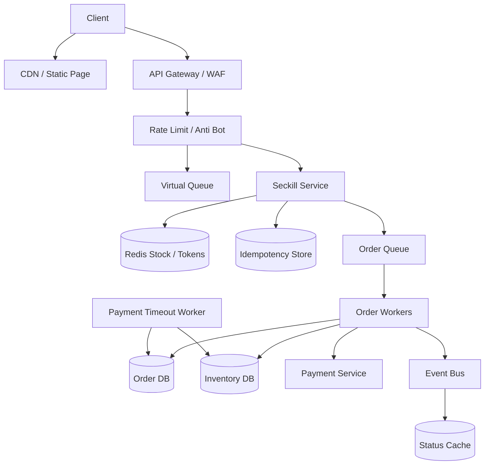

# 设计秒杀系统

## 功能需求

- 用户可以在活动开始后抢购指定商品，并创建订单。
- 系统需要防止重复下单、库存超卖和恶意刷请求。
- 支持支付超时释放库存，例如 10 分钟未支付自动取消。
- 支持实时或准实时展示库存、排队状态和下单结果。

## 非功能需求

- 秒杀入口要抗突发高并发，保护库存和订单核心链路。
- 库存正确性优先，允许用户看到的展示库存短暂不准。
- 下单链路低延迟，但订单创建可以异步完成。
- 系统要可降级：排队、限流、售罄快速失败、关闭非核心功能。

## API 设计

```text
GET /seckill/{activity_id}/status
- response: status=not_started|open|sold_out|ended, display_stock, server_time

POST /seckill/{activity_id}/enter
- request: user_id, device_id
- response: queue_token?, position?, can_buy_at?

POST /seckill/{activity_id}/orders
- request: user_id, sku_id, idempotency_key, queue_token?, captcha_token?
- response: request_id, status=accepted|rejected|sold_out

GET /seckill/orders/{request_id}
- response: status=queued|created|failed|sold_out, order_id?

POST /orders/{order_id}/pay
- request: payment_id
- response: status=paid|failed
```

## 高层架构



## 关键组件

- CDN / Static Page
  - 秒杀活动页、商品详情、静态资源尽量走 CDN。
  - 活动开始时间、服务端时间、展示库存可以缓存短时间。
  - 注意：展示库存不是 correctness boundary，只是用户体验。

- API Gateway / WAF
  - 做 IP、device、user 维度限流。
  - 接入验证码、签名 token、风控分。
  - 对非核心 API 降级，防止活动页请求打穿后端。
  - 注意：入口限流只能削峰，不能保证库存正确性。

- Virtual Queue / Waiting Room
  - 使用 Redis queue / sorted set 管理排队用户。
  - 可以返回用户当前位置或预计进入时间。
  - 只放行一部分用户进入下单链路。
  - 对热门活动很关键，因为库存 DB 不能承受所有用户同时写。

- Seckill Service
  - 负责校验活动状态、用户资格、幂等、库存预扣。
  - 成功抢到 Redis token 后，把下单请求写入 MQ。
  - 不同步创建完整订单，避免 DB 被峰值打垮。
  - 对同一用户同一活动只允许一笔成功请求。

- Redis Stock / Token Bucket
  - 活动开始前预热库存 token：

```text
stock:{activity_id}:{sku_id} = available_count
user_claim:{activity_id}:{user_id} = request_id
```

  - 下单时用 Lua 脚本原子执行：
    - 检查用户是否已抢过。
    - 检查库存是否大于 0。
    - 扣减库存。
    - 写入 user claim。
  - 注意：Redis 预扣成功不等于最终订单成功，需要 DB reconciliation。

- Idempotency Store
  - 解决同一客户端多次点击、网络重试、刷新导致的重复请求。
  - key 可以是 `user_id + activity_id + idempotency_key`。
  - 已处理过的 key 返回同一个 `request_id/order_id`。
  - 不能只靠前端禁用按钮。

- Order Queue
  - 承接秒杀成功的 order creation requests。
  - 消费语义通常是 at-least-once，所以 Order Worker 必须幂等。
  - 可以按 `sku_id/activity_id` 分区，保证单 SKU 局部顺序。
  - 队列积压时，用户看到 `queued` 状态。

- Order Worker / Inventory DB
  - 从 MQ 消费请求，创建订单。
  - Order DB 是订单 source of truth。
  - Inventory DB 存最终库存和活动库存流水。
  - Worker 需要用唯一约束防重复订单：

```text
unique(activity_id, user_id)
unique(request_id)
```

  - 如果 DB 最终扣减失败，需要补偿 Redis 或标记请求失败。

- Payment Timeout Worker
  - 订单创建后状态是 `pending_payment`，带 `expires_at`。
  - 超时未支付，订单变成 `cancelled`，释放库存。
  - 支付成功和超时取消之间要用状态机 CAS 处理竞态。

## 核心流程

- 活动预热
  - 商品、活动规则、库存信息加载到 cache。
  - 秒杀库存 token 预写入 Redis。
  - 静态页面推到 CDN。
  - Gateway 配置限流、验证码、风控规则。

- 用户进入秒杀
  - Client 请求活动状态，拿服务端时间和活动状态。
  - 如果活动未开始，返回倒计时。
  - 如果热点活动，用户先进 virtual queue。
  - 排到后拿到 `queue_token`，允许访问下单 API。

- 抢购下单
  - Client 调 `POST /seckill/{activity_id}/orders`，带 `idempotency_key`。
  - Gateway 做限流和风控。
  - Seckill Service 校验 queue token、活动状态和用户资格。
  - Redis Lua 原子检查用户是否已抢、库存是否足够，并预扣库存。
  - 成功后发送 order request 到 MQ，返回 `request_id=accepted`。
  - 失败则返回 `sold_out` 或 `rejected`。

- 异步创建订单
  - Order Worker 消费 MQ。
  - 用 `request_id` 和 `activity_id + user_id` 幂等创建订单。
  - 写 Order DB，状态为 `pending_payment`。
  - 写 Inventory DB 库存流水。
  - 用户 polling 查询订单状态，或通过 SSE 获得结果。

- 支付和过期释放
  - 用户在 10 分钟内支付。
  - 支付 callback 到达后，订单 `pending_payment -> paid`。
  - Expiration Worker 扫描 `pending_payment AND expires_at < now`。
  - CAS 成功后取消订单并释放库存。
  - 如果支付和过期同时发生，只允许一个状态转换成功。

## 存储选择

- Redis
  - 秒杀库存 token、用户抢购标记、virtual queue、热点活动状态。
  - 适合高并发原子扣减，但不能作为唯一最终账本。
  - 需要持久化和主从高可用，但仍要依赖 DB reconciliation。

- Order DB
  - PostgreSQL / MySQL / DynamoDB 都可。
  - 存订单 source of truth、支付状态、过期时间。
  - 需要唯一约束或 conditional write 保证同一用户同一活动只创建一单。

- Inventory DB
  - 存最终库存、活动库存流水、补偿记录。
  - SQL 事务表达清晰；DynamoDB conditional update 扩展性好。
  - 热点 SKU 直接打 DB 会有 write contention，所以高峰用 Redis 预扣 + 异步落库。

- MQ
  - Kafka / RocketMQ / SQS。
  - Kafka/RocketMQ 适合高吞吐和按 SKU 分区。
  - SQS 运维简单，visibility timeout 和 DLQ 原生，但顺序和极高吞吐要额外设计。

## 扩展方案

- 静态页面和商品详情走 CDN，后端只承接必要动态请求。
- 活动开始前预热 Redis 库存 token，避免活动开始瞬间读 DB。
- 热门活动使用 virtual queue，把并发削成系统可承受速率。
- 下单 API 只做资格校验、幂等、Redis 原子预扣、入队。
- Order Worker 按活动或 SKU 水平扩展。
- 对超级热点 SKU，可把库存切成多个库存桶，降低单 key 压力。

## 系统深挖

### 1. 库存扣减：DB 直接扣减 vs Redis 预扣 vs 库存令牌

- 方案 A：DB 直接扣减
  - 适用场景：并发不高、库存正确性优先。
  - ✅ 优点：source of truth 简单；事务清晰。
  - ❌ 缺点：秒杀峰值会打爆热点库存行，write contention 严重。

- 方案 B：Redis 原子预扣
  - 适用场景：高并发秒杀。
  - ✅ 优点：低延迟，高吞吐；Lua 可原子检查库存和用户去重。
  - ❌ 缺点：Redis 和 DB 存在一致性问题，需要异步落库和 reconciliation。

- 方案 C：库存令牌预生成
  - 适用场景：库存数量有限、请求远大于库存。
  - ✅ 优点：只有拿到 token 的请求进入订单链路，天然削峰。
  - ❌ 缺点：token 发出但订单创建失败时，需要回收或补偿。

- 推荐：
  - 秒杀主路径用 Redis token / 原子预扣。
  - DB 是最终库存账本。
  - 用 reconciliation 修正 Redis 预扣和 DB 最终订单之间的差异。

### 2. 防超卖：Pessimistic Lock vs Optimistic Lock vs Atomic Operation

- 方案 A：Pessimistic lock
  - 适用场景：冲突很高且吞吐要求不高。
  - ✅ 优点：正确性直观。
  - ❌ 缺点：秒杀热点行锁等待严重，吞吐差。

- 方案 B：Optimistic lock
  - 适用场景：冲突概率低。
  - ✅ 优点：无锁等待，平时性能好。
  - ❌ 缺点：秒杀场景冲突极高，大量 CAS 失败重试会放大压力。

- 方案 C：Atomic conditional update / Lua
  - 适用场景：热点库存扣减。
  - ✅ 优点：单次原子判断 `stock > 0` 并扣减，延迟低。
  - ❌ 缺点：单 key 仍可能成为 Redis 热点；跨系统一致性要补偿。

- 推荐：
  - Redis Lua 做入口原子扣减。
  - DB 落库用唯一约束和库存流水保证最终账本。
  - 对极热点 SKU 使用库存分桶，减少单 key 热点。

### 3. Push 请求还是排队：直接打下单 API vs Virtual Queue

- 方案 A：所有用户直接请求下单
  - 适用场景：小活动或库存充足。
  - ✅ 优点：架构简单，用户无等待。
  - ❌ 缺点：活动开始瞬间后端会被洪峰打穿。

- 方案 B：Virtual queue
  - 适用场景：大促、热门商品、库存极少。
  - ✅ 优点：保护下单核心链路；可以告诉用户排队位置。
  - ❌ 缺点：实现排队公平性、过期、重复入队、断线恢复更复杂。

- 方案 C：Token gate
  - 适用场景：只允许有限用户进入下单页。
  - ✅ 优点：更强削峰，流量可控。
  - ❌ 缺点：用户体验更硬，可能被认为不公平。

- 推荐：
  - 普通活动直接限流 + Redis 预扣。
  - 超热点活动使用 Redis virtual queue。
  - 进入下单前必须校验 queue token，防止绕过。

### 4. 同一用户重复请求：前端禁用 vs Idempotency vs Unique Constraint

- 方案 A：前端禁用按钮
  - 适用场景：改善体验。
  - ✅ 优点：简单，减少误触。
  - ❌ 缺点：无法防刷新、重试、脚本请求、网络超时。

- 方案 B：Idempotency key
  - 适用场景：下单 API 必须有。
  - ✅ 优点：客户端重试返回同一 `request_id`，不会重复入队。
  - ❌ 缺点：需要保存 key 和请求 hash，处理过期策略。

- 方案 C：DB unique constraint
  - 适用场景：最终订单创建。
  - ✅ 优点：最终兜底，防止一个用户创建多单。
  - ❌ 缺点：如果只靠 DB，重复请求已经进入下游，浪费资源。

- 推荐：
  - 前端禁用只是体验。
  - Seckill Service 用 idempotency key 和 Redis `user_claim` 快速去重。
  - Order DB 用 `unique(activity_id, user_id)` 做最终兜底。

### 5. 同步创建订单 vs 异步创建订单

- 方案 A：同步创建订单
  - 适用场景：低并发普通电商。
  - ✅ 优点：用户立刻拿到订单结果；状态简单。
  - ❌ 缺点：订单 DB、支付、库存都暴露在秒杀峰值下。

- 方案 B：异步创建订单
  - 适用场景：秒杀高峰。
  - ✅ 优点：下单 API 快速返回；MQ 削峰；worker 可水平扩展。
  - ❌ 缺点：用户需要查询 `request_id`；accepted 不代表最终有订单。

- 方案 C：同步预占 + 异步订单
  - 适用场景：高并发但希望用户尽快知道抢购资格。
  - ✅ 优点：Redis 预扣成功后用户基本抢到资格。
  - ❌ 缺点：订单落库失败要补偿，系统复杂。

- 推荐：
  - 秒杀用同步 Redis 预占 + 异步订单创建。
  - 明确返回 `accepted/queued`，不要承诺订单已创建。
  - 用户通过 polling/SSE 获取最终订单状态。

### 6. 支付超时：库存一直占用 vs Expiration 状态机

- 方案 A：抢到后永久占库存直到用户支付
  - 适用场景：不适合秒杀。
  - ✅ 优点：实现简单。
  - ❌ 缺点：恶意用户可以占库存不付款，库存利用率低。

- 方案 B：10 分钟支付 hold
  - 适用场景：电商秒杀主流模型。
  - ✅ 优点：用户有支付时间；库存可自动回收。
  - ❌ 缺点：支付 callback 和过期取消有竞态。

- 方案 C：支付成功后再确认库存
  - 适用场景：允许失败退款的业务。
  - ✅ 优点：不占库存。
  - ❌ 缺点：支付后没货体验差，退款复杂。

- 推荐：
  - 订单创建后 `pending_payment`，带 `expires_at`。
  - 支付成功只能 `pending_payment -> paid`。
  - 超时只能 `pending_payment -> cancelled`。
  - 用 CAS/transaction 保证只有一个状态转换成功。

### 7. Redis 和 DB 一致性：强同步 vs 异步落库 vs Reconciliation

- 方案 A：Redis 扣减后同步写 DB
  - 适用场景：并发不极端，想降低不一致窗口。
  - ✅ 优点：结果更快落到 source of truth。
  - ❌ 缺点：DB 仍在高峰路径上，容易拖慢请求。

- 方案 B：Redis 扣减后写 MQ，异步落库
  - 适用场景：秒杀峰值。
  - ✅ 优点：入口低延迟；MQ 削峰。
  - ❌ 缺点：MQ/worker 失败时需要补偿和重放。

- 方案 C：DB 预生成库存流水，Redis 只是缓存
  - 适用场景：库存少、强审计。
  - ✅ 优点：审计更清楚。
  - ❌ 缺点：预生成和回收 token 成本更高。

- 推荐：
  - Redis 预扣 + MQ 异步落库。
  - OrderDB/InventoryDB 是最终事实。
  - 定期 reconciliation：Redis claimed count、MQ processed count、OrderDB paid/pending/cancelled 对账。

### 8. 结果通知：Polling vs SSE

- 方案 A：Client polling
  - 适用场景：秒杀下单结果通常几秒内完成。
  - ✅ 优点：实现简单，兼容性好，无长连接管理。
  - ❌ 缺点：QPS 增加，结果有几秒延迟。

- 方案 B：SSE
  - 适用场景：排队位置、下单状态、库存状态单向推送。
  - ✅ 优点：用户体验好，适合 server-to-client 状态更新。
  - ❌ 缺点：长连接占资源，断线重连和浏览器连接数限制要处理。

- 方案 C：WebSocket
  - 适用场景：需要双向互动的复杂活动。
  - ✅ 优点：低延迟双向通信。
  - ❌ 缺点：秒杀结果通知一般不需要这么重。

- 推荐：
  - 下单结果默认 polling。
  - Virtual queue 位置可以用 SSE。
  - 正确性不依赖推送，客户端随时可用 `request_id` 查询最终状态。

### 9. 防刷和安全：限流 vs 验证码 vs 风控

- 方案 A：IP/user/device 限流
  - 适用场景：基础防护。
  - ✅ 优点：简单有效，能挡明显洪峰。
  - ❌ 缺点：代理 IP、设备伪造会绕过；误伤真实用户。

- 方案 B：验证码 / 签名 token
  - 适用场景：活动入口和下单前校验。
  - ✅ 优点：提高脚本成本；防止绕过页面直接打接口。
  - ❌ 缺点：影响用户体验；验证码服务本身也要抗峰值。

- 方案 C：风控评分
  - 适用场景：大规模商业秒杀。
  - ✅ 优点：可以结合账号历史、设备、行为、IP 信誉。
  - ❌ 缺点：模型和规则复杂，可能误杀。

- 推荐：
  - Gateway 限流 + WAF + captcha/token + risk score。
  - 下单 token 短期有效，并绑定 user/device/activity。
  - 安全检查不要放在订单 DB 后面，否则已经太晚。

## 面试亮点

- 秒杀系统的核心不是“订单 CRUD”，而是入口削峰和库存正确性。
- 展示库存和最终库存要分开：展示库存可 stale，扣减库存必须原子。
- Redis 预扣适合抗峰值，但 OrderDB/InventoryDB 才是最终 source of truth。
- Idempotency 解决同一用户重复请求，库存原子扣减解决多用户抢同一 SKU，二者都需要。
- 支付不能无限占库存，应该用 `pending_payment -> paid/cancelled` 状态机和过期释放。
- Virtual queue 是保护核心链路的 admission control，不是库存 correctness 机制。
- At-least-once MQ 下，Order Worker 必须用 `request_id` 和唯一约束做幂等。
- 热点不是平均 QPS，而是单个活动、单个 SKU、单个 Redis key/DB row 的写热点。

## 一句话总结

秒杀系统的核心是：用 CDN/cache/限流/排队挡住大部分流量，用 Redis 原子预扣和用户去重快速判断抢购资格，用 MQ 异步创建订单削峰，最终以 OrderDB/InventoryDB 和状态机对账保证库存、订单和支付结果正确。
