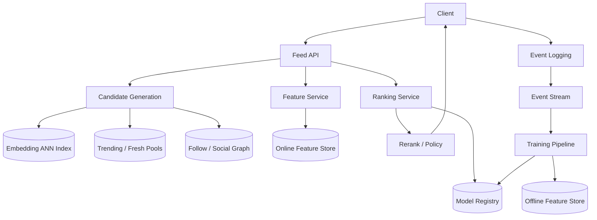

# 设计 Short Video Recommendation 系统

## 功能需求

- 用户打开 app 后获得个性化短视频 feed。
- 支持用户行为反馈：曝光、播放时长、完播、点赞、评论、分享、关注、不感兴趣。
- 支持新用户、新视频、热门视频推荐。
- 支持内容安全、去重、多样性和广告/运营策略插入。

## 非功能需求

- 低延迟：feed 请求 p95 通常控制在 100-300ms。
- 高吞吐：短视频 feed 请求量极高，推荐链路要可水平扩展。
- 推荐结果要新鲜：实时兴趣、热点内容、视频状态快速生效。
- 可观测、可 A/B test、可回滚模型。

## API 设计

```text
GET /feed/short-videos?user_id=&session_id=&cursor=&limit=20
- response: videos[], ranking_reason?, next_cursor

POST /events
- request: user_id, video_id, event_type, watch_time, dwell_time, timestamp

POST /videos
- creator uploads video, metadata, tags

GET /feed/debug?user_id=&session_id=
- candidates, features, scores, filters
```

## 高层架构



## 关键组件

- Feed API
  - 在线推荐入口。
  - 聚合召回、特征、排序、重排结果。
  - 控制 latency budget，比如召回 50ms、特征 50ms、排序 100ms。
  - 返回 cursor，避免重复视频。

- Candidate Generation
  - 目标是高 recall，从海量视频中召回几千个候选。
  - 多路召回：
    - Two-tower embedding ANN：用户向量找视频向量。
    - Trending pool：全局/地区/语言热门。
    - Fresh pool：新视频探索。
    - Follow graph：关注作者新视频。
    - Similar videos：和最近看过/点赞的视频相似。
    - Category/topic recall：体育、游戏、美妆、科技等。

- Feature Service
  - 在线拼接特征：
    - 用户长期兴趣：喜欢的 topic、creator、语言、时段。
    - 用户短期兴趣：最近几分钟/本 session 看了什么。
    - 视频特征：时长、类目、作者、质量分、互动率、发布时间。
    - 上下文：时间、地区、设备、网络、session depth。
    - 交叉特征：用户是否喜欢该 creator/topic。
  - 保证训练和服务特征一致，避免 training-serving skew。

- Ranking Service
  - 对候选视频打分。
  - 通常预测多个目标：
    - watch time
    - completion rate
    - like/share/comment/follow
    - hide/report risk
  - 最终 score 可以是多目标加权：

```text
score =
  w1 * P(long_watch)
+ w2 * P(completion)
+ w3 * P(like/share)
- w4 * P(skip/report)
+ freshness_boost
```

- Rerank / Policy Layer
  - 处理模型之外的产品约束：
    - 去重
    - 多样性
    - 内容安全
    - 频控
    - creator cap
    - 新视频探索
    - 广告插入
  - 防止 feed 被单一 topic/creator 占满。

- Event Logging
  - 必须记录 impression，不然无法构造负样本。
  - 关键事件：
    - impression
    - play
    - watch_time
    - completion
    - skip
    - like/comment/share/follow
    - hide/report
  - 进入 Kafka，用于实时特征和离线训练。

- Training Pipeline
  - 从事件流构造训练样本。
  - Join 用户特征、视频特征、上下文特征。
  - 训练召回模型和排序模型。
  - 产出模型进入 Model Registry，灰度上线。

## 核心流程

- 在线 feed 请求
  - 用户打开 app，请求 `/feed/short-videos`。
  - Candidate Generation 多路召回几千个视频。
  - 去掉已看、违规、不可见、重复视频。
  - Feature Service 批量取在线特征。
  - Ranking Service 打分。
  - Reranker 做多样性、探索、广告和安全策略。
  - 返回 top N 视频。

- 用户反馈闭环
  - 客户端上报 impression 和 watch events。
  - 实时流更新 session 特征，比如用户连续看了 3 个篮球视频。
  - 离线 pipeline 用日志训练下一版模型。
  - A/B test 评估新模型。
  - 线上指标异常时 rollback。

- 新视频冷启动
  - 上传后提取内容特征：
    - 标题、标签、ASR 文本、封面、视觉 embedding、音频 embedding。
  - 先进入 fresh/exploration pool。
  - 小流量曝光后根据真实反馈更新质量分。
  - 表现好进入更大流量池。

- 新用户冷启动
  - 使用地区、语言、设备、注册兴趣。
  - 初始 feed 混合热门、本地、泛兴趣和探索内容。
  - 根据 session 行为快速更新短期兴趣。

## 存储选择

- Video Metadata Store：视频基础信息、作者、状态、标签。
- Object Store + CDN：视频文件、封面图、转码产物。
- ANN Index：Faiss/Milvus/ScaNN/向量数据库，支持 embedding recall。
- Online Feature Store：Redis/DynamoDB/Cassandra。
- Offline Feature Store：Hive/Spark/Parquet/BigQuery。
- Event Stream：Kafka/PubSub。
- Model Registry：模型版本、特征 schema、A/B 配置。

## 扩展方案

- 召回和排序分层：召回几千，粗排几百，精排几十。
- 热门候选池提前计算，降低在线召回压力。
- 特征批量读取，避免 per-video RPC。
- 排序模型服务独立扩展，支持 CPU/GPU inference。
- 活跃用户可缓存部分候选 feed，但最终排序尽量结合实时 session 特征。
- 模型发布走 shadow mode、canary、A/B test。

## 系统深挖

### 1. 多阶段推荐：召回 vs 粗排 vs 精排

- 方案 A：全量视频直接精排
  - ✅ 优点：理论上排序最准确。
  - ❌ 缺点：视频量巨大，不可行。

- 方案 B：两阶段：召回 + 精排
  - ✅ 优点：架构简单，适合中等规模。
  - ❌ 缺点：召回候选太多时精排压力高。

- 方案 C：多阶段：召回 + 粗排 + 精排 + 重排
  - ✅ 优点：可扩展，延迟可控。
  - ❌ 缺点：系统复杂，调参和 debug 难。

- 推荐：
  - 短视频系统使用多阶段。
  - 召回追求 recall，精排追求 precision，重排处理体验约束。

### 2. 召回策略

- 方案 A：Trending recall
  - ✅ 优点：冷启动好，稳定。
  - ❌ 缺点：不够个性化。

- 方案 B：Embedding ANN recall
  - ✅ 优点：个性化强，能发现长尾兴趣。
  - ❌ 缺点：embedding 更新和 ANN index freshness 有成本。

- 方案 C：Social/follow recall
  - ✅ 优点：用户关注关系强相关。
  - ❌ 缺点：只靠关注会变窄。

- 推荐：
  - 多路召回，每路有 quota。
  - 在线根据用户类型动态调整 quota。
  - 新用户 trending/fresh 多一些，老用户 embedding/personalized 多一些。

### 3. Ranking Objective

- 方案 A：优化 CTR
  - ✅ 优点：简单，反馈多。
  - ❌ 缺点：标题党和低质量短点击可能上升。

- 方案 B：优化 watch time
  - ✅ 优点：更贴近短视频消费。
  - ❌ 缺点：可能推荐低价值但上瘾内容。

- 方案 C：多目标优化
  - ✅ 优点：平衡留存、互动、质量、安全。
  - ❌ 缺点：目标权重难调。

- 推荐：
  - 多目标模型。
  - 重点看 long watch、completion、like/share、follow。
  - hide/report、低质量、安全风险作为负向目标和 guardrail。

### 4. 实时兴趣建模

- 方案 A：只用长期画像
  - ✅ 优点：稳定。
  - ❌ 缺点：无法捕捉用户当下意图。

- 方案 B：只用 session 行为
  - ✅ 优点：响应快。
  - ❌ 缺点：容易被短期噪声带偏。

- 方案 C：长期 + 短期融合
  - ✅ 优点：既稳定又灵活。
  - ❌ 缺点：特征和模型更复杂。

- 推荐：
  - 长期画像离线更新。
  - session embedding 实时更新。
  - 最近连续 skip 某类内容时快速降权。

### 5. 探索 vs 利用

- 方案 A：完全按模型最高分
  - ✅ 优点：短期指标高。
  - ❌ 缺点：新视频和新兴趣无法获得曝光。

- 方案 B：固定比例随机探索
  - ✅ 优点：简单。
  - ❌ 缺点：体验波动大。

- 方案 C：Bandit / uncertainty-based exploration
  - ✅ 优点：更智能地探索高潜力内容。
  - ❌ 缺点：实现复杂。

- 推荐：
  - 保留 fresh/exploration slots。
  - 对新视频、小众兴趣、冷启动用户给探索流量。
  - 用 guardrail 控制低质量内容比例。

### 6. 多样性和去重

- 方案 A：只按 score 排
  - ✅ 优点：简单。
  - ❌ 缺点：feed 可能被同 topic/creator 洗屏。

- 方案 B：规则重排
  - ✅ 优点：容易控制体验。
  - ❌ 缺点：规则多了会压低模型效果。

- 方案 C：Diversity-aware reranking
  - ✅ 优点：在 score 和多样性之间平衡。
  - ❌ 缺点：需要 topic/creator embedding 和调参。

- 推荐：
  - 限制同 creator、同 topic 连续出现。
  - MMR 或 diversity penalty。
  - 已看视频强过滤。

### 7. 内容安全和质量

- 方案 A：推荐后再过滤
  - ✅ 优点：实现简单。
  - ❌ 缺点：浪费 ranking 资源，且可能漏。

- 方案 B：入库时审核 + 推荐时过滤
  - ✅ 优点：双重保护。
  - ❌ 缺点：审核延迟影响新视频分发。

- 方案 C：质量分参与排序
  - ✅ 优点：低质量内容自然降权。
  - ❌ 缺点：质量模型误判会影响创作者。

- 推荐：
  - 视频上传后先安全审核。
  - 推荐链路按 visibility/status 强过滤。
  - 质量分、report risk 作为 ranking 负向特征。

### 8. 评价指标

- 在线核心指标：
  - watch time per user
  - completion rate
  - retention
  - session length
  - like/share/follow rate
  - hide/report rate

- 离线指标：
  - AUC
  - NDCG@K
  - Recall@K
  - calibration
  - replay simulation

- Guardrails：
  - 内容重复率
  - 低质量内容曝光
  - 安全违规曝光
  - creator diversity
  - latency
  - crash/error rate

## 面试亮点

- 短视频推荐不是只优化 CTR，watch time、完播、互动、留存和负反馈都要进多目标排序。
- 多阶段架构是核心：召回解决规模，精排解决质量，重排解决体验和策略。
- Impression logging 很关键，否则训练负样本不可信。
- 实时 session interest 对短视频尤其重要，用户兴趣可能几分钟内变化。
- 新视频冷启动靠内容 embedding + exploration，不然长尾永远没机会。
- Feed 不能只按分数排序，多样性、去重、内容安全和 creator cap 是必要的产品约束。
- 在线 A/B test 和 guardrails 比离线 AUC 更重要。
- 训练/服务特征一致性是 ML 系统设计必须主动提的风险点。

## 一句话总结

短视频推荐系统的核心是：用多路召回从海量视频中找候选，用实时和离线特征做多目标排序，再通过多样性、探索、安全和业务策略重排；用户曝光和交互事件进入 Kafka，形成实时特征和离线训练闭环，并通过 A/B test 持续优化。
