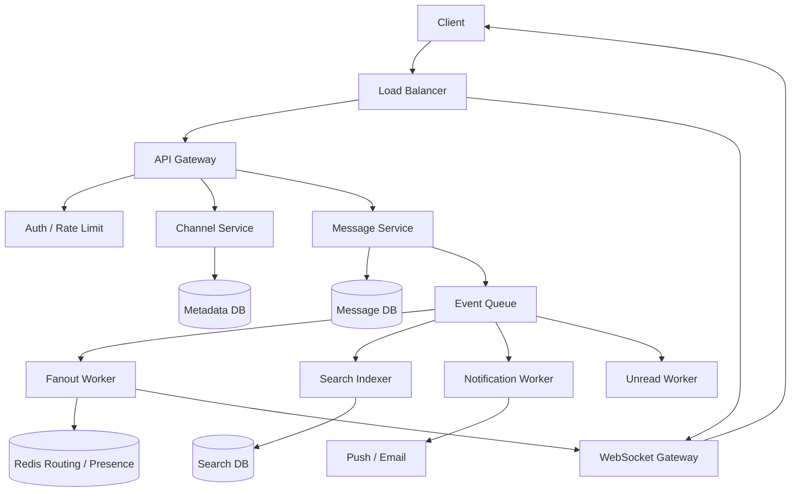

# 设计 Slack 系统

## 功能需求

- 支持 workspace、channel、DM，用户可以发送和接收消息。
- 在线用户实时收到新消息；离线/断线用户重连后能补齐消息。
- 支持历史消息分页查询和基础搜索。
- 支持 unread count、mention、notification。

## 非功能需求

- 消息不能丢，同一个 channel 内消息有序。
- 在线推送低延迟，目标是数百毫秒级。
- 系统可水平扩展，支持大量 workspace、channel、用户和长连接。
- Search、notification、unread、presence 可以最终一致。

## API 设计

```text
POST /workspaces
- name, owner_id

POST /channels
- workspace_id, name, type(public/private/dm/group_dm)

POST /channels/{channel_id}/messages
- sender_id, content, client_msg_id

GET /channels/{channel_id}/messages?before=cursor&limit=50
- 历史消息分页

POST /channels/{channel_id}/read
- user_id, last_read_seq

GET /search?workspace_id=&q=&cursor=
- 搜索消息
```

## 高层架构



## 关键组件

### API Gateway

- 负责 HTTP 请求：创建 workspace/channel、发送消息、查历史、搜索、更新 read state。
- 不负责长连接和消息 fanout。
- 注意事项：
  - 写消息前必须做 auth 和 channel membership check。
  - `client_msg_id` 做幂等，避免客户端重试产生重复消息。
  - 对 user/workspace/channel 做 rate limit，防 spam。

### WebSocket Gateway

- 负责维护长连接，推送 message、typing、presence、read receipt。
- 依赖 Redis/routing service 保存：

```text
user_id -> connection_ids / gateway_ids
channel_id -> active gateway_ids
```

- 注意事项：
  - 除本地连接表外尽量无状态，方便水平扩展。
  - WebSocket 不是可靠存储，断线后必须从 Message DB 拉取缺失消息。
  - Gateway 挂掉后，客户端重连并用 `last_seen_seq` sync。

### Message Service

- 消息写入核心服务。
- 负责权限校验、生成 `message_id` 和 channel 内 `seq`、写入 Message DB、发布 message event。
- 注意事项：
  - Message DB 是 source of truth。
  - 只保证 channel 内有序，不做全局有序。
  - Search、notification、unread、fanout 都不阻塞消息持久化主链路。

### Channel Service

- 管理 workspace、channel、membership、channel type。
- 注意事项：
  - private channel / DM 的权限模型会影响消息发送、搜索过滤、通知。
  - 权限变更后要考虑缓存失效和搜索结果过滤。
  - Membership 是很多服务的共享依赖，读压力会比较高，适合缓存。

### Message DB

- 保存 channel timeline。
- 典型设计：

```text
partition_key = channel_id 或 channel_id + time_bucket
sort_key = seq/message_id
```

- 注意事项：
  - append-heavy，核心查询是按 channel 分页读。
  - 超大 channel 需要 time bucket，避免单 partition 过大。
  - 编辑/删除通常 soft delete，便于同步和审计。

### Fanout Worker

- 消费 `MessageCreated` event，把消息推给在线用户。
- 注意事项：
  - 小 channel 可以推给所有在线成员。
  - 大 channel 只推 active viewers 或 lightweight event。
  - 推送失败不影响消息正确性。

### Search / Notification / Unread Workers

- Search Indexer 异步写 Elasticsearch/OpenSearch。
- Notification Worker 处理 mention、DM、离线 push/email。
- Unread Worker 更新或计算 read state。
- 注意事项：
  - 都是 derived/side-effect path。
  - 可以重试、延迟、重建，但不能影响消息主链路。

## 核心流程

### 发送消息

- Client 调 `POST /channels/{id}/messages`，带 `client_msg_id`。
- API 做 auth、rate limit、membership check。
- Message Service 生成 `message_id` 和 channel 内递增 `seq`。
- 写入 Message DB。
- 写成功后发布 `MessageCreated` event。
- Fanout、Search、Notification、Unread worker 异步消费。
- Client 可 optimistic render，收到 ack 后从 `sending` 变成 `sent`。

### 实时收消息

- Client 建 WebSocket 连接。
- Gateway 记录 `user_id -> connection_id`。
- 用户打开 channel 时，Gateway 记录 active subscription。
- Fanout Worker 根据 channel 找到 active gateways。
- Gateway 推完整消息或 lightweight update。
- 断线重连后，Client 用 `last_seen_seq` 拉取缺失消息。

### 读取历史消息

- Client 调历史消息 API。
- Message Service 按 `channel_id + before_seq` 查最近 N 条。
- 返回 messages 和 next cursor。
- Client 上报 `last_read_seq`。
- Unread count 异步更新或按需计算。

### 搜索消息

- 消息落库后，Search Indexer 异步 index。
- 用户搜索时，Search Service 获取用户可访问 channel 列表。
- SearchDB 查询时加 channel filter。
- 返回前可回查 Message DB/Channel Service，过滤已删除或无权限消息。

## 存储选择

- **Metadata DB：PostgreSQL/MySQL**
  - 存 users、workspaces、channels、memberships、read state。
  - 关系数据强，适合事务和权限查询。
- **Message DB：Cassandra / DynamoDB / ScyllaDB / 分片 MySQL**
  - 存 channel timeline。
  - 按 `channel_id + seq/time` 分区。
- **Redis**
  - presence、connection routing、active subscriptions、短期缓存。
  - 不是 source of truth。
- **Kafka / Queue**
  - 解耦 message write 和 fanout/search/notification/unread。
  - `partition_key = channel_id` 帮助保持 channel 内事件顺序。
- **SearchDB：Elasticsearch/OpenSearch**
  - 支持全文搜索，是可重建 derived index。
- **Object Storage**
  - 存文件、图片、附件，消息里保存 metadata。

## 扩展方案

- API、Message Service、Channel Service stateless，多副本扩展。
- WebSocket Gateway 水平扩展，Redis/routing service 管连接路由。
- Message DB 按 `channel_id` 或 `workspace_id + channel_id` 分区。
- Kafka 按 `channel_id` partition。
- 小 channel 用 fanout-on-write，大 channel 用 fanout-on-read + active-viewer push。
- 多 region 时按 workspace home region 写入，跨 region 异步复制；避免全球强一致写消息。

## 系统深挖

### 1. 消息写入：DB-first vs Queue-first vs 两级 ACK

- 问题：
  - 发送消息时，ack 到底代表服务端收到、queue 收到，还是消息已持久化？
- 方案 A：DB-first
  - 适用场景：
    - 更重视消息可靠性和清晰 ack 语义。
  - ✅ 优点：
    - DB commit 后 ack，客户端收到 ack 就表示消息已持久化。
    - 故障恢复简单。
  - ❌ 缺点：
    - DB 写延迟直接影响发送延迟。
    - 高峰期 DB 压力更明显。
- 方案 B：Queue-first
  - 适用场景：
    - 超高吞吐，需要 queue 削峰。
  - ✅ 优点：
    - 写入快，Kafka 可承载高吞吐。
    - 下游异步落库和 fanout。
  - ❌ 缺点：
    - Kafka ack 不等于消息已落库。
    - 落库失败需要补偿，读路径可能短暂查不到。
- 方案 C：两级 ACK
  - 适用场景：
    - 产品希望区分 `received` 和 `persisted/delivered`。
  - ✅ 优点：
    - 语义清晰，用户体验好。
  - ❌ 缺点：
    - 客户端状态机更复杂。
- 推荐：
  - 当前题目约束下选 DB-first，可靠且容易解释。
  - 极高吞吐时演进到 Queue-first 或两级 ACK，但必须明确 ack 语义。

### 2. 消息顺序：全局有序 vs Channel 内有序

- 问题：
  - Slack 是否需要所有 workspace、所有 channel 的消息全局有序？
- 方案 A：全局 sequencer
  - 适用场景：
    - 全局事件流或强审计顺序。
  - ✅ 优点：
    - 顺序模型统一。
  - ❌ 缺点：
    - 全局 sequencer 容易成为瓶颈。
    - 聊天产品通常没有这个必要。
- 方案 B：每个 channel 内递增 `seq`
  - 适用场景：
    - 绝大多数聊天系统。
  - ✅ 优点：
    - 满足用户视角。
    - 容易按 `channel_id` 分区扩展。
  - ❌ 缺点：
    - 跨 channel 没有严格顺序。
- 方案 C：timestamp + tie breaker
  - 适用场景：
    - 低并发简单系统。
  - ✅ 优点：
    - 实现简单。
  - ❌ 缺点：
    - 时钟漂移和并发下顺序不稳定。
- 推荐：
  - 用 `channel_id + seq`，只保证 channel 内有序。
  - 这是 Staff+ 该主动做的范围收缩。

### 3. Fanout：fanout-on-write vs fanout-on-read vs active-viewer push

- 问题：
  - 新消息是否要给每个成员都更新个人 inbox/unread？
- 方案 A：fanout-on-write
  - 适用场景：
    - DM、小 channel。
  - ✅ 优点：
    - 读快，unread 和 inbox 容易维护。
    - 实时体验好。
  - ❌ 缺点：
    - 大 channel 写放大严重。
- 方案 B：fanout-on-read
  - 适用场景：
    - 大 public channel、announcement channel。
  - ✅ 优点：
    - 写路径轻，只写 channel timeline。
    - 成员很多时仍可扩展。
  - ❌ 缺点：
    - 用户打开时要从 timeline 拉取。
    - unread/sidebar 状态更复杂。
- 方案 C：active-viewer push
  - 适用场景：
    - 大 channel 仍希望当前观看用户实时更新。
  - ✅ 优点：
    - 不给所有成员写扩散。
    - 只推 active viewers，兼顾实时和成本。
  - ❌ 缺点：
    - 需要维护 `channel_id -> active connections/gateways`。
- 推荐：
  - DM/小 channel 用 fanout-on-write。
  - 大 channel 用 fanout-on-read + active-viewer push。

### 4. WebSocket 可靠性：只 push vs push + pull 补齐

- 问题：
  - 移动网络断线、Gateway failover 时，消息是否会丢？
- 方案 A：只依赖 WebSocket push
  - 适用场景：
    - typing indicator、presence 这类 transient event。
  - ✅ 优点：
    - 低延迟，实现直观。
  - ❌ 缺点：
    - 不可靠，断线会丢。
- 方案 B：push + reconnect pull
  - 适用场景：
    - 聊天消息这种可靠事件。
  - ✅ 优点：
    - 在线时低延迟。
    - 断线后用 `last_seen_seq` 从 Message DB 补齐。
  - ❌ 缺点：
    - 客户端要维护 cursor 和 sync 逻辑。
- 方案 C：per-user durable inbox
  - 适用场景：
    - 强个人 inbox 语义、成员规模较小。
  - ✅ 优点：
    - 离线恢复简单。
  - ❌ 缺点：
    - 写放大和存储成本高。
- 推荐：
  - 消息使用 push + pull 补齐。
  - typing/presence 只 push 即可。

### 5. Unread count：精确计数 vs 按需计算 vs 混合

- 问题：
  - 每条消息是否都要更新所有成员 unread？
- 方案 A：精确 unread counter
  - 适用场景：
    - DM、小 channel。
  - ✅ 优点：
    - 侧边栏读取快，体验好。
  - ❌ 缺点：
    - 大 channel 写放大严重。
- 方案 B：按需计算
  - 适用场景：
    - 大 channel、低优先级 channel。
  - ✅ 优点：
    - 写路径轻。
    - 可用 `latest_seq - last_read_seq` 近似计算。
  - ❌ 缺点：
    - muted channel、mention-only、删除消息会增加复杂度。
- 方案 C：混合策略
  - 适用场景：
    - 真实 Slack 类系统。
  - ✅ 优点：
    - 小 channel 准确，大 channel 可扩展。
  - ❌ 缺点：
    - 语义和实现更复杂。
- 推荐：
  - 用混合策略。
  - Unread 可以最终一致，不阻塞消息写入。

### 6. Search：同步索引 vs 异步索引 vs 查询时权限校验

- 问题：
  - 新消息何时能搜到？权限变化后如何避免信息泄露？
- 方案 A：同步写 SearchDB
  - 适用场景：
    - 小系统，搜索新鲜度极其重要。
  - ✅ 优点：
    - 刚发消息马上可搜。
  - ❌ 缺点：
    - SearchDB 故障会阻塞发消息主链路。
- 方案 B：异步索引
  - 适用场景：
    - 大规模消息系统。
  - ✅ 优点：
    - 消息主链路稳定。
    - Search index 可重试、可重建。
  - ❌ 缺点：
    - 搜索有延迟。
- 方案 C：查询时权限校验
  - 适用场景：
    - private channel、权限变化频繁、合规要求高。
  - ✅ 优点：
    - 降低旧索引导致的权限泄露风险。
  - ❌ 缺点：
    - 查询路径变长，延迟更高。
- 推荐：
  - 异步索引 + 查询时权限过滤。
  - Search 是 derived state，不影响消息可靠性。

### 7. Presence：强一致 DB 写入 vs Redis TTL

- 问题：
  - 在线状态是否需要强一致？
- 方案 A：每次心跳写 DB
  - 适用场景：
    - 基本不适合大规模 presence。
  - ✅ 优点：
    - 数据持久。
  - ❌ 缺点：
    - 心跳写入量巨大。
    - 在线状态不值得用强一致存储。
- 方案 B：Redis TTL heartbeat
  - 适用场景：
    - 大多数聊天系统。
  - ✅ 优点：
    - 简单、低成本、自然过期。
  - ❌ 缺点：
    - 可能有几十秒误差。
- 方案 C：Gateway 本地状态 + Redis 汇总
  - 适用场景：
    - 超大规模长连接。
  - ✅ 优点：
    - 本地查询快，Redis 存聚合状态。
  - ❌ 缺点：
    - Gateway 故障后靠 TTL 收敛。
- 推荐：
  - Presence 用 Redis TTL，弱一致即可。

## 面试亮点

- 可以深挖：Slack 不需要全局消息顺序，只需要 channel 内顺序，这是关键范围收缩。
- 可以深挖：小 channel 和大 channel 的 fanout 策略不同，避免大 channel per-user 写扩散。
- Staff+ 判断点：Message DB 是 source of truth；WebSocket、search、notification、unread、presence 都是 derived 或 side-effect path。
- 可以深挖：ack 语义很关键，DB ack、Kafka ack、delivered ack 代表不同产品承诺。
- Staff+ 判断点：Presence、typing、unread 可以弱一致；消息持久化和补齐必须可靠。
- 可以深挖：断线重连必须用 `last_seen_seq` 从可靠存储补齐，不能依赖实时 push。

## 一句话总结

- Slack 的核心是把可靠消息存储和实时体验解耦：Message DB 保证消息不丢和 channel 内有序，WebSocket 提供低延迟推送，search/notification/unread/presence 作为异步或弱一致链路独立扩展。
