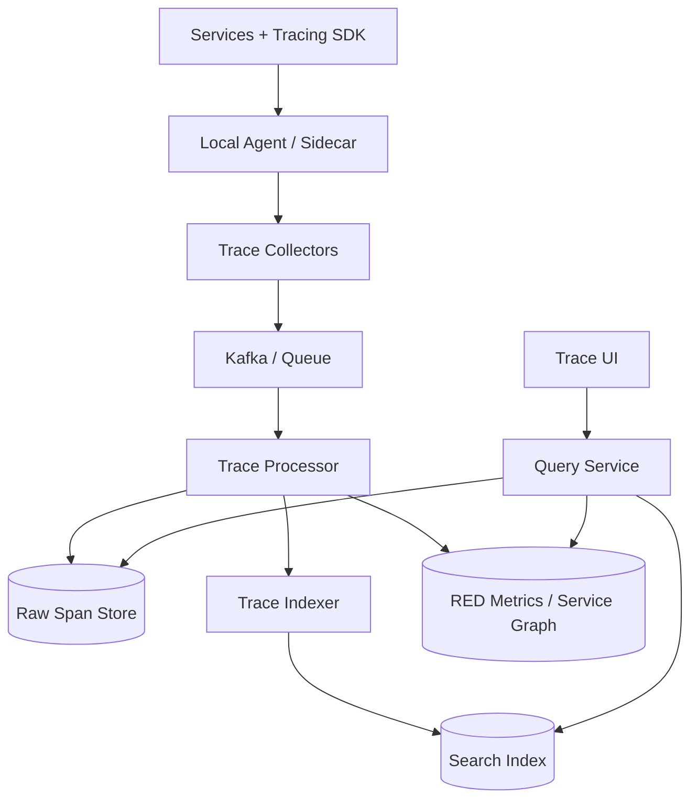

# 设计 Tracing Service

## 功能需求

- 收集分布式请求链路中的 trace/span，展示完整调用拓扑和耗时。
- 支持按 trace_id 查询完整 trace，按 service、endpoint、error、latency 查询 traces。
- 支持采样策略、错误/慢请求优先保留，以及与 logs/metrics 关联。
- 支持 dashboard、依赖图、Service latency breakdown 和异常排查。

## 非功能需求

- 写入吞吐极高，采集链路不能明显拖慢业务请求。
- 查询 trace 低延迟，尤其是 incident 时按 trace_id 和 error/latency 查找。
- 数据允许采样和延迟处理，但关键错误 trace 不应轻易丢失。
- 标签和 baggage 要控制 cardinality，避免索引和存储爆炸。

## API 设计

```text
POST /v1/traces
- request: spans[{trace_id, span_id, parent_span_id, service, operation, start_time, duration, tags, status}]
- response: accepted_count, rejected_count

GET /traces/{trace_id}
- response: trace, spans[], service_graph

POST /traces/search
- request: filters{service, operation, status, min_duration, tags}, start, end, limit, cursor
- response: trace_summaries[], next_cursor

GET /services/{service}/dependencies?start=&end=
- response: upstream[], downstream[], latency, error_rate

POST /sampling/rules
- request: service, operation, strategy, rate, conditions
- response: rule_id
```

## 高层架构



## 关键组件

- Tracing SDK / Instrumentation
  - 在服务内创建 span，注入/提取 trace context。
  - 支持 HTTP/gRPC/message queue 的上下文传播。
  - 记录 service、operation、start_time、duration、status、tags。
  - 注意：SDK 必须轻量，不应在业务请求热路径同步等待 tracing backend。

- Context Propagation
  - 使用 `trace_id`、`span_id`、`parent_span_id` 串起调用链。
  - 常见 header：

```text
traceparent: version-trace_id-span_id-flags
baggage: key=value,...
```

  - `trace_id` 在入口生成，并随请求传递到下游。
  - baggage 只能放低 cardinality、小体积信息，不能塞 user PII 或大对象。

- Local Agent / Sidecar
  - 应用把 span 批量发给本机 agent。
  - agent 做 buffer、batch、压缩、重试和本地采样。
  - backend 短暂不可用时，agent 可以丢弃低优先级 span，保留错误/慢请求。
  - 注意：agent 本地 buffer 有上限，避免占满业务机器磁盘/内存。

- Trace Collectors
  - 接收 agent/SDK 上报。
  - 做协议转换、基础校验、限流、tenant 鉴权。
  - stateless scale，后面写 Kafka。
  - collector 不做重计算，避免成为瓶颈。

- Kafka / Queue
  - 解耦 ingestion 和 processing。
  - 后端存储抖动时，Kafka 缓冲 span。
  - 可以按 `trace_id` partition，让同一个 trace 的 spans 进入同一处理分区，便于聚合。
  - 至少一次投递，processor 必须能去重。

- Trace Processor
  - 合并 spans，生成 trace summary。
  - 计算 duration、root span、critical path、error flag。
  - 派生 RED metrics：rate、error、duration。
  - 生成 service dependency graph。
  - 对高价值 traces 做 tail-based sampling。

- Raw Span Store
  - 存完整 span payload。
  - 按 `trace_id` 快速读取整条 trace。
  - 可以用 Cassandra/ScyllaDB、ClickHouse、S3+Parquet、对象存储组合。
  - Raw store 是 trace 详情 source of truth，保留期通常较短。

- Search Index
  - 存 trace summary 和可搜索字段。
  - 支持按 service、operation、status、duration、tags、time range 搜索。
  - 不要把所有高 cardinality tags 都建索引。
  - 可以用 Elasticsearch/OpenSearch、ClickHouse、Druid/Pinot。

- Query Service / Trace UI
  - 查询路径分两步：
    - search index 找 trace_ids。
    - raw store 按 trace_ids 拉完整 spans。
  - 负责重建 trace tree、service graph、waterfall。
  - 对热门 incident query 做缓存和限流。

## 核心流程

- Trace 生成
  - 请求进入 edge service，SDK 生成 `trace_id` 和 root span。
  - 每次下游调用生成 child span。
  - HTTP/gRPC headers 传播 trace context。
  - 每个服务结束 span 后异步上报给 local agent。

- Span ingestion
  - Agent 批量压缩发送 spans 到 collector。
  - Collector 校验字段、tenant、payload size。
  - Collector 写 Kafka。
  - Processor 消费 Kafka，去重并写 raw span store。
  - Indexer 生成 trace summary 和 searchable tags。

- 查询 trace
  - 用户输入 `trace_id`。
  - Query Service 从 Raw Span Store 按 `trace_id` 读取所有 spans。
  - 根据 `parent_span_id` 组装树。
  - 计算每个 service 的 latency contribution。
  - UI 展示 waterfall 和 error span。

- 搜索慢请求/错误请求
  - 用户查询 `service=checkout AND status=error` 或 `duration > 2s`。
  - Query Service 先查 Search Index，拿到 trace_ids。
  - 再批量读取 Raw Span Store。
  - 返回 trace summaries 和可点击详情。

- Sampling
  - Head-based sampling 在入口决定是否采样，所有下游继承 sampling flag。
  - Tail-based sampling 在 Processor 看完整 trace 后决定是否保留。
  - 错误、超慢、VIP tenant traces 可以强制保留。

## 存储选择

- Raw Span Store
  - Cassandra/ScyllaDB：按 `trace_id` 查询快，写吞吐高。
  - ClickHouse：适合 span 分析、聚合和压缩。
  - Object Storage：适合长期低成本归档，不适合低延迟随机查询。

- Search Index
  - Elasticsearch/OpenSearch：搜索体验好，适合 trace summary 和 tags filter。
  - ClickHouse：适合结构化条件过滤和聚合，成本可控。
  - 不建议把完整 span 高 cardinality tags 全量建倒排索引。

- Metrics Store
  - Prometheus/M3/TSDB。
  - 存从 spans 派生的 service metrics 和 dependency metrics。
  - metrics 是 derived view，不是 trace source of truth。

- Kafka
  - 高吞吐 ingest buffer。
  - 支持 replay processor/indexer。
  - 分区 key 通常用 `trace_id`。

## 扩展方案

- SDK/agent 做 batch、compression 和本地 buffer，减少业务影响。
- Collector stateless scale，Kafka 吸收写入峰值。
- 按 `trace_id` partition，保证同 trace spans 更容易聚合。
- Raw store 按 `trace_id` shard，index store 按 time + service shard。
- 热门搜索字段建索引，高 cardinality tags 只保存在 raw span 或列式存储。
- 使用采样控制成本：低流量服务全采样，高流量服务低采样，错误/慢请求强保留。

## 系统深挖

### 1. Head-based Sampling vs Tail-based Sampling

- 方案 A：Head-based sampling
  - 适用场景：高 QPS 服务，想在入口快速控制采样率。
  - ✅ 优点：实现简单；下游只看 sampling flag；成本可控。
  - ❌ 缺点：入口时不知道请求是否会变慢或失败，可能漏掉关键 trace。

- 方案 B：Tail-based sampling
  - 适用场景：希望保留错误、慢请求、特定用户/租户 trace。
  - ✅ 优点：可以基于完整 trace 结果决定保留，排障价值高。
  - ❌ 缺点：processor 要暂存 spans，内存/延迟/复杂度更高。

- 方案 C：Hybrid
  - 适用场景：生产系统。
  - ✅ 优点：head sampling 控制基础成本，tail sampling 强保留高价值 traces。
  - ❌ 缺点：采样规则和解释更复杂。

- 推荐：
  - 默认 head-based sampling。
  - 对 errors、slow traces、VIP tenants 做 tail-based 或 always sample。
  - 采样决策必须记录在 trace summary 里，避免分析误解。

### 2. Context Propagation：同步调用 vs 异步消息

- 方案 A：只支持 HTTP/gRPC headers
  - 适用场景：简单微服务。
  - ✅ 优点：实现直观。
  - ❌ 缺点：消息队列、异步任务、cron job 链路会断。

- 方案 B：支持 message headers
  - 适用场景：event-driven 系统。
  - ✅ 优点：生产系统常见异步链路可串起来。
  - ❌ 缺点：fanout/fanin 关系复杂，trace tree 可能不再是简单树。

- 方案 C：Trace links
  - 适用场景：批处理、队列、异步 workflow。
  - ✅ 优点：可表达一个 span 关联多个 parent traces。
  - ❌ 缺点：UI 和查询模型更复杂。

- 推荐：
  - 同步调用传播 `traceparent`。
  - MQ headers 传播 trace context。
  - fanout/fanin 用 span links，避免强行伪造成单父节点。

### 3. 存储模型：Raw Spans vs Trace Summary

- 方案 A：只存 raw spans
  - 适用场景：小规模系统。
  - ✅ 优点：数据完整。
  - ❌ 缺点：搜索慢，按 error/latency/service 查询要扫大量数据。

- 方案 B：只存 summary
  - 适用场景：只看聚合 dashboard。
  - ✅ 优点：成本低，查询快。
  - ❌ 缺点：无法做单 trace 排障。

- 方案 C：Raw spans + summary index
  - 适用场景：生产 tracing。
  - ✅ 优点：trace_id 查详情快，按条件搜索也快。
  - ❌ 缺点：双写 raw store 和 index，有一致性和成本问题。

- 推荐：
  - Raw span store 是详情源。
  - Trace summary/search index 是 derived view。
  - index 丢了可从 raw spans replay 重建。

### 4. Tag Cardinality 和 PII

- 方案 A：所有 tags 都可索引
  - 适用场景：不推荐。
  - ✅ 优点：查询灵活。
  - ❌ 缺点：`user_id/request_id/order_id` 会让索引爆炸，成本不可控。

- 方案 B：限制可索引 tags
  - 适用场景：生产系统。
  - ✅ 优点：控制 index cardinality 和查询成本。
  - ❌ 缺点：某些 ad-hoc debug 查询不方便。

- 方案 C：高 cardinality tags 只存 raw，不建索引
  - 适用场景：大规模 tracing。
  - ✅ 优点：保留 debug 信息，同时保护索引。
  - ❌ 缺点：无法快速按这些字段搜索，需依赖 logs 或额外索引。

- 推荐：
  - 索引低 cardinality tags：service、operation、status、region、endpoint_template。
  - user_id、email、token、raw URL、request payload 不进索引，PII 需脱敏。
  - 与 logs 关联用 trace_id，而不是把所有业务字段塞进 span tags。

### 5. Ingestion Reliability：同步上报 vs Agent Buffer vs Queue

- 方案 A：业务请求同步上报 backend
  - 适用场景：不适合生产。
  - ✅ 优点：实现简单。
  - ❌ 缺点：tracing backend 故障会拖慢业务请求。

- 方案 B：SDK -> local agent buffer
  - 适用场景：微服务生产环境。
  - ✅ 优点：业务请求只写本地 buffer；agent batch/压缩/重试。
  - ❌ 缺点：机器 crash 时 buffer 可能丢。

- 方案 C：Agent -> Kafka durable queue
  - 适用场景：大规模平台。
  - ✅ 优点：后端存储不可用时可缓冲；processor 可重放。
  - ❌ 缺点：增加链路延迟和运维复杂度。

- 推荐：
  - SDK 异步发 agent。
  - Agent 发 collector，collector 写 Kafka。
  - 对低优先级 spans 可丢，对 error/slow traces 尽量保留。

### 6. Query Path：trace_id 查详情 vs 条件搜索

- 方案 A：所有查询都走同一个数据库
  - 适用场景：规模小。
  - ✅ 优点：架构简单。
  - ❌ 缺点：trace_id point lookup 和 tag/time range search 的访问模式差异很大。

- 方案 B：Raw store + search index
  - 适用场景：生产系统。
  - ✅ 优点：trace_id 详情和条件搜索各自优化。
  - ❌ 缺点：index 可能落后 raw store，查询结果短暂不一致。

- 方案 C：Columnar store 统一承载
  - 适用场景：ClickHouse 类系统，结构化查询强。
  - ✅ 优点：压缩好，聚合强，能同时查明细和聚合。
  - ❌ 缺点：全文/任意 tag 搜索体验可能弱于专门搜索引擎。

- 推荐：
  - trace_id 查 raw store。
  - 条件搜索查 index，再回 raw store 拉完整 trace。
  - UI 要展示数据 freshness，避免用户误以为没有 trace。

### 7. Service Graph 和 Metrics 派生

- 方案 A：只展示单 trace
  - 适用场景：基础 tracing。
  - ✅ 优点：排查单请求有效。
  - ❌ 缺点：无法看服务整体依赖和趋势。

- 方案 B：从 spans 派生 RED metrics
  - 适用场景：observability 平台。
  - ✅ 优点：自动得到 request rate、error rate、duration。
  - ❌ 缺点：采样会影响 metrics 准确性，不能完全替代 metrics pipeline。

- 方案 C：Service dependency graph
  - 适用场景：微服务架构排障。
  - ✅ 优点：发现下游依赖、慢调用、错误传播路径。
  - ❌ 缺点：异步调用和采样会让图不完整。

- 推荐：
  - Traces 派生 service graph 和近似 RED metrics。
  - 核心 SLO 仍以 metrics 系统为准。
  - Trace-derived metrics 要标记 sampling rate。

### 8. Multi-tenant 和成本控制

- 方案 A：所有服务共享同一采样率和 retention
  - 适用场景：小组织。
  - ✅ 优点：简单。
  - ❌ 缺点：高 QPS 服务会吃掉存储预算，低 QPS 关键服务反而数据不足。

- 方案 B：按 service/tenant 配采样和 retention
  - 适用场景：生产平台。
  - ✅ 优点：成本可控，关键业务优先。
  - ❌ 缺点：配置治理复杂。

- 方案 C：动态采样
  - 适用场景：流量波动大。
  - ✅ 优点：错误升高时提高采样，正常时降低成本。
  - ❌ 缺点：实现复杂，分析要考虑动态采样偏差。

- 推荐：
  - 按 tenant/service 设置 ingestion quota、sampling rate、retention。
  - error/slow traces override sampling。
  - 对超额 tenant 做降采样而不是拖垮全局系统。

## 面试亮点

- Tracing 的核心是 trace context propagation；没有稳定传播，后端存储再强也串不起链路。
- SDK 不能同步依赖 tracing backend，必须异步上报到 agent/collector。
- Raw spans 和 searchable trace summary 要分开：raw 是详情源，index 是 derived view。
- Head sampling 成本低但会漏掉慢/错请求；tail sampling 排障价值高但复杂。
- 高 cardinality tags 和 PII 是 tracing 系统的大坑，不能把 user_id/token/raw URL 都建索引。
- Kafka 是 ingestion 的缓冲和 replay 边界，collector stateless scale，processor/indexer 可重放。
- Trace-derived RED metrics 很有用，但受采样影响，核心 SLO 仍应由 metrics 系统承担。
- 查询要区分 trace_id point lookup 和 service/time/tag search，两种访问模式通常需要不同存储/索引。

## 一句话总结

Tracing Service 的核心是：通过 SDK 和标准 trace context 把跨服务调用串成 trace，异步经 agent/collector/Kafka 写入 raw span store，并派生 trace summary index、service graph 和 RED metrics；同时用采样、tag cardinality 控制和 PII 脱敏保证高吞吐下仍可查询、可排障、可控成本。
