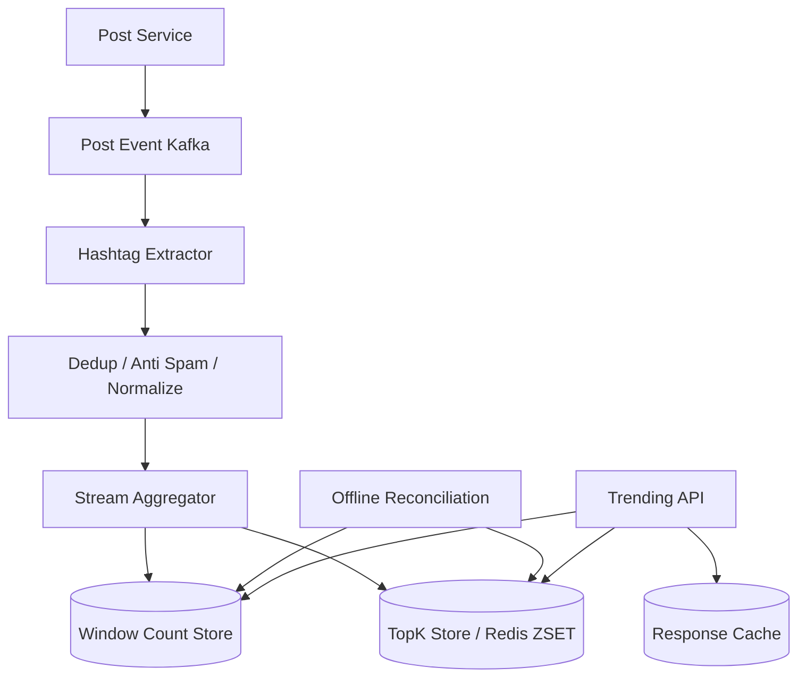

# 设计 Trending Hashtags 系统

## 功能需求

- 从用户发帖/评论中提取 hashtags，并统计 trending hashtags。
- 支持按时间窗口、地区、语言、兴趣圈层查询 Top K。
- 支持近实时更新，比如 1-5 分钟内反映趋势变化。
- 支持反作弊和过滤低质量/违规 hashtags。

## 非功能需求

- 写入吞吐高，社交平台发帖事件可能非常大。
- 查询低延迟，首页 trending 模块需要毫秒到百毫秒级返回。
- Trending 可以近似，但要稳定、可解释、可回放修正。
- 热点 hashtag 不能打爆单个 partition。

## API 设计

```text
GET /trends/hashtags?region=US&lang=en&window=1h&limit=20
- response: hashtags[], score, rank, delta

POST /internal/posts/events
- request: post_id, user_id, text, region, lang, created_at

GET /trends/hashtags/{tag}
- response: time_series, rank_history, related_tags

POST /admin/hashtags/blocklist
- request: tag, reason
```

## 高层架构



## 关键组件

- Post Event Kafka
  - 承接发帖事件。
  - 按 `post_id` 或 `user_id` 分区都可以，但聚合 hashtag 时需要后续 repartition by hashtag。
  - 保留 raw event 方便 replay 和 offline reconciliation。

- Hashtag Extractor
  - 从文本中解析 `#tag`。
  - 做 normalize：
    - lowercase
    - Unicode normalization
    - 去标点
    - 合并大小写和等价形式
  - 对一条 post 内重复 hashtag 去重，避免 `#ai #ai #ai` 刷量。

- Dedup / Anti-spam
  - 去重维度：
    - `post_id + hashtag`
    - 可选 `user_id + hashtag + time_bucket`
  - 过滤 bot、低信誉账号、重复内容、黑名单 hashtag。
  - 注意：trending 不是纯 count，通常会加质量权重。

- Stream Aggregator
  - 按 `hashtag + region + lang + time_bucket` 聚合。
  - 维护 1min bucket，再组合成 15min/1h/24h window。
  - 输出窗口 count、unique users、velocity、growth rate。
  - 可以用 Flink / Kafka Streams / Spark Streaming。

- Window Count Store
  - 存每个 hashtag 在各时间 bucket 的计数。
  - 示例：

```text
hashtag_counts(
  region,
  lang,
  bucket_minute,
  hashtag,
  post_count,
  unique_user_count,
  score
)
```

  - 用于 rank history、debug、offline correction。
  - 不是直接服务首页 TopK 的最佳结构。

- TopK Store
  - 服务在线查询。
  - Redis Sorted Set 或 RocksDB state / Pinot/Druid。
  - key 示例：

```text
trending:{region}:{lang}:{window}
score -> hashtag
```

  - API 直接读 TopK Store，低延迟。
  - TopK 是 derived view，可以从 Window Count Store 重建。

- Offline Reconciliation
  - 定期用 raw events 重新计算过去窗口。
  - 修正 late events、重复事件、反作弊模型延迟判定。
  - 产出最终 rank 或回填历史分析表。

## 核心流程

- 发帖进入统计
  - Post Service 写 post 后发 event 到 Kafka。
  - Extractor 解析 hashtags。
  - Clean 进行 normalize、dedup、spam filtering。
  - Stream Aggregator 更新 minute bucket count。
  - 更新各 window 的 TopK Store。
  - Trending API 读 Redis ZSET 返回结果。

- 查询 trending
  - Client 请求 `region=US, lang=en, window=1h`。
  - API 先读 response cache。
  - miss 时读 Redis ZSET top 20。
  - 过滤 blocklist 和安全策略。
  - 返回 rank、score、rank delta。

- Late event / replay
  - 如果 post event 延迟到达，按 event_time 写入对应 bucket。
  - 对已过去窗口，如果仍在 allowed lateness 内，更新窗口。
  - 超出 lateness 的数据进入 correction path。
  - Offline job 重算历史窗口，修正 analytics，不一定改实时榜单。

## 存储选择

- Kafka：raw event log，可 replay。
- Flink/Kafka Streams State：实时窗口聚合。
- Redis ZSET：在线 TopK 查询。
- Cassandra/DynamoDB/ClickHouse/Druid：存 bucket counts 和历史趋势。
- S3：raw event 归档和 offline reconciliation。

## 扩展方案

- 先按 region/lang 分流，再按 hashtag hash repartition。
- 热点 hashtag 用局部聚合 + 全局合并，避免单 partition 过热。
- TopK 只存前 N 或前几千，减少内存。
- 对长窗口用 bucket rollup，不保留所有事件明细。
- 反作弊模型异步打分，实时榜单先用轻量规则，离线再修正。

## 系统深挖

### 1. 精确统计 vs 近似统计

- 方案 A：精确 count
  - 适用场景：规模中等、榜单需要可解释。
  - ✅ 优点：准确，可 debug。
  - ❌ 缺点：高流量 hashtag 写热点明显，unique user 统计成本高。

- 方案 B：Count-Min Sketch / approximate heavy hitters
  - 适用场景：极大规模，只关心趋势候选。
  - ✅ 优点：内存低，吞吐高。
  - ❌ 缺点：有误差，不能准确解释每个 tag 的 count。

- 方案 C：Hybrid
  - 适用场景：生产系统。
  - ✅ 优点：用 approximate 找候选，再对候选精确计数。
  - ❌ 缺点：架构复杂。

- 推荐：
  - 实时 TopK 可以近似候选 + 精确候选计数。
  - 对外展示的 top hashtags 要能解释 score 来源。

### 2. Sliding Window 怎么维护

- 方案 A：每个事件更新所有窗口
  - ✅ 优点：查询快。
  - ❌ 缺点：写放大大。

- 方案 B：minute buckets + query/worker 聚合
  - ✅ 优点：存储清晰，窗口可组合。
  - ❌ 缺点：查询时聚合多 bucket 成本高。

- 方案 C：bucket + rolling TopK
  - ✅ 优点：实时榜单快，历史也可重建。
  - ❌ 缺点：窗口过期时需要从 score 中移除旧 bucket 的贡献。

- 推荐：
  - 维护 1min buckets。
  - Stream job 同时维护常用窗口：15min、1h、24h。
  - 不支持任意 lookup window；如果要求任意窗口，使用 Druid/ClickHouse 查询历史。

### 3. TopK 数据结构

- 方案 A：Redis Sorted Set
  - ✅ 优点：实现简单，TopN 查询快。
  - ❌ 缺点：更新频繁时内存和写压力大；多 shard 合并复杂。

- 方案 B：Flink keyed state + heap
  - ✅ 优点：实时计算强，窗口语义好。
  - ❌ 缺点：服务在线 query 还要 sink 到 serving store。

- 方案 C：Druid/ClickHouse
  - ✅ 优点：支持 ad-hoc group by 和历史窗口。
  - ❌ 缺点：实时首页查询延迟和成本可能高于 Redis serving view。

- 推荐：
  - Stream 聚合计算 TopK，Redis ZSET 服务首页。
  - 历史趋势和任意分析走 OLAP。

### 4. Hot Hashtag / Hot Partition

- 方案 A：按 hashtag 分区
  - ✅ 优点：同 hashtag 聚合简单。
  - ❌ 缺点：超级热点 hashtag 会打爆单 partition。

- 方案 B：局部聚合后全局合并
  - ✅ 优点：先在多个 partition 做 partial count，再汇总。
  - ❌ 缺点：需要二阶段聚合，延迟增加。

- 方案 C：hashtag + random shard
  - ✅ 优点：热点 tag 被拆散。
  - ❌ 缺点：读取/合并时要聚合多个 shard。

- 推荐：
  - Extractor 后先按 source partition 局部聚合。
  - 再按 hashtag 做 global aggregation。
  - 对检测到的 hot tag 使用 sub-shard。

### 5. Trending Score：count vs velocity vs acceleration

- 方案 A：纯 count
  - ✅ 优点：简单可解释。
  - ❌ 缺点：长期热门话题一直霸榜，不代表正在 trending。

- 方案 B：增长率 / velocity
  - ✅ 优点：更能发现新趋势。
  - ❌ 缺点：小基数 tag 容易因为少量增长冲上榜。

- 方案 C：综合 score
  - ✅ 优点：平衡热度、新鲜度、增长和质量。
  - ❌ 缺点：解释和调参复杂。

- 推荐 score：

```text
score =
  log(post_count) * freshness_decay
+ growth_rate_weight
+ unique_user_weight
- spam_penalty
```

- 同时设置 minimum volume，避免小样本噪声。

### 6. 去重和反作弊

- 方案 A：只按 post count
  - ✅ 优点：简单。
  - ❌ 缺点：bot 和刷屏极易操纵榜单。

- 方案 B：unique user count
  - ✅ 优点：降低单用户刷量。
  - ❌ 缺点：需要近似或精确 UV 统计。

- 方案 C：trust-weighted count
  - ✅ 优点：账号信誉、内容质量、互动质量共同影响趋势。
  - ❌ 缺点：模型复杂，可能有偏差。

- 推荐：
  - 一条 post 内重复 hashtag 只算一次。
  - 同一用户短时间重复使用同 tag 降权。
  - 使用 HyperLogLog 估算 unique users。
  - 反作弊延迟判定由 offline reconciliation 修正。

### 7. Region / Language / Personalization

- 方案 A：全球一个榜
  - ✅ 优点：简单。
  - ❌ 缺点：不同地区语言差异巨大，用户体验差。

- 方案 B：按 region/lang 维护榜单
  - ✅ 优点：结果更相关。
  - ❌ 缺点：榜单数量增加，存储和计算放大。

- 方案 C：个性化 trending
  - ✅ 优点：更贴近用户兴趣。
  - ❌ 缺点：不能为每个用户实时计算完整 TopK。

- 推荐：
  - 先维护 global、region、language 三层榜单。
  - 个性化用基础榜单混合，而不是每个用户单独算。
  - 例如 tech 用户增加 tech/community hashtags 权重。

### 8. Reconciliation 和可解释性

- 方案 A：只信实时流
  - ✅ 优点：架构简单。
  - ❌ 缺点：late events、重复事件、反作弊延迟都会影响榜单。

- 方案 B：离线重算
  - ✅ 优点：准确，可审计。
  - ❌ 缺点：延迟高。

- 方案 C：实时 + 离线校准
  - ✅ 优点：实时体验和最终准确性兼顾。
  - ❌ 缺点：同一窗口排名可能被修正。

- 推荐：
  - 实时榜单服务用户体验。
  - 离线重算用于历史报表、模型训练、debug。
  - 对外展示当前榜单不频繁回改，避免用户困惑。

## 面试亮点

- Trending 不是单纯 Top count，要考虑 velocity、freshness、unique users 和 spam penalty。
- Window 设计是核心：固定窗口可以实时维护，任意窗口要 OLAP。
- Redis ZSET 适合 serving TopK，但不是 raw truth；raw events 和 bucket counts 要可回放。
- 热点 hashtag 会造成 partition 热点，需要 local aggregation 或 sub-shard。
- 一条 post 内重复 hashtag、同用户刷屏、bot 流量都要降权。
- 地区/语言榜单比全球榜更有价值，但会带来计算和存储放大。
- 实时榜单可以近似，离线 reconciliation 负责修正和可解释性。

## 一句话总结

Trending Hashtags 系统的核心是：从发帖事件流中提取并清洗 hashtags，按 region/lang/time bucket 实时聚合，用 Redis ZSET 服务固定窗口 TopK，同时用 raw events 和 bucket counts 做离线 reconciliation；趋势分数要结合 count、增长、新鲜度、unique users 和反作弊，而不是只看总量。
