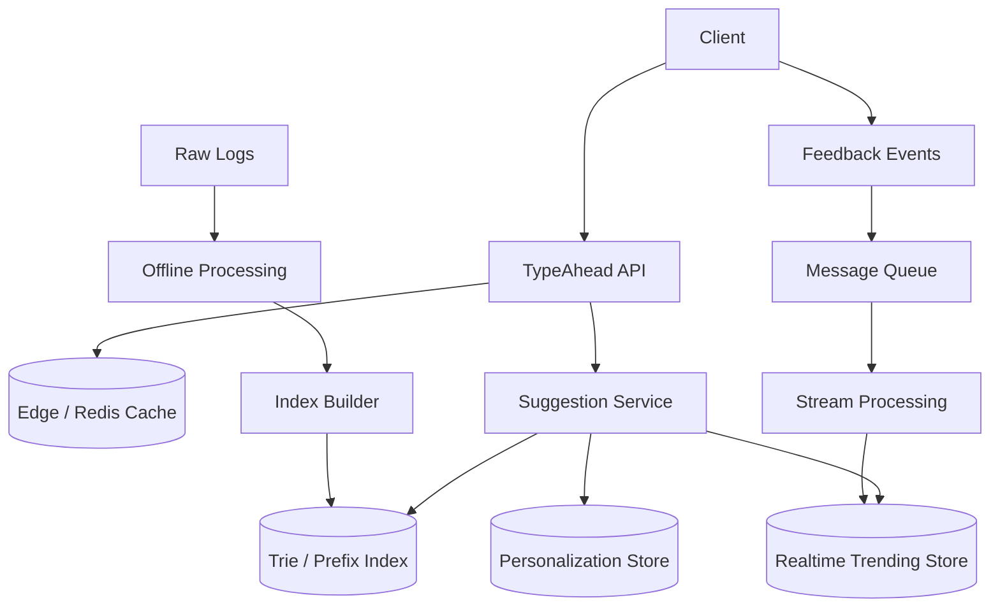

# 设计 TypeAhead 系统

## 功能需求

- 用户输入 prefix 时，返回 query/product/place/user 等建议词。
- 支持个性化和上下文，例如 region、language、device、历史搜索。
- 支持实时 trending suggestion，例如热点新闻、热门商品、热门地点。
- 支持点击/选择反馈，用于更新排序和评估效果。

## 非功能需求

- 低延迟：typing 场景通常要求 p95 在几十毫秒级。
- 高 QPS：每个用户输入多个字符会产生多次请求。
- 高可用：suggestion 不可用时可以降级到静态热门词。
- 结果质量可迭代：需要跟踪 picking rate、CTR、zero-result rate。

## API 设计

```text
GET /suggest?q=iph&limit=10&region=us&lang=en
- 返回 suggestions, score, source, tracking_id

POST /suggest/feedback
- tracking_id, query_prefix, selected_suggestion, position, user_id

POST /internal/suggestions/rebuild
- corpus_version, region, language

GET /internal/suggestions/health
- index_version, freshness, latency
```

## 高层架构



## 关键组件

### TypeAhead API

- 接收 prefix query，返回 top suggestions。
- 注意事项：
  - 对短 prefix，例如 1 个字符，要强缓存或限制请求。
  - 返回结果要带 `tracking_id`，用于后续 feedback 归因。
  - 支持 region/language/device/filter，避免全局同一套结果。

### Suggestion Service

- 合并多个来源：
  - static index：长期高频 query。
  - realtime trending：短期热点。
  - personalization：用户历史和上下文。
- 注意事项：
  - 合并时要做 dedup。
  - 排序要兼顾 popularity、freshness、personalization、business rules。
  - 如果某个来源超时，要降级返回其他来源。

### Static Prefix Index

- 存离线构建的 prefix -> suggestions。
- 可以用 Trie 或 Prefix Hashtable。
- 注意事项：
  - index 要 versioned publish。
  - 构建新版本后原子切换，避免半成品 index。
  - 对不同 region/language 可以分 index。

### Realtime Trending Store

- 存最近几分钟/小时的热门 query 或 item。
- 由 stream processing 实时更新。
- 注意事项：
  - trending 适合短时间窗口和 decay score。
  - 需要防 spam 和异常流量污染。
  - 可以按 region/language 分 bucket。

### Feedback Pipeline

- 采集 impression、click/pick、position、prefix、latency、user context。
- 注意事项：
  - Picking rate 需要知道用户看到了什么，所以必须记录 exposure/impression。
  - 只记录 click 不够，无法判断没点的结果。
  - Feedback 既用于离线训练，也用于实时 trending。

### Index Builder

- 从 raw logs、catalog、search query logs 构建静态 suggestion index。
- 注意事项：
  - 需要清洗低质量 query、敏感词、拼写错误、垃圾流量。
  - 输出 top suggestions per prefix。
  - 支持 rollback 到旧 index version。

## 核心流程

### 查询建议词

- 用户输入 prefix，例如 `iph`。
- Client 调 `GET /suggest?q=iph`。
- API 先查 edge/Redis cache。
- Cache miss 时调用 Suggestion Service。
- Suggestion Service 查询 static prefix index、trending store、personalization store。
- 合并、去重、排序、过滤敏感词。
- 返回 suggestions 和 `tracking_id`。

### 反馈采集

- Client 展示 suggestion list 时记录 impression。
- 用户点击某个 suggestion 后发送 feedback。
- Feedback event 进入 message queue。
- Stream job 更新 realtime trending。
- Raw logs 进入 offline pipeline，用于下一轮 index build 和 ranking model。

### 离线构建 index

- Batch job 读取搜索日志、点击日志、catalog。
- 清洗、聚合 query frequency、计算 quality score。
- 为每个 prefix 生成 top N suggestions。
- Builder 生成新 index version。
- 灰度加载后切换到新版本。

### 实时 trending

- Stream job 消费最近搜索/点击事件。
- 按 region/language/prefix 维护 sliding window count 或 decayed score。
- 输出 trending suggestions 到 Redis/Realtime store。
- Query path 合并 trending 和 static index。

## 存储选择

- **Static Index Store**
  - Trie、FST、prefix hashtable、或内存结构。
  - 用于低延迟 prefix lookup。
- **Redis / Edge Cache**
  - 缓存热门 prefix 结果。
  - 短 prefix 例如 `a`、`i`、`s` QPS 极高，必须缓存。
- **Realtime Store**
  - Redis sorted set / RocksDB state / Flink state。
  - 存最近窗口 trending query。
- **Raw Log Store**
  - S3/HDFS/object store。
  - 存完整 impression/search/click logs，用于离线重算。
- **Message Queue**
  - Kafka/PubSub。
  - 承载实时 feedback/trending 更新。
- **Offline Warehouse**
  - Hive/Spark/BigQuery。
  - 用于训练、分析、质量评估。

## 扩展方案

- 按 region/language 分 index，减少单 index 体积。
- 热门 prefix 结果放 edge cache 或 Redis。
- Suggestion Service 多副本，index 本地内存加载。
- Index 按 prefix range 或 hash 分 shard。
- Realtime trending 按 prefix/region 分区处理。
- 短 prefix 可以返回预计算结果，长 prefix 再走 index lookup。
- 大规模个性化可用两阶段：召回通用候选，再轻量 personalized rerank。

## 系统深挖

### 1. Prefix Index：Trie vs Prefix Hashtable

- 问题：
  - TypeAhead 的核心是 prefix lookup，应该用 Trie 还是 prefix hashtable？
- 方案 A：Trie
  - 适用场景：
    - 需要内存紧凑、共享 prefix、支持 prefix traversal。
  - ✅ 优点：
    - Prefix 共享，空间效率好。
    - 可以支持更复杂操作，例如继续扩展、模糊匹配。
    - FST/DAWG 压缩后很适合生产。
  - ❌ 缺点：
    - 实现复杂。
    - 更新不如 hashtable 简单。
    - 分布式 shard 和版本切换要设计。
- 方案 B：Prefix Hashtable
  - 适用场景：
    - 预计算每个 prefix 的 top N，查询只需要 exact prefix lookup。
  - ✅ 优点：
    - 查询非常快，`O(1)` lookup。
    - 实现简单，容易做 cache。
    - 适合固定 top N suggestion。
  - ❌ 缺点：
    - 存储膨胀，同一个 suggestion 会重复出现在多个 prefix。
    - 对 long-tail prefix 空间浪费明显。
- 方案 C：Hybrid
  - 适用场景：
    - 热门短 prefix 用 hashtable，长 prefix 用 Trie/FST。
  - ✅ 优点：
    - 短 prefix 查询极快。
    - 长 prefix 存储更紧凑。
  - ❌ 缺点：
    - 两套结构，构建和调试复杂。
- 推荐：
  - 面试里可以先选 Prefix Hashtable，因为查询路径简单、好解释。
  - 生产级可以用 compressed Trie/FST 或 hybrid。
  - 如果所有结果都离线预计算成 prefix -> top N，hashtable 很合理。

### 2. 更新链路：Message Queue 实时处理 vs Raw Log Offline Processing

- 问题：
  - Suggestion index 是实时更新，还是从日志离线重建？
- 方案 A：Raw log offline processing
  - 适用场景：
    - 长期热门 query、稳定 suggestion。
  - ✅ 优点：
    - 可以做复杂清洗、去 spam、质量过滤。
    - 结果稳定，可回放、可审计。
  - ❌ 缺点：
    - 新鲜度差，热点事件反应慢。
- 方案 B：Message queue + stream processing
  - 适用场景：
    - 实时 trending、突发热点。
  - ✅ 优点：
    - 新鲜度高，可以分钟级更新。
    - 支持实时 region/language trend。
  - ❌ 缺点：
    - 容易被 spam 或突发噪音污染。
    - 状态管理和去重更复杂。
- 方案 C：Offline static index + realtime overlay
  - 适用场景：
    - 大多数生产 TypeAhead。
  - ✅ 优点：
    - 静态结果稳定，实时 overlay 补热点。
    - 两条链路各自优化。
  - ❌ 缺点：
    - Query path 要 merge/dedup/rerank。
- 推荐：
  - 用 offline log processing 构建 base index。
  - 用 message queue/streaming 更新 realtime trending overlay。
  - Query 时合并 static + trending + personalization。

### 3. Real-time Trending：滑动窗口 vs Decay Score

- 问题：
  - 如何把刚刚变热的 query 推到 suggestion 前面？
- 方案 A：固定滑动窗口 count
  - 适用场景：
    - 例如最近 5 分钟、1 小时热门 query。
  - ✅ 优点：
    - 语义清晰。
    - 容易解释“最近 N 分钟热门”。
  - ❌ 缺点：
    - 窗口边界会有跳变。
    - 多窗口维护成本高。
- 方案 B：Decayed score
  - 适用场景：
    - Trending 排序，近期事件权重更高。
  - ✅ 优点：
    - 排名更平滑。
    - 不需要精确删除旧窗口事件。
  - ❌ 缺点：
    - 结果不是严格“过去 N 分钟”。
    - Decay 参数会影响排序。
- 方案 C：短窗口 + 长窗口混合
  - 适用场景：
    - 既要捕捉突发热点，又要避免噪声。
  - ✅ 优点：
    - 短窗口发现爆发，长窗口提供稳定性。
    - 可以减少 spam 突刺影响。
  - ❌ 缺点：
    - Scoring 和调参复杂。
- 推荐：
  - Trending 用 decay 或短长窗口混合。
  - 不建议只靠单个短窗口，否则容易被噪声带偏。

### 4. Ranking：popularity vs personalization vs business rules

- 问题：
  - Prefix lookup 找到候选后，怎么排序？
- 方案 A：只按 global popularity
  - 适用场景：
    - 简单搜索框，用户上下文不强。
  - ✅ 优点：
    - 简单稳定。
    - 容易缓存。
  - ❌ 缺点：
    - 不够个性化。
    - 不同 region/language 的结果可能不相关。
- 方案 B：Contextual ranking
  - 适用场景：
    - 有 region、language、device、time-of-day。
  - ✅ 优点：
    - 结果更相关。
    - 可以提高 picking rate。
  - ❌ 缺点：
    - Cache key 变多，命中率下降。
- 方案 C：Personalized rerank
  - 适用场景：
    - 电商、音乐、视频、地图等个性化强场景。
  - ✅ 优点：
    - 用户体验最好。
    - 可利用用户历史和偏好。
  - ❌ 缺点：
    - 延迟更高。
    - 需要处理隐私和冷启动。
- 推荐：
  - 召回用 prefix index。
  - 排序用 popularity + region/language + lightweight personalization。
  - TypeAhead 延迟预算小，不适合太重的 ranking model。

### 5. 缓存策略：全量 prefix cache vs 热门短 prefix cache

- 问题：
  - TypeAhead QPS 很高，尤其短 prefix，怎么缓存？
- 方案 A：缓存所有 prefix
  - 适用场景：
    - Prefix space 小。
  - ✅ 优点：
    - 查询快。
  - ❌ 缺点：
    - Prefix 组合太多，内存浪费。
    - 更新 invalidation 麻烦。
- 方案 B：只缓存热门短 prefix
  - 适用场景：
    - 大多数 TypeAhead。
  - ✅ 优点：
    - 命中高，内存可控。
    - `a`、`i`、`s` 这种热点 prefix 能被保护。
  - ❌ 缺点：
    - 长尾 prefix 仍要查 index。
- 方案 C：Edge cache + service local memory index
  - 适用场景：
    - 极高 QPS。
  - ✅ 优点：
    - 边缘挡住大部分重复短 prefix。
    - 本地内存 lookup 低延迟。
  - ❌ 缺点：
    - Index rollout 和 cache invalidation 更复杂。
- 推荐：
  - 热门短 prefix 放 Redis/edge cache。
  - Suggestion Service 本地加载 read-only index。
  - 结果带版本，index 切换时自然失效旧 cache。

### 6. Index 更新：增量更新 vs 全量 rebuild

- 问题：
  - Suggestion index 怎么发布新版本？
- 方案 A：全量 rebuild
  - 适用场景：
    - 静态 base index，每小时/每天更新。
  - ✅ 优点：
    - 构建结果一致，容易 rollback。
    - 可做完整质量校验。
  - ❌ 缺点：
    - 新鲜度不够。
    - 构建成本高。
- 方案 B：增量更新
  - 适用场景：
    - 高频新增词、库存/商品变化频繁。
  - ✅ 优点：
    - 新鲜度更好。
  - ❌ 缺点：
    - Index mutation 复杂。
    - 容易产生不一致或碎片。
- 方案 C：全量 base index + realtime overlay
  - 适用场景：
    - 需要稳定性和新鲜度兼顾。
  - ✅ 优点：
    - Base index 可控，overlay 负责新鲜热点。
    - 发布和 rollback 简单。
  - ❌ 缺点：
    - Query merge 复杂。
- 推荐：
  - Base index 全量 rebuild + versioned publish。
  - Realtime trending 作为 overlay。
  - 这是稳定性和新鲜度的平衡。

### 7. Quality Metrics：Latency vs Picking Rate

- 问题：
  - TypeAhead 好不好，不能只看服务延迟。
- 方案 A：只看 latency
  - 适用场景：
    - 系统早期稳定性阶段。
  - ✅ 优点：
    - 容易监控。
    - 直接影响输入体验。
  - ❌ 缺点：
    - 快但结果差，用户仍然不会选。
- 方案 B：Picking rate / CTR
  - 适用场景：
    - 衡量 suggestion 质量。
  - ✅ 优点：
    - 直接反映用户是否选择建议词。
    - 可用于 ranking A/B test。
  - ❌ 缺点：
    - 受 position bias、UI、用户意图影响。
- 方案 C：Latency + picking rate + downstream success
  - 适用场景：
    - 成熟系统。
  - ✅ 优点：
    - 同时衡量体验、质量、业务结果。
    - 可以避免只优化点击率导致低质量建议。
  - ❌ 缺点：
    - 指标体系更复杂，需要实验平台。
- 推荐：
  - 性能看 p50/p95/p99 latency。
  - 质量看 picking rate、CTR、zero-result rate、reformulation rate。
  - 业务看 search success、conversion、session outcome。

## 面试亮点

- 可以深挖：Trie 和 Prefix Hashtable 的差异，本质是空间效率 vs 查询/实现简单度。
- Staff+ 判断点：TypeAhead 通常不是纯实时系统，base index 离线构建，trending 用实时 overlay。
- 可以深挖：Message queue 适合实时 trending，raw log offline processing 适合稳定 index 和清洗。
- Staff+ 判断点：短 prefix 是最大热点，缓存策略要围绕短 prefix 设计。
- 可以深挖：Picking rate 必须基于 impression + selection 归因，不能只记录 click。
- Staff+ 判断点：延迟和质量要一起看，快但没人选的 suggestion 没价值。

## 一句话总结

- TypeAhead 的核心是低延迟 prefix lookup + 高质量排序：base suggestion 用离线日志构建 Trie/FST 或 prefix hashtable，实时 trending 通过 MQ/stream overlay 注入，查询时合并 static、trending、personalized signals，并用 latency、picking rate、zero-result rate 持续评估效果。
