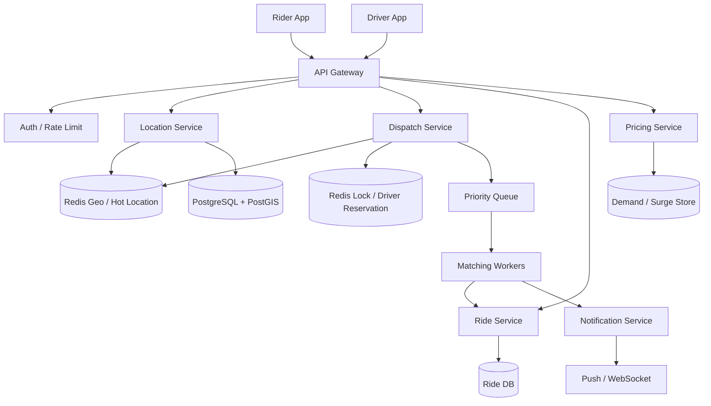

# 设计 Uber 系统

## 功能需求

- 乘客可以发起叫车请求，系统匹配附近可用司机。
- 司机客户端频繁上报位置，乘客可以查询附近车辆和司机 ETA。
- 支持行程状态流转：requested、matched、accepted、picked_up、completed、cancelled。
- 支持高峰期流量控制、surge pricing、司机超时不响应后的重新匹配。

## 非功能需求

- 附近司机查询低延迟，通常希望几十到几百毫秒级。
- 司机位置可以短暂不准确，但不能长期使用过期位置。
- 同一个司机不能同时被多个 ride request 成功锁定。
- 系统按地理区域水平扩展，边界附近允许少量 scatter-gather。

## API 设计

```text
POST /drivers/{driver_id}/location
- lat, lng, heading, speed, timestamp, status

GET /riders/{rider_id}/nearby-drivers?lat=&lng=&radius=
- nearby drivers, eta, car_type

POST /rides
- rider_id, pickup_lat, pickup_lng, dropoff_lat, dropoff_lng, car_type, idempotency_key

POST /rides/{ride_id}/accept
- driver_id

POST /rides/{ride_id}/cancel
- requester_id, reason

GET /rides/{ride_id}
- ride status, driver, eta, route
```

## 高层架构



## 关键组件

### Location Service

- 接收司机位置更新，写入 hot location store。
- 负责去重、过期位置处理、geo shard routing。
- 注意事项：
  - 写入时比较 timestamp，拒绝旧位置覆盖新位置。
  - 对位置设置 TTL，避免离线司机还出现在搜索结果里。
  - 客户端应 adaptive update：静止/低速少发，高速/转弯频繁多发。

### Redis Geo / Hot Location Store

- 存最近活跃司机位置。
- 使用：

```text
GEOADD drivers:{region_or_cell} lng lat driver_id
GEOSEARCH drivers:{region_or_cell} FROMLONLAT lng lat BYRADIUS r km
```

- 注意事项：
  - Redis Geo 本质适合实时附近查询，但不是长期 source of truth。
  - 要按 geo shard/cell 拆 key，否则单个城市 hot key 会爆。
  - 查询边界时需要查相邻 cell，再 merge/sort。

### PostgreSQL + PostGIS

- 存司机最后位置、历史轨迹、审计、离线分析。
- 适合：
  - 历史查询
  - 轨迹回放
  - 运营分析
  - Redis rebuild
- 注意事项：
  - 不建议所有 nearby query 都打 PostGIS，热门城市高 QPS 会扛不住。
  - PostGIS 可以作为 durable store，不是 hot path 首选。

### Dispatch Service

- 根据 pickup location 找候选司机。
- 过滤司机状态、车型、距离、ETA、评分、接受率。
- 尝试锁定司机，发送 ride request。
- 注意事项：
  - 同一个司机不能被多个 ride 同时分配。
  - 司机不响应要 delayed retry / delayed queue 重新匹配。
  - 高峰期使用 priority queue，重要请求或高价值请求优先处理。

### Ride Service

- 管理 ride 状态机：

```text
REQUESTED -> MATCHING -> DRIVER_OFFERED -> ACCEPTED
          -> PICKED_UP -> COMPLETED
          -> CANCELLED / EXPIRED
```

- 注意事项：
  - 状态转移要幂等。
  - accept/cancel/payment callback 都可能重复。
  - Ride DB 是 ride lifecycle source of truth。

### Driver Reservation / Lock

- 用于短暂锁定司机，避免多个请求同时发给同一个司机。
- 例如 Redis lock：

```text
SET driver_lock:{driver_id} ride_id NX EX 10
```

- 注意事项：
  - TTL 约 10 秒，对应司机响应窗口。
  - lock 只是 reservation，不是最终 ride 状态。
  - accept 时还要检查 Ride DB 和 driver state。

### Matching Worker / Queue

- 消费 ride request，执行匹配流程。
- Queue 可按 priority 和 geo shard 分区。
- 注意事项：
  - 高峰期通过 queue 做 backpressure。
  - 司机超时不响应时，用 delayed queue 触发下一轮匹配。
  - 更复杂 lifecycle 可以用 Temporal / AWS Step Functions 编排。

## 核心流程

### 司机位置更新

- Driver app 根据速度、方向变化、是否接单中决定上报频率。
- Location Service 校验 timestamp，丢弃旧 update。
- 写 Redis Geo，对位置 key 设置 TTL 或维护 last_seen。
- 异步写 PostGIS/trajectory store，用于审计和分析。
- 如果司机长时间没有 update，过期后不再参与 nearby search。

### 乘客查询附近司机

- Rider app 调 nearby drivers API。
- Location Service 根据 pickup lat/lng 算 geo shard/cell。
- 查询当前 cell 和相邻 cell 的 Redis Geo。
- 过滤过期 location、driver status、car type。
- 计算 ETA，返回最近若干司机。
- 如果查询点在 shard boundary，需要 scatter-gather 多个相邻 shard。

### 发起叫车和匹配

- Rider 调 `POST /rides`。
- Ride Service 创建 ride，状态为 `REQUESTED/MATCHING`。
- Dispatch Service 查询附近候选司机。
- 按 ETA、距离、车型、司机状态排序。
- 对候选司机逐个尝试 `driver_lock:{driver_id}`，TTL 约 10 秒。
- 锁定成功后发送 push/WebSocket 给司机。
- 司机接受后，Ride Service 状态转为 `ACCEPTED`。
- 如果司机不响应，delayed queue 触发重新匹配。

### 司机不响应

- Dispatch 发出 offer 后创建 timeout task。
- 10 秒内司机 accept：取消或忽略 timeout task。
- 10 秒后仍未 accept：释放 driver lock，标记 offer expired。
- 从候选列表继续找下一个司机，或扩大半径重新查询。
- 超过最大尝试次数后告诉乘客暂无司机。

## 存储选择

- **Redis Geo**
  - 热路径：附近司机查询、司机实时位置。
  - 使用 `GEOADD`、`GEOSEARCH`。
  - 按 geo shard/cell 拆 key。
- **PostgreSQL + PostGIS**
  - durable location store、司机最后位置、轨迹、审计。
  - 支持地理查询和历史分析。
- **Ride DB**
  - ride 状态、offer、driver assignment、payment 状态。
  - source of truth。
- **Queue / Priority Queue**
  - matching task、driver timeout、notification、surge update。
- **Surge Store**
  - 按区域/时间窗口维护 demand/supply ratio。
  - 可以来自 stream aggregation。
- **Object/Analytics Store**
  - 历史轨迹、价格分析、供需预测、反作弊。

## 扩展方案

- 按地理区域 geo-sharding：城市、region、geohash prefix、S2 cell。
- Location Service、Dispatch、Queue、Redis、DB 都按 geo shard 部署。
- 大多数请求只访问本地 geo shard。
- 只有边界附近 proximity search 需要查询相邻 shard。
- Redis Geo 用多个 key 分散热点：

```text
drivers:{city}:{geohash_prefix}
drivers:{region}:{cell_id}
```

- PostGIS 用 read replicas 承担读查询，写路径按 region 分片。
- 高峰期通过 waiting/priority queue、surge pricing、扩大搜索半径和降级 nearby 刷新频率保护系统。

## 系统深挖

### 1. Geo index：Quadtree vs Geohash vs S2/H3

- 问题：
  - 如何把经纬度映射到可分片、可查询附近司机的数据结构？
- 方案 A：Quadtree
  - 适用场景：
    - 需要动态根据密度拆分区域，比如城市中心更细、郊区更粗。
  - ✅ 优点：
    - 能自适应热点区域。
    - 对不均匀地理密度友好。
  - ❌ 缺点：
    - 实现复杂。
    - 分布式 shard routing 和边界查询复杂。
- 方案 B：Geohash
  - 适用场景：
    - 工程实现简单，需要字符串 prefix 分片。
  - ✅ 优点：
    - 容易按 prefix 分 shard。
    - Redis Geo 内部也基于 geohash 思路。
  - ❌ 缺点：
    - 高纬度区域形变。
    - 边界附近需要查多个邻居 cell。
- 方案 C：S2/H3 cell
  - 适用场景：
    - 大规模生产地理系统，希望更稳定的 cell hierarchy。
  - ✅ 优点：
    - 层级清晰，邻居计算成熟。
    - 比普通 geohash 更适合全球范围。
  - ❌ 缺点：
    - 引入额外库和概念复杂度。
- 推荐：
  - 简化面试可用 geohash。
  - Staff+ 可以说生产系统更倾向 S2/H3 或动态 quadtree。
  - 关键是 geo shard + neighbor lookup，而不是单点全局 geo index。

### 2. Location store：Redis Geo vs PostGIS

- 问题：
  - 司机频繁上报位置，附近查询应该查 Redis 还是 PostGIS？
- 方案 A：Redis Geo 做 hot path
  - 适用场景：
    - 高频位置更新、低延迟 nearby query。
  - ✅ 优点：
    - `GEOADD/GEOSEARCH` 简单高效。
    - 内存查询快。
  - ❌ 缺点：
    - 内存成本高。
    - TTL、sharding、恢复需要额外设计。
- 方案 B：PostgreSQL + PostGIS 做 hot path
  - 适用场景：
    - 规模较小，或者需要复杂地理查询。
  - ✅ 优点：
    - 持久化强，查询表达力强。
    - 适合审计和历史。
  - ❌ 缺点：
    - 高频 update + nearby query 压力大。
    - 热门城市延迟和写放大会明显。
- 方案 C：Redis hot path + PostGIS durable path
  - 适用场景：
    - 生产级 ride-hailing。
  - ✅ 优点：
    - Redis 扛实时查询，PostGIS 扛持久化和恢复。
    - 读写职责清晰。
  - ❌ 缺点：
    - 双写/异步同步带来一致性复杂度。
- 推荐：
  - 用 Redis Geo 做实时 nearby query。
  - PostGIS 存 durable last location 和历史轨迹。
  - Redis 位置可以最终一致，但不能长期使用过期位置。

### 3. Redis Geo 怎么 shard

- 问题：
  - Redis `GEOADD/GEOSEARCH` 很方便，但单个 geo key 会成为热点，怎么分片？
- 方案 A：单 Redis key 存全城司机
  - 适用场景：
    - 小城市、低流量。
  - ✅ 优点：
    - 查询简单。
  - ❌ 缺点：
    - 热点 key 明显。
    - 无法水平扩展写入和查询。
- 方案 B：按 geohash prefix/cell 拆 key
  - 适用场景：
    - 大多数城市级规模。
  - ✅ 优点：
    - 写入按 cell 分散。
    - 查询只查当前 cell + neighbor cells。
  - ❌ 缺点：
    - 边界查询需要 scatter-gather。
    - cell 精度选择影响性能和召回。
- 方案 C：按 city + dynamic hot cell 拆分
  - 适用场景：
    - 市中心/机场/演唱会场馆等热点极强区域。
  - ✅ 优点：
    - 能针对热点区域进一步拆分。
    - 避免单 cell 写爆。
  - ❌ 缺点：
    - routing 和 rebalancing 复杂。
- 推荐：
  - 使用 `drivers:{region}:{cell_id}` 作为 Redis key。
  - 查询时查当前 cell 和相邻 cell。
  - 热点 cell 动态拆分或用更高精度 cell。

### 4. 位置更新频率：固定频率 vs adaptive interval

- 问题：
  - 司机位置更新很频繁，固定每秒上报会浪费网络和后端写入。
- 方案 A：固定频率上报
  - 适用场景：
    - 实现简单、早期版本。
  - ✅ 优点：
    - 服务端逻辑简单。
    - ETA 更新稳定。
  - ❌ 缺点：
    - 静止或低速司机浪费更新。
    - 高峰期写入量巨大。
- 方案 B：客户端 adaptive interval
  - 适用场景：
    - 生产系统。
  - ✅ 优点：
    - 静止/低速少上报，高速/转向频繁多上报。
    - 显著降低写入压力和移动端耗电。
  - ❌ 缺点：
    - 客户端逻辑更复杂。
    - 需要防止恶意或 buggy client 上报过少。
- 方案 C：服务端动态下发策略
  - 适用场景：
    - 高峰期、特殊区域、接单中司机。
  - ✅ 优点：
    - 服务端可根据供需、区域、ride state 调整频率。
    - 高峰期可以降级非关键更新。
  - ❌ 缺点：
    - 策略系统复杂。
- 推荐：
  - 用 adaptive client interval。
  - 接单中、接近 pickup/dropoff、方向变化大时提高频率。
  - 静止或空闲时降低频率。

### 5. 司机分配：Redis lock vs DB 状态机 vs durable workflow

- 问题：
  - 如何避免同一个司机同时收到多个 ride request？
- 方案 A：Redis distributed lock，TTL 10 秒
  - 适用场景：
    - 快速 reservation，司机响应窗口很短。
  - ✅ 优点：
    - 快，适合高并发匹配。
    - TTL 自动释放不响应司机。
  - ❌ 缺点：
    - Redis lock 不是最终一致状态。
    - 需要处理 lock 过期但司机迟到 accept。
- 方案 B：DB driver state / ride offer 状态机
  - 适用场景：
    - 正确性要求高，匹配量中等。
  - ✅ 优点：
    - 状态可靠，可审计。
    - accept/cancel 语义清晰。
  - ❌ 缺点：
    - DB 写压力高。
    - 延迟比 Redis lock 高。
- 方案 C：Durable execution framework，如 Temporal / Step Functions
  - 适用场景：
    - ride matching lifecycle 复杂，包含 timeout、retry、补偿。
  - ✅ 优点：
    - timeout、retry、状态恢复天然支持。
    - 复杂流程更可维护。
  - ❌ 缺点：
    - 引入平台依赖。
    - 高频短流程可能成本和延迟偏高。
- 推荐：
  - Redis lock 做短期 reservation，TTL 约 10 秒。
  - Ride DB 记录最终 offer/ride state。
  - 复杂 matching 和 timeout 可以用 Temporal/Step Functions 或 delayed queue 编排。

### 6. 司机不响应：同步等待 vs delayed queue

- 问题：
  - 发给司机后，如果司机 10 秒不响应，如何继续匹配？
- 方案 A：API 同步等待司机响应
  - 适用场景：
    - 不适合生产。
  - ✅ 优点：
    - 流程直观。
  - ❌ 缺点：
    - API 长时间占用连接。
    - 超时和重试难管理。
- 方案 B：Delayed queue timeout
  - 适用场景：
    - 大多数异步 matching 系统。
  - ✅ 优点：
    - 10 秒后自动触发重新匹配。
    - workers 可水平扩展。
  - ❌ 缺点：
    - 需要处理 accept 和 timeout race。
- 方案 C：Temporal/Step Functions
  - 适用场景：
    - matching 流程很多分支，例如多轮司机、乘客取消、动态调价。
  - ✅ 优点：
    - workflow state 和 timer 持久化。
    - failure recovery 更清晰。
  - ❌ 缺点：
    - 系统复杂度和平台成本更高。
- 推荐：
  - 简单场景用 delayed queue。
  - 复杂 ride lifecycle 用 durable workflow。
  - accept 时必须检查 ride/offer 是否仍然有效。

### 7. 高峰期和 Surge：普通 queue vs priority queue

- 问题：
  - peak demand 下叫车请求暴增，如何保护匹配系统并支持 surge？
- 方案 A：普通 FIFO queue
  - 适用场景：
    - 流量平稳。
  - ✅ 优点：
    - 简单公平。
  - ❌ 缺点：
    - 高价值/紧急请求无法优先。
    - 热点区域 backlog 会拖慢全局。
- 方案 B：按 geo shard 的 priority queue
  - 适用场景：
    - 城市级高峰、机场/演唱会等热点。
  - ✅ 优点：
    - 不同区域隔离。
    - 可以按 priority、ETA、乘客等级、等待时间排序。
  - ❌ 缺点：
    - 公平性和优先级策略复杂。
- 方案 C：Surge pricing + load shedding
  - 适用场景：
    - demand 远大于 supply。
  - ✅ 优点：
    - 通过价格调节供需。
    - 降低无效请求和系统压力。
  - ❌ 缺点：
    - 用户体验敏感，产品和合规风险。
- 推荐：
  - Matching queue 按 geo shard 隔离。
  - 高峰期使用 priority queue + surge。
  - 对低成功概率请求做降级提示或扩大搜索半径。

### 8. Geo-sharding：单城市服务 vs 全局 geo shard

- 问题：
  - 如何让 location、matching、queue、DB 都按地理水平扩展？
- 方案 A：按城市 shard
  - 适用场景：
    - 城市边界清晰，业务主要城市内。
  - ✅ 优点：
    - 简单，运营边界清楚。
    - 城市级隔离好。
  - ❌ 缺点：
    - 城市内部热点仍然需要细分。
    - 跨城边界处理粗糙。
- 方案 B：按 geohash/S2 cell shard
  - 适用场景：
    - 大城市、高密度区域。
  - ✅ 优点：
    - 分片更细，扩展性更好。
    - 只在边界做 scatter-gather。
  - ❌ 缺点：
    - shard routing、neighbor lookup、rebalancing 更复杂。
- 方案 C：城市 + cell 混合
  - 适用场景：
    - 生产系统。
  - ✅ 优点：
    - 城市级运营简单，热点区域可细分。
    - 适合服务、queue、Redis、DB 都地理分片。
  - ❌ 缺点：
    - 需要统一 geo routing library。
- 推荐：
  - 用城市 + cell 混合。
  - 大部分请求只打一个 geo shard。
  - pickup 在 boundary 时 scatter-gather 邻近 shards。

## 面试亮点

- 可以深挖：location query 的核心不是只选 Redis Geo，而是怎么 geo-shard，边界怎么查邻居 cell。
- Staff+ 判断点：司机实时位置可以最终一致，但 ride assignment 状态必须可靠。
- 可以深挖：Redis lock 只是短期 reservation，最终 ride/offer 状态必须落 Ride DB。
- 可以深挖：adaptive client update 可以显著减少写入压力和手机耗电，比单纯扩后端更聪明。
- Staff+ 判断点：peak demand 不是只扩容 API，而是需要 geo-sharded priority queue、surge、backpressure。
- 可以深挖：Temporal/Step Functions 适合复杂 ride lifecycle，但高频短路径未必都要上 durable workflow。

## 一句话总结

- Uber 的核心是地理分片下的实时位置和可靠派单：Redis Geo 承担低延迟 nearby query，PostGIS/DB 承担持久化和审计，Dispatch 用 geo-sharded queue、短 TTL driver lock、delayed retry 和 ride 状态机保证高峰期也能稳定匹配。
